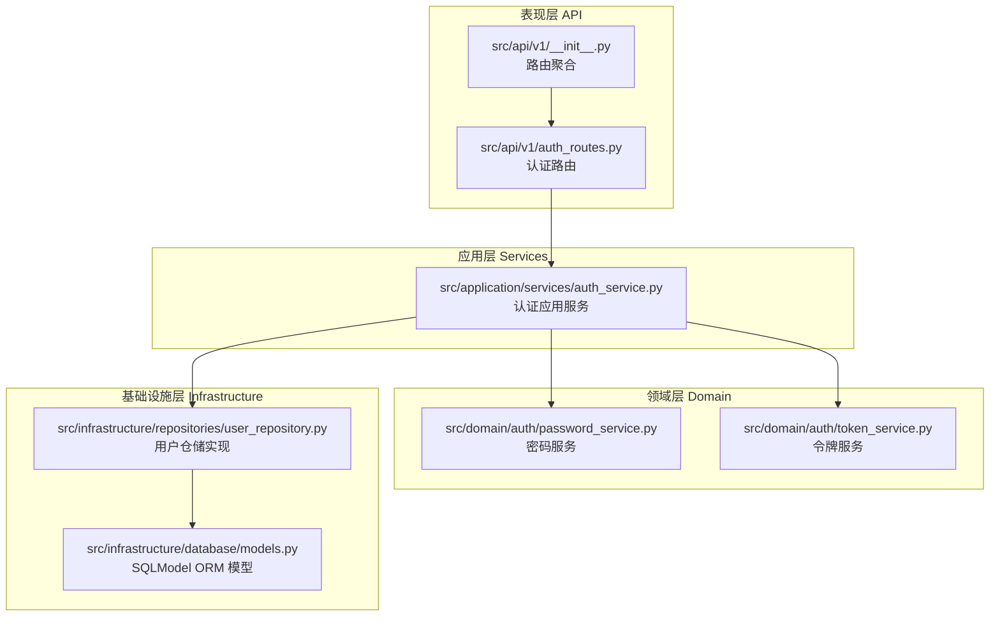
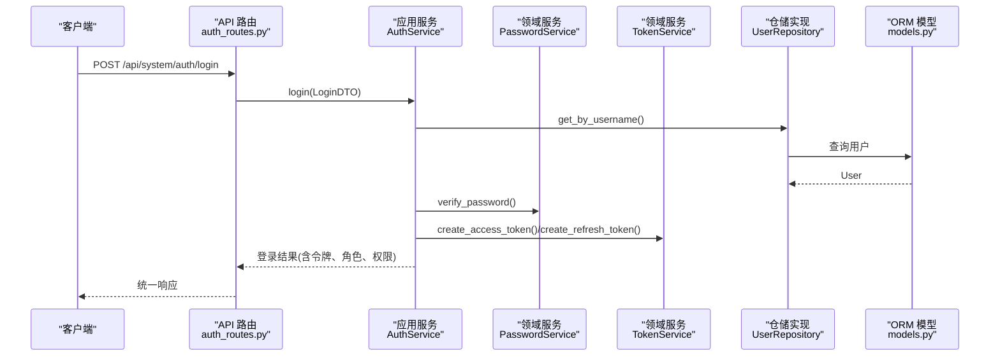
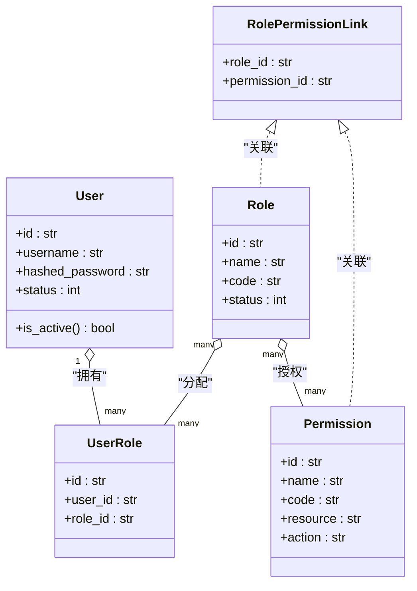
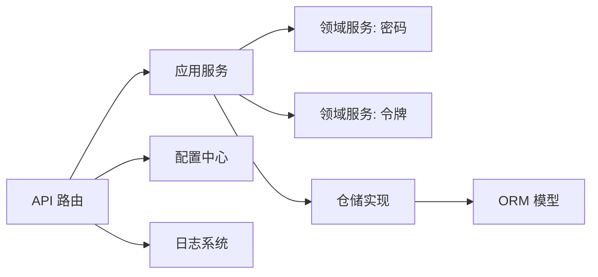

# 后端架构设计

<cite>
**本文引用的文件**
- [service/src/main.py](file://service/src/main.py)
- [service/pyproject.toml](file://service/pyproject.toml)
- [service/README.md](file://service/README.md)
- [service/src/config/settings.py](file://service/src/config/settings.py)
- [service/src/config/asgi.py](file://service/src/config/asgi.py)
- [service/src/core/constants.py](file://service/src/core/constants.py)
- [service/src/core/exceptions.py](file://service/src/core/exceptions.py)
- [service/src/core/logger.py](file://service/src/core/logger.py)
- [service/src/api/v1/__init__.py](file://service/src/api/v1/__init__.py)
- [service/src/api/v1/auth_routes.py](file://service/src/api/v1/auth_routes.py)
- [service/src/application/services/auth_service.py](file://service/src/application/services/auth_service.py)
- [service/src/domain/auth/password_service.py](file://service/src/domain/auth/password_service.py)
- [service/src/domain/auth/token_service.py](file://service/src/domain/auth/token_service.py)
- [service/src/infrastructure/database/models.py](file://service/src/infrastructure/database/models.py)
- [service/src/infrastructure/repositories/user_repository.py](file://service/src/infrastructure/repositories/user_repository.py)
</cite>

## 目录
1. [引言](#引言)
2. [项目结构](#项目结构)
3. [核心组件](#核心组件)
4. [架构总览](#架构总览)
5. [详细组件分析](#详细组件分析)
6. [依赖分析](#依赖分析)
7. [性能考虑](#性能考虑)
8. [故障排查指南](#故障排查指南)
9. [结论](#结论)
10. [附录](#附录)

## 引言
本文件面向 Hello-FastApi 后端，系统化阐述基于 DDD（领域驱动设计）的四层架构：表现层（API）、应用层（Services）、领域层（Business Logic）、基础设施层（Data Access）。文档聚焦于各层职责、依赖关系与交互模式，总结模块组织策略与代码结构，并结合实际源码路径给出架构决策的技术考量与权衡。

## 项目结构
后端采用“按层分包”的组织方式，核心目录如下：
- 表现层：src/api/v1（路由与依赖）
- 应用层：src/application/services（应用服务编排）
- 领域层：src/domain/auth（领域服务：密码、令牌）
- 基础设施层：src/infrastructure/database、src/infrastructure/repositories（ORM 模型与仓储实现）

图表来源
- [service/src/api/v1/__init__.py:1-41](file://service/src/api/v1/__init__.py#L1-L41)
- [service/src/api/v1/auth_routes.py:1-86](file://service/src/api/v1/auth_routes.py#L1-L86)
- [service/src/application/services/auth_service.py:1-154](file://service/src/application/services/auth_service.py#L1-L154)
- [service/src/domain/auth/password_service.py:1-21](file://service/src/domain/auth/password_service.py#L1-L21)
- [service/src/domain/auth/token_service.py:1-45](file://service/src/domain/auth/token_service.py#L1-L45)
- [service/src/infrastructure/database/models.py:1-193](file://service/src/infrastructure/database/models.py#L1-L193)
- [service/src/infrastructure/repositories/user_repository.py:1-185](file://service/src/infrastructure/repositories/user_repository.py#L1-L185)

章节来源
- [service/README.md:27-93](file://service/README.md#L27-L93)
- [service/src/api/v1/__init__.py:1-41](file://service/src/api/v1/__init__.py#L1-L41)
- [service/src/api/v1/auth_routes.py:1-86](file://service/src/api/v1/auth_routes.py#L1-L86)
- [service/src/application/services/auth_service.py:1-154](file://service/src/application/services/auth_service.py#L1-L154)
- [service/src/domain/auth/password_service.py:1-21](file://service/src/domain/auth/password_service.py#L1-L21)
- [service/src/domain/auth/token_service.py:1-45](file://service/src/domain/auth/token_service.py#L1-L45)
- [service/src/infrastructure/database/models.py:1-193](file://service/src/infrastructure/database/models.py#L1-L193)
- [service/src/infrastructure/repositories/user_repository.py:1-185](file://service/src/infrastructure/repositories/user_repository.py#L1-L185)

## 核心组件
- 应用入口与生命周期：src/main.py 提供应用工厂、CORS、全局中间件、异常处理、健康检查与路由注册。
- 配置中心：src/config/settings.py 支持多环境配置（development/production/testing），并提供缓存实例。
- 常量与默认值：src/core/constants.py 定义 API 前缀、分页参数与 RBAC 默认角色/权限。
- 异常体系：src/core/exceptions.py 定义统一业务异常基类与各类异常。
- 日志系统：src/core/logger.py 使用 loguru 统一输出到控制台、应用日志、错误日志与访问日志。
- ASGI 入口：src/config/asgi.py 用于生产部署。

章节来源
- [service/src/main.py:1-96](file://service/src/main.py#L1-L96)
- [service/src/config/settings.py:1-198](file://service/src/config/settings.py#L1-L198)
- [service/src/core/constants.py:1-37](file://service/src/core/constants.py#L1-L37)
- [service/src/core/exceptions.py:1-60](file://service/src/core/exceptions.py#L1-L60)
- [service/src/core/logger.py:1-117](file://service/src/core/logger.py#L1-L117)
- [service/src/config/asgi.py:1-6](file://service/src/config/asgi.py#L1-L6)

## 架构总览
本项目遵循 DDD 四层架构，强调“用例编排在应用层，业务规则在领域层，持久化在基础设施层，接口在表现层”。核心交互链路如下：

图表来源
- [service/src/api/v1/auth_routes.py:19-34](file://service/src/api/v1/auth_routes.py#L19-L34)
- [service/src/application/services/auth_service.py:26-74](file://service/src/application/services/auth_service.py#L26-L74)
- [service/src/domain/auth/password_service.py:18-21](file://service/src/domain/auth/password_service.py#L18-L21)
- [service/src/domain/auth/token_service.py:14-30](file://service/src/domain/auth/token_service.py#L14-L30)
- [service/src/infrastructure/repositories/user_repository.py:17-25](file://service/src/infrastructure/repositories/user_repository.py#L17-L25)
- [service/src/infrastructure/database/models.py:31-64](file://service/src/infrastructure/database/models.py#L31-L64)

## 详细组件分析

### 表现层（API）
- 职责：暴露 REST 接口、参数绑定、调用应用服务、返回统一响应。
- 关键点：
  - 路由聚合：src/api/v1/__init__.py 将认证、用户、角色、权限、菜单路由整合到 system_router。
  - 认证路由：src/api/v1/auth_routes.py 提供登录、注册、登出、刷新等接口，依赖数据库会话与当前用户依赖。
  - 统一响应：通过 src/api/common（未展开）封装 success_response，确保响应格式一致。
- 交互模式：API 路由 → 应用服务 → 领域服务/仓储 → ORM 模型。

章节来源
- [service/src/api/v1/__init__.py:1-41](file://service/src/api/v1/__init__.py#L1-L41)
- [service/src/api/v1/auth_routes.py:1-86](file://service/src/api/v1/auth_routes.py#L1-L86)

### 应用层（Services）
- 职责：编排业务用例、协调领域服务与仓储、处理事务边界。
- 关键点：
  - 认证应用服务：src/application/services/auth_service.py 负责登录校验、注册、令牌刷新；组合 PasswordService、TokenService、UserRepository、RoleRepository、PermissionRepository。
  - DTO 依赖：src/application/dto/*（未展开）承载请求/响应数据结构。
- 交互模式：应用服务 → 领域服务（密码/令牌）+ 仓储（用户/角色/权限）。

章节来源
- [service/src/application/services/auth_service.py:1-154](file://service/src/application/services/auth_service.py#L1-L154)

### 领域层（Business Logic）
- 职责：封装核心业务规则与不变量，保证跨用例的一致性。
- 关键点：
  - 密码服务：src/domain/auth/password_service.py 使用 bcrypt 进行哈希与校验。
  - 令牌服务：src/domain/auth/token_service.py 使用 python-jose 管理 JWT 的生成、解码与类型校验。
- 交互模式：应用服务调用领域服务执行业务规则，不直接访问数据库。

章节来源
- [service/src/domain/auth/password_service.py:1-21](file://service/src/domain/auth/password_service.py#L1-L21)
- [service/src/domain/auth/token_service.py:1-45](file://service/src/domain/auth/token_service.py#L1-L45)

### 基础设施层（Data Access）
- 职责：提供数据持久化能力，屏蔽数据库差异。
- 关键点：
  - ORM 模型：src/infrastructure/database/models.py 使用 SQLModel 定义用户、角色、权限、菜单、IP 规则等实体及关系。
  - 仓储实现：src/infrastructure/repositories/user_repository.py 实现用户 CRUD、筛选、分页、状态变更、密码重置等。
  - 依赖注入：API 路由通过依赖 get_db 获取 AsyncSession，应用服务接收 AsyncSession 并注入到仓储。
- 交互模式：仓储 → ORM 模型；应用服务持有 AsyncSession，确保事务一致性。

图表来源
- [service/src/infrastructure/database/models.py:31-141](file://service/src/infrastructure/database/models.py#L31-L141)

章节来源
- [service/src/infrastructure/database/models.py:1-193](file://service/src/infrastructure/database/models.py#L1-L193)
- [service/src/infrastructure/repositories/user_repository.py:1-185](file://service/src/infrastructure/repositories/user_repository.py#L1-L185)

### 配置与运行时
- 配置加载：src/config/settings.py 支持 development/production/testing 三套配置，按优先级合并覆盖。
- 生命周期：src/main.py 使用 lifespan 管理数据库初始化与关闭。
- ASGI：src/config/asgi.py 暴露 application 供生产部署使用。

章节来源
- [service/src/config/settings.py:1-198](file://service/src/config/settings.py#L1-L198)
- [service/src/main.py:19-32](file://service/src/main.py#L19-L32)
- [service/src/config/asgi.py:1-6](file://service/src/config/asgi.py#L1-L6)

## 依赖分析
- 层内依赖方向：API → 应用层 → 领域层/仓储 → ORM 模型
- 外部依赖：FastAPI、SQLModel、aiosqlite/asyncpg、Redis、bcrypt、python-jose、loguru、httpx 等。
- 依赖注入：API 路由通过依赖 get_db 获取 AsyncSession；应用服务接收 Session 并注入仓储。

图表来源
- [service/src/api/v1/auth_routes.py:1-86](file://service/src/api/v1/auth_routes.py#L1-L86)
- [service/src/application/services/auth_service.py:1-154](file://service/src/application/services/auth_service.py#L1-L154)
- [service/src/domain/auth/password_service.py:1-21](file://service/src/domain/auth/password_service.py#L1-L21)
- [service/src/domain/auth/token_service.py:1-45](file://service/src/domain/auth/token_service.py#L1-L45)
- [service/src/infrastructure/repositories/user_repository.py:1-185](file://service/src/infrastructure/repositories/user_repository.py#L1-L185)
- [service/src/infrastructure/database/models.py:1-193](file://service/src/infrastructure/database/models.py#L1-L193)
- [service/src/config/settings.py:1-198](file://service/src/config/settings.py#L1-L198)
- [service/src/core/logger.py:1-117](file://service/src/core/logger.py#L1-L117)

章节来源
- [service/pyproject.toml:1-76](file://service/pyproject.toml#L1-L76)
- [service/src/api/v1/auth_routes.py:1-86](file://service/src/api/v1/auth_routes.py#L1-L86)
- [service/src/application/services/auth_service.py:1-154](file://service/src/application/services/auth_service.py#L1-L154)
- [service/src/infrastructure/repositories/user_repository.py:1-185](file://service/src/infrastructure/repositories/user_repository.py#L1-L185)
- [service/src/infrastructure/database/models.py:1-193](file://service/src/infrastructure/database/models.py#L1-L193)
- [service/src/config/settings.py:1-198](file://service/src/config/settings.py#L1-L198)
- [service/src/core/logger.py:1-117](file://service/src/core/logger.py#L1-L117)

## 性能考虑
- 异步与并发：全链路采用 async/await，数据库访问基于 SQLModel AsyncIO，适合高并发场景。
- 事务边界：应用服务持有 AsyncSession，建议将一次业务用例内的多个仓储操作放在同一事务中，减少锁竞争与不一致风险。
- 日志与监控：统一使用 loguru 输出访问日志，便于性能观测与问题定位。
- 缓存：Redis 已作为依赖引入，可在应用层或基础设施层扩展缓存策略（如热点数据、令牌黑名单）。
- 分页与查询：仓储实现支持筛选与分页，建议在高频查询上建立合适索引（如用户名、邮箱、角色关联表）。

## 故障排查指南
- 统一异常处理：src/main.py 注册了 AppException、RequestValidationError、Exception 的全局处理器，返回标准化错误结构。
- 业务异常：src/core/exceptions.py 定义了 NotFoundError、ConflictError、UnauthorizedError、ForbiddenError、ValidationError、RateLimitError、BusinessError 等，便于快速定位问题类型。
- 日志：src/core/logger.py 将访问日志、错误日志、应用日志分别落盘，可通过 logs 目录排查问题。
- 健康检查：src/main.py 提供 /health 接口，可用于容器编排与负载均衡探活。

章节来源
- [service/src/main.py:60-82](file://service/src/main.py#L60-L82)
- [service/src/core/exceptions.py:1-60](file://service/src/core/exceptions.py#L1-L60)
- [service/src/core/logger.py:75-114](file://service/src/core/logger.py#L75-L114)

## 结论
本项目以 DDD 四层架构为核心，清晰分离关注点：表现层专注接口契约，应用层编排业务流程，领域层沉淀不变量，基础设施层屏蔽数据访问细节。配合多环境配置、统一异常与日志体系，形成可维护、可扩展、可观测的后端架构。建议在后续迭代中：
- 在应用层增加更细粒度的用例编排与事务边界控制；
- 在基础设施层补充缓存与事件发布/订阅；
- 在领域层持续提炼核心规则，避免应用层“贫血”。

## 附录
- 项目技术栈与环境配置参见 README 与 pyproject.toml。
- 配置加载顺序与环境切换参见 src/config/settings.py。
- ASGI 生产入口参见 src/config/asgi.py。

章节来源
- [service/README.md:15-259](file://service/README.md#L15-L259)
- [service/pyproject.toml:1-76](file://service/pyproject.toml#L1-L76)
- [service/src/config/asgi.py:1-6](file://service/src/config/asgi.py#L1-L6)