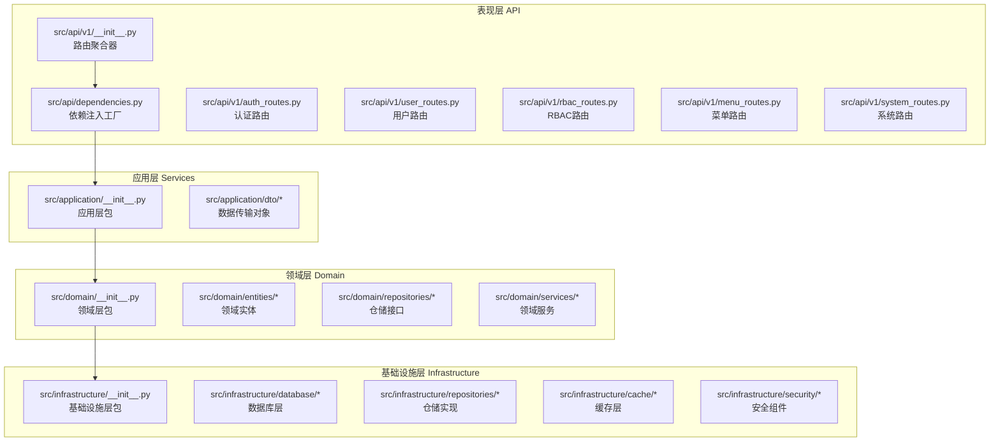
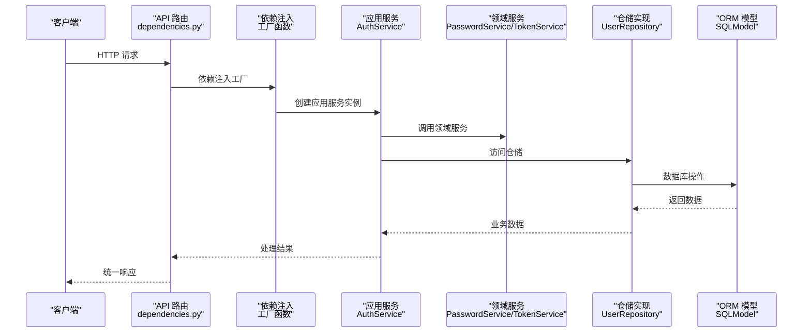
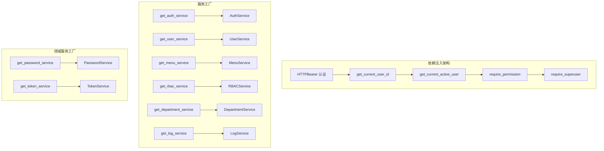
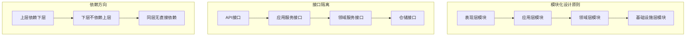
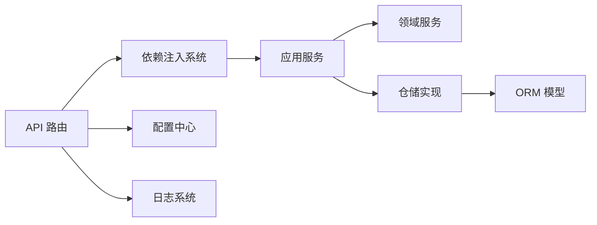

# 后端架构设计

<cite>
**本文档引用的文件**
- [service/src/main.py](file://service/src/main.py)
- [service/src/config/settings.py](file://service/src/config/settings.py)
- [service/src/api/v1/__init__.py](file://service/src/api/v1/__init__.py)
- [service/src/api/dependencies.py](file://service/src/api/dependencies.py)
- [service/src/domain/__init__.py](file://service/src/domain/__init__.py)
- [service/src/application/__init__.py](file://service/src/application/__init__.py)
- [service/src/infrastructure/__init__.py](file://service/src/infrastructure/__init__.py)
</cite>

## 更新摘要
**所做更改**
- 更新架构概述以反映完整的DDD分层架构重构
- 新增依赖注入系统和模块化设计的详细说明
- 重新组织架构层次结构以体现新的分层设计
- 更新组件交互模式以反映依赖注入机制
- 增强模块化设计原则和包组织策略

## 目录
1. [引言](#引言)
2. [项目结构](#项目结构)
3. [核心组件](#核心组件)
4. [架构总览](#架构总览)
5. [详细组件分析](#详细组件分析)
6. [依赖注入系统](#依赖注入系统)
7. [模块化设计](#模块化设计)
8. [依赖分析](#依赖分析)
9. [性能考虑](#性能考虑)
10. [故障排查指南](#故障排查指南)
11. [结论](#结论)
12. [附录](#附录)

## 引言
本文档面向 Hello-FastApi 后端，系统化阐述基于 DDD（领域驱动设计）的完整四层架构：表现层（API）、应用层（Services）、领域层（Business Logic）、基础设施层（Data Access）。经过整体架构重构，项目现已实现完整的依赖注入系统和模块化设计，强调"用例编排在应用层，业务规则在领域层，持久化在基础设施层，接口在表现层"的设计原则。

## 项目结构
后端采用"按层分包"的组织方式，结合依赖注入系统，核心目录结构如下：

**图表来源**
- [service/src/api/v1/__init__.py:1-46](file://service/src/api/v1/__init__.py#L1-L46)
- [service/src/api/dependencies.py:1-191](file://service/src/api/dependencies.py#L1-L191)
- [service/src/domain/__init__.py:1-42](file://service/src/domain/__init__.py#L1-L42)
- [service/src/application/__init__.py:1-2](file://service/src/application/__init__.py#L1-L2)
- [service/src/infrastructure/__init__.py:1-2](file://service/src/infrastructure/__init__.py#L1-L2)

**章节来源**
- [service/src/api/v1/__init__.py:1-46](file://service/src/api/v1/__init__.py#L1-L46)
- [service/src/api/dependencies.py:1-191](file://service/src/api/dependencies.py#L1-L191)
- [service/src/domain/__init__.py:1-42](file://service/src/domain/__init__.py#L1-L42)
- [service/src/application/__init__.py:1-2](file://service/src/application/__init__.py#L1-L2)
- [service/src/infrastructure/__init__.py:1-2](file://service/src/infrastructure/__init__.py#L1-L2)

## 核心组件
- **应用入口与生命周期**：src/main.py 提供应用工厂、CORS、全局中间件、异常处理、健康检查与路由注册。
- **配置中心**：src/config/settings.py 支持多环境配置（development/production/testing），并提供缓存实例。
- **依赖注入系统**：src/api/dependencies.py 实现完整的依赖注入工厂，遵循依赖倒置原则。
- **路由聚合器**：src/api/v1/__init__.py 负责聚合所有系统级别的 API 路由。
- **领域层导出**：src/domain/__init__.py 统一导出领域实体、仓储接口和领域服务。

**章节来源**
- [service/src/main.py:1-73](file://service/src/main.py#L1-L73)
- [service/src/config/settings.py:1-188](file://service/src/config/settings.py#L1-L188)
- [service/src/api/dependencies.py:1-191](file://service/src/api/dependencies.py#L1-L191)
- [service/src/api/v1/__init__.py:1-46](file://service/src/api/v1/__init__.py#L1-L46)
- [service/src/domain/__init__.py:1-42](file://service/src/domain/__init__.py#L1-L42)

## 架构总览
经过重构后的项目采用完整的DDD四层架构，强调模块间的清晰边界和依赖倒置原则。核心交互链路如下：

**图表来源**
- [service/src/api/dependencies.py:114-122](file://service/src/api/dependencies.py#L114-L122)
- [service/src/api/dependencies.py:36-47](file://service/src/api/dependencies.py#L36-L47)
- [service/src/api/dependencies.py:41-47](file://service/src/api/dependencies.py#L41-L47)

## 详细组件分析

### 表现层（API）
- **职责**：暴露REST接口、参数绑定、依赖注入、调用应用服务、返回统一响应。
- **关键特性**：
  - **路由聚合**：src/api/v1/__init__.py 将认证、用户、角色、权限、菜单路由整合到 system_router。
  - **依赖注入**：src/api/dependencies.py 提供完整的依赖注入工厂，实现依赖倒置原则。
  - **认证中间件**：通过HTTPBearer方案实现JWT令牌验证和权限检查。
- **交互模式**：API路由 → 依赖注入工厂 → 应用服务 → 领域服务/仓储 → ORM模型。

**章节来源**
- [service/src/api/v1/__init__.py:1-46](file://service/src/api/v1/__init__.py#L1-L46)
- [service/src/api/dependencies.py:1-191](file://service/src/api/dependencies.py#L1-L191)

### 应用层（Services）
- **职责**：编排业务用例、协调领域服务与仓储、处理事务边界、实现业务规则。
- **关键特性**：
  - **服务工厂**：通过依赖注入系统创建应用服务实例。
  - **DTO管理**：src/application/dto/ 包含完整的数据传输对象定义。
  - **业务编排**：协调领域服务和仓储实现复杂的业务流程。
- **交互模式**：应用服务 → 领域服务（密码/令牌）+ 仓储（用户/角色/权限）。

**章节来源**
- [service/src/application/__init__.py:1-2](file://service/src/application/__init__.py#L1-L2)

### 领域层（Business Logic）
- **职责**：封装核心业务规则与不变量，保证跨用例的一致性，完全独立于外部层。
- **关键特性**：
  - **实体定义**：领域实体定义业务核心概念和行为。
  - **仓储接口**：定义抽象的仓储接口，隔离业务逻辑与数据访问。
  - **领域服务**：密码服务和令牌服务等核心业务逻辑。
- **交互模式**：应用服务调用领域服务执行业务规则，不直接访问数据库。

**章节来源**
- [service/src/domain/__init__.py:1-42](file://service/src/domain/__init__.py#L1-L42)

### 基础设施层（Data Access）
- **职责**：提供数据持久化能力，屏蔽数据库差异，实现仓储接口。
- **关键特性**：
  - **仓储实现**：实现领域层定义的仓储接口。
  - **数据库抽象**：使用SQLModel提供异步数据库访问。
  - **缓存集成**：Redis缓存客户端集成。
- **交互模式**：仓储 → ORM模型；应用服务持有AsyncSession，确保事务一致性。

**章节来源**
- [service/src/infrastructure/__init__.py:1-2](file://service/src/infrastructure/__init__.py#L1-L2)

## 依赖注入系统
项目实现了完整的依赖注入系统，遵循依赖倒置原则，实现松耦合的架构设计：

### 依赖注入架构

**图表来源**
- [service/src/api/dependencies.py:55-106](file://service/src/api/dependencies.py#L55-L106)
- [service/src/api/dependencies.py:114-170](file://service/src/api/dependencies.py#L114-L170)
- [service/src/api/dependencies.py:36-47](file://service/src/api/dependencies.py#L36-L47)

### 核心依赖注入特性
- **认证依赖**：get_current_user_id、get_current_active_user 实现JWT令牌验证和用户状态检查。
- **权限控制**：require_permission 和 require_superuser 提供细粒度的权限控制。
- **服务工厂**：各种get_*_service工厂函数创建应用服务实例。
- **领域服务**：get_password_service、get_token_service提供领域服务实例。

**章节来源**
- [service/src/api/dependencies.py:1-191](file://service/src/api/dependencies.py#L1-L191)

## 模块化设计
项目采用严格的模块化设计，每个层都有明确的职责边界和清晰的接口定义：

### 模块化架构

**图表来源**
- [service/src/domain/__init__.py:12-41](file://service/src/domain/__init__.py#L12-L41)

### 模块化特性
- **接口导出**：每个层通过__init__.py文件统一导出公共接口。
- **包组织**：严格按照DDD四层架构组织包结构。
- **依赖倒置**：上层依赖抽象接口，下层实现具体功能。
- **单一职责**：每个模块专注于特定领域的功能实现。

**章节来源**
- [service/src/domain/__init__.py:1-42](file://service/src/domain/__init__.py#L1-L42)

## 依赖分析
- **层内依赖方向**：API → 应用层 → 领域层/仓储 → ORM模型
- **依赖注入依赖**：API路由通过依赖注入系统获取应用服务实例
- **外部依赖**：FastAPI、SQLModel、aiosqlite/asyncpg、Redis、bcrypt、python-jose、loguru、httpx等
- **模块依赖**：严格遵循DDD四层架构的依赖方向

**图表来源**
- [service/src/api/dependencies.py:114-122](file://service/src/api/dependencies.py#L114-L122)
- [service/src/config/settings.py:176-187](file://service/src/config/settings.py#L176-L187)

**章节来源**
- [service/src/api/dependencies.py:1-191](file://service/src/api/dependencies.py#L1-L191)
- [service/src/config/settings.py:1-188](file://service/src/config/settings.py#L1-L188)

## 性能考虑
- **异步与并发**：全链路采用async/await，数据库访问基于SQLModel AsyncIO，适合高并发场景。
- **依赖注入优化**：通过工厂函数和缓存机制减少对象创建开销。
- **事务边界**：应用服务持有AsyncSession，建议将一次业务用例内的多个仓储操作放在同一事务中。
- **缓存策略**：Redis缓存集成，可在应用层或基础设施层扩展缓存策略。
- **模块化优势**：清晰的模块边界便于性能优化和资源管理。

## 故障排查指南
- **统一异常处理**：src/main.py注册了AppException、RequestValidationError、Exception的全局处理器。
- **依赖注入调试**：通过依赖注入工厂函数检查服务实例创建和注入过程。
- **配置验证**：src/config/settings.py提供多环境配置验证和错误处理。
- **日志系统**：统一使用loguru输出访问日志、错误日志和应用日志。

**章节来源**
- [service/src/main.py:46-59](file://service/src/main.py#L46-L59)
- [service/src/api/dependencies.py:1-191](file://service/src/api/dependencies.py#L1-L191)
- [service/src/config/settings.py:84-92](file://service/src/config/settings.py#L84-L92)

## 结论
经过重构的Hello-FastApi项目现已实现完整的DDD四层架构，结合依赖注入系统和模块化设计，形成了清晰、可维护、可扩展的后端架构。新架构的优势包括：

- **清晰的职责分离**：表现层专注接口契约，应用层编排业务流程，领域层沉淀不变量，基础设施层屏蔽数据访问细节。
- **依赖注入优势**：实现松耦合设计，便于单元测试和功能扩展。
- **模块化设计**：严格的包组织和接口定义，提高代码可维护性。
- **配置管理**：多环境配置支持，便于不同部署环境的管理。

建议在后续迭代中：
- 在应用层增加更细粒度的用例编排与事务边界控制
- 扩展依赖注入容器，支持更多服务类型的注入
- 完善领域层的核心业务规则提炼
- 增强基础设施层的缓存和事件发布/订阅机制

## 附录
- **项目技术栈**：FastAPI + DDD + RBAC + SQLModel + Redis
- **配置管理**：多环境配置支持和缓存机制
- **依赖注入**：完整的工厂函数和依赖管理
- **模块化**：严格的DDD四层架构实现

**章节来源**
- [service/src/main.py:1-73](file://service/src/main.py#L1-L73)
- [service/src/config/settings.py:1-188](file://service/src/config/settings.py#L1-L188)
- [service/src/api/dependencies.py:1-191](file://service/src/api/dependencies.py#L1-L191)
- [service/src/domain/__init__.py:1-42](file://service/src/domain/__init__.py#L1-L42)