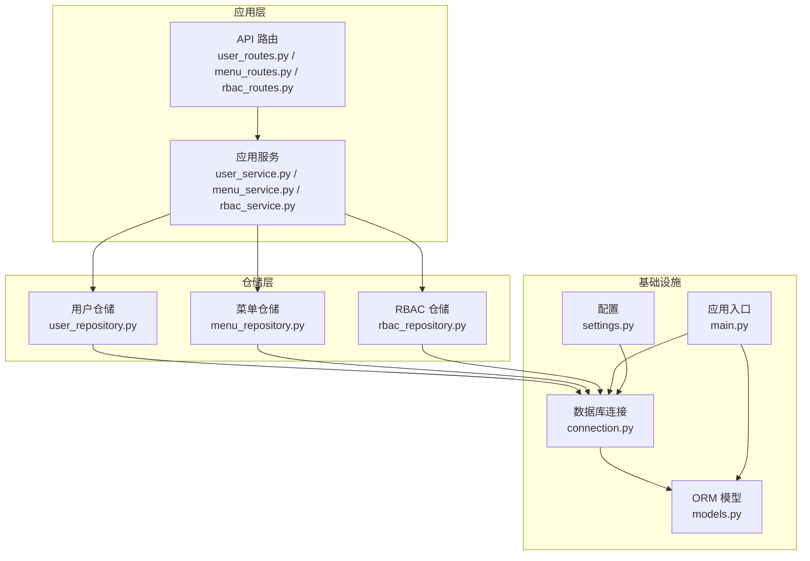
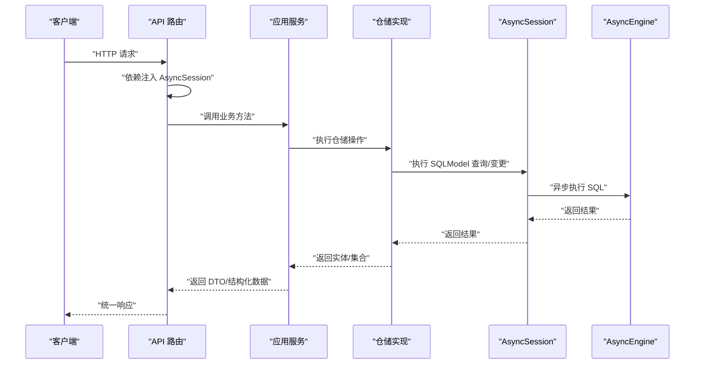
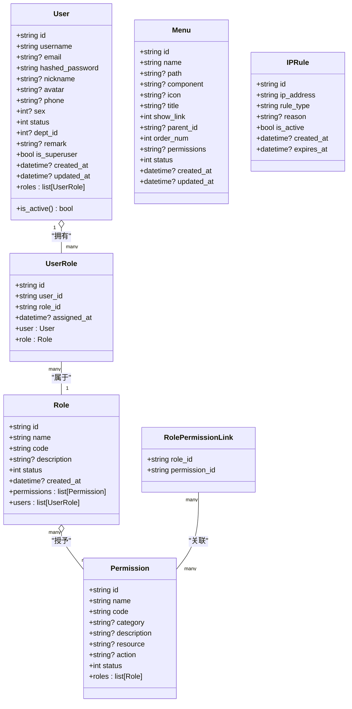
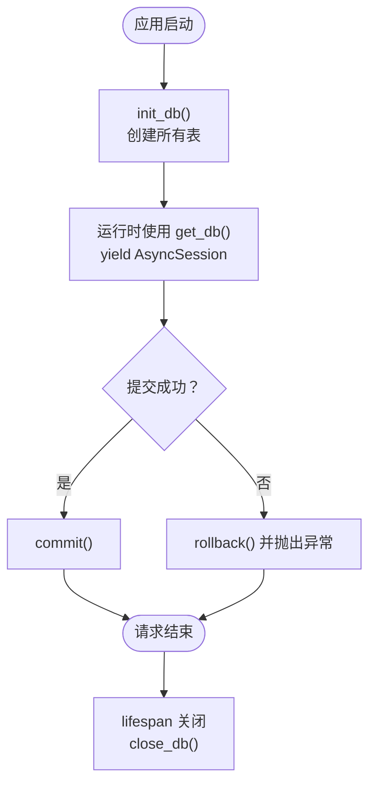
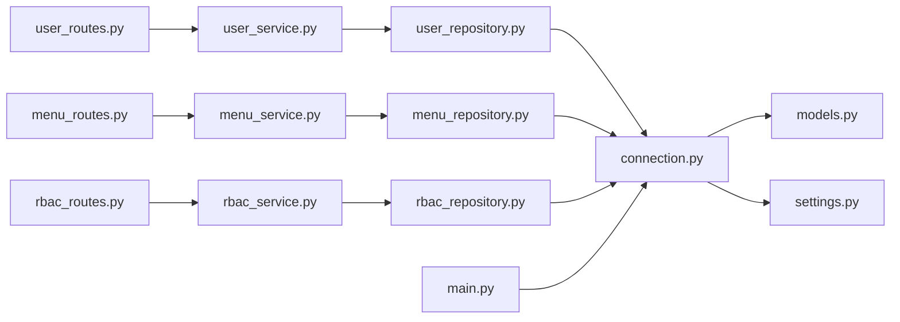

# 数据库设计与连接

<cite>
**本文引用的文件**
- [models.py](file://service/src/infrastructure/database/models.py)
- [connection.py](file://service/src/infrastructure/database/connection.py)
- [settings.py](file://service/src/config/settings.py)
- [user_repository.py](file://service/src/infrastructure/repositories/user_repository.py)
- [menu_repository.py](file://service/src/infrastructure/repositories/menu_repository.py)
- [rbac_repository.py](file://service/src/infrastructure/repositories/rbac_repository.py)
- [user_service.py](file://service/src/application/services/user_service.py)
- [menu_service.py](file://service/src/application/services/menu_service.py)
- [rbac_service.py](file://service/src/application/services/rbac_service.py)
- [user_routes.py](file://service/src/api/v1/user_routes.py)
- [menu_routes.py](file://service/src/api/v1/menu_routes.py)
- [rbac_routes.py](file://service/src/api/v1/rbac_routes.py)
- [main.py](file://service/src/main.py)
- [pyproject.toml](file://service/pyproject.toml)
</cite>

## 目录
1. [简介](#简介)
2. [项目结构](#项目结构)
3. [核心组件](#核心组件)
4. [架构总览](#架构总览)
5. [详细组件分析](#详细组件分析)
6. [依赖关系分析](#依赖关系分析)
7. [性能考量](#性能考量)
8. [故障排查指南](#故障排查指南)
9. [结论](#结论)
10. [附录](#附录)

## 简介
本文件面向 Hello-FastApi 的数据库设计与实现，围绕 SQLModel ORM 模型、数据库连接与会话管理、表结构与关系映射、异步数据库操作与性能优化、索引与约束设计、以及迁移与版本管理策略进行系统化技术说明。文档同时提供模型类图、调用序列图与流程图，帮助开发者快速理解并高效、可靠地使用数据库层。

## 项目结构
数据库相关的核心位置集中在 service/src/infrastructure/database 与 service/src/infrastructure/repositories，配合应用层服务与 API 路由形成清晰的分层架构。关键文件职责如下：
- models.py：定义 SQLModel ORM 模型（用户、角色、权限、菜单、IP 规则等）
- connection.py：异步引擎、会话依赖与初始化/关闭流程
- settings.py：数据库连接字符串与环境配置
- repositories/*：各领域仓储的 SQLModel 实现
- application/services/*：应用服务封装业务逻辑
- api/v1/*：API 路由接入，注入会话并调用服务
- main.py：应用生命周期中初始化数据库表

图表来源
- [user_routes.py:1-252](file://service/src/api/v1/user_routes.py#L1-L252)
- [menu_routes.py:1-71](file://service/src/api/v1/menu_routes.py#L1-L71)
- [rbac_routes.py:1-257](file://service/src/api/v1/rbac_routes.py#L1-L257)
- [user_service.py:1-322](file://service/src/application/services/user_service.py#L1-L322)
- [menu_service.py:1-169](file://service/src/application/services/menu_service.py#L1-L169)
- [rbac_service.py:1-231](file://service/src/application/services/rbac_service.py#L1-L231)
- [user_repository.py:1-185](file://service/src/infrastructure/repositories/user_repository.py#L1-L185)
- [menu_repository.py:1-50](file://service/src/infrastructure/repositories/menu_repository.py#L1-L50)
- [rbac_repository.py:1-213](file://service/src/infrastructure/repositories/rbac_repository.py#L1-L213)
- [connection.py:1-35](file://service/src/infrastructure/database/connection.py#L1-L35)
- [models.py:1-193](file://service/src/infrastructure/database/models.py#L1-L193)
- [settings.py:1-198](file://service/src/config/settings.py#L1-L198)
- [main.py:1-96](file://service/src/main.py#L1-L96)

章节来源
- [models.py:1-193](file://service/src/infrastructure/database/models.py#L1-L193)
- [connection.py:1-35](file://service/src/infrastructure/database/connection.py#L1-L35)
- [settings.py:1-198](file://service/src/config/settings.py#L1-L198)
- [main.py:1-96](file://service/src/main.py#L1-L96)

## 核心组件
- SQLModel ORM 模型：统一了 SQLAlchemy ORM 与 Pydantic 数据模型，减少重复定义，提升类型安全与序列化效率。
- 异步连接与会话：基于 SQLAlchemy AsyncEngine 与 SQLModel AsyncSession，提供依赖注入与自动事务提交/回滚。
- 仓储实现：每个领域（用户、菜单、RBAC）提供独立仓储，封装 CRUD 与复杂查询。
- 应用服务：聚合仓储与业务规则，对外暴露领域操作。
- API 路由：通过依赖注入获取会话，调用应用服务，返回统一响应。

章节来源
- [models.py:1-193](file://service/src/infrastructure/database/models.py#L1-L193)
- [connection.py:1-35](file://service/src/infrastructure/database/connection.py#L1-L35)
- [user_repository.py:1-185](file://service/src/infrastructure/repositories/user_repository.py#L1-L185)
- [menu_repository.py:1-50](file://service/src/infrastructure/repositories/menu_repository.py#L1-L50)
- [rbac_repository.py:1-213](file://service/src/infrastructure/repositories/rbac_repository.py#L1-L213)
- [user_service.py:1-322](file://service/src/application/services/user_service.py#L1-L322)
- [menu_service.py:1-169](file://service/src/application/services/menu_service.py#L1-L169)
- [rbac_service.py:1-231](file://service/src/application/services/rbac_service.py#L1-L231)
- [user_routes.py:1-252](file://service/src/api/v1/user_routes.py#L1-L252)
- [menu_routes.py:1-71](file://service/src/api/v1/menu_routes.py#L1-L71)
- [rbac_routes.py:1-257](file://service/src/api/v1/rbac_routes.py#L1-L257)

## 架构总览
异步数据库访问的端到端流程如下：API 路由接收请求，注入 AsyncSession，调用应用服务；应用服务通过仓储执行 SQLModel 查询；仓储使用 select/merge/delete 等原生 SQLModel 语法与 SQLAlchemy 异步能力完成持久化；最终返回统一响应。

图表来源
- [user_routes.py:27-51](file://service/src/api/v1/user_routes.py#L27-L51)
- [menu_routes.py:19-26](file://service/src/api/v1/menu_routes.py#L19-L26)
- [rbac_routes.py:33-61](file://service/src/api/v1/rbac_routes.py#L33-L61)
- [user_service.py:80-113](file://service/src/application/services/user_service.py#L80-L113)
- [menu_service.py:22-25](file://service/src/application/services/menu_service.py#L22-L25)
- [rbac_service.py:58-77](file://service/src/application/services/rbac_service.py#L58-L77)
- [user_repository.py:32-75](file://service/src/infrastructure/repositories/user_repository.py#L32-L75)
- [menu_repository.py:13-16](file://service/src/infrastructure/repositories/menu_repository.py#L13-L16)
- [rbac_repository.py:32-47](file://service/src/infrastructure/repositories/rbac_repository.py#L32-L47)
- [connection.py:12-21](file://service/src/infrastructure/database/connection.py#L12-L21)

## 详细组件分析

### SQLModel 模型设计与继承关系
- 统一基类：所有模型均继承自 SQLModel，并标记 table=True 以生成表结构。
- 主键与唯一性：多数主键采用 UUID 字符串类型，长度限制在 36；部分字段通过 unique=True/索引提升检索效率。
- 时间戳：普遍使用 DateTime(timezone=True)，结合 server_default/onupdate 自动维护创建与更新时间。
- 关系映射：使用 Relationship/back_populates 建立双向关系；多对多通过 link_model 指向关联表。
- 字段类型与约束：字符串字段普遍设置 max_length；部分字段允许 NULL 并声明 nullable；布尔字段用于状态控制。

图表来源
- [models.py:17-193](file://service/src/infrastructure/database/models.py#L17-L193)

章节来源
- [models.py:17-193](file://service/src/infrastructure/database/models.py#L17-L193)

### 数据库连接与会话管理
- 引擎创建：使用 create_async_engine，基于配置中的 DATABASE_URL；开启 pool_pre_ping 提升连接可用性。
- 会话依赖：get_db 使用 AsyncSession，expire_on_commit=False，确保实体在提交后仍可使用；try/except 确保异常时回滚并重新抛出。
- 初始化与关闭：init_db 导入模型并创建所有表；close_db dispose 引擎释放资源；main.py 在 lifespan 中启动与关闭。

图表来源
- [connection.py:12-34](file://service/src/infrastructure/database/connection.py#L12-L34)
- [main.py:19-31](file://service/src/main.py#L19-L31)

章节来源
- [connection.py:1-35](file://service/src/infrastructure/database/connection.py#L1-L35)
- [settings.py:58-58](file://service/src/config/settings.py#L58-L58)
- [main.py:19-31](file://service/src/main.py#L19-L31)

### 表结构、关系与约束
- 用户表 users：主键 id，username/email 唯一且带索引；状态 status 控制启用/禁用；时间戳自动维护。
- 角色表 roles：name/code 唯一且带索引；状态 status。
- 权限表 permissions：code 唯一且带索引；category/resource/action 描述资源与动作。
- 关联表：
  - user_roles：用户-角色多对多，外键级联删除；新增 assigned_at 记录分配时间。
  - role_permissions：角色-权限多对多，外键级联删除。
- 菜单表 menus：父子关系通过 parent_id 指向自身；permissions 存储权限编码字符串，逗号分隔；排序 order_num。
- IP 规则表 ip_rules：ip_address 建有索引；rule_type 标识黑白名单；expires_at 可空。

章节来源
- [models.py:17-193](file://service/src/infrastructure/database/models.py#L17-L193)

### 异步数据库操作与性能优化
- 异步执行：所有仓储方法使用 await session.exec()/execute()，保证非阻塞。
- 查询优化：
  - 使用 select(...) 构造查询，结合 where/offset/limit 实现分页与筛选。
  - 使用 merge() 合并实体，避免重复查询；flush() 后 refresh() 获取最新状态。
  - 复杂关联查询通过 join/where 组合，减少 N+1 查询风险（Relationship 中已指定 lazy 策略）。
- 事务与一致性：get_db 依赖自动提交/回滚，确保异常时数据一致性。
- 连接池与健康检查：pool_pre_ping 提升连接可用性；建议在生产环境配置合适的连接池大小与超时。

章节来源
- [user_repository.py:17-185](file://service/src/infrastructure/repositories/user_repository.py#L17-L185)
- [menu_repository.py:13-50](file://service/src/infrastructure/repositories/menu_repository.py#L13-L50)
- [rbac_repository.py:17-213](file://service/src/infrastructure/repositories/rbac_repository.py#L17-L213)
- [connection.py:9-21](file://service/src/infrastructure/database/connection.py#L9-L21)

### 数据模型继承与字段类型选择
- 继承关系：所有模型继承 SQLModel，复用其元数据与类型系统。
- 字段类型：
  - 主键 id：UUID 字符串，长度 36。
  - 名称/编码：String，带 max_length 与唯一性约束。
  - 状态：Int（0/1），便于枚举式状态管理。
  - 时间戳：DateTime(timezone=True)，server_default/onupdate 自动维护。
  - 文本：部分字段使用 Text，支持较长描述。
- 索引设计：username/email/code/ip_address 等高频查询字段建立唯一索引或普通索引。

章节来源
- [models.py:31-193](file://service/src/infrastructure/database/models.py#L31-L193)

### 数据库迁移与版本管理策略
- 当前实现：init_db 通过 SQLModel.metadata.create_all 创建所有表，适合开发与小型项目。
- 建议策略：
  - 开发阶段：继续沿用 create_all，快速迭代。
  - 生产阶段：引入 Alembic 进行迁移管理，记录版本变更；每次结构变更需编写迁移脚本并灰度发布。
  - 配置分离：不同环境（dev/test/prod）使用不同的 DATABASE_URL 与迁移目标库。
- 版本控制：将迁移脚本纳入 Git，配合 CI/CD 自动执行迁移。

章节来源
- [connection.py:23-29](file://service/src/infrastructure/database/connection.py#L23-L29)
- [settings.py:58-58](file://service/src/config/settings.py#L58-L58)

### 查询优化技巧
- 分页与筛选：仓储中统一使用 offset/limit 与 where 条件组合，避免一次性加载全部数据。
- 去重与聚合：使用 len(result.all()) 或 count 聚合函数减少不必要的对象构造。
- 关联查询：通过 join/where 将多表查询合并为单次往返，降低网络开销。
- 缓存与热点数据：对不频繁变动的数据（如权限列表）结合 Redis 缓存，缩短查询路径。

章节来源
- [user_repository.py:32-112](file://service/src/infrastructure/repositories/user_repository.py#L32-L112)
- [rbac_repository.py:32-60](file://service/src/infrastructure/repositories/rbac_repository.py#L32-L60)

## 依赖关系分析
- 外部依赖：FastAPI、SQLModel、aiosqlite/asyncpg、Pydantic Settings。
- 内部依赖：API 路由依赖 get_db 提供会话；应用服务依赖仓储；仓储依赖 SQLModel 模型与 AsyncSession；配置提供 DATABASE_URL。

图表来源
- [user_routes.py:1-252](file://service/src/api/v1/user_routes.py#L1-L252)
- [menu_routes.py:1-71](file://service/src/api/v1/menu_routes.py#L1-L71)
- [rbac_routes.py:1-257](file://service/src/api/v1/rbac_routes.py#L1-L257)
- [user_service.py:1-322](file://service/src/application/services/user_service.py#L1-L322)
- [menu_service.py:1-169](file://service/src/application/services/menu_service.py#L1-L169)
- [rbac_service.py:1-231](file://service/src/application/services/rbac_service.py#L1-L231)
- [user_repository.py:1-185](file://service/src/infrastructure/repositories/user_repository.py#L1-L185)
- [menu_repository.py:1-50](file://service/src/infrastructure/repositories/menu_repository.py#L1-L50)
- [rbac_repository.py:1-213](file://service/src/infrastructure/repositories/rbac_repository.py#L1-L213)
- [connection.py:1-35](file://service/src/infrastructure/database/connection.py#L1-L35)
- [models.py:1-193](file://service/src/infrastructure/database/models.py#L1-L193)
- [settings.py:1-198](file://service/src/config/settings.py#L1-L198)
- [main.py:1-96](file://service/src/main.py#L1-L96)

章节来源
- [pyproject.toml:7-20](file://service/pyproject.toml#L7-L20)

## 性能考量
- 异步优先：全程使用异步引擎与会话，避免阻塞事件循环。
- 连接池：合理设置连接池大小与超时，结合 pool_pre_ping 提升稳定性。
- 查询优化：尽量使用单次 JOIN 查询替代多次往返；对高频字段建立索引。
- 事务边界：将多个写操作放入同一事务，减少锁竞争与冲突。
- 缓存策略：对只读或低频变更数据使用缓存，减轻数据库压力。

## 故障排查指南
- 连接失败：检查 DATABASE_URL 与数据库可达性；确认驱动（aiosqlite/asyncpg）已安装。
- 会话异常：get_db 会在异常时自动回滚，关注日志定位具体错误；确保依赖注入正确传递 AsyncSession。
- 表未创建：确认 init_db 在应用启动时执行；检查 SQLModel.metadata 是否包含所需模型。
- 唯一约束冲突：用户名/邮箱/角色编码/权限编码冲突时抛出业务异常，需前端提示或回退。

章节来源
- [connection.py:12-21](file://service/src/infrastructure/database/connection.py#L12-L21)
- [main.py:24-25](file://service/src/main.py#L24-L25)
- [user_service.py:37-41](file://service/src/application/services/user_service.py#L37-L41)
- [rbac_service.py:30-35](file://service/src/application/services/rbac_service.py#L30-L35)

## 结论
本项目采用 SQLModel 实现统一的 ORM 与数据模型，结合 FastAPI 异步生态，构建了清晰的分层架构。通过合理的模型设计、索引与关系映射、异步会话管理与查询优化，实现了高效、可维护的数据库访问。建议在生产环境中引入 Alembic 进行迁移管理，并结合缓存与连接池策略进一步提升性能与稳定性。

## 附录
- 模型定义示例路径：[用户模型:31-64](file://service/src/infrastructure/database/models.py#L31-L64)、[角色模型:70-94](file://service/src/infrastructure/database/models.py#L70-L94)、[权限模型:97-120](file://service/src/infrastructure/database/models.py#L97-L120)、[菜单模型:146-170](file://service/src/infrastructure/database/models.py#L146-L170)、[IP 规则模型:176-192](file://service/src/infrastructure/database/models.py#L176-L192)
- 仓储实现示例路径：[用户仓储:11-185](file://service/src/infrastructure/repositories/user_repository.py#L11-L185)、[菜单仓储:10-50](file://service/src/infrastructure/repositories/menu_repository.py#L10-L50)、[RBAC 仓储:11-213](file://service/src/infrastructure/repositories/rbac_repository.py#L11-L213)
- 应用服务示例路径：[用户服务:18-322](file://service/src/application/services/user_service.py#L18-L322)、[菜单服务:15-169](file://service/src/application/services/menu_service.py#L15-L169)、[RBAC 服务:19-231](file://service/src/application/services/rbac_service.py#L19-L231)
- API 路由示例路径：[用户路由:27-252](file://service/src/api/v1/user_routes.py#L27-L252)、[菜单路由:19-71](file://service/src/api/v1/menu_routes.py#L19-L71)、[RBAC 路由:33-257](file://service/src/api/v1/rbac_routes.py#L33-L257)