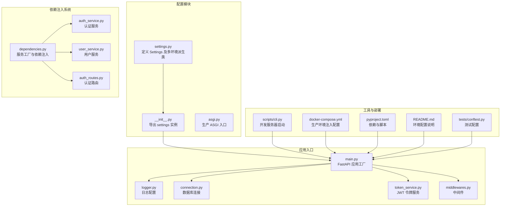
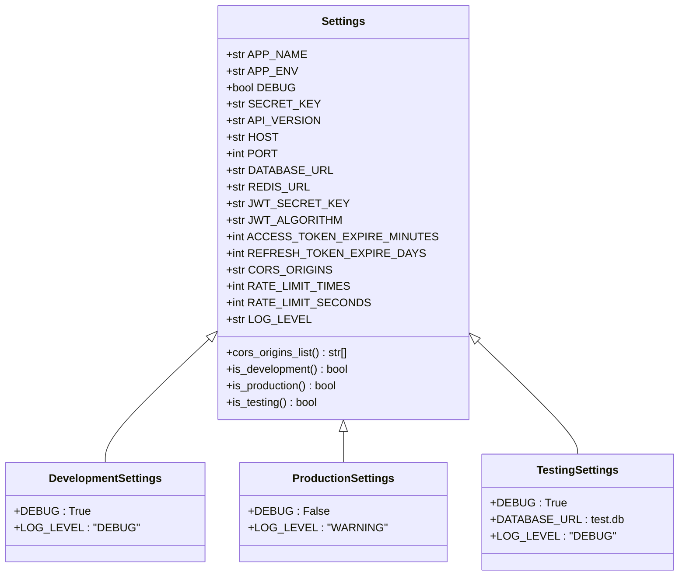
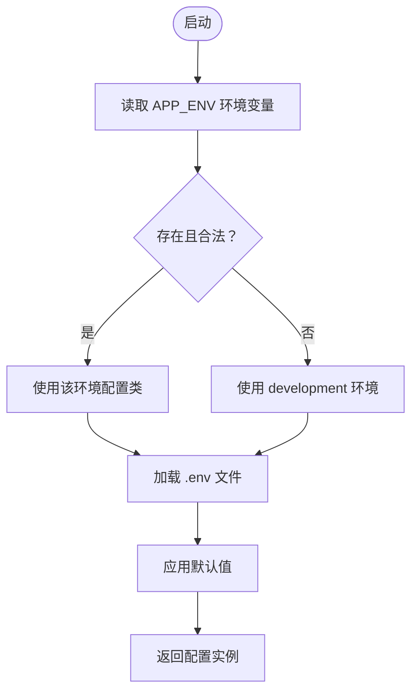
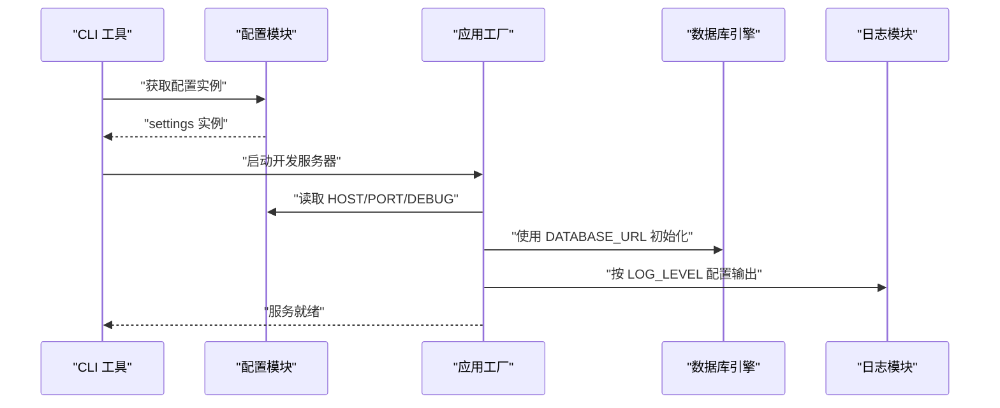
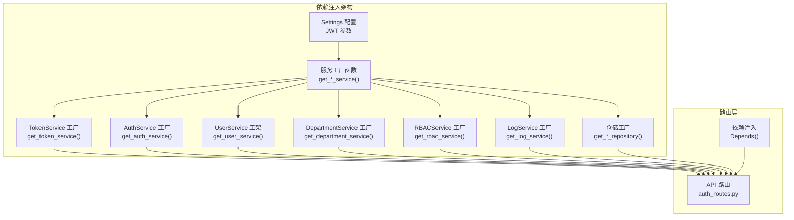
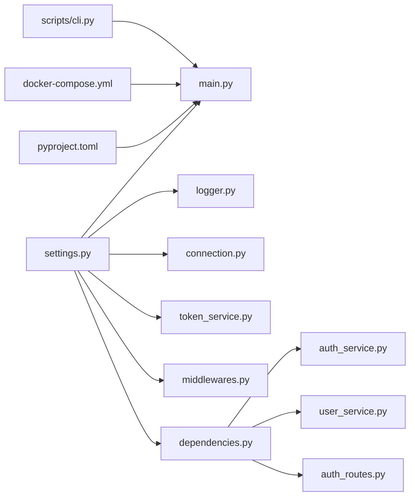

# 配置管理系统

<cite>
**本文引用的文件**
- [settings.py](file://service/src/config/settings.py)
- [__init__.py](file://service/src/config/__init__.py)
- [asgi.py](file://service/src/config/asgi.py)
- [main.py](file://service/src/main.py)
- [logger.py](file://service/src/core/logger.py)
- [connection.py](file://service/src/infrastructure/database/connection.py)
- [token_service.py](file://service/src/domain/auth/token_service.py)
- [middlewares.py](file://service/src/core/middlewares.py)
- [cli.py](file://service/scripts/cli.py)
- [docker-compose.yml](file://service/docker/docker-compose.yml)
- [pyproject.toml](file://service/pyproject.toml)
- [README.md](file://service/README.md)
- [conftest.py](file://service/tests/conftest.py)
- [.gitignore](file://.gitignore)
- [.env.example](file://service/.env.example)
- [dependencies.py](file://service/src/api/dependencies.py)
- [auth_service.py](file://service/src/application/services/auth_service.py)
- [user_service.py](file://service/src/application/services/user_service.py)
- [auth_routes.py](file://service/src/api/v1/auth_routes.py)
</cite>

## 更新摘要
**所做更改**
- 新增依赖注入模式支持，集中管理所有服务实例
- 更新配置系统以支持新的依赖注入架构
- 增强服务工厂函数的配置集成能力
- 完善JWT配置在依赖注入中的传递机制

## 目录
1. [简介](#简介)
2. [项目结构](#项目结构)
3. [核心组件](#核心组件)
4. [架构总览](#架构总览)
5. [详细组件分析](#详细组件分析)
6. [依赖注入模式](#依赖注入模式)
7. [依赖分析](#依赖分析)
8. [性能考量](#性能考量)
9. [故障排查指南](#故障排查指南)
10. [结论](#结论)
11. [附录](#附录)

## 简介
本文件面向 Hello-FastApi 的配置管理系统，系统性阐述多环境配置的设计与实现，涵盖开发、测试、生产环境的配置策略；解释配置文件加载机制、优先级与覆盖规则；说明环境变量的使用与安全注意事项；对配置项进行分类管理（数据库连接、JWT 设置、CORS 配置等）；给出配置验证与默认值处理机制，并提供具体配置示例与最佳实践，帮助开发者构建灵活且安全的配置管理体系。

**更新** 配置系统现已支持新的依赖注入模式，通过集中化的服务工厂函数实现所有服务实例的统一管理，增强了系统的可维护性和扩展性。

## 项目结构
配置系统位于服务端工程 service/src/config 下，核心文件为 settings.py，负责定义与加载配置；其他模块通过导入 settings 实例使用配置；CLI 工具与 Docker Compose 提供环境切换与部署时的配置注入。新增的依赖注入模块通过工厂函数集中管理所有服务实例。

**图表来源**
- [settings.py:1-188](file://service/src/config/settings.py#L1-L188)
- [__init__.py:1-6](file://service/src/config/__init__.py#L1-L6)
- [asgi.py:1-6](file://service/src/config/asgi.py#L1-L6)
- [main.py:1-73](file://service/src/main.py#L1-L73)
- [logger.py:1-77](file://service/src/core/logger.py#L1-L77)
- [connection.py:1-40](file://service/src/infrastructure/database/connection.py#L1-L40)
- [token_service.py:1-45](file://service/src/domain/auth/token_service.py#L1-L45)
- [middlewares.py:1-65](file://service/src/core/middlewares.py#L1-L65)
- [dependencies.py:1-191](file://service/src/api/dependencies.py#L1-L191)
- [auth_service.py:1-147](file://service/src/application/services/auth_service.py#L1-L147)
- [user_service.py:1-293](file://service/src/application/services/user_service.py#L1-L293)
- [auth_routes.py:1-252](file://service/src/api/v1/auth_routes.py#L1-L252)
- [cli.py:1-135](file://service/scripts/cli.py#L1-L135)
- [docker-compose.yml:1-65](file://service/docker/docker-compose.yml#L1-L65)
- [pyproject.toml:1-76](file://service/pyproject.toml#L1-L76)
- [README.md:141-180](file://service/README.md#L141-L180)
- [conftest.py:1-105](file://service/tests/conftest.py#L1-L105)

**章节来源**
- [settings.py:1-188](file://service/src/config/settings.py#L1-L188)
- [main.py:1-73](file://service/src/main.py#L1-L73)
- [README.md:141-180](file://service/README.md#L141-L180)

## 核心组件
- 配置基类与多环境派生类
  - Settings：定义通用配置项与基础校验，支持从 .env 与环境变量加载，含缓存实例。
  - DevelopmentSettings、ProductionSettings、TestingSettings：分别覆盖开发、生产、测试环境的差异化配置。
- 配置加载与选择逻辑
  - get_settings：依据 APP_ENV 选择对应环境配置类，遵循"系统环境变量 > .env.* 环境配置文件 > .env 通用配置文件 > 默认值"的优先级。
  - get_cached_settings：LRU 缓存单例，避免重复实例化。
- 配置导出
  - settings：全局唯一配置实例，供应用各模块直接导入使用。

**更新** 环境配置已简化为单一文件加载，DevelopmentSettings、ProductionSettings、TestingSettings均使用.env文件作为基础配置源。

关键配置项类别与用途
- 应用配置：应用名、环境、调试、密钥、API 版本等。
- 服务器配置：主机地址、端口范围约束。
- 数据库配置：DATABASE_URL，默认 SQLite 开发库，测试环境使用独立 test.db。
- 缓存配置：REDIS_URL。
- JWT 配置：密钥、算法、访问/刷新令牌有效期。
- CORS 配置：CORS_ORIGINS 字符串，提供解析为列表的属性。
- 限流配置：速率限制次数与周期。
- 日志配置：日志级别校验与输出策略。

**章节来源**
- [settings.py:41-188](file://service/src/config/settings.py#L41-L188)
- [__init__.py:1-6](file://service/src/config/__init__.py#L1-L6)

## 架构总览
配置系统围绕 settings.py 的 Settings 类为核心，通过多环境派生类实现差异化配置；应用入口 main.py 通过导入 settings 实例获取配置，从而驱动日志、数据库、JWT、CORS 等子系统的行为。新增的依赖注入系统通过工厂函数集中管理所有服务实例，实现配置与服务的解耦。

**图表来源**
- [settings.py:41-188](file://service/src/config/settings.py#L41-L188)

**章节来源**
- [settings.py:41-188](file://service/src/config/settings.py#L41-L188)
- [main.py:34-73](file://service/src/main.py#L34-L73)

## 详细组件分析

### 配置加载与优先级机制
- 加载顺序
  1) 系统环境变量（最高优先级）
  2) .env.{environment} 环境配置文件
  3) .env 通用配置文件
  4) 类字段默认值（最低优先级）
- 环境选择
  - 优先读取 APP_ENV 环境变量；若未设置，则使用 development。
  - 所有环境共享同一个 .env 文件作为基础配置源。
- 多环境派生类
  - DevelopmentSettings：启用详细日志与调试。
  - ProductionSettings：禁用调试，降低日志级别。
  - TestingSettings：使用内存或独立数据库文件，便于测试隔离。

**更新** 配置加载机制已简化，移除了.env.development、.env.production、.env.testing 等环境特定文件，所有环境统一使用 .env 文件。

**图表来源**
- [settings.py:138-188](file://service/src/config/settings.py#L138-L188)

**章节来源**
- [settings.py:138-188](file://service/src/config/settings.py#L138-L188)
- [README.md:151-155](file://service/README.md#L151-L155)

### 配置项分类与使用场景
- 应用与服务器
  - APP_NAME、API_VERSION：用于文档与健康检查。
  - HOST、PORT：服务器绑定地址与端口，端口范围受校验约束。
- 数据库
  - DATABASE_URL：默认 SQLite 开发库，生产环境建议使用 PostgreSQL。
  - TestingSettings 将数据库指向 test.db，确保测试隔离。
- 缓存
  - REDIS_URL：用于缓存与分布式锁等场景。
- JWT
  - JWT_SECRET_KEY、JWT_ALGORITHM、ACCESS_TOKEN_EXPIRE_MINUTES、REFRESH_TOKEN_EXPIRE_DAYS：令牌签发与校验所需。
- CORS
  - CORS_ORIGINS：字符串形式配置多个源，提供解析为列表的属性供中间件使用。
- 限流
  - RATE_LIMIT_TIMES、RATE_LIMIT_SECONDS：用于速率限制策略。
- 日志
  - LOG_LEVEL：支持校验，结合 loguru 输出到控制台与文件。

**章节来源**
- [settings.py:47-92](file://service/src/config/settings.py#L47-L92)
- [settings.py:110-141](file://service/src/config/settings.py#L110-L141)
- [logger.py:20-72](file://service/src/core/logger.py#L20-L72)
- [connection.py:9](file://service/src/infrastructure/database/connection.py#L9)
- [token_service.py:14-39](file://service/src/domain/auth/token_service.py#L14-L39)
- [main.py:46-53](file://service/src/main.py#L46-L53)

### 配置验证与默认值处理
- 类型与范围校验
  - PORT 使用 ge/le 约束范围。
  - SECRET_KEY、JWT_SECRET_KEY 使用最小长度校验。
  - LOG_LEVEL 使用自定义校验器限定有效级别集合。
- 默认值
  - 多数配置提供合理默认值，减少显式配置负担。
- 解析与转换
  - CORS_ORIGINS 通过属性方法解析为列表，避免在中间件中重复解析。

**章节来源**
- [settings.py:55-92](file://service/src/config/settings.py#L55-L92)

### 环境变量使用与安全考虑
- 环境变量优先级
  - 系统环境变量最高，适合容器与 CI/CD 注入敏感配置。
- 安全建议
  - 生产环境务必通过环境变量或密钥管理服务注入密钥与数据库凭据。
  - 避免将敏感信息提交至版本控制，使用 .gitignore 屏蔽本地 .env 文件。
  - 使用专用的生产 .env 文件，严格控制其权限。
- Docker 部署
  - docker-compose.yml 显式设置了 APP_ENV=production，并注入 DATABASE_URL、REDIS_URL 等关键配置，确保生产一致性。

**更新** 环境配置已简化为单一文件，通过APP_ENV环境变量控制环境切换，移除了环境特定的.env文件。

**章节来源**
- [settings.py:138-188](file://service/src/config/settings.py#L138-L188)
- [docker-compose.yml:11-14](file://service/docker/docker-compose.yml#L11-L14)

### 配置在应用中的集成
- 应用工厂
  - main.py 通过导入 settings 实例，动态设置标题、文档路径、CORS、日志中间件、异常处理与健康检查端点。
- 数据库
  - connection.py 使用 settings.DATABASE_URL 创建异步引擎，并根据 DEBUG 控制 echo。
- 日志
  - logger.py 根据 settings.LOG_LEVEL 配置输出级别与文件轮转策略。
- JWT
  - token_service.py 使用 settings.Jwt_secret_key、settings.jwt_algorithm、settings.access_token_expire_minutes、settings.refresh_token_expire_days 等进行令牌签发与校验。
- 中间件
  - main.py 将 settings.cors_origins_list 传入 CORS 中间件，实现跨域控制。

**图表来源**
- [cli.py:22-29](file://service/scripts/cli.py#L22-L29)
- [settings.py:138-188](file://service/src/config/settings.py#L138-L188)
- [main.py:34-73](file://service/src/main.py#L34-L73)
- [connection.py:9](file://service/src/infrastructure/database/connection.py#L9)
- [logger.py:20-72](file://service/src/core/logger.py#L20-L72)

**章节来源**
- [main.py:34-73](file://service/src/main.py#L34-L73)
- [connection.py:9](file://service/src/infrastructure/database/connection.py#L9)
- [logger.py:20-72](file://service/src/core/logger.py#L20-L72)
- [token_service.py:14-39](file://service/src/domain/auth/token_service.py#L14-L39)

### 开发者最佳实践
- 环境管理
  - 使用 APP_ENV 切换环境；所有环境共享 .env 文件，通过环境变量控制差异。
  - 通过 CLI runserver 启动时，DEBUG 与日志级别由当前环境决定。
- 安全配置
  - 生产环境必须设置强密钥与安全的数据库凭据；避免在代码仓库中暴露敏感信息。
  - 使用 Docker Compose 在容器中注入配置，确保与宿主机隔离。
- 配置验证
  - 对于端口、密钥长度、日志级别等，尽量利用现有校验器，减少运行期错误。
- 测试隔离
  - TestingSettings 使用独立数据库文件，避免测试污染共享数据。
- 文件管理
  - 使用根目录 .gitignore 管理临时文件和 IDE 配置，避免不必要的文件提交到版本控制。

**更新** 环境配置管理已简化，移除了环境特定文件，统一使用 .env 文件并通过APP_ENV环境变量控制环境切换。

**章节来源**
- [README.md:141-180](file://service/README.md#L141-L180)
- [settings.py:110-141](file://service/src/config/settings.py#L110-L141)
- [docker-compose.yml:11-14](file://service/docker/docker-compose.yml#L11-L14)
- [.gitignore:1-20](file://.gitignore#L1-L20)

## 依赖注入模式

### 服务工厂架构
配置系统现已集成了完整的依赖注入模式，通过集中化的服务工厂函数管理所有服务实例，实现配置与服务的解耦。

**图表来源**
- [dependencies.py:1-191](file://service/src/api/dependencies.py#L1-L191)
- [auth_routes.py:1-252](file://service/src/api/v1/auth_routes.py#L1-L252)

### JWT 配置集成
依赖注入系统通过工厂函数将配置参数传递给服务实例，确保JWT配置的一致性。

**更新** 新增了专门的JWT配置集成机制，通过get_token_service()工厂函数从配置中读取JWT参数并创建TokenService实例。

**章节来源**
- [dependencies.py:41-48](file://service/src/api/dependencies.py#L41-L48)
- [auth_service.py:77](file://service/src/application/services/auth_service.py#L77)

### 服务实例管理
所有应用服务通过工厂函数创建和管理，路由层通过Depends()进行依赖注入，实现了清晰的服务层次结构。

**更新** 新增了完整的服务工厂函数体系，包括认证服务、用户服务、菜单服务、RBAC服务、部门服务和日志服务的工厂函数。

**章节来源**
- [dependencies.py:114-171](file://service/src/api/dependencies.py#L114-L171)
- [auth_service.py:17-37](file://service/src/application/services/auth_service.py#L17-L37)
- [user_service.py:13-29](file://service/src/application/services/user_service.py#L13-L29)

### 仓储依赖管理
仓储层通过工厂函数提供依赖注入，支持路由层直接使用仓储实例或通过服务间接访问。

**更新** 新增了仓储工厂函数，包括菜单仓储、用户仓储、角色仓储和权限仓储的工厂函数，支持灵活的依赖注入模式。

**章节来源**
- [dependencies.py:178-191](file://service/src/api/dependencies.py#L178-L191)

## 依赖分析
- 配置模块依赖
  - settings.py 依赖 pydantic-settings 进行配置加载与校验，依赖 pathlib 与 os 进行路径与环境变量处理。
- 应用模块依赖
  - main.py 依赖 settings 提供的配置；logger.py、connection.py、token_service.py、middlewares.py 分别消费不同配置项。
- 依赖注入模块依赖
  - dependencies.py 依赖 settings.get_settings() 获取JWT配置，依赖各种服务类进行工厂函数实现。
- 工具与部署
  - cli.py 通过 settings.HOST/PORT/DEBUG 启动开发服务器；docker-compose.yml 通过环境变量注入生产配置。

**图表来源**
- [settings.py:14-20](file://service/src/config/settings.py#L14-L20)
- [main.py:11-16](file://service/src/main.py#L11-L16)
- [logger.py:13-15](file://service/src/core/logger.py#L13-L15)
- [connection.py:3-7](file://service/src/infrastructure/database/connection.py#L3-L7)
- [token_service.py:3-8](file://service/src/domain/auth/token_service.py#L3-L8)
- [middlewares.py:6-9](file://service/src/core/middlewares.py#L6-L9)
- [dependencies.py:17-26](file://service/src/api/dependencies.py#L17-L26)
- [auth_service.py:8](file://service/src/application/services/auth_service.py#L8)
- [user_service.py:5](file://service/src/application/services/user_service.py#L5)
- [auth_routes.py:11](file://service/src/api/v1/auth_routes.py#L11)
- [cli.py:17-19](file://service/scripts/cli.py#L17-L19)
- [docker-compose.yml:11-14](file://service/docker/docker-compose.yml#L11-L14)
- [pyproject.toml:13](file://service/pyproject.toml#L13)

**章节来源**
- [settings.py:14-20](file://service/src/config/settings.py#L14-L20)
- [pyproject.toml:13](file://service/pyproject.toml#L13)

## 性能考量
- 配置缓存
  - LRU 缓存 get_cached_settings 减少重复实例化开销，适合高频读取场景。
- 日志级别
  - 生产环境降低日志级别与输出频率，减少 I/O 压力。
- 数据库连接
  - 异步引擎与池预连接策略有助于提升并发性能；DEBUG 为 False 时关闭 echo，避免调试输出影响吞吐。
- 依赖注入优化
  - 通过工厂函数复用服务实例，减少重复创建开销。
  - 使用Depends()进行依赖注入，支持异步上下文管理。

**更新** 新增了依赖注入性能优化策略，通过工厂函数和依赖注入机制提升服务实例的复用效率。

**章节来源**
- [settings.py:176-184](file://service/src/config/settings.py#L176-L184)
- [logger.py:20-72](file://service/src/core/logger.py#L20-L72)
- [connection.py:9](file://service/src/infrastructure/database/connection.py#L9)
- [dependencies.py:114-171](file://service/src/api/dependencies.py#L114-L171)

## 故障排查指南
- 环境变量未生效
  - 确认 APP_ENV 是否正确设置；检查 .env 文件中的配置项。
- 配置加载顺序问题
  - 检查系统环境变量、.env 文件的存在与语法；必要时临时打印配置实例验证覆盖链。
- 日志级别异常
  - LOG_LEVEL 必须为有效集合内的值，否则会触发校验错误；修正后重启服务。
- CORS 不生效
  - 确认 CORS_ORIGINS 字符串中包含正确的源地址，且中间件已正确添加。
- 数据库连接失败
  - 检查 DATABASE_URL 格式与可达性；生产环境建议使用 PostgreSQL 并确保网络连通。
- JWT 校验失败
  - 确认 JWT_SECRET_KEY 与算法一致，令牌有效期与类型匹配。
- 依赖注入问题
  - 检查服务工厂函数是否正确获取配置参数；确认Depends()依赖注入语法正确。

**更新** 新增了依赖注入相关的故障排查指南，包括服务工厂函数配置和依赖注入语法问题的诊断方法。

**章节来源**
- [settings.py:84-92](file://service/src/config/settings.py#L84-L92)
- [main.py:46-53](file://service/src/main.py#L46-L53)
- [connection.py:9](file://service/src/infrastructure/database/connection.py#L9)
- [token_service.py:33-39](file://service/src/domain/auth/token_service.py#L33-L39)
- [dependencies.py:41-48](file://service/src/api/dependencies.py#L41-L48)

## 结论
本配置管理系统以 pydantic-settings 为基础，通过多环境派生类与简化的加载优先级，实现了灵活且可维护的配置体系。配合 CLI、Docker Compose 与中间件集成，开发者可在不同环境中快速切换并保证一致性。新增的依赖注入模式进一步提升了系统的可维护性和扩展性，通过集中化的服务工厂函数实现了配置与服务的解耦。建议在生产环境强化密钥与凭据的安全管理，并充分利用日志与数据库连接的性能优化策略。

**更新** 配置系统已简化为单一文件管理，降低了配置复杂度，提高了维护效率。同时新增的依赖注入模式进一步增强了系统的架构清晰度和可扩展性。

## 附录
- 常见配置场景示例
  - 开发环境：APP_ENV=development，DEBUG=True，日志级别为 DEBUG，使用 SQLite 开发库。
  - 测试环境：APP_ENV=testing，DEBUG=True，使用 test.db，日志级别为 DEBUG。
  - 生产环境：APP_ENV=production，DEBUG=False，日志级别为 WARNING，使用 PostgreSQL 与 Redis。
- 切换环境与启动
  - 通过 CLI runserver 启动时，系统会自动加载对应环境配置。
  - Docker Compose 在生产环境注入 APP_ENV 与数据库、缓存连接信息。
- 文件管理
  - 使用根目录 .gitignore 管理临时文件、IDE 配置和操作系统文件。
  - 所有环境共享 .env 文件，通过 APP_ENV 环境变量控制环境差异。
- 依赖注入最佳实践
  - 使用服务工厂函数统一管理服务实例创建。
  - 通过Depends()进行依赖注入，支持异步上下文管理。
  - JWT配置通过工厂函数从配置中读取，确保参数一致性。

**更新** 配置场景已简化，移除了环境特定文件的使用，统一通过APP_ENV环境变量控制。新增了依赖注入模式的最佳实践指南。

**章节来源**
- [README.md:141-180](file://service/README.md#L141-L180)
- [cli.py:22-29](file://service/scripts/cli.py#L22-L29)
- [docker-compose.yml:11-14](file://service/docker/docker-compose.yml#L11-L14)
- [.env.example:1-63](file://service/.env.example#L1-L63)
- [.gitignore:1-20](file://.gitignore#L1-L20)
- [dependencies.py:1-191](file://service/src/api/dependencies.py#L1-L191)