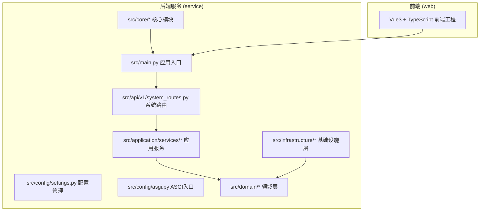
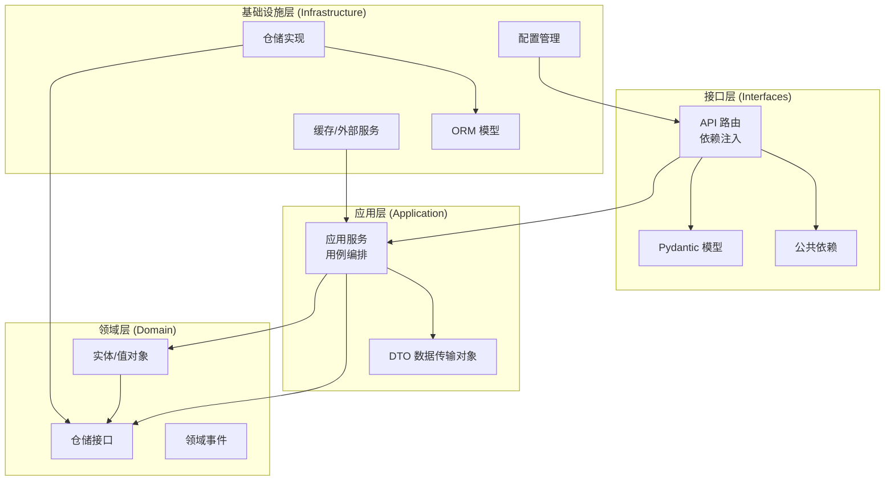
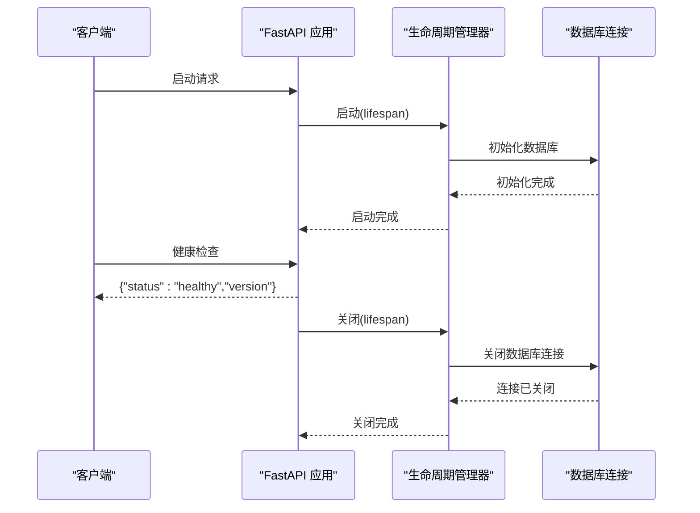
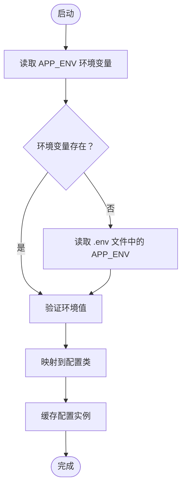
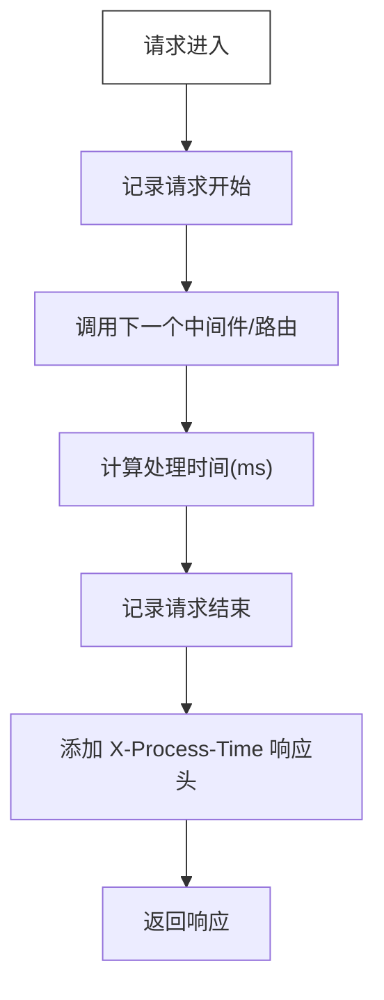
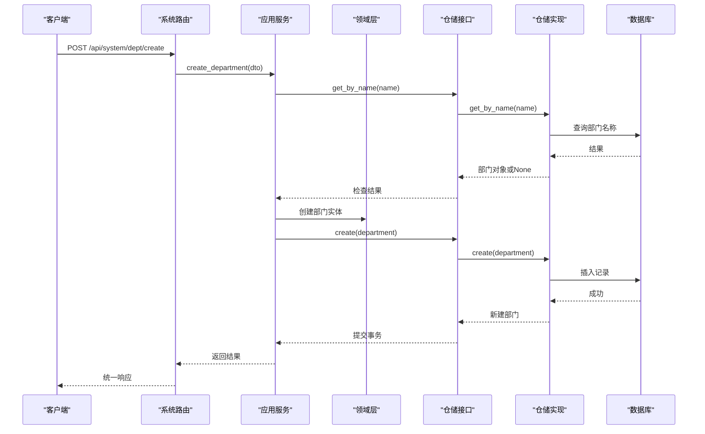
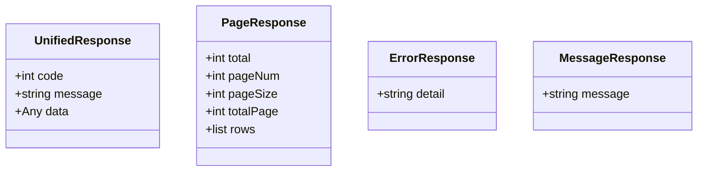
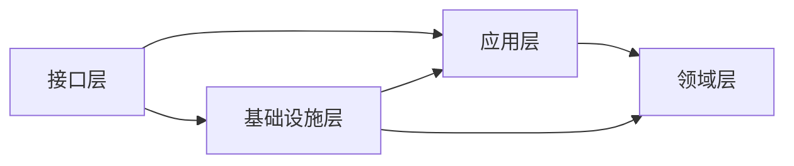

# 项目架构设计与约束

<cite>
**本文档引用的文件**
- [service/src/main.py](file://service/src/main.py)
- [service/src/config/settings.py](file://service/src/config/settings.py)
- [service/src/config/asgi.py](file://service/src/config/asgi.py)
- [service/docs/design/项目架构设计与约束.md](file://service/docs/design/项目架构设计与约束.md)
- [service/pyproject.toml](file://service/pyproject.toml)
- [service/src/core/constants.py](file://service/src/core/constants.py)
- [service/src/core/exceptions.py](file://service/src/core/exceptions.py)
- [service/src/core/middlewares.py](file://service/src/core/middlewares.py)
- [service/src/api/v1/system_routes.py](file://service/src/api/v1/system_routes.py)
- [service/src/infrastructure/database/connection.py](file://service/src/infrastructure/database/connection.py)
- [service/src/application/services/department_service.py](file://service/src/application/services/department_service.py)
- [service/src/domain/entities/department.py](file://service/src/domain/entities/department.py)
- [service/src/infrastructure/repositories/department_repository.py](file://service/src/infrastructure/repositories/department_repository.py)
- [service/src/api/common.py](file://service/src/api/common.py)
- [service/README.md](file://service/README.md)
</cite>

## 目录
1. [引言](#引言)
2. [项目结构](#项目结构)
3. [核心组件](#核心组件)
4. [架构总览](#架构总览)
5. [详细组件分析](#详细组件分析)
6. [依赖关系分析](#依赖关系分析)
7. [性能考虑](#性能考虑)
8. [故障排查指南](#故障排查指南)
9. [结论](#结论)

## 引言
本项目基于 FastAPI 框架，采用 DDD（领域驱动设计）分层架构与 RBAC 权限控制，旨在提供清晰的分层职责、可维护的代码结构以及良好的可测试性。文档重点阐述系统的架构设计、约束规则、组件交互与数据流，帮助开发者快速理解并正确扩展系统。

## 项目结构
项目采用前后端分离的双仓库结构，后端服务位于 service 目录，前端位于 web 目录。后端服务采用 Python + FastAPI + SQLModel + AsyncIO 的技术栈，支持多环境配置、异步数据库访问、JWT 认证与 RBAC 权限控制。

**图表来源**
- [service/src/main.py:1-73](file://service/src/main.py#L1-L73)
- [service/src/config/settings.py:1-188](file://service/src/config/settings.py#L1-L188)
- [service/src/config/asgi.py:1-6](file://service/src/config/asgi.py#L1-L6)

**章节来源**
- [service/README.md:28-96](file://service/README.md#L28-L96)
- [service/src/main.py:34-73](file://service/src/main.py#L34-L73)

## 核心组件
- 应用入口与生命周期：应用工厂负责创建 FastAPI 实例、注册中间件与异常处理器、配置路由与健康检查。
- 配置管理：支持多环境配置（development/production/testing），通过环境变量与 .env 文件加载，提供缓存的配置实例。
- 中间件体系：请求日志中间件与 IP 白黑名单过滤中间件，统一记录请求信息与访问控制。
- 异常体系：自定义异常类，覆盖认证、权限、业务、验证、限流等常见错误场景。
- 常量与约束：统一的 API 前缀、分页参数、RBAC 默认角色与权限清单。
- 数据库连接：异步引擎与会话工厂，支持初始化与关闭数据库连接。
- 统一响应：标准化的响应格式与分页结构，便于前端适配。

**章节来源**
- [service/src/main.py:19-73](file://service/src/main.py#L19-L73)
- [service/src/config/settings.py:41-188](file://service/src/config/settings.py#L41-L188)
- [service/src/core/middlewares.py:12-59](file://service/src/core/middlewares.py#L12-L59)
- [service/src/core/exceptions.py:6-60](file://service/src/core/exceptions.py#L6-L60)
- [service/src/core/constants.py:1-45](file://service/src/core/constants.py#L1-L45)
- [service/src/infrastructure/database/connection.py:17-40](file://service/src/infrastructure/database/connection.py#L17-L40)
- [service/src/api/common.py:30-80](file://service/src/api/common.py#L30-L80)

## 架构总览
系统采用四层架构，自上而下依赖，严格遵循依赖倒置原则：

**图表来源**
- [service/docs/design/项目架构设计与约束.md:7-36](file://service/docs/design/项目架构设计与约束.md#L7-L36)
- [service/docs/design/项目架构设计与约束.md:79-105](file://service/docs/design/项目架构设计与约束.md#L79-L105)

## 详细组件分析

### 应用入口与生命周期管理
应用工厂负责创建 FastAPI 实例，配置 CORS、请求日志中间件、全局异常处理器，并注册系统路由。生命周期管理器在启动时初始化数据库，在关闭时释放连接。健康检查端点提供服务状态与版本信息。

**图表来源**
- [service/src/main.py:19-32](file://service/src/main.py#L19-L32)
- [service/src/main.py:61-64](file://service/src/main.py#L61-L64)
- [service/src/infrastructure/database/connection.py:28-40](file://service/src/infrastructure/database/connection.py#L28-L40)

**章节来源**
- [service/src/main.py:34-73](file://service/src/main.py#L34-L73)
- [service/src/infrastructure/database/connection.py:17-40](file://service/src/infrastructure/database/connection.py#L17-L40)

### 配置管理与多环境支持
配置模块支持 development/production/testing 三种环境，通过环境变量 APP_ENV 切换，优先级为：系统环境变量 > .env.{APP_ENV} > .env > 默认值。提供缓存的配置实例，避免重复加载。

**图表来源**
- [service/src/config/settings.py:138-188](file://service/src/config/settings.py#L138-L188)

**章节来源**
- [service/src/config/settings.py:41-188](file://service/src/config/settings.py#L41-L188)

### 中间件与异常处理
请求日志中间件记录请求开始与结束信息，计算处理时间并添加到响应头。IP 过滤中间件支持白名单与黑名单控制。全局异常处理器统一处理业务异常、参数验证异常与通用异常，返回标准化响应。

**图表来源**
- [service/src/core/middlewares.py:12-34](file://service/src/core/middlewares.py#L12-L34)

**章节来源**
- [service/src/core/middlewares.py:12-59](file://service/src/core/middlewares.py#L12-L59)
- [service/src/main.py:46-59](file://service/src/main.py#L46-L59)

### 部门管理用例（应用层 → 领域层 → 基础设施层）
部门管理用例展示了典型的 DDD 调用链：接口层接收请求并转换为 DTO，应用服务编排业务逻辑、调用仓储接口、控制事务边界，领域层确保业务规则不变性，基础设施层实现仓储接口。

**图表来源**
- [service/src/api/v1/system_routes.py:60-70](file://service/src/api/v1/system_routes.py#L60-L70)
- [service/src/application/services/department_service.py:41-72](file://service/src/application/services/department_service.py#L41-L72)
- [service/src/infrastructure/repositories/department_repository.py:23-39](file://service/src/infrastructure/repositories/department_repository.py#L23-L39)

**章节来源**
- [service/src/api/v1/system_routes.py:60-91](file://service/src/api/v1/system_routes.py#L60-L91)
- [service/src/application/services/department_service.py:14-143](file://service/src/application/services/department_service.py#L14-L143)
- [service/src/domain/entities/department.py:12-46](file://service/src/domain/entities/department.py#L12-L46)
- [service/src/infrastructure/repositories/department_repository.py:11-69](file://service/src/infrastructure/repositories/department_repository.py#L11-L69)

### 统一响应与分页
接口层提供统一的响应格式与分页结构，确保前后端交互的一致性。响应体包含 code、message、data 字段，分页响应包含 total、pageNum、pageSize、totalPage、rows 等字段。

**图表来源**
- [service/src/api/common.py:30-46](file://service/src/api/common.py#L30-L46)
- [service/src/api/common.py:11-28](file://service/src/api/common.py#L11-L28)

**章节来源**
- [service/src/api/common.py:30-80](file://service/src/api/common.py#L30-L80)

## 依赖关系分析
项目依赖关系遵循依赖倒置原则：领域层不依赖任何外层，基础设施层实现领域层定义的抽象接口。接口层与应用层之间通过依赖注入解耦，应用层与领域层之间通过仓储接口解耦。

**图表来源**
- [service/docs/design/项目架构设计与约束.md:79-105](file://service/docs/design/项目架构设计与约束.md#L79-L105)

**章节来源**
- [service/docs/design/项目架构设计与约束.md:79-105](file://service/docs/design/项目架构设计与约束.md#L79-L105)

## 性能考虑
- 异步数据库访问：使用 SQLModel AsyncIO 引擎与异步会话，提升并发处理能力。
- 中间件开销：请求日志中间件会增加少量开销，建议在生产环境适当调整日志级别。
- 事务控制：应用服务负责事务边界，避免在领域层处理事务，减少复杂度。
- 缓存策略：Redis 缓存可用于热点数据与会话管理，需配合 IP 过滤中间件使用。

## 故障排查指南
- 健康检查：访问 /health 端点确认服务状态与版本。
- 日志记录：检查日志目录与日志级别配置，定位异常与性能问题。
- 数据库连接：确认 DATABASE_URL 配置与数据库服务状态。
- 异常处理：关注全局异常处理器返回的标准化错误信息，定位业务逻辑错误。
- 中间件问题：临时禁用 IP 过滤中间件验证访问控制问题。

**章节来源**
- [service/src/main.py:61-64](file://service/src/main.py#L61-L64)
- [service/src/config/settings.py:81-92](file://service/src/config/settings.py#L81-L92)
- [service/src/infrastructure/database/connection.py:17-40](file://service/src/infrastructure/database/connection.py#L17-L40)
- [service/src/core/exceptions.py:6-60](file://service/src/core/exceptions.py#L6-L60)
- [service/src/core/middlewares.py:36-59](file://service/src/core/middlewares.py#L36-L59)

## 结论
本项目通过 DDD 分层架构与严格的依赖约束，实现了业务逻辑与技术实现的分离，提升了代码的可维护性与可测试性。遵循依赖倒置原则与统一的响应格式，有助于团队协作与长期演进。建议在实际开发中持续遵守架构约束，合理使用中间件与异常处理机制，确保系统稳定与高性能。