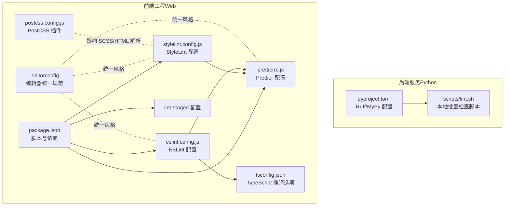
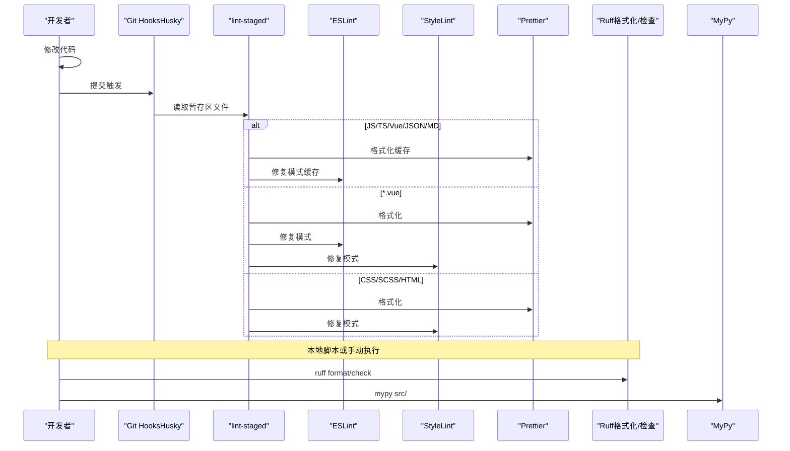
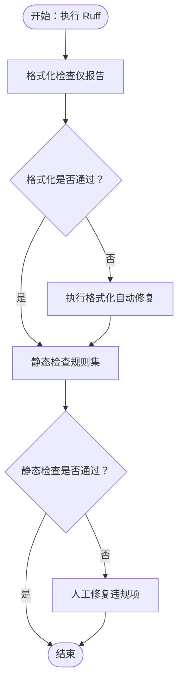
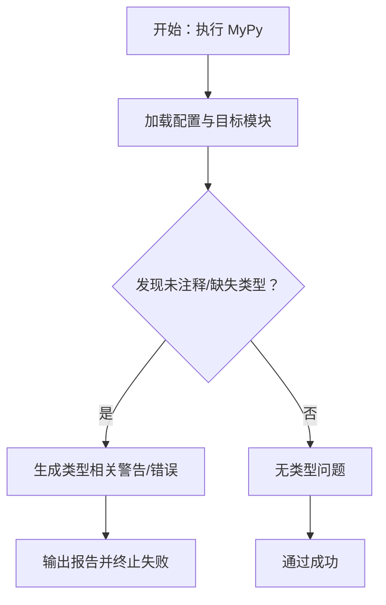
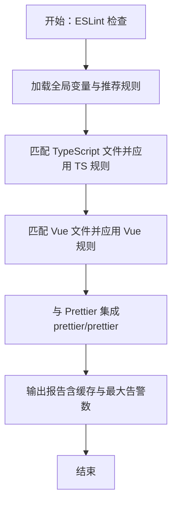
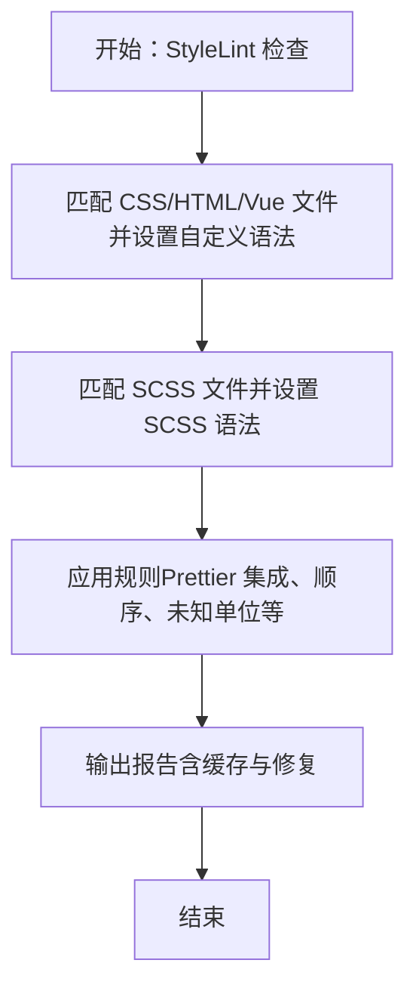
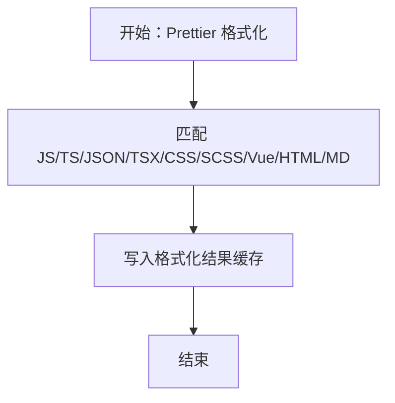
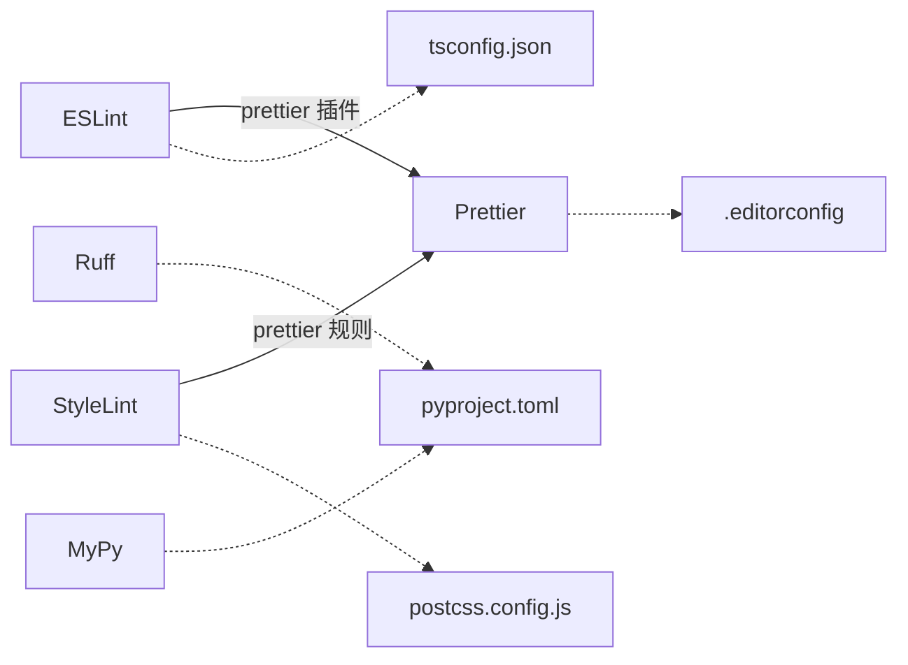

# 代码质量工具

<cite>
**本文引用的文件**
- [pyproject.toml](file://service/pyproject.toml)
- [lint.sh](file://service/scripts/lint.sh)
- [cli.py](file://service/scripts/cli.py)
- [eslint.config.js](file://web/eslint.config.js)
- [stylelint.config.js](file://web/stylelint.config.js)
- [.prettierrc.js](file://web/.prettierrc.js)
- [package.json](file://web/package.json)
- [.lintstagedrc](file://web/.lintstagedrc)
- [tsconfig.json](file://web/tsconfig.json)
- [.editorconfig](file://web/.editorconfig)
- [postcss.config.js](file://web/postcss.config.js)
</cite>

## 目录
1. [简介](#简介)
2. [项目结构](#项目结构)
3. [核心组件](#核心组件)
4. [架构总览](#架构总览)
5. [详细组件分析](#详细组件分析)
6. [依赖关系分析](#依赖关系分析)
7. [性能考虑](#性能考虑)
8. [故障排查指南](#故障排查指南)
9. [结论](#结论)
10. [附录](#附录)

## 简介
本文件面向开发者与团队，系统性介绍本仓库中 Python（Ruff + MyPy）与前端（ESLint + StyleLint + Prettier）代码质量工具的配置与使用方法，并提供自动化流程与 CI/CD 集成建议。内容覆盖规则配置、自动修复、缓存与性能优化、常见问题与最佳实践，帮助在本地与流水线中稳定运行代码质量检查。

## 项目结构
本仓库包含两套代码质量体系：
- 后端服务（Python）：Ruff（格式化与静态检查）、MyPy（类型检查）
- 前端工程（JavaScript/TypeScript/Vue/SCSS/CSS/HTML）：ESLint（JS/TS/Vue）、StyleLint（CSS/SCSS/HTML）、Prettier（统一格式）

图表来源
- [pyproject.toml:44-68](file://service/pyproject.toml#L44-L68)
- [lint.sh:1-19](file://service/scripts/lint.sh#L1-L19)
- [eslint.config.js:1-191](file://web/eslint.config.js#L1-L191)
- [stylelint.config.js:1-88](file://web/stylelint.config.js#L1-L88)
- [.prettierrc.js:1-10](file://web/.prettierrc.js#L1-L10)
- [package.json:6-22](file://web/package.json#L6-L22)
- [.lintstagedrc:1-21](file://web/.lintstagedrc#L1-L21)
- [tsconfig.json:1-55](file://web/tsconfig.json#L1-L55)
- [.editorconfig:1-15](file://web/.editorconfig#L1-L15)
- [postcss.config.js:1-9](file://web/postcss.config.js#L1-L9)

章节来源
- [pyproject.toml:44-68](file://service/pyproject.toml#L44-L68)
- [lint.sh:1-19](file://service/scripts/lint.sh#L1-L19)
- [eslint.config.js:1-191](file://web/eslint.config.js#L1-L191)
- [stylelint.config.js:1-88](file://web/stylelint.config.js#L1-L88)
- [.prettierrc.js:1-10](file://web/.prettierrc.js#L1-L10)
- [package.json:6-22](file://web/package.json#L6-L22)
- [.lintstagedrc:1-21](file://web/.lintstagedrc#L1-L21)
- [tsconfig.json:1-55](file://web/tsconfig.json#L1-L55)
- [.editorconfig:1-15](file://web/.editorconfig#L1-L15)
- [postcss.config.js:1-9](file://web/postcss.config.js#L1-L9)

## 核心组件
- Ruff（Python）
  - 格式化：通过配置项启用格式化并设置行宽、源码目录等
  - 静态检查：选择规则集、忽略特定规则、导入排序策略
- MyPy（Python）
  - 版本对齐、严格性开关、缺失导入忽略、函数体类型检查
- ESLint（前端 JS/TS/Vue）
  - 推荐规则、全局变量声明、Prettier 集成、Vue 文件解析与处理器
  - TypeScript 规则定制、枚举与类型导入策略
- StyleLint（CSS/SCSS/HTML）
  - 扩展标准配置、SCSS/HTML 自定义语法、顺序与未知单位处理
- Prettier（统一格式）
  - 括号空格、单引号、箭头函数括号、尾随逗号策略
- 工作流与缓存
  - 本地脚本、lint-staged 预提交钩子、缓存与并发优化

章节来源
- [pyproject.toml:44-68](file://service/pyproject.toml#L44-L68)
- [eslint.config.js:10-191](file://web/eslint.config.js#L10-L191)
- [stylelint.config.js:1-88](file://web/stylelint.config.js#L1-L88)
- [.prettierrc.js:1-10](file://web/.prettierrc.js#L1-L10)
- [package.json:16-20](file://web/package.json#L16-L20)
- [.lintstagedrc:1-21](file://web/.lintstagedrc#L1-L21)

## 架构总览
下图展示从“变更文件”到“质量检查”的端到端流程，涵盖本地与预提交阶段：

图表来源
- [.lintstagedrc:1-21](file://web/.lintstagedrc#L1-L21)
- [package.json:16-20](file://web/package.json#L16-L20)
- [lint.sh:8-15](file://service/scripts/lint.sh#L8-L15)
- [pyproject.toml:44-68](file://service/pyproject.toml#L44-L68)

## 详细组件分析

### Ruff（Python）配置与使用
- 关键配置要点
  - 目标 Python 版本与行宽、源码目录
  - 格式化：跳过魔法尾随逗号以避免强制换行
  - 静态检查：选择规则集合、忽略特定规则、导入排序（与格式化保持一致）
- 使用方式
  - 本地检查：格式化检查与静态检查分别执行
  - 自动修复：通过静态检查的修复能力（Ruff 支持部分规则自动修复）
- 性能与缓存
  - 使用缓存目录减少重复扫描
  - 并行处理提升大型项目的检查速度
- 最佳实践
  - 在 CI 中先格式化检查，再进行静态检查，确保一致性
  - 将 Ruff 作为 pre-commit 或 CI 步骤的一部分

图表来源
- [lint.sh:8-12](file://service/scripts/lint.sh#L8-L12)
- [pyproject.toml:44-61](file://service/pyproject.toml#L44-L61)

章节来源
- [pyproject.toml:44-61](file://service/pyproject.toml#L44-L61)
- [lint.sh:8-15](file://service/scripts/lint.sh#L8-L15)

### MyPy（Python）配置与使用
- 关键配置要点
  - Python 版本对齐、警告返回值、忽略缺失导入、检查未注释函数体
- 使用方式
  - 本地与 CI 中运行类型检查，建议将失败视为错误
- 错误处理
  - 对于第三方库或动态模块，可通过忽略缺失导入策略降低误报
  - 逐步收紧规则，优先修复高风险问题

图表来源
- [pyproject.toml:62-67](file://service/pyproject.toml#L62-L67)
- [lint.sh:14-15](file://service/scripts/lint.sh#L14-L15)

章节来源
- [pyproject.toml:62-67](file://service/pyproject.toml#L62-L67)
- [lint.sh:14-15](file://service/scripts/lint.sh#L14-L15)

### ESLint（JavaScript/TypeScript/Vue）配置与使用
- 关键配置要点
  - 全局变量声明、Prettier 集成与推荐规则、缓存与并发
  - TypeScript 规则定制：类型导入风格、枚举一致性、未使用变量等
  - Vue 文件：自定义解析器、处理器、组件命名与属性等规则
  - TailwindCSS 辅助插件：类名一致性与变量语法
- 使用方式
  - 本地脚本：ESLint 缓存与最大告警数控制
  - 预提交：与 Prettier 协同，先格式化再检查
- 最佳实践
  - 将 Prettier 与 ESLint 的冲突规则关闭，由 Prettier 统一格式
  - 为不同文件类型（JS/TS/Vue/SCSS/HTML）设置差异化规则

图表来源
- [eslint.config.js:10-191](file://web/eslint.config.js#L10-L191)
- [package.json:16-17](file://web/package.json#L16-L17)
- [.lintstagedrc:2-5](file://web/.lintstagedrc#L2-L5)

章节来源
- [eslint.config.js:10-191](file://web/eslint.config.js#L10-L191)
- [package.json:16-17](file://web/package.json#L16-L17)
- [.lintstagedrc:2-5](file://web/.lintstagedrc#L2-L5)

### StyleLint（CSS/SCSS/HTML）配置与使用
- 关键配置要点
  - 扩展标准与 HTML/Vue 配置、SCSS 与 HTML 自定义语法
  - 规则：Prettier 集成、伪元素/伪类忽略列表、未知单位、属性顺序等
- 使用方式
  - 本地脚本：缓存与修复模式
  - 预提交：与 Prettier 协同，先格式化再检查
- 最佳实践
  - 为 SCSS 与 HTML/Vue 分别设置自定义语法，避免误报
  - 使用顺序规则保证维护性

图表来源
- [stylelint.config.js:1-88](file://web/stylelint.config.js#L1-L88)
- [package.json:19-19](file://web/package.json#L19-L19)
- [.lintstagedrc:15-18](file://web/.lintstagedrc#L15-L18)

章节来源
- [stylelint.config.js:1-88](file://web/stylelint.config.js#L1-L88)
- [package.json:19-19](file://web/package.json#L19-L19)
- [.lintstagedrc:15-18](file://web/.lintstagedrc#L15-L18)

### Prettier（统一格式）
- 关键配置要点
  - 括号空格、单引号、箭头函数括号、尾随逗号策略
- 使用方式
  - 本地脚本：批量写入格式化
  - 预提交：与 ESLint/StyleLint 协同，先格式化再检查
- 最佳实践
  - 与 ESLint/StyleLint 的冲突规则关闭，由 Prettier 统一格式
  - 在 CI 中使用只读模式验证格式一致性

图表来源
- [.prettierrc.js:1-10](file://web/.prettierrc.js#L1-L10)
- [package.json:18-18](file://web/package.json#L18-L18)
- [.lintstagedrc:3-3](file://web/.lintstagedrc#L3-L3)

章节来源
- [.prettierrc.js:1-10](file://web/.prettierrc.js#L1-L10)
- [package.json:18-18](file://web/package.json#L18-L18)
- [.lintstagedrc:3-3](file://web/.lintstagedrc#L3-L3)

### TypeScript 编译配置（补充）
- 关键点
  - 模块解析、严格性、库与路径映射、类型声明
- 与质量工具的关系
  - 与 ESLint/TS 规则互补，统一编译期约束
  - 与 Prettier/StyleLint 协同，保证构建前格式与类型一致

章节来源
- [tsconfig.json:1-55](file://web/tsconfig.json#L1-L55)

## 依赖关系分析
- 工具间耦合
  - ESLint 与 Prettier：通过插件与配置实现协同
  - StyleLint 与 Prettier：通过规则开启 Prettier 集成
  - Ruff 与 MyPy：独立工具，建议在 CI 中并行执行
- 外部依赖与集成点
  - husky 与 lint-staged：Git 预提交钩子
  - PostCSS：影响 SCSS/HTML 解析与样式处理
  - EditorConfig：统一编辑器基础规范

图表来源
- [eslint.config.js:54-74](file://web/eslint.config.js#L54-L74)
- [stylelint.config.js:10-24](file://web/stylelint.config.js#L10-L24)
- [pyproject.toml:44-68](file://service/pyproject.toml#L44-L68)
- [tsconfig.json:1-55](file://web/tsconfig.json#L1-L55)
- [postcss.config.js:1-9](file://web/postcss.config.js#L1-L9)
- [.editorconfig:1-15](file://web/.editorconfig#L1-L15)

章节来源
- [eslint.config.js:54-74](file://web/eslint.config.js#L54-L74)
- [stylelint.config.js:10-24](file://web/stylelint.config.js#L10-L24)
- [pyproject.toml:44-68](file://service/pyproject.toml#L44-L68)
- [tsconfig.json:1-55](file://web/tsconfig.json#L1-L55)
- [postcss.config.js:1-9](file://web/postcss.config.js#L1-L9)
- [.editorconfig:1-15](file://web/.editorconfig#L1-L15)

## 性能考虑
- 缓存与增量
  - ESLint/StyleLint/Prettier/MyPy/Ruff 均支持缓存，建议在脚本中启用并指定缓存位置
- 并行与并发
  - 在 CI 中并行执行不同工具，缩短总时长
- 忽略大目录
  - 在配置中忽略构建产物、资源与第三方目录，减少扫描范围
- 内存与稳定性
  - 构建脚本中设置 Node.js 内存上限，避免内存不足导致失败

章节来源
- [package.json:6-14](file://web/package.json#L6-L14)
- [lint.sh:8-15](file://service/scripts/lint.sh#L8-L15)

## 故障排查指南
- ESLint 报告“未使用变量”
  - 检查规则配置中的忽略模式（下划线开头）
  - 确认 TS/JS 文件类型与解析器设置
- StyleLint 报告未知伪类/伪元素
  - 检查忽略列表配置，确保保留框架所需语法
- Prettier 与 ESLint 冲突
  - 关闭 ESLint 中与 Prettier 冲突的规则，统一由 Prettier 处理
- Ruff 格式化与导入排序不一致
  - 确保格式化与导入排序的策略一致（如禁用魔法尾随逗号）
- MyPy 报告大量缺失类型
  - 评估是否需要开启忽略缺失导入或逐步完善类型注解
- 预提交未生效
  - 检查 husky 安装与 lint-staged 配置是否正确

章节来源
- [eslint.config.js:60-73](file://web/eslint.config.js#L60-L73)
- [eslint.config.js:150-172](file://web/eslint.config.js#L150-L172)
- [stylelint.config.js:30-59](file://web/stylelint.config.js#L30-L59)
- [pyproject.toml:49-61](file://service/pyproject.toml#L49-L61)
- [pyproject.toml:62-67](file://service/pyproject.toml#L62-L67)
- [.lintstagedrc:1-21](file://web/.lintstagedrc#L1-L21)

## 结论
本项目在前后端分别建立了完善的代码质量体系：后端通过 Ruff 与 MyPy 实现格式化与类型检查；前端通过 ESLint、StyleLint 与 Prettier 实现统一的代码风格与静态检查。结合本地脚本、预提交钩子与缓存机制，可在开发与 CI 中高效稳定地运行质量检查。建议持续优化规则与缓存策略，逐步收紧类型注解与规则，提升整体代码质量与可维护性。

## 附录
- 本地运行质量检查
  - 后端：执行本地脚本，依次进行格式化检查、静态检查与类型检查
  - 前端：执行 npm 脚本，按顺序运行 ESLint、Prettier、StyleLint
- 预提交钩子
  - 通过 lint-staged 配置，针对不同文件类型执行格式化与检查
- CI/CD 集成建议
  - 并行执行各工具，启用缓存与内存限制
  - 将失败视为中断，确保主干分支质量

章节来源
- [lint.sh:8-15](file://service/scripts/lint.sh#L8-L15)
- [package.json:16-20](file://web/package.json#L16-L20)
- [.lintstagedrc:1-21](file://web/.lintstagedrc#L1-L21)