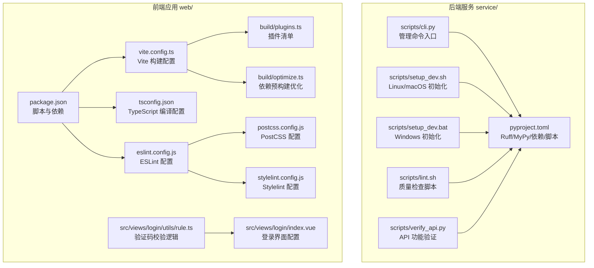
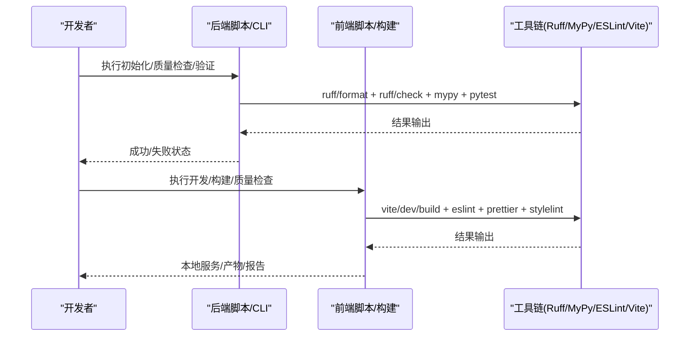
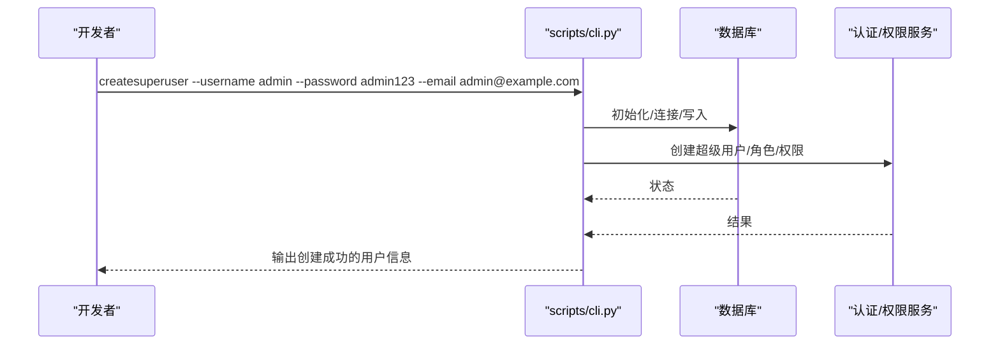
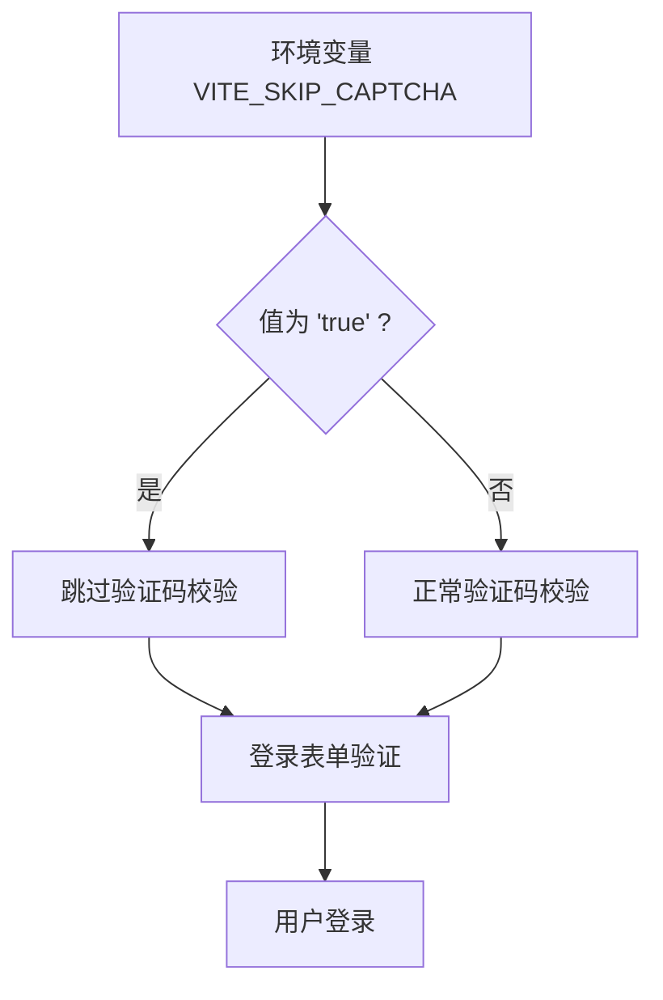
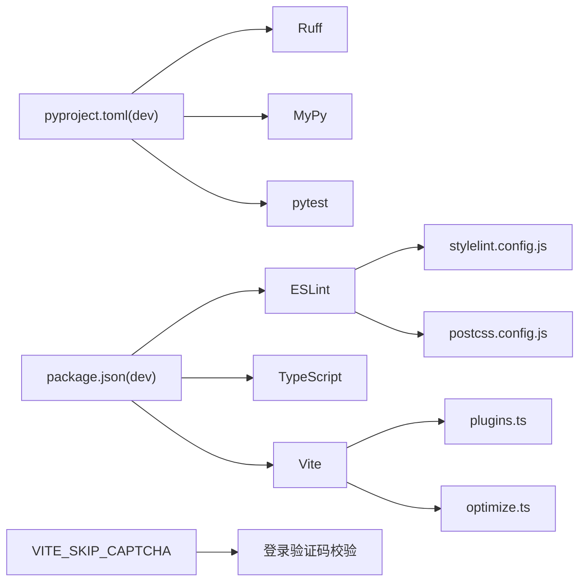

# 开发工具与脚本

<cite>
**本文引用的文件**
- [service/pyproject.toml](file://service/pyproject.toml)
- [service/mypy.ini](file://service/mypy.ini)
- [service/scripts/lint.sh](file://service/scripts/lint.sh)
- [service/scripts/setup_dev.sh](file://service/scripts/setup_dev.sh)
- [service/scripts/setup_dev.bat](file://service/scripts/setup_dev.bat)
- [service/scripts/cli.py](file://service/scripts/cli.py)
- [service/scripts/verify_api.py](file://service/scripts/verify_api.py)
- [service/README.md](file://service/README.md)
- [web/eslint.config.js](file://web/eslint.config.js)
- [web/tsconfig.json](file://web/tsconfig.json)
- [web/vite.config.ts](file://web/vite.config.ts)
- [web/package.json](file://web/package.json)
- [web/build/plugins.ts](file://web/build/plugins.ts)
- [web/build/optimize.ts](file://web/build/optimize.ts)
- [web/postcss.config.js](file://web/postcss.config.js)
- [web/stylelint.config.js](file://web/stylelint.config.js)
- [web/src/views/login/utils/rule.ts](file://web/src/views/login/utils/rule.ts)
- [web/src/views/login/index.vue](file://web/src/views/login/index.vue)
</cite>

## 更新摘要
**变更内容**
- 新增 Ruff 代码质量工具配置，替代传统 flake8/autoflake 组合
- 更新 MyPy 类型检查配置，优化第三方库忽略策略
- 增强后端工具链统一性，使用 pyproject.toml 集中管理所有 Python 开发工具
- 优化前端开发环境配置选项，新增 VITE_SKIP_CAPTCHA 支持

## 目录
1. [简介](#简介)
2. [项目结构](#项目结构)
3. [核心组件](#核心组件)
4. [架构总览](#架构总览)
5. [详细组件分析](#详细组件分析)
6. [依赖分析](#依赖分析)
7. [性能考虑](#性能考虑)
8. [故障排查指南](#故障排查指南)
9. [结论](#结论)
10. [附录](#附录)

## 简介
本文件面向 Hello-FastApi 项目的开发者，系统性讲解开发工具链与自动化脚本的配置与使用，涵盖：
- Python 后端：Ruff 代码格式化与检查、MyPy 类型检查、开发环境初始化、数据库初始化与 RBAC 数据填充、API 功能验证脚本
- 前端 Web：ESLint/Vite/TypeScript/Stylelint 等质量工具与构建优化配置，以及新增的开发环境配置选项
- 最佳实践与效率提升技巧，帮助快速上手并稳定迭代

## 项目结构
项目采用前后端分离的双仓库布局，后端服务位于 service/，前端 Web 应用位于 web/。两者均配有完善的开发工具链与自动化脚本。



**图表来源**
- [service/pyproject.toml:1-77](file://service/pyproject.toml#L1-L77)
- [service/scripts/cli.py:1-276](file://service/scripts/cli.py#L1-L276)
- [service/scripts/setup_dev.sh:1-47](file://service/scripts/setup_dev.sh#L1-L47)
- [service/scripts/setup_dev.bat:1-44](file://service/scripts/setup_dev.bat#L1-L44)
- [service/scripts/lint.sh:1-19](file://service/scripts/lint.sh#L1-L19)
- [service/scripts/verify_api.py:1-156](file://service/scripts/verify_api.py#L1-L156)
- [web/package.json:1-211](file://web/package.json#L1-L211)
- [web/eslint.config.js:1-191](file://web/eslint.config.js#L1-L191)
- [web/tsconfig.json:1-43](file://web/tsconfig.json#L1-L43)
- [web/vite.config.ts:1-73](file://web/vite.config.ts#L1-L73)
- [web/build/plugins.ts:1-79](file://web/build/plugins.ts#L1-L79)
- [web/build/optimize.ts:1-65](file://web/build/optimize.ts#L1-L65)
- [web/postcss.config.js:1-9](file://web/postcss.config.js#L1-L9)
- [web/stylelint.config.js:1-88](file://web/stylelint.config.js#L1-L88)
- [web/src/views/login/utils/rule.ts:14-15](file://web/src/views/login/utils/rule.ts#L14-L15)
- [web/src/views/login/index.vue:66-67](file://web/src/views/login/index.vue#L66-L67)

**章节来源**
- [service/README.md:1-259](file://service/README.md#L1-L259)

## 核心组件
- 后端工具链与脚本
  - Ruff：统一的 Python 代码格式化与静态检查工具，配置于 pyproject.toml
  - MyPy：类型检查工具，配置于 mypy.ini
  - CLI 管理脚本：封装 runserver、createsuperuser、initdb、seedrbac 等命令
  - 初始化脚本：setup_dev.sh / setup_dev.bat，一键创建虚拟环境、安装依赖、格式化、初始化数据库与 RBAC、运行测试
  - 质量检查脚本：lint.sh，集中执行格式化、检查与类型检查
  - API 功能验证：verify_api.py，对健康检查、登录、受保护端点等进行端到端验证
- 前端工具链与构建
  - ESLint：统一 JS/TS/Vue 代码质量规则，集成 Prettier 与 TailwindCSS 规则
  - TypeScript：tsconfig.json 控制严格性、路径映射、类型声明等
  - Vite：vite.config.ts 统一配置基础路径、别名、服务端代理、依赖预优化、构建产物命名与 sourcemap 等
  - 插件体系：build/plugins.ts 提供插件清单，含 Vue、JSX、SVG、图标、CDN、压缩、分析等
  - 依赖预构建：build/optimize.ts 优化首屏与切换页面体验
  - PostCSS/Stylelint：生产环境 CSS 压缩与样式规范
  - **新增** 开发环境配置：VITE_SKIP_CAPTCHA 环境变量，用于跳过验证码校验，提升开发效率

**章节来源**
- [service/pyproject.toml:25-35](file://service/pyproject.toml#L25-L35)
- [service/mypy.ini:1-48](file://service/mypy.ini#L1-L48)
- [service/scripts/cli.py:1-276](file://service/scripts/cli.py#L1-L276)
- [service/scripts/setup_dev.sh:1-47](file://service/scripts/setup_dev.sh#L1-L47)
- [service/scripts/setup_dev.bat:1-44](file://service/scripts/setup_dev.bat#L1-L44)
- [service/scripts/lint.sh:1-19](file://service/scripts/lint.sh#L1-L19)
- [service/scripts/verify_api.py:30-114](file://service/scripts/verify_api.py#L30-L114)
- [web/eslint.config.js:1-191](file://web/eslint.config.js#L1-L191)
- [web/tsconfig.json:1-43](file://web/tsconfig.json#L1-L43)
- [web/vite.config.ts:1-73](file://web/vite.config.ts#L1-L73)
- [web/build/plugins.ts:1-79](file://web/build/plugins.ts#L1-L79)
- [web/build/optimize.ts:1-65](file://web/build/optimize.ts#L1-L65)
- [web/postcss.config.js:1-9](file://web/postcss.config.js#L1-L9)
- [web/stylelint.config.js:1-88](file://web/stylelint.config.js#L1-L88)

## 架构总览
下图展示从"开发者命令"到"工具链执行"的整体流程，以及后端与前端工具链的职责边界。



**图表来源**
- [service/scripts/setup_dev.sh:1-47](file://service/scripts/setup_dev.sh#L1-L47)
- [service/scripts/lint.sh:1-19](file://service/scripts/lint.sh#L1-L19)
- [service/scripts/verify_api.py:117-156](file://service/scripts/verify_api.py#L117-L156)
- [web/package.json:6-23](file://web/package.json#L6-L23)
- [web/eslint.config.js:1-191](file://web/eslint.config.js#L1-L191)
- [web/vite.config.ts:1-73](file://web/vite.config.ts#L1-L73)

## 详细组件分析

### 后端工具链与脚本

#### Ruff 代码格式化与检查
**更新** 新增 Ruff 代码质量工具配置

- 配置要点
  - 目标版本与行宽、源码目录
  - 格式化策略（跳过魔法尾随逗号）
  - 规则选择与导入排序（isort）
  - per-file-ignores 针对 API DTO 的特殊命名规则
- 使用建议
  - 在提交前执行格式化与检查，确保一致性
  - CI 中建议开启 --fix，保证分支合入时的整洁

**章节来源**
- [service/pyproject.toml:47-68](file://service/pyproject.toml#L47-L68)

#### MyPy 类型检查
**更新** 优化 MyPy 类型检查配置

- 配置要点
  - Python 版本、返回值与未使用配置告警
  - 忽略缺失导入、检查未标注定义
  - 针对第三方库的专门忽略配置
- 使用建议
  - 逐步收紧规则，优先修复高优先级问题
  - 对第三方库使用 stub 或忽略缺失导入策略

**章节来源**
- [service/mypy.ini:1-48](file://service/mypy.ini#L1-L48)

#### CLI 管理命令
- 支持命令
  - runserver：启动开发服务器（支持热重载）
  - createsuperuser：**新增** 支持通过命令行参数创建超级管理员，包括用户名、邮箱、密码和昵称参数
  - initdb：初始化数据库表
  - seedrbac：填充默认角色与权限
  - seeddata：初始化测试数据（菜单、日志等）
- 参数解析增强
  - createsuperuser 命令现在支持完整的参数解析，包括短参数和长参数形式
  - 支持的参数：
    - --username/-u：必需，指定用户名
    - --email/-e：必需，指定邮箱地址
    - --password/-p：必需，指定密码
    - --nickname/-n：可选，指定昵称，默认为空
- 调用方式
  - 通过 scripts.cli 入口调用，内部解析参数并分派到对应协程
  - 支持一次性创建超级用户，无需交互式输入



**图表来源**
- [service/scripts/cli.py:29-51](file://service/scripts/cli.py#L29-L51)

**章节来源**
- [service/scripts/cli.py:1-276](file://service/scripts/cli.py#L1-L276)

#### 初始化脚本（Linux/macOS / Windows）
- 功能
  - 安装/检测 UV
  - 创建并激活 Python 3.10 虚拟环境
  - 安装开发依赖（含 Ruff、MyPy、pytest）
  - 执行格式化与检查
  - 初始化数据库与 RBAC 数据
  - 运行测试
- 使用建议
  - 首次克隆后优先使用该脚本，减少手动配置成本
  - 如需自定义，可拆分步骤按需执行

**章节来源**
- [service/scripts/setup_dev.sh:1-47](file://service/scripts/setup_dev.sh#L1-L47)
- [service/scripts/setup_dev.bat:1-44](file://service/scripts/setup_dev.bat#L1-L44)

#### 质量检查脚本
- 功能
  - 格式化检查（不修改文件）
  - 静态检查
  - 类型检查（MyPy）
- 使用建议
  - 在合并前与 CI 中执行，确保质量门槛

**章节来源**
- [service/scripts/lint.sh:1-19](file://service/scripts/lint.sh#L1-L19)

#### API 功能验证脚本
- 功能
  - 健康检查
  - 登录与受保护端点访问
  - 更新个人资料
  - 查询角色与权限列表
  - 未认证访问测试
- **更新** API 端点路径变更
  - 登录端点：`/api/system/login`（原 `/api/v1/auth/login`）
  - 当前用户信息：`/api/system/mine`（原 `/api/v1/auth/mine`）
  - 用户详情：`/api/system/user/info`（原 `/api/v1/auth/user/info`）
  - 角色列表：`/api/system/role`（原 `/api/v1/auth/role`）
  - 权限列表：`/api/system/permission/list`（原 `/api/v1/auth/permission/list`）
- 使用建议
  - 服务启动后运行，快速验证核心链路
  - 可作为集成测试的一部分


**图表来源**
- [service/scripts/verify_api.py:117-156](file://service/scripts/verify_api.py#L117-L156)

**章节来源**
- [service/scripts/verify_api.py:1-156](file://service/scripts/verify_api.py#L1-L156)

### 前端工具链与构建

#### ESLint 配置
- 配置要点
  - 全局忽略模式（隐藏文件、dist、静态资源等）
  - TS/TSX 规则与推荐配置
  - Vue 文件规则（关闭部分严格限制）
  - TailwindCSS 规则与校验
  - Prettier 集成与行尾策略
- 使用建议
  - 在编辑器中启用 ESLint 自动修复
  - 配合 husky/lint-staged 实现提交前检查

**章节来源**
- [web/eslint.config.js:1-191](file://web/eslint.config.js#L1-L191)

#### TypeScript 编译配置
- 配置要点
  - 目标与模块解析（bundler）
  - 严格性与 JSX/装饰器支持
  - 路径别名与类型声明
  - 包含/排除范围
- 使用建议
  - 保持严格性与实际需求平衡
  - 路径别名统一管理，避免相对路径混乱

**章节来源**
- [web/tsconfig.json:1-43](file://web/tsconfig.json#L1-L43)

#### Vite 构建配置
- 配置要点
  - 基础路径、别名解析
  - 本地开发服务器（端口、代理、预热）
  - 依赖预优化 include/exclude
  - 构建目标、产物命名、chunkSizeWarningLimit
  - define 注入常量
- 使用建议
  - 通过环境变量控制 CDN 与压缩开关
  - 生产构建关闭 sourcemap，提升安全性与体积

**章节来源**
- [web/vite.config.ts:1-73](file://web/vite.config.ts#L1-L73)

#### 插件体系与优化
- 插件清单
  - Vue、JSX、SVG 组件化、图标自动加载
  - Mock 服务、I18n、CDN、压缩、分析、移除 console
  - 代码检查辅助（code-inspector-plugin）
- 依赖预构建
  - include 列表覆盖高频第三方库
  - exclude 强制排除非必要包
- 使用建议
  - 按需启用 CDN 与压缩，结合部署策略
  - 分析报告仅在需要时开启

**章节来源**
- [web/build/plugins.ts:1-79](file://web/build/plugins.ts#L1-L79)
- [web/build/optimize.ts:1-65](file://web/build/optimize.ts#L1-L65)

#### PostCSS 与 Stylelint
- PostCSS
  - 生产环境启用 cssnano 压缩
- Stylelint
  - 标准与 HTML/Vue/Sass 扩展
  - Tailwind 相关伪类/元素忽略
  - 规则与顺序校验
- 使用建议
  - 与 Prettier 配合，统一格式与风格
  - 在 CI 中开启 --fix，保证样式一致性

**章节来源**
- [web/postcss.config.js:1-9](file://web/postcss.config.js#L1-L9)
- [web/stylelint.config.js:1-88](file://web/stylelint.config.js#L1-L88)

#### 开发环境配置选项

**新增** VITE_SKIP_CAPTCHA 环境变量配置

- 功能概述
  - 用于在开发环境中跳过验证码校验，提升开发效率
  - 通过环境变量控制验证码校验逻辑
  - 默认情况下启用验证码校验，生产环境保持安全设置

- 配置方式
  - 在 `.env.development` 文件中添加：`VITE_SKIP_CAPTCHA=true`
  - 或在命令行中设置：`VITE_SKIP_CAPTCHA=true npm run dev`

- 实现机制
  - 登录表单验证：`src/views/login/utils/rule.ts`
  - 登录界面逻辑：`src/views/login/index.vue`
  - 通过 `import.meta.env.VITE_SKIP_CAPTCHA === "true"` 判断是否跳过验证码

- 使用场景
  - 开发阶段快速登录测试
  - 自动化测试环境
  - 本地开发调试



**图表来源**
- [web/src/views/login/utils/rule.ts:14-15](file://web/src/views/login/utils/rule.ts#L14-L15)
- [web/src/views/login/index.vue:66-67](file://web/src/views/login/index.vue#L66-L67)

**章节来源**
- [web/src/views/login/utils/rule.ts:14-15](file://web/src/views/login/utils/rule.ts#L14-L15)
- [web/src/views/login/index.vue:66-67](file://web/src/views/login/index.vue#L66-L67)

### 依赖版本更新

**更新** 前端依赖版本升级

- 核心依赖更新
  - axios: `1.14.0`（原版本）
  - swiper: `^12.1.3`（新版本）
  - vue: `^3.5.31`（新版本）
  - wavesurfer.js: `^7.12.5`（新版本）

- 开发依赖更新
  - TypeScript: `^6.0.2`（新版本）
  - Vite: `^8.0.3`（新版本）
  - @vitejs/plugin-vue: `^6.0.5`（新版本）
  - @vitejs/plugin-vue-jsx: `^5.1.5`（新版本）

- 使用建议
  - 确保 Node.js 版本满足新依赖要求
  - 清理缓存后重新安装依赖
  - 检查兼容性问题

**章节来源**
- [web/package.json:66-113](file://web/package.json#L66-L113)
- [web/package.json:165-176](file://web/package.json#L165-L176)

## 依赖分析
- 后端
  - 工具链依赖集中在 pyproject.toml 的 dev 分组与工具配置段落
  - CLI 依赖 uvicorn、数据库初始化与仓储模块
- 前端
  - 工具链依赖集中在 package.json 的 devDependencies
  - 构建依赖 vite、@vitejs/plugin-vue、@vitejs/plugin-vue-jsx 等
  - 插件与优化依赖 build/plugins.ts 与 build/optimize.ts
  - **新增** 开发环境配置依赖 import.meta.env 环境变量系统



**图表来源**
- [service/pyproject.toml:25-35](file://service/pyproject.toml#L25-L35)
- [web/package.json:115-176](file://web/package.json#L115-L176)
- [web/build/plugins.ts:1-79](file://web/build/plugins.ts#L1-L79)
- [web/build/optimize.ts:1-65](file://web/build/optimize.ts#L1-L65)
- [web/postcss.config.js:1-9](file://web/postcss.config.js#L1-L9)
- [web/stylelint.config.js:1-88](file://web/stylelint.config.js#L1-L88)
- [web/src/views/login/utils/rule.ts:14-15](file://web/src/views/login/utils/rule.ts#L14-L15)

**章节来源**
- [service/pyproject.toml:25-35](file://service/pyproject.toml#L25-L35)
- [web/package.json:115-176](file://web/package.json#L115-L176)

## 性能考虑
- 后端
  - 使用 Ruff 与 MyPy 在开发期拦截问题，减少运行期开销
  - 初始化脚本中先格式化再检查，避免重复工作
- 前端
  - 依赖预优化 include/exclude 显著改善首屏与切换页面体验
  - 生产构建关闭 sourcemap，减小体积并提升加载速度
  - 通过 CDN 与压缩插件进一步优化网络传输
  - 使用打包分析报告定位大体积模块，持续优化
  - **新增** 开发环境跳过验证码校验，减少不必要的网络请求

**章节来源**
- [web/build/optimize.ts:1-65](file://web/build/optimize.ts#L1-L65)
- [web/vite.config.ts:45-73](file://web/vite.config.ts#L45-L73)
- [web/build/plugins.ts:67-75](file://web/build/plugins.ts#L67-L75)
- [web/src/views/login/utils/rule.ts:36-40](file://web/src/views/login/utils/rule.ts#L36-L40)

## 故障排查指南
- 后端
  - Ruff/MyPy 报错：根据工具输出逐项修复；必要时放宽规则或补充类型注解
  - 初始化失败：确认虚拟环境已激活且依赖安装完成；检查数据库连接配置
  - CLI 命令异常：核对命令拼写与参数；查看日志输出
  - **createsuperuser 参数错误：检查 --username、--email、--password 参数是否正确提供**
- 前端
  - ESLint 报错：启用自动修复；检查规则配置与文件类型
  - Vite 启动缓慢：检查 optimizeDeps.include 是否包含所需依赖；清理缓存后重试
  - 样式不生效：确认 Stylelint 规则与 Tailwind 配置；检查 PostCSS 插件启用情况
  - **验证码校验问题：检查 VITE_SKIP_CAPTCHA 环境变量设置；确认值为 'true' 时跳过校验**
  - **API 端点错误：确认使用新的 /api/system/* 路径而非 /api/v1/auth/* 路径**

**章节来源**
- [service/scripts/lint.sh:1-19](file://service/scripts/lint.sh#L1-L19)
- [service/scripts/cli.py:29-51](file://service/scripts/cli.py#L29-L51)
- [web/eslint.config.js:1-191](file://web/eslint.config.js#L1-L191)
- [web/build/optimize.ts:1-65](file://web/build/optimize.ts#L1-L65)
- [web/postcss.config.js:1-9](file://web/postcss.config.js#L1-L9)
- [web/stylelint.config.js:1-88](file://web/stylelint.config.js#L1-L88)
- [web/src/views/login/utils/rule.ts:14-15](file://web/src/views/login/utils/rule.ts#L14-L15)
- [service/scripts/verify_api.py:30-114](file://service/scripts/verify_api.py#L30-L114)

## 结论
通过统一的工具链与自动化脚本，Hello-FastApi 在后端与前端分别实现了高质量、高效率的开发体验。**最新的变更包括新增的 Ruff 代码质量工具和优化的 MyPy 类型检查配置，进一步提升了开发效率和系统稳定性**。建议团队在日常工作中坚持：
- 提交前执行 lint.sh 与前端 lint 脚本
- 使用初始化脚本快速搭建环境
- 以 verify_api.py 与集成测试保障核心链路
- **利用增强的 CLI 命令快速创建超级用户，支持自动化部署流程**
- **合理使用 VITE_SKIP_CAPTCHA 环境变量提升开发效率**
- 持续优化依赖预构建与构建配置，提升开发与发布效率

## 附录

### 后端工具链最佳实践
- 使用 Ruff 统一格式化与检查，CI 中开启 --fix
- 逐步收紧 MyPy 规则，优先补齐关键模块类型
- 将 CLI 命令纳入开发流程，避免手工操作遗漏
- 初始化脚本作为首次环境准备的标准流程
- **利用增强的 createsuperuser 命令支持自动化部署和测试环境设置**

**章节来源**
- [service/pyproject.toml:47-68](file://service/pyproject.toml#L47-L68)
- [service/mypy.ini:1-48](file://service/mypy.ini#L1-L48)
- [service/scripts/setup_dev.sh:1-47](file://service/scripts/setup_dev.sh#L1-L47)
- [service/scripts/lint.sh:1-19](file://service/scripts/lint.sh#L1-L19)
- [service/scripts/cli.py:1-276](file://service/scripts/cli.py#L1-L276)

### 前端工具链最佳实践
- 在编辑器中启用 ESLint/Prettier 自动修复
- 使用 husky/lint-staged 在提交前拦截问题
- 通过 optimizeDeps.include 精准优化常用依赖
- 生产构建启用压缩与 CDN，结合分析报告持续优化
- **合理配置 VITE_SKIP_CAPTCHA 环境变量提升开发效率**

**章节来源**
- [web/eslint.config.js:1-191](file://web/eslint.config.js#L1-L191)
- [web/tsconfig.json:1-43](file://web/tsconfig.json#L1-L43)
- [web/vite.config.ts:1-73](file://web/vite.config.ts#L1-L73)
- [web/build/plugins.ts:1-79](file://web/build/plugins.ts#L1-L79)
- [web/build/optimize.ts:1-65](file://web/build/optimize.ts#L1-L65)
- [web/postcss.config.js:1-9](file://web/postcss.config.js#L1-L9)
- [web/stylelint.config.js:1-88](file://web/stylelint.config.js#L1-L88)

### CLI 命令使用示例
**新增** 以下示例展示了如何使用增强的 createsuperuser 命令：

```bash
# 基本用法 - 创建超级用户
python -m scripts.cli createsuperuser --username admin --password admin123 --email admin@example.com

# 使用短参数
python -m scripts.cli createsuperuser -u admin -p admin123 -e admin@example.com

# 包含昵称参数
python -m scripts.cli createsuperuser --username admin --password admin123 --email admin@example.com --nickname 管理员

# 查看帮助
python -m scripts.cli createsuperuser --help
```

**章节来源**
- [service/scripts/cli.py:240-254](file://service/scripts/cli.py#L240-L254)

### 开发环境配置示例

**新增** 以下示例展示了如何配置 VITE_SKIP_CAPTCHA 环境变量：

```bash
# 方法1：在 .env.development 文件中添加
echo "VITE_SKIP_CAPTCHA=true" >> .env.development

# 方法2：在命令行中设置
VITE_SKIP_CAPTCHA=true npm run dev

# 方法3：在 package.json 中设置
{
  "scripts": {
    "dev": "VITE_SKIP_CAPTCHA=true vite"
  }
}
```

**章节来源**
- [web/src/views/login/utils/rule.ts:14-15](file://web/src/views/login/utils/rule.ts#L14-L15)
- [web/src/views/login/index.vue:66-67](file://web/src/views/login/index.vue#L66-L67)

### API 端点路径迁移指南

**更新** 从旧版本路径迁移到新版本路径：

- 登录接口：`/api/v1/auth/login` → `/api/system/login`
- 当前用户：`/api/v1/auth/mine` → `/api/system/mine`
- 用户详情：`/api/v1/auth/user/info` → `/api/system/user/info`
- 角色列表：`/api/v1/auth/role` → `/api/system/role`
- 权限列表：`/api/v1/auth/permission/list` → `/api/system/permission/list`

**章节来源**
- [service/scripts/verify_api.py:30-114](file://service/scripts/verify_api.py#L30-L114)