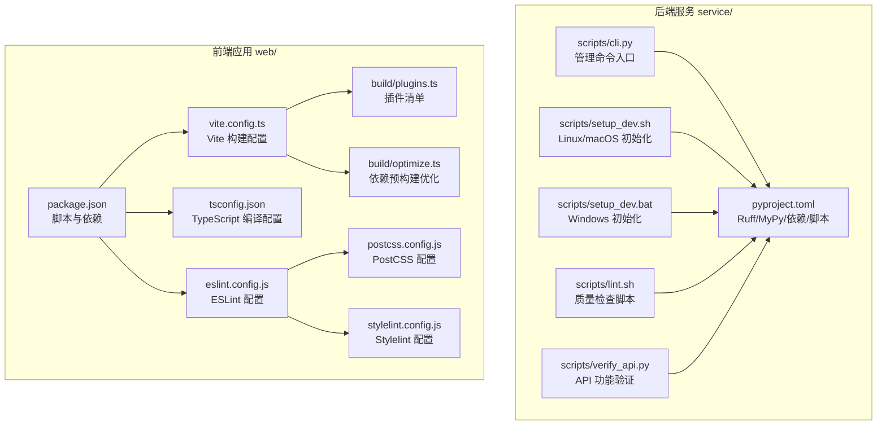
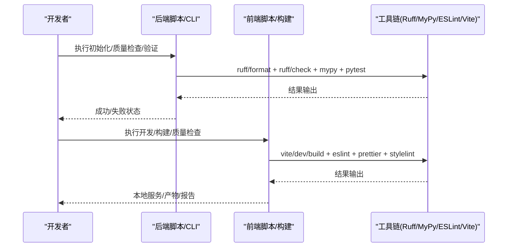
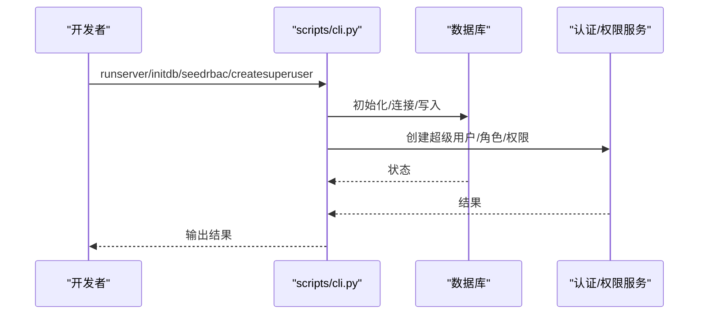
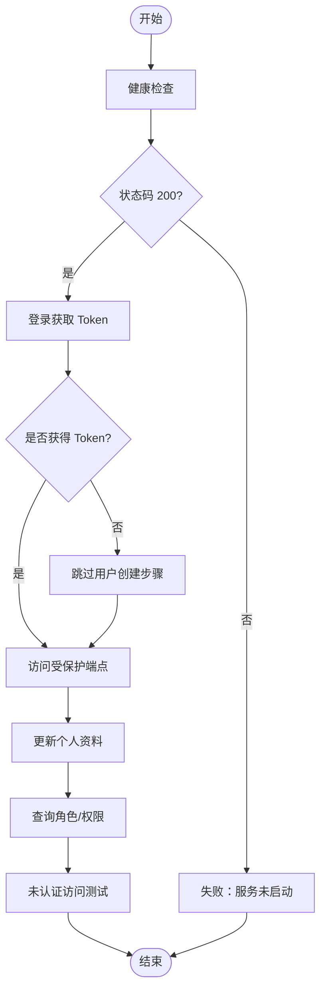
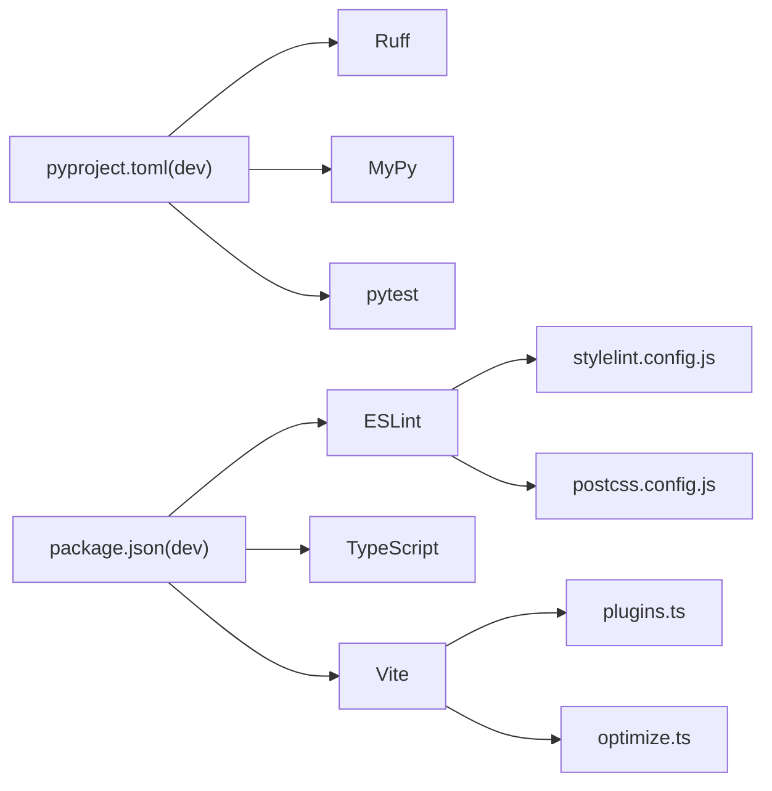

# 开发工具与脚本

<cite>
**本文引用的文件**
- [service/pyproject.toml](file://service/pyproject.toml)
- [service/scripts/lint.sh](file://service/scripts/lint.sh)
- [service/scripts/setup_dev.sh](file://service/scripts/setup_dev.sh)
- [service/scripts/setup_dev.bat](file://service/scripts/setup_dev.bat)
- [service/scripts/cli.py](file://service/scripts/cli.py)
- [service/scripts/verify_api.py](file://service/scripts/verify_api.py)
- [service/README.md](file://service/README.md)
- [web/eslint.config.js](file://web/eslint.config.js)
- [web/tsconfig.json](file://web/tsconfig.json)
- [web/vite.config.ts](file://web/vite.config.ts)
- [web/package.json](file://web/package.json)
- [web/build/plugins.ts](file://web/build/plugins.ts)
- [web/build/optimize.ts](file://web/build/optimize.ts)
- [web/postcss.config.js](file://web/postcss.config.js)
- [web/stylelint.config.js](file://web/stylelint.config.js)
</cite>

## 目录
1. [简介](#简介)
2. [项目结构](#项目结构)
3. [核心组件](#核心组件)
4. [架构总览](#架构总览)
5. [详细组件分析](#详细组件分析)
6. [依赖分析](#依赖分析)
7. [性能考虑](#性能考虑)
8. [故障排查指南](#故障排查指南)
9. [结论](#结论)
10. [附录](#附录)

## 简介
本文件面向 Hello-FastApi 项目的开发者，系统性讲解开发工具链与自动化脚本的配置与使用，涵盖：
- Python 后端：Ruff 代码格式化与检查、MyPy 类型检查、开发环境初始化、数据库初始化与 RBAC 数据填充、API 功能验证脚本
- 前端 Web：ESLint/Vite/TypeScript/Stylelint 等质量工具与构建优化配置
- 最佳实践与效率提升技巧，帮助快速上手并稳定迭代

## 项目结构
项目采用前后端分离的双仓库布局，后端服务位于 service/，前端 Web 应用位于 web/。两者均配有完善的开发工具链与自动化脚本。

图表来源
- [service/pyproject.toml:1-76](file://service/pyproject.toml#L1-L76)
- [service/scripts/cli.py:1-135](file://service/scripts/cli.py#L1-L135)
- [service/scripts/setup_dev.sh:1-47](file://service/scripts/setup_dev.sh#L1-L47)
- [service/scripts/setup_dev.bat:1-44](file://service/scripts/setup_dev.bat#L1-L44)
- [service/scripts/lint.sh:1-19](file://service/scripts/lint.sh#L1-L19)
- [service/scripts/verify_api.py:1-176](file://service/scripts/verify_api.py#L1-L176)
- [web/package.json:1-210](file://web/package.json#L1-L210)
- [web/eslint.config.js:1-191](file://web/eslint.config.js#L1-L191)
- [web/tsconfig.json:1-55](file://web/tsconfig.json#L1-L55)
- [web/vite.config.ts:1-67](file://web/vite.config.ts#L1-L67)
- [web/build/plugins.ts:1-77](file://web/build/plugins.ts#L1-L77)
- [web/build/optimize.ts:1-65](file://web/build/optimize.ts#L1-L65)
- [web/postcss.config.js:1-9](file://web/postcss.config.js#L1-L9)
- [web/stylelint.config.js:1-88](file://web/stylelint.config.js#L1-L88)

章节来源
- [service/README.md:1-259](file://service/README.md#L1-L259)

## 核心组件
- 后端工具链与脚本
  - Ruff：统一的 Python 代码格式化与静态检查工具，配置于 pyproject.toml
  - MyPy：类型检查工具，配置于 pyproject.toml
  - CLI 管理脚本：封装 runserver、createsuperuser、initdb、seedrbac 等命令
  - 初始化脚本：setup_dev.sh / setup_dev.bat，一键创建虚拟环境、安装依赖、格式化、初始化数据库与 RBAC、运行测试
  - 质量检查脚本：lint.sh，集中执行格式化、检查与类型检查
  - API 功能验证：verify_api.py，对健康检查、登录、受保护端点等进行端到端验证
- 前端工具链与构建
  - ESLint：统一 JS/TS/Vue 代码质量规则，集成 Prettier 与 TailwindCSS 规则
  - TypeScript：tsconfig.json 控制严格性、路径映射、类型声明等
  - Vite：vite.config.ts 统一配置基础路径、别名、服务端代理、依赖预优化、构建产物命名与 sourcemap 等
  - 插件体系：build/plugins.ts 提供插件清单，含 Vue、JSX、SVG、图标、CDN、压缩、分析等
  - 依赖预构建：build/optimize.ts 优化首屏与切换页面体验
  - PostCSS/Stylelint：生产环境 CSS 压缩与样式规范

章节来源
- [service/pyproject.toml:44-76](file://service/pyproject.toml#L44-L76)
- [service/scripts/cli.py:1-135](file://service/scripts/cli.py#L1-L135)
- [service/scripts/setup_dev.sh:1-47](file://service/scripts/setup_dev.sh#L1-L47)
- [service/scripts/setup_dev.bat:1-44](file://service/scripts/setup_dev.bat#L1-L44)
- [service/scripts/lint.sh:1-19](file://service/scripts/lint.sh#L1-L19)
- [service/scripts/verify_api.py:1-176](file://service/scripts/verify_api.py#L1-L176)
- [web/eslint.config.js:1-191](file://web/eslint.config.js#L1-L191)
- [web/tsconfig.json:1-55](file://web/tsconfig.json#L1-L55)
- [web/vite.config.ts:1-67](file://web/vite.config.ts#L1-L67)
- [web/build/plugins.ts:1-77](file://web/build/plugins.ts#L1-L77)
- [web/build/optimize.ts:1-65](file://web/build/optimize.ts#L1-L65)
- [web/postcss.config.js:1-9](file://web/postcss.config.js#L1-L9)
- [web/stylelint.config.js:1-88](file://web/stylelint.config.js#L1-L88)

## 架构总览
下图展示从“开发者命令”到“工具链执行”的整体流程，以及后端与前端工具链的职责边界。

图表来源
- [service/scripts/setup_dev.sh:1-47](file://service/scripts/setup_dev.sh#L1-L47)
- [service/scripts/lint.sh:1-19](file://service/scripts/lint.sh#L1-L19)
- [service/scripts/verify_api.py:1-176](file://service/scripts/verify_api.py#L1-L176)
- [web/package.json:6-22](file://web/package.json#L6-L22)
- [web/eslint.config.js:1-191](file://web/eslint.config.js#L1-L191)
- [web/vite.config.ts:1-67](file://web/vite.config.ts#L1-L67)

## 详细组件分析

### 后端工具链与脚本

#### Ruff 代码格式化与检查
- 配置要点
  - 目标版本与行宽、源码目录
  - 格式化策略（跳过魔法尾随逗号）
  - 规则选择与导入排序（isort）
- 使用建议
  - 在提交前执行格式化与检查，确保一致性
  - CI 中建议开启 --fix，保证分支合入时的整洁

章节来源
- [service/pyproject.toml:44-61](file://service/pyproject.toml#L44-L61)

#### MyPy 类型检查
- 配置要点
  - Python 版本、返回值与未使用配置告警、忽略缺失导入、检查未标注定义
- 使用建议
  - 逐步收紧规则，优先修复高优先级问题
  - 对第三方库使用 stub 或忽略缺失导入策略

章节来源
- [service/pyproject.toml:62-67](file://service/pyproject.toml#L62-L67)

#### CLI 管理命令
- 支持命令
  - runserver：启动开发服务器（支持热重载）
  - createsuperuser：交互式创建超级管理员
  - initdb：初始化数据库表
  - seedrbac：填充默认角色与权限
- 调用方式
  - 通过 scripts.cli 入口调用，内部解析参数并分派到对应协程

图表来源
- [service/scripts/cli.py:22-101](file://service/scripts/cli.py#L22-L101)

章节来源
- [service/scripts/cli.py:1-135](file://service/scripts/cli.py#L1-L135)

#### 初始化脚本（Linux/macOS / Windows）
- 功能
  - 安装/检测 UV
  - 创建并激活 Python 3.10 虚拟环境
  - 安装开发依赖（含 Ruff、MyPy、pytest）
  - 执行格式化与检查
  - 初始化数据库与 RBAC 数据
  - 运行测试
- 使用建议
  - 首次克隆后优先使用该脚本，减少手动配置成本
  - 如需自定义，可拆分步骤按需执行

章节来源
- [service/scripts/setup_dev.sh:1-47](file://service/scripts/setup_dev.sh#L1-L47)
- [service/scripts/setup_dev.bat:1-44](file://service/scripts/setup_dev.bat#L1-L44)

#### 质量检查脚本
- 功能
  - 格式化检查（不修改文件）
  - 静态检查
  - 类型检查（MyPy）
- 使用建议
  - 在合并前与 CI 中执行，确保质量门槛

章节来源
- [service/scripts/lint.sh:1-19](file://service/scripts/lint.sh#L1-L19)

#### API 功能验证脚本
- 功能
  - 健康检查
  - 登录与受保护端点访问
  - 更新个人资料
  - 查询角色与权限列表
  - 未认证访问测试
- 使用建议
  - 服务启动后运行，快速验证核心链路
  - 可作为集成测试的一部分

图表来源
- [service/scripts/verify_api.py:137-176](file://service/scripts/verify_api.py#L137-L176)

章节来源
- [service/scripts/verify_api.py:1-176](file://service/scripts/verify_api.py#L1-L176)

### 前端工具链与构建

#### ESLint 配置
- 配置要点
  - 全局忽略模式（隐藏文件、dist、静态资源等）
  - TS/TSX 规则与推荐配置
  - Vue 文件规则（关闭部分严格限制）
  - TailwindCSS 规则与校验
  - Prettier 集成与行尾策略
- 使用建议
  - 在编辑器中启用 ESLint 自动修复
  - 配合 husky/lint-staged 实现提交前检查

章节来源
- [web/eslint.config.js:1-191](file://web/eslint.config.js#L1-L191)

#### TypeScript 编译配置
- 配置要点
  - 目标与模块解析（bundler）
  - 严格性与 JSX/装饰器支持
  - 路径别名与类型声明
  - 包含/排除范围
- 使用建议
  - 保持严格性与实际需求平衡
  - 路径别名统一管理，避免相对路径混乱

章节来源
- [web/tsconfig.json:1-55](file://web/tsconfig.json#L1-L55)

#### Vite 构建配置
- 配置要点
  - 基础路径、别名解析
  - 本地开发服务器（端口、代理、预热）
  - 依赖预优化 include/exclude
  - 构建目标、产物命名、chunkSizeWarningLimit
  - define 注入常量
- 使用建议
  - 通过环境变量控制 CDN 与压缩开关
  - 生产构建关闭 sourcemap，提升安全性与体积

章节来源
- [web/vite.config.ts:1-67](file://web/vite.config.ts#L1-L67)

#### 插件体系与优化
- 插件清单
  - Vue、JSX、SVG 组件化、图标自动加载
  - Mock 服务、I18n、CDN、压缩、分析、移除 console
  - 代码检查辅助（code-inspector-plugin）
- 依赖预构建
  - include 列表覆盖高频第三方库
  - exclude 强制排除非必要包
- 使用建议
  - 按需启用 CDN 与压缩，结合部署策略
  - 分析报告仅在需要时开启

章节来源
- [web/build/plugins.ts:1-77](file://web/build/plugins.ts#L1-L77)
- [web/build/optimize.ts:1-65](file://web/build/optimize.ts#L1-L65)

#### PostCSS 与 Stylelint
- PostCSS
  - 生产环境启用 cssnano 压缩
- Stylelint
  - 标准与 HTML/Vue/Sass 扩展
  - Tailwind 相关伪类/元素忽略
  - 规则与顺序校验
- 使用建议
  - 与 Prettier 配合，统一格式与风格
  - 在 CI 中开启 --fix，保证样式一致性

章节来源
- [web/postcss.config.js:1-9](file://web/postcss.config.js#L1-L9)
- [web/stylelint.config.js:1-88](file://web/stylelint.config.js#L1-L88)

## 依赖分析
- 后端
  - 工具链依赖集中在 pyproject.toml 的 dev 分组与工具配置段落
  - CLI 依赖 uvicorn、数据库初始化与仓储模块
- 前端
  - 工具链依赖集中在 package.json 的 devDependencies
  - 构建依赖 vite、@vitejs/plugin-vue、@vitejs/plugin-vue-jsx 等
  - 插件与优化依赖 build/plugins.ts 与 build/optimize.ts

图表来源
- [service/pyproject.toml:22-32](file://service/pyproject.toml#L22-L32)
- [web/package.json:115-176](file://web/package.json#L115-L176)
- [web/build/plugins.ts:1-77](file://web/build/plugins.ts#L1-L77)
- [web/build/optimize.ts:1-65](file://web/build/optimize.ts#L1-L65)
- [web/postcss.config.js:1-9](file://web/postcss.config.js#L1-L9)
- [web/stylelint.config.js:1-88](file://web/stylelint.config.js#L1-L88)

章节来源
- [service/pyproject.toml:22-32](file://service/pyproject.toml#L22-L32)
- [web/package.json:115-176](file://web/package.json#L115-L176)

## 性能考虑
- 后端
  - 使用 Ruff 与 MyPy 在开发期拦截问题，减少运行期开销
  - 初始化脚本中先格式化再检查，避免重复工作
- 前端
  - 依赖预优化 include/exclude 显著改善首屏与切换页面体验
  - 生产构建关闭 sourcemap，减小体积并提升加载速度
  - 通过 CDN 与压缩插件进一步优化网络传输
  - 使用打包分析报告定位大体积模块，持续优化

章节来源
- [web/build/optimize.ts:1-65](file://web/build/optimize.ts#L1-L65)
- [web/vite.config.ts:35-60](file://web/vite.config.ts#L35-L60)
- [web/build/plugins.ts:67-75](file://web/build/plugins.ts#L67-L75)

## 故障排查指南
- 后端
  - Ruff/MyPy 报错：根据工具输出逐项修复；必要时放宽规则或补充类型注解
  - 初始化失败：确认虚拟环境已激活且依赖安装完成；检查数据库连接配置
  - CLI 命令异常：核对命令拼写与参数；查看日志输出
- 前端
  - ESLint 报错：启用自动修复；检查规则配置与文件类型
  - Vite 启动缓慢：检查 optimizeDeps.include 是否包含所需依赖；清理缓存后重试
  - 样式不生效：确认 Stylelint 规则与 Tailwind 配置；检查 PostCSS 插件启用情况

章节来源
- [service/scripts/lint.sh:1-19](file://service/scripts/lint.sh#L1-L19)
- [service/scripts/cli.py:103-131](file://service/scripts/cli.py#L103-L131)
- [web/eslint.config.js:1-191](file://web/eslint.config.js#L1-L191)
- [web/build/optimize.ts:1-65](file://web/build/optimize.ts#L1-L65)
- [web/postcss.config.js:1-9](file://web/postcss.config.js#L1-L9)
- [web/stylelint.config.js:1-88](file://web/stylelint.config.js#L1-L88)

## 结论
通过统一的工具链与自动化脚本，Hello-FastApi 在后端与前端分别实现了高质量、高效率的开发体验。建议团队在日常工作中坚持：
- 提交前执行 lint.sh 与前端 lint 脚本
- 使用初始化脚本快速搭建环境
- 以 verify_api.py 与集成测试保障核心链路
- 持续优化依赖预构建与构建配置，提升开发与发布效率

## 附录

### 后端工具链最佳实践
- 使用 Ruff 统一格式化与检查，CI 中开启 --fix
- 逐步收紧 MyPy 规则，优先补齐关键模块类型
- 将 CLI 命令纳入开发流程，避免手工操作遗漏
- 初始化脚本作为首次环境准备的标准流程

章节来源
- [service/pyproject.toml:44-76](file://service/pyproject.toml#L44-L76)
- [service/scripts/setup_dev.sh:1-47](file://service/scripts/setup_dev.sh#L1-L47)
- [service/scripts/lint.sh:1-19](file://service/scripts/lint.sh#L1-L19)
- [service/scripts/cli.py:1-135](file://service/scripts/cli.py#L1-L135)

### 前端工具链最佳实践
- 在编辑器中启用 ESLint/Prettier 自动修复
- 使用 husky/lint-staged 在提交前拦截问题
- 通过 optimizeDeps.include 精准优化常用依赖
- 生产构建启用压缩与 CDN，结合分析报告持续优化

章节来源
- [web/eslint.config.js:1-191](file://web/eslint.config.js#L1-L191)
- [web/tsconfig.json:1-55](file://web/tsconfig.json#L1-L55)
- [web/vite.config.ts:1-67](file://web/vite.config.ts#L1-L67)
- [web/build/plugins.ts:1-77](file://web/build/plugins.ts#L1-L77)
- [web/build/optimize.ts:1-65](file://web/build/optimize.ts#L1-L65)
- [web/postcss.config.js:1-9](file://web/postcss.config.js#L1-L9)
- [web/stylelint.config.js:1-88](file://web/stylelint.config.js#L1-L88)