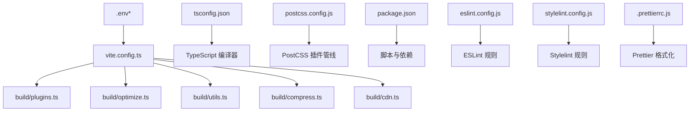
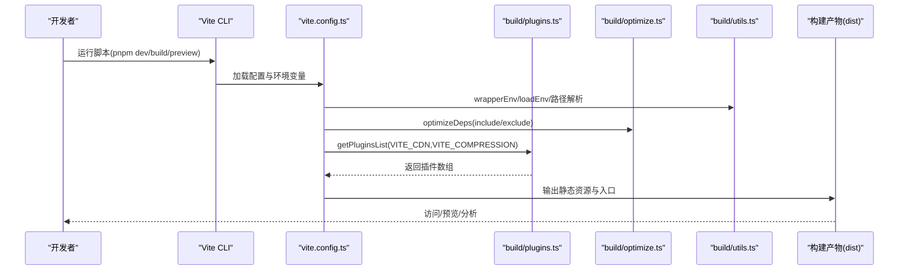
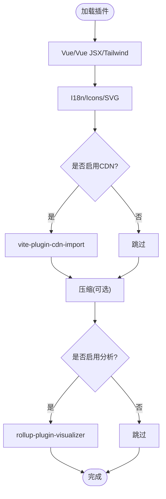
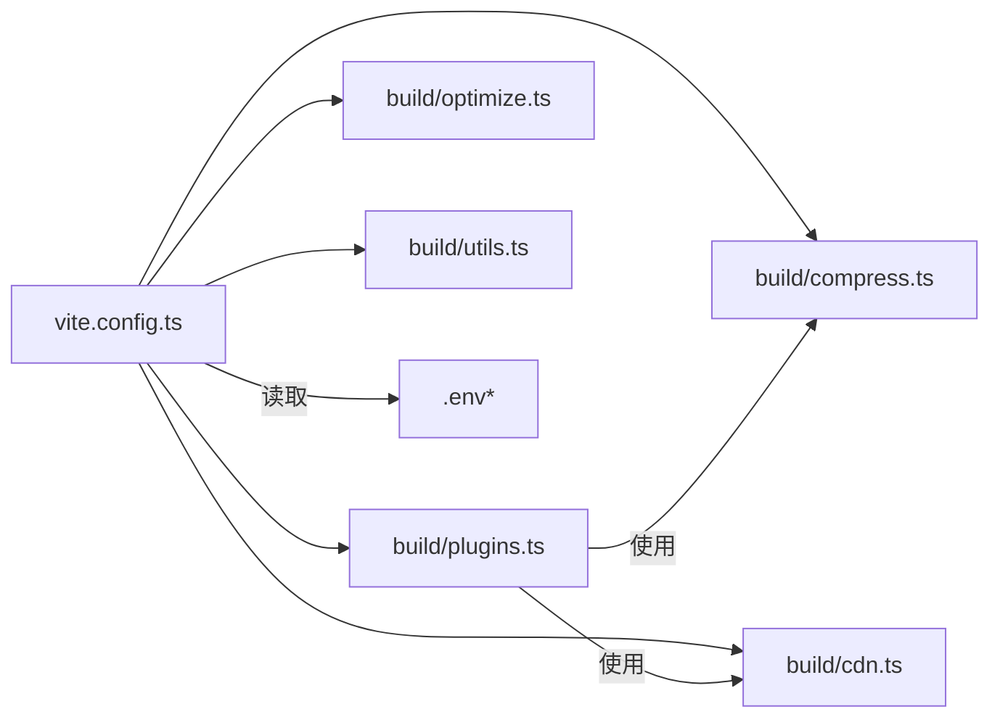

# 构建工具配置

<cite>
**本文引用的文件**
- [vite.config.ts](file://web/vite.config.ts)
- [tsconfig.json](file://web/tsconfig.json)
- [postcss.config.js](file://web/postcss.config.js)
- [package.json](file://web/package.json)
- [build/plugins.ts](file://web/build/plugins.ts)
- [build/optimize.ts](file://web/build/optimize.ts)
- [build/compress.ts](file://web/build/compress.ts)
- [build/cdn.ts](file://web/build/cdn.ts)
- [build/utils.ts](file://web/build/utils.ts)
- [.env](file://web/.env)
- [.env.production](file://web/.env.production)
- [.env.staging](file://web/.env.staging)
- [eslint.config.js](file://web/eslint.config.js)
- [stylelint.config.js](file://web/stylelint.config.js)
- [.prettierrc.js](file://web/.prettierrc.js)
</cite>

## 目录
1. [简介](#简介)
2. [项目结构](#项目结构)
3. [核心组件](#核心组件)
4. [架构总览](#架构总览)
5. [详细组件分析](#详细组件分析)
6. [依赖关系分析](#依赖关系分析)
7. [性能考量](#性能考量)
8. [故障排查指南](#故障排查指南)
9. [结论](#结论)
10. [附录](#附录)

## 简介
本文件系统性梳理前端工程的构建工具配置，覆盖 Vite 开发服务器与构建优化、TypeScript 编译配置、PostCSS 及相关插件、包管理与脚本、以及构建流程优化策略（代码分割、Tree Shaking、压缩等）。同时提供开发与生产/预发布环境的差异化配置说明，并给出性能优化与故障排查建议。

## 项目结构
前端工程位于 web 目录，构建相关的关键文件分布如下：
- 构建入口与主配置：vite.config.ts
- 插件装配：build/plugins.ts
- 依赖预优化：build/optimize.ts
- 压缩与CDN：build/compress.ts、build/cdn.ts
- 工具函数与环境变量封装：build/utils.ts
- 编译配置：tsconfig.json
- 样式处理：postcss.config.js
- 包与脚本：package.json
- 环境变量：.env、.env.production、.env.staging
- 代码质量：eslint.config.js、stylelint.config.js、.prettierrc.js

图表来源
- [vite.config.ts:12-67](file://web/vite.config.ts#L12-L67)
- [build/plugins.ts:17-77](file://web/build/plugins.ts#L17-L77)
- [build/optimize.ts:1-65](file://web/build/optimize.ts#L1-L65)
- [build/compress.ts:5-64](file://web/build/compress.ts#L5-L64)
- [build/cdn.ts:8-50](file://web/build/cdn.ts#L8-L50)
- [build/utils.ts:50-78](file://web/build/utils.ts#L50-L78)
- [tsconfig.json:1-55](file://web/tsconfig.json#L1-L55)
- [postcss.config.js:1-9](file://web/postcss.config.js#L1-L9)
- [package.json:1-210](file://web/package.json#L1-L210)

章节来源
- [vite.config.ts:12-67](file://web/vite.config.ts#L12-L67)
- [build/plugins.ts:17-77](file://web/build/plugins.ts#L17-L77)
- [build/optimize.ts:1-65](file://web/build/optimize.ts#L1-L65)
- [build/compress.ts:5-64](file://web/build/compress.ts#L5-L64)
- [build/cdn.ts:8-50](file://web/build/cdn.ts#L8-L50)
- [build/utils.ts:50-78](file://web/build/utils.ts#L50-L78)
- [tsconfig.json:1-55](file://web/tsconfig.json#L1-L55)
- [postcss.config.js:1-9](file://web/postcss.config.js#L1-L9)
- [package.json:1-210](file://web/package.json#L1-L210)

## 核心组件
- Vite 主配置：集中定义基础路径、别名、开发服务器、插件列表、依赖预优化、构建输出与全局常量注入。
- 插件体系：统一从 build/plugins.ts 动态装配，涵盖 Vue/Vue JSX、TailwindCSS、SVG 组件化、图标按需加载、i18n、Mock、CDN、压缩、打包分析、控制台清理等。
- 依赖预优化：通过 build/optimize.ts 显式 include/exclude 列表，确保开发体验与缓存命中。
- 环境变量与模式：.env、.env.production、.env.staging 提供不同环境的差异化配置；wrapperEnv 进行类型安全封装。
- 编译与路径映射：tsconfig.json 定义严格性、模块解析、路径映射与类型声明范围。
- 样式管线：postcss.config.js 条件启用 cssnano 生产优化。
- 包与脚本：package.json 提供开发、构建、预览、报告、类型检查、代码质量等脚本与依赖清单。

章节来源
- [vite.config.ts:12-67](file://web/vite.config.ts#L12-L67)
- [build/plugins.ts:17-77](file://web/build/plugins.ts#L17-L77)
- [build/optimize.ts:1-65](file://web/build/optimize.ts#L1-L65)
- [build/utils.ts:50-78](file://web/build/utils.ts#L50-L78)
- [tsconfig.json:1-55](file://web/tsconfig.json#L1-L55)
- [postcss.config.js:1-9](file://web/postcss.config.js#L1-L9)
- [package.json:1-210](file://web/package.json#L1-L210)

## 架构总览
下图展示从命令到最终产物的构建链路，以及关键配置点如何影响流程。

图表来源
- [vite.config.ts:12-67](file://web/vite.config.ts#L12-L67)
- [build/plugins.ts:17-77](file://web/build/plugins.ts#L17-L77)
- [build/optimize.ts:1-65](file://web/build/optimize.ts#L1-L65)
- [build/utils.ts:50-78](file://web/build/utils.ts#L50-L78)
- [package.json:6-22](file://web/package.json#L6-L22)

## 详细组件分析

### Vite 配置与开发服务器
- 基础路径与根目录：基于 wrapperEnv 的 VITE_PUBLIC_PATH 与 root。
- 别名：@ 指向 src，@build 指向 build 目录，便于统一导入。
- 开发服务器：
  - 端口：VITE_PORT，默认 8848。
  - host：允许外部访问。
  - 预热：warmup 预热 index.html 与 src/views、src/components，减少首屏等待。
- 依赖预优化：optimizeDeps.include/exclude 精准控制预构建模块集合。
- 构建输出：
  - 目标：es2015。
  - Source map：关闭。
  - 分包命名：静态资源与入口分别按 hash 命名，避免缓存穿透。
  - 警告阈值：chunkSizeWarningLimit 提升大包容忍度。
- 全局常量：__APP_INFO__ 注入包信息与构建时间；禁用国际化开发工具开关。

章节来源
- [vite.config.ts:12-67](file://web/vite.config.ts#L12-L67)
- [build/utils.ts:38-48](file://web/build/utils.ts#L38-L48)
- [build/optimize.ts:7-62](file://web/build/optimize.ts#L7-L62)

### 插件配置与功能矩阵
- 装配入口：getPluginsList(VITE_CDN, VITE_COMPRESSION) 动态返回插件数组。
- 核心插件：
  - Vue/Vue JSX：支持 .vue 与 JSX/TSX。
  - TailwindCSS：样式框架集成。
  - SVG Loader：SVG 组件化。
  - Icons：按需加载图标。
  - Vue I18n：扫描 locales 目录进行按需翻译。
  - 代码检查器：按组合键触发，快速定位 DOM 对应源码位置。
  - 构建信息：记录构建元数据。
  - 路由警告清理：开发期移除无匹配路由的冗余警告。
  - Mock 服务：内置假服务，支持生产可用。
  - CDN：可选外网 CDN 替换核心依赖。
  - 压缩：根据配置生成 gzip 或 brotli。
  - 打包分析：report 脚本触发可视化分析。
  - 控制台清理：线上删除 console（可排除特定文件）。

图表来源
- [build/plugins.ts:17-77](file://web/build/plugins.ts#L17-L77)
- [build/compress.ts:5-64](file://web/build/compress.ts#L5-L64)
- [build/cdn.ts:8-50](file://web/build/cdn.ts#L8-L50)

章节来源
- [build/plugins.ts:17-77](file://web/build/plugins.ts#L17-L77)
- [build/compress.ts:5-64](file://web/build/compress.ts#L5-L64)
- [build/cdn.ts:8-50](file://web/build/cdn.ts#L8-L50)

### 依赖预优化策略
- include 列表：覆盖常用第三方库（如 axios、dayjs、pinia、swiper、echarts 等），确保首次加载与切换页面时的流畅体验。
- exclude 列表：排除无需预构建的包（如 @iconify/json），避免不必要的处理。
- 使用建议：若某库为全局引入且未参与预构建，Vite 会自动缓存；若频繁调试且禁用浏览器缓存，建议将其加入 include。

章节来源
- [build/optimize.ts:7-62](file://web/build/optimize.ts#L7-L62)

### 环境变量与模式
- .env：本地开发默认端口与首页隐藏开关。
- .env.production：生产环境基础路径、路由历史模式、CDN 与压缩策略。
- .env.staging：预发布环境行为与开关，示例启用 CDN。
- wrapperEnv：对加载的环境变量进行类型转换与默认值填充，并注入 process.env。

章节来源
- [.env:1-6](file://web/.env#L1-L6)
- [.env.production:1-13](file://web/.env.production#L1-L13)
- [.env.staging:1-17](file://web/.env.staging#L1-L17)
- [build/utils.ts:50-78](file://web/build/utils.ts#L50-L78)

### TypeScript 编译配置
- 目标与模块：ESNext、ESNext，配合 bundler 模块解析。
- 严格性：关闭部分严格规则（如 strictFunctionTypes），保留关键约束（如 noImplicitThis）。
- JSX：preserve，交由 Vue/JSX 插件处理。
- 辅助：启用 importHelpers、isolatedModules、skipLibCheck、esModuleInterop 等提升兼容性。
- 路径映射：@/* → src/*，@build/* → build/*，便于统一导入。
- 类型声明：包含 node、vite/client、Element Plus、@pureadmin/table、unplugin-icons 等。
- include/exclude：覆盖 src、mock、types、vite.config.ts 等，排除 dist 与 node_modules。

章节来源
- [tsconfig.json:1-55](file://web/tsconfig.json#L1-L55)

### PostCSS 配置与插件
- 条件启用：生产环境启用 cssnano 进行压缩优化。
- 与构建集成：通过 Vite 插件链路生效，保证样式管线一致性。

章节来源
- [postcss.config.js:1-9](file://web/postcss.config.js#L1-L9)

### 包管理与脚本
- 脚本职责：
  - dev/serve：启动开发服务器（含内存上限设置）。
  - build/build:staging：构建产物（含清理与版本文件生成）。
  - report：构建分析报告。
  - preview/preview:build：本地预览构建产物。
  - typecheck：类型检查。
  - lint 系列：ESLint、Prettier、Stylelint 统一修复。
  - clean:cache：清理缓存与锁文件后重装。
- 依赖与引擎：
  - 依赖：大量 Vue3 生态组件与工具库。
  - 开发依赖：Vite、Vue 插件、TailwindCSS、ESLint、Stylelint、Prettier、压缩与分析工具等。
  - 引擎要求：Node 与 pnpm 版本约束。

章节来源
- [package.json:6-22](file://web/package.json#L6-L22)
- [package.json:49-114](file://web/package.json#L49-L114)
- [package.json:115-176](file://web/package.json#L115-L176)
- [package.json:177-180](file://web/package.json#L177-L180)
- [package.json:181-208](file://web/package.json#L181-L208)

### 构建流程优化策略
- 代码分割：
  - Vite 默认按需切分模块；通过 rolldownOptions.output 自定义命名规则，结合 CDN 可进一步优化缓存命中。
- Tree Shaking：
  - ES 模块化与严格模式有助于摇树；确保第三方库提供 ESM 入口。
- 压缩：
  - 压缩插件支持 gzip 与 brotli，可按需开启并选择是否删除原始文件。
- 预热与预构建：
  - warmup 预热关键页面与组件；optimizeDeps.include 精准预构建常用库，减少冷启动与切换卡顿。
- 资源分类打包：
  - 入口、脚本、静态资源分别命名，避免同名冲突并利于缓存。

章节来源
- [vite.config.ts:29-31](file://web/vite.config.ts#L29-L31)
- [build/optimize.ts:7-62](file://web/build/optimize.ts#L7-L62)
- [build/compress.ts:5-64](file://web/build/compress.ts#L5-L64)

### 开发与生产/预发布配置方案
- 开发环境(.env)：端口 8848，可调整首页隐藏开关。
- 生产环境(.env.production)：基础路径、路由历史模式、CDN 与压缩策略可配置。
- 预发布环境(.env.staging)：示例启用 CDN，便于联调验证。

章节来源
- [.env:1-6](file://web/.env#L1-L6)
- [.env.production:1-13](file://web/.env.production#L1-L13)
- [.env.staging:1-17](file://web/.env.staging#L1-L17)

## 依赖关系分析
- 配置耦合：
  - vite.config.ts 依赖 build/plugins.ts、build/optimize.ts、build/utils.ts、build/compress.ts、build/cdn.ts。
  - 插件装配受环境变量 VITE_CDN 与 VITE_COMPRESSION 控制。
- 外部依赖：
  - Vite 生态插件与工具链；生产环境 cssnano；CDN 供应商。
- 循环依赖风险：
  - 当前文件组织清晰，未见循环依赖迹象。

图表来源
- [vite.config.ts:12-67](file://web/vite.config.ts#L12-L67)
- [build/plugins.ts:17-77](file://web/build/plugins.ts#L17-L77)
- [build/compress.ts:5-64](file://web/build/compress.ts#L5-L64)
- [build/cdn.ts:8-50](file://web/build/cdn.ts#L8-L50)
- [build/optimize.ts:1-65](file://web/build/optimize.ts#L1-L65)
- [build/utils.ts:50-78](file://web/build/utils.ts#L50-L78)

章节来源
- [vite.config.ts:12-67](file://web/vite.config.ts#L12-L67)
- [build/plugins.ts:17-77](file://web/build/plugins.ts#L17-L77)
- [build/compress.ts:5-64](file://web/build/compress.ts#L5-L64)
- [build/cdn.ts:8-50](file://web/build/cdn.ts#L8-L50)
- [build/optimize.ts:1-65](file://web/build/optimize.ts#L1-L65)
- [build/utils.ts:50-78](file://web/build/utils.ts#L50-L78)

## 性能考量
- 内存与并发：
  - 开发与构建脚本设置 NODE_OPTIONS 以提升内存上限，缓解大型项目构建失败。
- 预热与预构建：
  - warmup 与 optimizeDeps.include 显著降低首开与切换延迟。
- 压缩策略：
  - 生产环境启用压缩可显著减小传输体积；按需选择 gzip 或 brotli。
- 资源命名：
  - 通过 rolldownOptions.output 的命名策略提升缓存复用率。
- 代码质量：
  - ESLint、Stylelint、Prettier 统一风格与潜在问题，间接提升构建稳定性。

章节来源
- [package.json:7-10](file://web/package.json#L7-L10)
- [vite.config.ts:29-31](file://web/vite.config.ts#L29-L31)
- [build/optimize.ts:7-62](file://web/build/optimize.ts#L7-L62)
- [build/compress.ts:5-64](file://web/build/compress.ts#L5-L64)
- [eslint.config.js:1-191](file://web/eslint.config.js#L1-L191)
- [stylelint.config.js:1-88](file://web/stylelint.config.js#L1-L88)
- [.prettierrc.js:1-10](file://web/.prettierrc.js#L1-L10)

## 故障排查指南
- 开发服务器无法访问或端口占用：
  - 检查 .env 中 VITE_PORT 是否被占用；确认 host 配置允许外部访问。
- 首屏加载慢或切换卡顿：
  - 将常用库加入 optimizeDeps.include；启用 warmup；确认浏览器缓存可用。
- 构建体积过大：
  - 使用 report 脚本生成分析报告；检查 rolldownOptions.output 命名策略与第三方库体积。
- 生产样式异常：
  - 确认生产模式已启用 cssnano；检查 PostCSS 插件链路。
- 环境变量未生效：
  - 检查 wrapperEnv 类型转换逻辑；确认 .env.* 文件与模式匹配。
- 代码质量报错：
  - 运行 lint:eslint、lint:stylelint、lint:prettier；按规则修复或调整配置。

章节来源
- [.env:1-6](file://web/.env#L1-L6)
- [vite.config.ts:22-32](file://web/vite.config.ts#L22-L32)
- [build/optimize.ts:7-62](file://web/build/optimize.ts#L7-L62)
- [postcss.config.js:1-9](file://web/postcss.config.js#L1-L9)
- [build/utils.ts:50-78](file://web/build/utils.ts#L50-L78)
- [eslint.config.js:1-191](file://web/eslint.config.js#L1-L191)
- [stylelint.config.js:1-88](file://web/stylelint.config.js#L1-L88)
- [package.json:17-21](file://web/package.json#L17-L21)

## 结论
该构建体系以 Vite 为核心，结合完善的插件生态、严格的编译与样式配置、灵活的环境变量与模式管理，形成可扩展、高性能且易维护的前端工程化方案。通过预热、预构建、压缩与命名策略等手段，可在开发与生产场景均获得良好体验。建议在团队协作中统一代码质量规范与构建脚本，持续监控构建报告与缓存命中率，以保持长期稳定与高效。

## 附录
- 关键配置速览
  - Vite：开发服务器、依赖预优化、构建输出、全局常量。
  - 插件：Vue、TailwindCSS、SVG、图标、I18n、Mock、CDN、压缩、分析、控制台清理。
  - TypeScript：目标、模块解析、路径映射、类型声明、include/exclude。
  - PostCSS：生产条件启用 cssnano。
  - 包脚本：开发、构建、预览、报告、类型检查、代码质量。
  - 环境变量：本地、生产、预发布三套配置与 wrapperEnv 类型封装。

章节来源
- [vite.config.ts:12-67](file://web/vite.config.ts#L12-L67)
- [build/plugins.ts:17-77](file://web/build/plugins.ts#L17-L77)
- [tsconfig.json:1-55](file://web/tsconfig.json#L1-L55)
- [postcss.config.js:1-9](file://web/postcss.config.js#L1-L9)
- [package.json:6-22](file://web/package.json#L6-L22)
- [.env.production:1-13](file://web/.env.production#L1-L13)
- [.env.staging:1-17](file://web/.env.staging#L1-L17)
- [build/utils.ts:50-78](file://web/build/utils.ts#L50-L78)