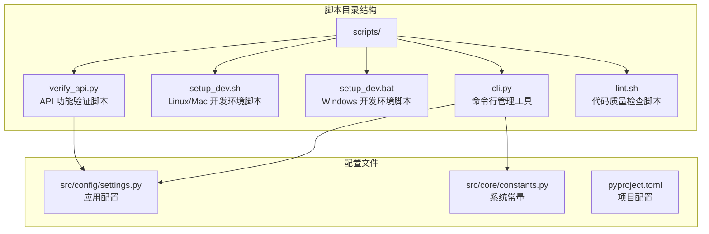
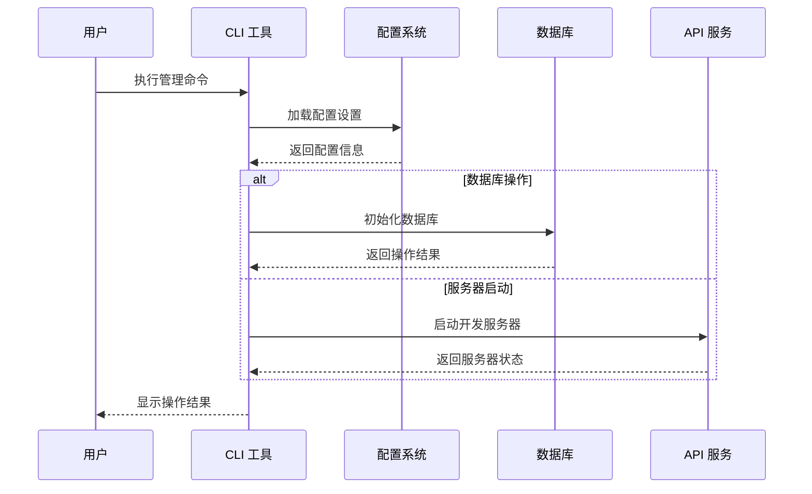
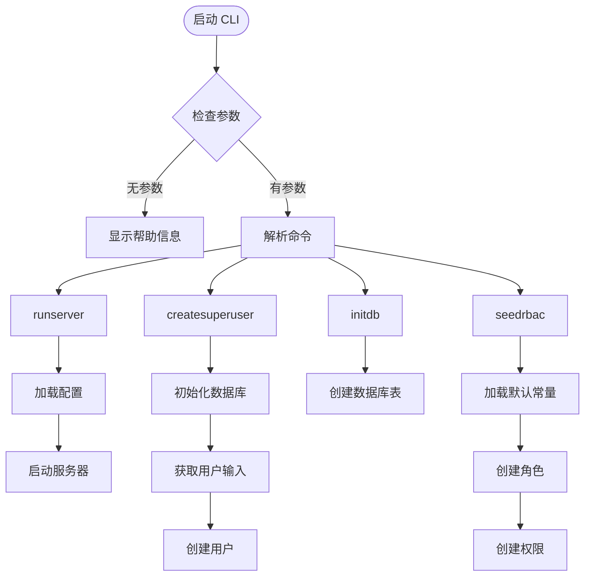
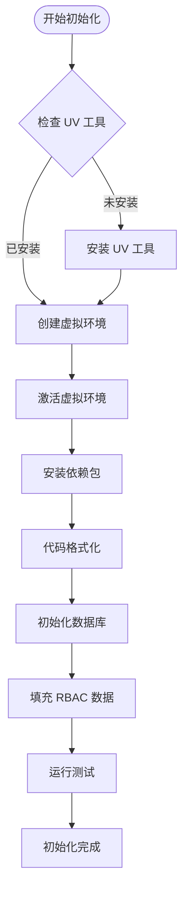
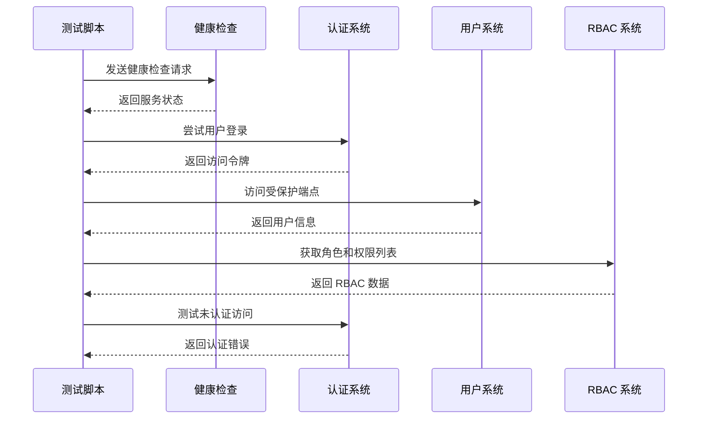
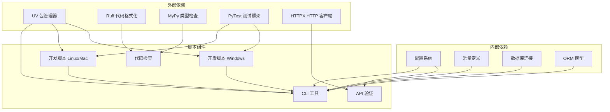

# 自动化脚本

<cite>
**本文档引用的文件**
- [cli.py](file://service/scripts/cli.py)
- [setup_dev.sh](file://service/scripts/setup_dev.sh)
- [setup_dev.bat](file://service/scripts/setup_dev.bat)
- [verify_api.py](file://service/scripts/verify_api.py)
- [lint.sh](file://service/scripts/lint.sh)
- [settings.py](file://service/src/config/settings.py)
- [constants.py](file://service/src/core/constants.py)
- [main.py](file://service/src/main.py)
- [pyproject.toml](file://service/pyproject.toml)
- [README.md](file://service/README.md)
</cite>

## 目录
1. [简介](#简介)
2. [项目结构](#项目结构)
3. [核心组件](#核心组件)
4. [架构概览](#架构概览)
5. [详细组件分析](#详细组件分析)
6. [依赖关系分析](#依赖关系分析)
7. [性能考虑](#性能考虑)
8. [故障排除指南](#故障排除指南)
9. [结论](#结论)
10. [附录](#附录)

## 简介

本文件详细介绍了 Hello-FastApi 项目中的自动化脚本系统，包括命令行管理工具、开发环境初始化脚本和 API 验证脚本。这些脚本旨在简化开发流程、确保代码质量并提供完整的功能验证。

项目采用 FastAPI 框架，结合 DDD（领域驱动设计）架构和 RBAC（基于角色的访问控制）权限系统，提供了完整的后端 API 服务解决方案。

## 项目结构

自动化脚本位于 `service/scripts/` 目录下，包含以下关键文件：

**图表来源**
- [cli.py:1-135](file://service/scripts/cli.py#L1-L135)
- [setup_dev.sh:1-47](file://service/scripts/setup_dev.sh#L1-L47)
- [setup_dev.bat:1-44](file://service/scripts/setup_dev.bat#L1-L44)
- [verify_api.py:1-176](file://service/scripts/verify_api.py#L1-L176)

**章节来源**
- [README.md:27-93](file://service/README.md#L27-L93)
- [pyproject.toml:34-36](file://service/pyproject.toml#L34-L36)

## 核心组件

### CLI 管理命令行工具

CLI 工具是整个自动化系统的核心，提供了四个主要命令：

1. **runserver** - 启动开发服务器
2. **createsuperuser** - 创建超级管理员用户
3. **initdb** - 初始化数据库表结构
4. **seedrbac** - 填充 RBAC 权限系统初始数据

每个命令都经过精心设计，支持异步操作和完整的错误处理。

**章节来源**
- [cli.py:103-131](file://service/scripts/cli.py#L103-L131)
- [cli.py:17-129](file://service/scripts/cli.py#L17-L129)

### 开发环境初始化脚本

提供跨平台的开发环境设置脚本，支持 Linux/Mac 和 Windows 系统：

- **setup_dev.sh** - Bash 脚本，适用于 Linux 和 macOS
- **setup_dev.bat** - Windows 批处理脚本

两个脚本都实现了相同的初始化流程，但使用平台特定的命令。

**章节来源**
- [setup_dev.sh:1-47](file://service/scripts/setup_dev.sh#L1-L47)
- [setup_dev.bat:1-44](file://service/scripts/setup_dev.bat#L1-L44)

### API 验证脚本

verify_api.py 提供了完整的 API 功能验证，包括：

- 健康检查端点测试
- 用户认证流程测试
- RBAC 权限系统验证
- 未认证访问防护测试

**章节来源**
- [verify_api.py:137-176](file://service/scripts/verify_api.py#L137-L176)

## 架构概览

自动化脚本系统采用模块化设计，各组件之间通过清晰的接口进行交互：

**图表来源**
- [cli.py:22-29](file://service/scripts/cli.py#L22-L29)
- [settings.py:41-198](file://service/src/config/settings.py#L41-L198)

## 详细组件分析

### CLI 管理命令行工具详解

#### 命令行接口设计

CLI 工具采用简洁的命令行接口设计，支持四种主要命令：

**图表来源**
- [cli.py:103-131](file://service/scripts/cli.py#L103-L131)
- [cli.py:22-101](file://service/scripts/cli.py#L22-L101)

#### 异步操作处理

所有数据库相关操作都采用异步模式，确保高性能和良好的用户体验：

**章节来源**
- [cli.py:32-57](file://service/scripts/cli.py#L32-L57)
- [cli.py:59-64](file://service/scripts/cli.py#L59-L64)
- [cli.py:67-100](file://service/scripts/cli.py#L67-L100)

### 开发环境初始化脚本分析

#### 跨平台兼容性设计

两个初始化脚本都实现了相同的初始化流程，但使用平台特定的命令：

**图表来源**
- [setup_dev.sh:8-47](file://service/scripts/setup_dev.sh#L8-L47)
- [setup_dev.bat:6-44](file://service/scripts/setup_dev.bat#L6-L44)

#### 依赖管理策略

脚本使用 UV 包管理器进行依赖安装，支持开发环境的完整配置：

**章节来源**
- [setup_dev.sh:18-25](file://service/scripts/setup_dev.sh#L18-L25)
- [setup_dev.bat:15-22](file://service/scripts/setup_dev.bat#L15-L22)
- [pyproject.toml:22-32](file://service/pyproject.toml#L22-L32)

### API 验证脚本详细分析

#### 功能测试流程

verify_api.py 实现了完整的 API 功能验证流程：

**图表来源**
- [verify_api.py:137-176](file://service/scripts/verify_api.py#L137-L176)
- [verify_api.py:51-82](file://service/scripts/verify_api.py#L51-L82)

#### 测试覆盖范围

API 验证脚本覆盖了以下关键功能：

1. **服务健康状态** - 确认 API 服务正常运行
2. **用户认证流程** - 测试登录和令牌管理
3. **权限控制系统** - 验证 RBAC 权限分配
4. **安全防护机制** - 确保未认证访问被正确拒绝

**章节来源**
- [verify_api.py:8-16](file://service/scripts/verify_api.py#L8-L16)
- [verify_api.py:99-125](file://service/scripts/verify_api.py#L99-L125)

## 依赖关系分析

自动化脚本系统之间的依赖关系如下：

**图表来源**
- [pyproject.toml:7-32](file://service/pyproject.toml#L7-L32)
- [cli.py:17-19](file://service/scripts/cli.py#L17-L19)
- [verify_api.py:3](file://service/scripts/verify_api.py#L3)

**章节来源**
- [pyproject.toml:1-76](file://service/pyproject.toml#L1-L76)
- [settings.py:14-26](file://service/src/config/settings.py#L14-L26)

## 性能考虑

### 异步操作优化

CLI 工具中的数据库操作全部采用异步模式，提高了并发处理能力和资源利用率。这种设计特别适合处理大量数据初始化和批量操作。

### 内存管理

脚本在执行过程中遵循最佳实践，及时释放数据库连接和网络资源，避免内存泄漏问题。

### 缓存策略

配置系统使用 LRU 缓存机制，避免重复读取配置文件，提高启动速度。

## 故障排除指南

### 常见问题及解决方案

#### 1. UV 工具安装问题

**问题症状**：脚本执行时报错，提示找不到 UV 命令
**解决方案**：
- 确保网络连接正常
- 手动安装 UV：`curl -LsSf https://astral.sh/uv/install.sh | sh`
- 重新启动终端或手动添加到 PATH

#### 2. 数据库连接失败

**问题症状**：初始化数据库时出现连接错误
**解决方案**：
- 检查数据库服务是否启动
- 验证数据库连接字符串配置
- 确认数据库文件权限设置

#### 3. 权限不足错误

**问题症状**：创建用户或执行数据库操作时返回权限错误
**解决方案**：
- 确认数据库文件具有正确的写入权限
- 检查用户账户权限
- 以管理员身份运行脚本

#### 4. 端口占用问题

**问题症状**：启动开发服务器时端口被占用
**解决方案**：
- 修改配置文件中的端口号
- 关闭占用端口的其他进程
- 使用不同的端口

**章节来源**
- [setup_dev.sh:9-13](file://service/scripts/setup_dev.sh#L9-L13)
- [setup_dev.bat:7-11](file://service/scripts/setup_dev.bat#L7-L11)
- [settings.py:54-55](file://service/src/config/settings.py#L54-L55)

### 调试技巧

1. **启用详细日志**：设置 `DEBUG=True` 查看详细执行信息
2. **检查环境变量**：确认 `APP_ENV` 设置正确
3. **验证依赖安装**：使用 `pip list` 检查依赖完整性
4. **测试网络连接**：确保能够访问数据库和外部服务

## 结论

自动化脚本系统为 Hello-FastApi 项目提供了完整的开发和运维支持。通过精心设计的 CLI 工具、跨平台的环境初始化脚本和全面的 API 验证机制，开发者可以快速搭建开发环境、验证系统功能并维护代码质量。

这些脚本不仅提高了开发效率，还确保了系统的稳定性和可靠性。建议团队在日常开发中充分利用这些自动化工具，建立标准化的开发流程。

## 附录

### 参数配置参考

#### 环境配置选项

| 配置项 | 默认值 | 说明 |
|--------|--------|------|
| APP_ENV | development | 应用环境 (development/production/testing) |
| DEBUG | True | 调试模式开关 |
| HOST | 0.0.0.0 | 服务器绑定地址 |
| PORT | 8000 | 服务器端口号 |
| DATABASE_URL | sqlite+aiosqlite:///./sql/dev.db | 数据库连接字符串 |

#### RBAC 默认配置

| 角色 | 描述 | 权限范围 |
|------|------|----------|
| admin | 系统管理员 | 完整访问权限 |
| user | 普通用户 | 基础访问权限 |
| moderator | 版主 | 提升权限 |

**章节来源**
- [settings.py:47-67](file://service/src/config/settings.py#L47-L67)
- [constants.py:12-16](file://service/src/core/constants.py#L12-L16)

### 扩展和定制指南

#### 自定义 CLI 命令

要添加新的 CLI 命令，需要：

1. 在 `cli.py` 中添加新函数
2. 在命令字典中注册新命令
3. 在主函数中处理新命令

#### 定制开发脚本

可以根据项目需求修改开发脚本：

1. **依赖管理**：在 `pyproject.toml` 中添加新的依赖
2. **环境配置**：在 `.env` 文件中添加自定义配置
3. **脚本逻辑**：修改脚本中的具体实现步骤

#### API 验证扩展

可以扩展 API 验证脚本来覆盖更多测试场景：

1. **新增测试用例**：在 `verify_api.py` 中添加新的测试函数
2. **自定义断言**：根据业务需求调整验证逻辑
3. **测试数据管理**：使用工厂模式生成测试数据