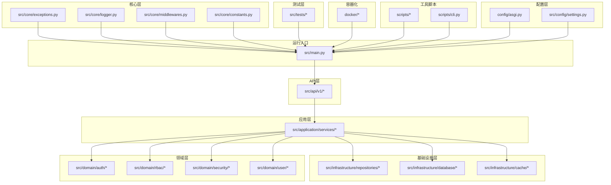
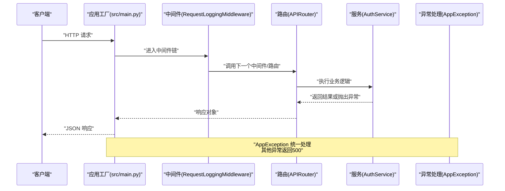
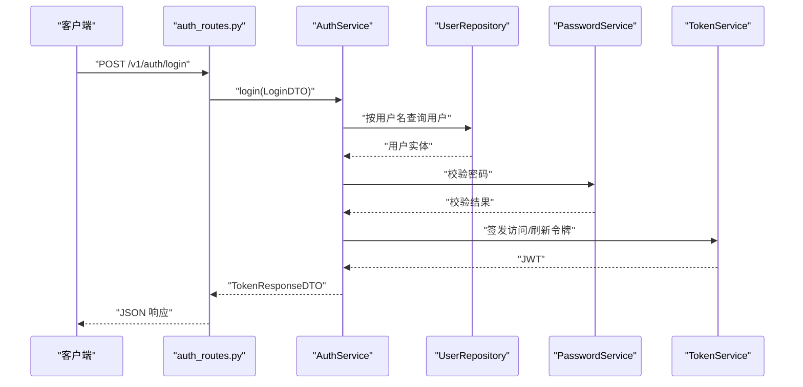
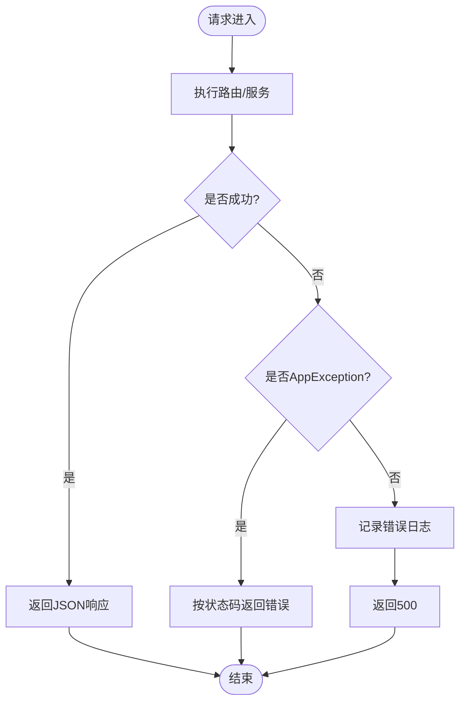
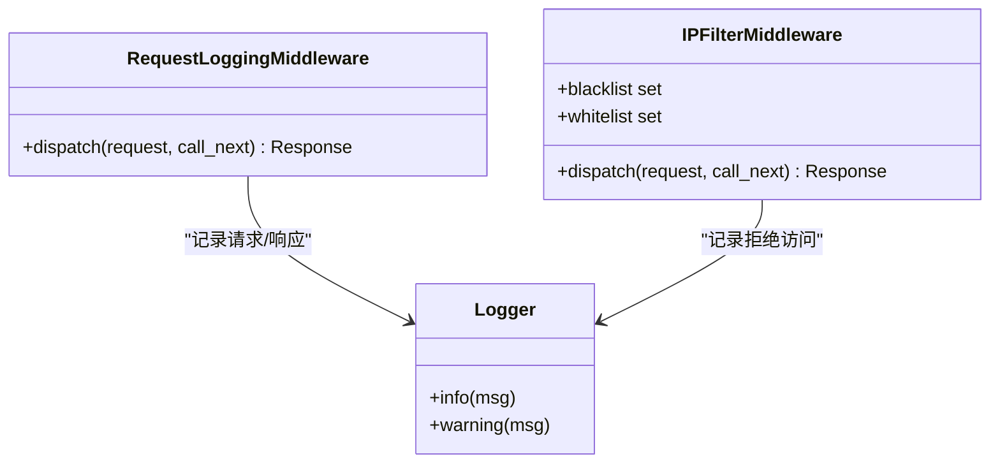
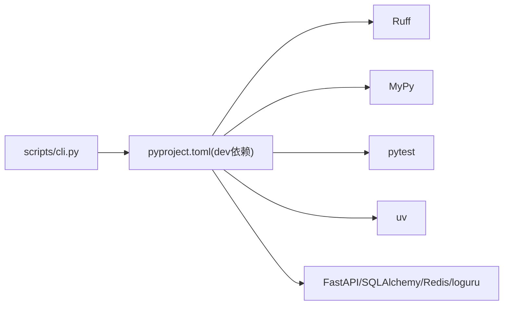

# 开发者指南

<cite>
**本文引用的文件**
- [pyproject.toml](file://pyproject.toml)
- [scripts/cli.py](file://scripts/cli.py)
- [src/main.py](file://src/main.py)
- [src/core/exceptions.py](file://src/core/exceptions.py)
- [src/core/logger.py](file://src/core/logger.py)
- [src/core/middlewares.py](file://src/core/middlewares.py)
- [src/api/v1/auth_routes.py](file://src/api/v1/auth_routes.py)
- [src/application/services/auth_service.py](file://src/application/services/auth_service.py)
- [config/asgi.py](file://config/asgi.py)
- [docker/Dockerfile](file://docker/Dockerfile)
- [docker/docker-compose.yml](file://docker/docker-compose.yml)
- [src/tests/conftest.py](file://src/tests/conftest.py)
- [scripts/lint.sh](file://scripts/lint.sh)
- [scripts/setup_dev.sh](file://scripts/setup_dev.sh)
- [src/config/settings.py](file://src/config/settings.py)
- [src/core/constants.py](file://src/core/constants.py)
</cite>

## 目录
1. [简介](#简介)
2. [项目结构](#项目结构)
3. [核心组件](#核心组件)
4. [架构总览](#架构总览)
5. [详细组件分析](#详细组件分析)
6. [依赖分析](#依赖分析)
7. [性能考虑](#性能考虑)
8. [故障排除指南](#故障排除指南)
9. [结论](#结论)
10. [附录](#附录)

## 简介
本指南面向参与本项目的开发者，系统阐述代码规范与最佳实践（命名约定、代码格式、注释标准）、开发流程与工作流管理（分支策略、提交规范、代码审查）、开发工具配置与使用（IDE 设置、调试技巧、性能分析）、新功能开发标准流程（需求分析到测试验证）、错误处理与异常管理最佳实践、性能优化方法（数据库查询与缓存策略）、常见问题解决方案与故障排除、团队协作与知识分享建议，以及项目的扩展点与插件机制，帮助你高效理解并贡献代码。

## 项目结构
项目采用分层架构与领域驱动设计（DDD）风格，主要模块如下：
- 配置层：应用启动参数、环境变量与部署配置
- 核心层：异常体系、日志、中间件、常量与通用工具
- 应用层：业务服务编排，协调仓储与领域服务
- 领域层：业务实体、仓储接口与领域服务（密码、令牌等）
- 基础设施层：数据库连接、SQLAlchemy模型、Redis客户端、仓储实现
- API层：版本化路由（v1），依赖注入与DTO绑定
- 测试层：单元与集成测试、测试固件与数据库隔离
- 工具脚本：代码质量检查、开发环境初始化、CLI管理工具

**图表来源**
- [src/main.py:1-86](file://src/main.py#L1-L86)
- [src/core/exceptions.py:1-53](file://src/core/exceptions.py#L1-L53)
- [src/core/logger.py:1-48](file://src/core/logger.py#L1-L48)
- [src/core/middlewares.py:1-64](file://src/core/middlewares.py#L1-L64)
- [src/core/constants.py:1-29](file://src/core/constants.py#L1-L29)
- [src/api/v1/auth_routes.py:1-34](file://src/api/v1/auth_routes.py#L1-L34)
- [src/application/services/auth_service.py:1-67](file://src/application/services/auth_service.py#L1-L67)
- [config/asgi.py:1-6](file://config/asgi.py#L1-L6)
- [docker/Dockerfile:1-29](file://docker/Dockerfile#L1-L29)
- [docker/docker-compose.yml:1-65](file://docker/docker-compose.yml#L1-L65)
- [src/tests/conftest.py:1-58](file://src/tests/conftest.py#L1-L58)
- [scripts/lint.sh:1-19](file://scripts/lint.sh#L1-L19)
- [scripts/setup_dev.sh:1-47](file://scripts/setup_dev.sh#L1-L47)
- [scripts/cli.py:1-135](file://scripts/cli.py#L1-L135)

**章节来源**
- [src/main.py:1-86](file://src/main.py#L1-L86)
- [docker/docker-compose.yml:1-65](file://docker/docker-compose.yml#L1-L65)

## 核心组件
- 异常体系：统一继承自HTTPException，覆盖未找到、冲突、未授权、禁止、验证、限流等场景，便于前端与监控系统一致处理。
- 日志系统：基于loguru，控制台与文件双通道输出，按级别与大小轮转，支持错误分离与压缩归档。
- 中间件：请求日志与IP黑白名单过滤，统一记录请求耗时与状态码，便于审计与风控。
- 应用工厂：集中注册CORS、日志中间件、全局异常处理器、健康检查与路由前缀，确保生命周期与一致性。
- CLI管理工具：提供开发服务器启动、超级用户创建、数据库初始化、RBAC种子数据等常用运维命令，支持异步任务执行。

**章节来源**
- [src/core/exceptions.py:1-53](file://src/core/exceptions.py#L1-L53)
- [src/core/logger.py:1-48](file://src/core/logger.py#L1-L48)
- [src/core/middlewares.py:1-64](file://src/core/middlewares.py#L1-L64)
- [src/main.py:19-86](file://src/main.py#L19-L86)
- [scripts/cli.py:1-135](file://scripts/cli.py#L1-L135)

## 架构总览
下图展示从请求进入应用到响应返回的关键路径，包括中间件、异常处理与路由分发。

**图表来源**
- [src/main.py:55-70](file://src/main.py#L55-L70)
- [src/core/middlewares.py:12-32](file://src/core/middlewares.py#L12-L32)
- [src/api/v1/auth_routes.py:14-33](file://src/api/v1/auth_routes.py#L14-L33)
- [src/application/services/auth_service.py:21-66](file://src/application/services/auth_service.py#L21-L66)

## 详细组件分析

### 认证服务与路由
- 路由层：提供登录、刷新令牌与获取当前用户信息的接口，使用依赖注入获取数据库会话与当前用户。
- 服务层：负责用户校验、密码验证、令牌签发与刷新，严格区分未授权与禁用账户等场景。
- DTO绑定：LoginDTO、RefreshTokenDTO、TokenResponseDTO明确输入输出结构，便于API文档生成与校验。

**图表来源**
- [src/api/v1/auth_routes.py:14-18](file://src/api/v1/auth_routes.py#L14-L18)
- [src/application/services/auth_service.py:21-40](file://src/application/services/auth_service.py#L21-L40)
- [src/application/services/auth_service.py:42-66](file://src/application/services/auth_service.py#L42-L66)

**章节来源**
- [src/api/v1/auth_routes.py:1-34](file://src/api/v1/auth_routes.py#L1-L34)
- [src/application/services/auth_service.py:1-67](file://src/application/services/auth_service.py#L1-L67)

### 异常与日志处理
- 异常处理：对AppException按状态码返回；对未捕获异常统一返回500并记录错误日志。
- 日志配置：控制台彩色输出与文件落盘，INFO与ERROR分别写入不同文件，支持大小轮转与压缩归档。

**图表来源**
- [src/main.py:55-70](file://src/main.py#L55-L70)
- [src/core/logger.py:1-48](file://src/core/logger.py#L1-L48)
- [src/core/exceptions.py:1-53](file://src/core/exceptions.py#L1-L53)

**章节来源**
- [src/main.py:55-70](file://src/main.py#L55-L70)
- [src/core/logger.py:1-48](file://src/core/logger.py#L1-L48)
- [src/core/exceptions.py:1-53](file://src/core/exceptions.py#L1-L53)

### 中间件与安全
- 请求日志中间件：记录请求方法、路径、客户端IP与处理耗时，统一在响应头中附加X-Process-Time。
- IP黑白名单中间件：支持白名单优先与黑名单拦截，拒绝访问并记录告警。

**图表来源**
- [src/core/middlewares.py:12-64](file://src/core/middlewares.py#L12-L64)
- [src/core/logger.py:1-48](file://src/core/logger.py#L1-L48)

**章节来源**
- [src/core/middlewares.py:1-64](file://src/core/middlewares.py#L1-L64)
- [src/core/logger.py:1-48](file://src/core/logger.py#L1-L48)

### 数据库与仓储
- 数据库：使用SQLAlchemy异步引擎与会话工厂，测试环境使用内存SQLite，生产环境通过环境变量配置。
- 仓储：用户与RBAC相关仓储提供统一的CRUD与查询接口，配合应用服务进行业务编排。
- CLI工具：提供数据库初始化与RBAC种子数据填充功能，支持异步任务执行。

**章节来源**
- [src/tests/conftest.py:14-58](file://src/tests/conftest.py#L14-L58)
- [scripts/cli.py:59-101](file://scripts/cli.py#L59-L101)

### 缓存与Redis
- 缓存：项目引入缓存相关依赖，可结合中间件或服务层实现热点数据缓存与降载。
- Redis：容器编排中包含Redis服务，可用于分布式缓存、速率限制与会话存储。

**章节来源**
- [docker/docker-compose.yml:48-60](file://docker/docker-compose.yml#L48-L60)

### CLI管理工具
- CLI工具：提供runserver、createsuperuser、initdb、seedrbac四个核心命令。
- 开发服务器：使用uvicorn启动FastAPI应用，支持热重载与配置化主机端口。
- 超级用户创建：交互式创建管理员账户，支持用户名、邮箱、密码和全名输入。
- 数据库初始化：异步初始化数据库表结构，支持多种数据库后端。
- RBAC数据填充：初始化默认角色和权限，支持幂等操作避免重复创建。

**章节来源**
- [scripts/cli.py:1-135](file://scripts/cli.py#L1-L135)

## 依赖分析
- 语言与框架：Python 3.10+、FastAPI、SQLAlchemy asyncio、Redis、loguru。
- 开发工具：Ruff（格式与检查）、MyPy（类型检查）、pytest（测试）、uv（包与虚拟环境管理）。
- 运行与部署：Uvicorn、Docker与Compose，支持PostgreSQL与Redis。

**图表来源**
- [pyproject.toml:29-39](file://pyproject.toml#L29-L39)
- [pyproject.toml:48-66](file://pyproject.toml#L48-L66)
- [scripts/cli.py:103-130](file://scripts/cli.py#L103-L130)

**章节来源**
- [pyproject.toml:1-77](file://pyproject.toml#L1-L77)

## 性能考虑
- 代码质量：通过Ruff格式化与静态检查、MyPy类型检查，减少运行期错误与维护成本。
- 日志性能：日志按级别与大小轮转，避免单文件过大影响IO；仅在必要时开启高开销日志。
- 数据库：使用异步ORM与连接池，避免阻塞；批量操作与索引优化；测试使用内存数据库降低干扰。
- 缓存策略：利用Redis缓存热点数据与接口结果，结合TTL与失效策略；对频繁读取的配置与权限数据做本地缓存。
- 中间件：仅保留必要中间件，避免重复解析与序列化；对静态资源与健康检查接口放行。
- 部署：容器化镜像精简基础镜像与安装步骤，暴露必要端口，使用健康检查保障可用性。
- CLI工具：使用异步I/O避免阻塞，支持并发操作提升执行效率。

**章节来源**
- [scripts/lint.sh:1-19](file://scripts/lint.sh#L1-L19)
- [src/core/logger.py:23-45](file://src/core/logger.py#L23-L45)
- [docker/Dockerfile:1-29](file://docker/Dockerfile#L1-L29)
- [docker/docker-compose.yml:1-65](file://docker/docker-compose.yml#L1-L65)
- [scripts/cli.py:103-130](file://scripts/cli.py#L103-L130)

## 故障排除指南
- 启动失败
  - 检查数据库连接字符串与环境变量是否正确。
  - 使用CLI工具初始化数据库与RBAC数据：`python -m scripts.cli initdb` 和 `python -m scripts.cli seedrbac`。
- 认证失败
  - 确认用户是否存在且启用；核对密码哈希与令牌签发流程。
- 接口报错
  - 查看应用日志与错误日志，定位异常堆栈；确认异常是否被AppException正确捕获。
- 性能问题
  - 分析请求耗时与慢查询；检查缓存命中率与Redis连接数；评估数据库索引与查询计划。
- 容器化部署
  - 确认PostgreSQL与Redis健康检查通过；检查卷挂载与端口映射；查看容器日志。
- CLI工具问题
  - 检查Python路径配置是否正确；确认项目根目录已添加到sys.path；验证命令参数格式。

**章节来源**
- [scripts/cli.py:103-130](file://scripts/cli.py#L103-L130)
- [src/core/logger.py:1-48](file://src/core/logger.py#L1-L48)
- [docker/docker-compose.yml:23-28](file://docker/docker-compose.yml#L23-L28)

## 结论
本指南提供了从代码规范、开发流程、工具配置到性能优化与故障排除的完整实践路径。建议团队在日常开发中遵循统一的命名与注释规范，严格执行代码质量检查与测试策略，持续优化数据库与缓存方案，并通过中间件与日志体系提升可观测性与安全性。新的CLI管理工具提供了更灵活的开发工作流程，替代了传统的Django管理命令系统。

## 附录

### 代码规范与最佳实践
- 命名约定
  - Python模块与文件：小写下划线命名（如core/logger.py）。
  - 类名：PascalCase（如RequestLoggingMiddleware）。
  - 函数与变量：snake_case（如create_app、async_session_factory）。
  - 常量：大写下划线（如API_PREFIX、DEFAULT_ROLES）。
- 代码格式
  - 使用Ruff统一格式与检查，行宽不超过配置值，导入顺序符合isort规则。
- 注释标准
  - 模块顶部添加简要说明；复杂函数与类提供清晰文档字符串；关键流程加注释说明。
- 提交规范
  - 提交信息以类型+主题形式（如feat(api): 添加用户认证接口），避免冗长描述。
- 代码审查
  - 关注业务正确性、异常处理完整性、日志与性能影响、测试覆盖率与可维护性。

**章节来源**
- [pyproject.toml:51-68](file://pyproject.toml#L51-L68)
- [scripts/lint.sh:1-19](file://scripts/lint.sh#L1-L19)

### 开发流程与工作流管理
- 分支策略
  - 主分支保护，发布版本打标签；功能开发在特性分支，合并前需通过CI与审查。
- 提交与审核
  - 提交前运行lint与type检查、pytest；PR要求至少一名Reviewer批准。
- 持续集成
  - CI中执行lint、type、测试与打包检查，确保主干稳定。
- CLI工具集成
  - 开发环境初始化：`python -m scripts.cli initdb` 和 `python -m scripts.cli seedrbac`。
  - 开发服务器启动：`python -m scripts.cli runserver`。

**章节来源**
- [scripts/lint.sh:1-19](file://scripts/lint.sh#L1-L19)
- [src/tests/conftest.py:1-58](file://src/tests/conftest.py#L1-L58)
- [scripts/cli.py:103-130](file://scripts/cli.py#L103-L130)

### 开发工具配置与使用
- IDE设置
  - Python解释器指向uv创建的虚拟环境；启用Ruff与MyPy作为编辑器扩展；配置pytest为默认测试运行器。
- 调试技巧
  - 在路由与服务层添加关键日志点；使用断点逐步跟踪异步流程；利用CLI工具快速初始化环境。
- 性能分析
  - 使用内置中间件统计处理时间；结合日志与指标系统定位瓶颈；对热点接口做压测与缓存验证。
- CLI工具使用
  - 安装后可通过`hello-fastapi`命令直接调用；支持四种核心命令：runserver、createsuperuser、initdb、seedrbac。

**章节来源**
- [scripts/setup_dev.sh:1-47](file://scripts/setup_dev.sh#L1-L47)
- [src/core/middlewares.py:15-31](file://src/core/middlewares.py#L15-L31)
- [pyproject.toml:41-42](file://pyproject.toml#L41-L42)
- [scripts/cli.py:103-130](file://scripts/cli.py#L103-L130)

### 新功能开发标准流程
- 需求分析：明确API边界、输入输出、异常场景与权限要求。
- 设计与建模：定义DTO、实体与仓储接口；编写领域服务与应用服务。
- 实现与测试：先写单元测试，再实现服务与路由；补充集成测试与端到端测试。
- 文档与发布：更新OpenAPI文档与变更日志；通过CI与审查后合并主干并发布。
- CLI工具支持：新功能开发完成后，可在CLI工具中添加相应的初始化或配置命令。

**章节来源**
- [src/api/v1/auth_routes.py:1-34](file://src/api/v1/auth_routes.py#L1-L34)
- [src/application/services/auth_service.py:1-67](file://src/application/services/auth_service.py#L1-L67)
- [src/tests/conftest.py:1-58](file://src/tests/conftest.py#L1-L58)

### 错误处理与异常管理最佳实践
- 明确异常类型：针对不同业务场景抛出对应AppException子类。
- 全局处理：统一异常处理器返回结构化错误响应；记录错误日志以便追踪。
- 用户友好：对外仅返回必要错误信息，内部保留详细上下文。

**章节来源**
- [src/core/exceptions.py:1-53](file://src/core/exceptions.py#L1-L53)
- [src/main.py:55-70](file://src/main.py#L55-L70)

### 性能优化方法与技巧
- 数据库
  - 使用异步ORM与连接池；为高频查询字段建立索引；避免N+1查询；批量插入与更新。
- 缓存
  - 对热点数据与接口结果做缓存；设置合理TTL；实现缓存穿透与击穿防护。
- 中间件与日志
  - 仅保留必要中间件；控制日志级别与轮转策略；避免在热路径中做昂贵操作。
- CLI工具优化
  - 使用异步I/O避免阻塞；支持并发操作；提供详细的进度反馈。

**章节来源**
- [src/core/logger.py:23-45](file://src/core/logger.py#L23-L45)
- [docker/docker-compose.yml:48-60](file://docker/docker-compose.yml#L48-L60)
- [scripts/cli.py:103-130](file://scripts/cli.py#L103-L130)

### 常见问题与故障排除
- 无法连接数据库：检查URL与凭据；确认容器健康状态。
- 认证失败：核对用户状态与密码哈希；检查令牌签发与解码流程。
- 接口500：查看错误日志；确认异常是否被捕获与记录。
- CLI工具无法执行：检查Python路径配置；确认项目根目录已添加到sys.path。
- 命令参数错误：查看CLI帮助信息；确认命令名称拼写正确。

**章节来源**
- [docker/docker-compose.yml:23-28](file://docker/docker-compose.yml#L23-L28)
- [src/core/logger.py:1-48](file://src/core/logger.py#L1-L48)
- [scripts/cli.py:103-130](file://scripts/cli.py#L103-L130)

### 团队协作与知识分享
- 规范共享：定期回顾代码规范与最佳实践；通过文档与示例保持一致性。
- 代码审查：关注业务正确性与可维护性；鼓励提问与知识传递。
- 知识沉淀：记录常见问题与解决方案；建立FAQ与内部Wiki。
- CLI工具文档：新功能上线后更新CLI工具的使用说明与命令帮助。

### 扩展点与插件机制
- 路由扩展：新增API版本或模块时，在API层增加路由并注册到应用工厂。
- 中间件扩展：新增中间件时，遵循现有中间件模式并在应用工厂中注册。
- 服务扩展：新增应用服务时，遵循依赖注入与仓储接口契约，确保可替换性与可测试性。
- 配置扩展：通过环境变量与配置模块集中管理，避免硬编码。
- CLI工具扩展：新增命令时，在CLI工具中添加相应的命令处理器与参数验证。

**章节来源**
- [src/main.py:31-86](file://src/main.py#L31-L86)
- [config/asgi.py:1-6](file://config/asgi.py#L1-L6)
- [scripts/cli.py:117-122](file://scripts/cli.py#L117-L122)