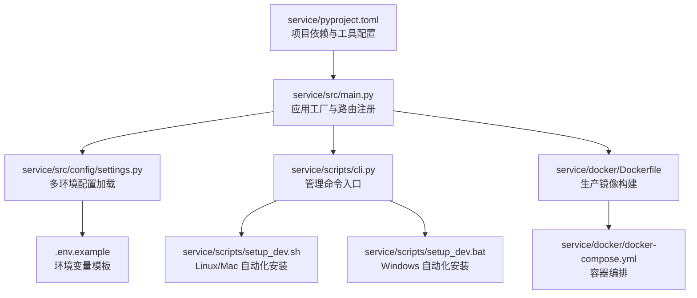
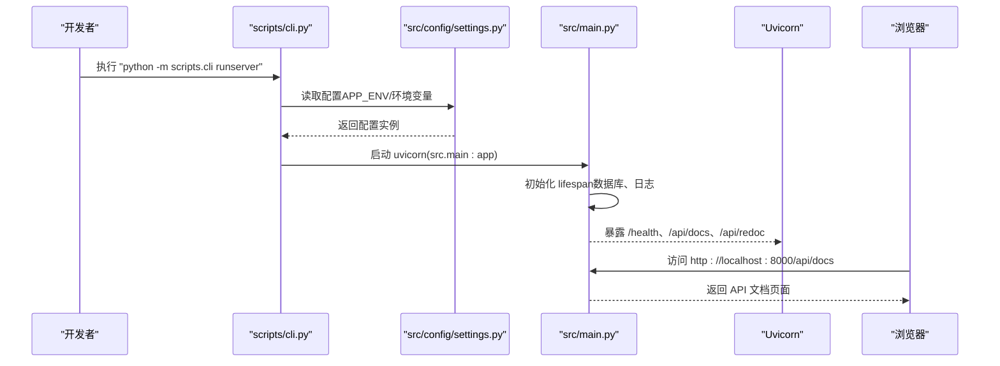
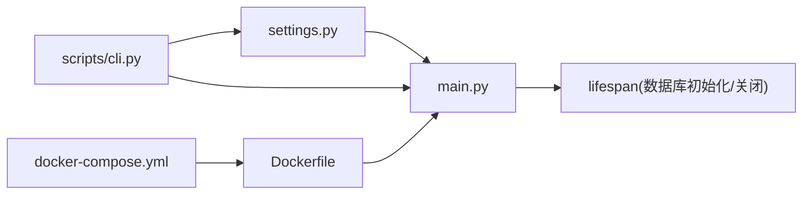

# 快速开始

<cite>
**本文引用的文件**
- [pyproject.toml](file://service/pyproject.toml)
- [README.md](file://service/README.md)
- [main.py](file://service/src/main.py)
- [settings.py](file://service/src/config/settings.py)
- [cli.py](file://service/scripts/cli.py)
- [setup_dev.sh](file://service/scripts/setup_dev.sh)
- [setup_dev.bat](file://service/scripts/setup_dev.bat)
- [Dockerfile](file://service/docker/Dockerfile)
- [docker-compose.yml](file://service/docker/docker-compose.yml)
- [.env.example](file://service/.env.example)
</cite>

## 目录
1. [简介](#简介)
2. [项目结构](#项目结构)
3. [核心组件](#核心组件)
4. [架构总览](#架构总览)
5. [详细组件分析](#详细组件分析)
6. [依赖关系分析](#依赖关系分析)
7. [性能考虑](#性能考虑)
8. [故障排除指南](#故障排除指南)
9. [结论](#结论)
10. [附录](#附录)

## 简介
本指南面向新开发者，帮助你在最短时间内成功运行 Hello-FastApi 项目。内容涵盖环境要求、安装步骤（Linux/Mac 与 Windows）、手动安装流程、启动服务与访问说明、以及多环境配置与环境变量设置。项目基于 FastAPI + DDD + RBAC，提供完善的开发体验与生产就绪能力。

## 项目结构
服务端位于 service 目录，包含以下关键部分：
- 配置与入口：src/config（配置加载）、src/main.py（应用工厂与生命周期）
- 管理命令：scripts/cli.py（runserver、createsuperuser、initdb、seedrbac）
- 开发脚本：scripts/setup_dev.sh（Linux/Mac）、scripts/setup_dev.bat（Windows）
- 环境配置：.env.example（模板）、.env.development/.env.production/.env.testing（多环境）
- 容器化：docker/Dockerfile、docker/docker-compose.yml
- 项目元信息：pyproject.toml（依赖、脚本、工具配置）

**图表来源**
- [pyproject.toml:1-76](file://service/pyproject.toml#L1-L76)
- [main.py:1-96](file://service/src/main.py#L1-L96)
- [settings.py:1-198](file://service/src/config/settings.py#L1-L198)
- [cli.py:1-135](file://service/scripts/cli.py#L1-L135)
- [setup_dev.sh:1-47](file://service/scripts/setup_dev.sh#L1-L47)
- [setup_dev.bat:1-44](file://service/scripts/setup_dev.bat#L1-L44)
- [Dockerfile:1-58](file://service/docker/Dockerfile#L1-L58)
- [docker-compose.yml:1-65](file://service/docker/docker-compose.yml#L1-L65)
- [.env.example:1-63](file://service/.env.example#L1-L63)

**章节来源**
- [pyproject.toml:1-76](file://service/pyproject.toml#L1-L76)
- [README.md:27-93](file://service/README.md#L27-L93)

## 核心组件
- 应用工厂与生命周期：在 src/main.py 中定义 FastAPI 实例、CORS、全局异常处理、健康检查与路由注册，并通过 lifespan 管理数据库初始化与关闭。
- 配置系统：src/config/settings.py 支持 development/production/testing 三种环境，按优先级从系统环境变量、.env.{APP_ENV}、.env 到默认值加载。
- 管理命令：scripts/cli.py 提供 runserver、createsuperuser、initdb、seedrbac 四个常用命令，统一入口便于开发与运维。
- 自动化安装：Linux/Mac 使用 setup_dev.sh，Windows 使用 setup_dev.bat，一键安装 UV、创建虚拟环境、安装依赖、格式化、初始化数据库与种子数据、运行测试。
- 容器化：Dockerfile 采用多阶段构建，docker-compose.yml 提供应用、PostgreSQL、Redis 的编排与健康检查。

**章节来源**
- [main.py:1-96](file://service/src/main.py#L1-L96)
- [settings.py:1-198](file://service/src/config/settings.py#L1-L198)
- [cli.py:1-135](file://service/scripts/cli.py#L1-L135)
- [setup_dev.sh:1-47](file://service/scripts/setup_dev.sh#L1-L47)
- [setup_dev.bat:1-44](file://service/scripts/setup_dev.bat#L1-L44)
- [Dockerfile:1-58](file://service/docker/Dockerfile#L1-L58)
- [docker-compose.yml:1-65](file://service/docker/docker-compose.yml#L1-L65)

## 架构总览
下图展示从命令行到应用启动、配置加载与服务暴露的关键流程：

**图表来源**
- [cli.py:22-29](file://service/scripts/cli.py#L22-L29)
- [settings.py:144-197](file://service/src/config/settings.py#L144-L197)
- [main.py:34-96](file://service/src/main.py#L34-L96)

## 详细组件分析

### 环境要求与前置条件
- Python 版本：>= 3.10
- 包管理工具：UV（提升安装与虚拟环境管理效率）
- 依赖项：FastAPI、Uvicorn、SQLModel、aiosqlite/asyncpg、Pydantic Settings、python-jose、bcrypt、redis、loguru、httpx 等
- 可选开发依赖：pytest、pytest-asyncio、pytest-cov、ruff、mypy、factory-boy、faker

**章节来源**
- [pyproject.toml:6-20](file://service/pyproject.toml#L6-L20)
- [pyproject.toml:22-32](file://service/pyproject.toml#L22-L32)

### 安装步骤（Linux/Mac）
- 使用自动化脚本（推荐）
  - 执行：bash scripts/setup_dev.sh
  - 脚本功能：安装/检测 UV、创建虚拟环境、激活、安装开发依赖、格式化代码、初始化数据库、填充 RBAC 数据、运行测试
- 手动安装（参考“手动安装”小节）

**章节来源**
- [README.md:104-112](file://service/README.md#L104-L112)
- [setup_dev.sh:1-47](file://service/scripts/setup_dev.sh#L1-L47)

### 安装步骤（Windows）
- 使用自动化脚本（推荐）
  - 执行：scripts\setup_dev.bat
  - 功能同上，适用于 Windows 环境
- 手动安装（参考“手动安装”小节）

**章节来源**
- [README.md:109-112](file://service/README.md#L109-L112)
- [setup_dev.bat:1-44](file://service/scripts/setup_dev.bat#L1-L44)

### 手动安装（完整流程）
- 安装 UV
  - Linux/Mac：curl -LsSf https://astral.sh/uv/install.sh | sh
  - Windows：PowerShell 下执行安装脚本
- 创建并激活虚拟环境
  - uv venv --python 3.10
  - Linux/Mac：source .venv/bin/activate
  - Windows：.venv\Scripts\activate
- 安装开发依赖
  - uv pip install -e ".[dev]"
- 初始化数据库与 RBAC 数据
  - python -m scripts.cli initdb
  - python -m scripts.cli seedrbac
- 运行测试（可选）
  - pytest

**章节来源**
- [README.md:114-129](file://service/README.md#L114-L129)
- [setup_dev.sh:8-25](file://service/scripts/setup_dev.sh#L8-L25)
- [setup_dev.bat:6-22](file://service/scripts/setup_dev.bat#L6-L22)

### 启动服务与访问说明
- 启动命令
  - python -m scripts.cli runserver
- 访问地址
  - API 文档：http://localhost:8000/api/docs
  - ReDoc 文档：http://localhost:8000/api/redoc
- 健康检查
  - /health 返回服务状态与版本

**章节来源**
- [README.md:131-140](file://service/README.md#L131-L140)
- [main.py:84-87](file://service/src/main.py#L84-L87)

### 环境配置与多环境管理
- 支持环境
  - development（开发）：DEBUG=true，日志级别 DEBUG
  - production（生产）：DEBUG=false，日志级别 WARNING
  - testing（测试）：使用测试数据库，日志级别 DEBUG
- 配置加载顺序（优先级从高到低）
  - 系统环境变量 > .env.{APP_ENV} > .env > 默认值
- 切换环境
  - Linux/Mac：export APP_ENV=production；python -m scripts.cli runserver
  - Windows：set APP_ENV=production；python -m scripts.cli runserver
- 创建本地配置
  - 复制模板：cp .env.example .env
  - 编辑 .env 文件进行覆盖

**章节来源**
- [README.md:141-179](file://service/README.md#L141-L179)
- [settings.py:144-197](file://service/src/config/settings.py#L144-L197)
- [.env.example:1-63](file://service/.env.example#L1-L63)

### 管理命令一览
- runserver：启动开发服务器（DEBUG=true 时启用热重载）
- createsuperuser：交互式创建超级管理员
- initdb：初始化数据库表
- seedrbac：初始化默认角色与权限

**章节来源**
- [README.md:181-188](file://service/README.md#L181-L188)
- [cli.py:103-131](file://service/scripts/cli.py#L103-L131)

### 容器化部署（可选）
- 本地构建镜像并运行
  - docker-compose up -d
- 生产部署（Gunicorn + Nginx）
  - 使用 uvicorn workers 启动，监听 0.0.0.0:8000

**章节来源**
- [README.md:240-254](file://service/README.md#L240-L254)
- [Dockerfile:53-57](file://service/docker/Dockerfile#L53-L57)
- [docker-compose.yml:1-65](file://service/docker/docker-compose.yml#L1-L65)

## 依赖关系分析
- 应用入口依赖配置模块与基础设施（数据库、缓存），并通过 lifespan 管理生命周期
- 管理命令通过 CLI 统一入口调用配置与服务逻辑
- Dockerfile 将构建阶段与运行阶段分离，减少镜像体积并提升安全性

**图表来源**
- [settings.py:144-197](file://service/src/config/settings.py#L144-L197)
- [main.py:19-32](file://service/src/main.py#L19-L32)
- [cli.py:103-131](file://service/scripts/cli.py#L103-L131)
- [Dockerfile:1-58](file://service/docker/Dockerfile#L1-L58)
- [docker-compose.yml:1-65](file://service/docker/docker-compose.yml#L1-L65)

**章节来源**
- [settings.py:1-198](file://service/src/config/settings.py#L1-L198)
- [main.py:1-96](file://service/src/main.py#L1-L96)
- [cli.py:1-135](file://service/scripts/cli.py#L1-L135)
- [Dockerfile:1-58](file://service/docker/Dockerfile#L1-L58)
- [docker-compose.yml:1-65](file://service/docker/docker-compose.yml#L1-L65)

## 性能考虑
- 使用 UV 进行依赖安装与虚拟环境管理，提升安装速度与一致性
- Docker 多阶段构建减少运行时镜像体积，提高部署效率
- 生产环境建议使用 Gunicorn + uvicorn workers，配合 Nginx 前置代理
- 合理设置日志级别与限流参数，平衡可观测性与性能

## 故障排除指南
- 无法找到 UV
  - 确认已安装 UV 并加入 PATH；Linux/Mac 可使用安装脚本；Windows 使用 PowerShell 安装脚本
- 启动失败或端口占用
  - 检查 HOST/PORT 配置；确认端口未被占用；必要时修改 .env 中的 PORT
- 数据库初始化失败
  - 确保数据库服务可用；检查 DATABASE_URL；先执行 initdb 再启动服务
- 环境变量未生效
  - 确认 APP_ENV 设置正确；检查 .env.{APP_ENV} 与 .env 的优先级；优先使用系统环境变量
- API 文档无法访问
  - 确认 runserver 已启动；访问 /api/docs 或 /api/redoc；检查 CORS_ORIGINS 是否包含前端地址

**章节来源**
- [setup_dev.sh:8-14](file://service/scripts/setup_dev.sh#L8-L14)
- [setup_dev.bat:6-12](file://service/scripts/setup_dev.bat#L6-L12)
- [settings.py:144-197](file://service/src/config/settings.py#L144-L197)
- [main.py:34-96](file://service/src/main.py#L34-L96)

## 结论
通过本快速开始指南，你可以在几分钟内完成环境准备、安装依赖、初始化数据库与 RBAC 数据，并成功启动服务。建议优先使用自动化脚本以获得一致的开发体验，同时掌握手动安装流程以便在受限环境中进行部署。多环境配置与容器化能力使项目既适合本地开发也易于生产部署。

## 附录

### 常用命令速查
- 启动开发服务器：python -m scripts.cli runserver
- 创建超级管理员：python -m scripts.cli createsuperuser
- 初始化数据库：python -m scripts.cli initdb
- 填充 RBAC 数据：python -m scripts.cli seedrbac
- 运行测试：pytest
- 代码格式化与检查：ruff format .；ruff check . --fix；mypy src/

**章节来源**
- [README.md:181-210](file://service/README.md#L181-L210)
- [cli.py:103-131](file://service/scripts/cli.py#L103-L131)