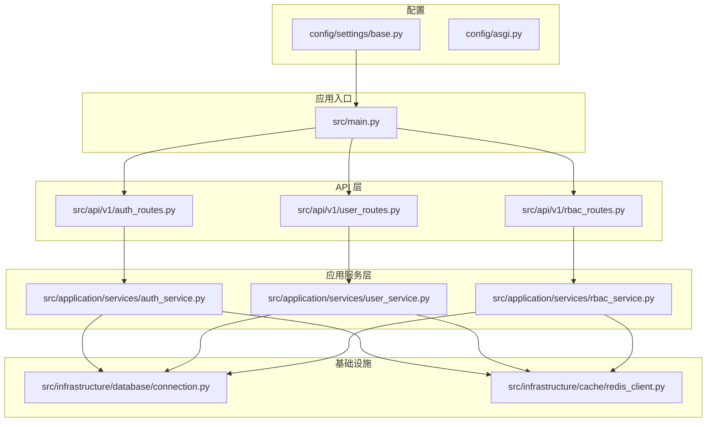
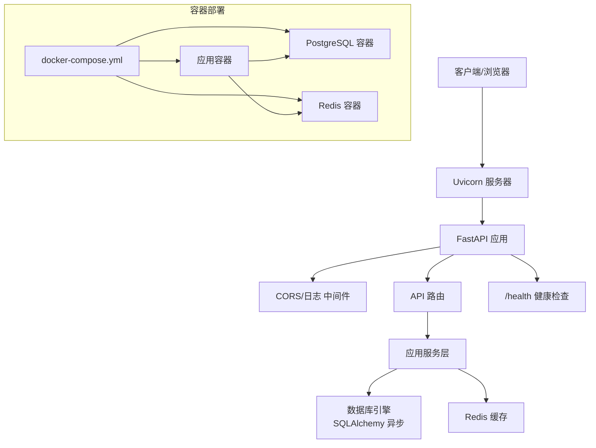
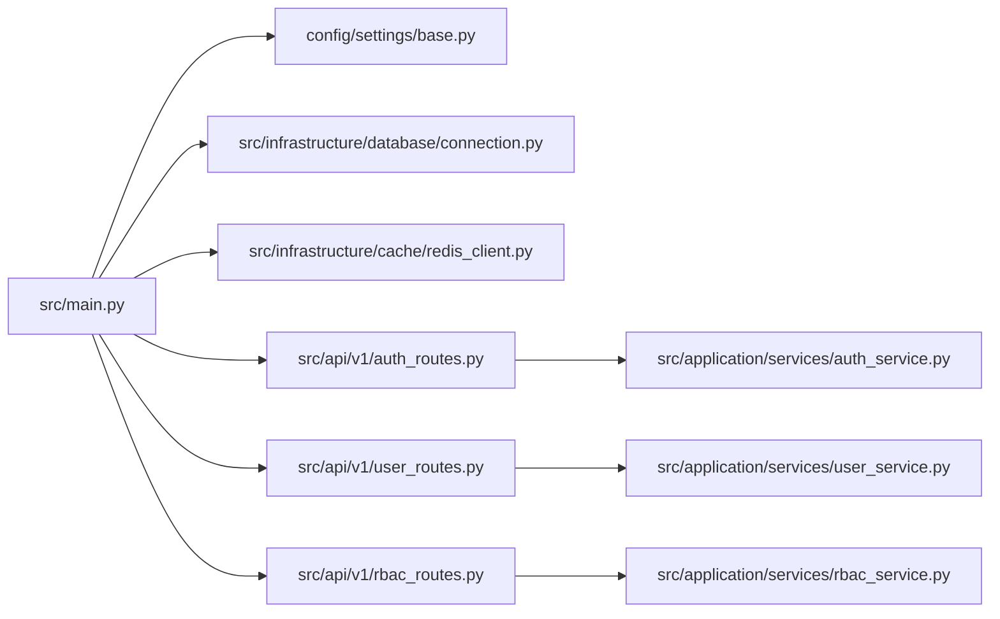
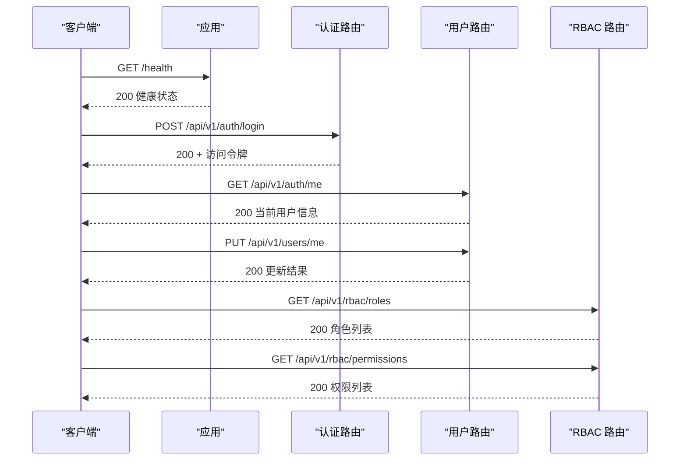

# 快速开始

<cite>
**本文引用的文件**
- [pyproject.toml](file://pyproject.toml)
- [Dockerfile](file://docker/Dockerfile)
- [docker-compose.yml](file://docker/docker-compose.yml)
- [settings/base.py](file://config/settings/base.py)
- [main.py](file://src/main.py)
- [setup_dev.sh](file://scripts/setup_dev.sh)
- [setup_dev.bat](file://scripts/setup_dev.bat)
- [manage.py](file://manage.py)
- [lint.sh](file://scripts/lint.sh)
- [verify_api.py](file://scripts/verify_api.py)
- [constants.py](file://src/core/constants.py)
- [connection.py](file://src/infrastructure/database/connection.py)
- [redis_client.py](file://src/infrastructure/cache/redis_client.py)
- [auth_routes.py](file://src/api/v1/auth_routes.py)
- [user_routes.py](file://src/api/v1/user_routes.py)
- [rbac_routes.py](file://src/api/v1/rbac_routes.py)
- [asgi.py](file://config/asgi.py)
</cite>

## 目录
1. [简介](#简介)
2. [项目结构](#项目结构)
3. [核心组件](#核心组件)
4. [架构总览](#架构总览)
5. [详细组件分析](#详细组件分析)
6. [依赖关系分析](#依赖关系分析)
7. [性能注意事项](#性能注意事项)
8. [故障排除指南](#故障排除指南)
9. [结论](#结论)
10. [附录](#附录)

## 简介
本指南面向新开发者，帮助你在约30分钟内完成 Hello-FastApi 项目的环境准备、本地开发与容器化部署，并验证核心功能。项目采用 Python 3.10+、FastAPI、SQLAlchemy 异步 ORM、Redis 缓存、PostgreSQL 数据库以及基于 Pydantic 的配置管理，支持开发、测试与生产多环境。

## 项目结构
项目采用按领域驱动设计（DDD）分层组织，核心目录与职责如下：
- config：应用配置与 ASGI 入口
- src：业务域与基础设施实现
  - api：API 路由与依赖
  - application：应用服务与 DTO
  - domain：领域实体与仓库接口
  - infrastructure：数据库、缓存、仓库实现
  - core：常量、异常、中间件、工具
- docker：Dockerfile 与 docker-compose.yml
- scripts：开发辅助脚本（格式化、质量检查、功能验证）
- logs：日志输出目录（容器挂载）

图表来源
- [main.py:1-83](file://src/main.py#L1-L83)
- [auth_routes.py:1-34](file://src/api/v1/auth_routes.py#L1-L34)
- [user_routes.py:1-115](file://src/api/v1/user_routes.py#L1-L115)
- [rbac_routes.py:1-168](file://src/api/v1/rbac_routes.py#L1-L168)
- [connection.py:1-51](file://src/infrastructure/database/connection.py#L1-L51)
- [redis_client.py:1-27](file://src/infrastructure/cache/redis_client.py#L1-L27)
- [settings/base.py:1-86](file://config/settings/base.py#L1-L86)
- [asgi.py:1-6](file://config/asgi.py#L1-L6)

章节来源
- [main.py:1-83](file://src/main.py#L1-L83)
- [settings/base.py:1-86](file://config/settings/base.py#L1-L86)

## 核心组件
- 应用入口与生命周期：通过 FastAPI 工厂函数创建应用，注册中间件、全局异常处理器、健康检查端点，并在启动时初始化数据库。
- 配置系统：基于 Pydantic Settings 的多环境配置（开发/生产/测试），支持从 .env 文件加载。
- 数据库：异步 SQLAlchemy 引擎与会话工厂，默认 SQLite（开发）或 PostgreSQL（生产/容器）。
- 缓存：Redis 异步客户端，支持统一获取与关闭。
- API 路由：认证、用户、RBAC 三大模块，均带权限控制与分页参数校验。
- 管理脚本：提供开发服务器、数据库初始化、RBAC 种子数据、超级用户创建等命令。

章节来源
- [main.py:19-83](file://src/main.py#L19-L83)
- [settings/base.py:6-86](file://config/settings/base.py#L6-L86)
- [connection.py:7-51](file://src/infrastructure/database/connection.py#L7-L51)
- [redis_client.py:9-27](file://src/infrastructure/cache/redis_client.py#L9-L27)
- [auth_routes.py:14-34](file://src/api/v1/auth_routes.py#L14-L34)
- [user_routes.py:24-115](file://src/api/v1/user_routes.py#L24-L115)
- [rbac_routes.py:25-168](file://src/api/v1/rbac_routes.py#L25-L168)
- [manage.py:14-127](file://manage.py#L14-L127)

## 架构总览
下图展示从请求进入应用到数据库与缓存交互的整体流程，以及开发与生产两种部署形态。

图表来源
- [main.py:31-83](file://src/main.py#L31-L83)
- [connection.py:7-51](file://src/infrastructure/database/connection.py#L7-L51)
- [redis_client.py:9-27](file://src/infrastructure/cache/redis_client.py#L9-L27)
- [docker-compose.yml:1-59](file://docker/docker-compose.yml#L1-L59)

## 详细组件分析

### 环境准备与依赖安装
- Python 版本要求：项目要求 Python 3.10+。
- 推荐使用 uv 作为包管理与虚拟环境工具，可加速安装与格式化。
- 开发依赖：包含 pytest、ruff、mypy、httpx、factory-boy、faker 等，用于测试、格式化、类型检查与数据生成。
- 依赖安装命令（uv 示例）：在项目根目录执行安装开发依赖的命令。

章节来源
- [pyproject.toml:6-39](file://pyproject.toml#L6-L39)
- [setup_dev.sh:8-25](file://scripts/setup_dev.sh#L8-L25)
- [setup_dev.bat:6-22](file://scripts/setup_dev.bat#L6-L22)

### 虚拟环境创建
- 使用 uv 创建 Python 3.10 的虚拟环境，并激活后安装项目与开发依赖。
- Windows 用户可使用批处理脚本一键完成；Linux/macOS 用户可使用 Bash 脚本。

章节来源
- [setup_dev.sh:16-25](file://scripts/setup_dev.sh#L16-L25)
- [setup_dev.bat:13-22](file://scripts/setup_dev.bat#L13-L22)

### 本地开发环境设置
- 初始化数据库：运行数据库表初始化命令，创建所有模型对应的表。
- 种子 RBAC 数据：创建默认角色与权限，便于后续测试。
- 运行开发服务器：根据配置在指定主机与端口启动 Uvicorn。
- 运行测试：执行单元与集成测试，确保基础功能正常。

章节来源
- [manage.py:51-93](file://manage.py#L51-L93)
- [manage.py:14-22](file://manage.py#L14-L22)
- [setup_dev.sh:32-47](file://scripts/setup_dev.sh#L32-L47)
- [setup_dev.bat:29-44](file://scripts/setup_dev.bat#L29-L44)

### 数据库初始化与 Redis 配置
- 数据库：默认使用 SQLite（开发环境），生产/容器使用 PostgreSQL。连接字符串可在环境变量中配置。
- Redis：默认连接本地 Redis，容器部署时通过 docker-compose 指向 redis 服务。
- 初始化流程：应用启动时自动初始化数据库；也可通过管理命令手动初始化。

章节来源
- [settings/base.py:20-24](file://config/settings/base.py#L20-L24)
- [connection.py:39-51](file://src/infrastructure/database/connection.py#L39-L51)
- [redis_client.py:9-18](file://src/infrastructure/cache/redis_client.py#L9-L18)
- [docker-compose.yml:13-14](file://docker/docker-compose.yml#L13-L14)

### 环境变量与配置
- 关键配置项：应用名称、环境、调试开关、主机端口、数据库 URL、Redis URL、JWT 参数、CORS 源、速率限制、日志级别。
- 多环境映射：根据 APP_ENV 选择开发/生产/测试配置类，测试环境使用独立数据库文件。

章节来源
- [settings/base.py:6-86](file://config/settings/base.py#L6-L86)

### API 路由与权限控制
- 认证路由：登录、刷新令牌、获取当前用户。
- 用户路由：创建、查询、更新、删除用户，以及修改密码与查看/更新个人信息。
- RBAC 路由：角色与权限的增删改查、用户角色与权限查询、角色分配与移除。
- 权限装饰器：多数端点使用 require_permission 装饰器进行细粒度权限控制。

章节来源
- [auth_routes.py:14-34](file://src/api/v1/auth_routes.py#L14-L34)
- [user_routes.py:24-115](file://src/api/v1/user_routes.py#L24-L115)
- [rbac_routes.py:25-168](file://src/api/v1/rbac_routes.py#L25-L168)
- [constants.py:11-28](file://src/core/constants.py#L11-L28)

### 项目启动与验证
- 启动命令：使用管理脚本启动开发服务器，或直接运行 Uvicorn。
- 健康检查：访问 /health 端点确认服务可用。
- 功能验证：使用验证脚本对健康检查、登录、受保护端点、RBAC 端点等进行自动化测试。

章节来源
- [manage.py:14-22](file://manage.py#L14-L22)
- [main.py:71-75](file://src/main.py#L71-L75)
- [verify_api.py:8-176](file://scripts/verify_api.py#L8-L176)

### Docker 容器化部署
- Dockerfile：基于 Python 3.10 slim 镜像，安装系统依赖与 uv，复制依赖与源码，创建日志目录，暴露 8000 端口，以 uvicorn 启动应用。
- docker-compose.yml：定义应用、PostgreSQL、Redis 三个服务，设置环境变量（数据库与 Redis URL）、健康检查、卷挂载与重启策略。
- 运行方式：在 docker 目录下执行构建与启动命令，等待服务健康后访问应用。

章节来源
- [Dockerfile:1-29](file://docker/Dockerfile#L1-L29)
- [docker-compose.yml:1-59](file://docker/docker-compose.yml#L1-L59)

## 依赖关系分析
- 应用入口依赖配置模块与数据库初始化；API 路由依赖应用服务层；应用服务层依赖数据库与缓存。
- 管理脚本集中了开发常用命令，简化初始化与验证流程。
- 容器编排将应用、数据库与缓存解耦，便于扩展与维护。

图表来源
- [main.py:1-83](file://src/main.py#L1-L83)
- [settings/base.py:1-86](file://config/settings/base.py#L1-L86)
- [connection.py:1-51](file://src/infrastructure/database/connection.py#L1-L51)
- [redis_client.py:1-27](file://src/infrastructure/cache/redis_client.py#L1-L27)
- [auth_routes.py:1-34](file://src/api/v1/auth_routes.py#L1-L34)
- [user_routes.py:1-115](file://src/api/v1/user_routes.py#L1-L115)
- [rbac_routes.py:1-168](file://src/api/v1/rbac_routes.py#L1-L168)

章节来源
- [main.py:1-83](file://src/main.py#L1-L83)
- [manage.py:95-127](file://manage.py#L95-L127)

## 性能注意事项
- 异步数据库：使用 SQLAlchemy 异步引擎与会话工厂，减少阻塞，提升并发能力。
- 连接池预检查：启用 pool_pre_ping，增强连接稳定性。
- 缓存：Redis 提供高性能缓存，建议对热点数据与限流规则进行缓存。
- 日志：生产环境降低日志级别，避免过多 IO 影响性能。
- 速率限制：内置速率限制组件，结合缓存可有效防止滥用。

章节来源
- [connection.py:7-17](file://src/infrastructure/database/connection.py#L7-L17)
- [settings/base.py:35-41](file://config/settings/base.py#L35-L41)

## 故障排除指南
- Python 版本不匹配：确保使用 Python 3.10+，否则依赖安装或运行会失败。
- uv 未安装：脚本会自动安装 uv；若网络受限，可手动安装后重试。
- 数据库连接失败：检查 DATABASE_URL 是否正确，容器部署时需等待数据库健康检查通过。
- Redis 连接失败：检查 REDIS_URL，容器部署时确保 Redis 服务健康。
- 权限不足导致用户创建失败：RBAC 种子数据已创建默认角色与权限，可通过管理命令为用户分配角色后再测试。
- 端口占用：如 8000 端口被占用，请调整配置中的端口或释放端口。
- 热更新问题：开发模式下启用 reload，但部分文件变更可能不会触发重启，建议重启服务。

章节来源
- [setup_dev.sh:8-14](file://scripts/setup_dev.sh#L8-L14)
- [setup_dev.bat:6-12](file://scripts/setup_dev.bat#L6-L12)
- [docker-compose.yml:35-54](file://docker/docker-compose.yml#L35-L54)
- [settings/base.py:20-24](file://config/settings/base.py#L20-L24)
- [manage.py:59-93](file://manage.py#L59-L93)

## 结论
通过本指南，你可以在 30 分钟内完成环境准备、本地开发与容器化部署，并验证核心功能。建议在本地开发完成后，使用 docker-compose 进行端到端验证，再结合管理脚本进行日常维护与测试。

## 附录

### 快速命令清单
- 安装依赖（uv）：在项目根目录执行安装开发依赖的命令
- 创建虚拟环境并激活：使用 uv venv 并激活
- 初始化数据库：运行数据库初始化命令
- 种子 RBAC 数据：运行 RBAC 种子数据命令
- 启动开发服务器：运行开发服务器命令
- 运行测试：执行测试命令
- 容器化部署：在 docker 目录下构建并启动服务

章节来源
- [setup_dev.sh:16-47](file://scripts/setup_dev.sh#L16-L47)
- [setup_dev.bat:13-44](file://scripts/setup_dev.bat#L13-L44)
- [manage.py:14-93](file://manage.py#L14-L93)
- [Dockerfile:18-29](file://docker/Dockerfile#L18-L29)
- [docker-compose.yml:4-22](file://docker/docker-compose.yml#L4-L22)

### API 基础验证流程

图表来源
- [main.py:71-75](file://src/main.py#L71-L75)
- [auth_routes.py:14-34](file://src/api/v1/auth_routes.py#L14-L34)
- [user_routes.py:49-79](file://src/api/v1/user_routes.py#L49-L79)
- [rbac_routes.py:36-107](file://src/api/v1/rbac_routes.py#L36-L107)