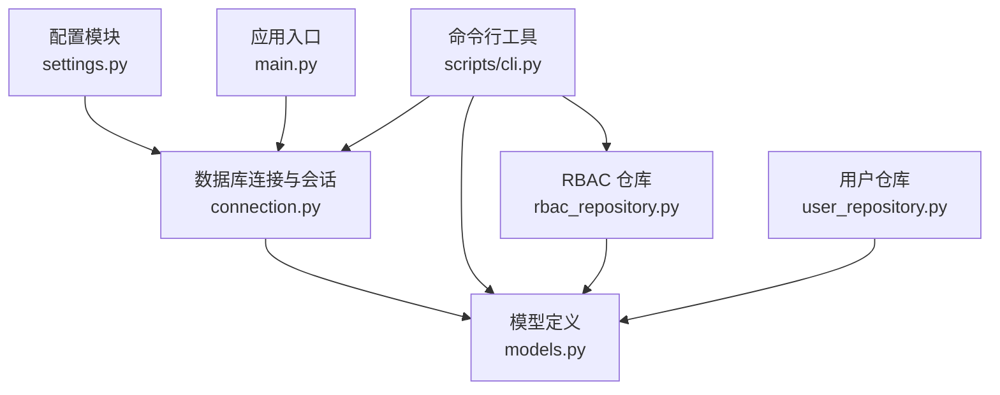
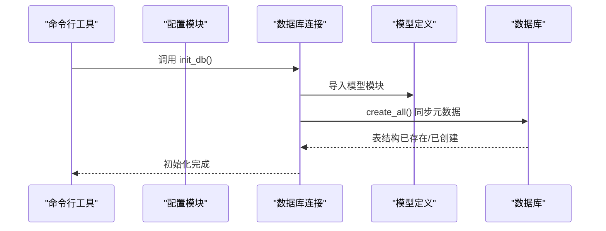
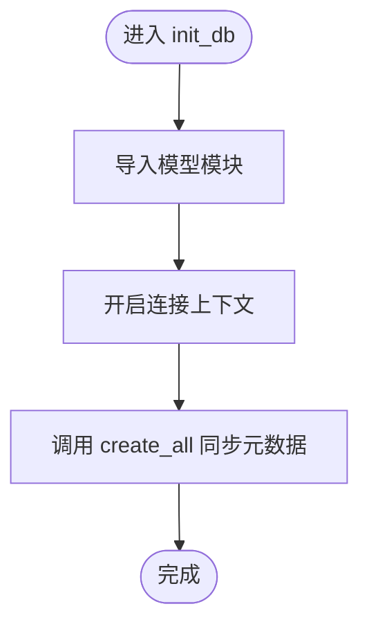
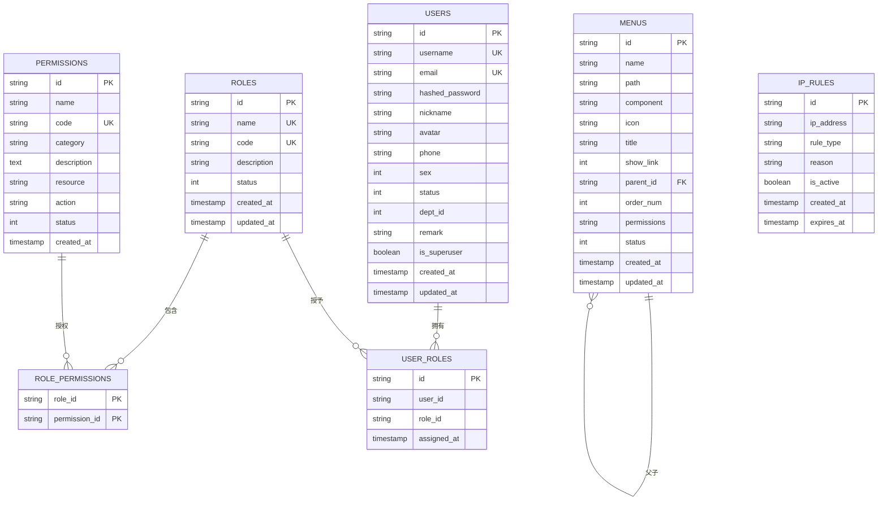
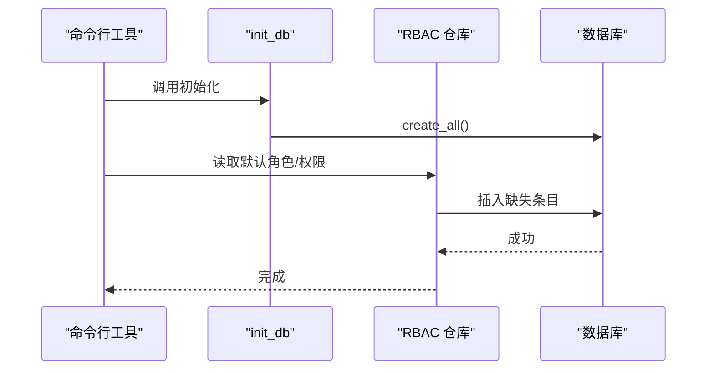
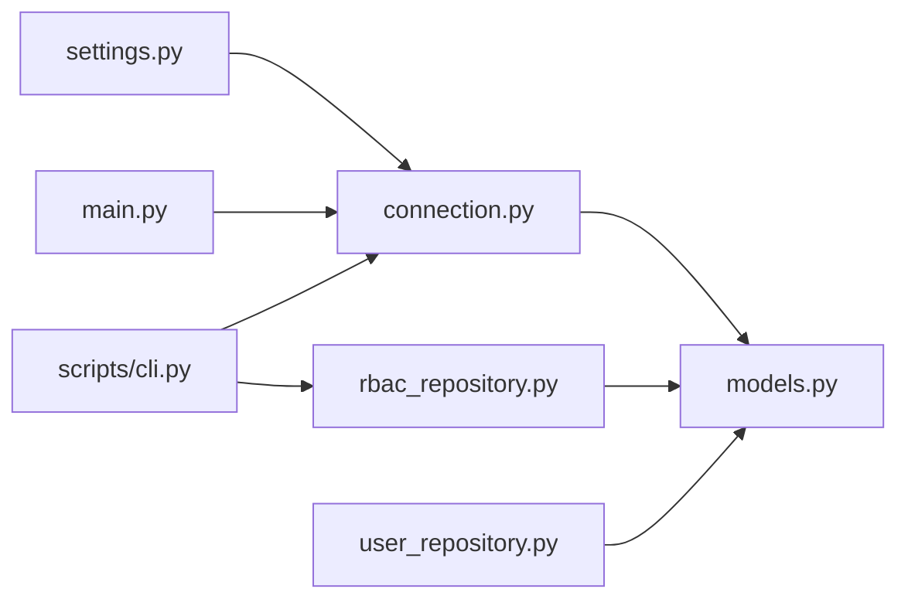
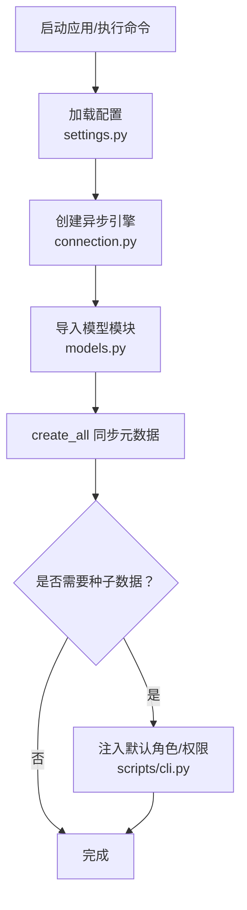

# 数据库初始化与迁移

<cite>
**本文引用的文件**
- [service/src/infrastructure/database/connection.py](file://service/src/infrastructure/database/connection.py)
- [service/src/infrastructure/database/models.py](file://service/src/infrastructure/database/models.py)
- [service/src/infrastructure/database/__init__.py](file://service/src/infrastructure/database/__init__.py)
- [service/src/config/settings.py](file://service/src/config/settings.py)
- [service/src/main.py](file://service/src/main.py)
- [service/scripts/cli.py](file://service/scripts/cli.py)
- [service/src/core/constants.py](file://service/src/core/constants.py)
- [service/src/infrastructure/repositories/rbac_repository.py](file://service/src/infrastructure/repositories/rbac_repository.py)
- [service/src/infrastructure/repositories/user_repository.py](file://service/src/infrastructure/repositories/user_repository.py)
</cite>

## 目录
1. [简介](#简介)
2. [项目结构](#项目结构)
3. [核心组件](#核心组件)
4. [架构总览](#架构总览)
5. [详细组件分析](#详细组件分析)
6. [依赖分析](#依赖分析)
7. [性能考虑](#性能考虑)
8. [故障排查指南](#故障排查指南)
9. [结论](#结论)
10. [附录](#附录)

## 简介
本文件系统性阐述 Hello-FastApi 项目的数据库初始化与迁移机制，覆盖以下主题：
- 数据库表结构初始化流程与脚本执行顺序
- SQL 迁移脚本的组织结构与版本管理策略
- 开发环境与生产环境的数据库初始化差异
- 种子数据的插入与默认配置设置
- 数据库备份与恢复操作指南
- 版本升级与回滚的安全策略
- 性能调优与索引优化实施方案
- 数据库维护与管理的完整工作流程

## 项目结构
数据库相关能力集中在 service 子项目中，关键位置如下：
- 配置层：环境变量与数据库连接字符串、目录创建等
- 连接层：异步引擎、会话管理、初始化与关闭
- 模型层：基于 SQLModel 的实体定义与索引
- 命令行工具：数据库初始化、种子数据注入、开发服务器启动
- 应用入口：在启动阶段自动执行初始化

图表来源
- [service/src/config/settings.py:1-198](file://service/src/config/settings.py#L1-L198)
- [service/src/infrastructure/database/connection.py:1-35](file://service/src/infrastructure/database/connection.py#L1-L35)
- [service/src/infrastructure/database/models.py:1-193](file://service/src/infrastructure/database/models.py#L1-L193)
- [service/src/main.py:1-96](file://service/src/main.py#L1-L96)
- [service/scripts/cli.py:1-135](file://service/scripts/cli.py#L1-L135)
- [service/src/infrastructure/repositories/rbac_repository.py:1-213](file://service/src/infrastructure/repositories/rbac_repository.py#L1-L213)
- [service/src/infrastructure/repositories/user_repository.py:1-185](file://service/src/infrastructure/repositories/user_repository.py#L1-L185)

章节来源
- [service/src/config/settings.py:1-198](file://service/src/config/settings.py#L1-L198)
- [service/src/infrastructure/database/connection.py:1-35](file://service/src/infrastructure/database/connection.py#L1-L35)
- [service/src/infrastructure/database/models.py:1-193](file://service/src/infrastructure/database/models.py#L1-L193)
- [service/src/main.py:1-96](file://service/src/main.py#L1-L96)
- [service/scripts/cli.py:1-135](file://service/scripts/cli.py#L1-L135)
- [service/src/infrastructure/repositories/rbac_repository.py:1-213](file://service/src/infrastructure/repositories/rbac_repository.py#L1-L213)
- [service/src/infrastructure/repositories/user_repository.py:1-185](file://service/src/infrastructure/repositories/user_repository.py#L1-L185)

## 核心组件
- 引擎与会话管理：创建异步引擎、提供依赖注入会话、事务提交与回滚、初始化与关闭
- 模型定义：用户、角色、权限、菜单、IP 规则等实体及多对多关联表
- 配置与环境：多环境配置加载、数据库 URL、目录创建
- 应用生命周期：启动时自动初始化数据库表
- 命令行工具：数据库初始化、种子数据注入、开发服务器启动
- 仓库层：基于 SQLModel 的查询与写入封装

章节来源
- [service/src/infrastructure/database/connection.py:1-35](file://service/src/infrastructure/database/connection.py#L1-L35)
- [service/src/infrastructure/database/models.py:1-193](file://service/src/infrastructure/database/models.py#L1-L193)
- [service/src/config/settings.py:1-198](file://service/src/config/settings.py#L1-L198)
- [service/src/main.py:1-96](file://service/src/main.py#L1-L96)
- [service/scripts/cli.py:1-135](file://service/scripts/cli.py#L1-L135)
- [service/src/core/constants.py:1-37](file://service/src/core/constants.py#L1-L37)

## 架构总览
数据库初始化与迁移采用“模型即迁移”的策略：通过 SQLModel 将模型定义直接映射为数据库表结构；在应用启动或手动执行命令时，将模型元数据同步到数据库。

图表来源
- [service/scripts/cli.py:59-65](file://service/scripts/cli.py#L59-L65)
- [service/src/infrastructure/database/connection.py:23-30](file://service/src/infrastructure/database/connection.py#L23-L30)
- [service/src/infrastructure/database/models.py:1-193](file://service/src/infrastructure/database/models.py#L1-L193)

章节来源
- [service/src/infrastructure/database/connection.py:23-30](file://service/src/infrastructure/database/connection.py#L23-L30)
- [service/scripts/cli.py:59-65](file://service/scripts/cli.py#L59-L65)

## 详细组件分析

### 数据库连接与会话管理
- 异步引擎：基于配置中的数据库 URL 创建异步引擎，开启调试输出与连接预检查
- 会话依赖：提供异步会话依赖，自动提交或回滚事务
- 初始化函数：导入模型模块后，使用 SQLModel 元数据创建所有表
- 关闭函数：释放引擎资源

图表来源
- [service/src/infrastructure/database/connection.py:23-30](file://service/src/infrastructure/database/connection.py#L23-L30)

章节来源
- [service/src/infrastructure/database/connection.py:1-35](file://service/src/infrastructure/database/connection.py#L1-L35)

### 模型定义与索引设计
- 用户表：唯一索引用户名与邮箱，索引手机号、性别、状态、部门等字段
- 角色表：唯一索引名称与编码，状态字段
- 权限表：唯一索引编码，分类、资源、动作等字段
- 菜单表：层级父子关系、排序号、状态、权限编码集合
- IP 规则表：IP 地址索引、黑白名单类型、有效期
- 多对多关联：角色-权限、用户-角色

图表来源
- [service/src/infrastructure/database/models.py:17-193](file://service/src/infrastructure/database/models.py#L17-L193)

章节来源
- [service/src/infrastructure/database/models.py:1-193](file://service/src/infrastructure/database/models.py#L1-L193)

### 配置与环境差异
- 多环境配置：开发、生产、测试分别加载不同 .env 文件
- 数据库 URL：开发默认 SQLite 文件路径，测试覆盖为独立测试库
- 目录创建：自动创建 sql、logs、docs 目录
- 日志级别：开发与生产默认日志级别不同

章节来源
- [service/src/config/settings.py:1-198](file://service/src/config/settings.py#L1-L198)

### 应用生命周期与初始化
- 启动阶段：应用生命周期管理器在启动时调用初始化函数
- 关闭阶段：关闭数据库引擎，释放资源

章节来源
- [service/src/main.py:19-32](file://service/src/main.py#L19-L32)

### 命令行工具与种子数据
- 初始化数据库：创建所有表结构
- 种子数据：默认角色与权限的注入逻辑
- 创建超级管理员：交互式创建并持久化

图表来源
- [service/scripts/cli.py:59-101](file://service/scripts/cli.py#L59-L101)
- [service/src/core/constants.py:11-36](file://service/src/core/constants.py#L11-L36)
- [service/src/infrastructure/repositories/rbac_repository.py:62-96](file://service/src/infrastructure/repositories/rbac_repository.py#L62-L96)

章节来源
- [service/scripts/cli.py:1-135](file://service/scripts/cli.py#L1-L135)
- [service/src/core/constants.py:1-37](file://service/src/core/constants.py#L1-L37)
- [service/src/infrastructure/repositories/rbac_repository.py:1-213](file://service/src/infrastructure/repositories/rbac_repository.py#L1-L213)

### 仓库层与查询封装
- 角色仓库：按名称/编码/ID 查询、分页、计数、分配权限、分配角色给用户
- 权限仓库：按编码/ID 查询、分页、计数、获取用户权限
- 用户仓库：按 ID/用户名/邮箱查询、分页、计数、创建/更新/删除、批量删除、状态更新、密码重置

章节来源
- [service/src/infrastructure/repositories/rbac_repository.py:1-213](file://service/src/infrastructure/repositories/rbac_repository.py#L1-L213)
- [service/src/infrastructure/repositories/user_repository.py:1-185](file://service/src/infrastructure/repositories/user_repository.py#L1-L185)

## 依赖分析
- 模块耦合
  - 连接层依赖配置层提供的数据库 URL
  - 初始化函数依赖模型模块进行元数据同步
  - 应用入口依赖连接层的初始化与关闭
  - 命令行工具依赖连接层与仓库层
- 外部依赖
  - SQLModel 提供 ORM 与元数据管理
  - SQLAlchemy 异步引擎与会话
  - Pydantic 设置加载与校验

图表来源
- [service/src/config/settings.py:1-198](file://service/src/config/settings.py#L1-L198)
- [service/src/infrastructure/database/connection.py:1-35](file://service/src/infrastructure/database/connection.py#L1-L35)
- [service/src/infrastructure/database/models.py:1-193](file://service/src/infrastructure/database/models.py#L1-L193)
- [service/src/main.py:1-96](file://service/src/main.py#L1-L96)
- [service/scripts/cli.py:1-135](file://service/scripts/cli.py#L1-L135)
- [service/src/infrastructure/repositories/rbac_repository.py:1-213](file://service/src/infrastructure/repositories/rbac_repository.py#L1-L213)
- [service/src/infrastructure/repositories/user_repository.py:1-185](file://service/src/infrastructure/repositories/user_repository.py#L1-L185)

章节来源
- [service/src/config/settings.py:1-198](file://service/src/config/settings.py#L1-L198)
- [service/src/infrastructure/database/connection.py:1-35](file://service/src/infrastructure/database/connection.py#L1-L35)
- [service/src/infrastructure/database/models.py:1-193](file://service/src/infrastructure/database/models.py#L1-L193)
- [service/src/main.py:1-96](file://service/src/main.py#L1-L96)
- [service/scripts/cli.py:1-135](file://service/scripts/cli.py#L1-L135)
- [service/src/infrastructure/repositories/rbac_repository.py:1-213](file://service/src/infrastructure/repositories/rbac_repository.py#L1-L213)
- [service/src/infrastructure/repositories/user_repository.py:1-185](file://service/src/infrastructure/repositories/user_repository.py#L1-L185)

## 性能考虑
- 索引策略
  - 用户：username、email、phone、dept_id、status 等建立索引，提升查询效率
  - 角色：name、code 唯一索引，避免重复与加速匹配
  - 权限：code 唯一索引，便于快速定位
  - 菜单：parent_id 支持层级查询，order_num 支持排序
  - IP 规则：ip_address 建立索引，rule_type 用于黑白名单快速过滤
- 连接池与预检查
  - 引擎启用 pool_pre_ping，确保连接有效性，降低断连风险
- 查询优化
  - 使用分页与筛选条件，避免一次性加载大量数据
  - 对高频查询字段建立索引，减少全表扫描
- 写入优化
  - 批量插入与合并更新，减少往返次数
  - 事务边界明确，异常时自动回滚，保证一致性

章节来源
- [service/src/infrastructure/database/models.py:1-193](file://service/src/infrastructure/database/models.py#L1-L193)
- [service/src/infrastructure/database/connection.py:9](file://service/src/infrastructure/database/connection.py#L9)
- [service/src/infrastructure/repositories/rbac_repository.py:32-47](file://service/src/infrastructure/repositories/rbac_repository.py#L32-L47)
- [service/src/infrastructure/repositories/user_repository.py:32-75](file://service/src/infrastructure/repositories/user_repository.py#L32-L75)

## 故障排查指南
- 初始化失败
  - 检查 DATABASE_URL 是否正确，确认目录存在且可写
  - 查看 DEBUG 输出，定位 SQLModel 元数据同步问题
- 连接异常
  - 确认 pool_pre_ping 已启用，检查网络与数据库可达性
  - 若为生产环境，核对连接池大小与超时配置
- 种子数据冲突
  - 默认角色/权限仅在不存在时插入，避免重复
  - 如需重置，先清理相关表再重新初始化
- 事务回滚
  - 会话层捕获异常并回滚，确保数据一致性
- 常见问题定位
  - 使用日志级别与调试输出辅助定位
  - 核对环境变量 APP_ENV 与 .env 文件内容

章节来源
- [service/src/config/settings.py:57-58](file://service/src/config/settings.py#L57-L58)
- [service/src/infrastructure/database/connection.py:12-21](file://service/src/infrastructure/database/connection.py#L12-L21)
- [service/scripts/cli.py:67-101](file://service/scripts/cli.py#L67-L101)

## 结论
本项目采用“模型即迁移”的轻量级方案，通过 SQLModel 将模型定义直接映射为数据库结构，并在应用启动与命令行工具中提供一致的初始化入口。结合多环境配置、种子数据注入与完善的仓库层封装，形成一套可维护、可扩展的数据库初始化与迁移实践。建议在生产环境中配合备份与监控策略，确保升级与回滚的安全可控。

## 附录

### 数据库初始化与迁移流程图

图表来源
- [service/src/config/settings.py:1-198](file://service/src/config/settings.py#L1-L198)
- [service/src/infrastructure/database/connection.py:23-30](file://service/src/infrastructure/database/connection.py#L23-L30)
- [service/src/infrastructure/database/models.py:1-193](file://service/src/infrastructure/database/models.py#L1-L193)
- [service/scripts/cli.py:59-101](file://service/scripts/cli.py#L59-L101)

### 开发环境与生产环境差异
- 开发环境
  - 默认 SQLite 文件数据库，便于本地开发与测试
  - DEBUG 开启，日志级别较低，便于调试
- 生产环境
  - 需要配置专用数据库 URL，关闭 DEBUG
  - 日志级别提高，关注稳定性与性能
- 测试环境
  - 使用独立测试数据库文件，隔离测试数据

章节来源
- [service/src/config/settings.py:110-141](file://service/src/config/settings.py#L110-L141)

### SQL 迁移脚本组织与版本管理
- 当前策略
  - 采用“模型即迁移”，无需单独的 SQL 迁移脚本
  - 通过 SQLModel 元数据驱动表结构变更
- 版本管理建议
  - 保持模型定义的向后兼容性
  - 对于复杂变更，建议拆分为多个小版本，逐步演进
  - 记录每次模型变更的意图与影响范围

章节来源
- [service/src/infrastructure/database/connection.py:23-30](file://service/src/infrastructure/database/connection.py#L23-L30)
- [service/src/infrastructure/database/models.py:1-193](file://service/src/infrastructure/database/models.py#L1-L193)

### 数据库种子数据与默认配置
- 默认角色与权限
  - 通过常量定义默认角色与权限集合
  - 种子注入逻辑仅在缺失时创建，避免重复
- 默认配置
  - 配置模块提供默认值与校验
  - 环境变量优先级高于默认值

章节来源
- [service/src/core/constants.py:11-36](file://service/src/core/constants.py#L11-L36)
- [service/scripts/cli.py:67-101](file://service/scripts/cli.py#L67-L101)
- [service/src/config/settings.py:41-107](file://service/src/config/settings.py#L41-L107)

### 数据库备份与恢复
- 备份
  - SQLite：直接复制数据库文件
  - 其他数据库：使用官方工具导出 SQL 或二进制快照
- 恢复
  - 停止服务，替换或还原数据库文件
  - 重启服务，验证初始化与功能正常

章节来源
- [service/src/config/settings.py:57-58](file://service/src/config/settings.py#L57-L58)

### 版本升级与回滚安全策略
- 升级前
  - 备份数据库
  - 在测试环境验证模型变更
- 升级中
  - 采用灰度发布，逐步切换流量
  - 监控数据库连接与查询性能
- 回滚
  - 快速恢复备份
  - 回滚应用版本至稳定分支

章节来源
- [service/src/infrastructure/database/connection.py:9](file://service/src/infrastructure/database/connection.py#L9)
- [service/src/infrastructure/database/connection.py:23-30](file://service/src/infrastructure/database/connection.py#L23-L30)

### 数据库维护与管理完整工作流程
- 日常维护
  - 定期检查日志与慢查询
  - 监控连接池与表空间
- 变更流程
  - 设计模型变更 → 编写/评审 → 测试环境验证 → 备份 → 生产发布 → 回检
- 监控与告警
  - 连接失败、事务回滚、查询超时等指标告警

章节来源
- [service/src/config/settings.py:81-92](file://service/src/config/settings.py#L81-L92)
- [service/src/infrastructure/database/connection.py:12-21](file://service/src/infrastructure/database/connection.py#L12-L21)