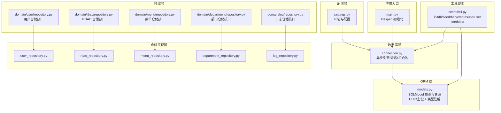
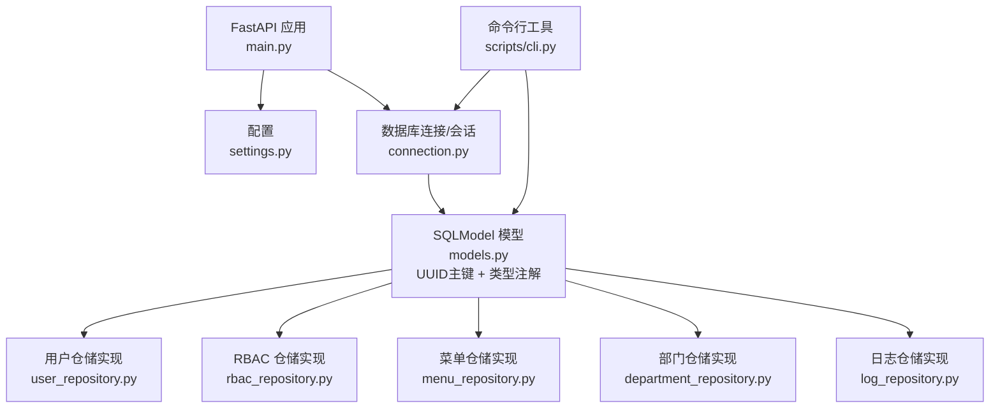
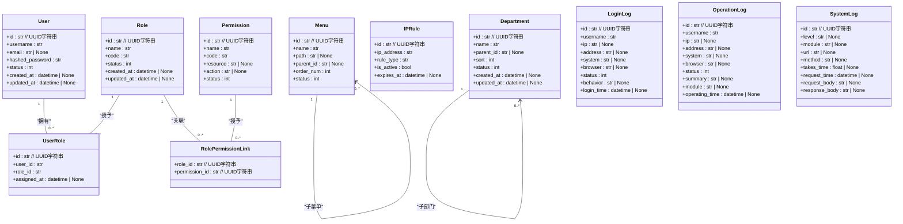
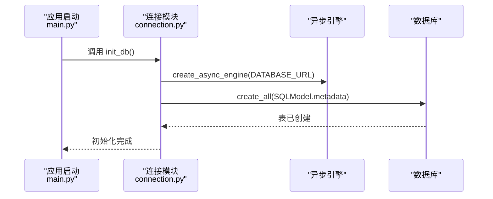
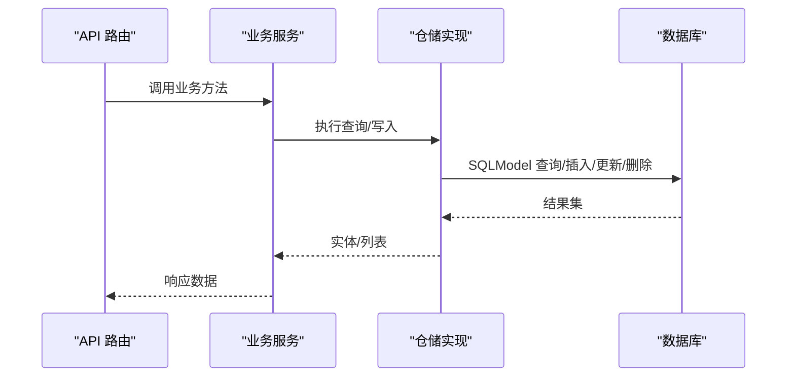
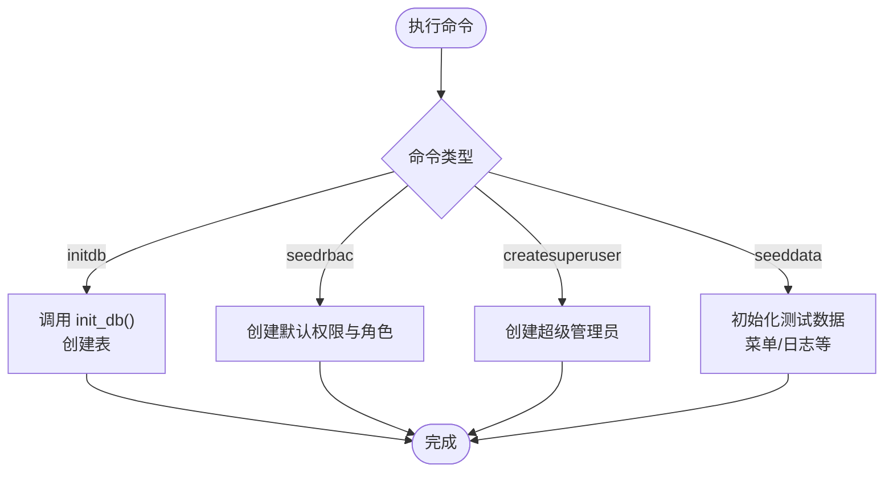
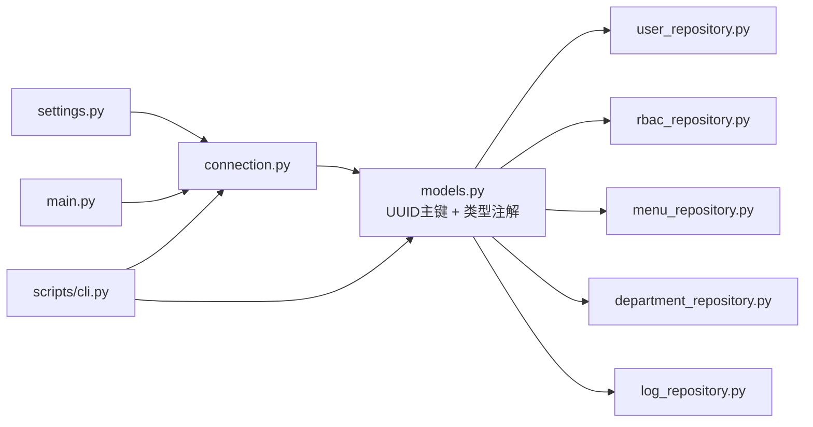

# 数据库设计

<cite>
**本文引用的文件**
- [models.py](file://service/src/infrastructure/database/models.py)
- [connection.py](file://service/src/infrastructure/database/connection.py)
- [settings.py](file://service/src/config/settings.py)
- [user_repository.py](file://service/src/infrastructure/repositories/user_repository.py)
- [rbac_repository.py](file://service/src/infrastructure/repositories/rbac_repository.py)
- [menu_repository.py](file://service/src/infrastructure/repositories/menu_repository.py)
- [department_repository.py](file://service/src/infrastructure/repositories/department_repository.py)
- [log_repository.py](file://service/src/infrastructure/repositories/log_repository.py)
- [repository.py（用户领域接口）](file://service/src/domain/user/repository.py)
- [repository.py（RBAC 领域接口）](file://service/src/domain/rbac/repository.py)
- [repository.py（菜单领域接口）](file://service/src/domain/menu/repository.py)
- [cli.py](file://service/scripts/cli.py)
- [constants.py](file://service/src/core/constants.py)
- [main.py](file://service/src/main.py)
</cite>

## 更新摘要
**变更内容**
- 数据库模型完全重构，引入UUID标识符替代整数ID
- 改进类型注解和验证约束
- 新增部门、日志等扩展模型
- 增强实体关系映射和索引策略
- 优化仓储接口和实现

## 目录
1. [简介](#简介)
2. [项目结构](#项目结构)
3. [核心组件](#核心组件)
4. [架构总览](#架构总览)
5. [详细组件分析](#详细组件分析)
6. [依赖分析](#依赖分析)
7. [性能考虑](#性能考虑)
8. [故障排查指南](#故障排查指南)
9. [结论](#结论)
10. [附录](#附录)

## 简介
本文件面向 Hello-FastApi 服务端的数据库与 ORM 设计，系统性阐述基于 SQLModel 的数据模型设计、实体关系映射、异步数据库连接与会话管理、初始化与迁移策略、索引与查询优化、以及环境配置与差异处理。本次重构引入UUID标识符替代传统整数ID，提供更好的分布式兼容性和安全性。

## 项目结构
数据库相关代码主要分布在以下模块：
- 配置层：应用配置与环境差异加载
- 数据库层：异步引擎、会话提供、表初始化
- ORM 层：SQLModel 模型定义（用户、角色、权限、菜单、IP 规则、部门、日志）
- 领域层：各领域仓储接口（用户、RBAC、菜单、部门、日志）
- 仓储实现层：基于 SQLModel 的具体仓储实现
- 工具脚本：数据库初始化、RBAC 种子数据、超级管理员创建等

**图表来源**
- [settings.py:1-188](file://service/src/config/settings.py#L1-L188)
- [connection.py:1-40](file://service/src/infrastructure/database/connection.py#L1-L40)
- [models.py:1-283](file://service/src/infrastructure/database/models.py#L1-L283)
- [user_repository.py:1-169](file://service/src/infrastructure/repositories/user_repository.py#L1-L169)
- [rbac_repository.py:1-265](file://service/src/infrastructure/repositories/rbac_repository.py#L1-L265)
- [menu_repository.py:1-50](file://service/src/infrastructure/repositories/menu_repository.py#L1-L50)
- [department_repository.py:1-69](file://service/src/infrastructure/repositories/department_repository.py#L1-L69)
- [log_repository.py:1-194](file://service/src/infrastructure/repositories/log_repository.py#L1-L194)
- [cli.py:1-337](file://service/scripts/cli.py#L1-L337)
- [main.py:1-73](file://service/src/main.py#L1-L73)

**章节来源**
- [settings.py:1-188](file://service/src/config/settings.py#L1-L188)
- [connection.py:1-40](file://service/src/infrastructure/database/connection.py#L1-L40)
- [models.py:1-283](file://service/src/infrastructure/database/models.py#L1-L283)
- [user_repository.py:1-169](file://service/src/infrastructure/repositories/user_repository.py#L1-L169)
- [rbac_repository.py:1-265](file://service/src/infrastructure/repositories/rbac_repository.py#L1-L265)
- [menu_repository.py:1-50](file://service/src/infrastructure/repositories/menu_repository.py#L1-L50)
- [department_repository.py:1-69](file://service/src/infrastructure/repositories/department_repository.py#L1-L69)
- [log_repository.py:1-194](file://service/src/infrastructure/repositories/log_repository.py#L1-L194)
- [cli.py:1-337](file://service/scripts/cli.py#L1-L337)
- [main.py:1-73](file://service/src/main.py#L1-L73)

## 核心组件
- **SQLModel 模型层**：统一承载 SQLAlchemy ORM 与 Pydantic 数据校验，使用UUID主键和严格类型注解，减少重复定义，提升一致性
- **异步数据库连接**：基于 aiosqlite/sqlalchemy async engine，提供异步会话与自动回滚/提交
- **仓储接口与实现**：领域驱动设计下的接口与 SQLModel 实现分离，便于替换与测试
- **初始化与种子**：命令行工具提供数据库表初始化、RBAC 默认数据注入、超级管理员创建、测试数据生成

**章节来源**
- [models.py:1-283](file://service/src/infrastructure/database/models.py#L1-L283)
- [connection.py:1-40](file://service/src/infrastructure/database/connection.py#L1-L40)
- [user_repository.py:1-169](file://service/src/infrastructure/repositories/user_repository.py#L1-L169)
- [rbac_repository.py:1-265](file://service/src/infrastructure/repositories/rbac_repository.py#L1-L265)
- [menu_repository.py:1-50](file://service/src/infrastructure/repositories/menu_repository.py#L1-L50)
- [cli.py:1-337](file://service/scripts/cli.py#L1-L337)

## 架构总览
下图展示数据库层在整体应用中的位置与交互：

**图表来源**
- [main.py:19-32](file://service/src/main.py#L19-L32)
- [settings.py:57-58](file://service/src/config/settings.py#L57-L58)
- [connection.py:9](file://service/src/infrastructure/database/connection.py#L9)
- [models.py:1-283](file://service/src/infrastructure/database/models.py#L1-L283)
- [user_repository.py:11-16](file://service/src/infrastructure/repositories/user_repository.py#L11-L16)
- [rbac_repository.py:11-16](file://service/src/infrastructure/repositories/rbac_repository.py#L11-L16)
- [menu_repository.py:10-12](file://service/src/infrastructure/repositories/menu_repository.py#L10-L12)
- [department_repository.py:11-16](file://service/src/infrastructure/repositories/department_repository.py#L11-L16)
- [log_repository.py:15-16](file://service/src/infrastructure/repositories/log_repository.py#L15-L16)
- [cli.py:59-64](file://service/scripts/cli.py#L59-L64)

## 详细组件分析

### SQLModel 模型设计与实体关系
**更新** 所有实体主键从整数改为UUID字符串，提供更好的分布式兼容性和安全性

- **用户（User）**：主键UUID字符串（长度36），唯一索引用户名与邮箱，常用字段如昵称、头像、手机号、性别、备注；软时间戳 created_at/updated_at；与角色通过中间表关联
- **角色（Role）**：主键UUID字符串，唯一索引名称与编码，状态字段；与权限通过多对多中间表关联，与用户通过中间表关联
- **权限（Permission）**：主键UUID字符串，唯一索引权限编码，资源与动作分类；与角色通过多对多中间表关联
- **用户-角色关联（UserRole）**：多对多中间表，记录分配时间
- **角色-权限关联（RolePermissionLink）**：多对多中间表
- **菜单（Menu）**：自引用父子关系（parent_id），支持排序与状态控制
- **IP 规则（IPRule）**：黑白名单规则，带过期时间与激活状态
- **部门（Department）**：树形结构，支持父子关系和排序
- **日志模型**：登录日志、操作日志、系统日志，包含详细的请求信息和响应体

**图表来源**
- [models.py:29-122](file://service/src/infrastructure/database/models.py#L29-L122)
- [models.py:128-181](file://service/src/infrastructure/database/models.py#L128-L181)
- [models.py:187-205](file://service/src/infrastructure/database/models.py#L187-L205)
- [models.py:211-270](file://service/src/infrastructure/database/models.py#L211-L270)

**章节来源**
- [models.py:17-122](file://service/src/infrastructure/database/models.py#L17-L122)
- [models.py:128-181](file://service/src/infrastructure/database/models.py#L128-L181)
- [models.py:187-205](file://service/src/infrastructure/database/models.py#L187-L205)
- [models.py:211-270](file://service/src/infrastructure/database/models.py#L211-L270)

### 数据库连接与会话管理
- **异步引擎**：使用 settings.DATABASE_URL 创建异步引擎，DEBUG 控制 echo 输出，pool_pre_ping 提升连接健壮性
- **会话提供**：get_db 作为 FastAPI 依赖，自动开启/提交/回滚事务，expire_on_commit=False 以避免刷新后对象失效
- **初始化**：init_db 动态导入模型并调用 create_all 创建所有表
- **关闭**：close_db 释放引擎资源

**图表来源**
- [main.py:24](file://service/src/main.py#L24)
- [connection.py:23-29](file://service/src/infrastructure/database/connection.py#L23-L29)
- [settings.py:57-58](file://service/src/config/settings.py#L57-L58)

**章节来源**
- [connection.py:9-40](file://service/src/infrastructure/database/connection.py#L9-L40)
- [main.py:19-32](file://service/src/main.py#L19-L32)
- [settings.py:57-58](file://service/src/config/settings.py#L57-L58)

### 仓储接口与实现（用户、RBAC、菜单、部门、日志）
**更新** 所有仓储接口和实现都已更新为使用UUID字符串参数

- **用户仓储**：支持按 id/username/email 查询、分页与多条件筛选、统计、创建/更新/删除、批量删除、状态更新、密码重置
- **角色仓储**：支持按 id/name/code 查询、分页与筛选、创建/更新/删除、角色权限分配（先清后增）、获取角色权限、为用户分配/移除角色、获取用户角色
- **权限仓储**：支持按 id/code 查询、分页与筛选、创建/删除、获取角色权限、获取用户权限（通过角色链路去重）
- **菜单仓储**：支持获取全部/按 id/按父级查询、创建/更新/删除
- **部门仓储**：支持获取全部/按 id/按名称/按父级查询、创建/更新/删除、统计
- **日志仓储**：支持登录日志、操作日志、系统日志的查询、删除、清空操作

**图表来源**
- [user_repository.py:17-126](file://service/src/infrastructure/repositories/user_repository.py#L17-L126)
- [rbac_repository.py:84-133](file://service/src/infrastructure/repositories/rbac_repository.py#L84-L133)
- [menu_repository.py:13-49](file://service/src/infrastructure/repositories/menu_repository.py#L13-L49)
- [department_repository.py:14-68](file://service/src/infrastructure/repositories/department_repository.py#L14-L68)
- [log_repository.py:20-193](file://service/src/infrastructure/repositories/log_repository.py#L20-L193)

**章节来源**
- [repository.py（用户领域接口）:1-50](file://service/src/domain/user/repository.py#L1-L50)
- [repository.py（RBAC 领域接口）:1-77](file://service/src/domain/rbac/repository.py#L1-L77)
- [repository.py（菜单领域接口）:1-43](file://service/src/domain/menu/repository.py#L1-L43)
- [user_repository.py:1-169](file://service/src/infrastructure/repositories/user_repository.py#L1-L169)
- [rbac_repository.py:1-265](file://service/src/infrastructure/repositories/rbac_repository.py#L1-L265)
- [menu_repository.py:1-50](file://service/src/infrastructure/repositories/menu_repository.py#L1-L50)
- [department_repository.py:1-69](file://service/src/infrastructure/repositories/department_repository.py#L1-L69)
- [log_repository.py:1-194](file://service/src/infrastructure/repositories/log_repository.py#L1-L194)

### 数据库初始化脚本与种子数据
**更新** 增加了测试数据初始化功能

- **initdb**：调用 init_db 创建所有表
- **seedrbac**：创建默认权限与角色（来自 constants），幂等判断是否已存在
- **createsuperuser**：交互式创建超级管理员，并标记 is_superuser
- **seeddata**：初始化测试数据，包括菜单、登录日志、操作日志、系统日志

**图表来源**
- [cli.py:59-64](file://service/scripts/cli.py#L59-L64)
- [cli.py:67-100](file://service/scripts/cli.py#L67-L100)
- [cli.py:32-56](file://service/scripts/cli.py#L32-L56)
- [cli.py:102-290](file://service/scripts/cli.py#L102-L290)
- [constants.py:11-44](file://service/src/core/constants.py#L11-L44)

**章节来源**
- [cli.py:1-337](file://service/scripts/cli.py#L1-L337)
- [constants.py:1-45](file://service/src/core/constants.py#L1-L45)

## 依赖分析
- **配置依赖**：settings 提供 DATABASE_URL 与 DEBUG，影响连接与日志输出
- **连接依赖**：connection 使用 settings 并导出 engine 与 get_db
- **模型依赖**：models 定义所有表结构与关系，被 init_db 与 SQLModel.metadata 使用
- **仓储依赖**：各仓储实现依赖 AsyncSession 与 SQLModel 查询语法
- **应用依赖**：main.py 在 lifespan 中调用 init_db 与 close_db

**图表来源**
- [settings.py:57-58](file://service/src/config/settings.py#L57-L58)
- [connection.py:9](file://service/src/infrastructure/database/connection.py#L9)
- [models.py:1-283](file://service/src/infrastructure/database/models.py#L1-L283)
- [user_repository.py:11-16](file://service/src/infrastructure/repositories/user_repository.py#L11-L16)
- [rbac_repository.py:11-16](file://service/src/infrastructure/repositories/rbac_repository.py#L11-L16)
- [menu_repository.py:10-12](file://service/src/infrastructure/repositories/menu_repository.py#L10-L12)
- [department_repository.py:11-16](file://service/src/infrastructure/repositories/department_repository.py#L11-L16)
- [log_repository.py:15-16](file://service/src/infrastructure/repositories/log_repository.py#L15-L16)
- [main.py:24](file://service/src/main.py#L24)
- [cli.py:59-64](file://service/scripts/cli.py#L59-L64)

**章节来源**
- [settings.py:1-188](file://service/src/config/settings.py#L1-L188)
- [connection.py:1-40](file://service/src/infrastructure/database/connection.py#L1-L40)
- [models.py:1-283](file://service/src/infrastructure/database/models.py#L1-L283)
- [user_repository.py:1-169](file://service/src/infrastructure/repositories/user_repository.py#L1-L169)
- [rbac_repository.py:1-265](file://service/src/infrastructure/repositories/rbac_repository.py#L1-L265)
- [menu_repository.py:1-50](file://service/src/infrastructure/repositories/menu_repository.py#L1-L50)
- [department_repository.py:1-69](file://service/src/infrastructure/repositories/department_repository.py#L1-L69)
- [log_repository.py:1-194](file://service/src/infrastructure/repositories/log_repository.py#L1-L194)
- [main.py:1-73](file://service/src/main.py#L1-L73)
- [cli.py:1-337](file://service/scripts/cli.py#L1-L337)

## 性能考虑
**更新** 基于UUID主键的性能优化策略

- **索引与唯一约束**
  - 用户：username、email 建有唯一索引与普通索引，便于高频查询
  - 角色：name、code 唯一索引，提高按名称/编码检索效率
  - 权限：code 唯一索引与普通索引，支持按编码快速定位
  - IP 规则：ip_address 建有索引，便于黑白名单匹配
  - UUID主键：所有实体使用UUID主键，提供更好的分布式兼容性
- **查询优化**
  - 使用 select(...) + where(...) 组合进行精确过滤
  - 分页采用 offset/limit，注意大数据量场景下的 offset 成本
  - 多对多查询通过 join 中间表实现，避免 N+1 查询
  - UUID比较比整数比较略慢，但提供更好的可预测性
- **异步与连接池**
  - 使用异步引擎与连接池，结合 pool_pre_ping 提升稳定性
  - 会话自动提交/回滚，减少长事务占用
- **字段长度与类型**
  - 主键统一使用UUID字符串，最大长度 36，确保跨数据库兼容
  - 时间戳使用带时区的 DateTime，保证时区一致性
  - 所有可选字段使用 `str | None` 类型注解，提供更好的类型安全

**章节来源**
- [models.py:36-53](file://service/src/infrastructure/database/models.py#L36-L53)
- [models.py:75-85](file://service/src/infrastructure/database/models.py#L75-L85)
- [models.py:102-117](file://service/src/infrastructure/database/models.py#L102-L117)
- [models.py:181-189](file://service/src/infrastructure/database/models.py#L181-L189)
- [user_repository.py:56-75](file://service/src/infrastructure/repositories/user_repository.py#L56-L75)
- [rbac_repository.py:99-105](file://service/src/infrastructure/repositories/rbac_repository.py#L99-L105)
- [connection.py:9](file://service/src/infrastructure/database/connection.py#L9)

## 故障排查指南
**更新** 针对UUID主键的故障排查

- **初始化失败**
  - 确认 DATABASE_URL 正确且数据库可访问
  - 检查 DEBUG 是否开启以观察 SQL 输出
  - 使用 scripts/cli.py 的 initdb 命令验证
- **会话异常**
  - get_db 自动回滚异常，确认异常未被吞掉
  - 长事务或死锁：减少事务范围，避免在会话外持有对象
- **查询性能问题**
  - 为高频过滤字段添加索引（如 username、email、code、ip_address）
  - 对大结果集分页，避免一次性加载过多数据
  - UUID查询性能略低于整数，但提供更好的可预测性
- **数据不一致**
  - 多对多关系使用中间表，确保先清理旧关联再插入新关联
  - 使用 distinct() 去重用户权限查询
- **UUID相关问题**
  - 确保所有UUID参数传递为字符串格式
  - 检查UUID格式是否正确（36字符，包含连字符）

**章节来源**
- [connection.py:12-21](file://service/src/infrastructure/database/connection.py#L12-L21)
- [rbac_repository.py:84-96](file://service/src/infrastructure/repositories/rbac_repository.py#L84-L96)
- [rbac_repository.py:203-212](file://service/src/infrastructure/repositories/rbac_repository.py#L203-L212)

## 结论
本设计以 SQLModel 为核心，结合异步连接与仓储模式，实现了清晰的领域边界与可维护的数据层。通过引入UUID主键替代传统整数ID，提供了更好的分布式兼容性和安全性。改进的类型注解和验证约束提升了代码质量。通过明确的索引策略、分页与去重查询、以及完善的初始化与种子流程，满足开发、测试与生产的多环境需求。建议在后续扩展中持续关注查询性能与索引成本平衡，并保持模型与仓储接口的稳定演进。

## 附录
- **环境配置要点**
  - development：DEBUG=True，日志级别较低，数据库默认 sqlite 文件位于 sql/dev.db
  - testing：DATABASE_URL 指向 sql/test.db，便于隔离测试数据
  - production：DEBUG=False，日志级别较高，建议使用生产数据库
- **命令行工具**
  - runserver：启动开发服务器
  - initdb：初始化数据库表
  - seedrbac：创建默认 RBAC 数据
  - createsuperuser：创建超级管理员
  - seeddata：初始化测试数据（菜单、日志等）

**章节来源**
- [settings.py:110-142](file://service/src/config/settings.py#L110-L142)
- [cli.py:103-131](file://service/scripts/cli.py#L103-L131)