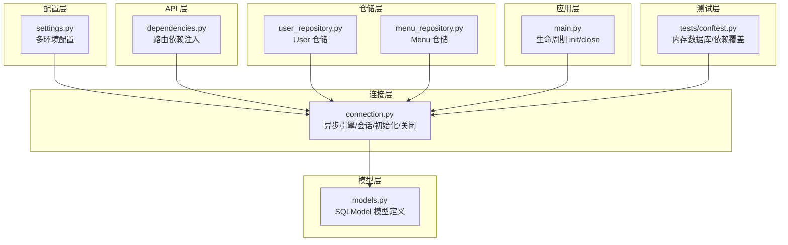
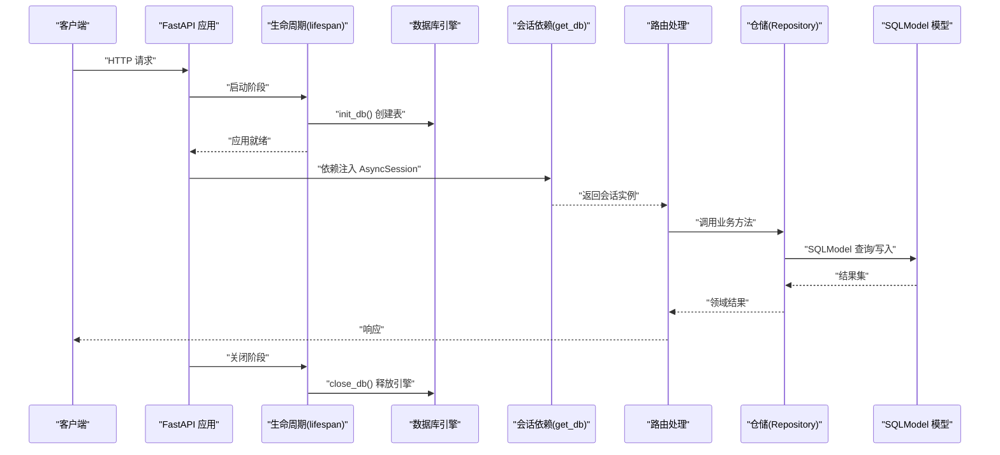
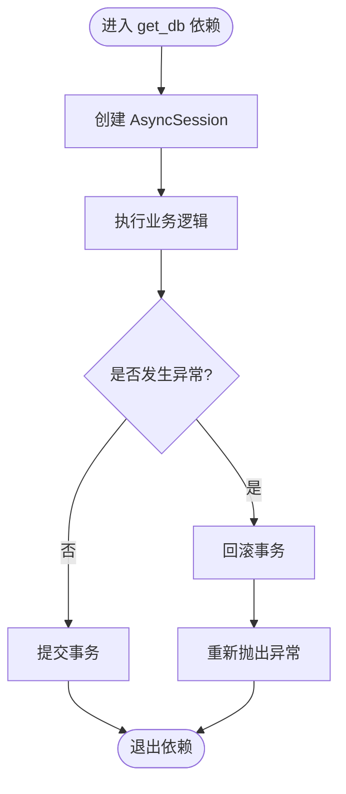
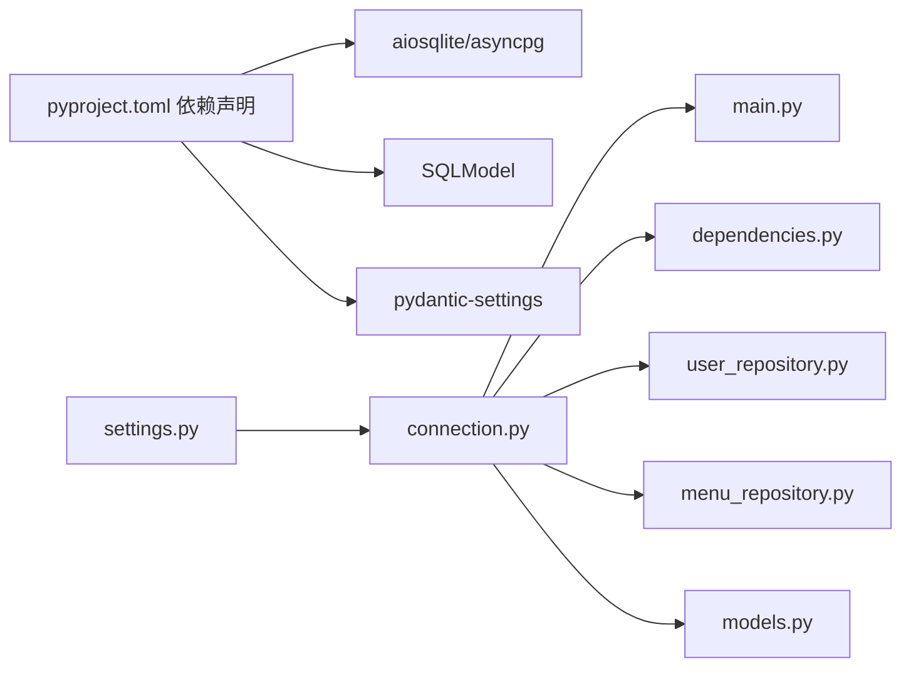

# 数据库连接管理

<cite>
**本文引用的文件**
- [service/src/infrastructure/database/connection.py](file://service/src/infrastructure/database/connection.py)
- [service/src/infrastructure/database/models.py](file://service/src/infrastructure/database/models.py)
- [service/src/config/settings.py](file://service/src/config/settings.py)
- [service/src/infrastructure/repositories/user_repository.py](file://service/src/infrastructure/repositories/user_repository.py)
- [service/src/infrastructure/repositories/menu_repository.py](file://service/src/infrastructure/repositories/menu_repository.py)
- [service/src/api/dependencies.py](file://service/src/api/dependencies.py)
- [service/src/main.py](file://service/src/main.py)
- [service/pyproject.toml](file://service/pyproject.toml)
- [service/tests/conftest.py](file://service/tests/conftest.py)
- [service/src/core/exceptions.py](file://service/src/core/exceptions.py)
</cite>

## 目录
1. [引言](#引言)
2. [项目结构](#项目结构)
3. [核心组件](#核心组件)
4. [架构总览](#架构总览)
5. [详细组件分析](#详细组件分析)
6. [依赖分析](#依赖分析)
7. [性能考虑](#性能考虑)
8. [故障排除指南](#故障排除指南)
9. [结论](#结论)
10. [附录](#附录)

## 引言
本文件聚焦于 Hello-FastApi 的数据库连接管理，系统性阐述异步数据库连接的建立与管理、连接池配置与复用策略、多环境配置差异、连接生命周期与异常处理、性能优化与监控方法、SQLAlchemy 与 SQLModel 的集成方式，以及连接超时、重连机制与连接泄漏防护等最佳实践与排障建议。内容基于实际源码进行分析，适合具备不同技术背景的读者。

## 项目结构
数据库相关能力主要分布在以下模块：
- 配置层：通过 settings 提供多环境数据库连接字符串与调试开关
- 连接层：创建异步引擎与会话依赖，提供初始化与关闭能力
- 模型层：使用 SQLModel 定义 ORM 模型
- 仓储层：面向接口的仓储实现，依赖注入的 AsyncSession
- API 层：路由依赖注入数据库会话
- 应用层：FastAPI 生命周期中执行数据库初始化与关闭
- 测试层：内存数据库与依赖覆盖，便于隔离测试

图表来源
- [service/src/config/settings.py:57-58](file://service/src/config/settings.py#L57-L58)
- [service/src/infrastructure/database/connection.py:9-21](file://service/src/infrastructure/database/connection.py#L9-L21)
- [service/src/infrastructure/database/models.py:1-193](file://service/src/infrastructure/database/models.py#L1-L193)
- [service/src/infrastructure/repositories/user_repository.py:11-16](file://service/src/infrastructure/repositories/user_repository.py#L11-L16)
- [service/src/infrastructure/repositories/menu_repository.py:10-13](file://service/src/infrastructure/repositories/menu_repository.py#L10-L13)
- [service/src/api/dependencies.py:32-34](file://service/src/api/dependencies.py#L32-L34)
- [service/src/main.py:19-32](file://service/src/main.py#L19-L32)
- [service/tests/conftest.py:16-17](file://service/tests/conftest.py#L16-L17)

章节来源
- [service/src/config/settings.py:1-198](file://service/src/config/settings.py#L1-L198)
- [service/src/infrastructure/database/connection.py:1-35](file://service/src/infrastructure/database/connection.py#L1-L35)
- [service/src/infrastructure/database/models.py:1-193](file://service/src/infrastructure/database/models.py#L1-L193)
- [service/src/infrastructure/repositories/user_repository.py:1-185](file://service/src/infrastructure/repositories/user_repository.py#L1-L185)
- [service/src/infrastructure/repositories/menu_repository.py:1-50](file://service/src/infrastructure/repositories/menu_repository.py#L1-L50)
- [service/src/api/dependencies.py:1-72](file://service/src/api/dependencies.py#L1-L72)
- [service/src/main.py:1-96](file://service/src/main.py#L1-L96)
- [service/tests/conftest.py:1-105](file://service/tests/conftest.py#L1-L105)

## 核心组件
- 异步引擎与会话依赖
  - 使用异步引擎创建连接，开启 echo 与 pool_pre_ping，保证连接有效性与调试可观测性
  - 会话依赖通过上下文管理器提供，自动提交或回滚，避免泄漏
- 初始化与关闭
  - 应用启动时创建所有表；关闭时释放引擎资源
- 多环境配置
  - 通过环境变量选择配置类，分别设置数据库 URL、日志级别与调试开关
- 仓储与依赖注入
  - 仓储接收 AsyncSession，统一在路由层注入，便于测试替换
- 异常体系
  - 自定义异常类，配合全局异常处理器，保障错误信息一致性

章节来源
- [service/src/infrastructure/database/connection.py:9-34](file://service/src/infrastructure/database/connection.py#L9-L34)
- [service/src/main.py:19-32](file://service/src/main.py#L19-L32)
- [service/src/config/settings.py:110-142](file://service/src/config/settings.py#L110-L142)
- [service/src/infrastructure/repositories/user_repository.py:11-16](file://service/src/infrastructure/repositories/user_repository.py#L11-L16)
- [service/src/api/dependencies.py:32-34](file://service/src/api/dependencies.py#L32-L34)
- [service/src/core/exceptions.py:1-60](file://service/src/core/exceptions.py#L1-L60)

## 架构总览
下图展示从 FastAPI 生命周期到数据库连接、会话依赖、仓储调用与模型交互的完整链路。

图表来源
- [service/src/main.py:19-32](file://service/src/main.py#L19-L32)
- [service/src/infrastructure/database/connection.py:23-34](file://service/src/infrastructure/database/connection.py#L23-L34)
- [service/src/api/dependencies.py:32-34](file://service/src/api/dependencies.py#L32-L34)
- [service/src/infrastructure/repositories/user_repository.py:11-16](file://service/src/infrastructure/repositories/user_repository.py#L11-L16)
- [service/src/infrastructure/database/models.py:1-193](file://service/src/infrastructure/database/models.py#L1-L193)

## 详细组件分析

### 异步数据库连接与会话管理
- 引擎创建
  - 基于配置中的数据库 URL 创建异步引擎，开启 echo 与 pool_pre_ping，提升连接健康检测与调试可见性
- 会话依赖
  - 会话依赖采用上下文管理器，确保每次请求获得独立会话；提交或回滚在退出时自动处理，避免手动管理导致的泄漏
- 初始化与关闭
  - 应用启动时执行建表；关闭时释放引擎资源，确保进程退出时无悬挂连接

图表来源
- [service/src/infrastructure/database/connection.py:12-21](file://service/src/infrastructure/database/connection.py#L12-L21)

章节来源
- [service/src/infrastructure/database/connection.py:9-34](file://service/src/infrastructure/database/connection.py#L9-L34)

### 数据库连接池配置与连接复用策略
- 连接池参数
  - 通过异步引擎参数控制连接池行为（如 echo、pool_pre_ping），提升连接可用性与可观测性
- 复用策略
  - 会话依赖按请求粒度提供，避免跨请求共享会话；连接在引擎层面复用，减少频繁创建销毁开销
- 测试场景
  - 测试使用内存数据库与独立引擎，确保测试隔离与可重复性

章节来源
- [service/src/infrastructure/database/connection.py:9-9](file://service/src/infrastructure/database/connection.py#L9-L9)
- [service/tests/conftest.py:16-19](file://service/tests/conftest.py#L16-L19)

### 不同环境下的数据库配置差异
- 环境映射
  - development/production/testing 三类配置类，分别加载不同 .env.* 文件，覆盖默认值
- 数据库 URL 差异
  - 开发默认本地 sqlite；测试覆盖为内存数据库；生产可通过环境变量注入外部数据库连接串
- 调试与日志
  - 开发与测试默认开启调试与更细的日志级别；生产默认关闭调试并提高日志级别

章节来源
- [service/src/config/settings.py:110-142](file://service/src/config/settings.py#L110-L142)
- [service/src/config/settings.py:176-183](file://service/src/config/settings.py#L176-L183)

### 数据库连接生命周期管理
- 启动阶段
  - 应用生命周期中执行建表，确保服务启动即具备所需表结构
- 运行阶段
  - 会话依赖按需提供，事务在依赖退出时自动提交或回滚
- 关闭阶段
  - 应用关闭时释放引擎，确保资源回收

章节来源
- [service/src/main.py:19-32](file://service/src/main.py#L19-L32)
- [service/src/infrastructure/database/connection.py:23-34](file://service/src/infrastructure/database/connection.py#L23-L34)

### 异常处理机制
- 会话级异常
  - 依赖退出时捕获异常并回滚，避免脏数据
- 全局异常
  - 自定义异常类与全局异常处理器，统一返回结构，便于前端消费

章节来源
- [service/src/infrastructure/database/connection.py:18-20](file://service/src/infrastructure/database/connection.py#L18-L20)
- [service/src/core/exceptions.py:1-60](file://service/src/core/exceptions.py#L1-L60)

### SQLAlchemy 与 SQLModel 的集成使用
- SQLModel 作为 ORM
  - 模型同时承担 SQLAlchemy ORM 与 Pydantic 数据模型职责，简化定义与序列化
- 异步生态
  - 使用异步引擎与异步会话，结合 SQLModel 的异步适配，实现高性能异步操作
- 依赖注入
  - 仓储通过构造函数注入 AsyncSession，实现接口与实现解耦

章节来源
- [service/src/infrastructure/database/models.py:1-6](file://service/src/infrastructure/database/models.py#L1-L6)
- [service/src/infrastructure/database/connection.py:3-5](file://service/src/infrastructure/database/connection.py#L3-L5)
- [service/src/infrastructure/repositories/user_repository.py:11-16](file://service/src/infrastructure/repositories/user_repository.py#L11-L16)

### 连接超时、重连机制与连接泄漏防护
- 连接健康检测
  - 通过 pool_pre_ping 降低连接失效带来的失败概率，提升健壮性
- 超时与重试
  - 当前实现未显式设置连接超时与重试策略；可在引擎参数中扩展（例如 pool_recycle、connect_args 等）
- 泄漏防护
  - 会话依赖使用上下文管理器；异常自动回滚；应用关闭时 dispose 引擎，双重保障

章节来源
- [service/src/infrastructure/database/connection.py:9-9](file://service/src/infrastructure/database/connection.py#L9-L9)
- [service/src/infrastructure/database/connection.py:18-20](file://service/src/infrastructure/database/connection.py#L18-L20)
- [service/src/infrastructure/database/connection.py:32-34](file://service/src/infrastructure/database/connection.py#L32-L34)

### 仓储与路由依赖
- 仓储接口
  - 领域定义了抽象接口，仓储实现依赖 AsyncSession，便于替换与测试
- 路由依赖
  - 路由通过依赖注入获取 AsyncSession，统一在 API 层完成鉴权与权限校验

章节来源
- [service/src/domain/user/repository.py:8-50](file://service/src/domain/user/repository.py#L8-L50)
- [service/src/domain/menu/repository.py:11-43](file://service/src/domain/menu/repository.py#L11-L43)
- [service/src/infrastructure/repositories/user_repository.py:11-16](file://service/src/infrastructure/repositories/user_repository.py#L11-L16)
- [service/src/infrastructure/repositories/menu_repository.py:10-13](file://service/src/infrastructure/repositories/menu_repository.py#L10-L13)
- [service/src/api/dependencies.py:32-34](file://service/src/api/dependencies.py#L32-L34)

## 依赖分析
- 外部依赖
  - 异步数据库驱动：aiosqlite、asyncpg
  - ORM：SQLModel
  - 配置：pydantic-settings
- 内部依赖
  - 配置 settings 被连接层引用
  - 连接层被应用生命周期、API 依赖与仓储共同依赖
  - 模型层被初始化流程与仓储查询使用

图表来源
- [service/pyproject.toml:7-20](file://service/pyproject.toml#L7-L20)
- [service/src/config/settings.py:57-58](file://service/src/config/settings.py#L57-L58)
- [service/src/infrastructure/database/connection.py:3-5](file://service/src/infrastructure/database/connection.py#L3-L5)
- [service/src/main.py:16-16](file://service/src/main.py#L16-L16)
- [service/src/api/dependencies.py:9-9](file://service/src/api/dependencies.py#L9-L9)
- [service/src/infrastructure/repositories/user_repository.py:4-5](file://service/src/infrastructure/repositories/user_repository.py#L4-L5)
- [service/src/infrastructure/repositories/menu_repository.py:3-4](file://service/src/infrastructure/repositories/menu_repository.py#L3-L4)
- [service/src/infrastructure/database/models.py:11-12](file://service/src/infrastructure/database/models.py#L11-L12)

章节来源
- [service/pyproject.toml:1-76](file://service/pyproject.toml#L1-L76)
- [service/src/config/settings.py:1-198](file://service/src/config/settings.py#L1-L198)
- [service/src/infrastructure/database/connection.py:1-35](file://service/src/infrastructure/database/connection.py#L1-L35)
- [service/src/api/dependencies.py:1-72](file://service/src/api/dependencies.py#L1-L72)
- [service/src/infrastructure/repositories/user_repository.py:1-185](file://service/src/infrastructure/repositories/user_repository.py#L1-L185)
- [service/src/infrastructure/repositories/menu_repository.py:1-50](file://service/src/infrastructure/repositories/menu_repository.py#L1-L50)
- [service/src/infrastructure/database/models.py:1-193](file://service/src/infrastructure/database/models.py#L1-L193)

## 性能考虑
- 连接池与预检
  - 使用 pool_pre_ping 提升连接可用性；在高并发场景可结合连接池大小与回收策略进一步优化
- 异步 I/O
  - 使用异步引擎与会话，避免阻塞，提升吞吐
- 查询优化
  - 仓储中使用 select 与分页，避免一次性加载大量数据
- 调试与观测
  - 开发环境开启 echo，有助于定位慢查询与异常；生产关闭以减少日志开销
- 测试隔离
  - 测试使用内存数据库与独立引擎，避免相互影响，提升测试稳定性

章节来源
- [service/src/infrastructure/database/connection.py:9-9](file://service/src/infrastructure/database/connection.py#L9-L9)
- [service/src/infrastructure/repositories/user_repository.py:32-75](file://service/src/infrastructure/repositories/user_repository.py#L32-L75)
- [service/tests/conftest.py:16-19](file://service/tests/conftest.py#L16-L19)

## 故障排除指南
- 连接失败
  - 检查 DATABASE_URL 是否正确；确认目标数据库可达；核对驱动安装（aiosqlite/asyncpg）
- 事务未提交或回滚
  - 确认依赖退出路径是否正常；异常是否被捕获并触发回滚
- 表结构不一致
  - 确认 init_db 是否在启动阶段执行；检查模型定义变更后是否重建表
- 资源未释放
  - 确认应用关闭阶段是否调用 close_db；确保引擎 dispose 成功
- 测试失败
  - 确认测试数据库 URL 与内存数据库配置；检查依赖覆盖是否生效

章节来源
- [service/src/config/settings.py:57-58](file://service/src/config/settings.py#L57-L58)
- [service/src/infrastructure/database/connection.py:18-20](file://service/src/infrastructure/database/connection.py#L18-L20)
- [service/src/main.py:24-25](file://service/src/main.py#L24-L25)
- [service/tests/conftest.py:54-61](file://service/tests/conftest.py#L54-L61)

## 结论
本项目采用 SQLModel + 异步引擎的组合，通过配置层的多环境支持、连接层的会话依赖与生命周期管理、仓储层的接口化设计，构建了清晰、可测试且易于维护的数据库访问层。建议在生产环境中进一步完善连接超时与重试策略，并结合监控指标持续优化连接池参数与查询性能。

## 附录
- 最佳实践清单
  - 明确区分开发/测试/生产环境的数据库配置
  - 使用会话依赖自动提交/回滚，避免手动事务管理
  - 在应用生命周期中执行建表与释放资源
  - 对关键查询添加索引与分页，避免全表扫描
  - 在开发环境开启 echo，生产关闭以降低日志开销
  - 使用测试内存数据库与依赖覆盖，确保测试隔离
- 可扩展方向
  - 引入连接池参数调优（如 pool_size、max_overflow、pool_recycle）
  - 添加连接健康检查与重试策略
  - 增加数据库监控指标（连接数、等待时间、慢查询）