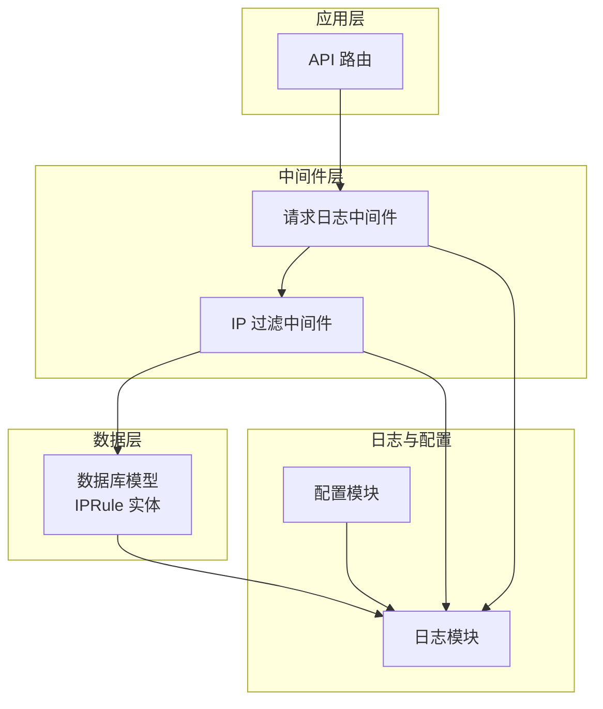
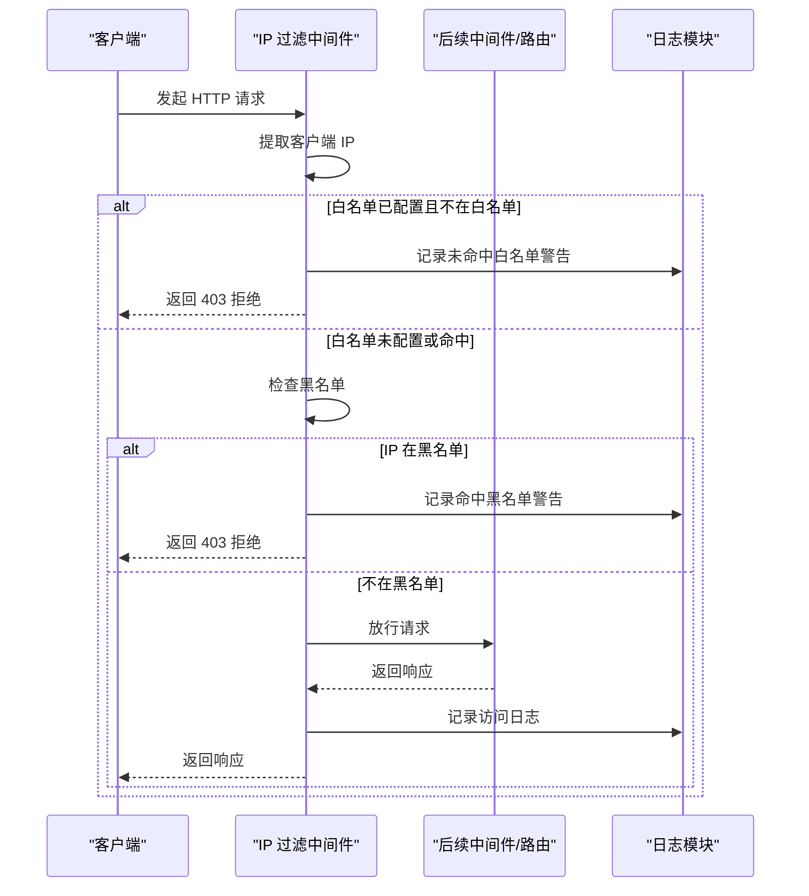
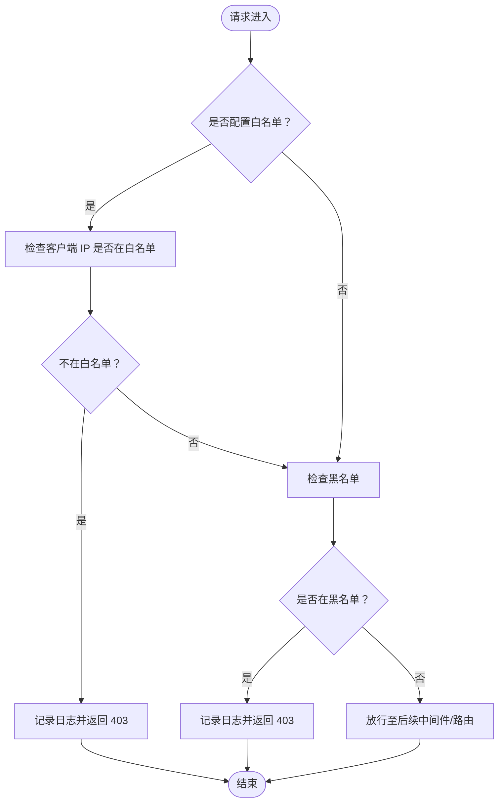
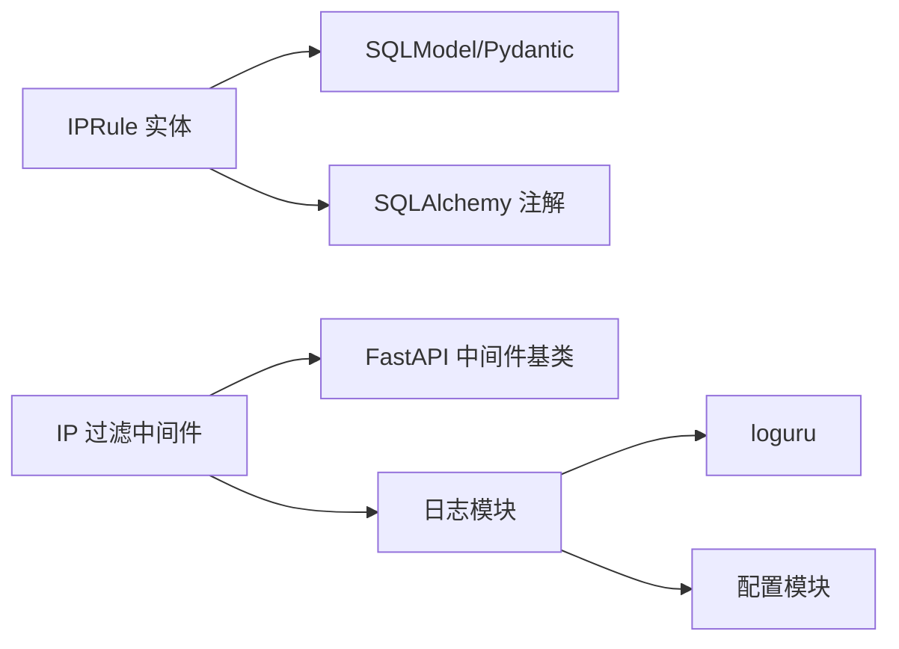

# 安全实体模型

<cite>
**本文引用的文件**
- [models.py](file://service/src/infrastructure/database/models.py)
- [middlewares.py](file://service/src/core/middlewares.py)
- [logger.py](file://service/src/core/logger.py)
- [settings.py](file://service/src/config/settings.py)
</cite>

## 目录
1. [简介](#简介)
2. [项目结构](#项目结构)
3. [核心组件](#核心组件)
4. [架构总览](#架构总览)
5. [详细组件分析](#详细组件分析)
6. [依赖分析](#依赖分析)
7. [性能考虑](#性能考虑)
8. [故障排查指南](#故障排查指南)
9. [结论](#结论)
10. [附录](#附录)

## 简介
本文件围绕服务端“安全实体模型”进行系统化说明，重点聚焦于 IPRule 实体的设计目标与安全机制，解释 IP 白名单与黑名单规则的实现原理、IP 地址格式支持与长度限制、规则类型字段与状态管理、过期时间字段的实现与自动清理思路、匹配算法与优先级处理策略，并提供 IP 规则的添加、验证与管理的使用示例，以及安全审计与日志记录的最佳实践。

## 项目结构
本项目采用分层架构，安全相关的核心位于基础设施层的数据库模型与核心层的中间件、日志模块之间形成闭环：
- 数据模型层：定义 IPRule 实体及其字段约束
- 中间件层：在请求生命周期内执行 IP 白/黑名单过滤
- 日志层：统一记录访问与安全事件
- 配置层：提供日志目录与日志级别等运行参数

图表来源
- [models.py:176-192](file://service/src/infrastructure/database/models.py#L176-L192)
- [middlewares.py:12-64](file://service/src/core/middlewares.py#L12-L64)
- [logger.py:1-117](file://service/src/core/logger.py#L1-L117)
- [settings.py:32-83](file://service/src/config/settings.py#L32-L83)

章节来源
- [models.py:176-192](file://service/src/infrastructure/database/models.py#L176-L192)
- [middlewares.py:12-64](file://service/src/core/middlewares.py#L12-L64)
- [logger.py:1-117](file://service/src/core/logger.py#L1-L117)
- [settings.py:32-83](file://service/src/config/settings.py#L32-L83)

## 核心组件
- IPRule 实体：持久化存储 IP 白/黑名单规则，包含规则标识、IP 地址、规则类型、原因、状态、创建时间与过期时间等字段。
- IPFilterMiddleware 中间件：在请求进入业务逻辑之前，基于内存集合执行白/黑名单匹配，快速拒绝不符合条件的请求。
- 日志模块：统一输出访问日志与安全事件，便于审计与排障。

章节来源
- [models.py:176-192](file://service/src/infrastructure/database/models.py#L176-L192)
- [middlewares.py:42-64](file://service/src/core/middlewares.py#L42-L64)
- [logger.py:75-85](file://service/src/core/logger.py#L75-L85)

## 架构总览
下图展示请求从进入应用到被 IP 过滤中间件拦截的关键流程，以及日志记录的触发点。

图表来源
- [middlewares.py:50-64](file://service/src/core/middlewares.py#L50-L64)
- [logger.py:75-85](file://service/src/core/logger.py#L75-L85)

## 详细组件分析

### IPRule 实体设计与字段语义
- 表名与主键
  - 表名固定为 ip_rules；主键为字符串类型，最大长度 36 字符。
- 字段定义与约束
  - ip_address：最大长度 45 字符，建立索引，用于高效匹配；该长度足以容纳 IPv6 的完整表示。
  - rule_type：最大长度 10 字符，取值限定为“whitelist”或“blacklist”，用于区分规则类别。
  - reason：可空，最大长度 255 字符，用于记录规则生效的原因或备注。
  - is_active：布尔类型，默认启用，用于临时停用某条规则而无需删除。
  - created_at：自动记录创建时间，带时区信息。
  - expires_at：可空，带时区，用于设置规则有效期；到期后建议通过外部机制清理或在查询侧忽略。
- 设计目的
  - 将 IP 白/黑名单规则持久化，配合中间件实现运行时的快速访问控制。
  - 通过 reason 字段提升可审计性，通过 is_active 与 expires_at 提供灵活的运维能力。

章节来源
- [models.py:176-192](file://service/src/infrastructure/database/models.py#L176-L192)

### IP 地址格式支持与长度限制
- IPv4/IPv6 兼容
  - ip_address 最大长度为 45 字符，满足 IPv6 完整表示需求（例如扩展形式的 IPv6）。
  - 中间件在运行时直接进行字符串匹配，不强制解析为特定族，因此可接受标准 IPv4 与 IPv6 表达式。
- 长度限制
  - 字段长度上限与数据库索引结合，确保查询性能与存储一致性。

章节来源
- [models.py:182](file://service/src/infrastructure/database/models.py#L182)
- [middlewares.py:50-64](file://service/src/core/middlewares.py#L50-L64)

### 规则类型字段与状态管理
- rule_type
  - 取值为“whitelist”或“blacklist”，用于明确规则用途。
- is_active
  - 默认启用，可在不删除规则的前提下临时禁用，便于灰度或应急处理。
- 与中间件的关系
  - 中间件内部维护 whitelist 与 blacklist 两套集合，分别对应规则类型；is_active 字段未在中间件中直接使用，建议在加载规则时仅纳入 is_active=True 的规则。

章节来源
- [models.py:183](file://service/src/infrastructure/database/models.py#L183)
- [models.py:185](file://service/src/infrastructure/database/models.py#L185)
- [middlewares.py:45-48](file://service/src/core/middlewares.py#L45-L48)

### 过期时间字段与自动清理机制
- expires_at 字段
  - 类型为可空日期时间，带时区；用于标记规则的有效截止时间。
- 自动清理建议
  - 查询侧：在读取规则时过滤掉已过期记录（即 expires_at 小于当前时间）。
  - 定时任务：可定期扫描并删除过期记录，或将其标记为失效而非物理删除，以便审计。
  - 中间件侧：若规则来源于数据库，应在加载阶段剔除过期项，避免占用内存集合。
- 与 is_active 的协作
  - 若规则同时满足 is_active=False 且 expires_at 已过期，建议优先以 is_active 为准进行过滤，保证运维可控性。

章节来源
- [models.py:189](file://service/src/infrastructure/database/models.py#L189)
- [middlewares.py:50-64](file://service/src/core/middlewares.py#L50-L64)

### 匹配算法与优先级处理
- 匹配顺序
  1) 若配置了白名单，则仅允许白名单中的 IP 访问；不在白名单内的请求直接拒绝。
  2) 在白名单放行或未配置白名单的前提下，检查黑名单；命中黑名单的请求直接拒绝。
  3) 若既未命中白名单也未命中黑名单，则放行至后续中间件或路由。
- 优先级
  - 白名单优先于黑名单：白名单的存在意味着仅允许白名单内的来源访问，黑名单仅作为兜底阻断。
- 复杂度
  - 白名单/黑名单集合均为哈希集合，匹配复杂度为 O(1)，整体中间件处理为 O(1)。

图表来源
- [middlewares.py:50-64](file://service/src/core/middlewares.py#L50-L64)

章节来源
- [middlewares.py:50-64](file://service/src/core/middlewares.py#L50-L64)

### 安全规则的添加、验证与管理（使用示例）
以下为在业务流程中添加与管理 IP 规则的典型步骤（以路径引用代替具体代码）：
- 新增规则
  - 通过数据访问层将 IPRule 对象写入数据库，设置 rule_type 为“whitelist”或“blacklist”，填写 ip_address 与可选 reason。
  - 示例参考：[models.py:176-192](file://service/src/infrastructure/database/models.py#L176-L192)
- 启用/停用规则
  - 修改 is_active 字段为 True/False，实现临时禁用而不删除规则。
  - 示例参考：[models.py:185](file://service/src/infrastructure/database/models.py#L185)
- 设置有效期
  - 填写 expires_at 字段以设定规则有效期；到期后建议清理或在查询侧忽略。
  - 示例参考：[models.py:189](file://service/src/infrastructure/database/models.py#L189)
- 加载与应用
  - 启动或定时刷新时，从数据库读取 is_active=True 且未过期的规则，构建内存集合（白名单/黑名单），注入到 IP 过滤中间件。
  - 示例参考：[middlewares.py:45-48](file://service/src/core/middlewares.py#L45-L48)
- 验证与测试
  - 使用不同 IP 地址发起请求，验证白/黑名单行为与日志记录是否符合预期。
  - 示例参考：[middlewares.py:50-64](file://service/src/core/middlewares.py#L50-L64)

章节来源
- [models.py:176-192](file://service/src/infrastructure/database/models.py#L176-L192)
- [models.py:185](file://service/src/infrastructure/database/models.py#L185)
- [models.py:189](file://service/src/infrastructure/database/models.py#L189)
- [middlewares.py:45-48](file://service/src/core/middlewares.py#L45-L48)
- [middlewares.py:50-64](file://service/src/core/middlewares.py#L50-L64)

### 安全审计与日志记录最佳实践
- 访问日志
  - 使用统一日志模块记录每次请求的客户端 IP、方法、路径、状态码与耗时，便于追踪异常访问。
  - 示例参考：[logger.py:75-85](file://service/src/core/logger.py#L75-L85)
- 安全日志
  - 在 IP 过滤中间件命中白/黑名单时记录警告日志，包含被拒绝的 IP 与原因，便于审计与溯源。
  - 示例参考：[middlewares.py:55](file://service/src/core/middlewares.py#L55-L61)
- 日志落盘与轮转
  - 配置日志目录与轮转策略，确保长期运行下的日志可维护性。
  - 示例参考：[settings.py:32-83](file://service/src/config/settings.py#L32-L83)
- 日志级别与环境
  - 开发环境可提高日志级别以辅助调试；生产环境建议降低噪声，保留关键安全事件。
  - 示例参考：[settings.py:82-92](file://service/src/config/settings.py#L82-L92)

章节来源
- [logger.py:75-85](file://service/src/core/logger.py#L75-L85)
- [middlewares.py:55-61](file://service/src/core/middlewares.py#L55-L61)
- [settings.py:32-83](file://service/src/config/settings.py#L32-L83)
- [settings.py:82-92](file://service/src/config/settings.py#L82-L92)

## 依赖分析
- IPRule 实体依赖 SQLModel 与 SQLAlchemy 注解，具备 ORM 与 Pydantic 数据校验能力。
- IPFilterMiddleware 依赖 FastAPI 的 BaseHTTPMiddleware 与日志模块，实现请求拦截与审计。
- 日志模块依赖 loguru 并结合配置模块提供的日志目录与级别。

图表来源
- [models.py:176-192](file://service/src/infrastructure/database/models.py#L176-L192)
- [middlewares.py:42-64](file://service/src/core/middlewares.py#L42-L64)
- [logger.py:1-117](file://service/src/core/logger.py#L1-L117)
- [settings.py:32-83](file://service/src/config/settings.py#L32-L83)

章节来源
- [models.py:176-192](file://service/src/infrastructure/database/models.py#L176-L192)
- [middlewares.py:42-64](file://service/src/core/middlewares.py#L42-L64)
- [logger.py:1-117](file://service/src/core/logger.py#L1-L117)
- [settings.py:32-83](file://service/src/config/settings.py#L32-L83)

## 性能考虑
- 中间件匹配为 O(1) 哈希查找，适合高并发场景。
- ip_address 建有索引，查询效率高；建议在大规模规则集下定期统计索引使用情况。
- 日志写入采用异步队列（enqueue=True），避免阻塞请求处理。
- 建议将规则加载与缓存结合，减少频繁数据库访问；可通过定时任务或变更通知更新内存集合。

## 故障排查指南
- 常见问题
  - 白名单未生效：确认中间件是否正确注入 whitelist 集合，且 is_active=True。
  - 黑名单误杀：检查 ip_address 是否与客户端实际 IP 完全一致（含端口影响需注意）。
  - 规则未过期：确认查询侧是否过滤 expires_at 已过期的规则。
- 审计与定位
  - 查看访问日志与安全日志，定位被拒绝的请求来源与时间。
  - 结合日志级别与环境配置，调整日志输出以辅助诊断。

章节来源
- [middlewares.py:50-64](file://service/src/core/middlewares.py#L50-L64)
- [logger.py:75-85](file://service/src/core/logger.py#L75-L85)
- [settings.py:82-92](file://service/src/config/settings.py#L82-L92)

## 结论
IPRule 实体提供了简洁而强大的 IP 白/黑名单持久化能力，配合 IPFilterMiddleware 的 O(1) 匹配与统一日志体系，能够有效支撑高并发场景下的访问控制与安全审计。通过合理利用 is_active 与 expires_at 字段，结合查询侧过滤与定时清理策略，可实现灵活、可审计、可维护的安全规则管理体系。

## 附录
- 字段一览（与实现对应）
  - id：主键，字符串，最大长度 36
  - ip_address：字符串，最大长度 45，带索引
  - rule_type：字符串，最大长度 10，取值“whitelist”或“blacklist”
  - reason：字符串，最大长度 255，可空
  - is_active：布尔，默认 True
  - created_at：日期时间，带时区，服务器默认值
  - expires_at：日期时间，带时区，可空

章节来源
- [models.py:181-189](file://service/src/infrastructure/database/models.py#L181-L189)