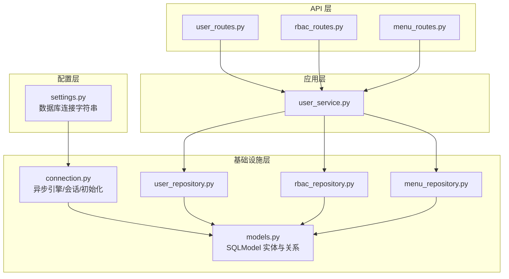
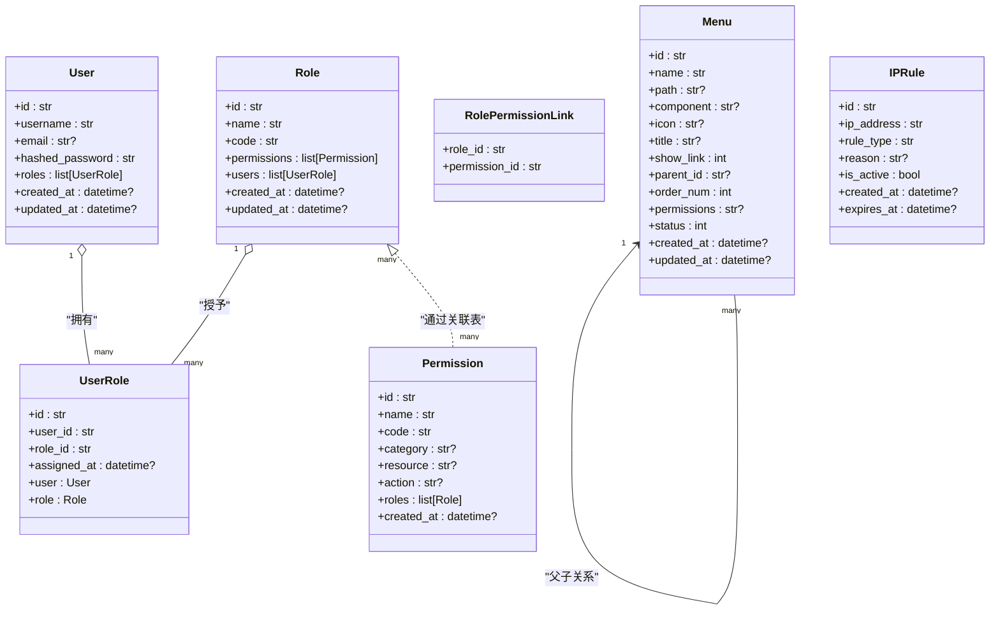
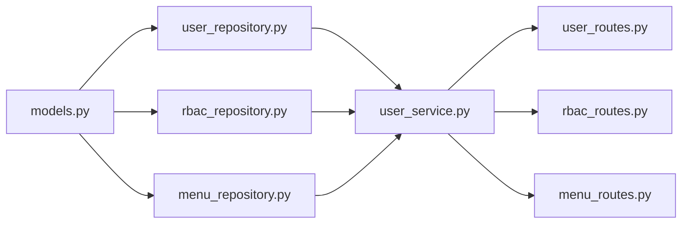

# 数据模型设计

<cite>
**本文引用的文件**
- [models.py](file://service/src/infrastructure/database/models.py)
- [connection.py](file://service/src/infrastructure/database/connection.py)
- [settings.py](file://service/src/config/settings.py)
- [user_repository.py](file://service/src/infrastructure/repositories/user_repository.py)
- [rbac_repository.py](file://service/src/infrastructure/repositories/rbac_repository.py)
- [menu_repository.py](file://service/src/infrastructure/repositories/menu_repository.py)
- [user_service.py](file://service/src/application/services/user_service.py)
- [rbac_routes.py](file://service/src/api/v1/rbac_routes.py)
- [user_routes.py](file://service/src/api/v1/user_routes.py)
- [menu_routes.py](file://service/src/api/v1/menu_routes.py)
- [middlewares.py](file://service/src/core/middlewares.py)
</cite>

## 目录
1. [简介](#简介)
2. [项目结构](#项目结构)
3. [核心组件](#核心组件)
4. [架构总览](#架构总览)
5. [详细组件分析](#详细组件分析)
6. [依赖分析](#依赖分析)
7. [性能考量](#性能考量)
8. [故障排查指南](#故障排查指南)
9. [结论](#结论)
10. [附录](#附录)

## 简介
本文件系统化梳理 Hello-FastApi 项目的 SQLModel ORM 数据模型设计，围绕用户(User)、角色(Role)、权限(Permission)、菜单(Menu)、IP规则(IPRule)等核心实体，解释字段类型、约束与索引策略，说明 UUID 主键生成与时间戳自动管理，阐述关系映射（一对一、一对多、多对多），并结合仓储与服务层展示懒加载策略与性能优化实践。文末提供使用示例与最佳实践建议。

## 项目结构
数据模型位于基础设施层的数据库模块，通过异步 SQLModel 会话与 FastAPI 路由配合，贯穿领域服务与应用服务层完成业务闭环。

图表来源
- [settings.py:58](file://service/src/config/settings.py#L58)
- [connection.py:9](file://service/src/infrastructure/database/connection.py#L9)
- [models.py:31](file://service/src/infrastructure/database/models.py#L31)
- [user_repository.py:11](file://service/src/infrastructure/repositories/user_repository.py#L11)
- [rbac_repository.py:11](file://service/src/infrastructure/repositories/rbac_repository.py#L11)
- [menu_repository.py:10](file://service/src/infrastructure/repositories/menu_repository.py#L10)
- [user_service.py:18](file://service/src/application/services/user_service.py#L18)
- [user_routes.py:27](file://service/src/api/v1/user_routes.py#L27)
- [rbac_routes.py:33](file://service/src/api/v1/rbac_routes.py#L33)
- [menu_routes.py:19](file://service/src/api/v1/menu_routes.py#L19)

章节来源
- [models.py:1-193](file://service/src/infrastructure/database/models.py#L1-L193)
- [connection.py:1-35](file://service/src/infrastructure/database/connection.py#L1-L35)
- [settings.py:57-59](file://service/src/config/settings.py#L57-L59)

## 核心组件
- 用户(User)：主键 UUID，唯一用户名与可空唯一邮箱，带状态、性别、部门、备注、超级用户标记及时间戳。
- 角色(Role)：主键 UUID，唯一名称与唯一编码，状态与时间戳；与权限为多对多，与用户为多对多。
- 权限(Permission)：主键 UUID，唯一编码，分类、资源、动作、描述，状态与时间戳；与角色为多对多。
- 用户-角色(UserRole)：关联表，记录用户与角色的分配时间。
- 菜单(Menu)：主键 UUID，层级父子关系（自引用外键），排序号、权限编码串、状态与时间戳。
- IP规则(IPRule)：主键 UUID，IP 地址索引，黑白名单类型、原因、有效期与时间戳。

章节来源
- [models.py:31-192](file://service/src/infrastructure/database/models.py#L31-L192)

## 架构总览
SQLModel 模型同时承担 ORM 与 Pydantic 数据校验职责，仓储层以异步 SQLModel 查询封装 CRUD 与复杂关联查询，服务层编排业务流程，API 路由负责鉴权与参数绑定。

图表来源
- [models.py:31-192](file://service/src/infrastructure/database/models.py#L31-L192)

## 详细组件分析

### 用户(User)模型
- 主键与标识
  - 使用 UUID 字符串作为主键，长度限制为 36；默认工厂函数生成。
- 字段与约束
  - username 唯一且建立索引；email 可空但唯一；其他如昵称、头像、手机号、性别、备注等均为可空。
  - 状态字段用于启用/禁用控制；超级用户标记用于特殊权限判定。
- 时间戳
  - created_at 与 updated_at 通过 server_default 与 onupdate 自动维护。
- 关系
  - 与 UserRole 为一对多（back_populates），采用 selectin 懒加载策略，减少 N+1 查询风险。
- 实体方法
  - is_active 属性基于 status 字段兼容判断。

章节来源
- [models.py:31-65](file://service/src/infrastructure/database/models.py#L31-L65)

### 角色(Role)模型
- 主键与标识
  - UUID 主键，长度限制 36。
- 字段与约束
  - name 唯一且索引；code 唯一；状态与时间戳同上。
- 关系
  - 与 Permission 为多对多（link_model=RolePermissionLink），与 User 为多对多（UserRole）。
  - 懒加载策略统一为 selectin。
- 实体方法
  - 无额外方法，便于直接序列化与权限计算。

章节来源
- [models.py:70-95](file://service/src/infrastructure/database/models.py#L70-L95)

### 权限(Permission)模型
- 主键与标识
  - UUID 主键，长度限制 36。
- 字段与约束
  - code 唯一且索引；category、resource、action 为可空；描述使用 Text 类型；状态与时间戳。
- 关系
  - 与 Role 为多对多（link_model=RolePermissionLink），懒加载策略 selectin。
- 实体方法
  - 无额外方法。

章节来源
- [models.py:97-121](file://service/src/infrastructure/database/models.py#L97-L121)

### 用户-角色(UserRole)关联模型
- 表结构
  - 主键 UUID；user_id 与 role_id 外键，均不可空；assigned_at 记录分配时间。
- 关系
  - 与 User、Role 双向 back_populates，形成“一对一”级联关系（单条分配记录）。
- 使用场景
  - 为用户分配角色、移除角色、查询用户角色集合。

章节来源
- [models.py:123-141](file://service/src/infrastructure/database/models.py#L123-L141)

### 角色-权限(RolePermissionLink)关联模型
- 表结构
  - 复合主键（role_id, permission_id），均外键且删除策略 CASCADE。
- 使用场景
  - 角色权限的多对多映射，支持快速查询与批量替换。

章节来源
- [models.py:17-26](file://service/src/infrastructure/database/models.py#L17-L26)

### 菜单(Menu)模型
- 主键与标识
  - UUID 主键，长度限制 36。
- 字段与约束
  - 名称必填；path、component、icon、title 可空；show_link 控制显示；parent_id 自引用外键；order_num 排序；permissions 存储权限编码串；状态与时间戳。
- 关系
  - 无显式关系属性，通过查询层按 parent_id 与 order_num 组织层级。
- 使用场景
  - 菜单树构建、用户可见菜单过滤。

章节来源
- [models.py:146-171](file://service/src/infrastructure/database/models.py#L146-L171)

### IP规则(IPRule)模型
- 主键与标识
  - UUID 主键，长度限制 36。
- 字段与约束
  - ip_address 建立索引；rule_type 限定范围；reason 可空；is_active 控制生效；expires_at 可空。
- 使用场景
  - 安全中间件的黑白名单过滤。

章节来源
- [models.py:176-192](file://service/src/infrastructure/database/models.py#L176-L192)

### 关系映射与懒加载策略
- User.roles：一对多，Relationship(back_populates="user", sa_relationship_kwargs={"lazy": "selectin"})，避免 N+1。
- Role.permissions：多对多，link_model=RolePermissionLink，Relationship(..., sa_relationship_kwargs={"lazy": "selectin"})。
- Role.users：一对多，Relationship(back_populates="role", sa_relationship_kwargs={"lazy": "selectin"})。
- Permission.roles：多对多，link_model=RolePermissionLink，Relationship(..., sa_relationship_kwargs={"lazy": "selectin"})。
- UserRole.user/role：一对一 back_populates，确保单条分配记录的导航。

章节来源
- [models.py:56](file://service/src/infrastructure/database/models.py#L56)
- [models.py:88-91](file://service/src/infrastructure/database/models.py#L88-L91)
- [models.py:115-117](file://service/src/infrastructure/database/models.py#L115-L117)
- [models.py:136-137](file://service/src/infrastructure/database/models.py#L136-L137)

### 字段类型、约束与索引策略
- 主键
  - 所有实体主键为字符串型 UUID，长度 36，default_factory=lambda: str(uuid.uuid4())。
- 字段类型
  - 字符串类字段普遍使用 Field(max_length=...) 与可空类型提示；部分文本使用 Text。
- 约束
  - username 唯一且索引；email 唯一且索引（可空）；role.code 唯一；permission.code 唯一且索引；menu.parent_id 外键自引用。
- 索引
  - email、username、permission.code、ip_address 建立索引；role.name 建立索引。
- 时间戳
  - created_at 使用 server_default=func.now()；updated_at 使用 server_default/onupdate=func.now()。

章节来源
- [models.py:36-53](file://service/src/infrastructure/database/models.py#L36-L53)
- [models.py:75-85](file://service/src/infrastructure/database/models.py#L75-L85)
- [models.py:102-112](file://service/src/infrastructure/database/models.py#L102-L112)
- [models.py:182](file://service/src/infrastructure/database/models.py#L182)

### 数据库连接与初始化
- 引擎与会话
  - 使用 create_async_engine(settings.DATABASE_URL)，开启 pool_pre_ping；get_db 提供异步会话依赖，commit/rollback 自动处理。
- 初始化
  - init_db 导入模型并调用 SQLModel.metadata.create_all 创建所有表。

章节来源
- [connection.py:9](file://service/src/infrastructure/database/connection.py#L9)
- [connection.py:23-29](file://service/src/infrastructure/database/connection.py#L23-L29)
- [settings.py:58](file://service/src/config/settings.py#L58)

### 实体使用示例与最佳实践
- 创建用户（映射 DTO 到实体）
  - 示例路径：[user_service.py:44-56](file://service/src/application/services/user_service.py#L44-L56)
  - 最佳实践：先检查唯一性（用户名/邮箱），再构造 User 实体并持久化。
- 获取用户详情（含角色与权限）
  - 示例路径：[user_service.py:71-74](file://service/src/application/services/user_service.py#L71-L74)
  - 最佳实践：服务层将 User 实体转换为响应 DTO，并聚合用户角色与权限编码列表。
- 角色权限分配（多对多）
  - 示例路径：[rbac_repository.py:84-96](file://service/src/infrastructure/repositories/rbac_repository.py#L84-L96)
  - 最佳实践：先清理旧关联，再插入新关联，保证幂等。
- 用户菜单树获取
  - 示例路径：[menu_routes.py:25](file://service/src/api/v1/menu_routes.py#L25)
  - 最佳实践：按 order_num 排序，递归构建层级结构。

章节来源
- [user_service.py:25-57](file://service/src/application/services/user_service.py#L25-L57)
- [rbac_repository.py:84-96](file://service/src/infrastructure/repositories/rbac_repository.py#L84-L96)
- [menu_routes.py:19-26](file://service/src/api/v1/menu_routes.py#L19-L26)

## 依赖分析
- 模型依赖
  - models.py 仅依赖 SQLModel 与 SQLAlchemy 的 Column/func，未引入应用层依赖。
- 仓储依赖
  - user_repository.py、rbac_repository.py、menu_repository.py 依赖 models.py 与 SQLModel 查询语法。
- 服务依赖
  - user_service.py 依赖仓储与密码服务，不直接操作数据库。
- API 依赖
  - 路由层依赖服务层与依赖注入的 get_db 会话。

图表来源
- [models.py:31-192](file://service/src/infrastructure/database/models.py#L31-L192)
- [user_repository.py:11](file://service/src/infrastructure/repositories/user_repository.py#L11)
- [rbac_repository.py:11](file://service/src/infrastructure/repositories/rbac_repository.py#L11)
- [menu_repository.py:10](file://service/src/infrastructure/repositories/menu_repository.py#L10)
- [user_service.py:18](file://service/src/application/services/user_service.py#L18)
- [user_routes.py:27](file://service/src/api/v1/user_routes.py#L27)
- [rbac_routes.py:33](file://service/src/api/v1/rbac_routes.py#L33)
- [menu_routes.py:19](file://service/src/api/v1/menu_routes.py#L19)

## 性能考量
- 懒加载策略
  - 所有关联均采用 Relationship(..., sa_relationship_kwargs={"lazy": "selectin"})，在需要时一次性加载，降低 N+1 查询开销。
- 索引策略
  - 对高频查询字段（username、email、permission.code、ip_address）建立索引，提升查询效率。
- 时间戳管理
  - 通过 server_default/onupdate 减少应用层写入负担，保持一致性。
- 批量操作
  - 仓储层提供批量删除与权限分配，减少多次往返数据库的开销。
- 中间件过滤
  - IPFilterMiddleware 在进入业务逻辑前进行快速拒绝，降低数据库压力。

章节来源
- [models.py:56](file://service/src/infrastructure/database/models.py#L56)
- [models.py:88-91](file://service/src/infrastructure/database/models.py#L88-L91)
- [models.py:115-117](file://service/src/infrastructure/database/models.py#L115-L117)
- [middlewares.py:50-64](file://service/src/core/middlewares.py#L50-L64)

## 故障排查指南
- 连接与初始化
  - 若表未创建，确认 init_db 已执行且导入 models.py；检查 DATABASE_URL 与环境变量。
  - 参考：[connection.py:23-29](file://service/src/infrastructure/database/connection.py#L23-L29)，[settings.py:58](file://service/src/config/settings.py#L58)
- 唯一性冲突
  - 用户名/邮箱或角色/权限编码重复会导致异常；服务层应捕获并返回友好错误。
  - 参考：[user_service.py:38-41](file://service/src/application/services/user_service.py#L38-L41)
- 关联查询为空
  - 确认 UserRole 与 RolePermissionLink 中是否存在有效记录；必要时检查外键约束与删除策略。
  - 参考：[rbac_repository.py:107-133](file://service/src/infrastructure/repositories/rbac_repository.py#L107-L133)
- IP 访问被拒绝
  - 检查中间件的白/黑名单配置与客户端真实 IP；确认 IPRule 有效性与过期时间。
  - 参考：[middlewares.py:50-64](file://service/src/core/middlewares.py#L50-L64)，[models.py:182](file://service/src/infrastructure/database/models.py#L182)

章节来源
- [connection.py:23-29](file://service/src/infrastructure/database/connection.py#L23-L29)
- [settings.py:58](file://service/src/config/settings.py#L58)
- [user_service.py:38-41](file://service/src/application/services/user_service.py#L38-L41)
- [rbac_repository.py:107-133](file://service/src/infrastructure/repositories/rbac_repository.py#L107-L133)
- [middlewares.py:50-64](file://service/src/core/middlewares.py#L50-L64)
- [models.py:182](file://service/src/infrastructure/database/models.py#L182)

## 结论
该数据模型以 SQLModel 为核心，结合异步会话与仓储模式，实现了清晰的领域分层与良好的扩展性。UUID 主键与索引策略保障了高并发下的稳定性，selectin 懒加载有效缓解 N+1 问题。RBAC 与菜单体系通过关联表与查询层协同，满足权限控制与前端路由需求。IP 规则模型与中间件配合，提供了基础的安全访问控制能力。建议在后续迭代中持续关注查询性能与缓存策略，以进一步提升系统吞吐量。

## 附录
- API 使用示例（参考路径）
  - 用户列表与详情：[user_routes.py:27-114](file://service/src/api/v1/user_routes.py#L27-L114)
  - 角色与权限管理：[rbac_routes.py:33-176](file://service/src/api/v1/rbac_routes.py#L33-L176)
  - 菜单树与用户菜单：[menu_routes.py:19-36](file://service/src/api/v1/menu_routes.py#L19-L36)
- 仓储实现参考
  - 用户仓储：[user_repository.py:17-184](file://service/src/infrastructure/repositories/user_repository.py#L17-L184)
  - RBAC 仓储：[rbac_repository.py:84-212](file://service/src/infrastructure/repositories/rbac_repository.py#L84-L212)
  - 菜单仓储：[menu_repository.py:13-49](file://service/src/infrastructure/repositories/menu_repository.py#L13-L49)