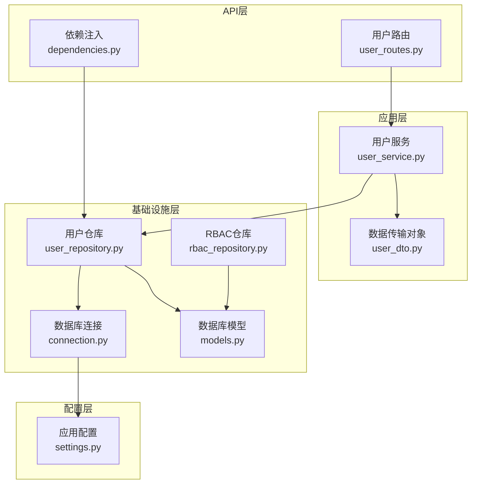
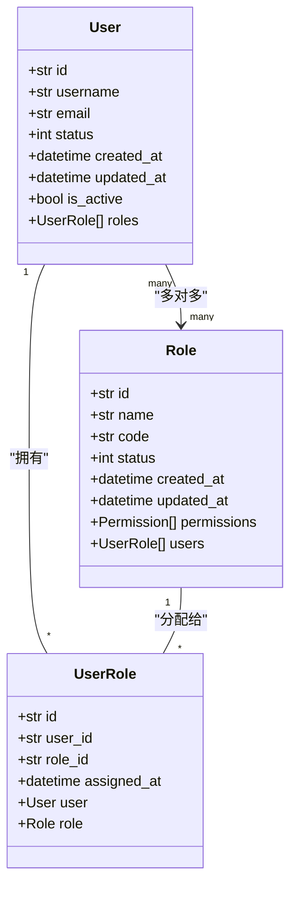
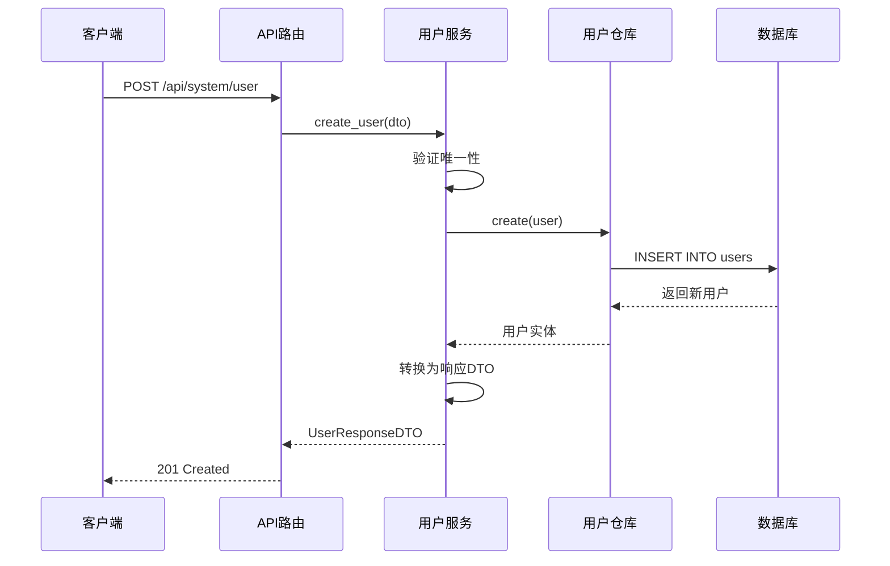
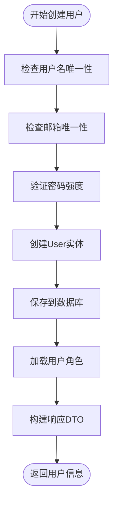
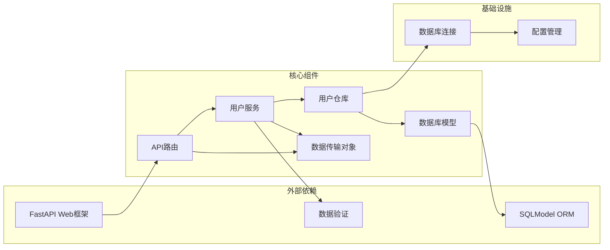

# 用户实体模型

<cite>
**本文引用的文件**
- [models.py](file://service/src/infrastructure/database/models.py)
- [user_dto.py](file://service/src/application/dto/user_dto.py)
- [user_service.py](file://service/src/application/services/user_service.py)
- [user_repository.py](file://service/src/infrastructure/repositories/user_repository.py)
- [user_routes.py](file://service/src/api/v1/user_routes.py)
- [dependencies.py](file://service/src/api/dependencies.py)
- [connection.py](file://service/src/infrastructure/database/connection.py)
- [settings.py](file://service/src/config/settings.py)
- [rbac_repository.py](file://service/src/infrastructure/repositories/rbac_repository.py)
</cite>

## 目录
1. [简介](#简介)
2. [项目结构](#项目结构)
3. [核心组件](#核心组件)
4. [架构概览](#架构概览)
5. [详细组件分析](#详细组件分析)
6. [依赖分析](#依赖分析)
7. [性能考虑](#性能考虑)
8. [故障排除指南](#故障排除指南)
9. [结论](#结论)

## 简介

本文档详细介绍了用户实体模型的设计与实现，涵盖字段定义、数据类型、约束条件、主键生成机制、唯一性约束、索引策略、状态字段含义、角色关系映射、懒加载策略、属性实现原理以及完整的CRUD操作示例。该系统采用SQLModel作为ORM框架，实现了基于领域驱动设计（DDD）的分层架构，支持异步数据库操作和RBAC权限控制。

## 项目结构

用户实体模型位于服务端项目的基础设施层，采用分层架构设计：

**图表来源**
- [user_routes.py:1-252](file://service/src/api/v1/user_routes.py#L1-L252)
- [user_service.py:1-322](file://service/src/application/services/user_service.py#L1-L322)
- [user_repository.py:1-185](file://service/src/infrastructure/repositories/user_repository.py#L1-L185)
- [models.py:1-193](file://service/src/infrastructure/database/models.py#L1-L193)

**章节来源**
- [user_routes.py:1-252](file://service/src/api/v1/user_routes.py#L1-L252)
- [user_service.py:1-322](file://service/src/application/services/user_service.py#L1-L322)
- [user_repository.py:1-185](file://service/src/infrastructure/repositories/user_repository.py#L1-L185)
- [models.py:1-193](file://service/src/infrastructure/database/models.py#L1-L193)

## 核心组件

### 用户实体模型

用户实体是系统的核心业务对象，采用SQLModel框架实现，具有以下关键特性：

#### 主键生成机制
- 使用UUID作为主键，长度为36字符
- 自动生成唯一标识符，确保分布式环境下的安全性
- 支持字符串类型存储，便于前端处理

#### 字段定义与约束

| 字段名 | 类型 | 约束 | 描述 |
|--------|------|------|------|
| id | str | 主键, UUID | 用户唯一标识符 |
| username | str | 非空, 唯一, 索引 | 用户名，最大50字符 |
| email | str | 可选, 唯一, 索引 | 邮箱地址 |
| hashed_password | str | 非空 | 加密后的密码 |
| nickname | str | 可选 | 昵称，最大64字符 |
| avatar | str | 可选 | 头像URL，最大500字符 |
| phone | str | 可选 | 手机号，最大20字符 |
| sex | int | 可选 | 性别(0-男, 1-女) |
| status | int | 非空，默认1 | 用户状态(0-禁用, 1-启用) |
| dept_id | int | 可选 | 部门ID |
| remark | str | 可选 | 备注，最大500字符 |
| is_superuser | bool | 非空，默认False | 超级用户标志 |
| created_at | datetime | 可选 | 创建时间，服务器默认值 |
| updated_at | datetime | 可选 | 更新时间，服务器默认值 |

#### 状态字段详解
- **status字段**：整数值表示用户状态
  - 0：禁用状态，用户无法登录
  - 1：启用状态，用户正常可用
- **默认值**：创建用户时默认启用状态
- **is_active属性**：通过计算属性实现，当status=1时返回True

#### 时间戳管理
- **created_at**：记录创建时间，使用服务器默认值
- **updated_at**：记录最后更新时间，支持自动更新
- 两者均使用DateTime类型，支持时区

**章节来源**
- [models.py:31-65](file://service/src/infrastructure/database/models.py#L31-L65)

### 角色关系映射

用户实体与角色之间采用多对多关系映射，通过UserRole关联表实现：

**图表来源**
- [models.py:123-141](file://service/src/infrastructure/database/models.py#L123-L141)
- [models.py:31-65](file://service/src/infrastructure/database/models.py#L31-L65)
- [models.py:70-95](file://service/src/infrastructure/database/models.py#L70-L95)

**章节来源**
- [models.py:123-141](file://service/src/infrastructure/database/models.py#L123-L141)
- [models.py:31-65](file://service/src/infrastructure/database/models.py#L31-L65)

### 懒加载策略

系统采用selectin策略实现懒加载，优化N+1查询问题：

- **User.roles**：使用selectin策略，一次性加载所有关联角色
- **Role.permissions**：使用selectin策略，批量加载权限集合
- **Role.users**：使用selectin策略，批量加载用户集合

这种策略在保证延迟加载的同时，避免了多次数据库查询，提高了性能。

**章节来源**
- [models.py:56](file://service/src/infrastructure/database/models.py#L56)
- [models.py:88](file://service/src/infrastructure/database/models.py#L88)
- [models.py:91](file://service/src/infrastructure/database/models.py#L91)

## 架构概览

用户实体模型遵循DDD分层架构，各层职责明确：

**图表来源**
- [user_routes.py:54-74](file://service/src/api/v1/user_routes.py#L54-L74)
- [user_service.py:25-58](file://service/src/application/services/user_service.py#L25-L58)
- [user_repository.py:114-119](file://service/src/infrastructure/repositories/user_repository.py#L114-L119)

**章节来源**
- [user_routes.py:54-74](file://service/src/api/v1/user_routes.py#L54-L74)
- [user_service.py:25-58](file://service/src/application/services/user_service.py#L25-L58)
- [user_repository.py:114-119](file://service/src/infrastructure/repositories/user_repository.py#L114-L119)

## 详细组件分析

### 数据库模型实现

用户实体采用SQLModel框架，结合Pydantic验证和SQLAlchemy功能：

#### 字段约束实现
- **唯一性约束**：username和email字段设置unique=True
- **索引策略**：username、email、role_id等字段建立索引
- **长度限制**：所有字符串字段设置最大长度
- **默认值**：status默认1，is_superuser默认False

#### 关系定义
- **一对一/一对多**：通过Relationship装饰器定义
- **多对多**：通过link_model参数指定关联表
- **外键约束**：自动添加ON DELETE CASCADE约束

**章节来源**
- [models.py:31-65](file://service/src/infrastructure/database/models.py#L31-L65)
- [models.py:123-141](file://service/src/infrastructure/database/models.py#L123-L141)

### 应用服务层

用户服务封装了完整的业务逻辑：

#### 创建用户流程

**图表来源**
- [user_service.py:25-58](file://service/src/application/services/user_service.py#L25-L58)

#### 更新用户流程
- **选择性更新**：仅更新DTO中非None的字段
- **唯一性验证**：更新邮箱时检查唯一性
- **权限控制**：支持部分字段更新

**章节来源**
- [user_service.py:25-58](file://service/src/application/services/user_service.py#L25-L58)
- [user_service.py:115-156](file://service/src/application/services/user_service.py#L115-L156)

### 数据传输对象

用户DTO提供了清晰的输入输出规范：

#### 创建DTO字段
- **username**：3-50字符，必填
- **password**：8-128字符，必填
- **status**：默认1（启用）
- **可选字段**：nickname、email、phone、sex、avatar、dept_id、remark

#### 响应DTO字段
- **基础字段**：id、username、nickname、avatar、email、phone、sex、status
- **扩展字段**：roles、permissions、createTime、updateTime
- **别名支持**：deptId映射到dept_id

**章节来源**
- [user_dto.py:8-54](file://service/src/application/dto/user_dto.py#L8-L54)

### 仓库层实现

用户仓库提供数据访问接口：

#### 查询方法
- **按ID查询**：get_by_id
- **按用户名查询**：get_by_username
- **按邮箱查询**：get_by_email
- **列表查询**：支持多字段筛选和分页
- **统计查询**：count方法支持筛选条件

#### CRUD操作
- **创建**：add + flush + refresh
- **更新**：merge + flush + refresh
- **删除**：delete + flush
- **批量删除**：循环调用delete

**章节来源**
- [user_repository.py:17-126](file://service/src/infrastructure/repositories/user_repository.py#L17-L126)

### API路由实现

用户路由提供RESTful接口：

#### 核心接口
- **POST /api/system/user**：创建用户（需要user:add权限）
- **GET /api/system/user/{user_id}**：获取用户详情（需要user:view权限）
- **PUT /api/system/user/{user_id}**：更新用户（需要user:edit权限）
- **DELETE /api/system/user/{user_id}**：删除用户（需要user:delete权限）

#### 权限控制
- **require_permission**：动态权限检查
- **get_current_active_user**：验证用户活跃状态
- **超级用户权限**：is_superuser绕过权限检查

**章节来源**
- [user_routes.py:27-252](file://service/src/api/v1/user_routes.py#L27-L252)
- [dependencies.py:45-72](file://service/src/api/dependencies.py#L45-L72)

## 依赖分析

系统采用依赖注入模式，各组件间依赖关系清晰：

**图表来源**
- [user_routes.py:1-252](file://service/src/api/v1/user_routes.py#L1-L252)
- [user_service.py:1-322](file://service/src/application/services/user_service.py#L1-L322)
- [user_repository.py:1-185](file://service/src/infrastructure/repositories/user_repository.py#L1-L185)
- [models.py:1-193](file://service/src/infrastructure/database/models.py#L1-L193)

**章节来源**
- [user_routes.py:1-252](file://service/src/api/v1/user_routes.py#L1-L252)
- [user_service.py:1-322](file://service/src/application/services/user_service.py#L1-L322)
- [user_repository.py:1-185](file://service/src/infrastructure/repositories/user_repository.py#L1-L185)
- [models.py:1-193](file://service/src/infrastructure/database/models.py#L1-L193)

## 性能考虑

### 查询优化
- **索引策略**：在username、email、role_id等高频查询字段上建立索引
- **懒加载**：使用selectin策略避免N+1查询问题
- **批量操作**：支持批量删除和权限分配

### 缓存策略
- **配置缓存**：使用LRU缓存减少配置读取开销
- **会话管理**：异步会话池提高并发性能

### 数据库连接
- **连接池**：启用pool_pre_ping确保连接有效性
- **事务管理**：自动事务提交和回滚

## 故障排除指南

### 常见问题及解决方案

#### 用户名或邮箱冲突
- **症状**：创建用户时报错
- **原因**：用户名或邮箱已存在
- **解决**：检查唯一性约束，使用不同的用户名或邮箱

#### 权限不足
- **症状**：API调用返回403错误
- **原因**：缺少必要的权限
- **解决**：为用户分配相应角色或使用超级用户账户

#### 用户状态异常
- **症状**：用户无法登录
- **原因**：status=0（禁用状态）
- **解决**：更新用户状态为1（启用）

**章节来源**
- [user_service.py:37-41](file://service/src/application/services/user_service.py#L37-L41)
- [dependencies.py:32-42](file://service/src/api/dependencies.py#L32-L42)

## 结论

用户实体模型设计合理，实现了以下关键特性：

1. **完整的业务模型**：涵盖了用户管理的核心需求
2. **安全的主键设计**：UUID主键确保分布式环境下的唯一性
3. **严格的约束机制**：通过数据库和应用层双重约束保证数据完整性
4. **灵活的权限控制**：基于RBAC的权限管理系统
5. **高性能的查询优化**：合理的索引策略和懒加载机制
6. **清晰的分层架构**：遵循DDD原则，职责分离明确

该模型为后续的功能扩展奠定了良好的基础，支持用户管理、权限控制、角色分配等核心业务场景。