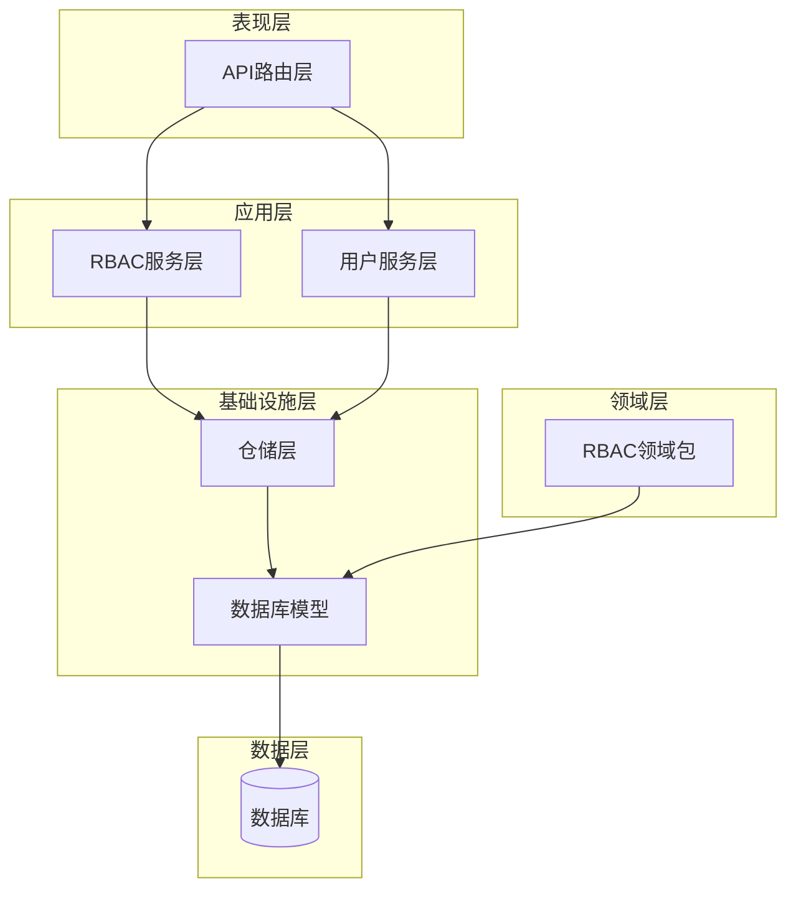
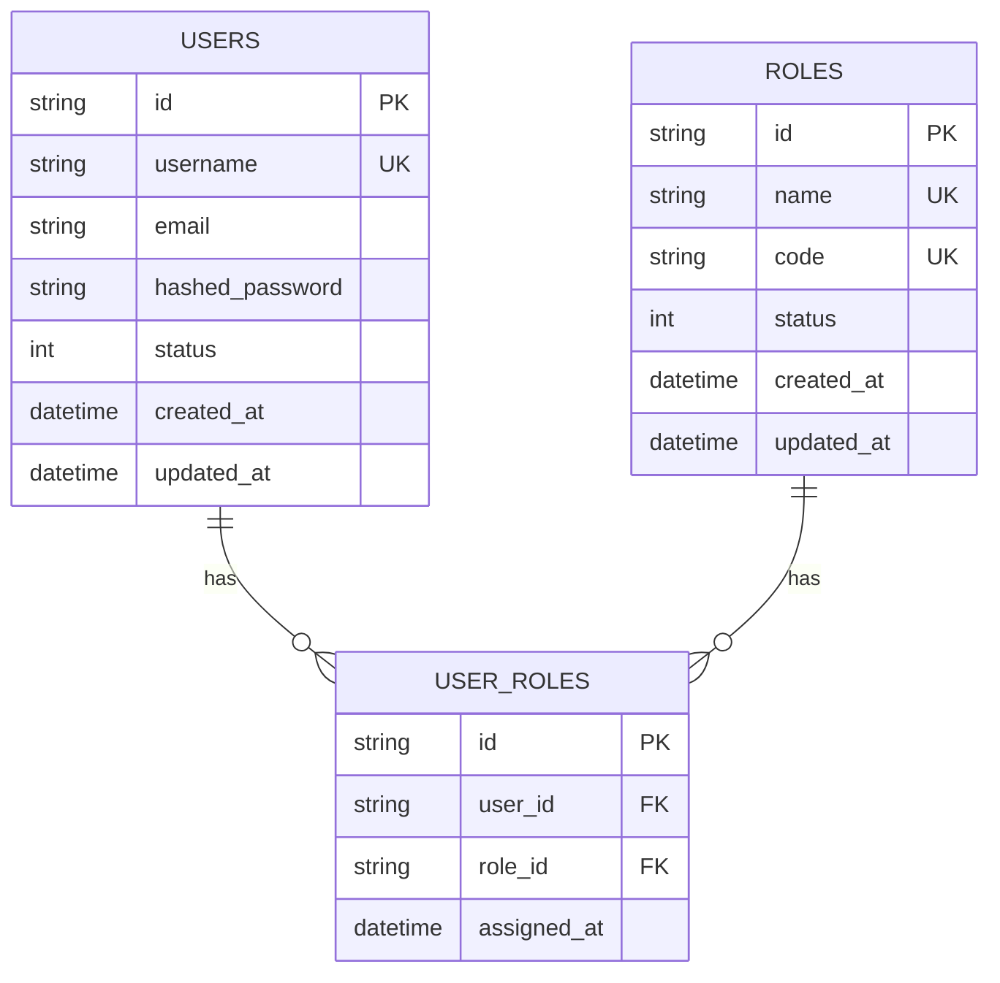
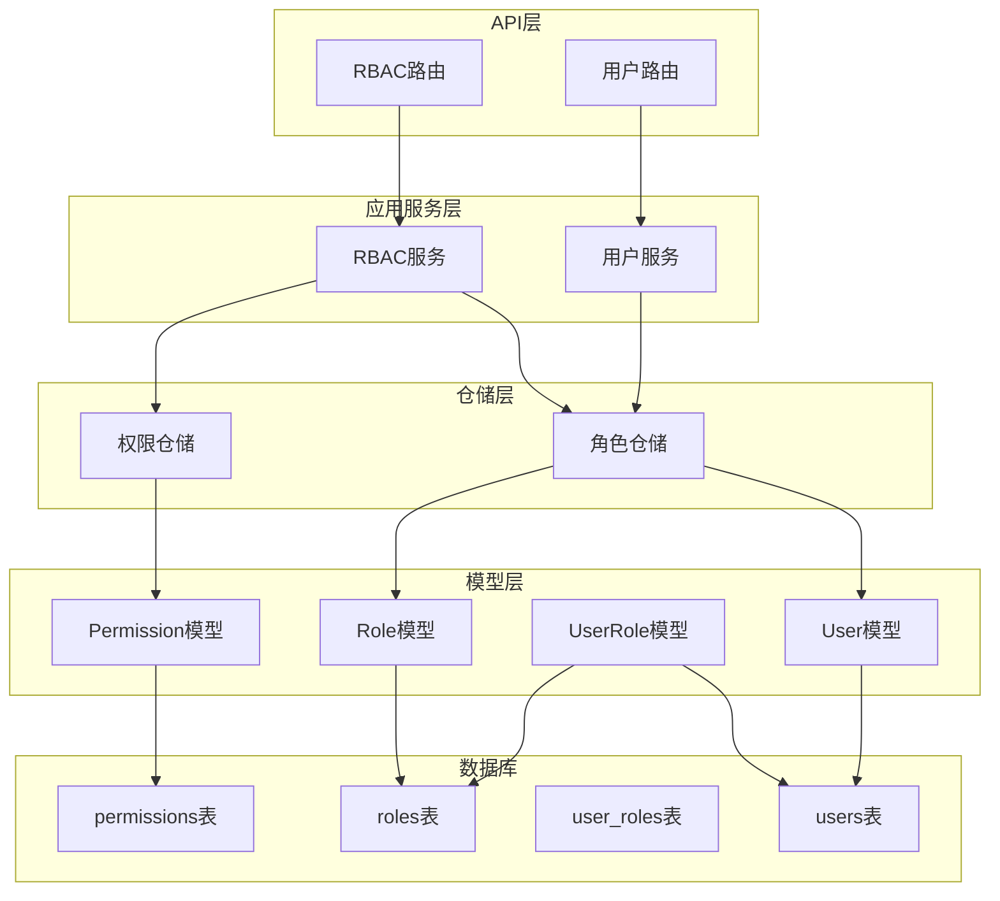
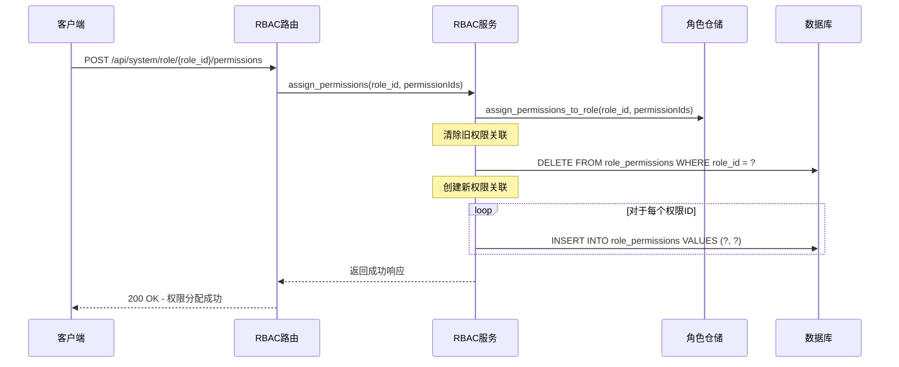
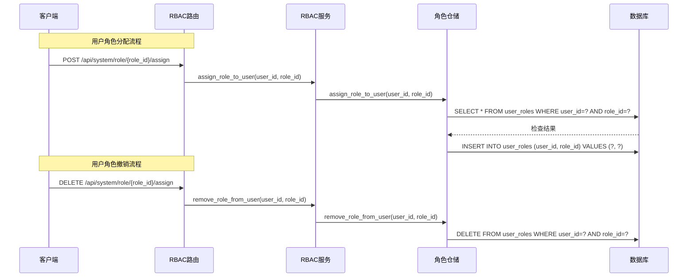
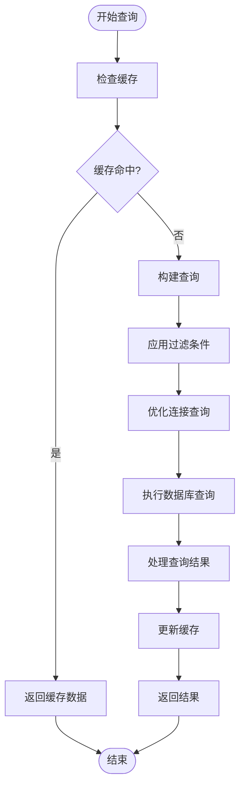
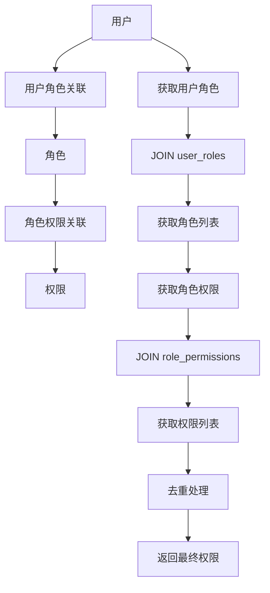
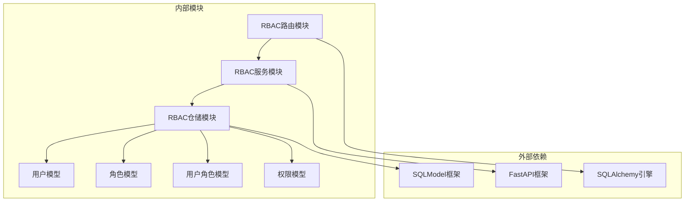
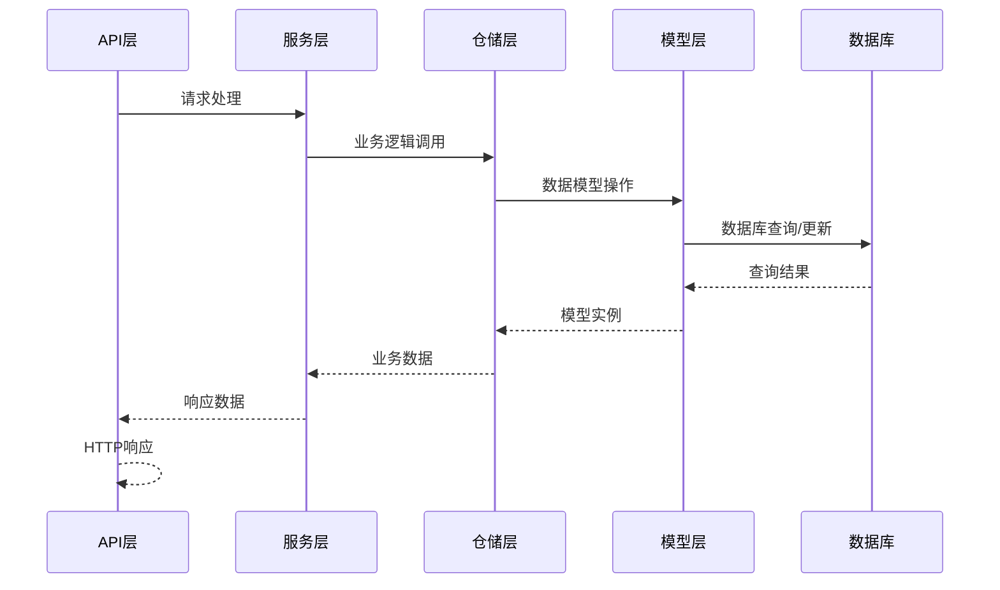

# 用户角色关联模型

<cite>
**本文档引用的文件**
- [models.py](file://service/src/infrastructure/database/models.py)
- [rbac_repository.py](file://service/src/infrastructure/repositories/rbac_repository.py)
- [rbac_service.py](file://service/src/application/services/rbac_service.py)
- [rbac_routes.py](file://service/src/api/v1/rbac_routes.py)
- [user_routes.py](file://service/src/api/v1/user_routes.py)
- [user_service.py](file://service/src/application/services/user_service.py)
- [rbac_dto.py](file://service/src/application/dto/rbac_dto.py)
- [domain_rbac_init.py](file://service/src/domain/rbac/__init__.py)
</cite>

## 目录
1. [简介](#简介)
2. [项目结构](#项目结构)
3. [核心组件](#核心组件)
4. [架构概览](#架构概览)
5. [详细组件分析](#详细组件分析)
6. [依赖分析](#依赖分析)
7. [性能考虑](#性能考虑)
8. [故障排除指南](#故障排除指南)
9. [结论](#结论)

## 简介

用户角色关联模型是本系统RBAC（基于角色的访问控制）架构的核心组成部分，负责管理用户与角色之间的多对多关系。该模型采用关联表设计模式，通过UserRole关联表实现灵活的用户角色管理，支持角色分配、撤销和权限继承等核心功能。

本模型不仅实现了基础的用户角色关联功能，还提供了完整的时间管理和审计跟踪能力，包括角色分配时间戳记录、权限变更历史追踪等特性。通过精心设计的查询优化策略和懒加载机制，确保了系统的高性能运行。

## 项目结构

系统采用分层架构设计，用户角色关联模型位于基础设施层，通过清晰的分层职责划分实现了良好的可维护性和扩展性：



**图表来源**
- [models.py:1-193](file://service/src/infrastructure/database/models.py#L1-L193)
- [rbac_repository.py:1-213](file://service/src/infrastructure/repositories/rbac_repository.py#L1-L213)
- [rbac_service.py:1-231](file://service/src/application/services/rbac_service.py#L1-L231)

**章节来源**
- [models.py:123-141](file://service/src/infrastructure/database/models.py#L123-L141)
- [domain_rbac_init.py:1-7](file://service/src/domain/rbac/__init__.py#L1-L7)

## 核心组件

### UserRole关联表设计

UserRole关联表是用户角色关系的核心载体，采用以下关键设计原则：

**表结构设计**
- 主键：自动生成的UUID字符串标识符
- 外键约束：user_id和role_id分别引用users表和roles表
- 时间戳：assigned_at字段记录角色分配时间
- 级联删除：当用户或角色被删除时，关联关系自动清理

**字段定义详解**

| 字段名 | 类型 | 约束 | 描述 |
|--------|------|------|------|
| id | String(36) | 主键, 唯一 | 关联记录唯一标识 |
| user_id | String(36) | 外键(users.id), 非空 | 用户标识符 |
| role_id | String(36) | 外键(roles.id), 非空 | 角色标识符 |
| assigned_at | DateTime | 默认值: 当前时间 | 角色分配时间戳 |

**章节来源**
- [models.py:123-141](file://service/src/infrastructure/database/models.py#L123-L141)

### 多对多关系映射

系统通过UserRole关联表实现了用户与角色的多对多关系映射：



**图表来源**
- [models.py:31-64](file://service/src/infrastructure/database/models.py#L31-L64)
- [models.py:70-95](file://service/src/infrastructure/database/models.py#L70-L95)
- [models.py:123-141](file://service/src/infrastructure/database/models.py#L123-L141)

**章节来源**
- [models.py:56](file://service/src/infrastructure/database/models.py#L56)
- [models.py:91](file://service/src/infrastructure/database/models.py#L91)

## 架构概览

用户角色关联模型采用经典的分层架构，各层职责明确，耦合度低：



**图表来源**
- [rbac_routes.py:1-257](file://service/src/api/v1/rbac_routes.py#L1-L257)
- [user_routes.py:1-252](file://service/src/api/v1/user_routes.py#L1-L252)
- [rbac_service.py:19-25](file://service/src/application/services/rbac_service.py#L19-L25)

## 详细组件分析

### 数据模型类图

```mermaid
classDiagram
class User {
+string id
+string username
+string email
+string hashed_password
+int status
+datetime created_at
+datetime updated_at
+UserRole[] roles
+is_active() bool
}
class Role {
+string id
+string name
+string code
+string description
+int status
+datetime created_at
+datetime updated_at
+Permission[] permissions
+UserRole[] users
}
class Permission {
+string id
+string name
+string code
+string category
+string description
+string resource
+string action
+int status
+datetime created_at
}
class UserRole {
+string id
+string user_id
+string role_id
+datetime assigned_at
+User user
+Role role
}
class RolePermissionLink {
+string role_id
+string permission_id
}
User "1" --o{ UserRole : has_many
Role "1" --o{ UserRole : has_many
Permission "1" --o{ RolePermissionLink : has_many
Role "1" --o{ RolePermissionLink : has_many
User ||.. UserRole : association_table
Role ||.. UserRole : association_table
Role ||.. RolePermissionLink : association_table
Permission ||.. RolePermissionLink : association_table
```

**图表来源**
- [models.py:31-141](file://service/src/infrastructure/database/models.py#L31-L141)

**章节来源**
- [models.py:31-141](file://service/src/infrastructure/database/models.py#L31-L141)

### 角色权限分配流程

系统提供了完整的角色权限分配和管理流程：



**图表来源**
- [rbac_routes.py:154-176](file://service/src/api/v1/rbac_routes.py#L154-L176)
- [rbac_service.py:121-129](file://service/src/application/services/rbac_service.py#L121-L129)
- [rbac_repository.py:84-96](file://service/src/infrastructure/repositories/rbac_repository.py#L84-L96)

**章节来源**
- [rbac_routes.py:154-176](file://service/src/api/v1/rbac_routes.py#L154-L176)
- [rbac_service.py:121-129](file://service/src/application/services/rbac_service.py#L121-L129)
- [rbac_repository.py:84-96](file://service/src/infrastructure/repositories/rbac_repository.py#L84-L96)

### 用户角色分配与撤销流程



**图表来源**
- [rbac_routes.py:154-176](file://service/src/api/v1/rbac_routes.py#L154-L176)
- [rbac_service.py:169-183](file://service/src/application/services/rbac_service.py#L169-L183)
- [rbac_repository.py:107-126](file://service/src/infrastructure/repositories/rbac_repository.py#L107-L126)

**章节来源**
- [rbac_service.py:169-183](file://service/src/application/services/rbac_service.py#L169-L183)
- [rbac_repository.py:107-126](file://service/src/infrastructure/repositories/rbac_repository.py#L107-L126)

### 查询优化与懒加载策略

系统采用了多种查询优化策略来提升性能：



**图表来源**
- [models.py:56](file://service/src/infrastructure/database/models.py#L56)
- [models.py:89](file://service/src/infrastructure/database/models.py#L89)
- [models.py:116](file://service/src/infrastructure/database/models.py#L116)

**章节来源**
- [models.py:56](file://service/src/infrastructure/database/models.py#L56)
- [models.py:89](file://service/src/infrastructure/database/models.py#L89)
- [models.py:116](file://service/src/infrastructure/database/models.py#L116)

### 权限继承与传递机制

系统实现了基于角色的权限继承机制，用户通过角色间接获得权限：



**图表来源**
- [rbac_repository.py:203-212](file://service/src/infrastructure/repositories/rbac_repository.py#L203-L212)
- [user_service.py:299-306](file://service/src/application/services/user_service.py#L299-L306)

**章节来源**
- [rbac_repository.py:203-212](file://service/src/infrastructure/repositories/rbac_repository.py#L203-L212)
- [user_service.py:299-306](file://service/src/application/services/user_service.py#L299-L306)

## 依赖分析

### 组件依赖关系



**图表来源**
- [rbac_routes.py:23](file://service/src/api/v1/rbac_routes.py#L23)
- [rbac_service.py:16](file://service/src/application/services/rbac_service.py#L16)
- [rbac_repository.py:8](file://service/src/infrastructure/repositories/rbac_repository.py#L8)

**章节来源**
- [rbac_routes.py:23](file://service/src/api/v1/rbac_routes.py#L23)
- [rbac_service.py:16](file://service/src/application/services/rbac_service.py#L16)
- [rbac_repository.py:8](file://service/src/infrastructure/repositories/rbac_repository.py#L8)

### 数据流分析

系统中的数据流向体现了清晰的单向依赖关系：



**图表来源**
- [rbac_routes.py:1-257](file://service/src/api/v1/rbac_routes.py#L1-L257)
- [rbac_service.py:1-231](file://service/src/application/services/rbac_service.py#L1-L231)
- [rbac_repository.py:1-213](file://service/src/infrastructure/repositories/rbac_repository.py#L1-L213)

## 性能考虑

### 查询优化策略

系统在多个层面实施了性能优化：

1. **懒加载配置**：通过`sa_relationship_kwargs={"lazy": "selectin"}`优化关系查询
2. **索引优化**：在外键字段上建立适当的数据库索引
3. **批量查询**：使用`selectin`策略减少N+1查询问题
4. **缓存策略**：结合Redis缓存提升频繁查询的性能

### 时间复杂度分析

- **角色分配操作**：O(1) - 单条记录插入
- **角色撤销操作**：O(1) - 单条记录删除
- **用户权限查询**：O(n) - n为用户角色数量，通过DISTINCT去重
- **角色权限查询**：O(m) - m为角色权限数量

## 故障排除指南

### 常见问题及解决方案

**问题1：角色分配冲突**
- 症状：尝试为用户分配已存在的角色时报错
- 解决方案：检查用户是否已拥有该角色，避免重复分配

**问题2：权限查询异常**
- 症状：用户权限查询结果不完整
- 解决方案：确认用户角色关联表和角色权限关联表数据完整性

**问题3：性能问题**
- 症状：大量用户权限查询响应缓慢
- 解决方案：检查数据库索引配置，考虑增加适当的索引

**章节来源**
- [rbac_service.py:169-183](file://service/src/application/services/rbac_service.py#L169-L183)
- [rbac_repository.py:107-126](file://service/src/infrastructure/repositories/rbac_repository.py#L107-L126)

## 结论

用户角色关联模型通过精心设计的关联表结构和完善的查询优化策略，成功实现了高效的用户角色管理功能。该模型不仅满足了基本的多对多关系映射需求，还提供了完整的时间管理和审计跟踪能力。

系统的关键优势包括：
- **清晰的架构设计**：分层架构确保了良好的可维护性
- **高效的查询性能**：通过懒加载和批量查询优化提升了性能
- **完整的功能覆盖**：支持角色分配、撤销、查询等完整生命周期管理
- **可靠的错误处理**：完善的异常处理机制确保了系统的稳定性

该模型为后续的功能扩展和性能优化奠定了坚实的基础，能够有效支撑复杂的权限管理需求。