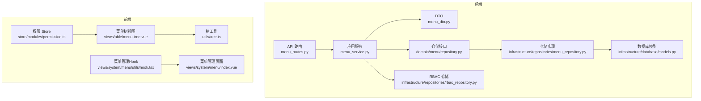
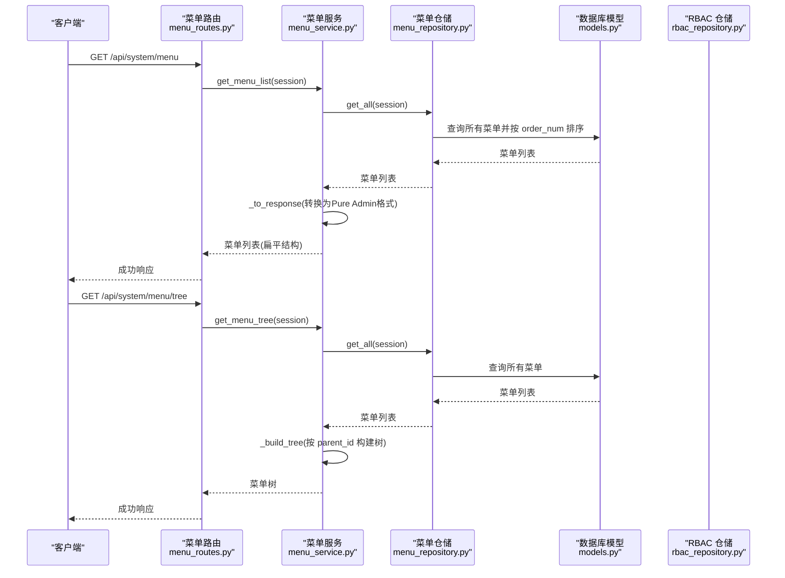
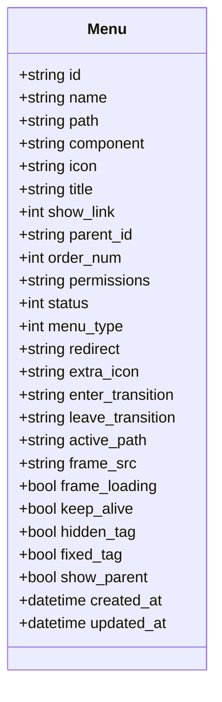
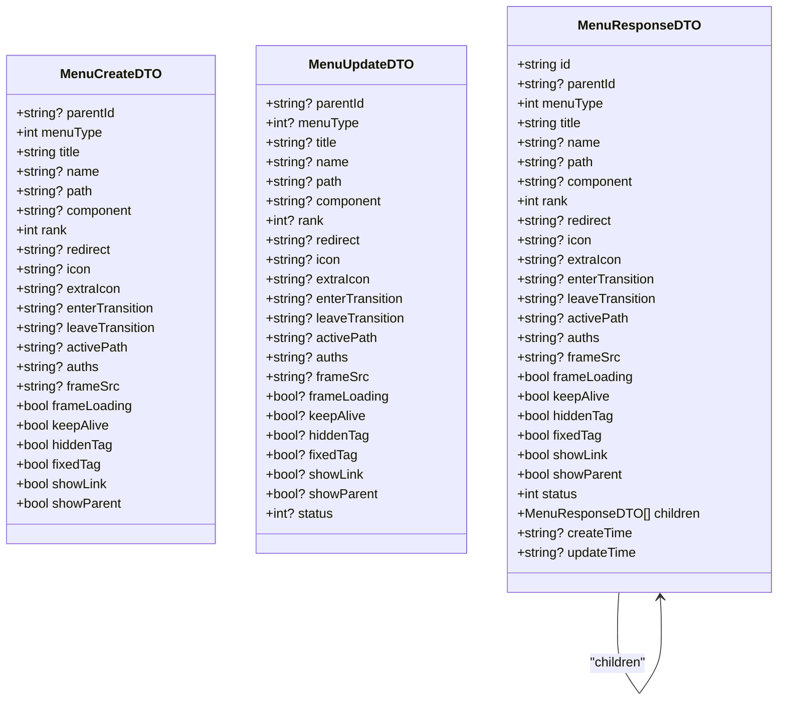
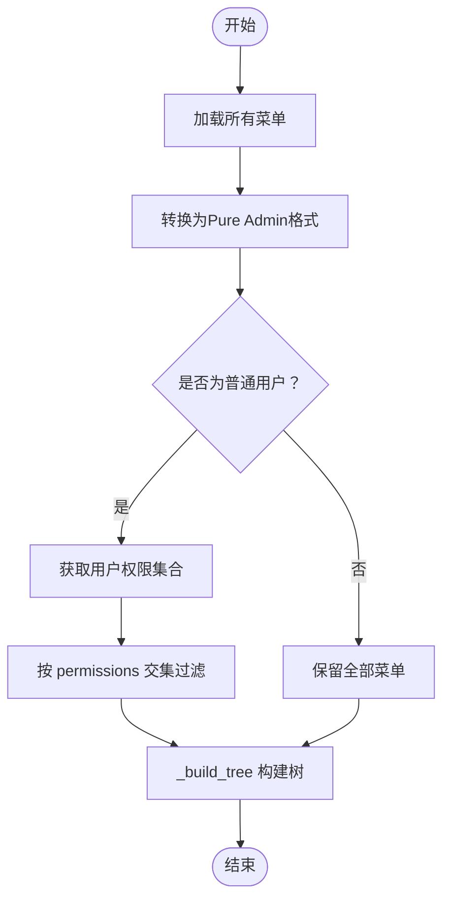
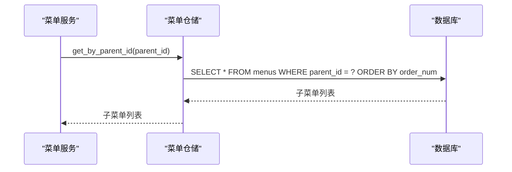
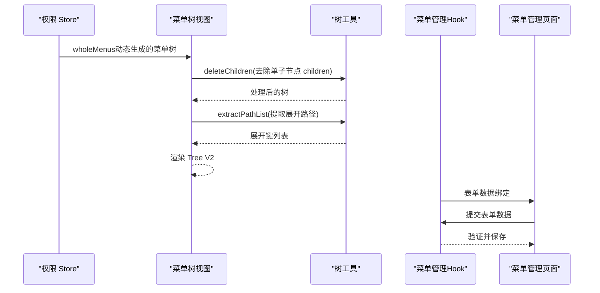
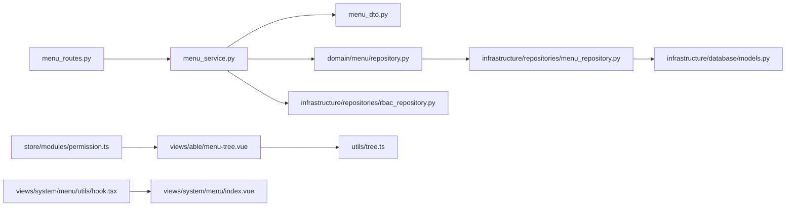
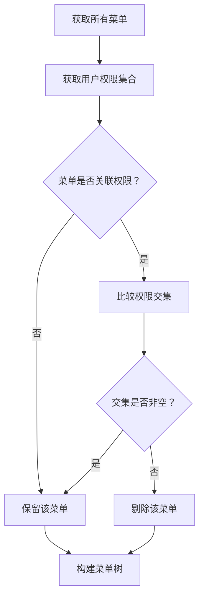

# 菜单实体模型

<cite>
**本文档引用的文件**
- [models.py](file://service/src/infrastructure/database/models.py)
- [menu_dto.py](file://service/src/application/dto/menu_dto.py)
- [menu_service.py](file://service/src/application/services/menu_service.py)
- [menu_repository.py](file://service/src/infrastructure/repositories/menu_repository.py)
- [menu_routes.py](file://service/src/api/v1/menu_routes.py)
- [rbac_repository.py](file://service/src/infrastructure/repositories/rbac_repository.py)
- [repository.py](file://service/src/domain/menu/repository.py)
- [tree.ts](file://web/src/utils/tree.ts)
- [permission.ts](file://web/src/store/modules/permission.ts)
- [menu-tree.vue](file://web/src/views/able/menu-tree.vue)
- [hook.tsx](file://web/src/views/system/menu/utils/hook.tsx)
- [index.vue](file://web/src/views/system/menu/index.vue)
</cite>

## 更新摘要
**所做更改**
- 新增11个Pure Admin兼容字段的详细说明
- 更新菜单实体模型字段定义，包含menu_type、redirect、extra_icon等扩展字段
- 增强前端菜单管理界面的字段说明和使用场景
- 完善菜单类型枚举值和功能特性的技术实现细节

## 目录
1. [简介](#简介)
2. [项目结构](#项目结构)
3. [核心组件](#核心组件)
4. [架构总览](#架构总览)
5. [详细组件分析](#详细组件分析)
6. [依赖关系分析](#依赖关系分析)
7. [性能考虑](#性能考虑)
8. [故障排除指南](#故障排除指南)
9. [结论](#结论)
10. [附录](#附录)

## 简介
本文件系统化阐述菜单实体模型的设计与实现，重点覆盖：
- 菜单树形结构与层级关系
- 菜单字段定义与显示控制
- Pure Admin兼容的11个扩展字段
- 父子菜单关系与递归查询策略
- 排序字段 order_num 的作用与使用场景
- 权限关联字段 permissions 的设计与权限控制机制
- 菜单树构建、权限过滤与动态菜单生成
- 菜单缓存与性能优化策略

## 项目结构
后端采用分层架构：API 路由层 → 应用服务层 → 领域 DTO 层 → 基础设施仓储层 → 数据库模型层。前端通过 Pinia Store 管理动态菜单树，配合工具函数进行树形结构处理。

**图表来源**
- [menu_routes.py:1-107](file://service/src/api/v1/menu_routes.py#L1-L107)
- [menu_service.py:1-238](file://service/src/application/services/menu_service.py#L1-L238)
- [menu_dto.py:1-130](file://service/src/application/dto/menu_dto.py#L1-L130)
- [repository.py:1-43](file://service/src/domain/menu/repository.py#L1-L43)
- [menu_repository.py:1-50](file://service/src/infrastructure/repositories/menu_repository.py#L1-L50)
- [models.py:146-180](file://service/src/infrastructure/database/models.py#L146-L180)
- [rbac_repository.py:136-213](file://service/src/infrastructure/repositories/rbac_repository.py#L136-L213)
- [permission.ts:1-76](file://web/src/store/modules/permission.ts#L1-L76)
- [tree.ts:1-189](file://web/src/utils/tree.ts#L1-L189)
- [menu-tree.vue:1-92](file://web/src/views/able/menu-tree.vue#L1-L92)
- [hook.tsx:138-204](file://web/src/views/system/menu/utils/hook.tsx#L138-L204)
- [index.vue:1-164](file://web/src/views/system/menu/index.vue#L1-L164)

**章节来源**
- [menu_routes.py:1-107](file://service/src/api/v1/menu_routes.py#L1-L107)
- [menu_service.py:1-238](file://service/src/application/services/menu_service.py#L1-L238)
- [models.py:146-180](file://service/src/infrastructure/database/models.py#L146-L180)

## 核心组件
- 菜单数据库模型：定义菜单的物理存储结构，包含名称、路径、组件、图标、显示控制、父子关系、排序、权限关联、状态等基础字段，以及11个Pure Admin兼容扩展字段。
- 菜单 DTO：定义菜单创建、更新、响应的数据结构与校验规则，支持Pure Admin字段映射。
- 菜单应用服务：提供菜单树构建、用户菜单过滤、菜单 CRUD 等业务逻辑，完整支持扩展字段。
- 菜单仓储接口与实现：抽象与具体的数据访问层，负责查询与持久化。
- RBAC 仓储：提供用户权限查询能力，支撑菜单权限过滤。
- 前端权限 Store 与树工具：管理动态菜单树、构建层级关系、过滤与展示。
- 前端菜单管理界面：提供完整的菜单编辑、查看、删除功能，支持所有扩展字段的配置。

**章节来源**
- [models.py:146-180](file://service/src/infrastructure/database/models.py#L146-L180)
- [menu_dto.py:1-130](file://service/src/application/dto/menu_dto.py#L1-L130)
- [menu_service.py:1-238](file://service/src/application/services/menu_service.py#L1-L238)
- [menu_repository.py:1-50](file://service/src/infrastructure/repositories/menu_repository.py#L1-L50)
- [rbac_repository.py:136-213](file://service/src/infrastructure/repositories/rbac_repository.py#L136-L213)

## 架构总览
菜单实体模型贯穿后端与前端，形成"数据模型 → DTO → 服务 → 仓储 → 数据库"的清晰链路；前端通过 Store 与工具函数完成菜单树的动态渲染与交互，支持Pure Admin生态系统的完整兼容。

**图表来源**
- [menu_routes.py:25-44](file://service/src/api/v1/menu_routes.py#L25-L44)
- [menu_routes.py:47-55](file://service/src/api/v1/menu_routes.py#L47-L55)
- [menu_service.py:34-37](file://service/src/application/services/menu_service.py#L34-L37)
- [menu_service.py:198-206](file://service/src/application/services/menu_service.py#L198-L206)
- [menu_repository.py:13-16](file://service/src/infrastructure/repositories/menu_repository.py#L13-L16)

## 详细组件分析

### 菜单实体模型（数据库层）
**更新** 新增11个Pure Admin兼容扩展字段，提供完整的前端框架支持。

- 表名：menus
- 主键：id（UUID 字符串）
- 关键字段
  - 基础字段：name（字符串，最大长度 64）、title（字符串，最大长度 64）、path（字符串，最大长度 256）、component（字符串，最大长度 256）、icon（字符串，最大长度 64）
  - 显示控制：show_link（整数，0-隐藏，1-显示，默认 1）
  - 父子关系：parent_id（外键指向 menus.id，允许为空）
  - 排序：order_num（整数，默认 0）
  - 权限关联：permissions（字符串，最大长度 500，逗号分隔的权限编码）
  - 状态：status（整数，0-禁用，1-启用，默认 1）
  - **Pure Admin扩展字段**：
    - menu_type：菜单类型（0-菜单，1-iframe，2-外链，3-按钮）
    - redirect：重定向路径（字符串，最大长度 256）
    - extra_icon：菜单名称右侧额外图标（字符串，最大长度 64）
    - enter_transition：进场动画（字符串，最大长度 64）
    - leave_transition：离场动画（字符串，最大长度 64）
    - active_path：激活菜单路径（字符串，最大长度 256）
    - frame_src：iframe链接地址（字符串，最大长度 500）
    - frame_loading：iframe首次加载动画（布尔值，默认 True）
    - keep_alive：是否缓存页面（布尔值，默认 False）
    - hidden_tag：禁止添加到标签页（布尔值，默认 False）
    - fixed_tag：固定标签页（布尔值，默认 False）
    - show_parent：是否显示父级菜单（布尔值，默认 False）
  - 时间戳：created_at、updated_at
- 关系
  - 自引用：parent_id 指向自身 id，形成树形层级
  - 与用户、角色、权限的间接关联通过权限过滤体现

**图表来源**
- [models.py:146-180](file://service/src/infrastructure/database/models.py#L146-L180)

**章节来源**
- [models.py:146-180](file://service/src/infrastructure/database/models.py#L146-L180)

### 菜单 DTO（应用层）
**更新** 完整支持11个Pure Admin扩展字段的创建、更新和响应映射。

- 创建 DTO（MenuCreateDTO）
  - 字段：parentId、menuType、title、name、path、component、rank、redirect、icon、extraIcon、enterTransition、leaveTransition、activePath、auths、frameSrc、frameLoading、keepAlive、hiddenTag、fixedTag、showLink、showParent
  - 校验：长度限制、默认值、必填约束
- 更新 DTO（MenuUpdateDTO）
  - 字段：parentId、menuType（可选）、title、name、path、component、rank（可选）、redirect（可选）、icon（可选）、extraIcon（可选）、enterTransition（可选）、leaveTransition（可选）、activePath（可选）、auths（可选）、frameSrc（可选）、frameLoading（可选）、keepAlive（可选）、hiddenTag（可选）、fixedTag（可选）、showLink（可选）、showParent（可选）、status（可选）
- 响应 DTO（MenuResponseDTO）
  - 字段：id、parentId、menuType、title、name、path、component、rank、redirect、icon、extraIcon、enterTransition、leaveTransition、activePath、auths、frameSrc、frameLoading、keepAlive、hiddenTag、fixedTag、showLink、showParent、status、children、createTime、updateTime
  - 递归结构：children 支持嵌套菜单

**图表来源**
- [menu_dto.py:9-130](file://service/src/application/dto/menu_dto.py#L9-L130)

**章节来源**
- [menu_dto.py:1-130](file://service/src/application/dto/menu_dto.py#L1-L130)

### 菜单应用服务（业务层）
**更新** 完整实现11个Pure Admin扩展字段的创建、更新和响应转换。

- 核心职责
  - 获取完整菜单列表：从仓储读取所有菜单，按 order_num 排序，转换为Pure Admin标准格式
  - 获取完整菜单树：从仓储读取所有菜单，按 parent_id 递归构建树结构
  - 获取用户可访问菜单：基于用户权限集合过滤菜单，再构建树
  - 菜单 CRUD：创建、更新、删除菜单，含父子关系校验与循环引用检测
  - 权限过滤：将菜单 permissions 字符串拆分为集合，与用户权限集合求交集
  - **Pure Admin兼容**：完整支持11个扩展字段的映射和转换
- 递归查询策略
  - _build_tree：以 parent_id 为条件筛选子节点，递归构建 children
  - _is_descendant：检测目标节点是否为祖先节点的后代，防止循环引用
- 字段映射
  - 将数据库模型转换为响应 DTO，处理 permissions 列表与时间字段序列化
  - **Pure Admin字段映射**：menu_type、redirect、extra_icon、enter_transition、leave_transition、active_path、frame_src、frame_loading、keep_alive、hidden_tag、fixed_tag、show_parent

**图表来源**
- [menu_service.py:34-37](file://service/src/application/services/menu_service.py#L34-L37)
- [menu_service.py:198-206](file://service/src/application/services/menu_service.py#L198-L206)
- [menu_service.py:208-237](file://service/src/application/services/menu_service.py#L208-L237)

**章节来源**
- [menu_service.py:1-238](file://service/src/application/services/menu_service.py#L1-L238)

### 菜单仓储（基础设施层）
- 抽象接口（领域层）
  - get_all、get_by_id、create、update、delete、get_by_parent_id
- 具体实现（SQLModel）
  - get_all：按 order_num 升序查询
  - get_by_parent_id：按 parent_id 查询并按 order_num 升序
  - create/update/delete：标准 CRUD 操作
- 递归查询
  - 通过 get_by_parent_id 逐层获取子节点，配合服务层 _build_tree 构建树

**图表来源**
- [repository.py:40-42](file://service/src/domain/menu/repository.py#L40-L42)
- [menu_repository.py:45-49](file://service/src/infrastructure/repositories/menu_repository.py#L45-L49)

**章节来源**
- [repository.py:1-43](file://service/src/domain/menu/repository.py#L1-L43)
- [menu_repository.py:1-50](file://service/src/infrastructure/repositories/menu_repository.py#L1-L50)

### API 路由（接口层）
**更新** 新增菜单列表接口，支持Pure Admin前端标准格式。

- 路由定义
  - POST /api/system/menu：获取菜单列表（扁平结构，符合Pure Admin标准）
  - GET /api/system/menu/tree：获取完整菜单树（需权限 menu:view）
  - GET /api/system/menu/user-menus：获取当前用户可访问菜单（无需登录态，但会按权限过滤）
  - POST /api/system/menu/create：创建菜单（需权限 menu:add）
  - PUT /api/system/menu/{menu_id}：更新菜单（需权限 menu:edit）
  - DELETE /api/system/menu/{menu_id}：删除菜单（需权限 menu:delete）
- 依赖注入
  - 使用 get_db 获取 AsyncSession
  - 使用 require_permission 与 get_current_active_user 控制权限

**章节来源**
- [menu_routes.py:1-107](file://service/src/api/v1/menu_routes.py#L1-L107)

### 前端菜单树与动态生成
**更新** 增强前端菜单管理界面，完整支持Pure Admin扩展字段。

- 动态菜单生成
  - 前端通过 Store 管理整体路由生成的菜单（constantMenus + routes），并进行权限过滤与扁平化处理
  - **菜单列表接口**：POST /api/system/menu 返回扁平结构，符合Pure Admin前端标准
- 树形结构处理
  - 工具函数 handleTree、buildHierarchyTree、deleteChildren、extractPathList 等用于构造层级关系、删除冗余 children、提取展开路径等
- 菜单树视图
  - menu-tree.vue 使用 Element Plus Tree V2 组件展示菜单树，支持国际化标题与搜索过滤
- **菜单管理界面**
  - 完整的菜单编辑表单，支持所有11个Pure Admin扩展字段
  - 菜单类型选择（菜单、iframe、外链、按钮）
  - iframe集成配置
  - 页面缓存和标签页管理
  - 动画效果配置

**图表来源**
- [permission.ts:25-34](file://web/src/store/modules/permission.ts#L25-L34)
- [tree.ts:29-48](file://web/src/utils/tree.ts#L29-L48)
- [menu-tree.vue:28-34](file://web/src/views/able/menu-tree.vue#L28-L34)
- [hook.tsx:138-204](file://web/src/views/system/menu/utils/hook.tsx#L138-L204)
- [index.vue:68-114](file://web/src/views/system/menu/index.vue#L68-L114)

**章节来源**
- [permission.ts:1-76](file://web/src/store/modules/permission.ts#L1-L76)
- [tree.ts:1-189](file://web/src/utils/tree.ts#L1-L189)
- [menu-tree.vue:1-92](file://web/src/views/able/menu-tree.vue#L1-L92)
- [hook.tsx:138-204](file://web/src/views/system/menu/utils/hook.tsx#L138-L204)
- [index.vue:1-164](file://web/src/views/system/menu/index.vue#L1-L164)

## 依赖关系分析
- 后端
  - API 路由依赖应用服务
  - 应用服务依赖仓储接口与 RBAC 仓储
  - 仓储实现依赖数据库模型
  - **新增**：菜单列表接口支持Pure Admin前端标准格式
- 前端
  - 视图依赖 Store 与树工具
  - Store 依赖路由与过滤工具
  - **新增**：菜单管理页面依赖Hook处理表单数据
  - **新增**：支持11个Pure Admin扩展字段的完整配置

**图表来源**
- [menu_routes.py:1-107](file://service/src/api/v1/menu_routes.py#L1-L107)
- [menu_service.py:1-238](file://service/src/application/services/menu_service.py#L1-L238)
- [repository.py:1-43](file://service/src/domain/menu/repository.py#L1-L43)
- [menu_repository.py:1-50](file://service/src/infrastructure/repositories/menu_repository.py#L1-L50)
- [models.py:146-180](file://service/src/infrastructure/database/models.py#L146-L180)
- [rbac_repository.py:136-213](file://service/src/infrastructure/repositories/rbac_repository.py#L136-L213)
- [permission.ts:1-76](file://web/src/store/modules/permission.ts#L1-L76)
- [menu-tree.vue:1-92](file://web/src/views/able/menu-tree.vue#L1-L92)
- [tree.ts:1-189](file://web/src/utils/tree.ts#L1-L189)
- [hook.tsx:138-204](file://web/src/views/system/menu/utils/hook.tsx#L138-L204)
- [index.vue:1-164](file://web/src/views/system/menu/index.vue#L1-L164)

**章节来源**
- [menu_routes.py:1-107](file://service/src/api/v1/menu_routes.py#L1-L107)
- [menu_service.py:1-238](file://service/src/application/services/menu_service.py#L1-L238)
- [models.py:146-180](file://service/src/infrastructure/database/models.py#L146-L180)

## 性能考虑
- 数据库查询
  - 菜单查询按 order_num 排序，保证稳定顺序输出
  - 通过 parent_id 精准查询子菜单，减少无关数据扫描
  - **新增**：菜单列表接口返回扁平结构，减少前端树形转换开销
- 服务层处理
  - 递归构建树的时间复杂度为 O(n^2)，在菜单规模适中时可接受；大规模场景建议：
    - 在数据库侧一次性返回扁平列表，前端使用哈希表 + 一次遍历构建树
    - 对菜单列表进行分页或懒加载
  - **新增**：Pure Admin扩展字段的批量处理优化
- 权限过滤
  - 用户权限集合使用集合类型，交集判断为 O(m+n)，注意权限数量上限
- 前端渲染
  - Tree V2 组件支持虚拟滚动与懒加载，结合 deleteChildren 去除冗余 children 可降低渲染压力
  - **新增**：菜单管理界面的表单验证和数据绑定优化
- 缓存策略
  - 后端：菜单树与用户权限可在应用层缓存，结合 Redis 客户端实现（参考 infrastructure/cache 模块）
  - 前端：Store 中缓存 wholeMenus，避免重复拉取与计算
  - **新增**：菜单列表数据的前端缓存策略

## 故障排除指南
- 父子关系错误
  - 现象：更新菜单时报错"不能将菜单设置为自己的子菜单"或"不能将菜单设置为其子菜单的子菜单"
  - 原因：循环引用检测触发
  - 处理：检查 parentId 是否等于自身 id，或是否指向自身的后代节点
- 删除失败
  - 现象：删除菜单时报错"该菜单下有子菜单，请先删除子菜单"
  - 原因：存在子菜单未清理
  - 处理：先删除所有子菜单，再删除父菜单
- 权限过滤异常
  - 现象：用户看不到某些菜单
  - 原因：菜单 permissions 未正确配置或用户权限不足
  - 处理：确认菜单 permissions 与用户实际权限集合的交集是否非空
- **新增**：Pure Admin扩展字段配置问题
  - 现象：iframe菜单无法正常加载或外链菜单跳转异常
  - 原因：frame_src、menu_type、redirect等字段配置错误
  - 处理：检查菜单类型与对应字段的匹配关系，确保URL格式正确

**章节来源**
- [menu_service.py:108-124](file://service/src/application/services/menu_service.py#L108-L124)
- [menu_service.py:174-186](file://service/src/application/services/menu_service.py#L174-L186)
- [menu_service.py:52-63](file://service/src/application/services/menu_service.py#L52-L63)

## 结论
菜单实体模型通过清晰的树形结构与完善的权限控制，实现了灵活的导航体系。新增的11个Pure Admin兼容字段进一步增强了系统的前端集成能力，支持iframe集成、页面缓存、动画效果、标签页管理等高级特性。后端以仓储与服务为核心，前端以 Store 与工具函数为基础，共同完成菜单树的构建、过滤与渲染。在实际部署中，建议结合缓存与懒加载策略，进一步提升性能与用户体验。

## 附录

### Pure Admin扩展字段定义与含义对照
**更新** 新增11个Pure Admin兼容字段的详细说明。

- menu_type：菜单类型（0-菜单，1-iframe，2-外链，3-按钮）
- redirect：重定向路径（当菜单有子路由时，可设置重定向到某个子路由）
- extra_icon：菜单名称右侧额外图标（用于显示特殊标记或徽章）
- enter_transition：进场动画（菜单切换时的进入动画效果）
- leave_transition：离场动画（菜单切换时的离开动画效果）
- active_path：激活菜单路径（用于精确匹配当前激活的菜单项）
- frame_src：iframe链接地址（iframe菜单的外部链接）
- frame_loading：iframe首次加载动画（iframe内容加载时的动画效果）
- keep_alive：是否缓存页面（页面切换时是否保持缓存）
- hidden_tag：禁止添加到标签页（菜单是否出现在标签页中）
- fixed_tag：固定标签页（标签页是否固定不关闭）
- show_parent：是否显示父级菜单（父级菜单是否可见）

### 字段定义与含义对照
- name：菜单名称（用于显示与国际化）
- path：前端路由路径
- component：页面组件路径
- icon：菜单图标标识
- title：显示标题（支持国际化）
- showLink：是否显示（0-隐藏，1-显示）
- parent_id：父菜单 ID（自引用）
- order_num：排序号（升序排列）
- permissions：权限编码列表（逗号分隔）
- status：状态（0-禁用，1-启用）

**章节来源**
- [models.py:152-180](file://service/src/infrastructure/database/models.py#L152-L180)
- [menu_dto.py:22-41](file://service/src/application/dto/menu_dto.py#L22-L41)
- [menu_dto.py:65-85](file://service/src/application/dto/menu_dto.py#L65-L85)
- [menu_dto.py:100-123](file://service/src/application/dto/menu_dto.py#L100-L123)

### 菜单类型枚举说明
**新增** Pure Admin菜单类型的详细说明。

- 菜单（menu_type: 0）：标准的内部页面菜单，支持路由跳转和组件渲染
- iframe（menu_type: 1）：内嵌iframe菜单，用于集成第三方系统或外部页面
- 外链（menu_type: 2）：外部链接菜单，直接跳转到外部网站
- 按钮（menu_type: 3）：按钮级菜单，通常用于权限控制而非页面导航

### 权限过滤流程图

**图表来源**
- [menu_service.py:44-63](file://service/src/application/services/menu_service.py#L44-L63)
- [rbac_repository.py:203-212](file://service/src/infrastructure/repositories/rbac_repository.py#L203-L212)

### Pure Admin兼容字段映射关系
**新增** 后端与前端字段映射的对应关系。

- menu_type ↔ menuType：菜单类型
- redirect ↔ redirect：重定向路径
- extra_icon ↔ extraIcon：额外图标
- enter_transition ↔ enterTransition：进入动画
- leave_transition ↔ leaveTransition：离开动画
- active_path ↔ activePath：激活路径
- frame_src ↔ frameSrc：iframe地址
- frame_loading ↔ frameLoading：iframe加载动画
- keep_alive ↔ keepAlive：页面缓存
- hidden_tag ↔ hiddenTag：隐藏标签
- fixed_tag ↔ fixedTag：固定标签
- show_parent ↔ showParent：显示父级
- show_link ↔ showLink：显示控制
- permissions ↔ auths：权限标识
- order_num ↔ rank：排序编号
- name ↔ name：路由名称
- title ↔ title：菜单标题
- path ↔ path：路由路径
- component ↔ component：组件路径
- icon ↔ icon：图标
- status ↔ status：状态
- parent_id ↔ parentId：父级ID
- created_at ↔ createTime：创建时间
- updated_at ↔ updateTime：更新时间