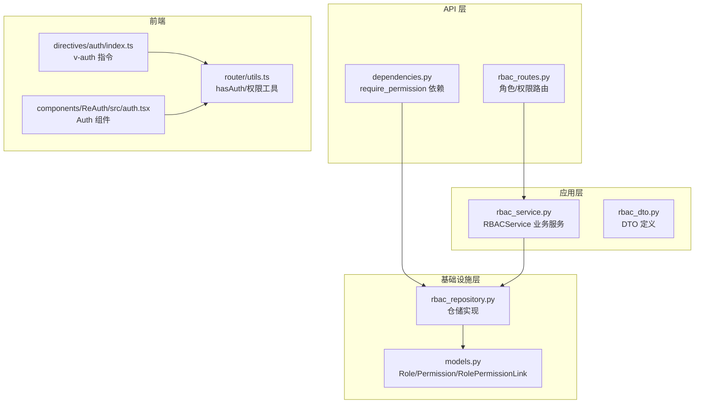
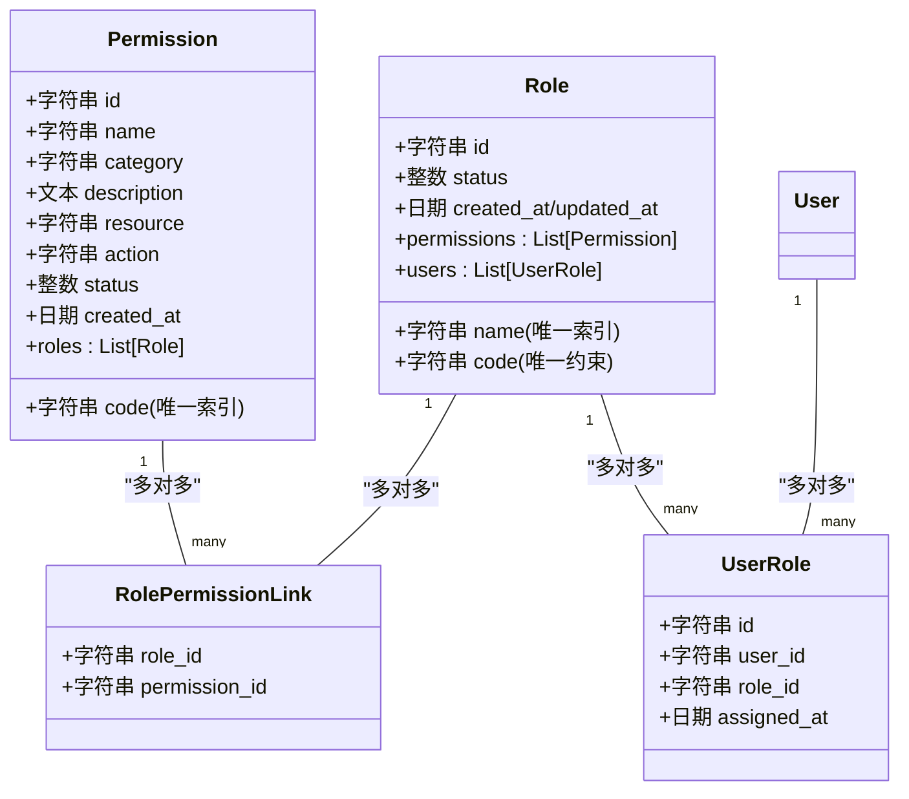
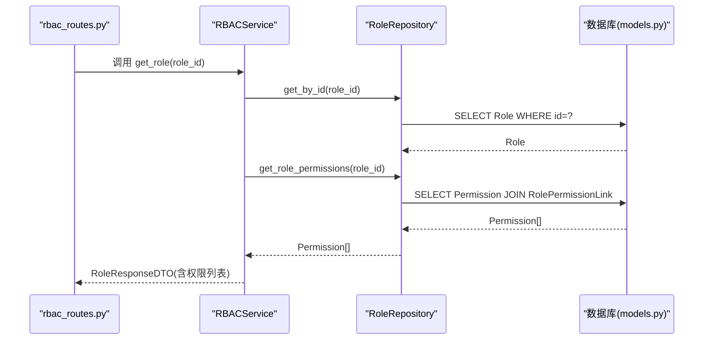
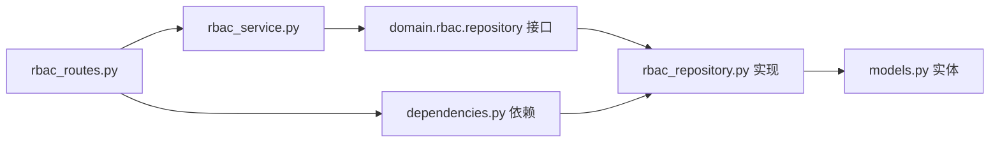

# 角色权限实体模型

<cite>
**本文引用的文件**
- [models.py](file://service/src/infrastructure/database/models.py)
- [rbac_service.py](file://service/src/application/services/rbac_service.py)
- [rbac_dto.py](file://service/src/application/dto/rbac_dto.py)
- [rbac_repository.py](file://service/src/infrastructure/repositories/rbac_repository.py)
- [rbac_routes.py](file://service/src/api/v1/rbac_routes.py)
- [dependencies.py](file://service/src/api/dependencies.py)
- [index.ts](file://web/src/directives/auth/index.ts)
- [auth.tsx](file://web/src/components/ReAuth/src/auth.tsx)
- [utils.ts](file://web/src/router/utils.ts)
</cite>

## 目录
1. [简介](#简介)
2. [项目结构](#项目结构)
3. [核心组件](#核心组件)
4. [架构总览](#架构总览)
5. [详细组件分析](#详细组件分析)
6. [依赖分析](#依赖分析)
7. [性能考虑](#性能考虑)
8. [故障排查指南](#故障排查指南)
9. [结论](#结论)
10. [附录](#附录)

## 简介
本文件系统化梳理并深入解析项目中的角色权限实体模型设计，围绕以下目标展开：
- 角色实体 Role 与权限实体 Permission 的设计原则与字段定义
- 唯一性约束（name/code）与状态管理
- 权限实体的编码唯一性（code）与资源操作字段（resource/action）
- 多对多关系映射机制（Role-Permission 通过 RolePermissionLink 关联表）
- 懒加载策略与性能优化
- 角色权限分配与查询的实际使用示例
- 权限验证与访问控制的最佳实践

## 项目结构
本项目采用分层架构，RBAC 相关代码主要分布在以下层次：
- 基础设施层（Infrastructure）：数据库模型定义与仓储实现
- 应用层（Application）：业务服务与 DTO
- API 层（API）：路由与权限依赖注入
- 前端（web）：指令与组件层面的权限校验与渲染

图表来源
- [rbac_routes.py:1-257](file://service/src/api/v1/rbac_routes.py#L1-L257)
- [dependencies.py:1-72](file://service/src/api/dependencies.py#L1-L72)
- [rbac_service.py:1-231](file://service/src/application/services/rbac_service.py#L1-L231)
- [rbac_dto.py:1-88](file://service/src/application/dto/rbac_dto.py#L1-L88)
- [rbac_repository.py:1-213](file://service/src/infrastructure/repositories/rbac_repository.py#L1-L213)
- [models.py:1-193](file://service/src/infrastructure/database/models.py#L1-L193)
- [index.ts:1-16](file://web/src/directives/auth/index.ts#L1-L16)
- [auth.tsx:1-21](file://web/src/components/ReAuth/src/auth.tsx#L1-L21)
- [utils.ts:1-424](file://web/src/router/utils.ts#L1-L424)

章节来源
- [rbac_routes.py:1-257](file://service/src/api/v1/rbac_routes.py#L1-L257)
- [dependencies.py:1-72](file://service/src/api/dependencies.py#L1-L72)
- [rbac_service.py:1-231](file://service/src/application/services/rbac_service.py#L1-L231)
- [rbac_dto.py:1-88](file://service/src/application/dto/rbac_dto.py#L1-L88)
- [rbac_repository.py:1-213](file://service/src/infrastructure/repositories/rbac_repository.py#L1-L213)
- [models.py:1-193](file://service/src/infrastructure/database/models.py#L1-L193)
- [index.ts:1-16](file://web/src/directives/auth/index.ts#L1-L16)
- [auth.tsx:1-21](file://web/src/components/ReAuth/src/auth.tsx#L1-L21)
- [utils.ts:1-424](file://web/src/router/utils.ts#L1-L424)

## 核心组件
本节聚焦于角色、权限与关联表的核心实体及其职责。

- 角色实体 Role
  - 唯一性约束：name（唯一索引）、code（唯一约束）
  - 状态字段：status（0-禁用，1-启用）
  - 关系：与 Permission 为多对多（通过 RolePermissionLink），与 User 为多对多（通过 UserRole）
  - 懒加载：permissions/users 使用 lazy="selectin"

- 权限实体 Permission
  - 唯一性约束：code（唯一索引）
  - 资源操作字段：resource、action（用于细粒度授权）
  - 状态字段：status（0-禁用，1-启用）
  - 关系：与 Role 为多对多（通过 RolePermissionLink）

- 关联表 RolePermissionLink
  - 多对多关系的桥接表，主键为 (role_id, permission_id)
  - 删除策略：外键 ondelete="CASCADE"，保证级联清理

- 用户-角色关联表 UserRole
  - 多对多关系的桥接表，主键为 (id)，包含 user_id、role_id、assigned_at
  - 删除策略：外键 ondelete="CASCADE"

章节来源
- [models.py:70-121](file://service/src/infrastructure/database/models.py#L70-L121)

## 架构总览
下图展示 RBAC 实体之间的关系与典型调用链路。

图表来源
- [models.py:17-141](file://service/src/infrastructure/database/models.py#L17-L141)

## 详细组件分析

### 角色实体 Role 设计与唯一性约束
- 唯一性与索引
  - name 字段设置为唯一索引，确保角色名称全局唯一
  - code 字段设置为唯一约束，确保角色编码全局唯一
- 状态管理
  - status 字段用于启用/禁用控制（0-禁用，1-启用）
- 关系与懒加载
  - permissions 与 users 通过 Relationship 指定 link_model 并使用 lazy="selectin"，减少 N+1 查询风险
- 字段复杂度
  - 唯一性约束通过数据库约束保障，查询时间复杂度 O(log n)（索引查找）

章节来源
- [models.py:70-95](file://service/src/infrastructure/database/models.py#L70-L95)

### 权限实体 Permission 设计与资源操作字段
- 唯一性与索引
  - code 字段设置为唯一索引，确保权限编码全局唯一
- 资源操作字段
  - resource：受控资源标识（如菜单、接口、数据）
  - action：具体操作类型（如 view、create、edit、delete）
- 状态管理
  - status 字段用于启用/禁用控制（0-禁用，1-启用）
- 关系与懒加载
  - 与 Role 的多对多关系通过 RolePermissionLink 映射，使用 lazy="selectin"

章节来源
- [models.py:97-121](file://service/src/infrastructure/database/models.py#L97-L121)

### 多对多关系映射与 RolePermissionLink
- 映射机制
  - RolePermissionLink 作为桥接表，主键为 (role_id, permission_id)
  - Role.permissions 与 Permission.roles 通过 link_model=RolePermissionLink 建立多对多
- 删除策略
  - 外键 ondelete="CASCADE"，删除角色或权限时自动清理关联记录
- 查询优化
  - 仓储层通过 join + where 快速获取角色权限或用户权限，避免 N+1

图表来源
- [rbac_routes.py:86-105](file://service/src/api/v1/rbac_routes.py#L86-L105)
- [rbac_service.py:51-56](file://service/src/application/services/rbac_service.py#L51-L56)
- [rbac_repository.py:17-105](file://service/src/infrastructure/repositories/rbac_repository.py#L17-L105)
- [models.py:70-121](file://service/src/infrastructure/database/models.py#L70-L121)

章节来源
- [rbac_routes.py:86-105](file://service/src/api/v1/rbac_routes.py#L86-L105)
- [rbac_service.py:51-56](file://service/src/application/services/rbac_service.py#L51-L56)
- [rbac_repository.py:84-105](file://service/src/infrastructure/repositories/rbac_repository.py#L84-L105)
- [models.py:17-26](file://service/src/infrastructure/database/models.py#L17-L26)

### 懒加载策略与性能优化
- 懒加载配置
  - Role.permissions、Permission.roles、User.roles、Role.users 使用 sa_relationship_kwargs={"lazy": "selectin"}
  - selectin 策略在关系查询时批量加载，降低 N+1 查询开销
- 仓储层优化
  - get_user_permissions 通过 join 一次性获取用户所有权限并去重（DISTINCT）
  - 分页查询与筛选条件（如 roleName/status）在仓储层统一实现
- 前端渲染优化
  - hasAuth 与 v-auth 指令仅在渲染阶段进行权限判断，避免后端重复校验

章节来源
- [models.py:88-91](file://service/src/infrastructure/database/models.py#L88-L91)
- [rbac_repository.py:203-212](file://service/src/infrastructure/repositories/rbac_repository.py#L203-L212)
- [utils.ts:368-383](file://web/src/router/utils.ts#L368-L383)
- [index.ts:1-16](file://web/src/directives/auth/index.ts#L1-L16)

### 角色权限分配与查询使用示例
- 创建角色并分配权限
  - 步骤：校验 name/code 唯一 -> 创建 Role -> 可选：assign_permissions_to_role
  - 参考路径：[rbac_service.py:28-49](file://service/src/application/services/rbac_service.py#L28-L49)
- 更新角色并重新分配权限
  - 步骤：校验 name/code 唯一 -> 更新 Role -> assign_permissions_to_role
  - 参考路径：[rbac_service.py:79-113](file://service/src/application/services/rbac_service.py#L79-L113)
- 获取用户权限并进行后端校验
  - 步骤：RBACService.get_user_permissions -> PermissionRepository.get_user_permissions
  - 参考路径：[rbac_service.py:185-193](file://service/src/application/services/rbac_service.py#L185-L193)、[rbac_repository.py:203-212](file://service/src/infrastructure/repositories/rbac_repository.py#L203-L212)
- 前端指令与组件校验
  - v-auth 指令与 Auth 组件结合 hasAuth 判断，决定元素渲染
  - 参考路径：[index.ts:1-16](file://web/src/directives/auth/index.ts#L1-L16)、[auth.tsx:1-21](file://web/src/components/ReAuth/src/auth.tsx#L1-L21)、[utils.ts:368-383](file://web/src/router/utils.ts#L368-L383)

章节来源
- [rbac_service.py:28-113](file://service/src/application/services/rbac_service.py#L28-L113)
- [rbac_repository.py:84-119](file://service/src/infrastructure/repositories/rbac_repository.py#L84-L119)
- [index.ts:1-16](file://web/src/directives/auth/index.ts#L1-L16)
- [auth.tsx:1-21](file://web/src/components/ReAuth/src/auth.tsx#L1-L21)
- [utils.ts:368-383](file://web/src/router/utils.ts#L368-L383)

### 权限验证与访问控制最佳实践
- 后端依赖注入
  - 使用 require_permission(code) 依赖，自动获取当前用户并校验权限
  - 若用户为超级用户（is_superuser），直接放行
  - 参考路径：[dependencies.py:45-60](file://service/src/api/dependencies.py#L45-L60)
- 前端渲染控制
  - v-auth 指令与 Auth 组件配合 hasAuth，仅在具备权限时渲染 UI
  - 参考路径：[index.ts:1-16](file://web/src/directives/auth/index.ts#L1-L16)、[auth.tsx:1-21](file://web/src/components/ReAuth/src/auth.tsx#L1-L21)、[utils.ts:368-383](file://web/src/router/utils.ts#L368-L383)
- 路由级权限
  - 路由装饰器中通过 require_permission("role:view"/"role:manage"/"permission:*") 控制接口访问
  - 参考路径：[rbac_routes.py:33-176](file://service/src/api/v1/rbac_routes.py#L33-L176)

章节来源
- [dependencies.py:45-60](file://service/src/api/dependencies.py#L45-L60)
- [rbac_routes.py:33-176](file://service/src/api/v1/rbac_routes.py#L33-L176)
- [index.ts:1-16](file://web/src/directives/auth/index.ts#L1-L16)
- [auth.tsx:1-21](file://web/src/components/ReAuth/src/auth.tsx#L1-L21)
- [utils.ts:368-383](file://web/src/router/utils.ts#L368-L383)

## 依赖分析
- 组件耦合与内聚
  - RBACService 依赖仓储接口，实现业务编排与 DTO 转换
  - 仓储实现依赖 SQLModel 模型，负责数据库操作
  - API 路由依赖 RBACService 与 require_permission 依赖
- 外部依赖与集成点
  - JWT 解析与令牌校验由 TokenService 提供
  - FastAPI HTTPBearer 用于鉴权凭据提取
- 循环依赖
  - 未发现循环导入；各层职责清晰，接口抽象良好

图表来源
- [rbac_routes.py:1-257](file://service/src/api/v1/rbac_routes.py#L1-L257)
- [rbac_service.py:1-231](file://service/src/application/services/rbac_service.py#L1-L231)
- [rbac_repository.py:1-213](file://service/src/infrastructure/repositories/rbac_repository.py#L1-L213)
- [models.py:1-193](file://service/src/infrastructure/database/models.py#L1-L193)
- [dependencies.py:1-72](file://service/src/api/dependencies.py#L1-L72)

章节来源
- [rbac_routes.py:1-257](file://service/src/api/v1/rbac_routes.py#L1-L257)
- [rbac_service.py:1-231](file://service/src/application/services/rbac_service.py#L1-L231)
- [rbac_repository.py:1-213](file://service/src/infrastructure/repositories/rbac_repository.py#L1-L213)
- [models.py:1-193](file://service/src/infrastructure/database/models.py#L1-L193)
- [dependencies.py:1-72](file://service/src/api/dependencies.py#L1-L72)

## 性能考虑
- 查询优化
  - 使用 lazy="selectin" 在关系查询时批量加载，避免 N+1
  - 仓储层对用户权限查询使用 DISTINCT 去重，避免重复结果
- 索引与约束
  - 角色 name/code、权限 code 均建立唯一约束/索引，查询与插入均具备 O(log n) 复杂度
- 分页与筛选
  - 仓储层统一实现分页与筛选，避免一次性加载全量数据
- 前端渲染
  - hasAuth 仅在渲染阶段进行权限判断，减少后端压力

## 故障排查指南
- 角色/权限唯一性冲突
  - 现象：创建/更新时报冲突错误
  - 排查：确认 name/code 是否已存在
  - 参考路径：[rbac_service.py:30-35](file://service/src/application/services/rbac_service.py#L30-L35)、[rbac_service.py:133-137](file://service/src/application/services/rbac_service.py#L133-L137)
- 角色不存在
  - 现象：更新/删除/分配权限时报错
  - 排查：确认角色 ID 是否正确
  - 参考路径：[rbac_service.py:81-83](file://service/src/application/services/rbac_service.py#L81-L83)、[rbac_service.py:115-118](file://service/src/application/services/rbac_service.py#L115-L118)
- 权限不足
  - 现象：接口返回 403 Forbidden
  - 排查：确认当前用户是否具备所需权限 code
  - 参考路径：[dependencies.py:54-58](file://service/src/api/dependencies.py#L54-L58)
- 用户未登录或被禁用
  - 现象：接口返回 401 Unauthorized
  - 排查：确认 JWT 令牌有效、令牌类型为 access、用户状态为启用
  - 参考路径：[dependencies.py:16-29](file://service/src/api/dependencies.py#L16-L29)、[dependencies.py:32-42](file://service/src/api/dependencies.py#L32-L42)

章节来源
- [rbac_service.py:30-35](file://service/src/application/services/rbac_service.py#L30-L35)
- [rbac_service.py:81-83](file://service/src/application/services/rbac_service.py#L81-L83)
- [rbac_service.py:115-118](file://service/src/application/services/rbac_service.py#L115-L118)
- [dependencies.py:16-29](file://service/src/api/dependencies.py#L16-L29)
- [dependencies.py:32-42](file://service/src/api/dependencies.py#L32-L42)
- [dependencies.py:54-58](file://service/src/api/dependencies.py#L54-L58)

## 结论
本角色权限实体模型通过明确的唯一性约束、清晰的资源操作字段与稳定的多对多映射，实现了高内聚、低耦合的 RBAC 设计。结合懒加载策略、仓储层优化与前后端协同的权限控制，既满足了功能需求，也兼顾了性能与可维护性。建议在实际落地中持续关注索引与查询计划、权限命名规范以及前端渲染的最小化更新，以进一步提升系统稳定性与用户体验。

## 附录
- 字段与约束一览
  - Role：name（唯一索引）、code（唯一约束）、status（启用/禁用）、created_at/updated_at
  - Permission：code（唯一索引）、resource、action、status、category、description
  - 关联表：RolePermissionLink（主键：role_id, permission_id；外键 ondelete=CASCADE）
- 常用查询路径参考
  - 获取角色详情（含权限）：[rbac_routes.py:86-105](file://service/src/api/v1/rbac_routes.py#L86-L105)、[rbac_service.py:51-56](file://service/src/application/services/rbac_service.py#L51-L56)
  - 为角色分配权限：[rbac_routes.py:154-176](file://service/src/api/v1/rbac_routes.py#L154-L176)、[rbac_service.py:121-129](file://service/src/application/services/rbac_service.py#L121-L129)
  - 获取用户权限并校验：[rbac_routes.py:19-22](file://service/src/api/v1/rbac_routes.py#L19-L22)、[dependencies.py:45-60](file://service/src/api/dependencies.py#L45-L60)、[rbac_service.py:185-198](file://service/src/application/services/rbac_service.py#L185-L198)