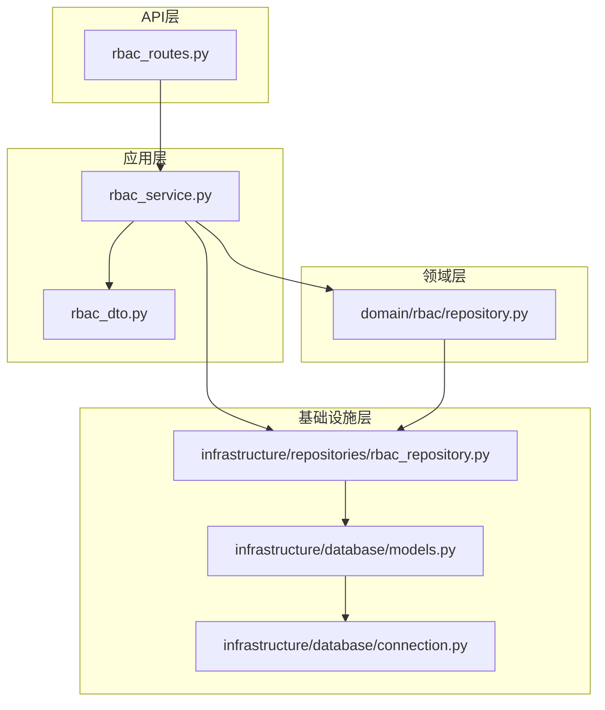
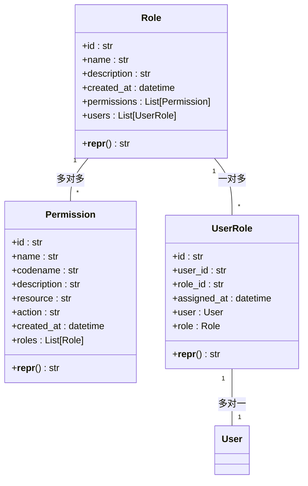
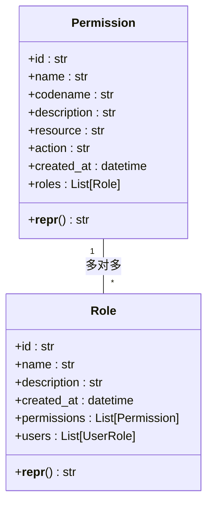
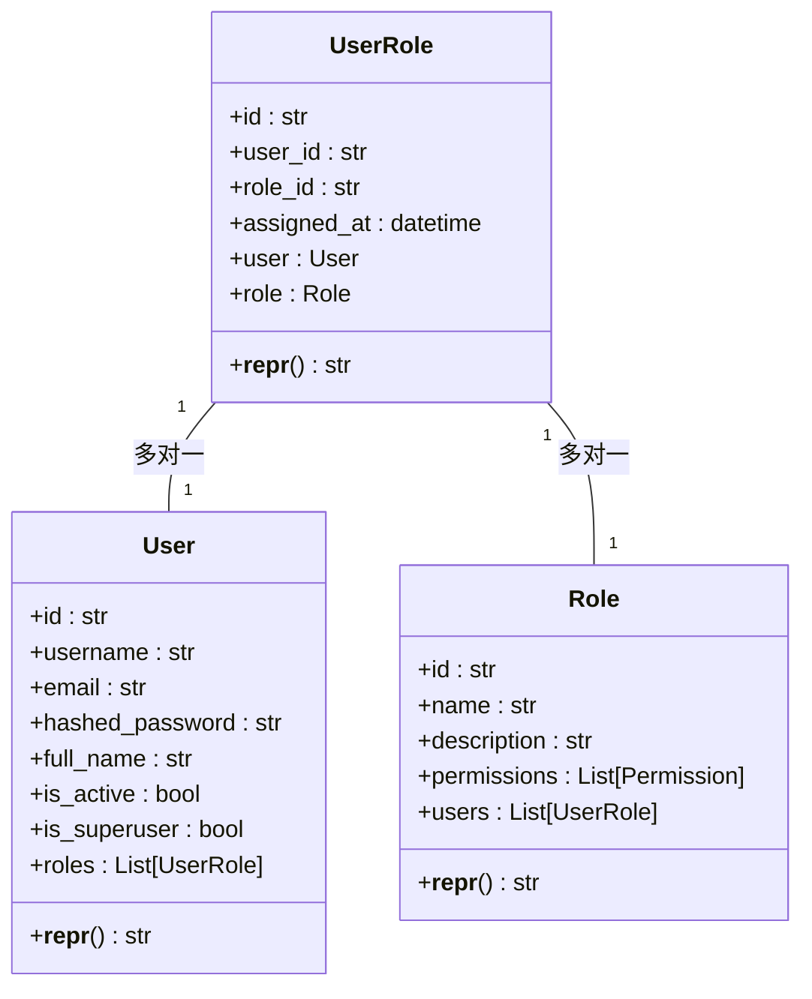
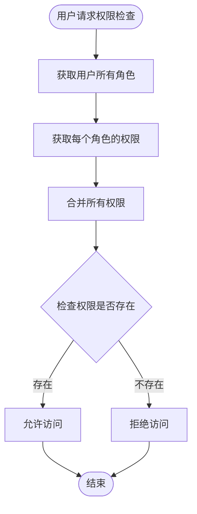
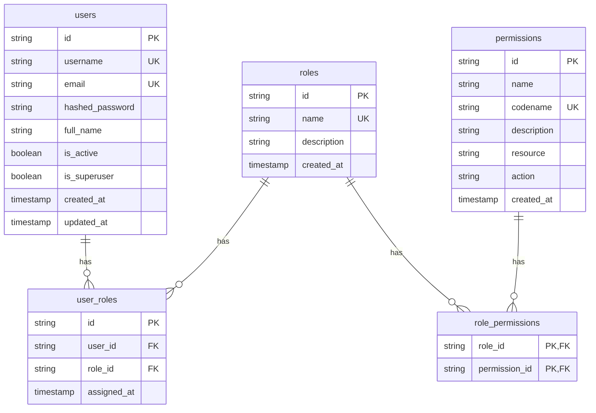
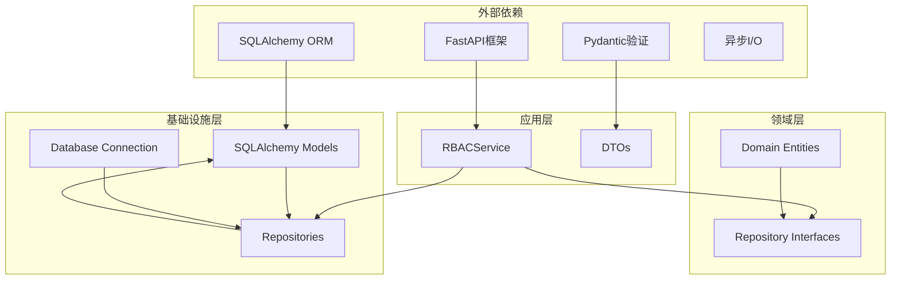

# RBAC实体模型

<cite>
**本文档中引用的文件**
- [models.py](file://src/infrastructure/database/models.py)
- [rbac_dto.py](file://src/application/dto/rbac_dto.py)
- [rbac_service.py](file://src/application/services/rbac_service.py)
- [rbac_repository.py](file://src/infrastructure/repositories/rbac_repository.py)
- [rbac_routes.py](file://src/api/v1/rbac_routes.py)
- [repository.py](file://src/domain/rbac/repository.py)
- [connection.py](file://src/infrastructure/database/connection.py)
- [__init__.py](file://src/domain/rbac/__init__.py)
</cite>

## 更新摘要
**变更内容**
- 更新了实体模型的实现位置：从领域层的Django模型迁移到基础设施层的SQLAlchemy模型
- 移除了对src/domain/rbac/entities.py的引用，该文件已被删除
- 更新了架构图以反映新的分层结构
- 更新了数据库表关系映射以匹配新的SQLAlchemy实现
- 更新了依赖关系分析以反映新的技术栈

## 目录
1. [简介](#简介)
2. [项目结构](#项目结构)
3. [核心组件](#核心组件)
4. [架构概览](#架构概览)
5. [详细组件分析](#详细组件分析)
6. [依赖关系分析](#依赖关系分析)
7. [性能考虑](#性能考虑)
8. [故障排除指南](#故障排除指南)
9. [结论](#结论)

## 简介

本文件详细阐述了基于角色的访问控制（RBAC）实体模型的设计与实现。该系统采用分层架构设计，包含领域层、基础设施层、应用层和API层，实现了完整的角色管理、权限管理和用户授权功能。

**重要更新**：RBAC实体模型已从领域层的Django模型重构为基础设施层的SQLAlchemy模型实现。新的实现采用异步数据库连接和现代ORM特性，提供了更好的性能和可扩展性。

RBAC模型的核心由三个主要实体组成：Role（角色）、Permission（权限）和UserRole（用户-角色关联），这些实体通过多对多关系实现灵活的权限控制机制。

## 项目结构

RBAC实体模型现在位于基础设施层，形成了清晰的分层架构：



**图表来源**
- [rbac_routes.py:1-168](file://src/api/v1/rbac_routes.py#L1-L168)
- [rbac_service.py:1-158](file://src/application/services/rbac_service.py#L1-L158)
- [repository.py:1-62](file://src/domain/rbac/repository.py#L1-L62)
- [rbac_repository.py:1-133](file://src/infrastructure/repositories/rbac_repository.py#L1-L133)
- [models.py:1-142](file://src/infrastructure/database/models.py#L1-L142)
- [connection.py:1-52](file://src/infrastructure/database/connection.py#L1-L52)

## 核心组件

RBAC系统的核心由三个实体构成，每个实体都有明确的职责和设计原则：

### 角色实体（Role）

角色是RBAC模型的聚合根，代表系统中的用户身份或职责。角色实体包含以下关键属性：
- **唯一标识符**：36字符长度的UUID格式主键
- **名称**：角色的唯一标识名称，支持索引优化
- **描述**：角色的详细说明
- **时间戳**：创建时间自动跟踪

### 权限实体（Permission）

权限实体表示系统中可执行的具体操作。权限设计包含：
- **标识符**：36字符长度的UUID格式唯一标识
- **名称**：权限的显示名称
- **编码名**：权限的唯一编码标识，支持索引优化
- **资源类型**：权限作用的资源类别
- **操作类型**：具体的权限动作
- **描述信息**：权限的详细说明

### 用户-角色关联实体（UserRole）

UserRole实体实现了用户与角色之间的多对多关系，包含：
- **用户标识**：关联到用户的外键，支持级联删除
- **角色标识**：关联到角色的外键，支持级联删除
- **分配时间**：角色分配的时间戳

**章节来源**
- [models.py:58-122](file://src/infrastructure/database/models.py#L58-L122)
- [rbac_dto.py:8-70](file://src/application/dto/rbac_dto.py#L8-L70)

## 架构概览

RBAC系统的整体架构遵循Clean Architecture原则，实现了关注点分离和依赖倒置：

```mermaid
graph TD
subgraph "表现层"
APIRoutes[API路由层]
Controllers[控制器]
end
subgraph "应用层"
RBACService[RBAC服务]
DTOs[数据传输对象]
end
subgraph "领域层"
RoleRepoInterface[角色仓库接口]
PermRepoInterface[权限仓库接口]
end
subgraph "基础设施层"
SQLModels[SQLAlchemy模型]
RoleRepoImpl[角色仓库实现]
PermRepoImpl[权限仓库实现]
Database[(数据库)]
DBConnection[数据库连接]
SQLModels --> DBConnection
RoleRepoImpl --> SQLModels
PermRepoImpl --> SQLModels
DBConnection --> Database
```

**图表来源**
- [rbac_routes.py:19-168](file://src/api/v1/rbac_routes.py#L19-L168)
- [rbac_service.py:20-158](file://src/application/services/rbac_service.py#L20-L158)
- [repository.py:8-62](file://src/domain/rbac/repository.py#L8-L62)
- [rbac_repository.py:11-133](file://src/infrastructure/repositories/rbac_repository.py#L11-L133)
- [connection.py:27-52](file://src/infrastructure/database/connection.py#L27-L52)

## 详细组件分析

### 角色实体设计

角色实体采用了聚合根模式，负责维护角色的完整生命周期：



**图表来源**
- [models.py:58-104](file://src/infrastructure/database/models.py#L58-L104)
- [models.py:106-122](file://src/infrastructure/database/models.py#L106-L122)

#### 角色属性设计

角色实体的关键设计特点：
- **UUID主键**：36字符长度的UUID确保全局唯一性，支持分布式部署
- **唯一名称索引**：保证角色名称的唯一性和查询性能
- **时间戳字段**：自动跟踪创建时间
- **权限关系**：通过关联表实现多对多关系
- **用户关系**：维护用户与角色的关联

#### 层级关系实现

虽然当前实现没有直接的层级关系字段，但可以通过以下方式实现角色层级：
- **继承链**：通过权限继承实现角色层级效果
- **复合角色**：将多个基础角色组合成复合角色
- **条件角色**：基于上下文动态授予角色

**章节来源**
- [models.py:63-78](file://src/infrastructure/database/models.py#L63-L78)

### 权限实体设计

权限实体是RBAC系统的核心，提供了细粒度的权限控制能力：



**图表来源**
- [models.py:81-104](file://src/infrastructure/database/models.py#L81-L104)

#### 权限标识符设计

权限的标识系统采用多层次设计：
- **编码名（codename）**：机器可读的唯一标识符，支持索引优化
- **名称（name）**：人类可读的显示名称
- **资源类型（resource）**：权限作用的资源类别
- **操作类型（action）**：具体的权限动作

#### 权限分类机制

权限按照资源类型和操作类型进行分类：
- **资源分类**：用户管理、角色管理、系统配置等
- **操作分类**：查看、创建、更新、删除、管理等
- **组合规则**：通过编码名约定实现权限组合

**章节来源**
- [models.py:86-92](file://src/infrastructure/database/models.py#L86-L92)
- [rbac_dto.py:34-56](file://src/application/dto/rbac_dto.py#L34-L56)

### 用户-角色关联实体设计

UserRole实体实现了用户与角色之间的多对多关系，提供了丰富的关联信息：



**图表来源**
- [models.py:106-122](file://src/infrastructure/database/models.py#L106-L122)

#### 多对多关系实现

用户-角色关系通过关联表实现：
- **关联表**：user_roles表存储用户和角色的映射
- **外键约束**：双向外键确保数据完整性，支持级联删除
- **索引优化**：为user_id和role_id建立索引提升查询性能

#### 级联操作机制

系统实现了完整的级联操作：
- **删除级联**：用户删除时自动删除关联记录
- **更新级联**：角色更新时保持关联完整性
- **事务一致性**：所有操作都在事务中执行

**章节来源**
- [models.py:111-118](file://src/infrastructure/database/models.py#L111-L118)

### 权限继承机制

RBAC系统通过权限组合实现权限继承机制：



**图表来源**
- [rbac_service.py:124-133](file://src/application/services/rbac_service.py#L124-L133)
- [rbac_repository.py:123-133](file://src/infrastructure/repositories/rbac_repository.py#L123-L133)

#### 权限传递规则

权限传递遵循以下规则：
- **累加性**：用户拥有所有角色的权限总和
- **去重性**：相同权限只计算一次
- **即时性**：权限变更立即生效
- **继承性**：通过角色组合实现权限继承

#### 权限组合策略

系统支持多种权限组合策略：
- **并集策略**：所有角色权限的并集
- **交集策略**：仅共享权限
- **优先级策略**：基于角色优先级的权限选择

**章节来源**
- [rbac_service.py:124-133](file://src/application/services/rbac_service.py#L124-L133)
- [rbac_repository.py:114-133](file://src/infrastructure/repositories/rbac_repository.py#L114-L133)

### 数据库表关系映射

RBAC实体与数据库表的映射关系如下：



**图表来源**
- [models.py:28-142](file://src/infrastructure/database/models.py#L28-L142)

#### 外键约束设计

数据库层面的外键约束确保数据完整性：
- **用户外键**：user_roles.user_id → users.id（级联删除）
- **角色外键**：user_roles.role_id → roles.id（级联删除）
- **角色外键**：role_permissions.role_id → roles.id（级联删除）
- **权限外键**：role_permissions.permission_id → permissions.id（级联删除）
- **唯一约束**：用户名、邮箱、权限编码名的唯一性

#### 索引优化策略

系统建立了多处索引以优化查询性能：
- **唯一索引**：用户名、邮箱、权限编码名
- **普通索引**：角色名称、用户ID、角色ID
- **复合索引**：用户-角色关联表的联合索引

**章节来源**
- [models.py:18-23](file://src/infrastructure/database/models.py#L18-L23)
- [models.py:112-118](file://src/infrastructure/database/models.py#L112-L118)

## 依赖关系分析

RBAC系统的依赖关系遵循依赖倒置原则，实现了良好的解耦：



**图表来源**
- [rbac_service.py:3-17](file://src/application/services/rbac_service.py#L3-L17)
- [repository.py:5-62](file://src/domain/rbac/repository.py#L5-L62)
- [rbac_repository.py:7-8](file://src/infrastructure/repositories/rbac_repository.py#L7-L8)
- [connection.py:3-52](file://src/infrastructure/database/connection.py#L3-L52)

### 组件耦合度分析

系统实现了低耦合高内聚的设计：
- **领域层独立**：不依赖具体的技术实现
- **接口隔离**：通过抽象接口实现解耦
- **依赖注入**：通过构造函数注入依赖
- **测试友好**：易于进行单元测试和集成测试

### 循环依赖避免

系统通过以下方式避免循环依赖：
- **字符串引用**：使用字符串形式的类引用
- **接口分离**：将接口和实现分离
- **分层架构**：严格的层次划分
- **延迟导入**：按需导入避免循环

**章节来源**
- [repository.py:12-36](file://src/domain/rbac/repository.py#L12-L36)
- [__init__.py:3-12](file://src/domain/rbac/__init__.py#L3-L12)

## 性能考虑

RBAC系统在设计时充分考虑了性能优化：

### 查询优化策略

- **批量加载**：使用selectinload减少N+1查询问题
- **惰性加载**：默认使用惰性加载减少内存占用
- **索引优化**：为常用查询字段建立索引
- **查询缓存**：对于静态数据实现缓存机制

### 内存使用优化

- **异步操作**：支持异步数据库连接减少阻塞
- **连接池管理**：合理配置数据库连接池
- **事务管理**：最小化事务持续时间
- **批量操作**：支持批量插入和更新操作

### 扩展性考虑

- **水平扩展**：支持多实例部署
- **读写分离**：支持数据库读写分离
- **缓存层**：可添加Redis等缓存层
- **异步处理**：支持异步权限检查

## 故障排除指南

### 常见问题及解决方案

#### 角色创建失败

**问题症状**：创建角色时报错，提示角色已存在
**可能原因**：
- 角色名称重复
- 数据库约束冲突
- 并发创建导致的竞争条件

**解决步骤**：
1. 检查角色名称是否唯一
2. 验证数据库约束设置
3. 实施重试机制处理并发冲突

#### 权限分配异常

**问题症状**：为用户分配角色时返回错误
**可能原因**：
- 用户ID或角色ID无效
- 角色已分配给该用户
- 数据库连接异常

**解决步骤**：
1. 验证用户和角色的存在性
2. 检查是否已存在关联关系
3. 查看数据库日志确认连接状态

#### 权限检查失败

**问题症状**：用户权限检查总是返回false
**可能原因**：
- 用户未正确分配角色
- 权限未正确分配给角色
- 缓存数据过期

**解决步骤**：
1. 验证用户角色分配
2. 检查角色权限设置
3. 清理相关缓存数据

**章节来源**
- [rbac_service.py:31-36](file://src/application/services/rbac_service.py#L31-L36)
- [rbac_repository.py:51-61](file://src/infrastructure/repositories/rbac_repository.py#L51-L61)

### 调试技巧

- **日志记录**：启用详细的日志记录
- **数据库监控**：监控SQL查询性能
- **性能分析**：使用性能分析工具
- **单元测试**：编写全面的单元测试

## 结论

RBAC实体模型通过清晰的分层架构和精心设计的实体关系，实现了灵活而强大的权限控制系统。系统的主要优势包括：

### 设计优势

- **清晰的分层架构**：遵循Clean Architecture原则
- **灵活的实体关系**：支持复杂的权限组合场景
- **完善的错误处理**：提供友好的错误反馈机制
- **良好的扩展性**：支持未来功能扩展

### 技术特色

- **UUID主键设计**：36字符长度的UUID支持分布式部署
- **多对多关系**：实现灵活的权限管理
- **级联操作**：确保数据完整性
- **异步数据库连接**：提供更好的性能和可扩展性

### 应用价值

该RBAC模型适用于各种规模的应用系统，从小型企业应用到大型企业级系统都能提供可靠的权限管理解决方案。通过合理的扩展和定制，可以满足不同业务场景的权限控制需求。

**重要更新**：新的SQLAlchemy实现提供了更好的性能、异步支持和现代化的ORM特性，为未来的功能扩展奠定了坚实的基础。