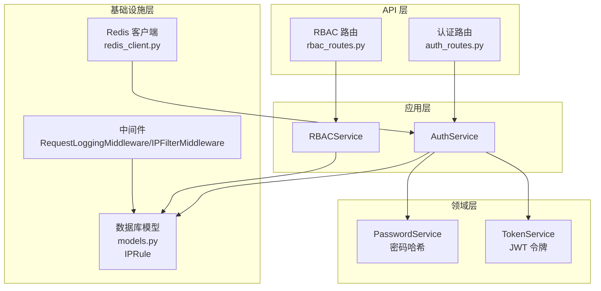
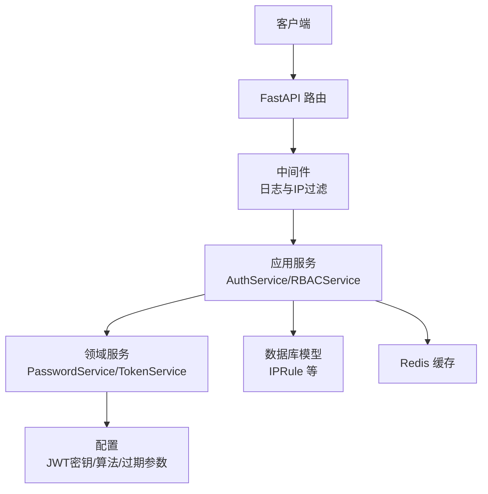
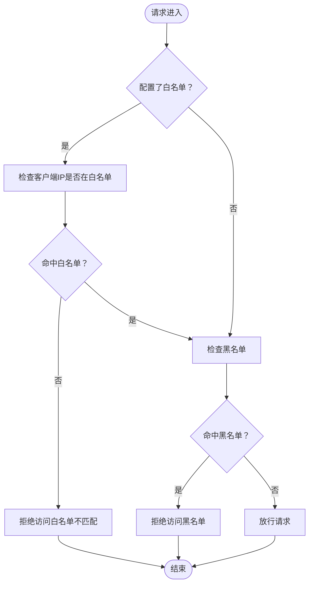
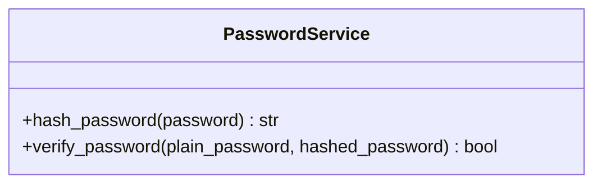
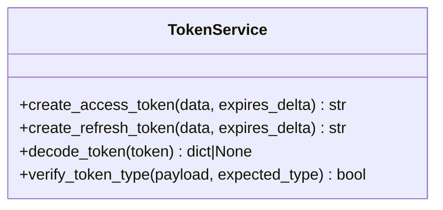
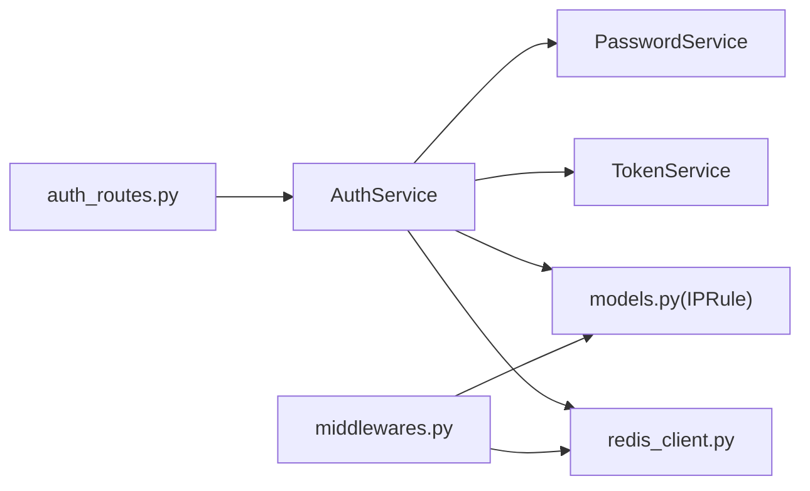
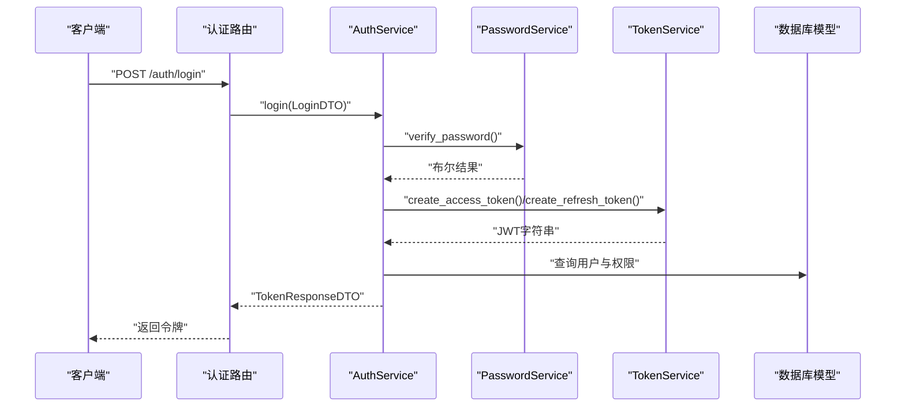

# 安全实体模型

<cite>
**本文档引用的文件**
- [src/domain/auth/password_service.py](file://src/domain/auth/password_service.py)
- [src/domain/auth/token_service.py](file://src/domain/auth/token_service.py)
- [src/core/middlewares.py](file://src/core/middlewares.py)
- [src/infrastructure/cache/redis_client.py](file://src/infrastructure/cache/redis_client.py)
- [src/infrastructure/database/models.py](file://src/infrastructure/database/models.py)
- [src/api/v1/auth_routes.py](file://src/api/v1/auth_routes.py)
- [src/api/v1/rbac_routes.py](file://src/api/v1/rbac_routes.py)
</cite>

## 目录
1. [简介](#简介)
2. [项目结构](#项目结构)
3. [核心组件](#核心组件)
4. [架构总览](#架构总览)
5. [详细组件分析](#详细组件分析)
6. [依赖分析](#依赖分析)
7. [性能考虑](#性能考虑)
8. [故障排除指南](#故障排除指南)
9. [结论](#结论)
10. [附录](#附录)

## 简介
本文件系统性梳理并文档化本项目的“安全实体模型”，重点覆盖以下方面：
- IPRule 实体：IP 地址白名单/黑名单规则的存储与匹配机制
- 密码哈希实体：密码加密算法选择与盐值管理策略
- 令牌实体：JWT 令牌的生成、存储、验证与过期管理
- 会话管理实体：会话状态跟踪与并发控制思路
- 安全审计日志实体：操作记录与安全事件追踪设计
- 使用示例与安全最佳实践
- 安全实体与认证授权流程的集成关系

本项目采用分层架构，安全相关能力主要分布在领域层（密码与令牌）、基础设施层（缓存与数据库）、应用层（服务）与 API 层（路由与中间件）。

## 项目结构
围绕安全主题的关键目录与文件如下：
- 领域层
  - 密码服务：src/domain/auth/password_service.py
  - 令牌服务：src/domain/auth/token_service.py
- 基础设施层
  - Redis 客户端：src/infrastructure/cache/redis_client.py
  - 数据库模型：src/infrastructure/database/models.py（包含 IPRule）
- 核心中间件
  - 请求日志与 IP 过滤：src/core/middlewares.py
- API 层
  - 认证路由：src/api/v1/auth_routes.py
  - RBAC 路由：src/api/v1/rbac_routes.py

图表来源
- [src/api/v1/auth_routes.py:1-34](file://src/api/v1/auth_routes.py#L1-L34)
- [src/api/v1/rbac_routes.py:1-168](file://src/api/v1/rbac_routes.py#L1-L168)
- [src/domain/auth/password_service.py:1-24](file://src/domain/auth/password_service.py#L1-L24)
- [src/domain/auth/token_service.py:1-41](file://src/domain/auth/token_service.py#L1-L41)
- [src/core/middlewares.py:1-63](file://src/core/middlewares.py#L1-L63)
- [src/infrastructure/cache/redis_client.py:1-27](file://src/infrastructure/cache/redis_client.py#L1-L27)
- [src/infrastructure/database/models.py:127-141](file://src/infrastructure/database/models.py#L127-L141)

章节来源
- [src/api/v1/auth_routes.py:1-34](file://src/api/v1/auth_routes.py#L1-L34)
- [src/api/v1/rbac_routes.py:1-168](file://src/api/v1/rbac_routes.py#L1-L168)
- [src/domain/auth/password_service.py:1-24](file://src/domain/auth/password_service.py#L1-L24)
- [src/domain/auth/token_service.py:1-41](file://src/domain/auth/token_service.py#L1-L41)
- [src/core/middlewares.py:1-63](file://src/core/middlewares.py#L1-L63)
- [src/infrastructure/cache/redis_client.py:1-27](file://src/infrastructure/cache/redis_client.py#L1-L27)
- [src/infrastructure/database/models.py:127-141](file://src/infrastructure/database/models.py#L127-L141)

## 核心组件
本节概述安全实体模型中的关键组件及其职责：
- IPRule 实体：持久化存储 IP 白名单/黑名单规则，支持启用状态与过期时间
- PasswordService：提供密码哈希与校验，基于 bcrypt 的盐值自动生成与验证
- TokenService：提供 JWT 访问/刷新令牌的生成、解码与类型校验
- 中间件：请求日志与 IP 黑白名单过滤
- Redis：用于会话状态存储与并发控制（如令牌撤销、速率限制等）
- RBAC 路由：权限与角色管理接口，配合安全实体实现细粒度授权

章节来源
- [src/infrastructure/database/models.py:127-141](file://src/infrastructure/database/models.py#L127-L141)
- [src/domain/auth/password_service.py:1-24](file://src/domain/auth/password_service.py#L1-L24)
- [src/domain/auth/token_service.py:1-41](file://src/domain/auth/token_service.py#L1-L41)
- [src/core/middlewares.py:34-63](file://src/core/middlewares.py#L34-L63)
- [src/infrastructure/cache/redis_client.py:1-27](file://src/infrastructure/cache/redis_client.py#L1-L27)
- [src/api/v1/rbac_routes.py:1-168](file://src/api/v1/rbac_routes.py#L1-L168)

## 架构总览
下图展示安全实体在整体架构中的位置与交互：

图表来源
- [src/api/v1/auth_routes.py:14-33](file://src/api/v1/auth_routes.py#L14-L33)
- [src/core/middlewares.py:12-63](file://src/core/middlewares.py#L12-L63)
- [src/domain/auth/token_service.py:12-41](file://src/domain/auth/token_service.py#L12-L41)
- [src/domain/auth/password_service.py:9-24](file://src/domain/auth/password_service.py#L9-L24)
- [src/infrastructure/cache/redis_client.py:9-27](file://src/infrastructure/cache/redis_client.py#L9-L27)
- [src/infrastructure/database/models.py:127-141](file://src/infrastructure/database/models.py#L127-L141)

## 详细组件分析

### IPRule 实体：IP 白名单/黑名单规则
- 设计要点
  - 字段：唯一标识、IP 地址（含索引）、规则类型（白/黑名单）、原因、启用状态、创建时间、过期时间
  - 存储：ORM 映射至数据库表，便于持久化与查询
  - 匹配：中间件在请求处理链中执行白名单优先检查，随后黑名单检查
- 匹配逻辑
  - 若配置了白名单，则仅允许白名单中的 IP 访问；不在白名单中的请求直接拒绝
  - 在通过白名单检查后，若 IP 在黑名单中则拒绝访问
  - 未命中任何规则时放行请求

图表来源
- [src/core/middlewares.py:34-63](file://src/core/middlewares.py#L34-L63)
- [src/infrastructure/database/models.py:127-141](file://src/infrastructure/database/models.py#L127-L141)

章节来源
- [src/infrastructure/database/models.py:127-141](file://src/infrastructure/database/models.py#L127-L141)
- [src/core/middlewares.py:34-63](file://src/core/middlewares.py#L34-L63)

### 密码哈希实体：bcrypt 算法与盐值管理
- 设计要点
  - 使用 bcrypt 进行密码哈希，自动处理盐值生成与验证
  - 提供哈希与校验两个静态方法，保证不可逆与高效验证
- 复杂度与安全性
  - bcrypt 具备自适应成本因子，可抵御暴力破解
  - 每次哈希均生成新的随机盐值，确保相同明文产生不同哈希值
- 最佳实践
  - 永远不要存储明文密码
  - 使用强随机盐值，避免彩虹表攻击
  - 定期评估与调整 bcrypt 成本因子以适配硬件性能

图表来源
- [src/domain/auth/password_service.py:6-24](file://src/domain/auth/password_service.py#L6-L24)

章节来源
- [src/domain/auth/password_service.py:1-24](file://src/domain/auth/password_service.py#L1-L24)

### 令牌实体：JWT 访问/刷新令牌
- 设计要点
  - 访问令牌：短期有效，携带用户身份与类型标记
  - 刷新令牌：长期有效但需安全存储，用于换取新的访问令牌
  - 解码与类型校验：统一使用配置中的密钥与算法进行解码与校验
- 过期管理
  - 访问令牌与刷新令牌分别设置独立过期时间
  - 令牌过期后需使用刷新令牌重新获取访问令牌
- 并发与撤销
  - 可结合 Redis 存储已撤销的刷新令牌集合，实现即时撤销
  - 结合速率限制与防重放机制，降低令牌滥用风险

图表来源
- [src/domain/auth/token_service.py:9-41](file://src/domain/auth/token_service.py#L9-L41)

章节来源
- [src/domain/auth/token_service.py:1-41](file://src/domain/auth/token_service.py#L1-L41)

### 会话管理实体：状态跟踪与并发控制
- 设计要点
  - 会话状态：通过 Redis 维护用户会话键值对，记录登录状态、设备信息与权限上下文
  - 并发控制：利用 Redis 的原子操作实现令牌撤销、登录互斥与并发登录上限控制
  - 过期策略：结合访问令牌与刷新令牌生命周期，设置合理的会话超时与自动续期
- 推荐实践
  - 登出时主动清理 Redis 中的会话键
  - 对高风险操作增加二次确认与临时时效窗口
  - 限制同一账户的并发登录数，启用设备绑定与异地登录提醒

章节来源
- [src/infrastructure/cache/redis_client.py:1-27](file://src/infrastructure/cache/redis_client.py#L1-L27)

### 安全审计日志实体：操作记录与事件追踪
- 设计要点
  - 日志字段：时间戳、用户标识、IP 地址、操作类型、资源路径、结果状态、详情
  - 存储：建议写入独立审计表或外部日志系统，支持检索与导出
  - 事件分类：登录/登出、权限变更、敏感操作、异常访问尝试
- 实施建议
  - 在中间件与业务关键节点埋点，确保覆盖认证、授权与数据变更
  - 异步写入，避免阻塞主业务流程
  - 设置保留周期与合规要求，定期归档与清理

章节来源
- [src/core/middlewares.py:12-31](file://src/core/middlewares.py#L12-L31)

## 依赖分析
- 组件耦合
  - 认证路由依赖应用服务，应用服务依赖领域服务与数据库模型
  - 中间件与缓存客户端作为横切关注点，被多处调用
- 外部依赖
  - JWT 解码与编码依赖 jose/jwt
  - 密码哈希依赖 bcrypt
  - 缓存依赖 redis
- 潜在风险
  - 配置项错误（密钥、算法、过期时间）可能导致认证失败或安全漏洞
  - Redis 连接泄漏或未正确关闭可能影响稳定性

图表来源
- [src/api/v1/auth_routes.py:14-33](file://src/api/v1/auth_routes.py#L14-L33)
- [src/domain/auth/password_service.py:6-24](file://src/domain/auth/password_service.py#L6-L24)
- [src/domain/auth/token_service.py:9-41](file://src/domain/auth/token_service.py#L9-L41)
- [src/infrastructure/database/models.py:127-141](file://src/infrastructure/database/models.py#L127-L141)
- [src/infrastructure/cache/redis_client.py:9-27](file://src/infrastructure/cache/redis_client.py#L9-L27)
- [src/core/middlewares.py:12-63](file://src/core/middlewares.py#L12-L63)

章节来源
- [src/api/v1/auth_routes.py:1-34](file://src/api/v1/auth_routes.py#L1-L34)
- [src/domain/auth/password_service.py:1-24](file://src/domain/auth/password_service.py#L1-L24)
- [src/domain/auth/token_service.py:1-41](file://src/domain/auth/token_service.py#L1-L41)
- [src/infrastructure/database/models.py:127-141](file://src/infrastructure/database/models.py#L127-L141)
- [src/infrastructure/cache/redis_client.py:1-27](file://src/infrastructure/cache/redis_client.py#L1-L27)
- [src/core/middlewares.py:1-63](file://src/core/middlewares.py#L1-L63)

## 性能考虑
- 密码哈希
  - bcrypt 成本因子应平衡安全与性能，避免过高导致登录延迟
- JWT
  - 将载荷最小化，避免过长声明；刷新令牌应短路存储与快速校验
- 缓存
  - 合理设置过期时间与内存上限；使用管道与批量操作减少网络往返
- 中间件
  - IP 过滤与日志应异步化，避免阻塞请求处理

## 故障排除指南
- 认证失败
  - 检查 JWT 密钥与算法配置是否一致
  - 确认令牌未过期且类型正确
- 密码校验失败
  - 确保输入编码与存储一致（UTF-8）
  - 避免重复使用旧版哈希算法
- IP 访问被拒
  - 检查白名单/黑名单配置是否正确
  - 确认中间件初始化参数与运行环境一致
- Redis 连接问题
  - 检查连接字符串与网络可达性
  - 确保在应用关闭时正确释放连接

章节来源
- [src/domain/auth/token_service.py:28-41](file://src/domain/auth/token_service.py#L28-L41)
- [src/domain/auth/password_service.py:17-24](file://src/domain/auth/password_service.py#L17-L24)
- [src/core/middlewares.py:34-63](file://src/core/middlewares.py#L34-L63)
- [src/infrastructure/cache/redis_client.py:21-27](file://src/infrastructure/cache/redis_client.py#L21-L27)

## 结论
本安全实体模型通过清晰的分层设计与关键安全组件的协同，实现了从密码哈希、令牌管理到访问控制与审计追踪的完整闭环。建议在生产环境中进一步完善：
- 审计日志的结构化与合规存储
- 会话状态与并发控制的精细化策略
- 配置与密钥的动态管理与轮换
- 定期的安全评估与渗透测试

## 附录

### 使用示例与最佳实践
- 密码处理
  - 注册时使用密码哈希服务生成哈希并持久化
  - 登录时使用校验方法比对明文与存储哈希
- 令牌管理
  - 登录成功后签发访问令牌与刷新令牌
  - 刷新令牌单独存储并启用撤销机制
- IP 控制
  - 在中间件中注入白名单/黑名单集合
  - 定期审查与更新规则，设置合理过期时间
- 会话与并发
  - 使用 Redis 存储会话状态，设置过期时间
  - 限制并发登录数，启用异地登录告警
- 审计日志
  - 在认证、授权与敏感操作节点埋点
  - 异步写入并设置保留周期

### 与认证授权流程的集成
- 认证流程
  - 客户端提交凭据 → 应用服务调用密码校验 → 生成访问/刷新令牌 → 返回给客户端
- 授权流程
  - 客户端携带访问令牌 → 中间件解码并校验类型 → 应用服务解析用户上下文 → RBAC 决策 → 执行业务逻辑
- 安全增强
  - IP 白名单/黑名单中间件在入口层拦截
  - 审计日志贯穿全流程，便于追溯与取证

图表来源
- [src/api/v1/auth_routes.py:14-33](file://src/api/v1/auth_routes.py#L14-L33)
- [src/domain/auth/password_service.py:17-24](file://src/domain/auth/password_service.py#L17-L24)
- [src/domain/auth/token_service.py:12-26](file://src/domain/auth/token_service.py#L12-L26)
- [src/infrastructure/database/models.py:127-141](file://src/infrastructure/database/models.py#L127-L141)