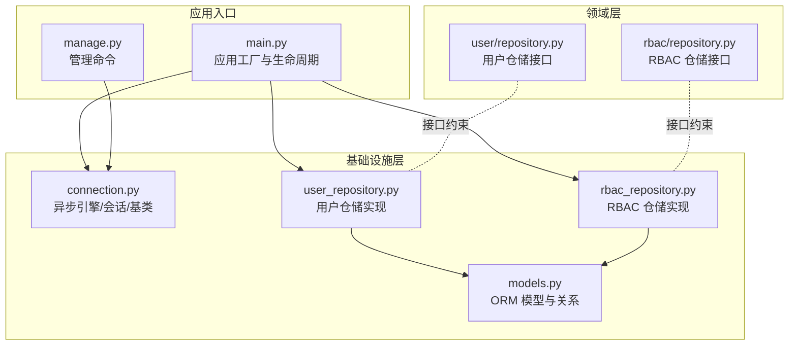
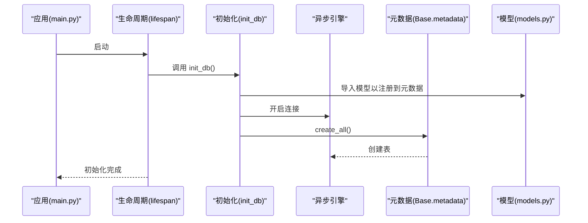
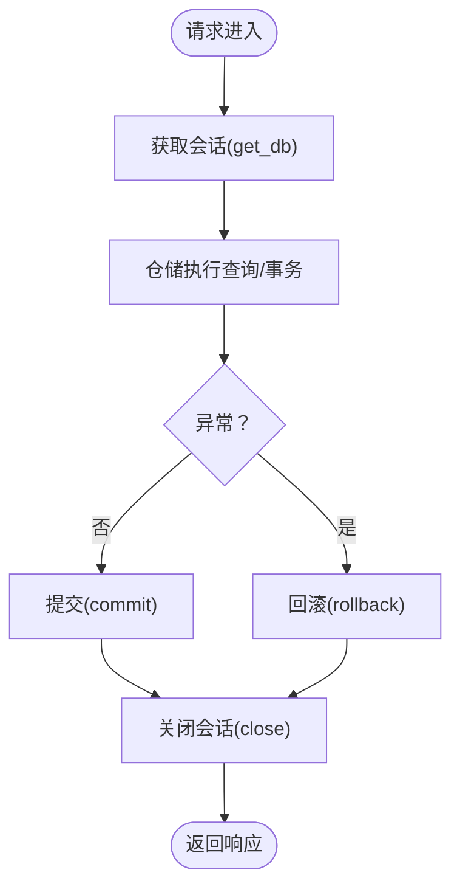
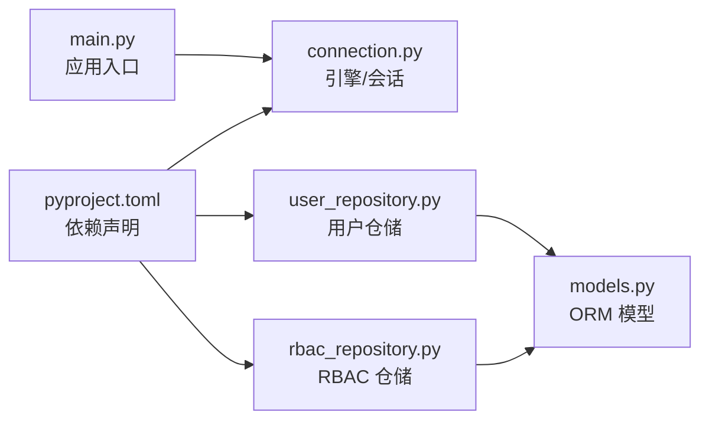

# 数据库关系映射

<cite>
**本文引用的文件**
- [models.py](file://src/infrastructure/database/models.py)
- [connection.py](file://src/infrastructure/database/connection.py)
- [user_repository.py](file://src/infrastructure/repositories/user_repository.py)
- [rbac_repository.py](file://src/infrastructure/repositories/rbac_repository.py)
- [user/repository.py](file://src/domain/user/repository.py)
- [rbac/repository.py](file://src/domain/rbac/repository.py)
- [constants.py](file://src/core/constants.py)
- [main.py](file://src/main.py)
- [manage.py](file://manage.py)
- [pyproject.toml](file://pyproject.toml)
</cite>

## 目录
1. [简介](#简介)
2. [项目结构](#项目结构)
3. [核心组件](#核心组件)
4. [架构总览](#架构总览)
5. [详细组件分析](#详细组件分析)
6. [依赖分析](#依赖分析)
7. [性能考虑](#性能考虑)
8. [故障排查指南](#故障排查指南)
9. [结论](#结论)
10. [附录](#附录)

## 简介
本文件系统化梳理本项目的数据库关系映射与实现，重点覆盖以下方面：
- 实体关系设计：一对一、一对多、多对多的建模与外键约束
- 级联行为：删除与更新的级联策略
- 索引设计：主键、唯一、复合索引及查询优化
- 连接池与会话管理：异步引擎、会话工厂、生命周期
- 使用示例与最佳实践：如何在仓储层正确加载关系、避免 N+1
- 迁移策略：关系变更的处理思路与注意事项

## 项目结构
项目采用分层架构，数据库相关代码集中在基础设施层，领域层通过接口解耦仓储实现：
- 基础设施层
  - 数据库连接与会话：connection.py
  - ORM 模型定义：models.py
  - 仓储实现：user_repository.py、rbac_repository.py
- 领域层
  - 仓储接口：user/repository.py、rbac/repository.py
- 核心与入口
  - 应用生命周期与初始化：main.py
  - 管理脚本：manage.py
  - 默认 RBAC 常量：constants.py
  - 依赖与工具：pyproject.toml

图表来源
- [main.py:19-29](file://src/main.py#L19-L29)
- [connection.py:7-23](file://src/infrastructure/database/connection.py#L7-L23)
- [models.py:29-142](file://src/infrastructure/database/models.py#L29-L142)
- [user_repository.py:11-61](file://src/infrastructure/repositories/user_repository.py#L11-L61)
- [rbac_repository.py:11-133](file://src/infrastructure/repositories/rbac_repository.py#L11-L133)

章节来源
- [main.py:19-29](file://src/main.py#L19-L29)
- [connection.py:7-23](file://src/infrastructure/database/connection.py#L7-L23)
- [models.py:29-142](file://src/infrastructure/database/models.py#L29-L142)
- [user_repository.py:11-61](file://src/infrastructure/repositories/user_repository.py#L11-L61)
- [rbac_repository.py:11-133](file://src/infrastructure/repositories/rbac_repository.py#L11-L133)

## 核心组件
- 异步数据库引擎与会话工厂：基于 SQLAlchemy AsyncEngine 与 async_sessionmaker，启用 pre_ping 以提升连接健壮性；会话默认不自动过期，减少不必要的刷新。
- ORM 基类与模型：统一继承 DeclarativeBase，模型字段包含主键、唯一索引、时间戳等；关系使用 selectin 加载策略降低 N+1。
- 仓储接口与实现：领域层通过接口约束，基础设施层提供 SQLAlchemy 实现，支持按需加载关系与批量查询。

章节来源
- [connection.py:7-23](file://src/infrastructure/database/connection.py#L7-L23)
- [connection.py:26-37](file://src/infrastructure/database/connection.py#L26-L37)
- [models.py:29-142](file://src/infrastructure/database/models.py#L29-L142)
- [user/repository.py:8-50](file://src/domain/user/repository.py#L8-L50)
- [rbac/repository.py:8-62](file://src/domain/rbac/repository.py#L8-L62)

## 架构总览
下图展示应用启动时数据库初始化流程、会话提供与模型加载的关系。

图表来源
- [main.py:19-29](file://src/main.py#L19-L29)
- [connection.py:39-46](file://src/infrastructure/database/connection.py#L39-L46)
- [models.py:1-142](file://src/infrastructure/database/models.py#L1-L142)

## 详细组件分析

### 实体关系设计与外键约束
- 用户-角色（多对多）
  - 关联表：user_roles，包含 user_id 与 role_id 外键，均设置删除级联（ondelete="CASCADE"），确保父记录删除时自动清理关联。
  - 双向关系：User.roles 与 Role.users 通过中间表建立多对多。
- 角色-权限（多对多）
  - 关联表：role_permissions，role_id 与 permission_id 外键均设置删除级联，保证角色或权限删除后关联自动清理。
  - 双向关系：Role.permissions 与 Permission.roles 通过中间表建立多对多。
- 用户-用户角色（一对多）
  - User 与 UserRole：User.roles 为一对多集合，User 作为被参照方，UserRole.user_id 为外键，删除级联。
- 角色-用户角色（一对多）
  - Role 与 UserRole：Role.users 为一对多集合，Role 作为被参照方，UserRole.role_id 为外键，删除级联。

章节来源
- [models.py:18-23](file://src/infrastructure/database/models.py#L18-L23)
- [models.py:48-50](file://src/infrastructure/database/models.py#L48-L50)
- [models.py:68-76](file://src/infrastructure/database/models.py#L68-L76)
- [models.py:94-101](file://src/infrastructure/database/models.py#L94-L101)
- [models.py:112-114](file://src/infrastructure/database/models.py#L112-L114)

### 级联操作配置
- 删除级联（CASCADE）：用户、角色、权限删除时，其在中间表中的关联记录会被自动删除，避免悬挂引用。
- 更新级联：当前模型未显式配置 onupdate 级联，更新主键不会自动传播至子表；如需级联更新，应在外键列上显式声明。
- 建议：对于历史审计或合规要求，可考虑使用软删除字段替代直接 CASCADE 删除，或在业务层引入“禁用/激活”状态。

章节来源
- [models.py:21-22](file://src/infrastructure/database/models.py#L21-L22)
- [models.py:112-113](file://src/infrastructure/database/models.py#L112-L113)

### 索引设计策略
- 主键索引：所有实体主键均为字符串 UUID，长度固定，适合主键索引。
- 唯一索引：username、email（用户）、codename（权限）等字段设置唯一索引，保障业务唯一性。
- 复合索引：中间表 role_permissions 与 user_roles 的联合主键构成复合索引，天然具备唯一性与高效查找能力。
- 查询优化索引：
  - 用户：username、email 建有唯一索引与普通索引，便于登录与检索。
  - 权限：codename 建有唯一索引，便于快速定位权限。
  - IP 规则：ip_address 建有普通索引，便于黑白名单匹配。
- 建议：对高频过滤与连接字段（如 user_id、role_id）保持外键索引；对高选择性的条件字段增加独立索引；避免过度索引导致写入成本上升。

章节来源
- [models.py:35-36](file://src/infrastructure/database/models.py#L35-L36)
- [models.py:88](file://src/infrastructure/database/models.py#L88)
- [models.py:133](file://src/infrastructure/database/models.py#L133)
- [models.py:18-23](file://src/infrastructure/database/models.py#L18-L23)
- [models.py:112-114](file://src/infrastructure/database/models.py#L112-L114)

### 查询优化与关系加载
- 关系加载策略：仓储实现普遍使用 selectinload 对 User.roles 与 Role.permissions 进行批量加载，降低 N+1 查询风险。
- 典型查询模式：
  - 用户：按 id、username、email 查询，同时加载角色关系。
  - 角色：按 id、name 查询，同时加载权限关系。
  - 权限：按 id、codename 查询。
  - 用户-角色：通过 join 查询某用户的全部角色。
  - 角色-权限：通过中间表查询某角色的全部权限。
  - 用户-权限：通过中间表与用户角色表联合查询某用户的全部权限。
- 建议：在高频读取场景中优先使用 selectinload；对只读场景可考虑使用 joinedload 或仅加载必要字段；对复杂筛选组合，结合复合索引与分页。

章节来源
- [user_repository.py:17-35](file://src/infrastructure/repositories/user_repository.py#L17-L35)
- [rbac_repository.py:17-76](file://src/infrastructure/repositories/rbac_repository.py#L17-L76)
- [rbac_repository.py:114-132](file://src/infrastructure/repositories/rbac_repository.py#L114-L132)

### 数据库连接池与会话管理
- 异步引擎：使用 create_async_engine 创建异步连接，开启 echo（调试时）与 pool_pre_ping 提升连接可用性。
- 会话工厂：async_sessionmaker 统一会话创建，expire_on_commit=False 减少提交后的对象失效开销。
- 依赖注入：get_db 提供异步会话依赖，内部自动 commit/rollback/close，简化调用端逻辑。
- 生命周期：应用启动时初始化数据库表，关闭时释放引擎资源。

图表来源
- [connection.py:26-37](file://src/infrastructure/database/connection.py#L26-L37)

章节来源
- [connection.py:7-17](file://src/infrastructure/database/connection.py#L7-L17)
- [connection.py:26-37](file://src/infrastructure/database/connection.py#L26-L37)
- [main.py:19-29](file://src/main.py#L19-L29)

### 使用示例与最佳实践
- 示例路径（不展示具体代码，仅给出路径）：
  - 用户按 id 查询并加载角色：[user_repository.py:17-20](file://src/infrastructure/repositories/user_repository.py#L17-L20)
  - 用户按用户名查询并加载角色：[user_repository.py:22-25](file://src/infrastructure/repositories/user_repository.py#L22-L25)
  - 用户列表查询并加载角色：[user_repository.py:32-35](file://src/infrastructure/repositories/user_repository.py#L32-L35)
  - 角色按名称查询并加载权限：[rbac_repository.py:22-25](file://src/infrastructure/repositories/rbac_repository.py#L22-L25)
  - 获取用户的所有角色（join 中间表）：[rbac_repository.py:68-76](file://src/infrastructure/repositories/rbac_repository.py#L68-L76)
  - 获取角色的所有权限（通过中间表）：[rbac_repository.py:114-121](file://src/infrastructure/repositories/rbac_repository.py#L114-L121)
  - 获取用户的全部权限（通过中间表与用户角色表）：[rbac_repository.py:123-132](file://src/infrastructure/repositories/rbac_repository.py#L123-L132)
- 最佳实践：
  - 在仓储方法中明确使用 selectinload 或 join，避免 N+1。
  - 对高频查询字段建立索引，结合唯一索引保证业务一致性。
  - 写入事务中尽量合并 flush/refresh，减少多次往返。
  - 对复杂查询使用分页与限制数量，避免一次性加载过多数据。

章节来源
- [user_repository.py:17-35](file://src/infrastructure/repositories/user_repository.py#L17-L35)
- [rbac_repository.py:17-76](file://src/infrastructure/repositories/rbac_repository.py#L17-L76)
- [rbac_repository.py:114-132](file://src/infrastructure/repositories/rbac_repository.py#L114-L132)

### 数据库迁移时关系变更的处理策略
- 依赖工具：项目使用 Alembic 作为迁移工具，可在 pyproject.toml 中找到相关依赖。
- 建议流程：
  - 新增字段：先添加字段与索引，再进行数据填充或默认值设置。
  - 删除字段：先迁移数据到其他位置或转换为新结构，再删除旧字段。
  - 修改外键：若涉及级联策略变更，应先在新版本中兼容旧数据，再逐步切换。
  - 中间表变更：新增列时保持联合主键不变，确保唯一性；删除列时注意级联策略与业务影响。
  - 回滚策略：为关键变更准备降级脚本，确保回滚时数据一致与索引完整。
- 注意事项：迁移前备份数据库；在测试环境验证迁移脚本；对生产迁移安排在低峰时段。

章节来源
- [pyproject.toml:24](file://pyproject.toml#L24)

## 依赖分析
- 外部依赖：SQLAlchemy 异步、aiosqlite/asyncpg、Alembic 等。
- 内部依赖：仓储实现依赖模型定义；应用入口依赖数据库初始化与会话提供；管理脚本依赖仓储与常量。

图表来源
- [pyproject.toml:10-26](file://pyproject.toml#L10-L26)
- [main.py:16](file://src/main.py#L16)
- [connection.py:3](file://src/infrastructure/database/connection.py#L3)
- [models.py:13](file://src/infrastructure/database/models.py#L13)
- [user_repository.py:8](file://src/infrastructure/repositories/user_repository.py#L8)
- [rbac_repository.py:8](file://src/infrastructure/repositories/rbac_repository.py#L8)

章节来源
- [pyproject.toml:10-26](file://pyproject.toml#L10-L26)
- [main.py:16](file://src/main.py#L16)
- [connection.py:3](file://src/infrastructure/database/connection.py#L3)
- [models.py:13](file://src/infrastructure/database/models.py#L13)
- [user_repository.py:8](file://src/infrastructure/repositories/user_repository.py#L8)
- [rbac_repository.py:8](file://src/infrastructure/repositories/rbac_repository.py#L8)

## 性能考虑
- 连接池与预检：启用 pool_pre_ping 提升连接稳定性，减少断连重试成本。
- 关系加载：优先使用 selectinload 批量加载，避免 N+1；对只读场景可考虑仅加载必要字段。
- 索引策略：为高频过滤字段建立索引，避免全表扫描；对唯一约束字段使用唯一索引。
- 写入优化：合并 flush/refresh，减少往返；对大批量写入使用批量插入与分批提交。
- 查询分页：对列表查询使用 offset/limit，避免一次性加载过多数据。

## 故障排查指南
- 初始化失败：确认 DATABASE_URL 正确，且 init_db 已在应用启动时调用。
- 会话异常：检查 get_db 的异常分支是否触发 rollback 并重新抛出；确保 finally 分支关闭会话。
- 级联问题：若发现删除后仍有关联残留，检查外键 ondelete 是否为 CASCADE；确认中间表联合主键是否正确。
- 索引缺失：对慢查询语句补充索引；对唯一约束字段确认唯一索引存在。
- 迁移错误：使用 Alembic 生成迁移脚本并先在测试环境验证；准备回滚脚本以防万一。

章节来源
- [connection.py:26-37](file://src/infrastructure/database/connection.py#L26-L37)
- [connection.py:39-46](file://src/infrastructure/database/connection.py#L39-L46)
- [pyproject.toml:24](file://pyproject.toml#L24)

## 结论
本项目通过清晰的分层与接口约束，实现了稳定的数据库关系映射与查询优化。多对多关系通过中间表与 CASCADE 级联策略保证数据一致性；索引与关系加载策略有效降低了查询成本。配合 Alembic 的迁移能力，可在演进过程中安全地调整关系与结构。建议在生产环境中持续监控慢查询与索引命中率，并根据业务增长动态调整索引与加载策略。

## 附录
- 默认 RBAC 数据：应用启动或管理命令中可初始化默认角色与权限，便于快速验证权限体系。
- 管理命令：提供运行服务器、初始化数据库、创建超级用户、填充 RBAC 数据等功能。

章节来源
- [constants.py:11-28](file://src/core/constants.py#L11-L28)
- [manage.py:51-93](file://manage.py#L51-L93)