# 数据模型设计

<cite>
**本文档引用的文件**
- [src/domain/user/entities.py](file://src/domain/user/entities.py)
- [src/domain/rbac/entities.py](file://src/domain/rbac/entities.py)
- [src/domain/security/entities.py](file://src/domain/security/entities.py)
- [src/infrastructure/database/models.py](file://src/infrastructure/database/models.py)
- [src/infrastructure/database/connection.py](file://src/infrastructure/database/connection.py)
- [src/infrastructure/repositories/user_repository.py](file://src/infrastructure/repositories/user_repository.py)
- [src/infrastructure/repositories/rbac_repository.py](file://src/infrastructure/repositories/rbac_repository.py)
- [src/domain/rbac/repository.py](file://src/domain/rbac/repository.py)
- [src/domain/user/repository.py](file://src/domain/user/repository.py)
- [src/main.py](file://src/main.py)
- [src/application/services/auth_service.py](file://src/application/services/auth_service.py)
- [src/domain/auth/token_service.py](file://src/domain/auth/token_service.py)
- [src/infrastructure/cache/redis_client.py](file://src/infrastructure/cache/redis_client.py)
</cite>

## 目录
1. [简介](#简介)
2. [项目结构](#项目结构)
3. [核心组件](#核心组件)
4. [架构总览](#架构总览)
5. [详细组件分析](#详细组件分析)
6. [依赖关系分析](#依赖关系分析)
7. [性能考虑](#性能考虑)
8. [故障排除指南](#故障排除指南)
9. [结论](#结论)
10. [附录](#附录)

## 简介
本文件系统性阐述本项目的数据库模型设计与关系映射，覆盖用户实体、RBAC 权限模型、安全规则模型以及数据库连接与事务处理机制。重点说明：
- 用户实体的字段定义、约束与索引策略
- 角色与权限实体的设计、权限枚举与层级关系
- 用户-角色关联表的多对多实现与级联操作
- 安全相关模型（IP 白黑名单）与会话/令牌管理
- 数据库连接管理、事务处理与生命周期
- 模型间关系映射（一对一、一对多、多对多）
- 数据库迁移与版本管理建议
- 性能优化与查询优化技巧

## 项目结构
项目采用分层架构，数据模型位于领域层（domain），通过基础设施层（infrastructure）的 SQLAlchemy ORM 映射到数据库，并由仓储层（repositories）提供数据访问能力。

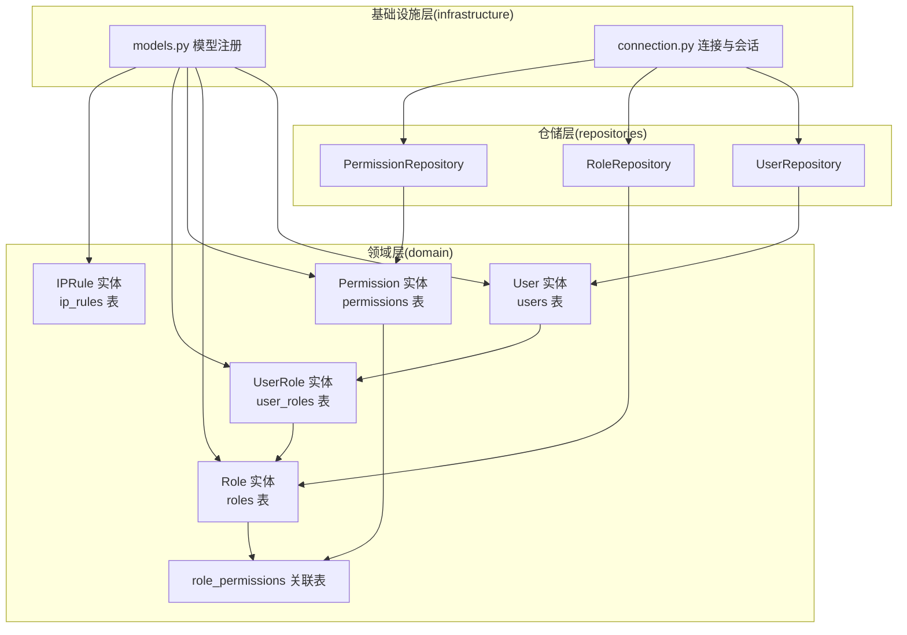

图表来源
- [src/domain/user/entities.py:16-38](file://src/domain/user/entities.py#L16-L38)
- [src/domain/rbac/entities.py:40-79](file://src/domain/rbac/entities.py#L40-L79)
- [src/domain/security/entities.py:12-27](file://src/domain/security/entities.py#L12-L27)
- [src/infrastructure/database/models.py:1-10](file://src/infrastructure/database/models.py#L1-L10)
- [src/infrastructure/database/connection.py:1-51](file://src/infrastructure/database/connection.py#L1-L51)
- [src/infrastructure/repositories/user_repository.py:1-61](file://src/infrastructure/repositories/user_repository.py#L1-L61)
- [src/infrastructure/repositories/rbac_repository.py:1-133](file://src/infrastructure/repositories/rbac_repository.py#L1-L133)

章节来源
- [src/domain/user/entities.py:1-38](file://src/domain/user/entities.py#L1-L38)
- [src/domain/rbac/entities.py:1-79](file://src/domain/rbac/entities.py#L1-L79)
- [src/domain/security/entities.py:1-27](file://src/domain/security/entities.py#L1-L27)
- [src/infrastructure/database/models.py:1-10](file://src/infrastructure/database/models.py#L1-L10)
- [src/infrastructure/database/connection.py:1-51](file://src/infrastructure/database/connection.py#L1-L51)

## 核心组件
本节概述各实体模型及其关键属性、约束与索引策略。

- 用户实体（users）
  - 主键：字符串 UUID（36 字符）
  - 唯一索引：username、email
  - 普通索引：username、email（用于加速查找）
  - 字段：用户名、邮箱、加密密码、全名、激活状态、超级用户标记、创建/更新时间戳
  - 关系：与用户-角色关联表的一对多（删除时级联清理）

- 角色实体（roles）
  - 主键：字符串 UUID（36 字符）
  - 唯一索引：name
  - 普通索引：name
  - 字段：名称、描述、创建/更新时间戳
  - 关系：与权限的多对多（通过中间表 role_permissions），与用户-角色关联表的一对多（删除时级联清理）

- 权限实体（permissions）
  - 主键：字符串 UUID（36 字符）
  - 唯一索引：name、codename
  - 字段：名称、编码、描述、资源、动作、创建时间
  - 关系：与角色的多对多（通过中间表 role_permissions）

- 用户-角色关联实体（user_roles）
  - 主键：字符串 UUID（36 字符）
  - 外键：user_id、role_id（均带索引）
  - 字段：分配时间
  - 关系：与 User、Role 双向回溯

- IP 规则实体（ip_rules）
  - 主键：字符串 UUID（36 字符）
  - 索引：ip_address
  - 字段：IP 地址、规则类型（白/黑名单）、原因、启用状态、创建时间、过期时间
  - 用途：黑白名单与限流

章节来源
- [src/domain/user/entities.py:16-38](file://src/domain/user/entities.py#L16-L38)
- [src/domain/rbac/entities.py:20-79](file://src/domain/rbac/entities.py#L20-L79)
- [src/domain/security/entities.py:12-27](file://src/domain/security/entities.py#L12-L27)

## 架构总览
下图展示数据模型在系统中的位置与交互流程，包括启动时初始化、会话管理与事务处理。

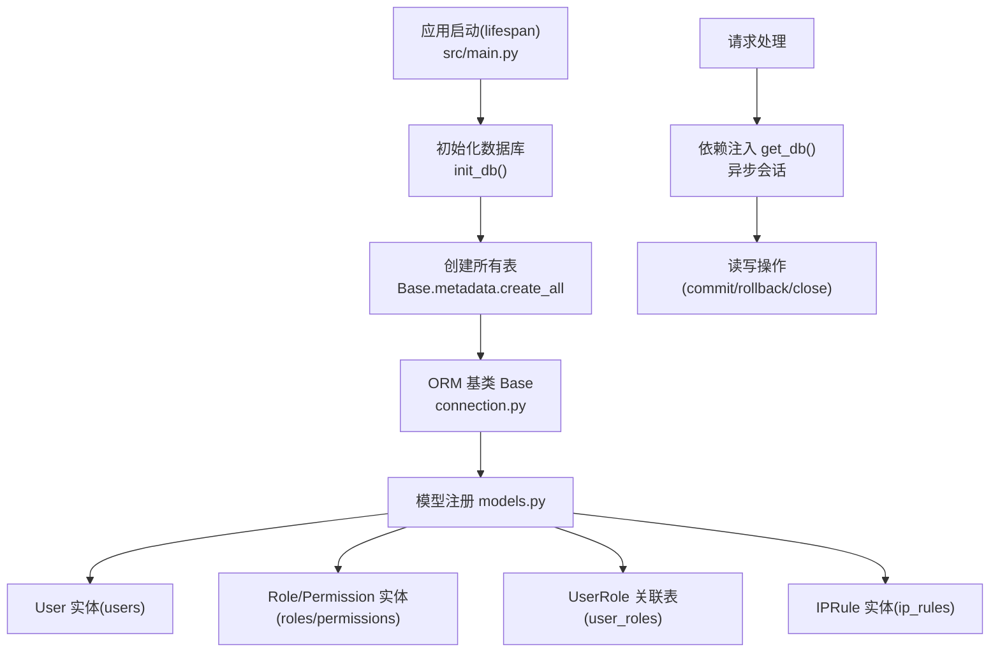

图表来源
- [src/main.py:19-29](file://src/main.py#L19-L29)
- [src/infrastructure/database/connection.py:39-50](file://src/infrastructure/database/connection.py#L39-L50)
- [src/infrastructure/database/models.py:1-10](file://src/infrastructure/database/models.py#L1-L10)

章节来源
- [src/main.py:19-29](file://src/main.py#L19-L29)
- [src/infrastructure/database/connection.py:1-51](file://src/infrastructure/database/connection.py#L1-L51)
- [src/infrastructure/database/models.py:1-10](file://src/infrastructure/database/models.py#L1-L10)

## 详细组件分析

### 用户实体模型（User）
- 设计要点
  - 使用字符串 UUID 作为主键，长度 36 字符，避免整数溢出与序列化问题
  - username 与 email 均建立唯一索引与普通索引，支持快速登录与检索
  - is_active 控制账户启用状态；is_superuser 提供全局管理员标记
  - created_at/updated_at 使用服务器默认值与更新触发器，保证时间一致性
  - 与 UserRole 的一对多关系，删除用户时级联删除其角色分配记录

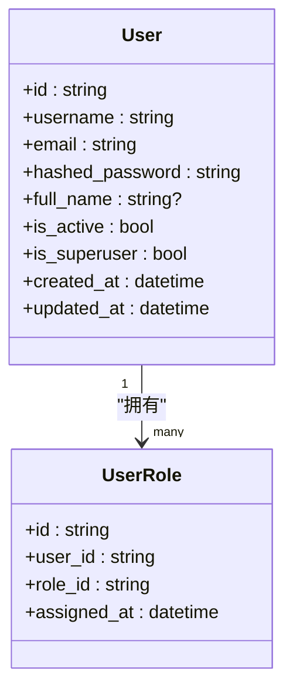

图表来源
- [src/domain/user/entities.py:16-38](file://src/domain/user/entities.py#L16-L38)
- [src/domain/rbac/entities.py:63-79](file://src/domain/rbac/entities.py#L63-L79)

章节来源
- [src/domain/user/entities.py:16-38](file://src/domain/user/entities.py#L16-L38)

### 角色与权限实体模型（Role/Permission）
- 设计要点
  - 角色与权限均为独立实体，通过中间表 role_permissions 建立多对多关系
  - 权限实体包含资源与动作字段，便于细粒度授权判断
  - 角色实体维护 created_at/updated_at，支持审计与变更追踪
  - 中间表在删除角色或权限时采用 CASCADE，确保关系完整性

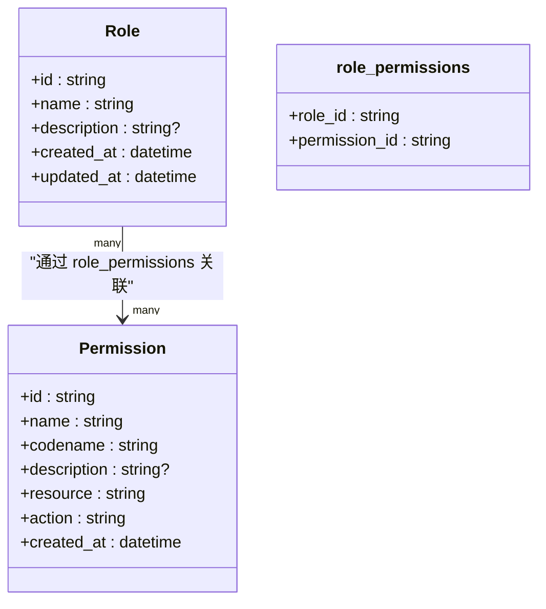

图表来源
- [src/domain/rbac/entities.py:11-17](file://src/domain/rbac/entities.py#L11-L17)
- [src/domain/rbac/entities.py:20-61](file://src/domain/rbac/entities.py#L20-L61)

章节来源
- [src/domain/rbac/entities.py:11-61](file://src/domain/rbac/entities.py#L11-L61)

### 用户-角色关联表（UserRole）
- 设计要点
  - 作为用户与角色的关联实体，承载分配时间等元数据
  - user_id 与 role_id 均建立索引，提升查询效率
  - 外键删除策略为 CASCADE，保障级联清理
  - 与 User/Role 的双向关系，支持从任一侧导航

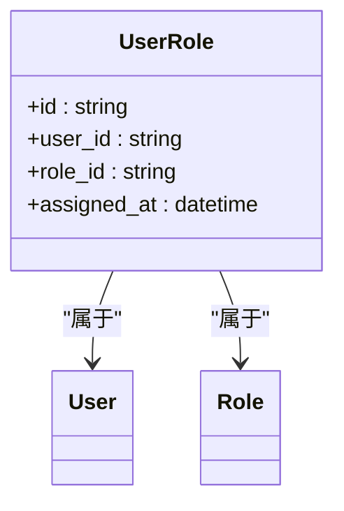

图表来源
- [src/domain/rbac/entities.py:63-79](file://src/domain/rbac/entities.py#L63-L79)

章节来源
- [src/domain/rbac/entities.py:63-79](file://src/domain/rbac/entities.py#L63-L79)

### 安全相关数据模型（IPRule）
- 设计要点
  - 支持白名单与黑名单两种规则类型
  - ip_address 建立索引，便于快速匹配
  - is_active 控制规则启用状态；expires_at 支持临时封禁
  - 适合与网关或中间件配合实现访问控制

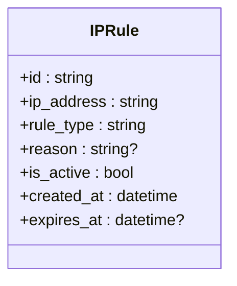

图表来源
- [src/domain/security/entities.py:12-27](file://src/domain/security/entities.py#L12-L27)

章节来源
- [src/domain/security/entities.py:12-27](file://src/domain/security/entities.py#L12-L27)

### 会话管理、令牌存储与审计
- 会话管理
  - 异步数据库引擎与会话工厂，支持连接池预检与自动回滚
  - 会话在依赖注入中按请求生成，结束后自动提交或回滚并关闭
- 令牌管理
  - 使用 JWT 令牌服务进行访问/刷新令牌的生成与校验
  - 令牌负载包含用户标识与类型，便于鉴权与区分访问范围
- 审计日志
  - 用户与角色实体均具备创建/更新时间戳，可用于审计追踪

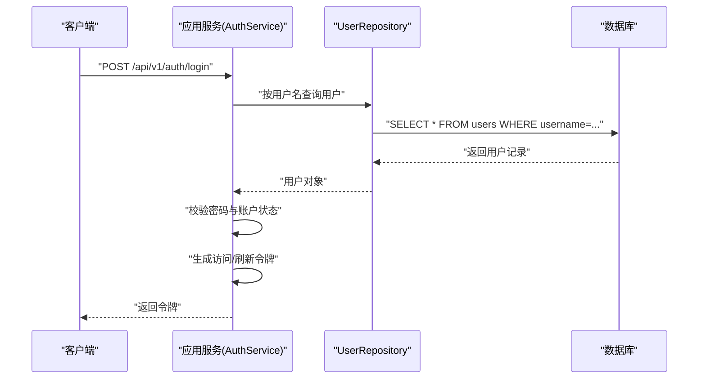

图表来源
- [src/application/services/auth_service.py:13-33](file://src/application/services/auth_service.py#L13-L33)
- [src/infrastructure/repositories/user_repository.py:17-30](file://src/infrastructure/repositories/user_repository.py#L17-L30)
- [src/domain/auth/token_service.py:9-32](file://src/domain/auth/token_service.py#L9-L32)

章节来源
- [src/infrastructure/database/connection.py:26-37](file://src/infrastructure/database/connection.py#L26-L37)
- [src/application/services/auth_service.py:13-33](file://src/application/services/auth_service.py#L13-L33)
- [src/domain/auth/token_service.py:9-32](file://src/domain/auth/token_service.py#L9-L32)

### 数据库连接管理与事务处理
- 连接与会话
  - 异步引擎与会话工厂，开启 pool_pre_ping 以提升连接稳定性
  - Base 作为声明式基类，统一模型注册入口
- 生命周期
  - 应用启动时调用 init_db() 初始化表结构
  - 应用关闭时 dispose 引擎释放资源
- 事务
  - 依赖注入中捕获异常并执行回滚，确保一致性
  - 成功路径自动提交，失败路径回滚并抛出异常

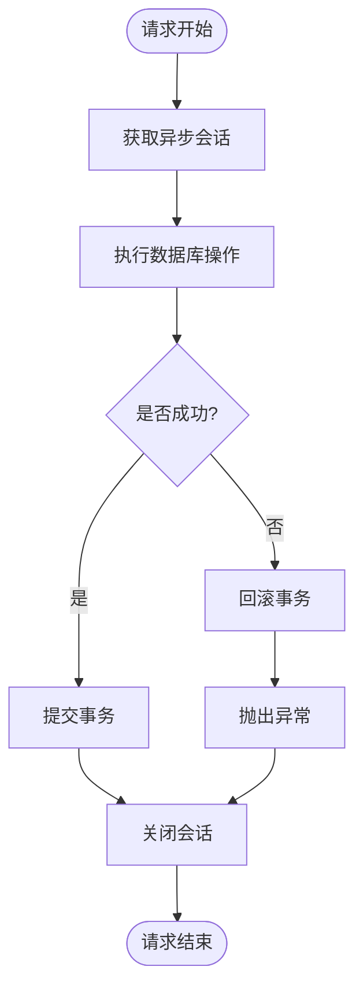

图表来源
- [src/infrastructure/database/connection.py:26-37](file://src/infrastructure/database/connection.py#L26-L37)
- [src/main.py:19-29](file://src/main.py#L19-L29)

章节来源
- [src/infrastructure/database/connection.py:1-51](file://src/infrastructure/database/connection.py#L1-L51)
- [src/main.py:19-29](file://src/main.py#L19-L29)

### 模型间关系映射
- 一对一：用户与用户-角色关联（通过 UserRole 间接体现）
- 一对多：用户 → 角色分配；角色 → 权限分配
- 多对多：角色 ↔ 权限（通过中间表 role_permissions）
- 级联策略：用户删除时级联删除其角色分配；角色/权限删除时级联删除中间表记录

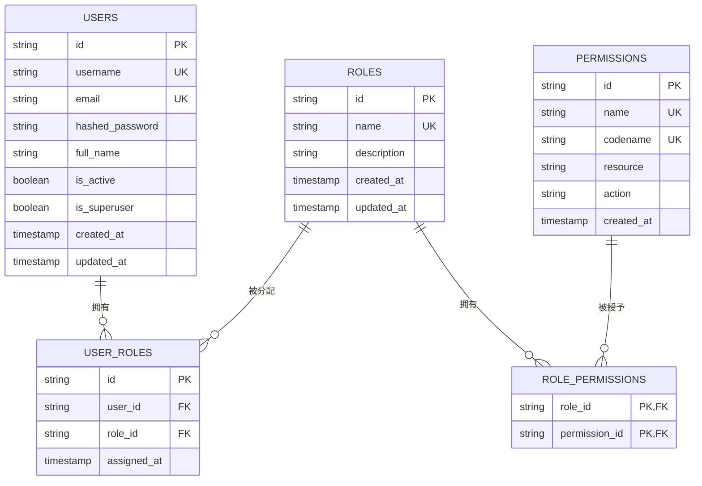

图表来源
- [src/domain/user/entities.py:19-34](file://src/domain/user/entities.py#L19-L34)
- [src/domain/rbac/entities.py:43-79](file://src/domain/rbac/entities.py#L43-L79)
- [src/domain/rbac/entities.py:11-17](file://src/domain/rbac/entities.py#L11-L17)

章节来源
- [src/domain/user/entities.py:19-34](file://src/domain/user/entities.py#L19-L34)
- [src/domain/rbac/entities.py:43-79](file://src/domain/rbac/entities.py#L43-L79)
- [src/domain/rbac/entities.py:11-17](file://src/domain/rbac/entities.py#L11-L17)

### 查询与仓储实现
- 用户仓储
  - 支持按 id/username/email 查询，使用 selectinload 预加载角色关系
  - 提供分页查询、创建、更新、删除与计数
- 角色与权限仓储
  - 角色：按 id/name 查询并预加载权限；支持用户角色查询
  - 权限：按 id/codename 查询；支持角色权限与用户权限查询
- 查询优化
  - 使用 selectinload 减少 N+1 查询
  - 在高频查询字段上建立索引（username、email、role_id、permission_id）

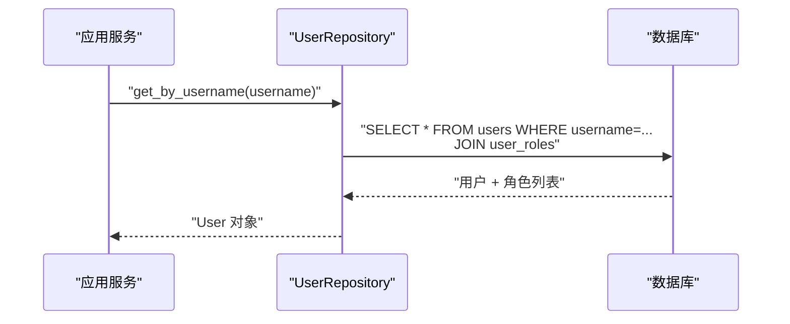

图表来源
- [src/infrastructure/repositories/user_repository.py:17-35](file://src/infrastructure/repositories/user_repository.py#L17-L35)
- [src/infrastructure/repositories/rbac_repository.py:68-76](file://src/infrastructure/repositories/rbac_repository.py#L68-L76)

章节来源
- [src/infrastructure/repositories/user_repository.py:1-61](file://src/infrastructure/repositories/user_repository.py#L1-L61)
- [src/infrastructure/repositories/rbac_repository.py:1-133](file://src/infrastructure/repositories/rbac_repository.py#L1-L133)

## 依赖关系分析
- 模型注册
  - models.py 导入所有实体，确保 SQLAlchemy 能在 create_all 时发现并创建表
- 会话与连接
  - connection.py 统一提供异步引擎、会话工厂与 Base 基类
  - main.py 在应用生命周期内调用 init_db()/close_db()
- 仓储接口与实现
  - domain 层定义抽象接口，infrastructure 层提供 SQLAlchemy 实现
  - 接口与实现分离，便于替换与测试

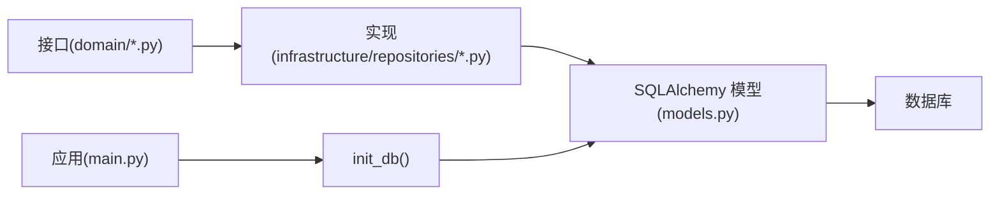

图表来源
- [src/domain/user/repository.py:8-50](file://src/domain/user/repository.py#L8-L50)
- [src/domain/rbac/repository.py:8-62](file://src/domain/rbac/repository.py#L8-L62)
- [src/infrastructure/repositories/user_repository.py:1-61](file://src/infrastructure/repositories/user_repository.py#L1-L61)
- [src/infrastructure/repositories/rbac_repository.py:1-133](file://src/infrastructure/repositories/rbac_repository.py#L1-L133)
- [src/infrastructure/database/models.py:1-10](file://src/infrastructure/database/models.py#L1-L10)
- [src/main.py:19-29](file://src/main.py#L19-L29)

章节来源
- [src/domain/user/repository.py:8-50](file://src/domain/user/repository.py#L8-L50)
- [src/domain/rbac/repository.py:8-62](file://src/domain/rbac/repository.py#L8-L62)
- [src/infrastructure/repositories/user_repository.py:1-61](file://src/infrastructure/repositories/user_repository.py#L1-L61)
- [src/infrastructure/repositories/rbac_repository.py:1-133](file://src/infrastructure/repositories/rbac_repository.py#L1-L133)
- [src/infrastructure/database/models.py:1-10](file://src/infrastructure/database/models.py#L1-L10)
- [src/main.py:19-29](file://src/main.py#L19-L29)

## 性能考虑
- 索引策略
  - 在高频过滤字段（如 username、email、role_id、permission_id、ip_address）建立索引
  - 复合索引用于常见查询模式（如用户-角色联合查询）
- 查询优化
  - 使用 selectinload 预加载关联关系，减少 N+1 查询
  - 分页查询时限制 limit，避免一次性加载过多数据
- 连接与缓存
  - 启用 pool_pre_ping 提升连接稳定性
  - 对热点数据使用 Redis 缓存（如令牌、用户信息、权限集合），降低数据库压力
- 写入优化
  - 批量插入与合并操作，减少往返次数
  - 合理使用 flush/refresh，避免不必要的查询

## 故障排除指南
- 会话与事务
  - 若出现“未提交/未回滚”问题，检查依赖注入中是否正确捕获异常并执行回滚
  - 确保每个请求使用独立会话，避免跨请求共享会话
- 表结构不一致
  - 启动时调用 init_db() 创建表；若需迁移，请结合 Alembic 进行版本化管理
- 权限查询异常
  - 确认 role_permissions 关联表存在且外键约束正确
  - 检查用户权限查询是否使用 distinct 去重
- 缓存连接
  - Redis 客户端延迟初始化，注意并发场景下的连接复用与关闭

章节来源
- [src/infrastructure/database/connection.py:26-37](file://src/infrastructure/database/connection.py#L26-L37)
- [src/infrastructure/cache/redis_client.py:9-27](file://src/infrastructure/cache/redis_client.py#L9-L27)

## 结论
本数据模型以清晰的领域边界与分层架构为基础，通过 SQLAlchemy ORM 实现了用户、角色、权限与安全规则的完整建模。模型具备良好的扩展性与可维护性，配合仓储层与会话管理机制，能够满足高并发场景下的性能与一致性需求。建议后续引入版本化迁移工具以完善数据库演进管理。

## 附录
- 数据库迁移与版本管理建议
  - 使用 Alembic 进行迁移脚本管理，基于 SQLAlchemy 模型生成初始迁移
  - 将模型变更纳入版本控制，每次发布前评估迁移风险
  - 在生产环境执行迁移前进行备份与灰度验证
- 令牌与会话存储建议
  - 访问令牌短期有效，刷新令牌长期有效但需严格保管
  - 可将刷新令牌存储于安全的短时缓存中，结合黑名单机制实现撤销
- 审计与监控
  - 记录关键操作的时间戳与操作者信息，便于审计
  - 监控慢查询与高并发场景下的数据库指标，及时优化