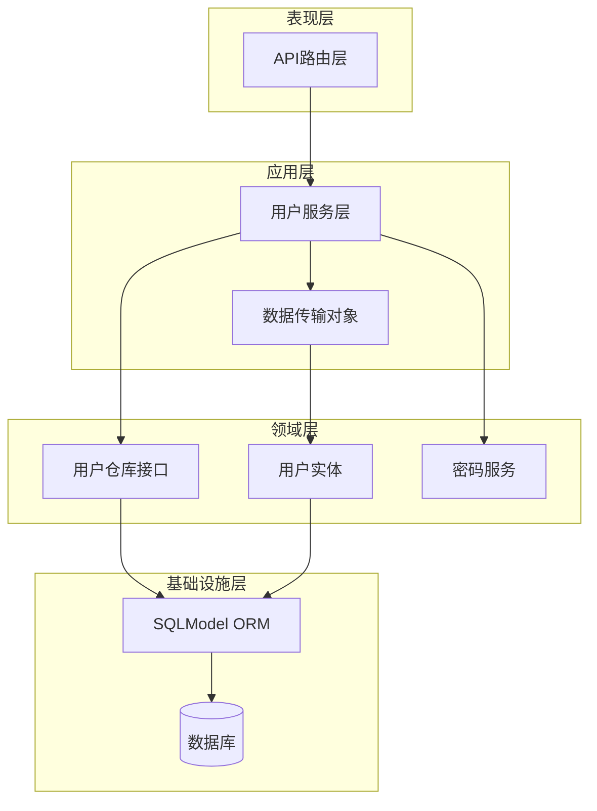
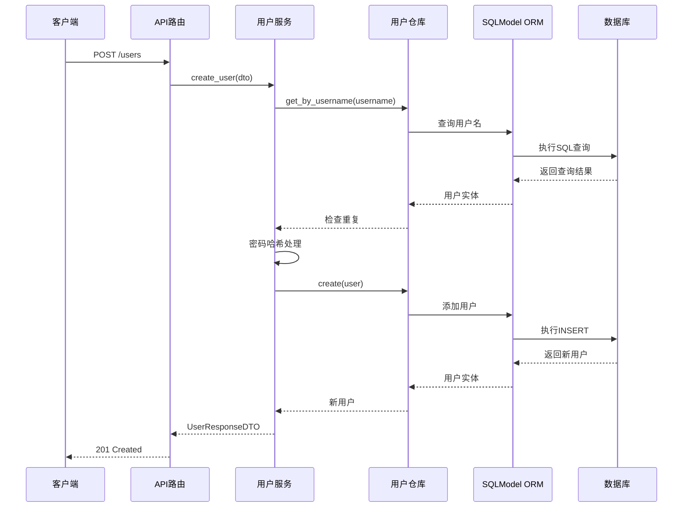
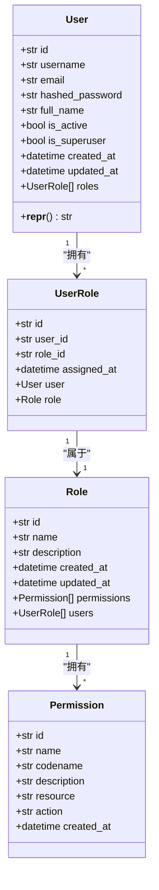
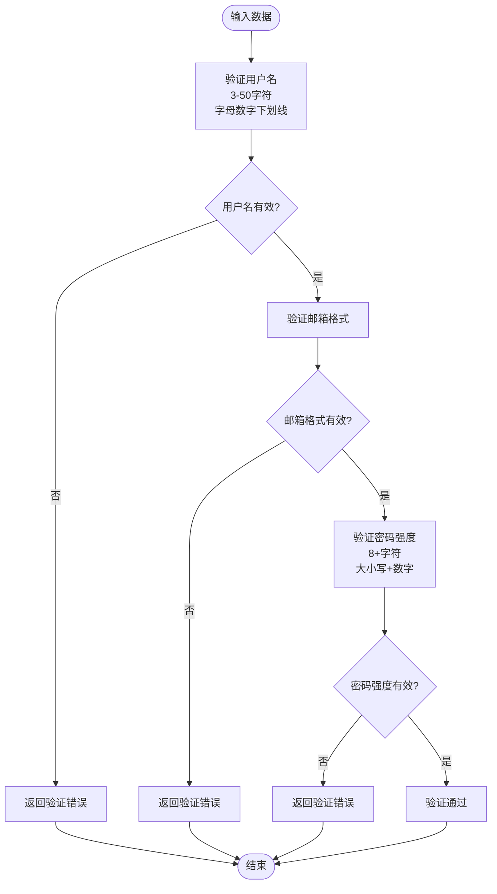
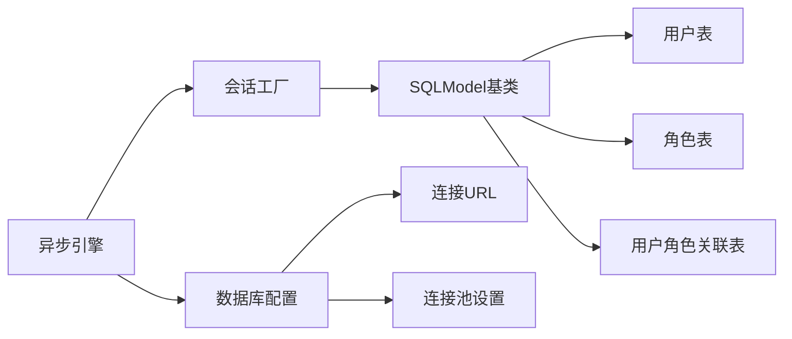
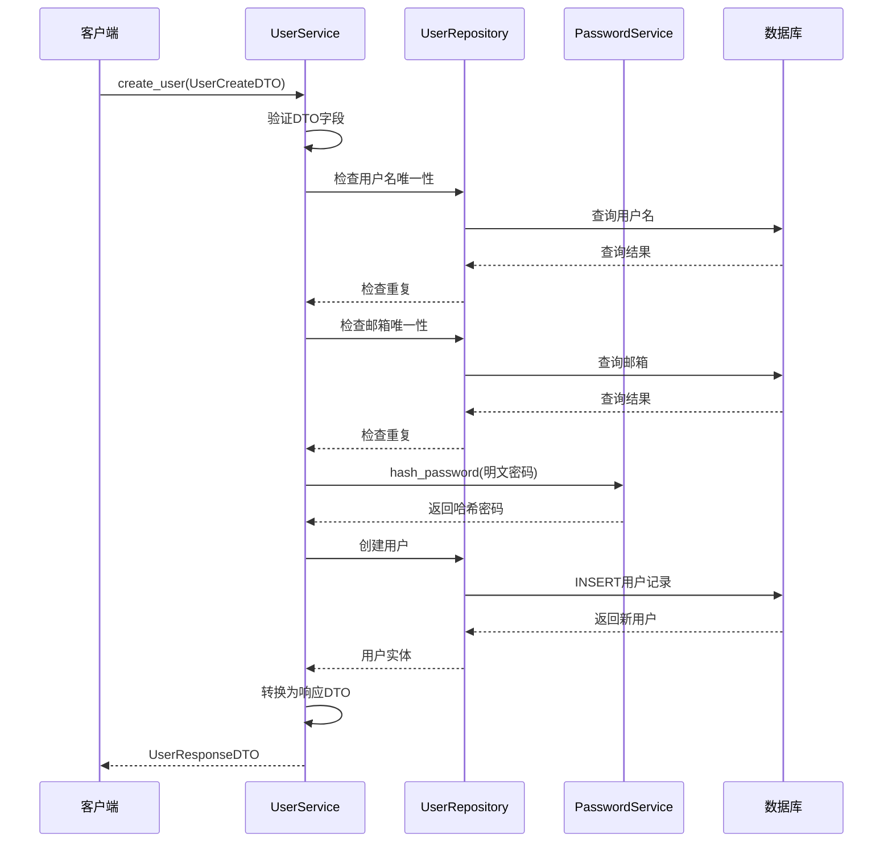
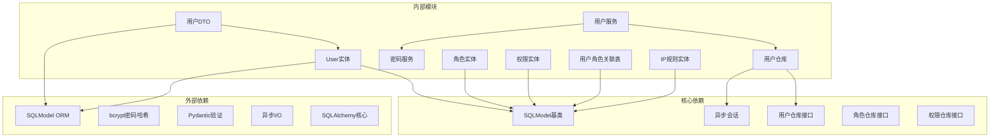

# 用户实体模型

<cite>
**本文档引用的文件**
- [src/infrastructure/database/models.py](file://src/infrastructure/database/models.py)
- [src/application/dto/user_dto.py](file://src/application/dto/user_dto.py)
- [src/infrastructure/database/connection.py](file://src/infrastructure/database/connection.py)
- [src/infrastructure/repositories/user_repository.py](file://src/infrastructure/repositories/user_repository.py)
- [src/application/services/user_service.py](file://src/application/services/user_service.py)
- [src/api/v1/user_routes.py](file://src/api/v1/user_routes.py)
- [src/domain/auth/password_service.py](file://src/domain/auth/password_service.py)
- [src/domain/rbac/repository.py](file://src/domain/rbac/repository.py)
- [src/core/validators.py](file://src/core/validators.py)
- [src/domain/user/repository.py](file://src/domain/user/repository.py)
</cite>

## 更新摘要
**所做更改**
- 完全迁移到SQLModel ORM框架，替代原有的SQLAlchemy配置
- 用户模型字段定义重构：使用SQLModel的Field装饰器替代mapped_column
- 关系定义使用SQLModel的Relationship替代SQLAlchemy的relationship
- 数据库连接和会话管理采用SQLModel的AsyncSession
- DTO对象现在继承自SQLModel，统一了数据模型定义

## 目录
1. [简介](#简介)
2. [项目结构](#项目结构)
3. [核心组件](#核心组件)
4. [架构概览](#架构概览)
5. [详细组件分析](#详细组件分析)
6. [依赖关系分析](#依赖关系分析)
7. [性能考虑](#性能考虑)
8. [故障排除指南](#故障排除指南)
9. [结论](#结论)

## 简介

本文件详细阐述了Hello-FastApi项目中的用户实体模型设计与实现。该系统采用分层架构，将用户实体作为领域模型的核心，通过DTO（数据传输对象）实现应用层与表现层的数据交互，利用SQLModel ORM进行数据库持久化。用户实体不仅包含基本的身份信息，还集成了基于角色的访问控制系统（RBAC），支持用户状态管理和权限控制。

**更新** 系统已完全迁移到SQLModel ORM框架，这是一个重大的架构升级，提供了更简洁的模型定义和更好的类型推断能力。

## 项目结构

用户实体模型在整个项目中跨越多个层次，形成了清晰的分层架构：

**图表来源**
- [src/api/v1/user_routes.py:1-115](file://src/api/v1/user_routes.py#L1-L115)
- [src/application/services/user_service.py:1-138](file://src/application/services/user_service.py#L1-L138)
- [src/infrastructure/database/models.py:33-61](file://src/infrastructure/database/models.py#L33-L61)

**章节来源**
- [src/api/v1/user_routes.py:1-115](file://src/api/v1/user_routes.py#L1-L115)
- [src/application/services/user_service.py:1-138](file://src/application/services/user_service.py#L1-L138)
- [src/infrastructure/database/models.py:33-61](file://src/infrastructure/database/models.py#L33-L61)

## 核心组件

### 用户实体类设计

用户实体是整个用户管理系统的核心聚合根，采用SQLModel ORM进行数据库映射。实体类的设计体现了以下关键特性：

#### 主要字段定义

| 字段名 | 数据类型 | 约束条件 | 描述 |
|--------|----------|----------|------|
| id | String(36) | 主键, 默认UUID | 用户唯一标识符 |
| username | String(50) | 唯一索引, 非空 | 用户登录名 |
| email | String(100) | 唯一索引, 非空 | 用户邮箱地址 |
| hashed_password | String(255) | 非空 | 加密后的用户密码 |
| full_name | String(100) | 可为空 | 用户全名 |
| is_active | Boolean | 默认True | 用户激活状态 |
| is_superuser | Boolean | 默认False | 超级用户权限标志 |
| created_at | DateTime | 服务器默认时间 | 创建时间戳 |
| updated_at | DateTime | 服务器默认时间, 更新时自动更新 | 最后更新时间戳 |

#### 状态字段设计

用户实体包含两个重要的状态字段：
- **激活状态 (`is_active`)**: 控制用户账户的有效性，影响用户能否进行系统操作
- **超级用户状态 (`is_superuser`)**: 提供系统最高权限，绕过大部分权限检查

#### 关系设计

用户实体与RBAC系统的集成通过UserRole关联表实现多对多关系，支持用户拥有多个角色和角色拥有多个用户。

**更新** 关系定义现在使用SQLModel的Relationship装饰器，提供了更好的类型推断和更简洁的语法。

**章节来源**
- [src/infrastructure/database/models.py:33-61](file://src/infrastructure/database/models.py#L33-L61)
- [src/infrastructure/database/models.py:122-144](file://src/infrastructure/database/models.py#L122-L144)

### 数据传输对象（DTO）

系统采用SQLModel模型实现数据传输对象，确保数据验证和序列化的一致性：

#### 用户创建DTO
- **username**: 3-50字符，仅允许字母数字和下划线
- **email**: 标准邮箱格式验证
- **password**: 8-128字符，强制要求大小写字母和数字
- **full_name**: 可选，最大100字符

#### 用户更新DTO
- **email**: 可选邮箱更新
- **full_name**: 可选全名更新
- **is_active**: 可选激活状态更新

#### 用户响应DTO
- 包含所有用户基本信息
- **roles**: 角色名称列表，默认为空数组
- 支持从ORM实体直接转换

**更新** DTO现在继承自SQLModel，统一了数据模型定义，减少了重复代码。

**章节来源**
- [src/application/dto/user_dto.py:9-54](file://src/application/dto/user_dto.py#L9-L54)

## 架构概览

用户实体模型遵循Clean Architecture原则，实现了清晰的职责分离：

**图表来源**
- [src/api/v1/user_routes.py:24-32](file://src/api/v1/user_routes.py#L24-L32)
- [src/application/services/user_service.py:28-43](file://src/application/services/user_service.py#L28-L43)
- [src/infrastructure/repositories/user_repository.py:33-37](file://src/infrastructure/repositories/user_repository.py#L33-L37)

## 详细组件分析

### 用户实体类详细分析

#### 类结构设计

**图表来源**
- [src/infrastructure/database/models.py:33-61](file://src/infrastructure/database/models.py#L33-L61)
- [src/infrastructure/database/models.py:122-144](file://src/infrastructure/database/models.py#L122-L144)

#### 字段约束分析

每个字段都经过精心设计以满足业务需求和安全要求：

**身份验证字段**
- `username`: 唯一性约束确保用户标识的唯一性
- `email`: 唯一性约束防止邮箱重复
- `hashed_password`: 存储加密后的密码，不存储明文

**状态管理字段**
- `is_active`: 控制用户账户的激活状态
- `is_superuser`: 提供系统管理员权限

**时间戳字段**
- `created_at`: 自动记录创建时间
- `updated_at`: 自动跟踪最后修改时间

**更新** 字段定义现在使用SQLModel的Field装饰器，提供了更好的类型推断和更简洁的语法。

**章节来源**
- [src/infrastructure/database/models.py:33-61](file://src/infrastructure/database/models.py#L33-L61)

### 数据验证规则

系统在多个层面实施数据验证：

#### SQLModel验证规则

**图表来源**
- [src/application/dto/user_dto.py:12-15](file://src/application/dto/user_dto.py#L12-L15)
- [src/core/validators.py:8-25](file://src/core/validators.py#L8-L25)

#### 应用层业务验证

用户服务层实施额外的业务逻辑验证：

- **唯一性检查**: 创建用户前检查用户名和邮箱的唯一性
- **权限验证**: 操作用户信息时验证调用者的权限
- **密码验证**: 修改密码时验证旧密码的正确性

**章节来源**
- [src/application/services/user_service.py:28-43](file://src/application/services/user_service.py#L28-L43)
- [src/application/services/user_service.py:65-82](file://src/application/services/user_service.py#L65-L82)

### ORM配置与数据库映射

#### 数据库连接配置

系统使用SQLModel异步引擎进行数据库操作：

**图表来源**
- [src/infrastructure/database/connection.py:9-13](file://src/infrastructure/database/connection.py#L9-L13)
- [src/infrastructure/database/connection.py:16-25](file://src/infrastructure/database/connection.py#L16-L25)

#### 模型注册机制

为了确保SQLModel能够发现所有表，系统采用显式导入机制：

- 在初始化数据库时导入所有模型文件
- 确保SQLModel.metadata包含所有ORM模型
- 支持动态创建和更新数据库表结构

**更新** 数据库连接现在使用SQLModel的AsyncSession，提供了更好的异步支持。

**章节来源**
- [src/infrastructure/database/connection.py:27-33](file://src/infrastructure/database/connection.py#L27-L33)
- [src/infrastructure/database/models.py:1-171](file://src/infrastructure/database/models.py#L1-L171)

### 使用示例和最佳实践

#### 创建用户的完整流程

**图表来源**
- [src/application/services/user_service.py:28-43](file://src/application/services/user_service.py#L28-L43)
- [src/domain/auth/password_service.py:10-15](file://src/domain/auth/password_service.py#L10-L15)

#### 最佳实践建议

1. **密码安全**: 始终使用PasswordService进行密码哈希，不要存储明文密码
2. **数据验证**: 在应用层和API层双重验证输入数据
3. **权限控制**: 严格检查操作权限，特别是用户信息修改和删除操作
4. **错误处理**: 统一处理数据库异常和业务异常
5. **性能优化**: 合理使用selectinload避免N+1查询问题

**更新** SQLModel提供了更好的类型推断，减少了运行时错误的可能性。

**章节来源**
- [src/application/services/user_service.py:120-137](file://src/application/services/user_service.py#L120-L137)
- [src/infrastructure/repositories/user_repository.py:17-56](file://src/infrastructure/repositories/user_repository.py#L17-L56)

## 依赖关系分析

用户实体模型的依赖关系体现了清晰的分层架构：

**图表来源**
- [src/infrastructure/database/models.py:12](file://src/infrastructure/database/models.py#L12)
- [src/application/dto/user_dto.py:6](file://src/application/dto/user_dto.py#L6)
- [src/domain/auth/password_service.py:3](file://src/domain/auth/password_service.py#L3)
- [src/domain/user/repository.py:8](file://src/domain/user/repository.py#L8)
- [src/domain/rbac/repository.py:8](file://src/domain/rbac/repository.py#L8)

### 循环依赖避免

系统通过字符串形式的关系引用避免了循环导入问题：

- User实体使用字符串"UserRole"引用关联实体
- UserRole实体使用字符串"User"和"Role"引用主实体
- 这种设计确保了模块导入的顺序无关性

**更新** SQLModel的Relationship装饰器提供了更好的循环依赖处理能力。

**章节来源**
- [src/infrastructure/database/models.py:55](file://src/infrastructure/database/models.py#L55)
- [src/infrastructure/database/models.py:140](file://src/infrastructure/database/models.py#L140)

## 性能考虑

### 查询优化策略

1. **批量加载**: 使用selectinload避免N+1查询问题
2. **索引优化**: 为常用查询字段建立数据库索引
3. **分页处理**: 支持大数据量的分页查询
4. **缓存策略**: 可扩展的缓存机制减少数据库压力

### 内存管理

- 异步会话生命周期管理
- 及时释放数据库连接
- 合理的事务边界控制

**更新** SQLModel提供了更好的内存管理和性能优化选项。

## 故障排除指南

### 常见问题及解决方案

#### 用户名或邮箱重复
**问题**: 创建用户时报用户名或邮箱已存在
**解决方案**: 
- 检查数据库中是否存在重复记录
- 确认业务逻辑中的唯一性检查是否正常工作

#### 密码验证失败
**问题**: 修改密码时报旧密码无效
**解决方案**:
- 确认旧密码是否正确
- 检查密码哈希算法是否一致

#### 权限不足
**问题**: 访问受保护的用户操作时报权限不足
**解决方案**:
- 检查调用者是否具有相应的RBAC权限
- 验证角色分配是否正确

**章节来源**
- [src/application/services/user_service.py:31-34](file://src/application/services/user_service.py#L31-L34)
- [src/application/services/user_service.py:96](file://src/application/services/user_service.py#L96)

## 结论

用户实体模型设计充分体现了现代Web应用的最佳实践：

1. **清晰的分层架构**: 领域模型、应用服务、数据传输对象各司其职
2. **强类型安全**: 使用SQLModel和Pydantic确保数据完整性
3. **安全性考虑**: 密码哈希、权限控制、输入验证全面覆盖
4. **可扩展性**: 基于RBAC的权限系统支持灵活的权限管理
5. **性能优化**: 异步数据库操作和查询优化策略

**更新** 完全迁移到SQLModel ORM后，系统获得了更好的性能和可维护性，同时保持了原有的Clean Architecture设计原则。新的模型定义更加符合Python生态系统标准，为构建企业级用户管理系统提供了坚实的基础。SQLModel的Field装饰器和Relationship定义提供了更简洁的语法和更好的类型推断能力，大大提升了开发体验和代码质量。