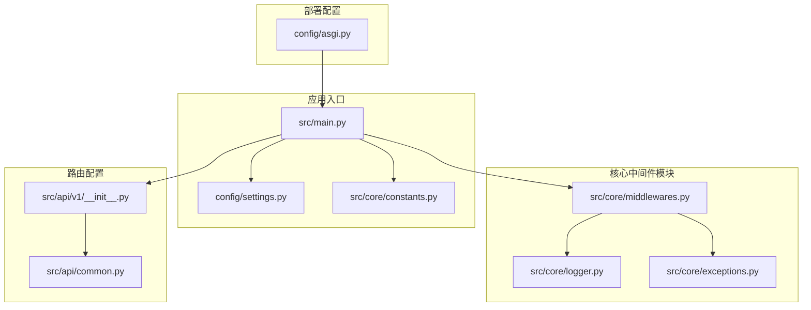
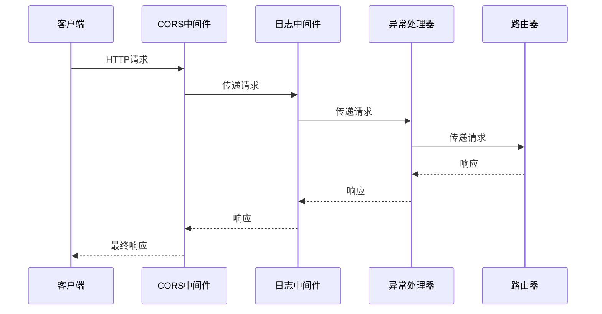
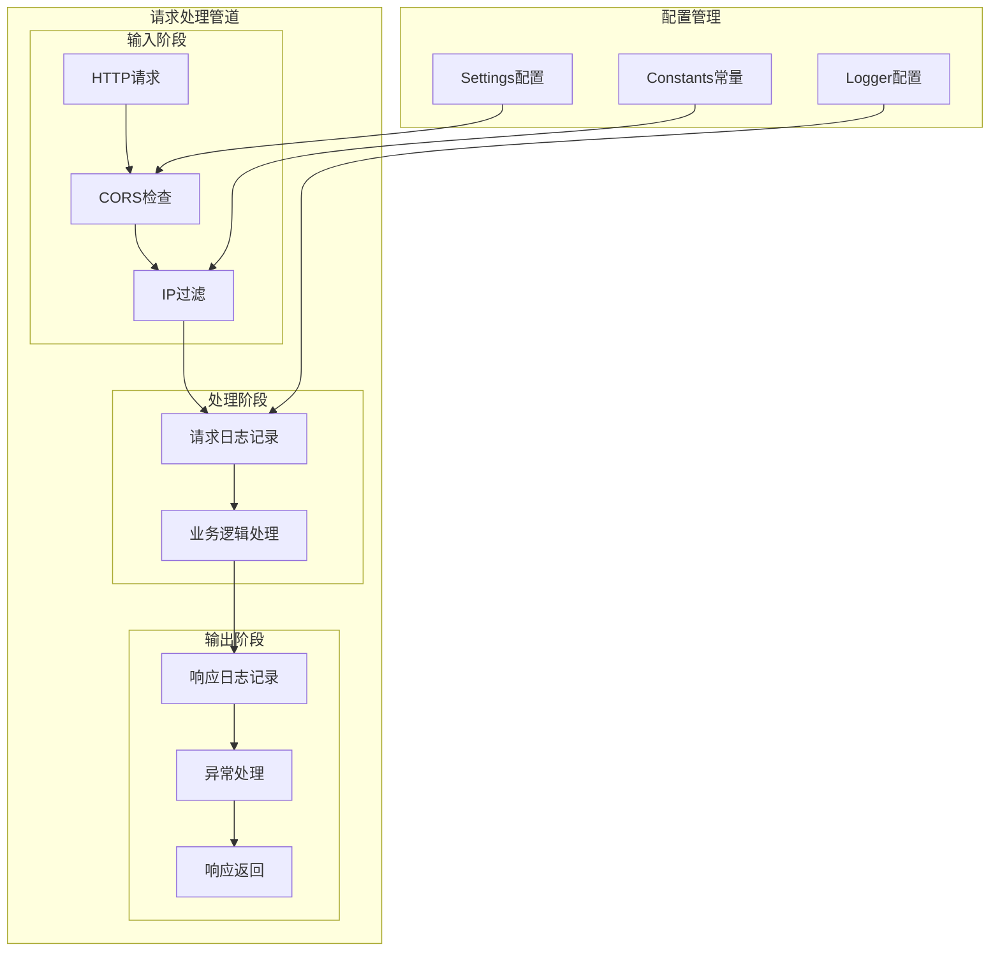
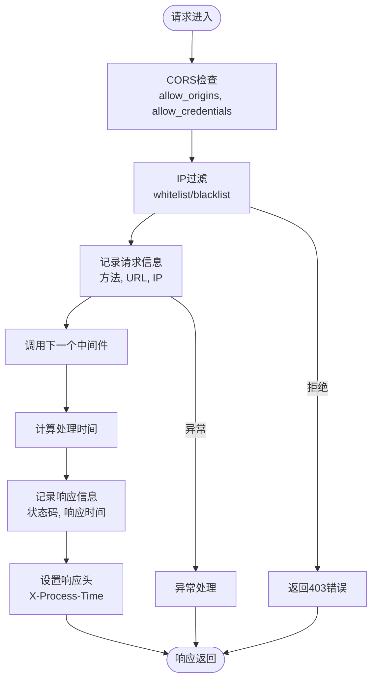
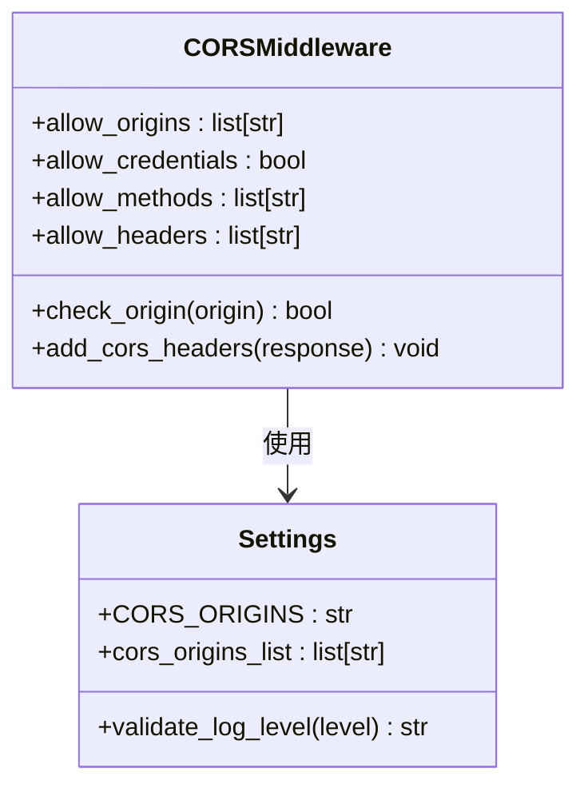
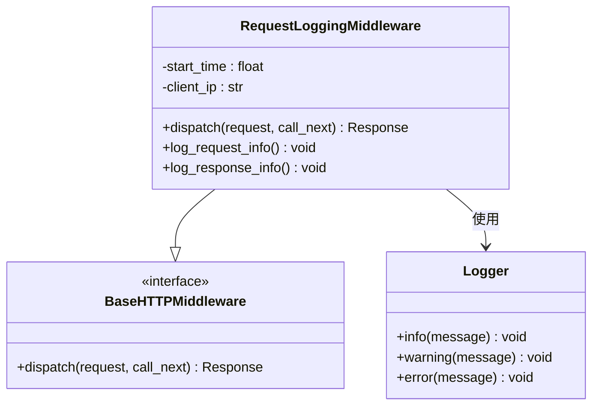
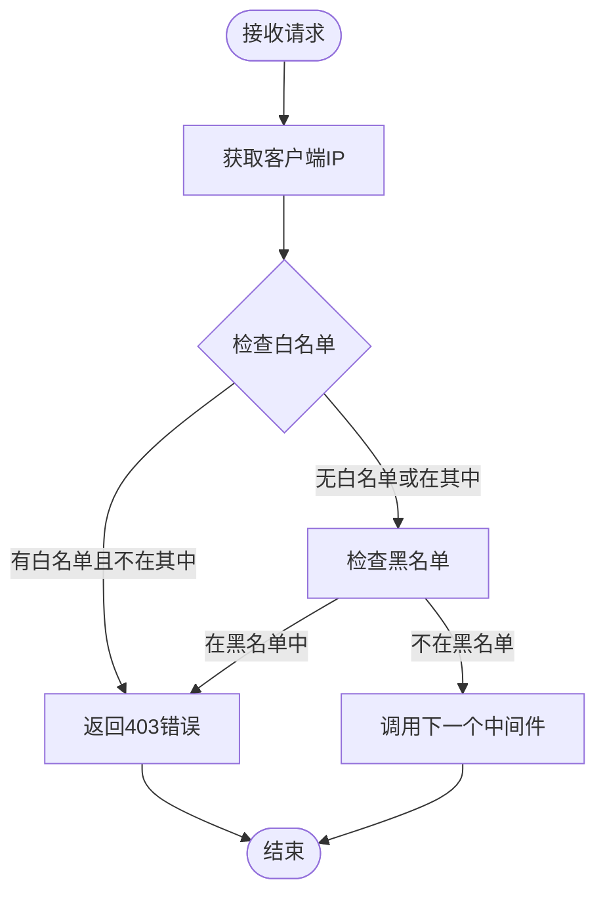
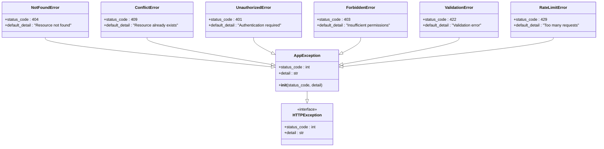
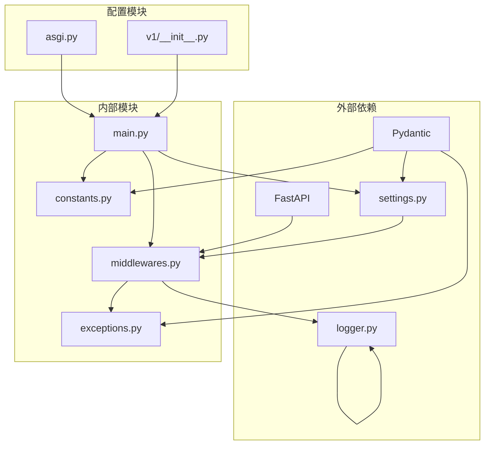

# 中间件系统设计

<cite>
**本文档引用的文件**
- [src/core/middlewares.py](file://src/core/middlewares.py)
- [src/main.py](file://src/main.py)
- [config/settings.py](file://config/settings.py)
- [src/core/logger.py](file://src/core/logger.py)
- [src/core/exceptions.py](file://src/core/exceptions.py)
- [config/asgi.py](file://config/asgi.py)
- [src/core/constants.py](file://src/core/constants.py)
- [src/api/v1/__init__.py](file://src/api/v1/__init__.py)
- [src/api/common.py](file://src/api/common.py)
</cite>

## 目录
1. [简介](#简介)
2. [项目结构](#项目结构)
3. [核心组件](#核心组件)
4. [架构概览](#架构概览)
5. [详细组件分析](#详细组件分析)
6. [依赖关系分析](#依赖关系分析)
7. [性能考虑](#性能考虑)
8. [故障排除指南](#故障排除指南)
9. [结论](#结论)

## 简介

Hello-FastApi项目采用模块化的中间件系统设计，通过FastAPI的中间件机制实现了请求处理管道的灵活控制。该系统包含CORS跨域处理、请求日志记录、IP黑白名单过滤等核心功能，并提供了统一的异常处理机制。

中间件系统遵循FastAPI的中间件架构，通过`BaseHTTPMiddleware`基类实现自定义中间件，确保与FastAPI生态系统的无缝集成。系统设计注重安全性、可维护性和性能优化。

## 项目结构

中间件系统在项目中的组织结构如下：

**图表来源**
- [src/core/middlewares.py:1-64](file://src/core/middlewares.py#L1-L64)
- [src/main.py:1-83](file://src/main.py#L1-L83)
- [config/settings.py:1-200](file://config/settings.py#L1-L200)

**章节来源**
- [src/core/middlewares.py:1-64](file://src/core/middlewares.py#L1-L64)
- [src/main.py:1-83](file://src/main.py#L1-L83)
- [config/settings.py:1-200](file://config/settings.py#L1-L200)

## 核心组件

### 中间件架构设计

中间件系统基于FastAPI的中间件机制构建，采用管道式处理架构：

**图表来源**
- [src/main.py:43-53](file://src/main.py#L43-L53)
- [src/core/middlewares.py:12-31](file://src/core/middlewares.py#L12-L31)

### 中间件注册顺序

中间件按照以下顺序注册和执行：

1. **CORS中间件** - 处理跨域请求
2. **请求日志中间件** - 记录请求和响应信息
3. **异常处理中间件** - 捕获和处理异常

这种顺序确保了：
- CORS头信息在所有请求中正确设置
- 所有请求都被记录和监控
- 异常得到统一处理

**章节来源**
- [src/main.py:43-69](file://src/main.py#L43-L69)

## 架构概览

### 中间件系统整体架构

**图表来源**
- [src/main.py:31-79](file://src/main.py#L31-L79)
- [config/settings.py:62-85](file://config/settings.py#L62-L85)
- [src/core/logger.py:12-45](file://src/core/logger.py#L12-L45)

### 数据流分析

中间件系统的数据流遵循以下模式：

**图表来源**
- [src/core/middlewares.py:15-31](file://src/core/middlewares.py#L15-L31)
- [src/core/middlewares.py:42-63](file://src/core/middlewares.py#L42-L63)

## 详细组件分析

### CORS中间件实现

#### 配置策略

CORS中间件采用灵活的安全配置策略：

**图表来源**
- [src/main.py:44-50](file://src/main.py#L44-L50)
- [config/settings.py:62-68](file://config/settings.py#L62-L68)

#### 跨域处理策略

CORS中间件实现了以下安全策略：

1. **源限制**：仅允许配置的源进行跨域访问
2. **凭据支持**：支持携带认证信息的请求
3. **方法白名单**：允许所有HTTP方法
4. **头部白名单**：允许所有请求头

配置选项说明：
- `allow_origins`: 允许的源列表，默认包含本地开发环境地址
- `allow_credentials`: 是否允许携带凭据
- `allow_methods`: 允许的HTTP方法
- `allow_headers`: 允许的请求头

**章节来源**
- [src/main.py:43-50](file://src/main.py#L43-L50)
- [config/settings.py:62-68](file://config/settings.py#L62-L68)

### 请求日志中间件

#### 实现原理

请求日志中间件采用装饰器模式实现，通过`dispatch`方法拦截请求和响应：

**图表来源**
- [src/core/middlewares.py:12-31](file://src/core/middlewares.py#L12-L31)
- [src/core/logger.py:12-45](file://src/core/logger.py#L12-L45)

#### 日志格式和级别

日志系统采用多处理器配置：

| 处理器类型 | 输出目标 | 日志级别 | 格式特点 |
|-----------|----------|----------|----------|
| 控制台处理器 | stdout | 可配置 | 彩色输出，包含时间、级别、位置信息 |
| 应用程序日志 | logs/app.log | INFO及以上 | 结构化日志，带时间戳 |
| 错误日志 | logs/error.log | ERROR及以上 | 压缩存储，保留30天 |

日志字段包含：
- 时间戳：精确到秒
- 日志级别：左对齐，宽度8字符
- 模块信息：文件名:函数名:行号
- 消息内容：实际日志信息

**章节来源**
- [src/core/middlewares.py:15-31](file://src/core/middlewares.py#L15-L31)
- [src/core/logger.py:12-45](file://src/core/logger.py#L12-L45)

### IP过滤中间件

#### 实现机制

IP过滤中间件提供了灵活的访问控制机制：

**图表来源**
- [src/core/middlewares.py:34-63](file://src/core/middlewares.py#L34-L63)

#### 过滤策略

中间件支持两种过滤模式：

1. **白名单模式**：仅允许指定IP访问，其他IP一律拒绝
2. **黑名单模式**：阻止指定IP访问，其他IP正常通行

配置参数：
- `blacklist`: 黑名单IP集合
- `whitelist`: 白名单IP集合

**章节来源**
- [src/core/middlewares.py:34-63](file://src/core/middlewares.py#L34-L63)

### 异常处理中间件

#### 设计架构

异常处理系统采用分层异常处理机制：

**图表来源**
- [src/core/exceptions.py:6-52](file://src/core/exceptions.py#L6-L52)

#### 错误响应格式化

异常处理中间件提供统一的错误响应格式：

| 异常类型 | HTTP状态码 | 错误详情 | 响应格式 |
|----------|------------|----------|----------|
| AppException | 自定义 | 自定义详情 | `{"detail": "错误信息"}` |
| NotFoundError | 404 | "Resource not found" | 标准错误响应 |
| ConflictError | 409 | "Resource already exists" | 标准错误响应 |
| UnauthorizedError | 401 | "Authentication required" | 标准错误响应 |
| ForbiddenError | 403 | "Insufficient permissions" | 标准错误响应 |
| ValidationError | 422 | "Validation error" | 标准错误响应 |
| RateLimitError | 429 | "Too many requests" | 标准错误响应 |
| 未处理异常 | 500 | "Internal server error" | 标准错误响应 |

**章节来源**
- [src/core/exceptions.py:6-52](file://src/core/exceptions.py#L6-L52)
- [src/main.py:55-69](file://src/main.py#L55-L69)

## 依赖关系分析

### 组件依赖图

**图表来源**
- [src/core/middlewares.py:6-9](file://src/core/middlewares.py#L6-L9)
- [src/main.py:6-16](file://src/main.py#L6-L16)
- [config/settings.py:19-37](file://config/settings.py#L19-L37)

### 关键依赖关系

1. **FastAPI依赖**：中间件继承自`BaseHTTPMiddleware`
2. **配置依赖**：Settings类提供CORS配置和日志级别
3. **日志依赖**：Loguru提供高性能的日志记录能力
4. **异常依赖**：Pydantic提供数据验证和模型定义

**章节来源**
- [src/core/middlewares.py:6-9](file://src/core/middlewares.py#L6-L9)
- [src/main.py:6-16](file://src/main.py#L6-L16)
- [config/settings.py:19-37](file://config/settings.py#L19-L37)

## 性能考虑

### 中间件执行效率

中间件系统在设计时充分考虑了性能优化：

#### 时间复杂度分析

| 中间件类型 | 时间复杂度 | 空间复杂度 | 性能特征 |
|-----------|------------|------------|----------|
| CORS中间件 | O(1) | O(1) | 字符串匹配，常数时间 |
| 日志中间件 | O(1) | O(1) | 时间戳计算，常数时间 |
| IP过滤中间件 | O(1) | O(n) | 集合查找，平均O(1) |
| 异常处理 | O(1) | O(1) | 字典查找，常数时间 |

#### 内存使用优化

1. **连接池复用**：数据库连接在应用生命周期内复用
2. **配置缓存**：Settings使用LRU缓存减少重复解析
3. **日志异步写入**：Loguru支持异步日志写入
4. **响应头缓存**：处理时间作为响应头缓存

### 性能监控指标

中间件系统提供以下性能监控能力：

1. **请求处理时间**：通过`X-Process-Time`响应头提供
2. **日志级别控制**：根据环境动态调整日志详细程度
3. **内存使用监控**：定期检查内存使用情况
4. **错误率统计**：记录各类异常的发生频率

**章节来源**
- [src/core/middlewares.py:23-31](file://src/core/middlewares.py#L23-L31)
- [src/core/logger.py:12-45](file://src/core/logger.py#L12-L45)

## 故障排除指南

### 常见问题诊断

#### CORS相关问题

**问题1：跨域请求被拒绝**
- 检查`CORS_ORIGINS`配置是否包含正确的源地址
- 验证`allow_credentials`设置是否符合需求
- 确认浏览器发送的Origin头是否匹配

**问题2：预检请求失败**
- 检查`allow_methods`和`allow_headers`配置
- 验证预检请求的HTTP方法和头部

#### 日志相关问题

**问题3：日志不显示**
- 检查`LOG_LEVEL`配置是否正确
- 验证日志文件权限和磁盘空间
- 确认Loguru处理器配置

**问题4：日志过大**
- 调整`rotation`和`retention`参数
- 检查压缩设置是否启用

#### 异常处理问题

**问题5：异常未被捕获**
- 检查异常处理器注册顺序
- 验证异常类型是否正确
- 确认异常处理函数签名

**章节来源**
- [src/main.py:43-69](file://src/main.py#L43-L69)
- [config/settings.py:74-85](file://config/settings.py#L74-L85)
- [src/core/logger.py:12-45](file://src/core/logger.py#L12-L45)

### 调试技巧

1. **开发环境调试**：启用`DEBUG=True`获取详细错误信息
2. **日志级别调整**：在开发环境中使用`DEBUG`级别
3. **中间件链路跟踪**：通过日志确认中间件执行顺序
4. **异常堆栈分析**：利用FastAPI的调试模式获取完整堆栈

## 结论

Hello-FastApi项目的中间件系统设计体现了现代Web应用的安全性、可维护性和性能优化要求。通过模块化的中间件架构，系统实现了：

1. **安全的跨域处理**：灵活的CORS配置确保了Web应用的安全访问
2. **全面的请求监控**：详细的日志记录提供了完整的请求追踪能力
3. **可靠的异常管理**：统一的异常处理机制保证了服务的稳定性
4. **高效的性能表现**：优化的中间件执行顺序和资源配置确保了最佳性能

该中间件系统为后续的功能扩展提供了良好的基础，开发者可以在此基础上添加更多定制化的中间件来满足特定的业务需求。