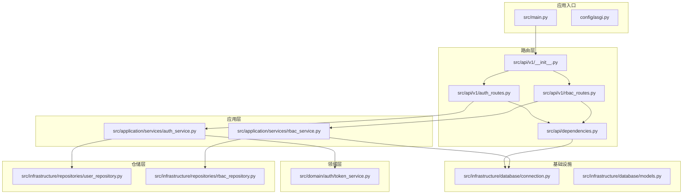
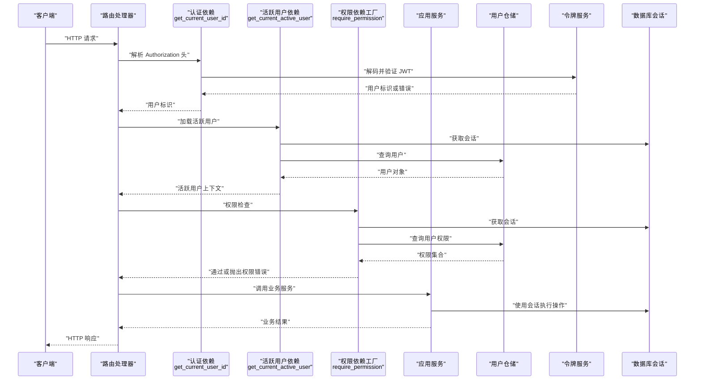
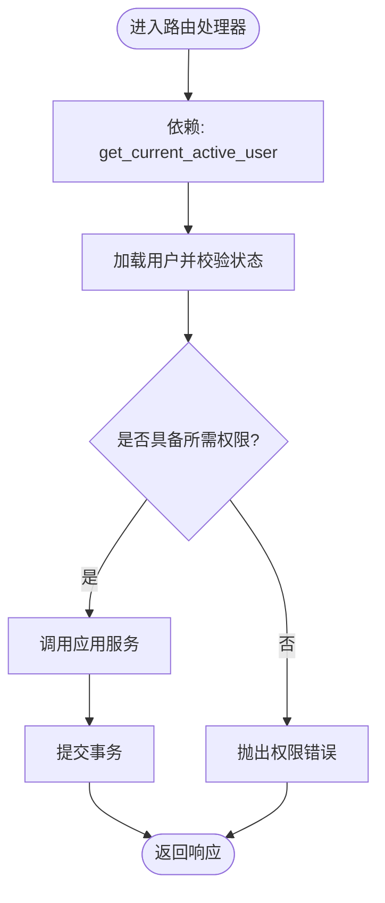
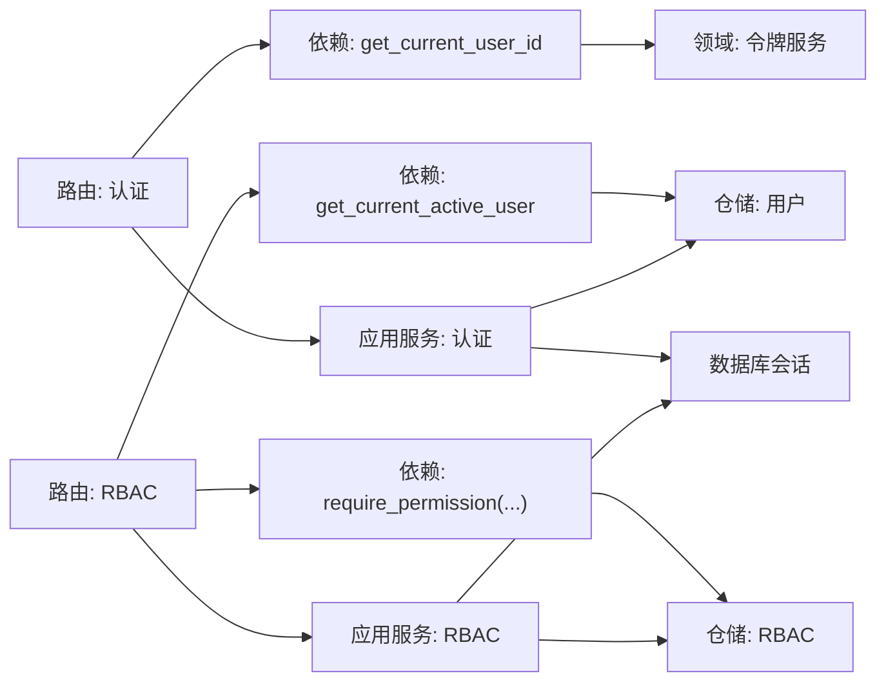

# 依赖注入与配置

<cite>
**本文引用的文件**
- [src/api/dependencies.py](file://src/api/dependencies.py)
- [src/infrastructure/database/connection.py](file://src/infrastructure/database/connection.py)
- [src/main.py](file://src/main.py)
- [src/api/v1/auth_routes.py](file://src/api/v1/auth_routes.py)
- [src/api/v1/rbac_routes.py](file://src/api/v1/rbac_routes.py)
- [src/domain/auth/token_service.py](file://src/domain/auth/token_service.py)
- [src/infrastructure/repositories/user_repository.py](file://src/infrastructure/repositories/user_repository.py)
- [src/application/services/auth_service.py](file://src/application/services/auth_service.py)
- [src/application/services/rbac_service.py](file://src/application/services/rbac_service.py)
- [src/api/v1/__init__.py](file://src/api/v1/__init__.py)
- [src/api/common.py](file://src/api/common.py)
- [src/core/middlewares.py](file://src/core/middlewares.py)
- [src/infrastructure/database/models.py](file://src/infrastructure/database/models.py)
- [src/infrastructure/repositories/rbac_repository.py](file://src/infrastructure/repositories/rbac_repository.py)
</cite>

## 更新摘要
**变更内容**
- 删除了Django风格的服务接口定义（src/application/interfaces/...）
- 依赖注入模式简化，直接使用FastAPI依赖系统
- 应用服务通过构造函数注入依赖，而非接口抽象
- 依赖函数在src/api/dependencies.py中集中管理

## 目录
1. [简介](#简介)
2. [项目结构](#项目结构)
3. [核心组件](#核心组件)
4. [架构总览](#架构总览)
5. [详细组件分析](#详细组件分析)
6. [依赖关系分析](#依赖关系分析)
7. [性能考虑](#性能考虑)
8. [故障排查指南](#故障排查指南)
9. [结论](#结论)
10. [附录](#附录)

## 简介
本文件系统化梳理 Hello-FastApi 项目的依赖注入与配置体系，重点覆盖以下方面：
- **简化后的FastAPI依赖注入机制**：依赖函数的定义、作用域管理、依赖链解析与执行顺序。
- 全局依赖与局部依赖的区别与使用场景：如何通过依赖注入实现服务解耦与可测试性。
- 依赖在路由层的应用：认证依赖、权限检查依赖等。
- 循环依赖的避免策略与最佳实践：依赖的重用与替换机制。

**更新** 项目已简化依赖注入模式，移除了Django风格的服务接口定义，采用更直接的FastAPI依赖系统。

## 项目结构
项目采用分层架构与功能模块化组织，依赖注入主要集中在以下位置：
- 应用入口与生命周期：应用工厂、中间件、异常处理、健康检查。
- 数据库会话提供：异步数据库会话依赖与事务控制。
- 路由与依赖：认证与权限依赖、路由层依赖调用。
- 应用服务：认证与 RBAC 服务，直接依赖仓储与数据库会话。

**图表来源**
- [src/main.py:31-83](file://src/main.py#L31-L83)
- [src/api/v1/__init__.py:9-15](file://src/api/v1/__init__.py#L9-L15)
- [src/api/v1/auth_routes.py:14-34](file://src/api/v1/auth_routes.py#L14-L34)
- [src/api/v1/rbac_routes.py:25-168](file://src/api/v1/rbac_routes.py#L25-L168)
- [src/api/dependencies.py:16-83](file://src/api/dependencies.py#L16-L83)
- [src/infrastructure/database/connection.py:26-37](file://src/infrastructure/database/connection.py#L26-L37)
- [src/application/services/auth_service.py:12-66](file://src/application/services/auth_service.py#L12-L66)
- [src/application/services/rbac_service.py:20-158](file://src/application/services/rbac_service.py#L20-L158)
- [src/domain/auth/token_service.py:9-41](file://src/domain/auth/token_service.py#L9-L41)
- [src/infrastructure/repositories/user_repository.py:11-61](file://src/infrastructure/repositories/user_repository.py#L11-L61)
- [src/infrastructure/repositories/rbac_repository.py](file://src/infrastructure/repositories/rbac_repository.py)

**章节来源**
- [src/main.py:31-83](file://src/main.py#L31-L83)
- [src/api/v1/__init__.py:9-15](file://src/api/v1/__init__.py#L9-L15)

## 核心组件
- **数据库会话依赖**：提供异步数据库会话，自动提交、回滚与关闭，确保每个请求的会话隔离与一致性。
- **认证依赖**：从 Authorization 头解析并验证 JWT，提取用户标识，校验令牌有效性与类型。
- **活跃用户依赖**：基于认证依赖，加载并校验用户状态（启用/禁用）。
- **权限依赖工厂**：按权限码动态生成权限检查依赖，支持超级用户豁免。
- **超级用户依赖**：快速校验用户是否为超级用户。
- **应用服务**：认证服务与 RBAC 服务，直接依赖仓储与数据库会话完成业务逻辑。

**更新** 应用服务现在通过构造函数直接注入依赖，无需接口抽象。

**章节来源**
- [src/infrastructure/database/connection.py:26-37](file://src/infrastructure/database/connection.py#L26-L37)
- [src/api/dependencies.py:16-83](file://src/api/dependencies.py#L16-L83)
- [src/application/services/auth_service.py:12-66](file://src/application/services/auth_service.py#L12-L66)
- [src/application/services/rbac_service.py:20-158](file://src/application/services/rbac_service.py#L20-L158)

## 架构总览
下图展示了简化后依赖注入在请求生命周期中的流转：路由层通过依赖函数获取认证上下文与数据库会话，应用服务直接使用仓储与会话执行业务逻辑，最终返回响应。

**图表来源**
- [src/api/v1/auth_routes.py:14-34](file://src/api/v1/auth_routes.py#L14-L34)
- [src/api/v1/rbac_routes.py:25-168](file://src/api/v1/rbac_routes.py#L25-L168)
- [src/api/dependencies.py:16-83](file://src/api/dependencies.py#L16-L83)
- [src/application/services/auth_service.py:12-66](file://src/application/services/auth_service.py#L12-L66)
- [src/application/services/rbac_service.py:20-158](file://src/application/services/rbac_service.py#L20-L158)
- [src/infrastructure/repositories/user_repository.py:11-61](file://src/infrastructure/repositories/user_repository.py#L11-L61)
- [src/domain/auth/token_service.py:9-41](file://src/domain/auth/token_service.py#L9-L41)
- [src/infrastructure/database/connection.py:26-37](file://src/infrastructure/database/connection.py#L26-L37)

## 详细组件分析

### 依赖函数与作用域管理
- **get_current_user_id**：从 Authorization 头中提取凭据，调用令牌服务进行解码与类型校验，失败时抛出未授权错误。
- **get_current_active_user**：依赖 get_current_user_id，获取数据库会话并加载用户，校验用户是否存在与启用状态。
- **require_permission(codename)**：依赖工厂，返回一个异步依赖函数，内部依赖 get_current_active_user 与数据库会话，检查用户是否具备指定权限码；超级用户直接放行。
- **require_superuser()**：依赖工厂，返回一个异步依赖函数，依赖 get_current_active_user，若非超级用户则抛出禁止访问错误。

**作用域与生命周期**：
- 依赖函数在每次请求中按需解析与执行，确保上下文隔离。
- 数据库会话依赖在每次请求中创建与销毁，自动提交或回滚，保证事务边界清晰。

**章节来源**
- [src/api/dependencies.py:16-83](file://src/api/dependencies.py#L16-L83)
- [src/infrastructure/database/connection.py:26-37](file://src/infrastructure/database/connection.py#L26-L37)

### 全局依赖与局部依赖
- **全局依赖**：数据库会话依赖在路由层广泛复用，通过 Depends(get_db) 统一注入，确保所有路由共享一致的会话生命周期。
- **局部依赖**：认证与权限依赖仅在需要鉴权与授权的路由上使用，避免对匿名或公开接口造成额外开销。
- **依赖重用与替换**：权限依赖工厂按 codename 动态生成，可在不同路由灵活组合；认证链路可被其他依赖复用，便于替换与扩展。

**章节来源**
- [src/api/v1/auth_routes.py:14-34](file://src/api/v1/auth_routes.py#L14-L34)
- [src/api/v1/rbac_routes.py:25-168](file://src/api/v1/rbac_routes.py#L25-L168)
- [src/api/dependencies.py:53-83](file://src/api/dependencies.py#L53-L83)

### 路由层依赖应用
- **认证路由**：登录与刷新令牌接口直接依赖数据库会话，内部构造应用服务实例并调用业务逻辑。
- **用户信息路由**：依赖 get_current_active_user，直接返回当前用户上下文。
- **RBAC 路由**：大量端点依赖 require_permission 工厂生成的权限检查依赖，确保细粒度权限控制。

**图表来源**
- [src/api/v1/auth_routes.py:14-34](file://src/api/v1/auth_routes.py#L14-L34)
- [src/api/v1/rbac_routes.py:25-168](file://src/api/v1/rbac_routes.py#L25-L168)
- [src/api/dependencies.py:34-83](file://src/api/dependencies.py#L34-L83)

**章节来源**
- [src/api/v1/auth_routes.py:14-34](file://src/api/v1/auth_routes.py#L14-L34)
- [src/api/v1/rbac_routes.py:25-168](file://src/api/v1/rbac_routes.py#L25-L168)

### 依赖链解析与执行顺序
- **解析顺序**：FastAPI 自顶向下解析依赖树，先解析高层依赖（如 get_current_active_user），再解析其子依赖（如 get_current_user_id 与数据库会话）。
- **执行顺序**：依赖函数按依赖树拓扑顺序执行，同一层级的依赖并发执行，不同层级按依赖关系串行。
- **并发与隔离**：数据库会话在依赖函数内创建与销毁，避免跨请求污染；权限检查在活跃用户上下文之后执行，减少无效计算。

**章节来源**
- [src/api/dependencies.py:16-83](file://src/api/dependencies.py#L16-L83)
- [src/infrastructure/database/connection.py:26-37](file://src/infrastructure/database/connection.py#L26-L37)

### 循环依赖的避免策略
- **明确依赖方向**：认证依赖位于权限依赖之前，避免反向依赖。
- **依赖工厂模式**：通过 require_permission 与 require_superuser 返回依赖函数，避免在模块导入时直接实例化深层依赖。
- **最小化共享状态**：依赖函数尽量只依赖必要的服务与会话，避免跨模块共享可变状态。

**章节来源**
- [src/api/dependencies.py:53-83](file://src/api/dependencies.py#L53-L83)

### 依赖注入在认证与权限中的最佳实践
- **使用依赖工厂按需生成权限检查器**，统一错误处理与日志记录。
- **将认证与权限检查分离**，优先进行认证，再进行权限校验，提升可读性与可维护性。
- **在路由层仅声明依赖**，具体业务逻辑放入应用服务，增强可测试性与可替换性。

**更新** 应用服务现在直接通过构造函数注入依赖，无需接口抽象，简化了依赖注入模式。

**章节来源**
- [src/api/dependencies.py:53-83](file://src/api/dependencies.py#L53-L83)
- [src/application/services/auth_service.py:12-66](file://src/application/services/auth_service.py#L12-L66)
- [src/application/services/rbac_service.py:20-158](file://src/application/services/rbac_service.py#L20-L158)

## 依赖关系分析
下图展示简化后依赖注入在各层之间的关系：路由层依赖认证与权限依赖，认证与权限依赖依赖数据库会话与令牌服务，应用服务直接依赖仓储与会话。

**图表来源**
- [src/api/v1/auth_routes.py:14-34](file://src/api/v1/auth_routes.py#L14-L34)
- [src/api/v1/rbac_routes.py:25-168](file://src/api/v1/rbac_routes.py#L25-L168)
- [src/api/dependencies.py:16-83](file://src/api/dependencies.py#L16-L83)
- [src/application/services/auth_service.py:12-66](file://src/application/services/auth_service.py#L12-L66)
- [src/application/services/rbac_service.py:20-158](file://src/application/services/rbac_service.py#L20-L158)
- [src/domain/auth/token_service.py:9-41](file://src/domain/auth/token_service.py#L9-L41)
- [src/infrastructure/repositories/user_repository.py:11-61](file://src/infrastructure/repositories/user_repository.py#L11-L61)
- [src/infrastructure/database/connection.py:26-37](file://src/infrastructure/database/connection.py#L26-L37)
- [src/infrastructure/repositories/rbac_repository.py](file://src/infrastructure/repositories/rbac_repository.py)

**章节来源**
- [src/api/dependencies.py:16-83](file://src/api/dependencies.py#L16-L83)
- [src/infrastructure/database/connection.py:26-37](file://src/infrastructure/database/connection.py#L26-L37)

## 性能考虑
- **会话生命周期**：数据库会话在依赖函数内创建与销毁，避免长生命周期持有连接，降低资源占用。
- **依赖复用**：认证与权限依赖在多个路由中复用，减少重复逻辑与对象创建。
- **事务边界**：会话在依赖函数中自动提交或回滚，确保事务边界清晰，避免长时间持有锁。
- **中间件开销**：请求日志中间件在每次请求中记录请求与响应信息，建议在生产环境合理配置日志级别。

**章节来源**
- [src/infrastructure/database/connection.py:26-37](file://src/infrastructure/database/connection.py#L26-L37)
- [src/core/middlewares.py:12-31](file://src/core/middlewares.py#L12-L31)

## 故障排查指南
- **未授权错误**：当令牌无效、过期或类型不匹配时，认证依赖会抛出未授权错误；检查令牌生成与传递流程。
- **权限不足**：权限依赖检查失败会抛出禁止访问错误；确认用户权限与所需 codename 是否一致。
- **用户不存在或禁用**：活跃用户依赖在用户不存在或禁用时抛出未授权错误；检查用户状态与仓储查询。
- **数据库异常**：会话依赖在异常时自动回滚并重新抛出；检查数据库连接与 SQL 语句。
- **异常处理**：应用全局异常处理器将 AppException 与通用异常转换为标准 JSON 响应；确保错误信息清晰且不泄露敏感数据。

**章节来源**
- [src/api/dependencies.py:16-83](file://src/api/dependencies.py#L16-L83)
- [src/infrastructure/database/connection.py:26-37](file://src/infrastructure/database/connection.py#L26-L37)
- [src/main.py:55-70](file://src/main.py#L55-L70)

## 结论
本项目通过简化的依赖注入模式，实现了认证、权限与数据库会话的解耦与可测试性。移除了Django风格的服务接口定义后，依赖注入更加直接和高效。路由层仅负责声明依赖，业务逻辑集中在应用服务，配合仓储与领域服务，形成清晰的依赖注入链路。通过合理的依赖作用域管理与事务边界控制，提升了系统的可维护性与运行效率。

**更新** 新的依赖注入模式更加简洁，减少了抽象层次，提高了开发效率。

## 附录
- **令牌服务**：提供访问令牌与刷新令牌的创建、解码与类型校验，作为认证依赖的核心支撑。
- **用户仓储**：封装用户实体的查询与持久化操作，供应用服务与依赖函数使用。
- **RBAC 仓储**：封装角色与权限实体的查询与管理操作，供RBAC应用服务使用。
- **路由聚合**：v1 路由聚合包含认证、用户与 RBAC 子路由，统一前缀与标签管理。

**章节来源**
- [src/domain/auth/token_service.py:9-41](file://src/domain/auth/token_service.py#L9-L41)
- [src/infrastructure/repositories/user_repository.py:11-61](file://src/infrastructure/repositories/user_repository.py#L11-L61)
- [src/infrastructure/repositories/rbac_repository.py](file://src/infrastructure/repositories/rbac_repository.py)
- [src/api/v1/__init__.py:9-15](file://src/api/v1/__init__.py#L9-L15)
- [src/api/common.py:6-23](file://src/api/common.py#L6-L23)