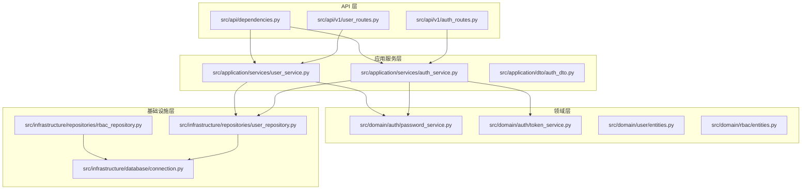
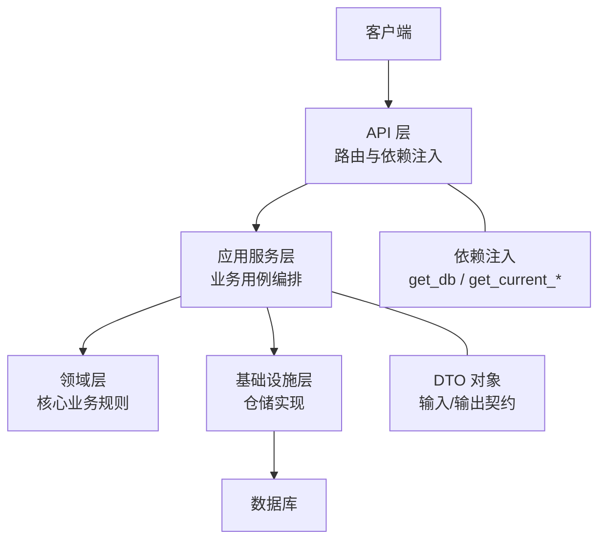
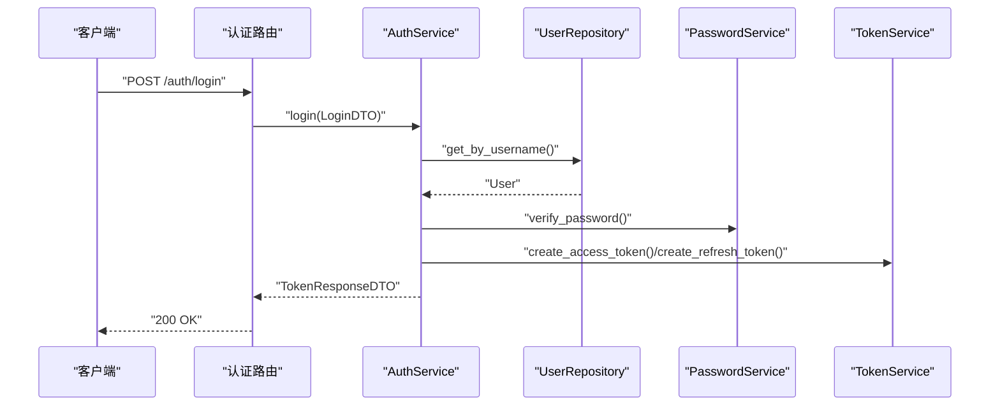
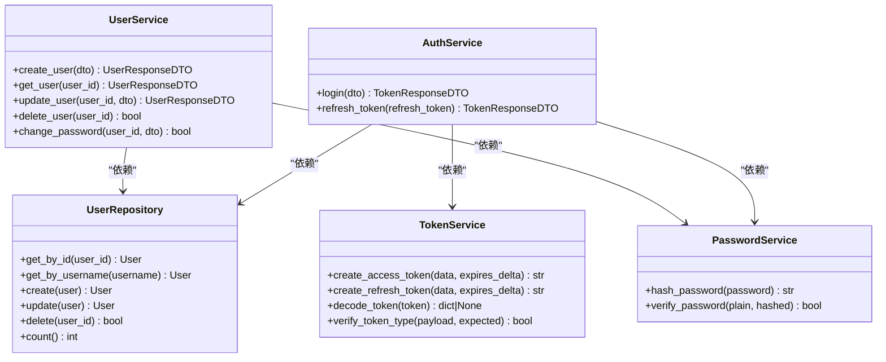
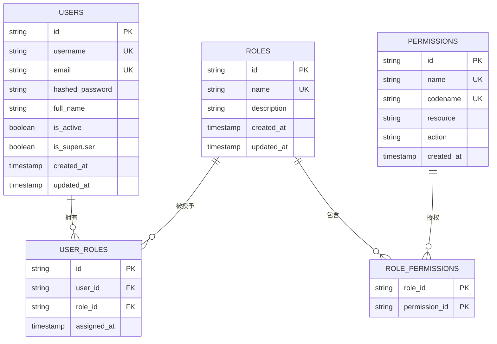
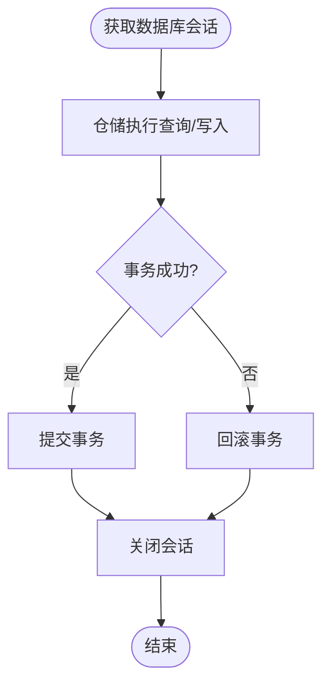
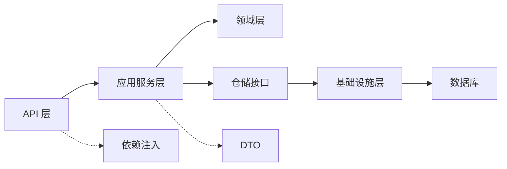

# 分层架构设计

<cite>
**本文档引用的文件**
- [src/main.py](file://src/main.py)
- [src/api/v1/auth_routes.py](file://src/api/v1/auth_routes.py)
- [src/api/v1/user_routes.py](file://src/api/v1/user_routes.py)
- [src/api/dependencies.py](file://src/api/dependencies.py)
- [src/application/services/auth_service.py](file://src/application/services/auth_service.py)
- [src/application/services/user_service.py](file://src/application/services/user_service.py)
- [src/application/dto/auth_dto.py](file://src/application/dto/auth_dto.py)
- [src/domain/auth/password_service.py](file://src/domain/auth/password_service.py)
- [src/domain/auth/token_service.py](file://src/domain/auth/token_service.py)
- [src/domain/user/entities.py](file://src/domain/user/entities.py)
- [src/domain/rbac/entities.py](file://src/domain/rbac/entities.py)
- [src/infrastructure/repositories/user_repository.py](file://src/infrastructure/repositories/user_repository.py)
- [src/infrastructure/repositories/rbac_repository.py](file://src/infrastructure/repositories/rbac_repository.py)
- [src/infrastructure/database/connection.py](file://src/infrastructure/database/connection.py)
</cite>

## 目录
1. [引言](#引言)
2. [项目结构](#项目结构)
3. [核心组件](#核心组件)
4. [架构总览](#架构总览)
5. [详细组件分析](#详细组件分析)
6. [依赖关系分析](#依赖关系分析)
7. [性能考虑](#性能考虑)
8. [故障排除指南](#故障排除指南)
9. [结论](#结论)

## 引言
本项目采用四层架构设计，围绕关注点分离与代码复用展开：  
- API 层：负责路由定义、请求参数绑定、依赖注入与中间件集成  
- 应用服务层：编排业务流程、协调领域服务与仓储、处理应用级异常  
- 领域层：封装核心业务规则与不变量（如密码哈希、JWT 签发、用户/角色/权限模型）  
- 基础设施层：提供数据库连接、SQLAlchemy ORM 映射、仓储接口实现与外部集成

该架构通过明确的边界与单向依赖（上层依赖下层），确保各层职责清晰、测试友好且易于扩展。

## 项目结构
项目按“src/模块/子目录/文件”的方式组织，体现分层与功能域的结合。核心目录与职责如下：
- src/api：API 路由与依赖注入，暴露 HTTP 接口  
- src/application：应用服务与 DTO，承载业务用例与数据转换  
- src/domain：领域模型与领域服务，表达核心业务规则  
- src/infrastructure：数据库连接、ORM 模型与仓储实现  

图表来源
- [src/api/v1/auth_routes.py:1-34](file://src/api/v1/auth_routes.py#L1-L34)
- [src/api/v1/user_routes.py:1-115](file://src/api/v1/user_routes.py#L1-L115)
- [src/api/dependencies.py:1-83](file://src/api/dependencies.py#L1-L83)
- [src/application/services/auth_service.py:1-67](file://src/application/services/auth_service.py#L1-L67)
- [src/application/services/user_service.py:1-141](file://src/application/services/user_service.py#L1-L141)
- [src/application/dto/auth_dto.py:1-25](file://src/application/dto/auth_dto.py#L1-L25)
- [src/domain/auth/password_service.py:1-24](file://src/domain/auth/password_service.py#L1-L24)
- [src/domain/auth/token_service.py:1-41](file://src/domain/auth/token_service.py#L1-L41)
- [src/domain/user/entities.py:1-38](file://src/domain/user/entities.py#L1-L38)
- [src/domain/rbac/entities.py:1-79](file://src/domain/rbac/entities.py#L1-L79)
- [src/infrastructure/repositories/user_repository.py:1-61](file://src/infrastructure/repositories/user_repository.py#L1-L61)
- [src/infrastructure/repositories/rbac_repository.py:1-133](file://src/infrastructure/repositories/rbac_repository.py#L1-L133)
- [src/infrastructure/database/connection.py:1-51](file://src/infrastructure/database/connection.py#L1-L51)

章节来源
- [src/main.py:1-83](file://src/main.py#L1-L83)

## 核心组件
- API 层组件
  - 路由器：v1 路由模块，分别定义认证与用户管理路由，并通过依赖注入获取数据库会话与当前用户信息
  - 依赖项：基于 HTTP Bearer Token 的鉴权与权限校验，支持超级用户豁免与细粒度权限检查
- 应用服务组件
  - 认证服务：负责登录、令牌刷新、用户身份验证与令牌签发；协调仓储与领域服务
  - 用户服务：负责用户增删改查、密码变更、角色/权限查询等业务流程
  - DTO：定义输入输出数据结构，确保 API 与应用层的数据契约清晰
- 领域组件
  - 密码服务：提供密码哈希与校验
  - Token 服务：封装 JWT 的生成、解码与类型校验
  - 领域模型：用户、角色、权限及其关系映射至 ORM 实体
- 基础设施组件
  - 数据库连接：异步 SQLAlchemy 引擎与会话工厂，提供依赖注入
  - 仓储实现：基于 SQLAlchemy 的 CRUD 操作与复杂查询

章节来源
- [src/api/v1/auth_routes.py:1-34](file://src/api/v1/auth_routes.py#L1-L34)
- [src/api/v1/user_routes.py:1-115](file://src/api/v1/user_routes.py#L1-L115)
- [src/api/dependencies.py:1-83](file://src/api/dependencies.py#L1-L83)
- [src/application/services/auth_service.py:1-67](file://src/application/services/auth_service.py#L1-L67)
- [src/application/services/user_service.py:1-141](file://src/application/services/user_service.py#L1-L141)
- [src/application/dto/auth_dto.py:1-25](file://src/application/dto/auth_dto.py#L1-L25)
- [src/domain/auth/password_service.py:1-24](file://src/domain/auth/password_service.py#L1-L24)
- [src/domain/auth/token_service.py:1-41](file://src/domain/auth/token_service.py#L1-L41)
- [src/domain/user/entities.py:1-38](file://src/domain/user/entities.py#L1-L38)
- [src/domain/rbac/entities.py:1-79](file://src/domain/rbac/entities.py#L1-L79)
- [src/infrastructure/repositories/user_repository.py:1-61](file://src/infrastructure/repositories/user_repository.py#L1-L61)
- [src/infrastructure/repositories/rbac_repository.py:1-133](file://src/infrastructure/repositories/rbac_repository.py#L1-L133)
- [src/infrastructure/database/connection.py:1-51](file://src/infrastructure/database/connection.py#L1-L51)

## 架构总览
四层架构通过“自顶向下”的依赖关系实现关注点分离：
- API 层仅负责请求接入与依赖注入，不包含业务逻辑
- 应用服务层编排业务流程，向上提供用例接口，向下依赖仓储与领域服务
- 领域层封装不变量与核心规则，避免被上层直接调用
- 基础设施层提供数据持久化与外部集成能力，向上暴露仓储接口

图表来源
- [src/main.py:1-83](file://src/main.py#L1-L83)
- [src/api/dependencies.py:1-83](file://src/api/dependencies.py#L1-L83)
- [src/application/services/auth_service.py:1-67](file://src/application/services/auth_service.py#L1-L67)
- [src/application/services/user_service.py:1-141](file://src/application/services/user_service.py#L1-L141)
- [src/infrastructure/database/connection.py:1-51](file://src/infrastructure/database/connection.py#L1-L51)

## 详细组件分析

### API 层：路由与依赖注入
- 认证路由
  - 登录：接收 LoginDTO，调用应用服务执行认证并返回 TokenResponseDTO
  - 刷新：接收 RefreshTokenDTO，调用应用服务刷新令牌
  - 当前用户：通过依赖注入解析并校验令牌，返回当前活跃用户信息
- 用户路由
  - 支持创建、查询、更新、删除用户，并通过权限依赖强制细粒度授权
  - 提供“我的资料”相关接口，使用当前用户 ID 依赖项

图表来源
- [src/api/v1/auth_routes.py:14-25](file://src/api/v1/auth_routes.py#L14-L25)
- [src/application/services/auth_service.py:21-40](file://src/application/services/auth_service.py#L21-L40)
- [src/infrastructure/repositories/user_repository.py:22-25](file://src/infrastructure/repositories/user_repository.py#L22-L25)
- [src/domain/auth/password_service.py:18-23](file://src/domain/auth/password_service.py#L18-L23)
- [src/domain/auth/token_service.py:13-26](file://src/domain/auth/token_service.py#L13-L26)

章节来源
- [src/api/v1/auth_routes.py:1-34](file://src/api/v1/auth_routes.py#L1-L34)
- [src/api/v1/user_routes.py:1-115](file://src/api/v1/user_routes.py#L1-L115)
- [src/api/dependencies.py:1-83](file://src/api/dependencies.py#L1-L83)

### 应用服务层：业务逻辑协调
- 认证服务
  - 校验用户是否存在、密码正确性与账户激活状态
  - 使用领域服务生成访问令牌与刷新令牌
- 用户服务
  - 统一处理重复性约束、字段更新与密码变更
  - 将领域实体转换为响应 DTO，避免泄露内部状态

图表来源
- [src/application/services/auth_service.py:13-67](file://src/application/services/auth_service.py#L13-L67)
- [src/application/services/user_service.py:21-141](file://src/application/services/user_service.py#L21-L141)
- [src/infrastructure/repositories/user_repository.py:11-61](file://src/infrastructure/repositories/user_repository.py#L11-L61)
- [src/domain/auth/password_service.py:6-24](file://src/domain/auth/password_service.py#L6-L24)
- [src/domain/auth/token_service.py:9-41](file://src/domain/auth/token_service.py#L9-L41)

章节来源
- [src/application/services/auth_service.py:1-67](file://src/application/services/auth_service.py#L1-L67)
- [src/application/services/user_service.py:1-141](file://src/application/services/user_service.py#L1-L141)

### 领域层：核心业务规则与模型
- 密码服务：提供哈希与校验，保证密码存储安全
- Token 服务：统一管理 JWT 的生成、解码与类型校验
- 用户实体：定义用户属性与关系，作为聚合根
- RBAC 实体：权限、角色与用户角色映射，支持多对多与关联表

图表来源
- [src/domain/user/entities.py:16-38](file://src/domain/user/entities.py#L16-L38)
- [src/domain/rbac/entities.py:20-79](file://src/domain/rbac/entities.py#L20-L79)

章节来源
- [src/domain/auth/password_service.py:1-24](file://src/domain/auth/password_service.py#L1-L24)
- [src/domain/auth/token_service.py:1-41](file://src/domain/auth/token_service.py#L1-L41)
- [src/domain/user/entities.py:1-38](file://src/domain/user/entities.py#L1-L38)
- [src/domain/rbac/entities.py:1-79](file://src/domain/rbac/entities.py#L1-L79)

### 基础设施层：数据访问与外部集成
- 数据库连接：异步引擎与会话工厂，提供依赖注入与生命周期管理
- 用户仓储：实现用户实体的 CRUD 与查询，支持预加载关联关系
- RBAC 仓储：实现角色、权限与用户角色的查询与分配

图表来源
- [src/infrastructure/database/connection.py:26-37](file://src/infrastructure/database/connection.py#L26-L37)
- [src/infrastructure/repositories/user_repository.py:17-61](file://src/infrastructure/repositories/user_repository.py#L17-L61)
- [src/infrastructure/repositories/rbac_repository.py:17-133](file://src/infrastructure/repositories/rbac_repository.py#L17-L133)

章节来源
- [src/infrastructure/database/connection.py:1-51](file://src/infrastructure/database/connection.py#L1-L51)
- [src/infrastructure/repositories/user_repository.py:1-61](file://src/infrastructure/repositories/user_repository.py#L1-L61)
- [src/infrastructure/repositories/rbac_repository.py:1-133](file://src/infrastructure/repositories/rbac_repository.py#L1-L133)

## 依赖关系分析
- 单向依赖：API 层 → 应用服务层 → 领域层/仓储接口；基础设施层向上提供仓储实现
- 依赖注入：通过 FastAPI 依赖项与 SQLAlchemy 异步会话工厂，实现跨层解耦
- 数据契约：DTO 在 API 与应用层之间传递，确保数据结构稳定与前后端一致

图表来源
- [src/api/v1/auth_routes.py:1-34](file://src/api/v1/auth_routes.py#L1-L34)
- [src/api/v1/user_routes.py:1-115](file://src/api/v1/user_routes.py#L1-L115)
- [src/application/services/auth_service.py:1-67](file://src/application/services/auth_service.py#L1-L67)
- [src/application/services/user_service.py:1-141](file://src/application/services/user_service.py#L1-L141)
- [src/infrastructure/repositories/user_repository.py:1-61](file://src/infrastructure/repositories/user_repository.py#L1-L61)
- [src/infrastructure/database/connection.py:1-51](file://src/infrastructure/database/connection.py#L1-L51)

章节来源
- [src/api/dependencies.py:1-83](file://src/api/dependencies.py#L1-L83)
- [src/application/dto/auth_dto.py:1-25](file://src/application/dto/auth_dto.py#L1-L25)

## 性能考虑
- 异步数据库：使用 SQLAlchemy 异步引擎与会话，提升 I/O 密集场景吞吐
- 关联预加载：仓储查询中使用 selectinload 预加载关联，减少 N+1 查询风险
- 事务管理：依赖注入中自动提交或回滚，避免资源泄漏
- DTO 转换：在应用服务层集中转换实体为响应 DTO，减少 ORM 对象暴露

## 故障排除指南
- 未授权/令牌无效：检查令牌解码与类型校验逻辑，确认密钥与算法配置
- 用户不存在/禁用：确认仓储查询与用户状态字段，确保依赖注入的会话处于活动状态
- 冲突错误：检查用户名/邮箱唯一性约束与 DTO 字段映射
- 权限不足：确认权限依赖项与用户角色/权限映射

章节来源
- [src/application/services/auth_service.py:21-67](file://src/application/services/auth_service.py#L21-L67)
- [src/application/services/user_service.py:28-101](file://src/application/services/user_service.py#L28-L101)
- [src/api/dependencies.py:53-83](file://src/api/dependencies.py#L53-L83)

## 结论
本项目通过四层架构实现了清晰的关注点分离：API 层专注接口与依赖注入，应用服务层编排业务流程，领域层封装核心规则，基础设施层提供数据与外部集成。层间通过 DTO 与依赖注入保持松耦合，既便于单元测试与维护，也为未来扩展（如缓存、消息队列）预留了空间。