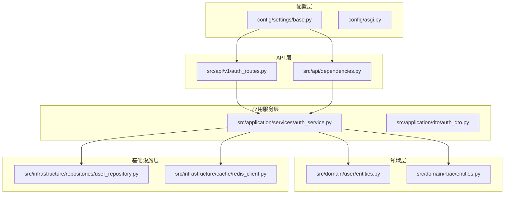
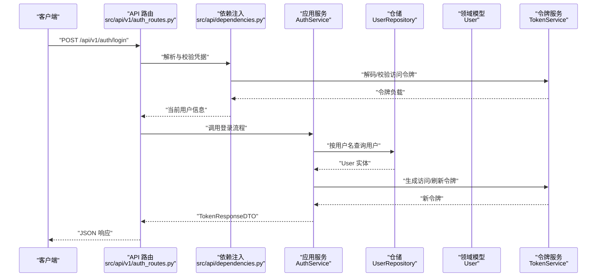
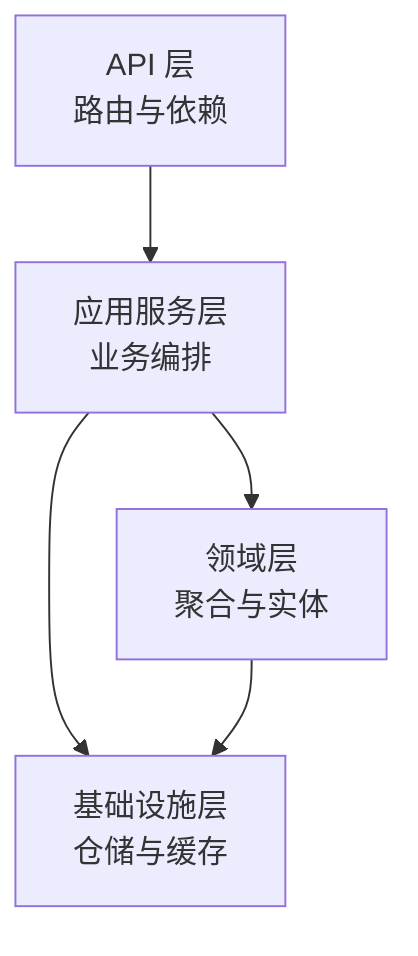
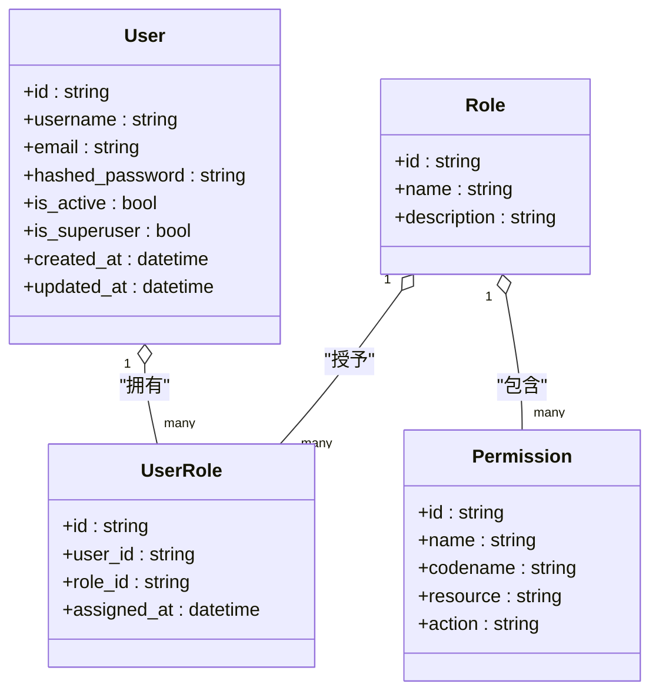
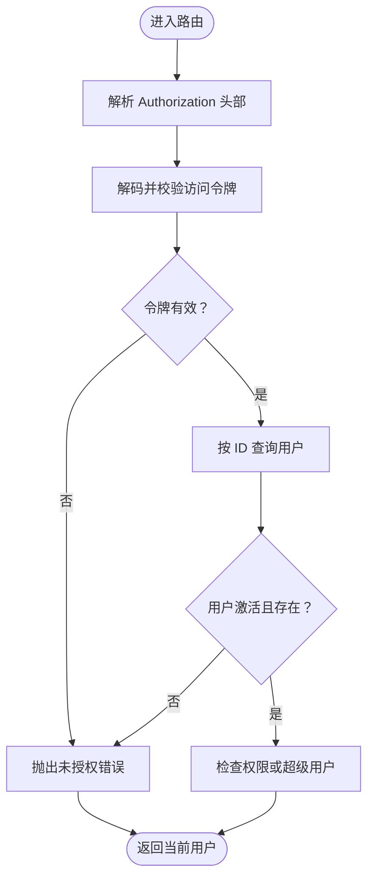
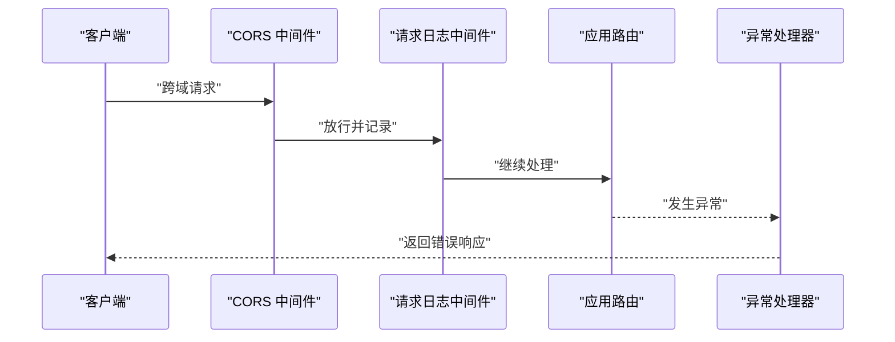
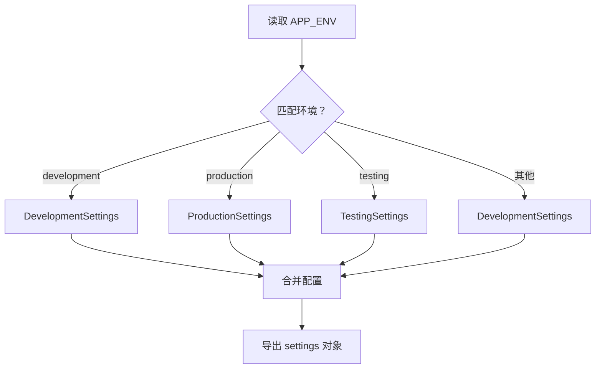
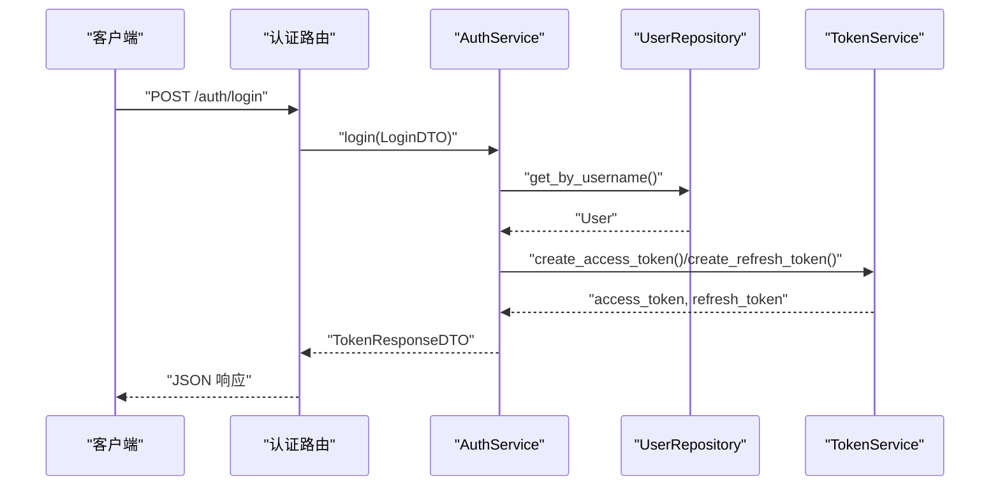
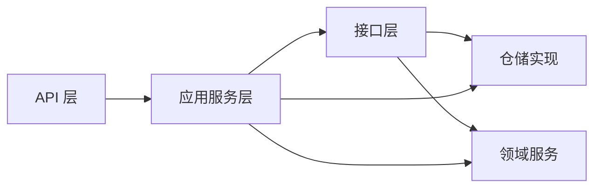

# 架构设计

<cite>
**本文档引用的文件**
- [src/main.py](file://src/main.py)
- [config/settings/base.py](file://config/settings/base.py)
- [config/asgi.py](file://config/asgi.py)
- [src/core/middlewares.py](file://src/core/middlewares.py)
- [src/api/dependencies.py](file://src/api/dependencies.py)
- [src/application/services/auth_service.py](file://src/application/services/auth_service.py)
- [src/domain/user/entities.py](file://src/domain/user/entities.py)
- [src/infrastructure/repositories/user_repository.py](file://src/infrastructure/repositories/user_repository.py)
- [src/api/v1/auth_routes.py](file://src/api/v1/auth_routes.py)
- [src/core/logger.py](file://src/core/logger.py)
- [src/domain/rbac/entities.py](file://src/domain/rbac/entities.py)
- [src/infrastructure/cache/redis_client.py](file://src/infrastructure/cache/redis_client.py)
- [src/application/dto/auth_dto.py](file://src/application/dto/auth_dto.py)
- [src/core/exceptions.py](file://src/core/exceptions.py)
- [pyproject.toml](file://pyproject.toml)
</cite>

## 目录
1. [引言](#引言)
2. [项目结构](#项目结构)
3. [核心组件](#核心组件)
4. [架构总览](#架构总览)
5. [详细组件分析](#详细组件分析)
6. [依赖分析](#依赖分析)
7. [性能考虑](#性能考虑)
8. [故障排查指南](#故障排查指南)
9. [结论](#结论)
10. [附录](#附录)

## 引言
本项目采用分层架构与领域驱动设计（DDD）相结合的方式，围绕认证与基于角色的访问控制（RBAC）构建。整体目标是通过清晰的职责分离与依赖倒置，实现高内聚、低耦合的服务体系，并借助 FastAPI 的异步能力与依赖注入机制提升开发效率与运行性能。

## 项目结构
项目采用按层次与功能混合的组织方式：
- 配置层：集中管理多环境配置与 ASGI 入口
- API 层：路由与依赖注入，面向接口编程
- 应用服务层：编排业务流程，协调领域与基础设施
- 领域层：核心业务模型与规则，强调聚合与不变量
- 基础设施层：数据库、缓存、外部服务等技术实现

图表来源
- [src/main.py:31-83](file://src/main.py#L31-L83)
- [config/settings/base.py:63-86](file://config/settings/base.py#L63-L86)
- [src/api/v1/auth_routes.py:11-34](file://src/api/v1/auth_routes.py#L11-L34)
- [src/api/dependencies.py:16-83](file://src/api/dependencies.py#L16-L83)
- [src/application/services/auth_service.py:13-67](file://src/application/services/auth_service.py#L13-L67)
- [src/domain/user/entities.py:16-38](file://src/domain/user/entities.py#L16-L38)
- [src/domain/rbac/entities.py:20-79](file://src/domain/rbac/entities.py#L20-L79)
- [src/infrastructure/repositories/user_repository.py:11-61](file://src/infrastructure/repositories/user_repository.py#L11-L61)
- [src/infrastructure/cache/redis_client.py:9-27](file://src/infrastructure/cache/redis_client.py#L9-L27)

章节来源
- [src/main.py:31-83](file://src/main.py#L31-L83)
- [config/settings/base.py:63-86](file://config/settings/base.py#L63-L86)

## 核心组件
- 应用程序工厂与生命周期管理：负责创建 FastAPI 实例、注册中间件、异常处理器、健康检查与路由，并通过 lifespan 管理数据库初始化与关闭。
- 配置系统：基于 Pydantic Settings 的多环境配置，支持开发、生产、测试三种环境，提供 CORS、数据库、Redis、JWT、速率限制、日志等级等参数。
- 中间件体系：CORS、请求日志、IP 白黑名单过滤等横切关注点统一处理。
- API 依赖注入：基于 FastAPI Security 的认证依赖，结合仓储与服务层完成用户校验、权限检查与超级用户判定。
- 应用服务：封装认证登录、令牌刷新等业务流程，协调领域与基础设施。
- 领域模型：用户、权限、角色、用户-角色关联等 DDD 聚合作为核心模型。
- 基础设施：SQLAlchemy 异步 ORM 仓储、Redis 缓存客户端。

章节来源
- [src/main.py:19-83](file://src/main.py#L19-L83)
- [config/settings/base.py:6-86](file://config/settings/base.py#L6-L86)
- [src/core/middlewares.py:12-64](file://src/core/middlewares.py#L12-L64)
- [src/api/dependencies.py:16-83](file://src/api/dependencies.py#L16-L83)
- [src/application/services/auth_service.py:13-67](file://src/application/services/auth_service.py#L13-L67)
- [src/domain/user/entities.py:16-38](file://src/domain/user/entities.py#L16-L38)
- [src/domain/rbac/entities.py:20-79](file://src/domain/rbac/entities.py#L20-L79)
- [src/infrastructure/repositories/user_repository.py:11-61](file://src/infrastructure/repositories/user_repository.py#L11-L61)
- [src/infrastructure/cache/redis_client.py:9-27](file://src/infrastructure/cache/redis_client.py#L9-L27)

## 架构总览
下图展示了从请求进入应用到返回响应的关键路径，体现各层之间的调用关系与职责边界。

图表来源
- [src/api/v1/auth_routes.py:14-25](file://src/api/v1/auth_routes.py#L14-L25)
- [src/api/dependencies.py:16-51](file://src/api/dependencies.py#L16-L51)
- [src/application/services/auth_service.py:21-40](file://src/application/services/auth_service.py#L21-L40)
- [src/infrastructure/repositories/user_repository.py:17-25](file://src/infrastructure/repositories/user_repository.py#L17-L25)
- [src/domain/user/entities.py:16-38](file://src/domain/user/entities.py#L16-L38)

## 详细组件分析

### 分层架构与职责划分
- API 层
  - 负责路由定义、请求绑定、依赖注入与响应模型输出。
  - 示例：认证路由与依赖项。
- 应用服务层
  - 封装业务用例，协调领域与基础设施，保证业务规则的一致性。
  - 示例：认证服务的登录与刷新流程。
- 领域层
  - 以实体与聚合为核心，表达业务不变量与行为。
  - 示例：用户聚合根、RBAC 权限与角色模型。
- 基础设施层
  - 提供数据持久化、缓存、外部服务等技术实现。
  - 示例：用户仓储、Redis 客户端。

图表来源
- [src/api/v1/auth_routes.py:11-34](file://src/api/v1/auth_routes.py#L11-L34)
- [src/application/services/auth_service.py:13-67](file://src/application/services/auth_service.py#L13-L67)
- [src/domain/user/entities.py:16-38](file://src/domain/user/entities.py#L16-L38)
- [src/domain/rbac/entities.py:20-79](file://src/domain/rbac/entities.py#L20-L79)
- [src/infrastructure/repositories/user_repository.py:11-61](file://src/infrastructure/repositories/user_repository.py#L11-L61)
- [src/infrastructure/cache/redis_client.py:9-27](file://src/infrastructure/cache/redis_client.py#L9-L27)

章节来源
- [src/api/v1/auth_routes.py:11-34](file://src/api/v1/auth_routes.py#L11-L34)
- [src/application/services/auth_service.py:13-67](file://src/application/services/auth_service.py#L13-L67)
- [src/domain/user/entities.py:16-38](file://src/domain/user/entities.py#L16-L38)
- [src/domain/rbac/entities.py:20-79](file://src/domain/rbac/entities.py#L20-L79)
- [src/infrastructure/repositories/user_repository.py:11-61](file://src/infrastructure/repositories/user_repository.py#L11-L61)
- [src/infrastructure/cache/redis_client.py:9-27](file://src/infrastructure/cache/redis_client.py#L9-L27)

### 领域驱动设计（DDD）实践
- 聚合根
  - 用户聚合根：用户实体作为聚合根，维护用户身份、状态与时间戳等不变量；通过关系映射与角色关联形成聚合边界。
  - RBAC 聚合：角色与权限通过关联表建立多对多关系，用户-角色关联实体承载分配元数据。
- 值对象与实体
  - 权限与角色实体表达可唯一标识的业务概念；用户实体包含布尔状态字段与时间戳字段，体现实体属性。
- 领域服务
  - 密码服务与令牌服务用于处理密码哈希与 JWT 生命周期，属于跨聚合的无状态服务。
- 仓储接口与实现
  - 仓储接口定义标准操作；具体实现基于 SQLAlchemy 异步会话，提供按主键、唯一键与分页查询等能力。

图表来源
- [src/domain/user/entities.py:16-38](file://src/domain/user/entities.py#L16-L38)
- [src/domain/rbac/entities.py:20-79](file://src/domain/rbac/entities.py#L20-L79)

章节来源
- [src/domain/user/entities.py:16-38](file://src/domain/user/entities.py#L16-L38)
- [src/domain/rbac/entities.py:20-79](file://src/domain/rbac/entities.py#L20-L79)

### 依赖注入与 FastAPI 依赖系统
- 路由依赖
  - 使用 FastAPI Security 的 HTTP Bearer 令牌方案，从 Authorization 头部提取凭据并进行解码与类型校验。
  - 依赖链：路由 -> 当前用户 ID 提取 -> 活跃用户获取 -> 权限/超级用户检查。
- 服务与仓储
  - 应用服务通过构造函数注入仓储与领域服务，确保业务逻辑与数据访问解耦。
- 数据库会话
  - 通过依赖注入提供异步 SQLAlchemy 会话，贯穿仓储与服务层。

图表来源
- [src/api/dependencies.py:16-51](file://src/api/dependencies.py#L16-L51)
- [src/api/dependencies.py:53-83](file://src/api/dependencies.py#L53-L83)

章节来源
- [src/api/dependencies.py:16-83](file://src/api/dependencies.py#L16-L83)
- [src/application/services/auth_service.py:16-20](file://src/application/services/auth_service.py#L16-L20)
- [src/infrastructure/repositories/user_repository.py:14-16](file://src/infrastructure/repositories/user_repository.py#L14-L16)

### 中间件系统与横切关注点
- CORS 中间件：允许跨域请求，支持通配符方法与头部。
- 请求日志中间件：记录请求方法、路径与客户端 IP，并在响应头中附加处理时长。
- IP 白黑名单中间件：根据配置的白名单优先策略拒绝访问。
- 全局异常处理：针对应用自定义异常与通用异常分别返回结构化 JSON 响应。

图表来源
- [src/main.py:43-70](file://src/main.py#L43-L70)
- [src/core/middlewares.py:12-31](file://src/core/middlewares.py#L12-L31)
- [src/core/middlewares.py:34-64](file://src/core/middlewares.py#L34-L64)

章节来源
- [src/main.py:43-70](file://src/main.py#L43-L70)
- [src/core/middlewares.py:12-64](file://src/core/middlewares.py#L12-L64)

### 配置管理与多环境支持
- 配置基类：集中定义应用名称、版本、主机端口、数据库、Redis、JWT、CORS、速率限制、日志等级等。
- 环境映射：根据 APP_ENV 选择开发、生产或测试配置，提供默认回退。
- 动态加载：通过 Pydantic Settings 从 .env 文件加载环境变量，支持额外键忽略策略。

图表来源
- [config/settings/base.py:71-86](file://config/settings/base.py#L71-L86)
- [config/settings/base.py:49-68](file://config/settings/base.py#L49-L68)

章节来源
- [config/settings/base.py:6-86](file://config/settings/base.py#L6-L86)

### 认证与令牌流程
- 登录流程：应用服务根据用户名查询用户，校验密码与账户状态，生成访问与刷新令牌。
- 刷新流程：应用服务解码刷新令牌，校验类型与用户有效性，重新签发新令牌。
- DTO 设计：LoginDTO、TokenResponseDTO、RefreshTokenDTO 明确输入输出结构。

图表来源
- [src/api/v1/auth_routes.py:14-18](file://src/api/v1/auth_routes.py#L14-L18)
- [src/application/services/auth_service.py:21-40](file://src/application/services/auth_service.py#L21-L40)
- [src/infrastructure/repositories/user_repository.py:17-25](file://src/infrastructure/repositories/user_repository.py#L17-L25)

章节来源
- [src/application/services/auth_service.py:21-67](file://src/application/services/auth_service.py#L21-L67)
- [src/application/dto/auth_dto.py:6-25](file://src/application/dto/auth_dto.py#L6-L25)

### 日志与异常处理
- 日志：使用 loguru 输出到控制台与文件，区分 INFO 与 ERROR 级别，支持轮转与压缩。
- 异常：自定义 AppException 及其子类，覆盖未找到、冲突、未授权、禁止、验证、限流等场景；全局异常处理器统一返回 JSON。

章节来源
- [src/core/logger.py:13-45](file://src/core/logger.py#L13-L45)
- [src/core/exceptions.py:6-53](file://src/core/exceptions.py#L6-L53)
- [src/main.py:55-70](file://src/main.py#L55-L70)

## 依赖分析
- 组件耦合
  - API 层仅依赖应用服务与依赖注入模块，不直接依赖仓储或领域实现，符合依赖倒置原则。
  - 应用服务依赖仓储接口与领域服务，通过构造函数注入，便于替换与测试。
  - 领域层与基础设施层通过接口隔离，避免上层直连底层实现。
- 外部依赖
  - FastAPI、SQLAlchemy 异步、Pydantic、Redis、JWT、日志等第三方库在 pyproject.toml 中声明。

图表来源
- [src/api/v1/auth_routes.py:11-34](file://src/api/v1/auth_routes.py#L11-L34)
- [src/application/services/auth_service.py:13-67](file://src/application/services/auth_service.py#L13-L67)
- [src/infrastructure/repositories/user_repository.py:11-61](file://src/infrastructure/repositories/user_repository.py#L11-L61)

章节来源
- [pyproject.toml:7-27](file://pyproject.toml#L7-L27)

## 性能考虑
- 异步 I/O：使用 SQLAlchemy 异步会话与 Redis 异步客户端，减少阻塞，提升并发吞吐。
- 依赖注入：通过会话与服务单例化注入，避免重复创建对象带来的开销。
- 日志分级：区分 INFO 与 ERROR，合理设置轮转与保留策略，降低磁盘 IO 压力。
- CORS 与中间件：仅启用必要中间件，避免对每个请求增加不必要的处理链路。
- 令牌与密码：使用高效的哈希算法与合理的过期策略，平衡安全与性能。

## 故障排查指南
- 认证失败
  - 检查 Authorization 头是否正确传递，令牌是否过期或类型错误。
  - 确认用户是否存在且处于激活状态。
- 权限不足
  - 核对用户权限集合与所需 codename 是否匹配，超级用户可绕过权限检查。
- 数据库连接
  - 确认 DATABASE_URL 配置正确，生命周期钩子中数据库初始化与关闭是否正常执行。
- Redis 连接
  - 检查 REDIS_URL 配置与网络可达性，确认连接池复用与关闭逻辑。
- 日志定位
  - 查看控制台输出与 logs 目录下的 app.log 与 error.log，定位异常堆栈与请求耗时。

章节来源
- [src/api/dependencies.py:16-51](file://src/api/dependencies.py#L16-L51)
- [src/api/dependencies.py:53-83](file://src/api/dependencies.py#L53-L83)
- [src/application/services/auth_service.py:21-67](file://src/application/services/auth_service.py#L21-L67)
- [src/core/logger.py:23-45](file://src/core/logger.py#L23-L45)

## 结论
本项目通过清晰的分层架构与 DDD 实践，实现了认证与 RBAC 的可维护与可扩展设计。配合 FastAPI 的依赖注入与中间件体系，以及多环境配置与日志异常处理，形成了稳定可靠的后端服务骨架。建议在后续迭代中持续完善测试覆盖、引入缓存策略与限流中间件，并对热点路径进行性能压测与优化。

## 附录
- ASGI 入口：生产部署通过 ASGI 应用暴露 FastAPI 实例。
- 项目依赖：在 pyproject.toml 中集中声明，便于构建与开发工具集成。

章节来源
- [config/asgi.py:3-6](file://config/asgi.py#L3-L6)
- [pyproject.toml:1-74](file://pyproject.toml#L1-L74)