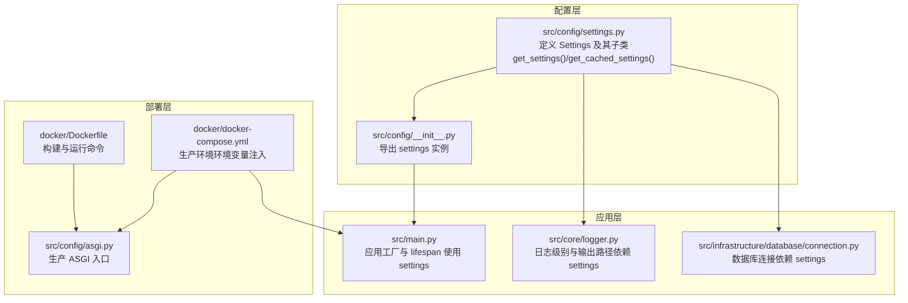
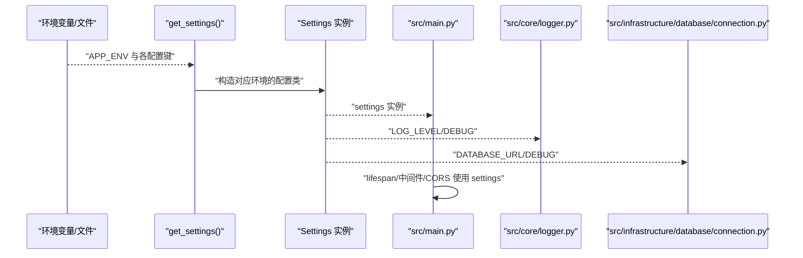
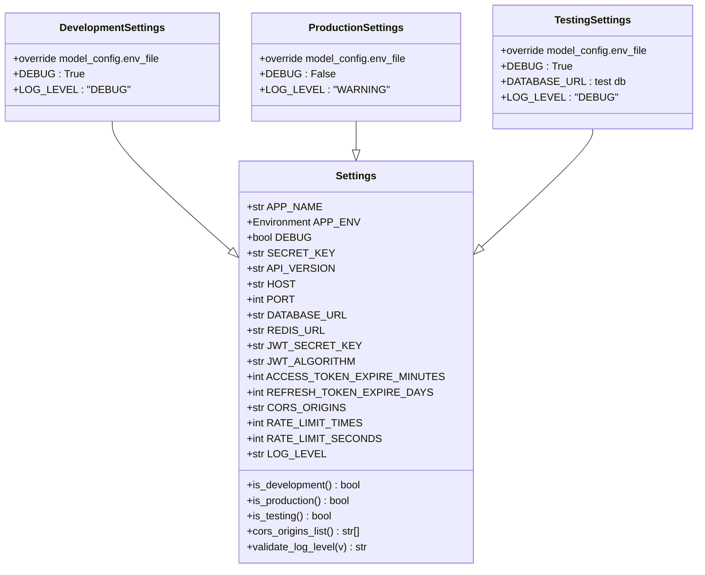
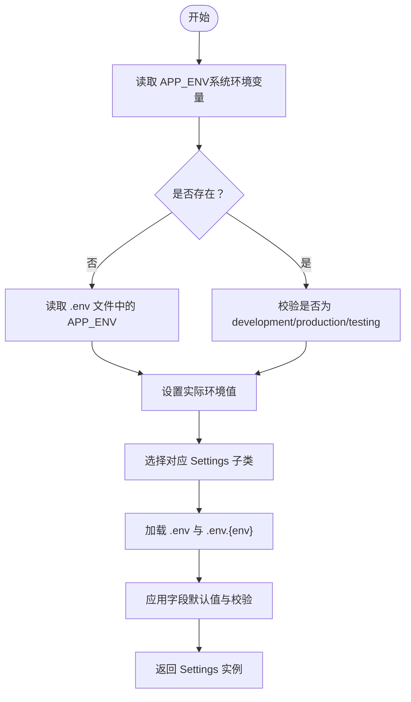
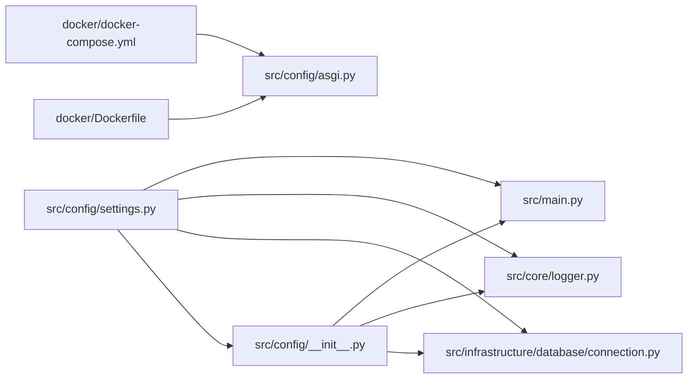

# 配置管理架构

<cite>
**本文引用的文件**
- [src/config/settings.py](file://src/config/settings.py)
- [src/config/__init__.py](file://src/config/__init__.py)
- [src/config/asgi.py](file://src/config/asgi.py)
- [src/main.py](file://src/main.py)
- [src/core/logger.py](file://src/core/logger.py)
- [src/infrastructure/database/connection.py](file://src/infrastructure/database/connection.py)
- [docker/docker-compose.yml](file://docker/docker-compose.yml)
- [docker/Dockerfile](file://docker/Dockerfile)
- [pyproject.toml](file://pyproject.toml)
</cite>

## 目录
1. [引言](#引言)
2. [项目结构](#项目结构)
3. [核心组件](#核心组件)
4. [架构总览](#架构总览)
5. [详细组件分析](#详细组件分析)
6. [依赖分析](#依赖分析)
7. [性能考虑](#性能考虑)
8. [故障排查指南](#故障排查指南)
9. [结论](#结论)
10. [附录](#附录)

## 引言
本文件系统性阐述 Hello-FastApi 项目的配置管理架构，重点覆盖多环境配置设计与实现（开发、测试、生产）、配置文件层次结构与继承关系、环境变量覆盖机制、配置验证与类型安全（Pydantic 模型）、动态加载与热更新能力、敏感信息安全存储与访问控制，以及部署场景下的配置策略与最佳实践。

**更新** 本项目已完成从 Django 配置系统到 FastAPI 配置系统的完全迁移，新增 src/config/settings.py 实现多环境配置，替代原有的 Django settings/base.py 结构。

## 项目结构
配置相关代码集中在 src/config 包内，核心为 settings.py 中的多环境配置类与工厂函数；应用通过 src/main.py 在启动阶段读取配置并注入到中间件、路由与异常处理等组件；日志与数据库等子系统也直接依赖配置对象；Docker Compose 将生产环境的关键配置以环境变量形式注入容器。

**图表来源**
- [src/config/settings.py:1-212](file://src/config/settings.py#L1-L212)
- [src/config/__init__.py:1-6](file://src/config/__init__.py#L1-L6)
- [src/main.py:1-86](file://src/main.py#L1-L86)
- [src/core/logger.py:1-117](file://src/core/logger.py#L1-L117)
- [src/infrastructure/database/connection.py:1-52](file://src/infrastructure/database/connection.py#L1-L52)
- [docker/docker-compose.yml:1-65](file://docker/docker-compose.yml#L1-L65)
- [docker/Dockerfile:1-58](file://docker/Dockerfile#L1-L58)
- [src/config/asgi.py:1-6](file://src/config/asgi.py#L1-L6)

**章节来源**
- [src/config/settings.py:1-212](file://src/config/settings.py#L1-L212)
- [src/config/__init__.py:1-6](file://src/config/__init__.py#L1-L6)
- [src/main.py:1-86](file://src/main.py#L1-L86)
- [src/core/logger.py:1-117](file://src/core/logger.py#L1-L117)
- [src/infrastructure/database/connection.py:1-52](file://src/infrastructure/database/connection.py#L1-L52)
- [docker/docker-compose.yml:1-65](file://docker/docker-compose.yml#L1-L65)
- [docker/Dockerfile:1-58](file://docker/Dockerfile#L1-L58)
- [src/config/asgi.py:1-6](file://src/config/asgi.py#L1-L6)

## 核心组件
- 多环境配置类
  - 基类 Settings：统一声明所有配置键，定义默认值、字段约束与校验器，提供 is_development/is_production/is_testing 属性与 cors_origins_list 解析。
  - 子类 DevelopmentSettings/ProductionSettings/TestingSettings：按环境覆盖部分字段（如 DEBUG、LOG_LEVEL、DATABASE_URL），并指定对应的 .env.* 文件。
- 工厂与缓存
  - get_settings()：根据 APP_ENV 决策返回对应配置类实例，遵循"系统环境变量 > .env.* > .env > 默认值"的加载顺序。
  - get_cached_settings()：基于 LRU 缓存的单例模式，避免重复初始化。
  - settings：模块级导出的最终配置实例。
- 应用集成
  - src/main.py：在应用工厂、CORS 中间件、lifespan 启停逻辑中使用 settings。
  - src/core/logger.py：依据 LOG_LEVEL 输出到控制台与文件。
  - src/infrastructure/database/connection.py：依据 DATABASE_URL 与 DEBUG 初始化数据库引擎。

**章节来源**
- [src/config/settings.py:41-113](file://src/config/settings.py#L41-L113)
- [src/config/settings.py:115-156](file://src/config/settings.py#L115-L156)
- [src/config/settings.py:158-207](file://src/config/settings.py#L158-L207)
- [src/config/settings.py:210-212](file://src/config/settings.py#L210-L212)
- [src/main.py:31-86](file://src/main.py#L31-L86)
- [src/core/logger.py:1-117](file://src/core/logger.py#L1-L117)
- [src/infrastructure/database/connection.py:1-52](file://src/infrastructure/database/connection.py#L1-L52)

## 架构总览
下图展示了配置在系统中的流向与耦合关系：配置源（环境变量与 .env.* 文件）经由工厂函数加载为 Settings 对象，随后被应用、日志、数据库等模块消费。

**图表来源**
- [src/config/settings.py:158-207](file://src/config/settings.py#L158-L207)
- [src/main.py:31-86](file://src/main.py#L31-L86)
- [src/core/logger.py:1-117](file://src/core/logger.py#L1-L117)
- [src/infrastructure/database/connection.py:1-52](file://src/infrastructure/database/connection.py#L1-L52)

## 详细组件分析

### 配置类与继承关系
- 设计要点
  - 统一基类 Settings：集中声明配置键、默认值与字段约束；通过 field_validator 对日志级别进行枚举校验；提供 is_* 属性与 cors_origins_list 计算属性。
  - 环境子类：仅覆盖差异化的键值，保持最小化差异；model_config.env_file 指向 .env 与对应 .env.* 的组合，确保优先级与可覆盖性。
  - 加载顺序：系统环境变量 > .env.* > .env > 默认值，形成"环境变量优先"的覆盖机制。
- 关键字段与约束
  - 安全密钥：SECRET_KEY/JWT_SECRET_KEY 均设置最小长度约束，强制生产环境替换默认值。
  - 端口范围：PORT 使用 ge/le 约束，防止非法端口。
  - 日志级别：validate_log_level 限定合法集合，避免无效级别导致日志异常。
  - CORS：CORS_ORIGINS 为逗号分隔字符串，cors_origins_list 解析为列表供中间件使用。
  - 限流：RATE_LIMIT_TIMES/RATE_LIMIT_SECONDS 提供基础速率限制参数。
- 类关系图

**图表来源**
- [src/config/settings.py:41-113](file://src/config/settings.py#L41-L113)
- [src/config/settings.py:115-156](file://src/config/settings.py#L115-L156)

**章节来源**
- [src/config/settings.py:41-113](file://src/config/settings.py#L41-L113)
- [src/config/settings.py:115-156](file://src/config/settings.py#L115-L156)

### 配置加载与覆盖机制
- 加载顺序与优先级
  - get_settings() 首先读取系统环境变量 APP_ENV；若未设置，则回退到 .env 文件中的 APP_ENV；若仍不可用则默认 development。
  - 不同环境的 SettingsConfigDict.env_file 指向 .env 与对应 .env.* 的组合，确保 .env.* 的键能覆盖 .env 的同名键。
  - 最终回退到字段默认值，保证健壮性。
- 动态加载与缓存
  - get_settings() 每次调用都会重新解析环境与文件，确保外部变更可被感知。
  - get_cached_settings() 使用 LRU 缓存，适合在单次进程生命周期内复用同一配置实例，减少重复解析开销。
- 环境变量覆盖示例
  - 开发：APP_ENV=development，DEBUG=True，LOG_LEVEL=DEBUG。
  - 生产：APP_ENV=production，DEBUG=False，LOG_LEVEL=WARNING，DATABASE_URL 指向 PostgreSQL，REDIS_URL 指向 Redis。
  - 测试：APP_ENV=testing，DEBUG=True，LOG_LEVEL=DEBUG，DATABASE_URL 指向独立测试数据库。

**图表来源**
- [src/config/settings.py:158-207](file://src/config/settings.py#L158-L207)

**章节来源**
- [src/config/settings.py:158-207](file://src/config/settings.py#L158-L207)

### 配置验证与类型安全
- Pydantic 验证
  - 字段约束：PORT、ACCESS_TOKEN_EXPIRE_MINUTES、REFRESH_TOKEN_EXPIRE_DAYS 等使用 ge/le/min_length 等约束，确保数值范围与长度安全。
  - 枚举校验：validate_log_level 限定合法日志级别集合，避免错误配置导致日志行为异常。
  - 类型注解：所有配置键均声明明确类型，配合 pydantic-settings 自动类型转换与校验。
- 运行期影响
  - 若配置不合法，将在实例化 Settings 时抛出异常，阻止应用启动，提前暴露问题。
  - 日志与数据库等模块直接依赖这些字段，类型安全保证了下游模块的健壮性。

**章节来源**
- [src/config/settings.py:89-97](file://src/config/settings.py#L89-L97)
- [src/config/settings.py:59-72](file://src/config/settings.py#L59-L72)

### 动态加载与热更新机制
- 当前实现
  - get_settings() 每次调用都会重新解析环境与文件，理论上可在外部变更 .env.* 后触发重新加载。
  - get_cached_settings() 提供缓存，若需热更新，应在需要时显式刷新缓存或重启进程。
- 影响范围
  - 应用工厂与 lifespan：使用 settings 初始化数据库与中间件，配置变更会影响服务器绑定地址、调试模式、CORS 源等。
  - 日志：LOG_LEVEL 变更会改变日志输出级别与文件落盘策略。
  - 数据库：DATABASE_URL 变更会导致连接目标切换，影响数据一致性与可用性，应谨慎操作。

**章节来源**
- [src/config/settings.py:200-207](file://src/config/settings.py#L200-L207)
- [src/main.py:31-86](file://src/main.py#L31-L86)
- [src/core/logger.py:1-117](file://src/core/logger.py#L1-L117)
- [src/infrastructure/database/connection.py:1-52](file://src/infrastructure/database/connection.py#L1-L52)

### 敏感信息的安全存储与访问控制
- 安全建议
  - 生产环境必须覆盖默认密钥：SECRET_KEY、JWT_SECRET_KEY 必须足够长且随机，避免使用默认值。
  - 使用环境变量注入敏感配置，避免将 .env.* 提交至版本库；在 CI/CD 中通过受控渠道注入。
  - 对数据库凭据与 Redis 地址采用专用环境变量，不在代码中硬编码。
- 访问控制
  - 限制 .env.* 文件权限，仅允许运行用户读取。
  - 在容器编排中通过 secrets 或环境变量注入，避免将敏感信息写入镜像层。
- 配置示例
  - 生产环境：通过 docker-compose.yml 注入 DATABASE_URL、REDIS_URL、APP_ENV=production。

**章节来源**
- [src/config/settings.py:55-72](file://src/config/settings.py#L55-L72)
- [docker/docker-compose.yml:11-14](file://docker/docker-compose.yml#L11-L14)

### 部署场景下的配置策略
- 开发环境
  - 使用 .env.development 与默认 SQLite，DEBUG=True，LOG_LEVEL=DEBUG，便于本地调试。
  - 通过 uvicorn 直接运行，支持热重载。
- 测试环境
  - 使用 .env.testing，DATABASE_URL 指向独立测试数据库，LOG_LEVEL=DEBUG。
  - 单元/集成测试可按需覆盖关键配置键。
- 生产环境
  - 通过 docker-compose.yml 注入 APP_ENV=production、DATABASE_URL、REDIS_URL 等。
  - ASGI 入口由 src/config/asgi.py 导出，用于生产 WSGI/ASGI 服务器（如 uvicorn）托管。
  - Dockerfile 固化依赖安装与运行命令，日志目录挂载到宿主机持久化。

**章节来源**
- [src/config/settings.py:115-156](file://src/config/settings.py#L115-L156)
- [docker/docker-compose.yml:1-65](file://docker/docker-compose.yml#L1-L65)
- [docker/Dockerfile:1-58](file://docker/Dockerfile#L1-L58)
- [src/config/asgi.py:1-6](file://src/config/asgi.py#L1-L6)

## 依赖分析
- 模块耦合
  - src/config.settings 作为唯一配置源，被 src/main.py、src/core/logger.py、src/infrastructure/database/connection.py 广泛依赖。
  - src/config.__init__.py 仅负责导出 settings，降低上层模块的导入复杂度。
- 外部依赖
  - pydantic-settings：提供 BaseSettings 与 SettingsConfigDict，支撑多环境配置与类型安全。
  - uvicorn：开发服务器与生产托管依赖。
  - loguru：日志输出依赖。
  - SQLAlchemy/Redis：数据库与缓存连接依赖。

**图表来源**
- [src/config/settings.py:1-212](file://src/config/settings.py#L1-L212)
- [src/main.py:1-86](file://src/main.py#L1-L86)
- [src/core/logger.py:1-117](file://src/core/logger.py#L1-L117)
- [src/infrastructure/database/connection.py:1-52](file://src/infrastructure/database/connection.py#L1-L52)
- [src/config/__init__.py:1-6](file://src/config/__init__.py#L1-L6)
- [docker/docker-compose.yml:1-65](file://docker/docker-compose.yml#L1-L65)
- [docker/Dockerfile:1-58](file://docker/Dockerfile#L1-L58)
- [src/config/asgi.py:1-6](file://src/config/asgi.py#L1-L6)

**章节来源**
- [pyproject.toml:7-27](file://pyproject.toml#L7-L27)
- [src/config/settings.py:19-20](file://src/config/settings.py#L19-L20)

## 性能考虑
- 配置解析成本
  - get_settings() 每次都会扫描环境与文件，建议在单次进程内复用 get_cached_settings()，避免重复 IO。
- 运行期影响
  - DEBUG=True 会开启 echo 与热重载，生产环境务必关闭以降低开销。
  - LOG_LEVEL 过低（如 DEBUG）会产生大量日志，影响 I/O 性能；生产建议 WARNING 或更高。
- 数据库与缓存
  - DATABASE_URL 切换到远程数据库或 Redis 时，注意连接池与超时参数，避免阻塞。

## 故障排查指南
- 启动失败（配置校验错误）
  - 症状：实例化 Settings 抛出异常。
  - 排查：检查字段约束（端口范围、日志级别枚举、密钥长度）与 .env.* 文件格式。
- CORS 不生效
  - 症状：浏览器跨域请求被拒绝。
  - 排查：确认 CORS_ORIGINS 是否正确、cors_origins_list 解析是否包含目标源。
- 数据库连接失败
  - 症状：启动时报数据库连接错误。
  - 排查：核对 DATABASE_URL、APP_ENV 与 .env.* 覆盖是否正确；生产环境确保容器网络可达数据库与 Redis。
- 日志级别异常
  - 症状：日志过多或过少。
  - 排查：确认 LOG_LEVEL 与日志文件轮转配置。

**章节来源**
- [src/config/settings.py:89-97](file://src/config/settings.py#L89-L97)
- [src/infrastructure/database/connection.py:7-11](file://src/infrastructure/database/connection.py#L7-L11)
- [src/core/logger.py:13-45](file://src/core/logger.py#L13-L117)

## 结论
本项目通过 pydantic-settings 实现强类型的多环境配置，结合环境变量与 .env.* 文件的层次化加载，提供了清晰的覆盖机制与严格的校验保障。建议在生产环境严格覆盖敏感配置、限制日志级别与调试开关，并通过容器编排注入关键变量，确保配置安全与可维护性。

**更新** 本项目已成功完成从 Django 配置系统到 FastAPI 配置系统的迁移，新的配置架构更加简洁高效，符合 FastAPI 的设计理念。

## 附录
- 关键配置键说明
  - APP_NAME、APP_ENV、DEBUG、SECRET_KEY、API_VERSION：应用基本信息与安全密钥。
  - HOST、PORT：服务器监听地址与端口。
  - DATABASE_URL：数据库连接串。
  - REDIS_URL：缓存连接串。
  - JWT_SECRET_KEY、JWT_ALGORITHM、ACCESS_TOKEN_EXPIRE_MINUTES、REFRESH_TOKEN_EXPIRE_DAYS：鉴权相关。
  - CORS_ORIGINS：跨域源列表。
  - RATE_LIMIT_TIMES、RATE_LIMIT_SECONDS：基础限流参数。
  - LOG_LEVEL：日志级别。
- 常见部署策略
  - 开发：本地 .env.development + uvicorn 直接运行。
  - 测试：本地 .env.testing + 测试框架。
  - 生产：docker-compose.yml 注入环境变量 + src/config/asgi.py 托管。