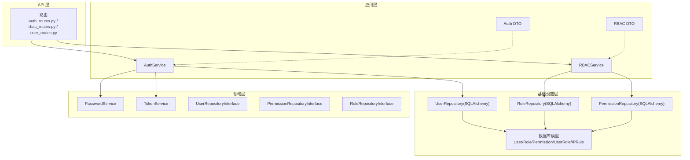
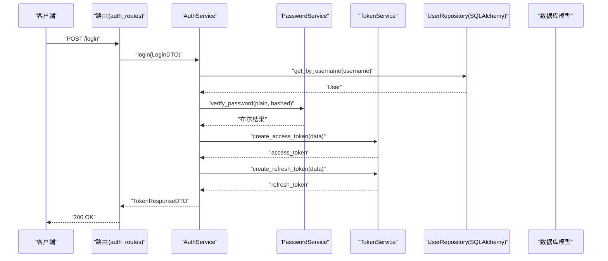
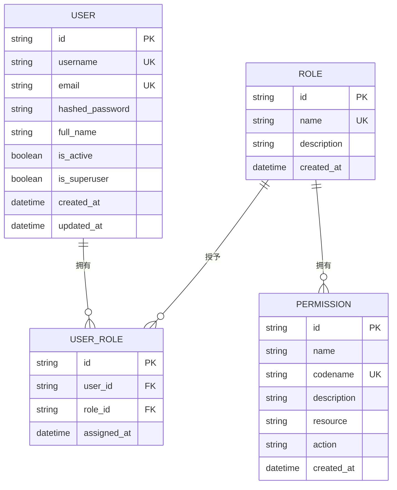
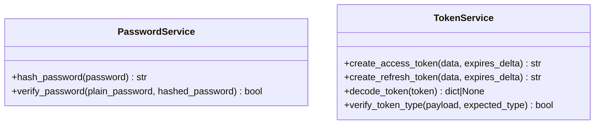
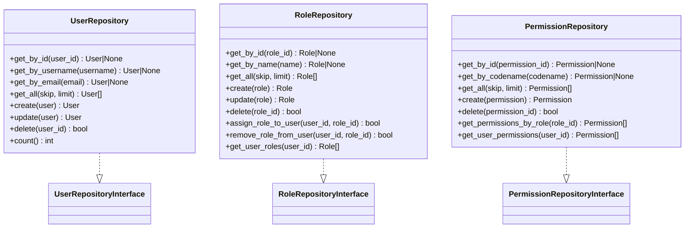
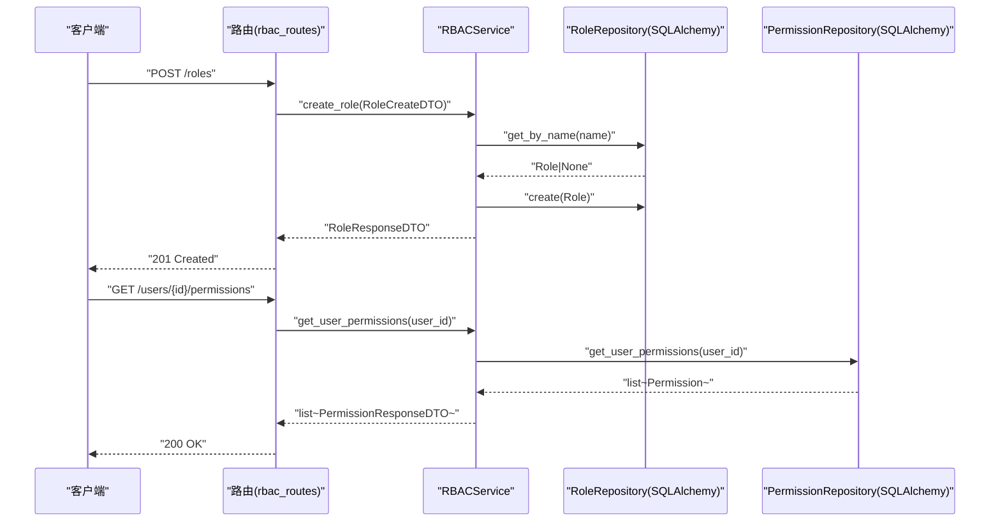
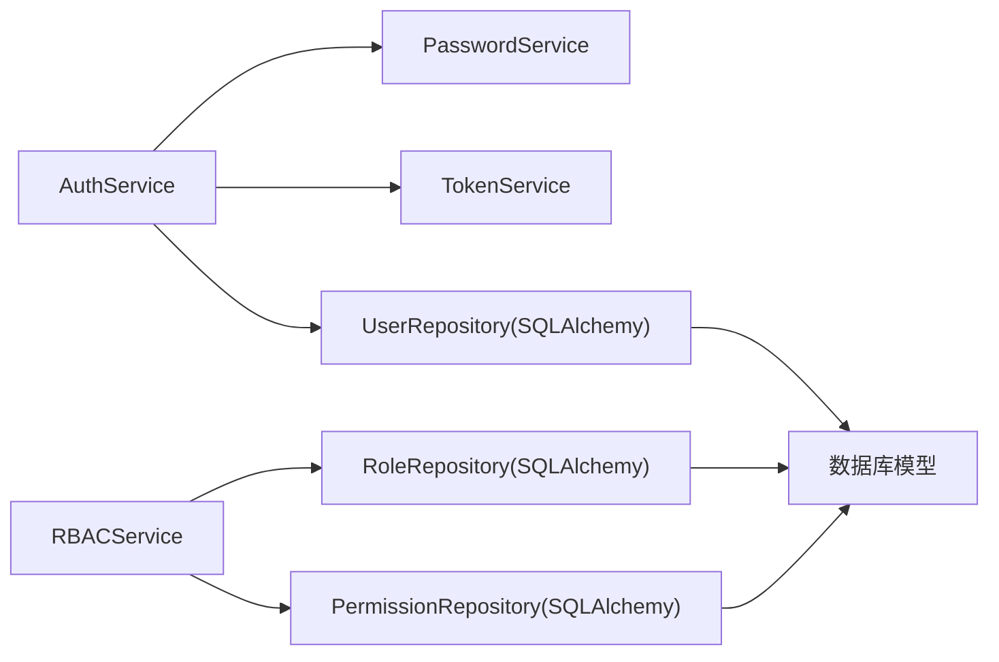

# 领域驱动设计(Domain Driven Design)

<cite>
**本文引用的文件**
- [src/domain/auth/password_service.py](file://src/domain/auth/password_service.py)
- [src/domain/auth/token_service.py](file://src/domain/auth/token_service.py)
- [src/application/services/auth_service.py](file://src/application/services/auth_service.py)
- [src/application/services/rbac_service.py](file://src/application/services/rbac_service.py)
- [src/infrastructure/repositories/user_repository.py](file://src/infrastructure/repositories/user_repository.py)
- [src/infrastructure/repositories/rbac_repository.py](file://src/infrastructure/repositories/rbac_repository.py)
- [src/infrastructure/database/models.py](file://src/infrastructure/database/models.py)
- [src/application/dto/auth_dto.py](file://src/application/dto/auth_dto.py)
- [src/application/dto/rbac_dto.py](file://src/application/dto/rbac_dto.py)
</cite>

## 目录
1. [引言](#引言)
2. [项目结构](#项目结构)
3. [核心组件](#核心组件)
4. [架构总览](#架构总览)
5. [详细组件分析](#详细组件分析)
6. [依赖分析](#依赖分析)
7. [性能考虑](#性能考虑)
8. [故障排查指南](#故障排查指南)
9. [结论](#结论)
10. [附录](#附录)

## 引言
本文件面向 Hello-FastApi 项目，系统化阐述领域驱动设计（DDD）在项目中的落地实践。重点覆盖以下方面：
- 聚合根（Aggregate Root）：以用户、角色、权限为核心实体，明确边界与不变式。
- 值对象（Value Object）：围绕标识符、权限编码等不可变对象的设计与使用。
- 领域服务（Domain Service）：认证与令牌管理、权限检查等业务逻辑封装。
- 仓储接口（Repository Interface）：抽象数据访问，隔离基础设施差异。
- 领域事件与不变式：结合现有代码，给出可扩展的事件与约束建议。

## 项目结构
项目采用分层架构与 DDD 分层组织：
- domain 层：定义领域模型、领域服务与仓储接口，保持纯业务语义。
- application 层：应用服务编排业务用例，协调领域与基础设施。
- infrastructure 层：数据库模型、SQLAlchemy 实现的仓储与缓存客户端。
- api 层：路由与依赖注入，连接外部请求与应用服务。

图表来源
- [src/application/services/auth_service.py:13-67](file://src/application/services/auth_service.py#L13-L67)
- [src/application/services/rbac_service.py:20-158](file://src/application/services/rbac_service.py#L20-L158)
- [src/infrastructure/repositories/user_repository.py:11-61](file://src/infrastructure/repositories/user_repository.py#L11-L61)
- [src/infrastructure/repositories/rbac_repository.py:11-133](file://src/infrastructure/repositories/rbac_repository.py#L11-L133)
- [src/infrastructure/database/models.py:30-143](file://src/infrastructure/database/models.py#L30-L143)

章节来源
- [src/application/services/auth_service.py:13-67](file://src/application/services/auth_service.py#L13-L67)
- [src/application/services/rbac_service.py:20-158](file://src/application/services/rbac_service.py#L20-L158)
- [src/infrastructure/repositories/user_repository.py:11-61](file://src/infrastructure/repositories/user_repository.py#L11-L61)
- [src/infrastructure/repositories/rbac_repository.py:11-133](file://src/infrastructure/repositories/rbac_repository.py#L11-L133)
- [src/infrastructure/database/models.py:30-143](file://src/infrastructure/database/models.py#L30-L143)

## 核心组件
本节聚焦 DDD 的四大要素在项目中的体现与职责划分。

- 聚合根（Aggregate Root）
  - 用户聚合：User 是用户聚合根，包含身份信息、认证凭据与激活状态；聚合内维护“用户名/邮箱唯一”、“账户启用状态”等不变式。
  - 角色聚合：Role 是角色聚合根，包含名称与描述；聚合内维护“角色名唯一”等不变式。
  - 权限聚合：Permission 是权限聚合根，包含名称、编码、资源与动作；聚合内维护“权限编码唯一”等不变式。
  - 关联聚合：UserRole 作为用户-角色的关联实体，承载分配时间等上下文信息。

- 值对象（Value Object）
  - 用户标识符：UUID 字符串，作为主键，不可变且全局唯一。
  - 权限编码（codename）：字符串标识符，具备业务含义且唯一，常用于权限检查。
  - 资源与动作：字符串组合形成细粒度权限维度，便于策略化授权。
  - DTO：LoginDTO、TokenResponseDTO 等作为应用层的值对象，承载跨层传输的数据契约。

- 领域服务（Domain Service）
  - PasswordService：封装密码哈希与校验，保证安全处理的集中化与一致性。
  - TokenService：封装 JWT 的生成、解码与类型校验，统一安全策略。

- 仓储接口（Repository Interface）
  - UserRepositoryInterface、RoleRepositoryInterface、PermissionRepositoryInterface：定义聚合的查询与变更操作，屏蔽底层实现细节。
  - 具体实现：UserRepository、RoleRepository、PermissionRepository 基于 SQLAlchemy 实现，负责持久化与事务控制。

- 应用服务（Application Service）
  - AuthService：编排登录、令牌刷新流程，协调仓储与领域服务。
  - RBACService：编排角色、权限与分配操作，执行业务规则与错误处理。

章节来源
- [src/infrastructure/database/models.py:30-143](file://src/infrastructure/database/models.py#L30-L143)
- [src/domain/auth/password_service.py:6-24](file://src/domain/auth/password_service.py#L6-L24)
- [src/domain/auth/token_service.py:9-41](file://src/domain/auth/token_service.py#L9-L41)
- [src/application/services/auth_service.py:13-67](file://src/application/services/auth_service.py#L13-L67)
- [src/application/services/rbac_service.py:20-158](file://src/application/services/rbac_service.py#L20-L158)
- [src/infrastructure/repositories/user_repository.py:11-61](file://src/infrastructure/repositories/user_repository.py#L11-L61)
- [src/infrastructure/repositories/rbac_repository.py:11-133](file://src/infrastructure/repositories/rbac_repository.py#L11-L133)
- [src/application/dto/auth_dto.py:6-25](file://src/application/dto/auth_dto.py#L6-L25)
- [src/application/dto/rbac_dto.py:8-70](file://src/application/dto/rbac_dto.py#L8-L70)

## 架构总览
下图展示了从 API 请求到领域与基础设施的完整调用链，体现应用服务作为用例编排者的作用，以及领域服务与仓储接口的协作方式。

图表来源
- [src/application/services/auth_service.py:21-40](file://src/application/services/auth_service.py#L21-L40)
- [src/domain/auth/password_service.py:18-23](file://src/domain/auth/password_service.py#L18-L23)
- [src/domain/auth/token_service.py:13-26](file://src/domain/auth/token_service.py#L13-L26)
- [src/infrastructure/repositories/user_repository.py:22-25](file://src/infrastructure/repositories/user_repository.py#L22-L25)
- [src/infrastructure/database/models.py:30-54](file://src/infrastructure/database/models.py#L30-L54)

## 详细组件分析

### 聚合根与不变式
- 用户聚合（User）
  - 不变式：用户名与邮箱唯一；账户需处于启用状态方可登录。
  - 行为：与角色聚合通过 UserRole 关联，支持按角色加载。
- 角色聚合（Role）
  - 不变式：角色名唯一；可绑定多个权限。
- 权限聚合（Permission）
  - 不变式：权限编码唯一；可被多个角色持有。
- 关联实体（UserRole）
  - 不变式：同一用户与角色的分配关系唯一；支持按用户查询其角色集合。

图表来源
- [src/infrastructure/database/models.py:30-123](file://src/infrastructure/database/models.py#L30-L123)

章节来源
- [src/infrastructure/database/models.py:30-123](file://src/infrastructure/database/models.py#L30-L123)

### 值对象设计
- 用户标识符：UUID 字符串，确保全局唯一性与不可变性。
- 权限编码（codename）：业务语义强的字符串标识，用于快速匹配与策略判断。
- 资源与动作：组合形成细粒度授权维度，便于扩展。
- DTO：LoginDTO、TokenResponseDTO、RoleCreateDTO、PermissionCreateDTO 等，作为跨层传输的值对象，承担输入输出契约。

章节来源
- [src/application/dto/auth_dto.py:6-25](file://src/application/dto/auth_dto.py#L6-L25)
- [src/application/dto/rbac_dto.py:8-70](file://src/application/dto/rbac_dto.py#L8-L70)
- [src/infrastructure/database/models.py:87-92](file://src/infrastructure/database/models.py#L87-L92)

### 领域服务
- PasswordService
  - 职责：密码哈希与校验，集中处理安全逻辑。
  - 复杂度：哈希与校验均为 O(1)，受 bcrypt 参数影响。
- TokenService
  - 职责：生成访问/刷新令牌、解码与类型校验，统一安全策略。
  - 复杂度：编码/解码为 O(1)，受算法参数影响。

图表来源
- [src/domain/auth/password_service.py:6-24](file://src/domain/auth/password_service.py#L6-L24)
- [src/domain/auth/token_service.py:9-41](file://src/domain/auth/token_service.py#L9-L41)

章节来源
- [src/domain/auth/password_service.py:6-24](file://src/domain/auth/password_service.py#L6-L24)
- [src/domain/auth/token_service.py:9-41](file://src/domain/auth/token_service.py#L9-L41)

### 仓储接口与实现
- 接口职责
  - UserRepositoryInterface：按 id/用户名/邮箱查询、分页查询、创建、更新、删除、计数。
  - RoleRepositoryInterface：按 id/名称查询、分页查询、创建、更新、删除、分配/移除角色、查询用户角色。
  - PermissionRepositoryInterface：按 id/编码查询、分页查询、创建、删除、按角色查询权限、查询用户权限。
- 实现要点
  - 使用 SQLAlchemy 异步会话，支持 selectinload 提升 N+1 查询性能。
  - 统一 flush/refresh 流程，保证读写一致性。
  - 对重复分配、不存在记录等情况进行显式错误处理。

图表来源
- [src/infrastructure/repositories/user_repository.py:11-61](file://src/infrastructure/repositories/user_repository.py#L11-L61)
- [src/infrastructure/repositories/rbac_repository.py:11-133](file://src/infrastructure/repositories/rbac_repository.py#L11-L133)

章节来源
- [src/infrastructure/repositories/user_repository.py:11-61](file://src/infrastructure/repositories/user_repository.py#L11-L61)
- [src/infrastructure/repositories/rbac_repository.py:11-133](file://src/infrastructure/repositories/rbac_repository.py#L11-L133)

### 应用服务与业务流程
- AuthService.login
  - 步骤：按用户名查询用户 → 校验密码 → 校验账户状态 → 生成访问/刷新令牌 → 返回 DTO。
  - 错误处理：用户名不存在、密码错误、账户禁用均抛出未授权异常。
- RBACService
  - 角色管理：创建/查询/更新/删除角色，含重名校验。
  - 权限管理：创建/查询/删除权限，含编码唯一校验。
  - 分配管理：为用户分配/移除角色，查询用户角色与权限，检查权限存在性。

图表来源
- [src/application/services/rbac_service.py:29-36](file://src/application/services/rbac_service.py#L29-L36)
- [src/application/services/rbac_service.py:124-127](file://src/application/services/rbac_service.py#L124-L127)
- [src/infrastructure/repositories/rbac_repository.py:17-25](file://src/infrastructure/repositories/rbac_repository.py#L17-L25)
- [src/infrastructure/repositories/rbac_repository.py:123-132](file://src/infrastructure/repositories/rbac_repository.py#L123-L132)

章节来源
- [src/application/services/auth_service.py:21-40](file://src/application/services/auth_service.py#L21-L40)
- [src/application/services/rbac_service.py:29-36](file://src/application/services/rbac_service.py#L29-L36)
- [src/application/services/rbac_service.py:124-127](file://src/application/services/rbac_service.py#L124-L127)

### 领域事件与不变式约束（扩展建议）
- 领域事件（建议）
  - 用户创建/更新：触发“用户信息变更”事件，供审计或通知模块订阅。
  - 角色分配/移除：触发“角色变更”事件，用于同步权限缓存或日志记录。
  - 密码修改：触发“安全事件”，用于强制刷新令牌与审计。
- 不变式约束（建议）
  - 用户-角色分配唯一性：在分配前查询确认，避免重复分配。
  - 权限编码唯一性：在创建/更新时进行冲突检测。
  - 账户状态与登录：登录前校验 is_active，防止禁用账户访问。
- 事件发布与订阅
  - 可引入轻量事件总线或消息队列，应用服务在关键业务点发布事件，基础设施层订阅并落库或异步处理。

（本小节为概念性扩展，不直接对应现有代码，故不附“章节来源”）

## 依赖分析
- 应用服务依赖领域服务与仓储接口，不直接依赖具体实现，满足依赖倒置原则。
- 领域服务仅依赖配置与第三方库，不依赖应用层或基础设施层。
- 仓储接口与实现分离，便于替换存储后端（如迁移到其他 ORM 或 NoSQL）。

图表来源
- [src/application/services/auth_service.py:16-19](file://src/application/services/auth_service.py#L16-L19)
- [src/application/services/rbac_service.py:23-25](file://src/application/services/rbac_service.py#L23-L25)
- [src/infrastructure/repositories/user_repository.py:14-15](file://src/infrastructure/repositories/user_repository.py#L14-L15)
- [src/infrastructure/repositories/rbac_repository.py:14-15](file://src/infrastructure/repositories/rbac_repository.py#L14-L15)
- [src/infrastructure/database/models.py:30-143](file://src/infrastructure/database/models.py#L30-L143)

章节来源
- [src/application/services/auth_service.py:16-19](file://src/application/services/auth_service.py#L16-L19)
- [src/application/services/rbac_service.py:23-25](file://src/application/services/rbac_service.py#L23-L25)
- [src/infrastructure/repositories/user_repository.py:14-15](file://src/infrastructure/repositories/user_repository.py#L14-L15)
- [src/infrastructure/repositories/rbac_repository.py:14-15](file://src/infrastructure/repositories/rbac_repository.py#L14-L15)

## 性能考虑
- 查询优化
  - 使用 selectinload 预加载关联，减少 N+1 查询。
  - 合理使用索引（用户名、邮箱、权限编码、角色名）提升查询效率。
- 写入优化
  - 批量插入/更新时注意 flush/refresh 的使用，避免不必要的数据库往返。
- 缓存策略
  - 将热点权限与用户角色映射放入缓存，降低频繁查询成本。
- 令牌与安全
  - 控制令牌有效期与刷新频率，平衡安全性与用户体验。

（本节提供通用指导，不直接分析具体文件，故不附“章节来源”）

## 故障排查指南
- 登录失败
  - 现象：返回未授权错误。
  - 排查：确认用户名是否存在、密码是否正确、账户是否启用。
- 令牌无效
  - 现象：刷新令牌时报错。
  - 排查：检查令牌类型是否为刷新令牌、负载是否有效、用户是否存在且启用。
- 角色/权限冲突
  - 现象：创建角色/权限时报冲突错误。
  - 排查：确认名称/编码是否已存在，避免重复。
- 分配异常
  - 现象：为用户分配角色失败或移除不存在的分配。
  - 排查：确认用户与角色存在性，检查分配是否已存在或已被移除。

章节来源
- [src/application/services/auth_service.py:24-31](file://src/application/services/auth_service.py#L24-L31)
- [src/application/services/auth_service.py:45-57](file://src/application/services/auth_service.py#L45-L57)
- [src/application/services/rbac_service.py:31-32](file://src/application/services/rbac_service.py#L31-L32)
- [src/application/services/rbac_service.py:77-78](file://src/application/services/rbac_service.py#L77-L78)
- [src/application/services/rbac_service.py:109-110](file://src/application/services/rbac_service.py#L109-L110)
- [src/application/services/rbac_service.py:115-116](file://src/application/services/rbac_service.py#L115-L116)

## 结论
Hello-FastApi 在当前版本中已较好地实现了 DDD 的分层与职责划分：领域层专注业务不变式与安全逻辑，应用层编排用例，基础设施层屏蔽数据访问细节。建议后续引入领域事件与更完善的不变式约束，进一步增强系统的可扩展性与可维护性。

## 附录
- 数据模型概览
  - 用户：id、username、email、hashed_password、full_name、is_active、is_superuser、created_at、updated_at。
  - 角色：id、name、description、created_at。
  - 权限：id、name、codename、description、resource、action、created_at。
  - 用户-角色：id、user_id、role_id、assigned_at。
- DTO 概览
  - 登录：username、password。
  - 令牌响应：access_token、refresh_token、token_type。
  - 角色创建/更新：name、description。
  - 权限创建：name、codename、description、resource、action。

章节来源
- [src/infrastructure/database/models.py:30-143](file://src/infrastructure/database/models.py#L30-L143)
- [src/application/dto/auth_dto.py:6-25](file://src/application/dto/auth_dto.py#L6-L25)
- [src/application/dto/rbac_dto.py:8-70](file://src/application/dto/rbac_dto.py#L8-L70)