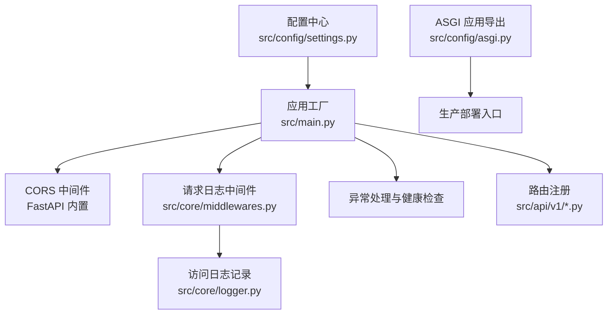
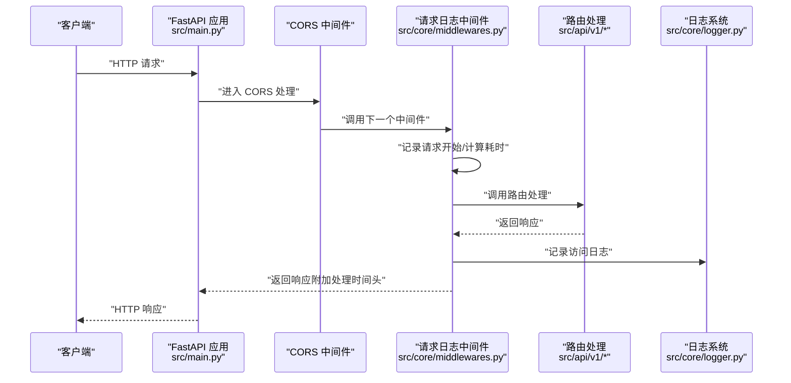
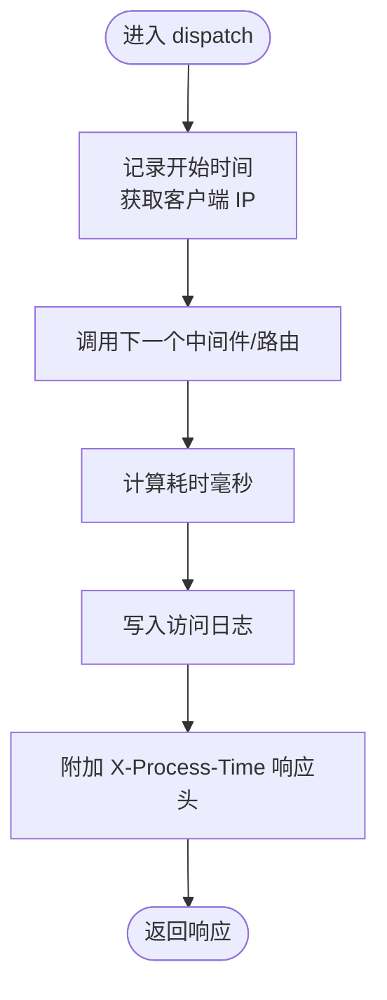
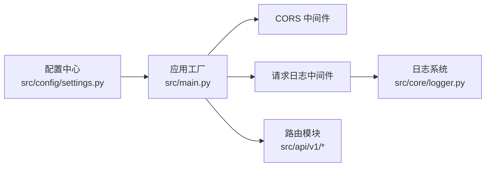

# 中间件系统

<cite>
**本文引用的文件**
- [src/main.py](file://src/main.py)
- [src/core/middlewares.py](file://src/core/middlewares.py)
- [src/core/logger.py](file://src/core/logger.py)
- [src/config/settings.py](file://src/config/settings.py)
- [src/config/asgi.py](file://src/config/asgi.py)
- [src/api/dependencies.py](file://src/api/dependencies.py)
- [src/api/v1/auth_routes.py](file://src/api/v1/auth_routes.py)
- [src/api/v1/rbac_routes.py](file://src/api/v1/rbac_routes.py)
</cite>

## 目录
1. [简介](#简介)
2. [项目结构](#项目结构)
3. [核心组件](#核心组件)
4. [架构总览](#架构总览)
5. [详细组件分析](#详细组件分析)
6. [依赖分析](#依赖分析)
7. [性能考虑](#性能考虑)
8. [故障排查指南](#故障排查指南)
9. [结论](#结论)
10. [附录](#附录)

## 简介
本文件系统性阐述本项目的 ASGI 中间件体系，重点覆盖以下内容：
- CORS 中间件、请求日志中间件与 IP 过滤中间件的实现原理与配置方法
- 中间件的执行顺序与生命周期（请求前处理与响应后处理）
- 自定义中间件的开发与集成流程
- 性能优化与调试技巧
- 实际示例路径（以文件路径与行号标注代替具体代码）

## 项目结构
本项目采用 FastAPI 应用工厂模式构建，中间件在应用创建阶段集中注册，CORS 中间件与自定义请求日志中间件均在此处配置。日志系统通过统一的 logger 模块实现访问日志与应用日志分离。

图表来源
- [src/main.py:34-92](file://src/main.py#L34-L92)
- [src/core/middlewares.py:12-39](file://src/core/middlewares.py#L12-L39)
- [src/core/logger.py:75-85](file://src/core/logger.py#L75-L85)
- [src/config/settings.py:69-76](file://src/config/settings.py#L69-L76)
- [src/config/asgi.py:1-6](file://src/config/asgi.py#L1-L6)

章节来源
- [src/main.py:34-92](file://src/main.py#L34-L92)
- [src/config/settings.py:69-76](file://src/config/settings.py#L69-L76)
- [src/config/asgi.py:1-6](file://src/config/asgi.py#L1-L6)

## 核心组件
- CORS 中间件：通过 FastAPI 内置的 CORSMiddleware 提供跨域支持，配置项来源于配置中心。
- 请求日志中间件：基于 BaseHTTPMiddleware 实现，负责统计处理时长、记录访问日志并注入响应头。
- IP 过滤中间件：基于 BaseHTTPMiddleware 实现，支持白名单与黑名单控制，拒绝不合规请求。
- 日志系统：统一使用 loguru，分离应用日志、错误日志与访问日志，访问日志通过绑定额外字段进行过滤输出。

章节来源
- [src/main.py:46-58](file://src/main.py#L46-L58)
- [src/core/middlewares.py:12-64](file://src/core/middlewares.py#L12-L64)
- [src/core/logger.py:75-85](file://src/core/logger.py#L75-L85)

## 架构总览
下图展示了请求在中间件链路中的流转与处理阶段，以及与路由、异常处理的关系。

图表来源
- [src/main.py:46-58](file://src/main.py#L46-L58)
- [src/core/middlewares.py:15-39](file://src/core/middlewares.py#L15-L39)
- [src/core/logger.py:75-85](file://src/core/logger.py#L75-L85)

## 详细组件分析

### CORS 中间件
- 配置来源：CORS 源列表由配置中心解析，支持多源逗号分隔。
- 注册位置：应用工厂中集中注册，确保在路由之前生效。
- 行为特征：允许凭证、通配符方法与头部，便于前端开发与跨域资源访问。

章节来源
- [src/main.py:46-53](file://src/main.py#L46-L53)
- [src/config/settings.py:69-76](file://src/config/settings.py#L69-L76)

### 请求日志中间件
- 生命周期：
  - 请求前：记录开始时间与客户端 IP；记录请求开始日志。
  - 响应后：计算处理时长（毫秒），写入访问日志并附加 X-Process-Time 响应头。
- 日志输出：通过统一 logger 的访问日志通道输出，便于与应用日志分离。
- 性能影响：仅进行时间计算与一次日志写入，开销极低。

图表来源
- [src/core/middlewares.py:15-39](file://src/core/middlewares.py#L15-L39)
- [src/core/logger.py:75-85](file://src/core/logger.py#L75-L85)

章节来源
- [src/core/middlewares.py:12-39](file://src/core/middlewares.py#L12-L39)
- [src/core/logger.py:75-85](file://src/core/logger.py#L75-L85)

### IP 过滤中间件
- 功能：支持白名单优先策略与黑名单检查；命中则立即返回 403。
- 集成：作为自定义中间件注册于应用工厂，位于 CORS 之后、路由之前。
- 注意：该中间件未在当前仓库中被注册，如需启用请参考“自定义中间件开发与集成”。

章节来源
- [src/core/middlewares.py:42-64](file://src/core/middlewares.py#L42-L64)
- [src/main.py:55-58](file://src/main.py#L55-L58)

### 权限验证与中间件的关系
- 本项目未提供基于中间件的全局权限校验，而是通过路由依赖项实现细粒度权限控制。
- 示例：RBAC 路由中使用 require_permission 依赖项，结合 JWT 解析与数据库权限查询，实现按路由的权限拦截。
- 该方式更灵活且与业务耦合度低，适合复杂权限场景。

章节来源
- [src/api/dependencies.py:45-60](file://src/api/dependencies.py#L45-L60)
- [src/api/v1/rbac_routes.py:40](file://src/api/v1/rbac_routes.py#L40)
- [src/api/v1/rbac_routes.py:159](file://src/api/v1/rbac_routes.py#L159)

## 依赖分析
- 应用工厂集中注册中间件与路由，保证执行顺序可控。
- 配置中心提供 CORS 源列表与日志级别等参数，避免硬编码。
- 日志系统通过过滤器区分访问日志与其他日志，便于运维与审计。

图表来源
- [src/config/settings.py:69-76](file://src/config/settings.py#L69-L76)
- [src/main.py:46-58](file://src/main.py#L46-L58)
- [src/core/logger.py:75-85](file://src/core/logger.py#L75-L85)

章节来源
- [src/main.py:34-92](file://src/main.py#L34-L92)
- [src/config/settings.py:69-76](file://src/config/settings.py#L69-L76)
- [src/core/logger.py:75-85](file://src/core/logger.py#L75-L85)

## 性能考虑
- 中间件顺序优化：将轻量中间件（如日志）置于靠前位置，避免后续中间件异常导致重复统计。
- 日志成本控制：访问日志采用异步队列写入（enqueue），降低阻塞风险；建议在生产环境适当提高日志级别。
- 响应头最小化：仅在必要时附加处理时间头，避免对带宽造成额外压力。
- 异常处理前置：将异常处理器置于中间件之后，确保异常也能被统一记录与格式化。

## 故障排查指南
- 访问日志缺失：
  - 检查日志目录是否存在且具备写权限。
  - 确认日志级别设置是否过低，导致 INFO 级别被忽略。
- CORS 失败：
  - 核对配置中心中的 CORS_ORIGINS 是否包含前端地址，且无多余空格。
  - 确认浏览器预检请求（OPTIONS）已被正确放行。
- 请求耗时异常：
  - 确认中间件注册顺序，避免重复计时或遗漏。
  - 检查网络延迟与上游代理是否影响时钟精度。
- 权限拦截问题：
  - 确认路由依赖项 require_permission 已正确声明。
  - 检查用户权限是否正确写入数据库，以及 JWT 令牌是否携带有效用户标识。

章节来源
- [src/core/logger.py:17-72](file://src/core/logger.py#L17-L72)
- [src/config/settings.py:69-76](file://src/config/settings.py#L69-L76)
- [src/api/dependencies.py:45-60](file://src/api/dependencies.py#L45-L60)

## 结论
本项目的中间件体系以“集中注册、顺序可控、日志分离”为核心设计原则。CORS 与请求日志中间件满足跨域与可观测性需求；权限控制通过路由依赖项实现精细化治理。整体架构清晰、易于扩展与维护。

## 附录

### 中间件执行顺序与生命周期
- 顺序：CORS → 自定义请求日志 → 路由 → 异常处理
- 生命周期：
  - 请求前：记录开始时间、客户端 IP；进行跨域与访问控制。
  - 响应后：计算耗时、写入访问日志、附加处理时间头。

章节来源
- [src/main.py:46-58](file://src/main.py#L46-L58)
- [src/core/middlewares.py:15-39](file://src/core/middlewares.py#L15-L39)

### 自定义中间件开发与集成
- 开发步骤：
  - 继承 BaseHTTPMiddleware 并实现 dispatch(request, call_next)。
  - 在请求前处理（如鉴权、限流、参数清洗）与响应后处理（如日志、指标上报）之间平衡。
  - 尽量保持无状态与幂等，避免共享可变资源。
- 集成方式：
  - 在应用工厂中通过 app.add_middleware(...) 注册。
  - 将中间件置于 CORS 之后、路由之前，确保其能覆盖到业务逻辑。
- 参考实现路径：
  - 请求日志中间件：[src/core/middlewares.py:12-39](file://src/core/middlewares.py#L12-L39)
  - IP 过滤中间件：[src/core/middlewares.py:42-64](file://src/core/middlewares.py#L42-L64)

章节来源
- [src/core/middlewares.py:12-64](file://src/core/middlewares.py#L12-L64)
- [src/main.py:55-58](file://src/main.py#L55-L58)

### 配置现有中间件
- CORS 配置：
  - 源列表：CORS_ORIGINS（逗号分隔字符串），由 cors_origins_list 属性解析。
  - 参考：[src/config/settings.py:69-76](file://src/config/settings.py#L69-L76)，[src/main.py:46-53](file://src/main.py#L46-L53)
- 请求日志中间件：
  - 直接注册，无需额外配置。
  - 参考：[src/main.py:55-58](file://src/main.py#L55-L58)
- IP 过滤中间件：
  - 支持传入 blacklist 与 whitelist 参数，按白名单优先策略工作。
  - 参考：[src/core/middlewares.py:42-64](file://src/core/middlewares.py#L42-L64)

章节来源
- [src/config/settings.py:69-76](file://src/config/settings.py#L69-L76)
- [src/main.py:46-58](file://src/main.py#L46-L58)
- [src/core/middlewares.py:42-64](file://src/core/middlewares.py#L42-L64)

### 实际示例：添加新的中间件
- 示例路径（以文件与行号标注代替代码）：
  - 在应用工厂中注册中间件：[src/main.py:55-58](file://src/main.py#L55-L58)
  - 在配置中心增加相关参数（如白名单/黑名单）：[src/config/settings.py:69-76](file://src/config/settings.py#L69-L76)
  - 在日志系统中新增通道或调整过滤器（如需）：[src/core/logger.py:17-72](file://src/core/logger.py#L17-L72)

### 实际示例：配置现有中间件
- CORS 源列表配置与解析：[src/config/settings.py:69-76](file://src/config/settings.py#L69-L76)
- 中间件注册与异常处理：[src/main.py:46-82](file://src/main.py#L46-L82)