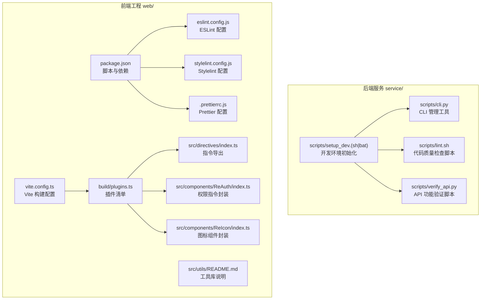
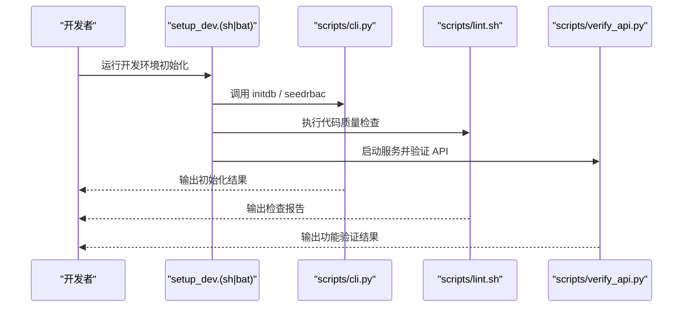
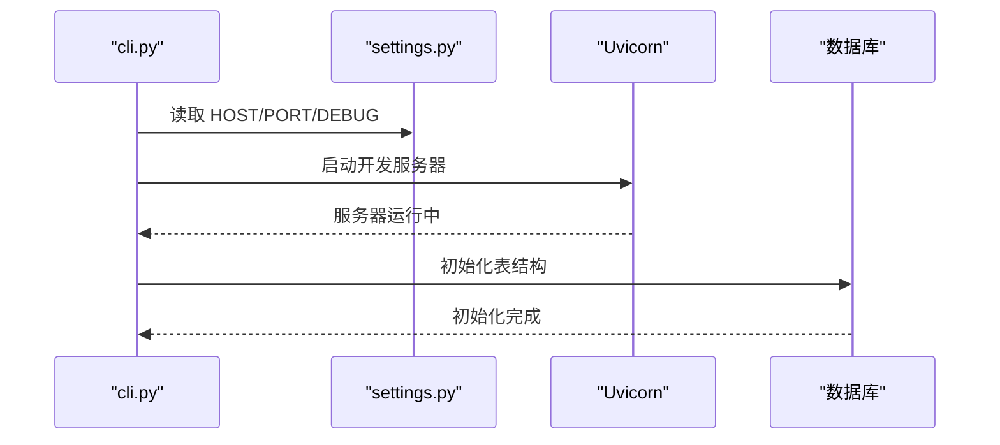
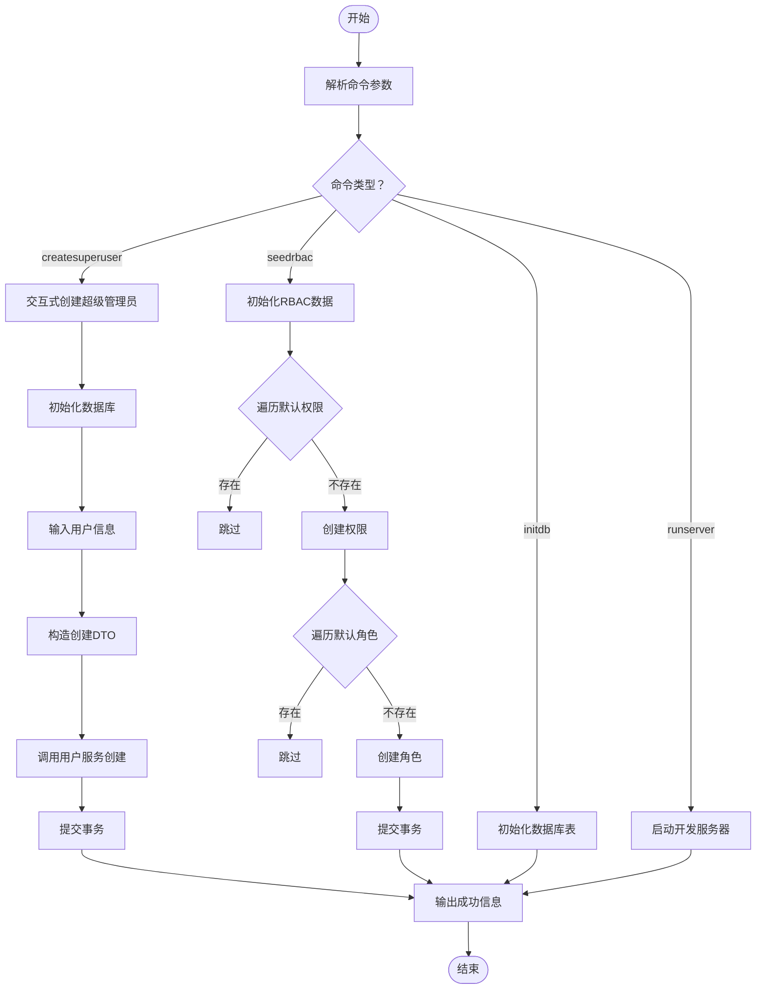
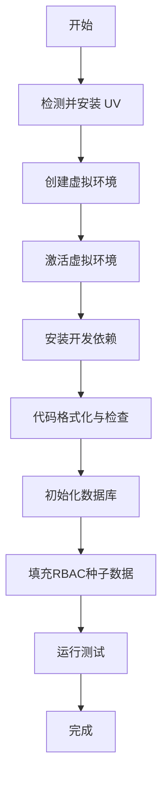
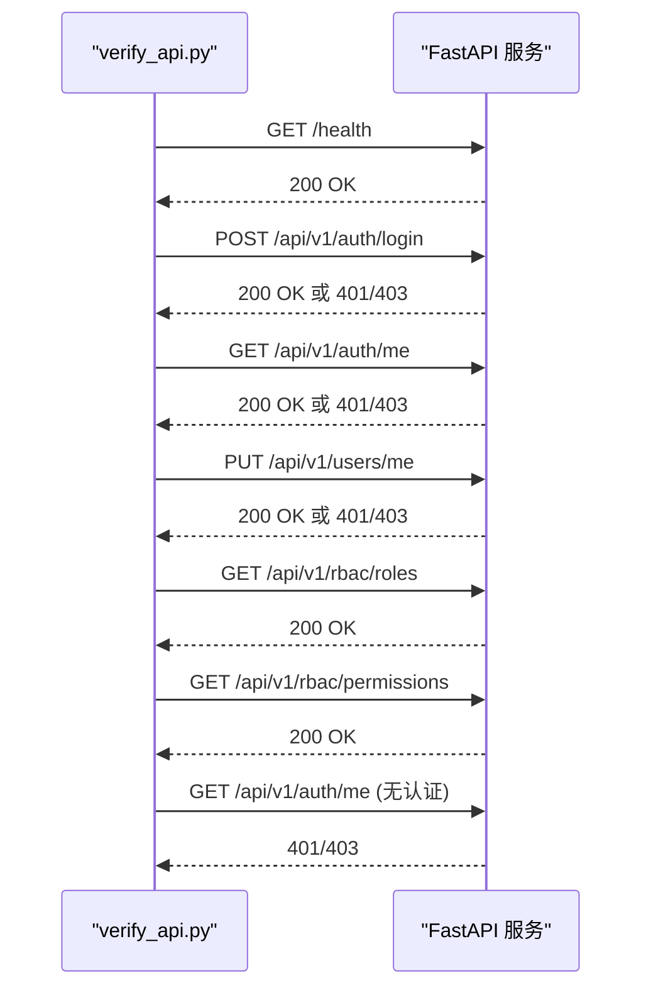
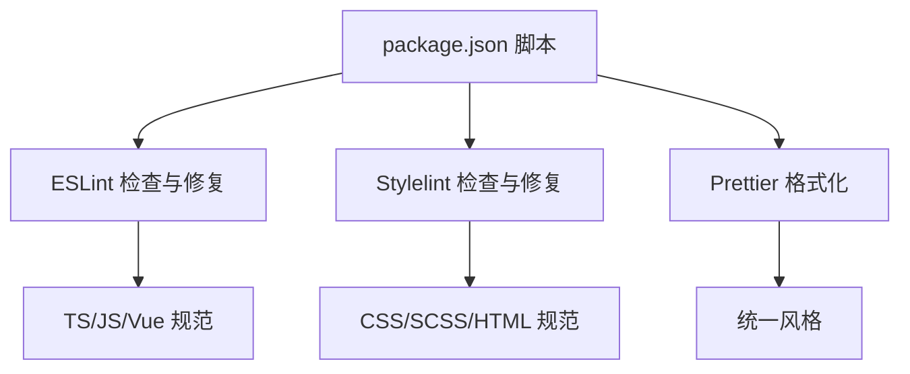
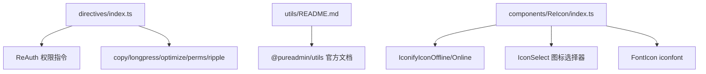
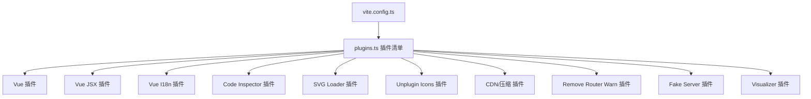
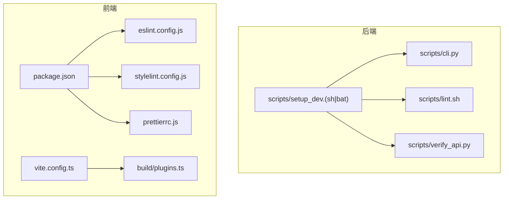

# 开发工具与实用函数

<cite>
**本文引用的文件**
- [cli.py](file://service/scripts/cli.py)
- [lint.sh](file://service/scripts/lint.sh)
- [setup_dev.sh](file://service/scripts/setup_dev.sh)
- [setup_dev.bat](file://service/scripts/setup_dev.bat)
- [verify_api.py](file://service/scripts/verify_api.py)
- [eslint.config.js](file://web/eslint.config.js)
- [stylelint.config.js](file://web/stylelint.config.js)
- [.prettierrc.js](file://web/.prettierrc.js)
- [package.json](file://web/package.json)
- [vite.config.ts](file://web/vite.config.ts)
- [plugins.ts](file://web/build/plugins.ts)
- [directives/index.ts](file://web/src/directives/index.ts)
- [utils/README.md](file://web/src/utils/README.md)
- [components/ReAuth/index.ts](file://web/src/components/ReAuth/index.ts)
- [components/ReIcon/index.ts](file://web/src/components/ReIcon/index.ts)
</cite>

## 目录
1. [简介](#简介)
2. [项目结构](#项目结构)
3. [核心组件](#核心组件)
4. [架构总览](#架构总览)
5. [详细组件分析](#详细组件分析)
6. [依赖分析](#依赖分析)
7. [性能考虑](#性能考虑)
8. [故障排查指南](#故障排查指南)
9. [结论](#结论)
10. [附录](#附录)

## 简介
本文件面向后端与前端开发团队，系统性梳理并说明以下内容：
- 后端 CLI 工具：数据库初始化、用户创建、系统维护命令及一键开发环境搭建脚本。
- 前端开发工具链：指令系统、工具函数与组件库的使用方法与最佳实践。
- 代码质量工具：ESLint、Stylelint、Prettier 的配置与使用，以及自动化检查脚本。
- 开发环境优化与调试技巧：构建配置、插件生态、性能分析与常见问题排查。

## 项目结构
该项目采用前后端分离的工程化组织方式：
- 后端服务位于 service/ 目录，包含 Python 应用、脚本工具与数据库模型。
- 前端工程位于 web/ 目录，包含 Vue3 + TypeScript + Vite 的现代化前端应用与丰富的组件库。

图表来源
- [cli.py:1-135](file://service/scripts/cli.py#L1-L135)
- [lint.sh:1-19](file://service/scripts/lint.sh#L1-L19)
- [setup_dev.sh:1-47](file://service/scripts/setup_dev.sh#L1-L47)
- [setup_dev.bat:1-44](file://service/scripts/setup_dev.bat#L1-L44)
- [verify_api.py:1-176](file://service/scripts/verify_api.py#L1-L176)
- [eslint.config.js:1-191](file://web/eslint.config.js#L1-L191)
- [stylelint.config.js:1-88](file://web/stylelint.config.js#L1-L88)
- [.prettierrc.js:1-10](file://web/.prettierrc.js#L1-L10)
- [package.json:1-210](file://web/package.json#L1-L210)
- [vite.config.ts:1-67](file://web/vite.config.ts#L1-L67)
- [plugins.ts:1-77](file://web/build/plugins.ts#L1-L77)
- [directives/index.ts:1-7](file://web/src/directives/index.ts#L1-L7)
- [utils/README.md:1-6](file://web/src/utils/README.md#L1-L6)
- [components/ReAuth/index.ts:1-6](file://web/src/components/ReAuth/index.ts#L1-L6)
- [components/ReIcon/index.ts:1-16](file://web/src/components/ReIcon/index.ts#L1-L16)

章节来源
- [cli.py:1-135](file://service/scripts/cli.py#L1-L135)
- [lint.sh:1-19](file://service/scripts/lint.sh#L1-L19)
- [setup_dev.sh:1-47](file://service/scripts/setup_dev.sh#L1-L47)
- [setup_dev.bat:1-44](file://service/scripts/setup_dev.bat#L1-L44)
- [verify_api.py:1-176](file://service/scripts/verify_api.py#L1-L176)
- [eslint.config.js:1-191](file://web/eslint.config.js#L1-L191)
- [stylelint.config.js:1-88](file://web/stylelint.config.js#L1-L88)
- [.prettierrc.js:1-10](file://web/.prettierrc.js#L1-L10)
- [package.json:1-210](file://web/package.json#L1-L210)
- [vite.config.ts:1-67](file://web/vite.config.ts#L1-L67)
- [plugins.ts:1-77](file://web/build/plugins.ts#L1-L77)
- [directives/index.ts:1-7](file://web/src/directives/index.ts#L1-L7)
- [utils/README.md:1-6](file://web/src/utils/README.md#L1-L6)
- [components/ReAuth/index.ts:1-6](file://web/src/components/ReAuth/index.ts#L1-L6)
- [components/ReIcon/index.ts:1-16](file://web/src/components/ReIcon/index.ts#L1-L16)

## 核心组件
本节聚焦两类核心工具体系：后端 CLI 与前端代码质量工具链。

- 后端 CLI 工具
  - runserver：基于 Uvicorn 的开发服务器启动，读取配置项进行主机、端口与热重载控制。
  - createsuperuser：交互式创建超级管理员，自动初始化数据库并持久化用户。
  - initdb：初始化数据库表结构，确保实体模型与数据库一致。
  - seedrbac：初始化默认角色与权限数据，为系统提供基础 RBAC 能力。

- 前端代码质量工具
  - ESLint：统一 JS/TS/Vue 代码风格与规范，结合 Prettier 实现自动修复与格式化。
  - Stylelint：CSS/SCSS/HTML 的样式规范校验，配合排序规则与 Prettier。
  - Prettier：统一代码风格，作为 ESLint/Stylelint 的格式化后盾。
  - package.json 脚本：提供一键 lint、format、build、preview 等常用命令。

章节来源
- [cli.py:22-135](file://service/scripts/cli.py#L22-L135)
- [eslint.config.js:1-191](file://web/eslint.config.js#L1-L191)
- [stylelint.config.js:1-88](file://web/stylelint.config.js#L1-L88)
- [.prettierrc.js:1-10](file://web/.prettierrc.js#L1-L10)
- [package.json:6-22](file://web/package.json#L6-L22)

## 架构总览
下图展示了后端 CLI 与前端工具链之间的协作关系，以及开发环境初始化的整体流程。

图表来源
- [setup_dev.sh:32-42](file://service/scripts/setup_dev.sh#L32-L42)
- [setup_dev.bat:29-39](file://service/scripts/setup_dev.bat#L29-L39)
- [cli.py:59-101](file://service/scripts/cli.py#L59-L101)
- [lint.sh:8-18](file://service/scripts/lint.sh#L8-L18)
- [verify_api.py:137-172](file://service/scripts/verify_api.py#L137-L172)

## 详细组件分析

### 后端 CLI 工具分析
- 组件职责
  - runserver：通过 Uvicorn 启动 ASGI 应用，支持主机、端口与热重载配置。
  - createsuperuser：交互式收集用户信息，调用业务服务创建管理员账户。
  - initdb：初始化数据库表结构，确保模型与数据库同步。
  - seedrbac：批量创建默认角色与权限，避免重复插入。

- 关键流程
  - 命令解析与分发：根据传入参数选择对应处理器。
  - 异步会话管理：使用异步上下文管理数据库会话，保证事务一致性。
  - 数据去重策略：通过查询已存在记录避免重复创建。

图表来源
- [cli.py:22-29](file://service/scripts/cli.py#L22-L29)
- [cli.py:59-64](file://service/scripts/cli.py#L59-L64)

图表来源
- [cli.py:103-135](file://service/scripts/cli.py#L103-L135)
- [cli.py:32-56](file://service/scripts/cli.py#L32-L56)
- [cli.py:67-100](file://service/scripts/cli.py#L67-L100)

章节来源
- [cli.py:22-135](file://service/scripts/cli.py#L22-L135)

### 开发环境初始化脚本分析
- 跨平台脚本
  - setup_dev.sh：Linux/macOS 使用，集成 UV、虚拟环境、依赖安装、格式化、数据库初始化、种子数据与测试执行。
  - setup_dev.bat：Windows 使用，逻辑等价于 sh 版本，适配 Windows 环境变量与路径。

- 自动化流程
  - 检测并安装 UV（跨平台包与虚拟环境管理器）。
  - 创建并激活 Python 虚拟环境，安装开发依赖。
  - 执行代码格式化与静态检查。
  - 初始化数据库并填充默认 RBAC 数据。
  - 运行测试，确保基础能力可用。

图表来源
- [setup_dev.sh:8-46](file://service/scripts/setup_dev.sh#L8-L46)
- [setup_dev.bat:6-43](file://service/scripts/setup_dev.bat#L6-L43)

章节来源
- [setup_dev.sh:1-47](file://service/scripts/setup_dev.sh#L1-L47)
- [setup_dev.bat:1-44](file://service/scripts/setup_dev.bat#L1-L44)

### API 功能验证脚本分析
- 验证范围
  - 健康检查：确认服务可用性。
  - 用户操作：尝试登录或创建测试用户。
  - 登录流程：获取访问令牌与刷新令牌。
  - 受保护端点：验证认证头有效性。
  - 更新资料：修改当前用户信息。
  - RBAC 端点：获取角色与权限列表。
  - 未认证访问：验证鉴权失败场景。

- 执行流程
  - 顺序执行各测试步骤，遇到失败立即终止并提示原因。
  - 对于需要权限的端点，脚本会给出相应提示与后续处理建议。

图表来源
- [verify_api.py:8-172](file://service/scripts/verify_api.py#L8-L172)

章节来源
- [verify_api.py:1-176](file://service/scripts/verify_api.py#L1-L176)

### 前端代码质量工具链分析
- ESLint 配置要点
  - 统一忽略规则：隐藏文件、构建产物、静态资源与 iconfont。
  - TS 规则：放宽部分严格限制，强调类型导入风格与未使用变量处理。
  - Vue 规则：关闭多字组件名限制，允许特定 HTML 自闭合场景。
  - TailwindCSS 插件：强制类名一致性与变量语法规范。

- Stylelint 配置要点
  - 扩展标准规则集与 Vue 支持。
  - 忽略未知伪类/伪元素（兼容 Vue 深度作用选择器）。
  - 排序规则：变量、自定义属性、at-rules、声明块、嵌套 at-rules、规则。
  - SCSS 支持：针对 SCSS 文件的额外扩展与自定义语法。

- Prettier 配置要点
  - 统一括号间距、单引号、箭头函数括号、尾随逗号等风格。

- package.json 脚本
  - lint:eslint / lint:stylelint / lint:prettier：分别执行对应检查与修复。
  - lint：串联执行三类检查。
  - typecheck：TypeScript 类型检查。
  - clean:cache：清理缓存与锁文件，重建依赖。

图表来源
- [package.json:6-22](file://web/package.json#L6-L22)
- [eslint.config.js:10-191](file://web/eslint.config.js#L10-L191)
- [stylelint.config.js:4-88](file://web/stylelint.config.js#L4-L88)
- [.prettierrc.js:3-9](file://web/.prettierrc.js#L3-L9)

章节来源
- [eslint.config.js:1-191](file://web/eslint.config.js#L1-L191)
- [stylelint.config.js:1-88](file://web/stylelint.config.js#L1-L88)
- [.prettierrc.js:1-10](file://web/.prettierrc.js#L1-L10)
- [package.json:6-22](file://web/package.json#L6-L22)

### 前端开发工具与组件库
- 指令系统
  - 指令导出：集中导出权限、复制、长按、优化、波纹等指令，便于全局复用。
  - 使用建议：在组件中按需引入，结合权限控制与用户体验增强。

- 工具函数
  - 工具库迁移：3.3.0 版本后，多数工具与 hooks 集成至 @pureadmin/utils，建议优先查阅官方文档与源码。

- 组件库
  - ReAuth：权限指令封装，简化权限判断与 UI 控制。
  - ReIcon：图标组件封装，支持本地图标、在线图标、图标选择器与 iconfont。

图表来源
- [directives/index.ts:1-7](file://web/src/directives/index.ts#L1-L7)
- [utils/README.md:1-6](file://web/src/utils/README.md#L1-L6)
- [components/ReAuth/index.ts:1-6](file://web/src/components/ReAuth/index.ts#L1-L6)
- [components/ReIcon/index.ts:1-16](file://web/src/components/ReIcon/index.ts#L1-L16)

章节来源
- [directives/index.ts:1-7](file://web/src/directives/index.ts#L1-L7)
- [utils/README.md:1-6](file://web/src/utils/README.md#L1-L6)
- [components/ReAuth/index.ts:1-6](file://web/src/components/ReAuth/index.ts#L1-L6)
- [components/ReIcon/index.ts:1-16](file://web/src/components/ReIcon/index.ts#L1-L16)

### Vite 构建与插件生态
- Vite 配置
  - 服务端：端口、代理、预热文件，提升启动与开发体验。
  - 依赖优化：指定 include/exclude，减少冷启动时间。
  - 构建目标：ES2015，开启产物压缩与可视化分析。
  - define：注入运行时常量，如国际化开关与应用信息。

- 插件清单
  - Vue/JSX：Vue3 与 JSX 支持。
  - I18n：国际化资源加载。
  - 代码检查：code-inspector-plugin，按住组合键在浏览器中快速定位代码。
  - SVG 组件化：vite-svg-loader，将 SVG 作为组件使用。
  - 图标自动加载：unplugin-icons，按需加载图标。
  - CDN 与压缩：可选的 CDN 注入与压缩插件。
  - 路由警告清理：开发期移除冗余路由警告。
  - Mock：vite-plugin-fake-server，提供本地接口模拟。
  - 打包分析：report 模式下生成可视化报告。

图表来源
- [vite.config.ts:12-67](file://web/vite.config.ts#L12-L67)
- [plugins.ts:17-77](file://web/build/plugins.ts#L17-L77)

章节来源
- [vite.config.ts:1-67](file://web/vite.config.ts#L1-L67)
- [plugins.ts:1-77](file://web/build/plugins.ts#L1-L77)

## 依赖分析
- 后端 CLI 与脚本
  - CLI 依赖 Uvicorn、配置模块与数据库初始化函数。
  - 开发脚本依赖 UV、Ruff、MyPy、pytest 等工具。
  - 验证脚本依赖 httpx 与本地服务端点。

- 前端工具链
  - ESLint/TypeScript/Prettier/Stylelint 通过 package.json 脚本统一调度。
  - Vite 插件生态通过 plugins.ts 统一管理，按生命周期与环境变量动态启用。

图表来源
- [cli.py:1-135](file://service/scripts/cli.py#L1-L135)
- [setup_dev.sh:1-47](file://service/scripts/setup_dev.sh#L1-L47)
- [setup_dev.bat:1-44](file://service/scripts/setup_dev.bat#L1-L44)
- [lint.sh:1-19](file://service/scripts/lint.sh#L1-L19)
- [verify_api.py:1-176](file://service/scripts/verify_api.py#L1-L176)
- [eslint.config.js:1-191](file://web/eslint.config.js#L1-L191)
- [stylelint.config.js:1-88](file://web/stylelint.config.js#L1-L88)
- [.prettierrc.js:1-10](file://web/.prettierrc.js#L1-L10)
- [package.json:1-210](file://web/package.json#L1-L210)
- [vite.config.ts:1-67](file://web/vite.config.ts#L1-L67)
- [plugins.ts:1-77](file://web/build/plugins.ts#L1-L77)

章节来源
- [cli.py:1-135](file://service/scripts/cli.py#L1-L135)
- [lint.sh:1-19](file://service/scripts/lint.sh#L1-L19)
- [setup_dev.sh:1-47](file://service/scripts/setup_dev.sh#L1-L47)
- [setup_dev.bat:1-44](file://service/scripts/setup_dev.bat#L1-L44)
- [verify_api.py:1-176](file://service/scripts/verify_api.py#L1-L176)
- [eslint.config.js:1-191](file://web/eslint.config.js#L1-L191)
- [stylelint.config.js:1-88](file://web/stylelint.config.js#L1-L88)
- [.prettierrc.js:1-10](file://web/.prettierrc.js#L1-L10)
- [package.json:1-210](file://web/package.json#L1-L210)
- [vite.config.ts:1-67](file://web/vite.config.ts#L1-L67)
- [plugins.ts:1-77](file://web/build/plugins.ts#L1-L77)

## 性能考虑
- 后端
  - 使用异步会话与事务管理，避免阻塞与资源泄漏。
  - 数据初始化阶段尽量批量插入与去重，减少重复查询与写入。

- 前端
  - Vite 依赖优化 include/exclude，缩短冷启动时间。
  - 预热关键页面与组件，降低首次加载延迟。
  - 构建时开启产物压缩与可视化分析，识别大体积模块与重复依赖。
  - 仅在 report 模式启用打包分析插件，避免影响常规构建性能。

章节来源
- [cli.py:77-100](file://service/scripts/cli.py#L77-L100)
- [vite.config.ts:35-64](file://web/vite.config.ts#L35-L64)
- [plugins.ts:17-77](file://web/build/plugins.ts#L17-L77)

## 故障排查指南
- 后端
  - 数据库初始化失败：确认数据库连接配置与权限；先执行 initdb 再执行 seedrbac。
  - 用户创建异常：检查 DTO 字段与服务层约束；确保会话正确提交。
  - 服务器启动失败：核对 HOST/PORT/DEBUG 配置；查看 Uvicorn 日志。

- 前端
  - ESLint/Stylelint 报错：优先使用脚本自动修复；必要时调整规则或忽略路径。
  - Prettier 格式冲突：确保编辑器保存时触发 Prettier；统一团队格式化策略。
  - Vite 插件冲突：按需启用/禁用插件；在开发模式与生产模式区分配置。
  - Mock 接口无效：确认 fake-server 配置与 include 路径；检查接口命名与路由匹配。

章节来源
- [cli.py:59-100](file://service/scripts/cli.py#L59-L100)
- [eslint.config.js:57-74](file://web/eslint.config.js#L57-L74)
- [stylelint.config.js:25-41](file://web/stylelint.config.js#L25-L41)
- [plugins.ts:54-59](file://web/build/plugins.ts#L54-L59)

## 结论
本项目提供了完善的开发工具链与实用函数集合：
- 后端 CLI 与初始化脚本显著降低了环境搭建与日常维护成本。
- 前端 ESLint/Stylelint/Prettier 与 Vite 插件生态保障了代码质量与开发体验。
- 通过 API 验证脚本与开发脚本的协同，形成从环境到功能的闭环验证。

建议团队在日常工作中：
- 使用开发脚本进行一键初始化，确保环境一致性。
- 在提交前执行 lint 与格式化脚本，减少代码审查负担。
- 结合 Vite 插件与构建配置，持续优化首屏性能与包体大小。

## 附录
- 实际使用示例（路径指引）
  - 启动开发服务器：参考 [cli.py:22-29](file://service/scripts/cli.py#L22-L29)
  - 创建超级管理员：参考 [cli.py:32-56](file://service/scripts/cli.py#L32-L56)
  - 初始化数据库：参考 [cli.py:59-64](file://service/scripts/cli.py#L59-L64)
  - 初始化 RBAC 数据：参考 [cli.py:67-100](file://service/scripts/cli.py#L67-L100)
  - 一键初始化开发环境（Linux/macOS）：参考 [setup_dev.sh:32-42](file://service/scripts/setup_dev.sh#L32-L42)
  - 一键初始化开发环境（Windows）：参考 [setup_dev.bat:29-39](file://service/scripts/setup_dev.bat#L29-L39)
  - API 功能验证：参考 [verify_api.py:137-172](file://service/scripts/verify_api.py#L137-L172)
  - 代码质量检查：参考 [lint.sh:8-18](file://service/scripts/lint.sh#L8-L18)
  - ESLint 配置：参考 [eslint.config.js:10-191](file://web/eslint.config.js#L10-L191)
  - Stylelint 配置：参考 [stylelint.config.js:4-88](file://web/stylelint.config.js#L4-L88)
  - Prettier 配置：参考 [.prettierrc.js:3-9](file://web/.prettierrc.js#L3-L9)
  - Vite 构建配置：参考 [vite.config.ts:12-67](file://web/vite.config.ts#L12-L67)
  - 插件清单：参考 [plugins.ts:17-77](file://web/build/plugins.ts#L17-L77)
  - 指令系统导出：参考 [directives/index.ts:1-7](file://web/src/directives/index.ts#L1-L7)
  - 工具库说明：参考 [utils/README.md:1-6](file://web/src/utils/README.md#L1-L6)
  - ReAuth 组件封装：参考 [components/ReAuth/index.ts:1-6](file://web/src/components/ReAuth/index.ts#L1-L6)
  - ReIcon 组件封装：参考 [components/ReIcon/index.ts:1-16](file://web/src/components/ReIcon/index.ts#L1-L16)