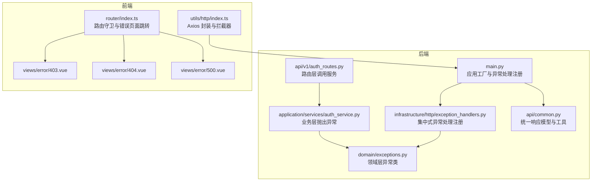
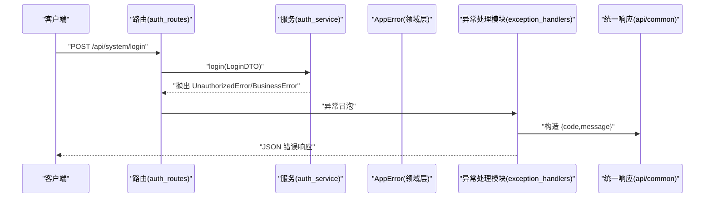
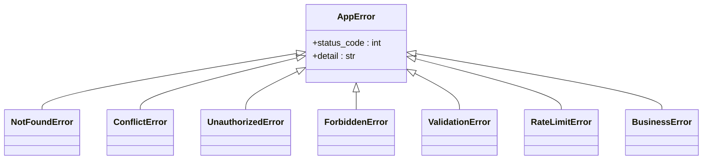
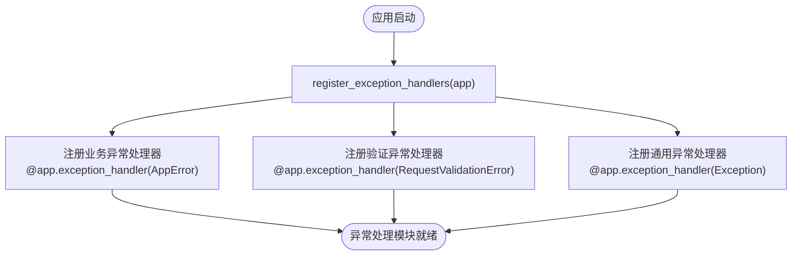
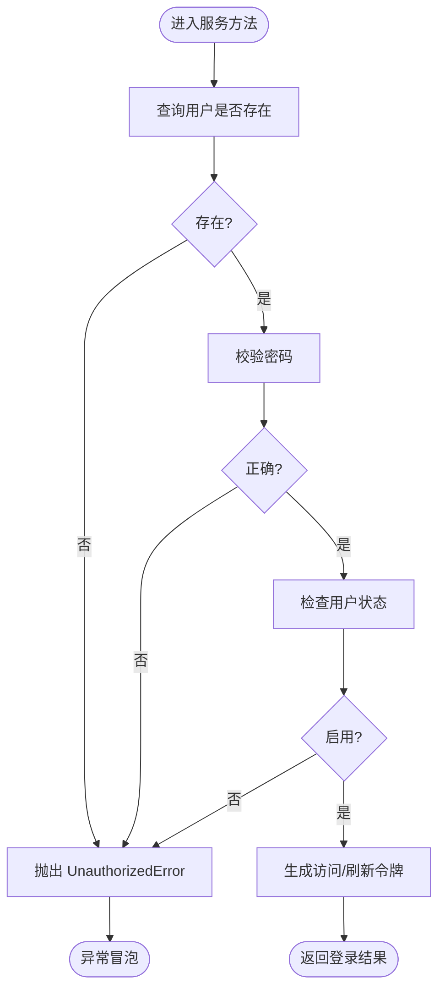
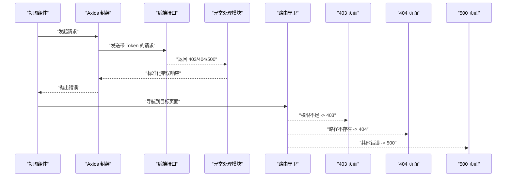
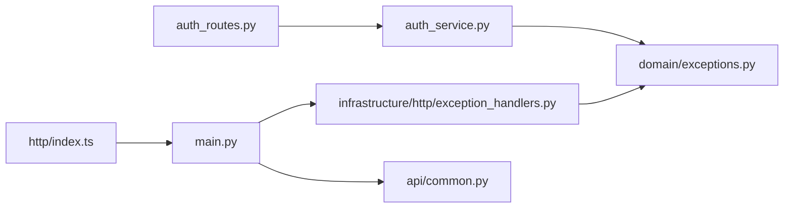

# 异常处理

<cite>
**本文引用的文件**
- [service/src/domain/exceptions.py](file://service/src/domain/exceptions.py)
- [service/src/infrastructure/http/exception_handlers.py](file://service/src/infrastructure/http/exception_handlers.py)
- [service/src/main.py](file://service/src/main.py)
- [service/src/application/services/auth_service.py](file://service/src/application/services/auth_service.py)
- [service/src/api/v1/auth_routes.py](file://service/src/api/v1/auth_routes.py)
- [service/src/api/common.py](file://service/src/api/common.py)
- [web/src/utils/http/index.ts](file://web/src/utils/http/index.ts)
- [web/src/views/error/403.vue](file://web/src/views/error/403.vue)
- [web/src/views/error/404.vue](file://web/src/views/error/404.vue)
- [web/src/views/error/500.vue](file://web/src/views/error/500.vue)
- [web/src/router/index.ts](file://web/src/router/index.ts)
</cite>

## 更新摘要
**所做更改**
- 新增集中式异常处理模块章节，详细介绍新的 exception_handlers.py 模块
- 更新架构总览图，反映新的异常处理架构
- 更新异常类层次结构，从 HTTPException 改为 AppError 基类
- 新增领域层异常类设计说明
- 更新异常处理最佳实践和调试技巧

## 目录
1. [简介](#简介)
2. [项目结构](#项目结构)
3. [核心组件](#核心组件)
4. [架构总览](#架构总览)
5. [详细组件分析](#详细组件分析)
6. [依赖关系分析](#依赖关系分析)
7. [性能考量](#性能考量)
8. [故障排查指南](#故障排查指南)
9. [结论](#结论)
10. [附录](#附录)

## 简介
本文件系统性阐述本项目的异常处理机制，覆盖后端 FastAPI 全局异常捕获、集中式异常处理模块、自定义异常类设计与使用、错误响应格式标准化，以及前端错误边界与路由级错误页面。文档同时提供最佳实践与调试技巧，并通过图示与"章节来源"帮助读者快速定位实现细节。

## 项目结构
本项目采用前后端分离架构，异常处理采用集中式管理模式：
- 后端基于 FastAPI，异常处理集中在基础设施层的 exception_handlers.py 模块
- 异常类设计采用领域驱动设计（DDD）原则，分为领域层和基础设施层
- 前端基于 Vue + Element Plus，通过路由守卫与错误页面组件实现错误边界

**图表来源**
- [service/src/main.py:19-31](file://service/src/main.py#L19-L31)
- [service/src/infrastructure/http/exception_handlers.py:13-27](file://service/src/infrastructure/http/exception_handlers.py#L13-L27)
- [service/src/domain/exceptions.py:6-62](file://service/src/domain/exceptions.py#L6-L62)
- [service/src/application/services/auth_service.py:39-150](file://service/src/application/services/auth_service.py#L39-L150)
- [service/src/api/v1/auth_routes.py:23-103](file://service/src/api/v1/auth_routes.py#L23-L103)
- [service/src/api/common.py:33-94](file://service/src/api/common.py#L33-L94)
- [web/src/utils/http/index.ts:64-149](file://web/src/utils/http/index.ts#L64-L149)
- [web/src/router/index.ts:149-160](file://web/src/router/index.ts#L149-L160)
- [web/src/views/error/403.vue:1-78](file://web/src/views/error/403.vue#L1-L78)
- [web/src/views/error/404.vue:1-78](file://web/src/views/error/404.vue#L1-L78)
- [web/src/views/error/500.vue:1-78](file://web/src/views/error/500.vue#L1-L78)

**章节来源**
- [service/src/main.py:19-31](file://service/src/main.py#L19-L31)
- [service/src/infrastructure/http/exception_handlers.py:13-27](file://service/src/infrastructure/http/exception_handlers.py#L13-L27)
- [web/src/router/index.ts:149-160](file://web/src/router/index.ts#L149-L160)

## 核心组件
- **集中式异常处理模块**：专门的 exception_handlers.py 模块负责注册业务异常、验证异常和通用异常处理器
- **领域层异常类**：统一继承 AppError，按业务语义细分（认证、权限、业务、参数、冲突、未找到、限流等）
- **全局异常处理器**：对 AppError、参数校验异常、通用异常进行统一响应封装
- **统一响应模型**：提供统一的成功/分页/错误响应结构，确保前后端契约一致
- **前端错误边界**：Axios 拦截器区分取消与非取消请求；路由守卫根据权限与路径跳转至对应错误页面

**章节来源**
- [service/src/infrastructure/http/exception_handlers.py:13-27](file://service/src/infrastructure/http/exception_handlers.py#L13-L27)
- [service/src/domain/exceptions.py:6-62](file://service/src/domain/exceptions.py#L6-L62)
- [service/src/api/common.py:33-94](file://service/src/api/common.py#L33-L94)
- [service/src/main.py:31](file://service/src/main.py#L31)
- [web/src/utils/http/index.ts:127-149](file://web/src/utils/http/index.ts#L127-L149)
- [web/src/router/index.ts:149-160](file://web/src/router/index.ts#L149-L160)

## 架构总览
后端异常处理采用集中式管理模式：
- 业务层在服务方法内抛出自定义异常
- 集中式异常处理模块统一捕获并处理异常
- 全局异常处理器返回标准化错误响应

前端异常处理链路：
- Axios 请求拦截器注入鉴权与刷新逻辑
- 响应拦截器透传数据或抛出错误
- 路由守卫根据权限与路径跳转至 403/404/500 页面

**图表来源**
- [service/src/api/v1/auth_routes.py:23-37](file://service/src/api/v1/auth_routes.py#L23-L37)
- [service/src/application/services/auth_service.py:49-61](file://service/src/application/services/auth_service.py#L49-L61)
- [service/src/domain/exceptions.py:29-33](file://service/src/domain/exceptions.py#L29-L33)
- [service/src/infrastructure/http/exception_handlers.py:16-18](file://service/src/infrastructure/http/exception_handlers.py#L16-L18)
- [service/src/api/common.py:87-94](file://service/src/api/common.py#L87-L94)

## 详细组件分析

### 领域层异常类设计
**更新** 新增领域层异常类设计，采用 AppError 基类替代 HTTPException

- **AppError 基类**：统一承载状态码与详情信息
- **子类覆盖常用 HTTP 状态码**：如 401、403、404、409、422、429、400
- **异常类层次结构**：
  - AppError（基础异常类）
  - NotFoundError（资源未找到）
  - ConflictError（资源冲突）
  - UnauthorizedError（认证失败）
  - ForbiddenError（权限不足）
  - ValidationError（验证错误）
  - RateLimitError（请求频率超限）
  - BusinessError（业务逻辑错误）

**图表来源**
- [service/src/domain/exceptions.py:6-62](file://service/src/domain/exceptions.py#L6-L62)

**章节来源**
- [service/src/domain/exceptions.py:6-62](file://service/src/domain/exceptions.py#L6-L62)

### 集中式异常处理模块
**新增** 专门的异常处理注册模块，替代原有的分散异常处理方式

- **register_exception_handlers 函数**：集中注册三种类型的异常处理器
- **业务异常处理器**：处理 AppError 及其子类，返回标准化错误响应
- **验证异常处理器**：处理 RequestValidationError，返回详细的字段级错误信息
- **通用异常处理器**：处理未捕获的 Exception，记录日志并返回 500 错误

**图表来源**
- [service/src/infrastructure/http/exception_handlers.py:13-27](file://service/src/infrastructure/http/exception_handlers.py#L13-L27)

**章节来源**
- [service/src/infrastructure/http/exception_handlers.py:13-27](file://service/src/infrastructure/http/exception_handlers.py#L13-L27)

### 统一响应模型与工具
- **统一响应体字段**：code、message、data
- **分页响应体字段**：total、pageNum、pageSize、totalPage、rows
- **错误响应工具函数**：error_response 提供简洁的错误响应构建
- **成功响应工具函数**：success_response 和 page_response 等

**章节来源**
- [service/src/api/common.py:33-94](file://service/src/api/common.py#L33-L94)

### 业务层异常抛出示例
- **认证服务**：在用户名/密码错误、用户禁用、令牌无效等场景抛出 UnauthorizedError
- **注册服务**：在用户名冲突时抛出 BusinessError
- **登录/刷新流程**：均可能触发上述异常

**图表来源**
- [service/src/application/services/auth_service.py:49-61](file://service/src/application/services/auth_service.py#L49-L61)
- [service/src/domain/exceptions.py:29-33](file://service/src/domain/exceptions.py#L29-L33)

**章节来源**
- [service/src/application/services/auth_service.py:39-150](file://service/src/application/services/auth_service.py#L39-L150)
- [service/src/api/v1/auth_routes.py:23-103](file://service/src/api/v1/auth_routes.py#L23-L103)

### 前端错误边界与路由级错误页面
- **Axios 封装**
  - 请求拦截器：注入 Authorization、处理 token 过期与刷新队列
  - 响应拦截器：透传数据或抛出错误（保留取消标记）
- **路由守卫**
  - 权限不足跳转 403
  - 不存在路径跳转 404
  - 登录态失效或白名单放行
- **错误页面**
  - 403：无权限
  - 404：页面不存在
  - 500：服务器内部错误

**图表来源**
- [web/src/utils/http/index.ts:64-149](file://web/src/utils/http/index.ts#L64-L149)
- [web/src/router/index.ts:149-160](file://web/src/router/index.ts#L149-L160)
- [web/src/views/error/403.vue:1-78](file://web/src/views/error/403.vue#L1-L78)
- [web/src/views/error/404.vue:1-78](file://web/src/views/error/404.vue#L1-L78)
- [web/src/views/error/500.vue:1-78](file://web/src/views/error/500.vue#L1-L78)

**章节来源**
- [web/src/utils/http/index.ts:35-199](file://web/src/utils/http/index.ts#L35-L199)
- [web/src/router/index.ts:118-230](file://web/src/router/index.ts#L118-L230)

## 依赖关系分析
- **服务层依赖领域异常类**：在业务分支中显式抛出具体异常
- **异常处理模块依赖领域异常类**：统一捕获和处理 AppError 及其子类
- **路由层不处理异常**：直接让异常冒泡至异常处理模块
- **异常处理模块依赖统一响应模型**：输出标准化错误体
- **前端 Axios 封装依赖统一响应模型**：但不改变后端错误格式

**图表来源**
- [service/src/application/services/auth_service.py:9](file://service/src/application/services/auth_service.py#L9)
- [service/src/api/v1/auth_routes.py:14](file://service/src/api/v1/auth_routes.py#L14)
- [service/src/main.py:31](file://service/src/main.py#L31)
- [service/src/infrastructure/http/exception_handlers.py:9](file://service/src/infrastructure/http/exception_handlers.py#L9)
- [service/src/api/common.py:33-94](file://service/src/api/common.py#L33-L94)
- [web/src/utils/http/index.ts:35-199](file://web/src/utils/http/index.ts#L35-L199)

**章节来源**
- [service/src/application/services/auth_service.py:9](file://service/src/application/services/auth_service.py#L9)
- [service/src/api/v1/auth_routes.py:14](file://service/src/api/v1/auth_routes.py#L14)
- [service/src/main.py:31](file://service/src/main.py#L31)
- [service/src/infrastructure/http/exception_handlers.py:9](file://service/src/infrastructure/http/exception_handlers.py#L9)
- [service/src/api/common.py:33-94](file://service/src/api/common.py#L33-L94)
- [web/src/utils/http/index.ts:35-199](file://web/src/utils/http/index.ts#L35-L199)

## 性能考量
- **异常路径优化**：异常处理模块集中管理，减少重复代码和性能开销
- **参数校验异常**：返回 errors 字段，便于前端快速定位字段级错误
- **日志记录**：通用异常处理器记录完整堆栈信息，便于调试但需控制日志级别
- **前端性能**：Axios 默认超时时间可按环境调整，避免长时间阻塞
- **路由守卫优化**：权限判断应尽量轻量，必要时缓存权限树

## 故障排查指南
- **后端**
  - 检查异常处理模块是否正确注册：verify register_exception_handlers(app)
  - 观察异常处理日志，确认 500 通用异常是否被正确捕获
  - 对比 AppError 子类与 HTTP 状态码映射，确保前端路由跳转策略与后端状态一致
  - 参数校验失败时，检查 RequestValidationError 的 errors 结构是否满足前端展示需求
- **前端**
  - 在 Axios 响应拦截器中区分取消请求与网络异常，避免误报
  - 检查路由守卫中的权限白名单与路径规则，确保 403/404 跳转准确
  - 若出现频繁 token 刷新，检查刷新队列与并发控制逻辑

**章节来源**
- [service/src/infrastructure/http/exception_handlers.py:24-27](file://service/src/infrastructure/http/exception_handlers.py#L24-L27)
- [web/src/utils/http/index.ts:143-149](file://web/src/utils/http/index.ts#L143-L149)
- [web/src/router/index.ts:149-160](file://web/src/router/index.ts#L149-L160)

## 结论
本项目通过"集中式异常处理模块 + 领域层异常类 + 统一响应模型"的组合，实现了后端异常处理的标准化与可维护性。新的 exception_handlers.py 模块替代了原有的分散异常处理方式，提供了更清晰的异常处理架构。前端通过 Axios 拦截器与路由守卫形成清晰的错误边界与用户体验闭环。建议在后续迭代中持续完善异常分类与错误文案国际化，提升可观测性与可诊断性。

## 附录

### 错误响应格式规范
- **成功响应**
  - 字段：code、message、data
  - 示例路径：[service/src/api/common.py:51-57](file://service/src/api/common.py#L51-L57)
- **分页响应**
  - 字段：total、pageNum、pageSize、totalPage、rows
  - 示例路径：[service/src/api/common.py:75-84](file://service/src/api/common.py#L75-L84)
- **错误响应**
  - 字段：code、message
  - 示例路径：[service/src/api/common.py:87-94](file://service/src/api/common.py#L87-L94)

### 常见异常与处理策略
- **认证失败（401）**
  - 抛出位置：[service/src/application/services/auth_service.py:53-61](file://service/src/application/services/auth_service.py#L53-L61)
  - 异常处理：[service/src/infrastructure/http/exception_handlers.py:16-18](file://service/src/infrastructure/http/exception_handlers.py#L16-L18)
- **权限不足（403）**
  - 路由跳转：[web/src/router/index.ts:154-155](file://web/src/router/index.ts#L154-L155)
  - 错误页面：[web/src/views/error/403.vue:1-78](file://web/src/views/error/403.vue#L1-L78)
- **资源未找到（404）**
  - 路由跳转：[web/src/router/index.ts:158-159](file://web/src/router/index.ts#L158-L159)
  - 错误页面：[web/src/views/error/404.vue:1-78](file://web/src/views/error/404.vue#L1-L78)
- **参数校验失败（422）**
  - 异常处理：[service/src/infrastructure/http/exception_handlers.py:20-22](file://service/src/infrastructure/http/exception_handlers.py#L20-L22)
- **业务错误（400）**
  - 抛出位置：[service/src/application/services/auth_service.py:98-99](file://service/src/application/services/auth_service.py#L98-L99)
- **内部错误（500）**
  - 异常处理：[service/src/infrastructure/http/exception_handlers.py:24-27](file://service/src/infrastructure/http/exception_handlers.py#L24-L27)
  - 错误页面：[web/src/views/error/500.vue:1-78](file://web/src/views/error/500.vue#L1-L78)

### 最佳实践与调试技巧
- **后端**
  - 使用领域层异常类替代 HTTPException，提供更好的语义化异常
  - 在服务层尽早校验并抛出业务异常，减少无效计算
  - 统一错误文案与国际化，便于前端展示
  - 在异常处理模块中记录必要的调试信息但避免泄露敏感数据
- **前端**
  - 在 Axios 响应拦截器中记录关键错误上下文（URL、状态码、错误摘要）
  - 对于可恢复的错误（如 401 刷新 token），实现幂等与防抖
  - 在路由守卫中增加日志埋点，辅助定位权限与路径问题
  - 利用 403/404/500 页面提供友好的用户体验