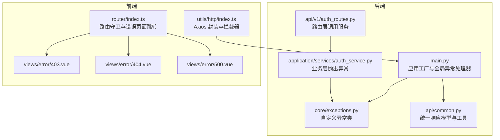
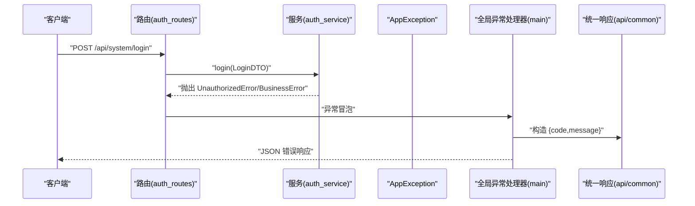
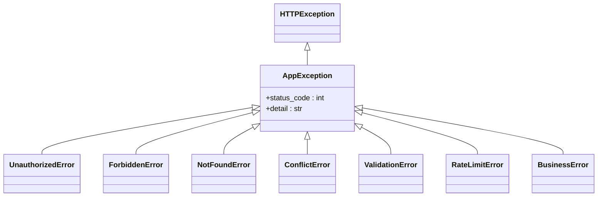
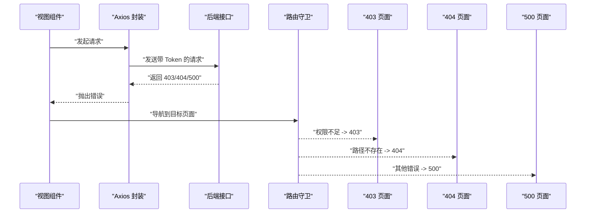
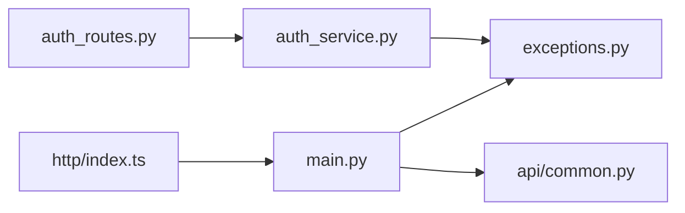

# 异常处理

<cite>
**本文引用的文件**
- [service/src/core/exceptions.py](file://service/src/core/exceptions.py)
- [service/src/api/common.py](file://service/src/api/common.py)
- [service/src/main.py](file://service/src/main.py)
- [service/src/application/services/auth_service.py](file://service/src/application/services/auth_service.py)
- [service/src/api/v1/auth_routes.py](file://service/src/api/v1/auth_routes.py)
- [web/src/utils/http/index.ts](file://web/src/utils/http/index.ts)
- [web/src/views/error/403.vue](file://web/src/views/error/403.vue)
- [web/src/views/error/404.vue](file://web/src/views/error/404.vue)
- [web/src/views/error/500.vue](file://web/src/views/error/500.vue)
- [web/src/router/index.ts](file://web/src/router/index.ts)
</cite>

## 目录
1. [简介](#简介)
2. [项目结构](#项目结构)
3. [核心组件](#核心组件)
4. [架构总览](#架构总览)
5. [详细组件分析](#详细组件分析)
6. [依赖关系分析](#依赖关系分析)
7. [性能考量](#性能考量)
8. [故障排查指南](#故障排查指南)
9. [结论](#结论)
10. [附录](#附录)

## 简介
本文件系统性阐述本项目的异常处理机制，覆盖后端 FastAPI 全局异常捕获、自定义异常类设计与使用、错误响应格式标准化，以及前端错误边界与路由级错误页面。文档同时提供最佳实践与调试技巧，并通过图示与“章节来源”帮助读者快速定位实现细节。

## 项目结构
本项目采用前后端分离架构：
- 后端基于 FastAPI，异常处理集中在核心模块与全局异常处理器中
- 前端基于 Vue + Element Plus，通过路由守卫与错误页面组件实现错误边界

图表来源
- [service/src/main.py:34-92](file://service/src/main.py#L34-L92)
- [service/src/core/exceptions.py:6-59](file://service/src/core/exceptions.py#L6-L59)
- [service/src/application/services/auth_service.py:26-154](file://service/src/application/services/auth_service.py#L26-L154)
- [service/src/api/v1/auth_routes.py:19-86](file://service/src/api/v1/auth_routes.py#L19-L86)
- [service/src/api/common.py:29-65](file://service/src/api/common.py#L29-L65)
- [web/src/utils/http/index.ts:33-196](file://web/src/utils/http/index.ts#L33-L196)
- [web/src/router/index.ts:118-222](file://web/src/router/index.ts#L118-L222)
- [web/src/views/error/403.vue:1-78](file://web/src/views/error/403.vue#L1-L78)
- [web/src/views/error/404.vue:1-78](file://web/src/views/error/404.vue#L1-L78)
- [web/src/views/error/500.vue:1-77](file://web/src/views/error/500.vue#L1-L77)

章节来源
- [service/src/main.py:34-92](file://service/src/main.py#L34-L92)
- [web/src/router/index.ts:118-222](file://web/src/router/index.ts#L118-L222)

## 核心组件
- 自定义异常类：统一继承 HTTPException，按业务语义细分（认证、权限、业务、参数、冲突、未找到、限流等），便于全局捕获与分类处理
- 全局异常处理器：对 AppException、参数校验异常、通用异常进行统一响应封装
- 统一响应模型：提供统一的成功/分页/错误响应结构，确保前后端契约一致
- 前端错误边界：Axios 拦截器区分取消与非取消请求；路由守卫根据权限与路径跳转至对应错误页面

章节来源
- [service/src/core/exceptions.py:6-59](file://service/src/core/exceptions.py#L6-L59)
- [service/src/api/common.py:29-65](file://service/src/api/common.py#L29-L65)
- [service/src/main.py:60-82](file://service/src/main.py#L60-L82)
- [web/src/utils/http/index.ts:124-148](file://web/src/utils/http/index.ts#L124-L148)
- [web/src/router/index.ts:153-160](file://web/src/router/index.ts#L153-L160)

## 架构总览
后端异常处理链路：
- 业务层在服务方法内抛出自定义异常
- 路由层接收异常并交由全局异常处理器统一处理
- 全局异常处理器返回标准化错误响应

前端异常处理链路：
- Axios 请求拦截器注入鉴权与刷新逻辑
- 响应拦截器透传数据或抛出错误
- 路由守卫根据权限与路径跳转至 403/404/500 页面

图表来源
- [service/src/api/v1/auth_routes.py:19-34](file://service/src/api/v1/auth_routes.py#L19-L34)
- [service/src/application/services/auth_service.py:40-48](file://service/src/application/services/auth_service.py#L40-L48)
- [service/src/core/exceptions.py:27-31](file://service/src/core/exceptions.py#L27-L31)
- [service/src/main.py:61-66](file://service/src/main.py#L61-L66)
- [service/src/api/common.py:62-65](file://service/src/api/common.py#L62-L65)

## 详细组件分析

### 后端异常类与全局处理器
- 异常类层次
  - 基类 AppException 继承 HTTPException，统一承载状态码与详情
  - 子类覆盖常用 HTTP 状态码，如 401、403、404、409、422、429、400
- 全局异常处理器
  - 处理 AppException：返回 {code, message}
  - 处理参数校验异常：返回 {code, message, errors}
  - 处理通用异常：记录日志并返回 {code: 500, message}

图表来源
- [service/src/core/exceptions.py:6-59](file://service/src/core/exceptions.py#L6-L59)

章节来源
- [service/src/core/exceptions.py:6-59](file://service/src/core/exceptions.py#L6-L59)
- [service/src/main.py:60-82](file://service/src/main.py#L60-L82)

### 统一响应模型与工具
- 统一响应体字段：code、message、data
- 分页响应体字段：total、pageNum、pageSize、totalPage、rows
- 成功/分页/错误响应工具函数，保证前后端契约一致

章节来源
- [service/src/api/common.py:29-65](file://service/src/api/common.py#L29-L65)

### 业务层异常抛出示例
- 认证服务在用户名/密码错误、用户禁用、令牌无效等场景抛出 UnauthorizedError
- 注册服务在用户名冲突时抛出 BusinessError
- 登录/刷新流程均可能触发上述异常

图表来源
- [service/src/application/services/auth_service.py:38-48](file://service/src/application/services/auth_service.py#L38-L48)
- [service/src/core/exceptions.py:27-31](file://service/src/core/exceptions.py#L27-L31)

章节来源
- [service/src/application/services/auth_service.py:26-154](file://service/src/application/services/auth_service.py#L26-L154)
- [service/src/api/v1/auth_routes.py:19-86](file://service/src/api/v1/auth_routes.py#L19-L86)

### 前端错误边界与路由级错误页面
- Axios 封装
  - 请求拦截器：注入 Authorization、处理 token 过期与刷新队列
  - 响应拦截器：透传数据或抛出错误（保留取消标记）
- 路由守卫
  - 权限不足跳转 403
  - 不存在路径跳转 404
  - 登录态失效或白名单放行
- 错误页面
  - 403：无权限
  - 404：页面不存在
  - 500：服务器内部错误

图表来源
- [web/src/utils/http/index.ts:62-148](file://web/src/utils/http/index.ts#L62-L148)
- [web/src/router/index.ts:153-160](file://web/src/router/index.ts#L153-L160)
- [web/src/views/error/403.vue:1-78](file://web/src/views/error/403.vue#L1-L78)
- [web/src/views/error/404.vue:1-78](file://web/src/views/error/404.vue#L1-L78)
- [web/src/views/error/500.vue:1-77](file://web/src/views/error/500.vue#L1-L77)

章节来源
- [web/src/utils/http/index.ts:33-196](file://web/src/utils/http/index.ts#L33-L196)
- [web/src/router/index.ts:118-222](file://web/src/router/index.ts#L118-L222)

## 依赖关系分析
- 服务层依赖异常类：在业务分支中显式抛出具体异常
- 路由层不处理异常，直接让异常冒泡至全局处理器
- 全局处理器依赖统一响应模型，输出标准化错误体
- 前端 Axios 封装依赖统一响应模型，但不改变后端错误格式

图表来源
- [service/src/application/services/auth_service.py:7-12](file://service/src/application/services/auth_service.py#L7-L12)
- [service/src/api/v1/auth_routes.py:10-14](file://service/src/api/v1/auth_routes.py#L10-L14)
- [service/src/main.py:14-16](file://service/src/main.py#L14-L16)
- [service/src/api/common.py:29-65](file://service/src/api/common.py#L29-L65)
- [web/src/utils/http/index.ts:33-196](file://web/src/utils/http/index.ts#L33-L196)

章节来源
- [service/src/application/services/auth_service.py:7-12](file://service/src/application/services/auth_service.py#L7-L12)
- [service/src/api/v1/auth_routes.py:10-14](file://service/src/api/v1/auth_routes.py#L10-L14)
- [service/src/main.py:14-16](file://service/src/main.py#L14-L16)
- [service/src/api/common.py:29-65](file://service/src/api/common.py#L29-L65)
- [web/src/utils/http/index.ts:33-196](file://web/src/utils/http/index.ts#L33-L196)

## 性能考量
- 异常路径尽量避免昂贵操作（如大对象序列化），减少日志开销
- 参数校验异常返回 errors 字段，便于前端快速定位字段级错误
- 前端 Axios 默认超时时间可按环境调整，避免长时间阻塞
- 路由守卫中的权限判断应尽量轻量，必要时缓存权限树

## 故障排查指南
- 后端
  - 观察全局异常处理器日志，确认 500 通用异常是否被正确捕获
  - 对比 AppException 子类与 HTTP 状态码映射，确保前端路由跳转策略与后端状态一致
  - 参数校验失败时，检查 RequestValidationError 的 errors 结构是否满足前端展示需求
- 前端
  - 在 Axios 响应拦截器中区分取消请求与网络异常，避免误报
  - 检查路由守卫中的权限白名单与路径规则，确保 403/404 跳转准确
  - 若出现频繁 token 刷新，检查刷新队列与并发控制逻辑

章节来源
- [service/src/main.py:76-82](file://service/src/main.py#L76-L82)
- [web/src/utils/http/index.ts:141-147](file://web/src/utils/http/index.ts#L141-L147)
- [web/src/router/index.ts:153-160](file://web/src/router/index.ts#L153-L160)

## 结论
本项目通过“自定义异常类 + 全局异常处理器 + 统一响应模型”的组合，实现了后端异常处理的标准化与可维护性；前端通过 Axios 拦截器与路由守卫形成清晰的错误边界与用户体验闭环。建议在后续迭代中持续完善异常分类与错误文案国际化，提升可观测性与可诊断性。

## 附录

### 错误响应格式规范
- 成功响应
  - 字段：code、message、data
  - 示例路径：[service/src/api/common.py:45-47](file://service/src/api/common.py#L45-L47)
- 分页响应
  - 字段：total、pageNum、pageSize、totalPage、rows
  - 示例路径：[service/src/api/common.py:36-59](file://service/src/api/common.py#L36-L59)
- 错误响应
  - 字段：code、message
  - 示例路径：[service/src/api/common.py:62-65](file://service/src/api/common.py#L62-L65)

### 常见异常与处理策略
- 认证失败（401）
  - 抛出位置：[service/src/application/services/auth_service.py:40-48](file://service/src/application/services/auth_service.py#L40-L48)
  - 全局处理：[service/src/main.py:61-66](file://service/src/main.py#L61-L66)
- 权限不足（403）
  - 路由跳转：[web/src/router/index.ts:154-156](file://web/src/router/index.ts#L154-L156)
  - 错误页面：[web/src/views/error/403.vue:1-78](file://web/src/views/error/403.vue#L1-L78)
- 资源未找到（404）
  - 路由跳转：[web/src/router/index.ts:158-159](file://web/src/router/index.ts#L158-L159)
  - 错误页面：[web/src/views/error/404.vue:1-78](file://web/src/views/error/404.vue#L1-L78)
- 参数校验失败（422）
  - 全局处理：[service/src/main.py:68-74](file://service/src/main.py#L68-L74)
- 业务错误（400）
  - 抛出位置：[service/src/application/services/auth_service.py:89-91](file://service/src/application/services/auth_service.py#L89-L91)
- 内部错误（500）
  - 全局处理：[service/src/main.py:76-82](file://service/src/main.py#L76-L82)
  - 错误页面：[web/src/views/error/500.vue:1-77](file://web/src/views/error/500.vue#L1-L77)

### 最佳实践与调试技巧
- 后端
  - 明确异常分类，避免滥用通用异常
  - 在服务层尽早校验并抛出业务异常，减少无效计算
  - 统一错误文案与国际化，便于前端展示
- 前端
  - 在 Axios 响应拦截器中记录关键错误上下文（URL、状态码、错误摘要）
  - 对于可恢复的错误（如 401 刷新 token），实现幂等与防抖
  - 在路由守卫中增加日志埋点，辅助定位权限与路径问题