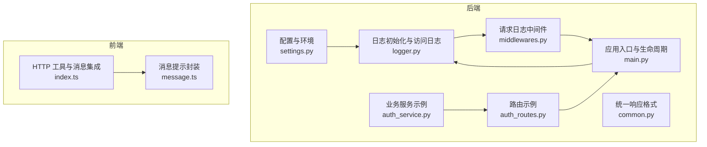
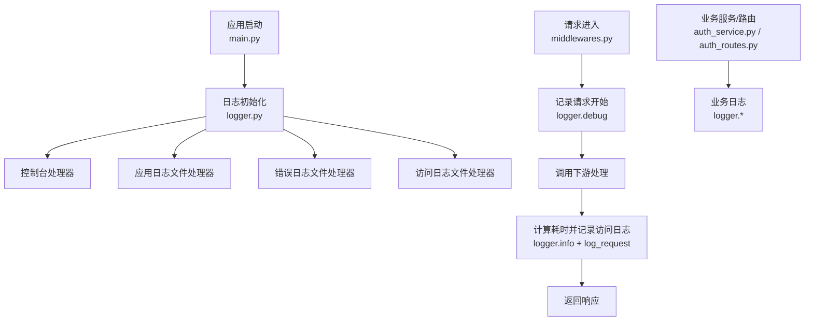
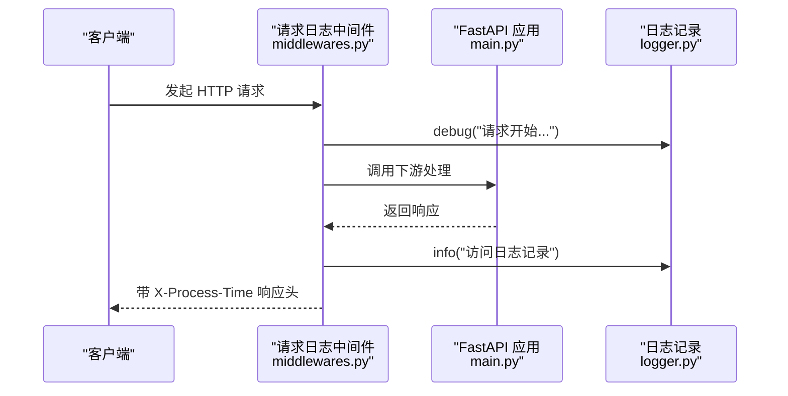
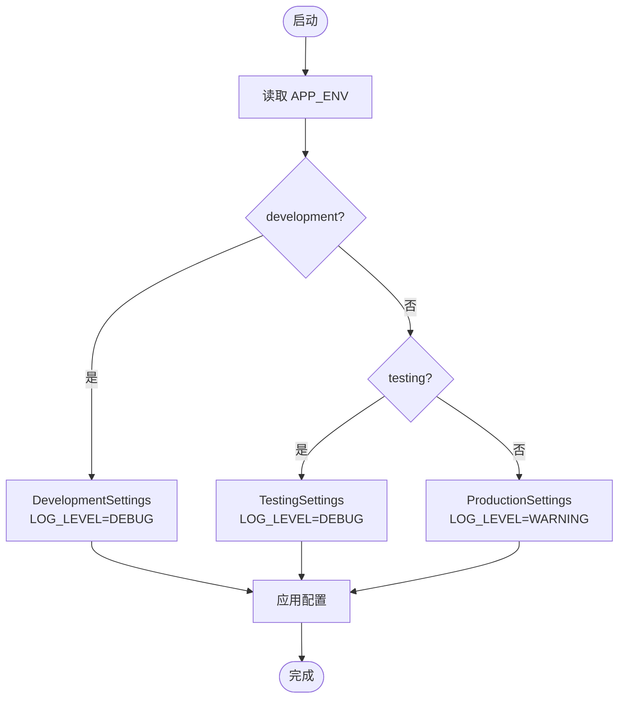
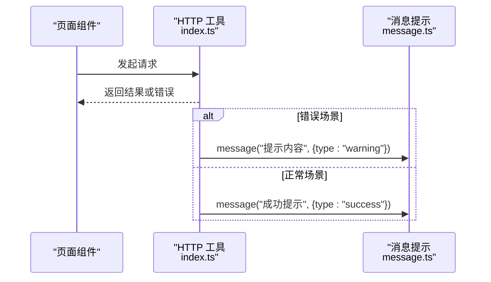
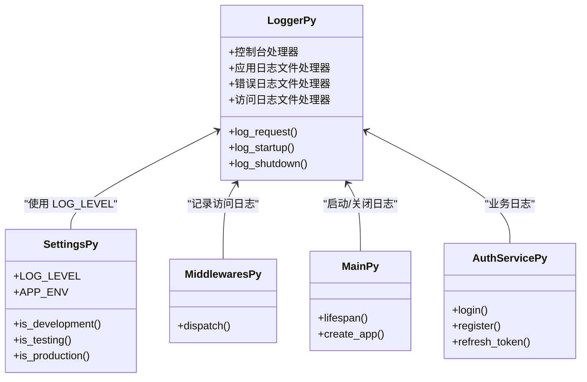
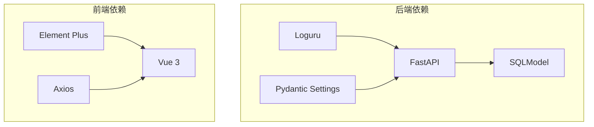

# 日志系统

<cite>
**本文引用的文件**
- [logger.py](file://service/src/core/logger.py)
- [settings.py](file://service/src/config/settings.py)
- [middlewares.py](file://service/src/core/middlewares.py)
- [main.py](file://service/src/main.py)
- [auth_service.py](file://service/src/application/services/auth_service.py)
- [auth_routes.py](file://service/src/api/v1/auth_routes.py)
- [common.py](file://service/src/api/common.py)
- [message.ts](file://web/src/utils/message.ts)
- [index.ts](file://web/src/utils/http/index.ts)
- [pyproject.toml](file://service/pyproject.toml)
</cite>

## 目录
1. [简介](#简介)
2. [项目结构](#项目结构)
3. [核心组件](#核心组件)
4. [架构总览](#架构总览)
5. [详细组件分析](#详细组件分析)
6. [依赖分析](#依赖分析)
7. [性能考虑](#性能考虑)
8. [故障排查指南](#故障排查指南)
9. [结论](#结论)
10. [附录](#附录)

## 简介
本文件系统性阐述后端基于 Loguru 的日志体系与前端消息提示系统，涵盖以下主题：
- 后端日志配置：控制台彩色输出、文件轮转、错误日志分离、访问日志（HTTP 请求）。
- 多环境日志级别管理：开发、测试、生产环境的差异化配置。
- 前端消息提示：统一的成功、警告、错误信息提示封装与使用。
- 最佳实践与性能优化建议。
- 实际代码示例路径，展示在不同模块中如何使用日志系统。

## 项目结构
后端日志相关的关键文件分布如下：
- 配置与环境：settings.py
- 日志初始化与访问日志：logger.py
- 请求日志中间件：middlewares.py
- 应用入口与生命周期：main.py
- 业务服务与路由示例：auth_service.py、auth_routes.py
- 统一响应格式：common.py
- 前端消息提示：message.ts
- 前端 HTTP 工具与消息集成：index.ts
- 依赖声明：pyproject.toml

**图表来源**
- [settings.py](file://service/src/config/settings.py)
- [logger.py](file://service/src/core/logger.py)
- [middlewares.py](file://service/src/core/middlewares.py)
- [main.py](file://service/src/main.py)
- [auth_service.py](file://service/src/application/services/auth_service.py)
- [auth_routes.py](file://service/src/api/v1/auth_routes.py)
- [common.py](file://service/src/api/common.py)
- [message.ts](file://web/src/utils/message.ts)
- [index.ts](file://web/src/utils/http/index.ts)

**章节来源**
- [settings.py](file://service/src/config/settings.py)
- [logger.py](file://service/src/core/logger.py)
- [middlewares.py](file://service/src/core/middlewares.py)
- [main.py](file://service/src/main.py)
- [auth_service.py](file://service/src/application/services/auth_service.py)
- [auth_routes.py](file://service/src/api/v1/auth_routes.py)
- [common.py](file://service/src/api/common.py)
- [message.ts](file://web/src/utils/message.ts)
- [index.ts](file://web/src/utils/http/index.ts)

## 核心组件
- 日志初始化与处理器
  - 控制台处理器：彩色时间、级别、来源与消息。
  - 应用日志文件处理器：DEBUG 及以上级别，按大小轮转、保留 30 天、压缩归档。
  - 错误日志文件处理器：仅 ERROR 级别，额外开启回溯与诊断。
  - 访问日志文件处理器：INFO 级别，过滤标记为“access”的记录。
  - 提供访问日志记录函数与启动/关闭日志记录函数。
- 多环境配置与日志级别
  - settings.py 定义通用配置与环境类，分别设置 LOG_LEVEL。
  - 开发环境：DEBUG；测试环境：DEBUG；生产环境：WARNING。
- 请求日志中间件
  - 记录请求开始与完成，计算耗时，调用访问日志记录函数。
- 前端消息提示
  - 封装 Element Plus 的消息提示，支持多种类型与全局样式定制。
  - HTTP 工具在鉴权过期等场景调用消息提示。

**章节来源**
- [logger.py](file://service/src/core/logger.py)
- [settings.py](file://service/src/config/settings.py)
- [middlewares.py](file://service/src/core/middlewares.py)
- [message.ts](file://web/src/utils/message.ts)
- [index.ts](file://web/src/utils/http/index.ts)

## 架构总览
后端日志架构围绕 Loguru 的多处理器设计展开，结合 FastAPI 生命周期与中间件，形成“控制台 + 文件 + 访问日志”的完整方案。前端通过 HTTP 工具在错误与异常时统一弹出消息提示。

**图表来源**
- [main.py](file://service/src/main.py)
- [logger.py](file://service/src/core/logger.py)
- [middlewares.py](file://service/src/core/middlewares.py)
- [auth_service.py](file://service/src/application/services/auth_service.py)
- [auth_routes.py](file://service/src/api/v1/auth_routes.py)

## 详细组件分析

### 后端日志配置与使用
- 控制台处理器
  - 输出格式包含时间、级别、模块名、函数名、行号与消息。
  - 彩色输出，便于快速识别级别。
  - 使用队列异步写入，提升并发性能。
- 文件处理器
  - 应用日志：DEBUG 及以上，10MB 轮转，30 天保留，zip 压缩。
  - 错误日志：仅 ERROR，10MB 轮转，60 天保留，zip 压缩，开启回溯与诊断。
  - 访问日志：INFO，10MB 轮转，30 天保留，zip 压缩，通过 extra 字段过滤。
- 访问日志记录函数
  - 接收方法、路径、状态码、耗时（毫秒）、客户端 IP。
  - 通过绑定 type=access 的方式，使日志落入访问日志文件。
- 启动/关闭日志
  - 启动日志包含应用名、版本、环境、调试模式、日志级别与启动时间。
  - 关闭日志包含应用名与关闭时间。

**图表来源**
- [middlewares.py](file://service/src/core/middlewares.py)
- [logger.py](file://service/src/core/logger.py)
- [main.py](file://service/src/main.py)

**章节来源**
- [logger.py](file://service/src/core/logger.py)
- [middlewares.py](file://service/src/core/middlewares.py)
- [main.py](file://service/src/main.py)

### 多环境日志级别管理
- 环境与级别映射
  - 开发环境：DEBUG
  - 测试环境：DEBUG
  - 生产环境：WARNING
- 加载机制
  - 通过环境变量 APP_ENV 选择对应配置类。
  - 支持 .env 与 .env.{environment} 文件叠加加载。
- 配置校验
  - LOG_LEVEL 限定为 DEBUG/INFO/WARNING/ERROR/CRITICAL。

**图表来源**
- [settings.py](file://service/src/config/settings.py)

**章节来源**
- [settings.py](file://service/src/config/settings.py)

### 前端消息提示系统
- 统一封装
  - 对 Element Plus 的消息提示进行二次封装，支持类型、图标、时长、位置、样式等参数。
  - 默认时长较短，适合快速反馈。
- HTTP 工具集成
  - 在 token 过期等场景，统一调用消息提示，避免分散处理。
- 使用建议
  - 成功/警告/错误信息通过统一函数输出，保证一致性。
  - 需要 HTML 内容时，谨慎使用危险渲染开关。

**图表来源**
- [index.ts](file://web/src/utils/http/index.ts)
- [message.ts](file://web/src/utils/message.ts)

**章节来源**
- [message.ts](file://web/src/utils/message.ts)
- [index.ts](file://web/src/utils/http/index.ts)

### 在模块中使用日志系统
- 应用入口与生命周期
  - 在应用启动与关闭阶段记录启动/关闭日志。
  - 参考路径：[main.py](file://service/src/main.py)
- 业务服务
  - 在认证服务中，对关键流程（如登录、注册、刷新令牌）进行日志记录，便于追踪与审计。
  - 参考路径：[auth_service.py](file://service/src/application/services/auth_service.py)
- 路由层
  - 路由返回统一响应格式，错误信息通过统一响应体传递给前端。
  - 参考路径：[auth_routes.py](file://service/src/api/v1/auth_routes.py)、[common.py](file://service/src/api/common.py)

**图表来源**
- [logger.py](file://service/src/core/logger.py)
- [settings.py](file://service/src/config/settings.py)
- [middlewares.py](file://service/src/core/middlewares.py)
- [main.py](file://service/src/main.py)
- [auth_service.py](file://service/src/application/services/auth_service.py)

**章节来源**
- [main.py](file://service/src/main.py)
- [auth_service.py](file://service/src/application/services/auth_service.py)
- [auth_routes.py](file://service/src/api/v1/auth_routes.py)
- [common.py](file://service/src/api/common.py)

## 依赖分析
- 后端依赖
  - FastAPI、Uvicorn、SQLModel、Pydantic Settings、Loguru 等。
  - 日志系统依赖 Loguru。
- 前端依赖
  - Element Plus、Vue 3、Axios 等。
  - HTTP 工具依赖消息提示封装。

**图表来源**
- [pyproject.toml](file://service/pyproject.toml)
- [message.ts](file://web/src/utils/message.ts)
- [index.ts](file://web/src/utils/http/index.ts)

**章节来源**
- [pyproject.toml](file://service/pyproject.toml)

## 性能考虑
- 异步写入与队列
  - 控制台与文件处理器均启用队列异步写入，降低阻塞风险，提升高并发下的吞吐。
- 文件轮转与压缩
  - 采用固定大小轮转与压缩归档，有效控制磁盘占用与历史日志体积。
- 日志级别与过滤
  - 分离应用日志与错误日志，减少无关日志对检索与存储的影响。
  - 访问日志通过过滤器精准落盘，避免污染其他日志文件。
- 建议
  - 生产环境尽量使用较低级别（如 WARNING），减少 IO 压力。
  - 对高频接口可考虑采样或聚合统计，避免日志风暴。
  - 合理设置保留天数与轮转大小，平衡磁盘与检索需求。

## 故障排查指南
- 日志级别不生效
  - 检查 APP_ENV 与对应配置类是否正确加载。
  - 确认 LOG_LEVEL 是否在允许集合内。
  - 参考路径：[settings.py](file://service/src/config/settings.py)
- 访问日志未出现
  - 确认中间件已注册且请求经过中间件链路。
  - 检查日志绑定的 extra.type 是否为 "access"。
  - 参考路径：[middlewares.py](file://service/src/core/middlewares.py)、[logger.py](file://service/src/core/logger.py)
- 错误日志缺失
  - 确认错误日志处理器级别为 ERROR，并检查过滤条件。
  - 参考路径：[logger.py](file://service/src/core/logger.py)
- 前端消息提示不显示
  - 检查消息封装函数参数与 Element Plus 版本兼容性。
  - 确认 HTTP 工具在错误分支调用了消息提示。
  - 参考路径：[message.ts](file://web/src/utils/message.ts)、[index.ts](file://web/src/utils/http/index.ts)

**章节来源**
- [settings.py](file://service/src/config/settings.py)
- [middlewares.py](file://service/src/core/middlewares.py)
- [logger.py](file://service/src/core/logger.py)
- [message.ts](file://web/src/utils/message.ts)
- [index.ts](file://web/src/utils/http/index.ts)

## 结论
本项目通过 Loguru 实现了清晰、可维护、高性能的日志体系，配合多环境差异化配置与访问日志中间件，满足开发、测试与生产的多样化需求。前端消息提示系统与 HTTP 工具的集成，进一步提升了用户体验与一致性。建议在生产环境中严格控制日志级别与轮转策略，并结合业务特点进行采样与聚合，持续优化日志成本与价值。

## 附录
- 实际代码示例路径（不含具体代码内容）
  - 后端日志初始化与访问日志记录：[logger.py](file://service/src/core/logger.py)
  - 多环境配置与日志级别：[settings.py](file://service/src/config/settings.py)
  - 请求日志中间件：[middlewares.py](file://service/src/core/middlewares.py)
  - 应用入口与生命周期：[main.py](file://service/src/main.py)
  - 业务服务示例（认证）：[auth_service.py](file://service/src/application/services/auth_service.py)
  - 路由层与统一响应：[auth_routes.py](file://service/src/api/v1/auth_routes.py)、[common.py](file://service/src/api/common.py)
  - 前端消息提示封装：[message.ts](file://web/src/utils/message.ts)
  - 前端 HTTP 工具与消息集成：[index.ts](file://web/src/utils/http/index.ts)
  - 依赖声明：[pyproject.toml](file://service/pyproject.toml)