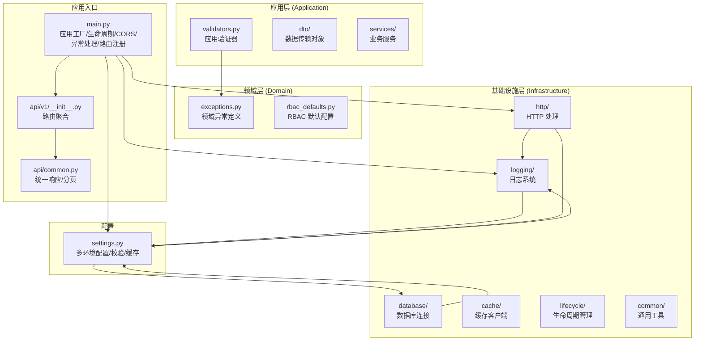
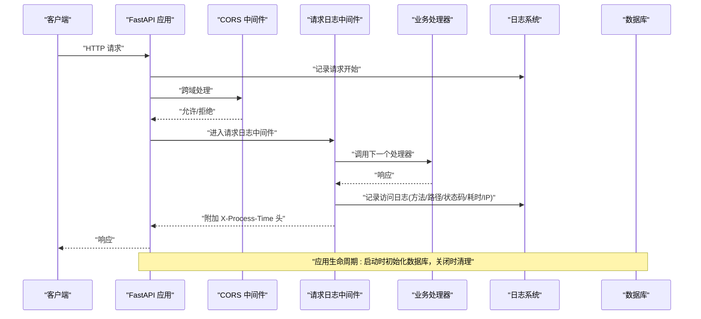
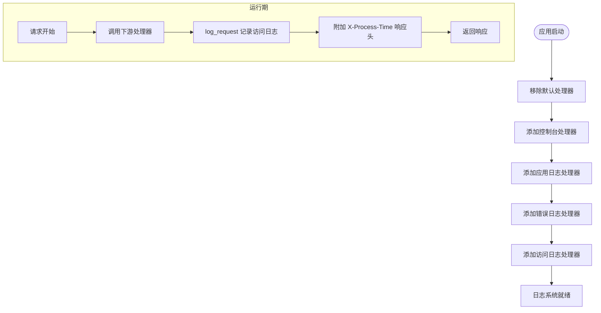
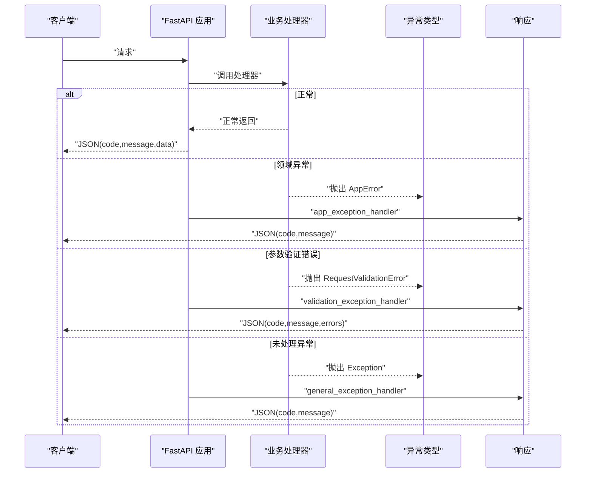
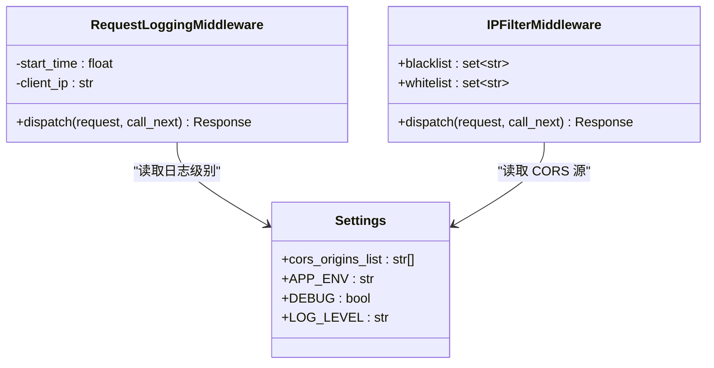
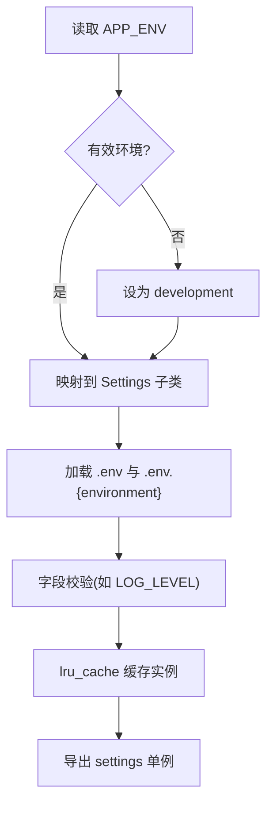
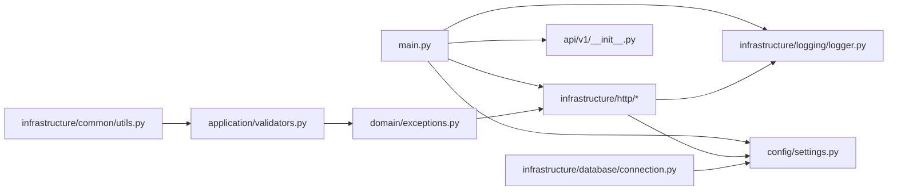

# 核心模块

<cite>
**本文引用的文件**
- [logger.py](file://service/src/infrastructure/logging/logger.py)
- [decorators.py](file://service/src/infrastructure/logging/decorators.py)
- [exception_handlers.py](file://service/src/infrastructure/http/exception_handlers.py)
- [middlewares.py](file://service/src/infrastructure/http/middlewares.py)
- [settings.py](file://service/src/config/settings.py)
- [main.py](file://service/src/main.py)
- [utils.py](file://service/src/infrastructure/common/utils.py)
- [validators.py](file://service/src/application/validators.py)
- [exceptions.py](file://service/src/domain/exceptions.py)
- [lifespan.py](file://service/src/infrastructure/lifecycle/lifespan.py)
- [connection.py](file://service/src/infrastructure/database/connection.py)
- [common.py](file://service/src/api/common.py)
- [__init__.py](file://service/src/api/v1/__init__.py)
- [pyproject.toml](file://service/pyproject.toml)
- [test_core.py](file://service/tests/unit/test_core.py)
</cite>

## 更新摘要
**变更内容**
- 核心模块重构已完成，src/core/ 目录已被新的分层架构替代
- 日志系统、异常处理、中间件等组件已迁移至 infrastructure 子目录
- 新增领域层（domain）、应用层（application）、基础设施层（infrastructure）的清晰分层
- 配置管理、生命周期管理、数据库连接等核心功能重新组织
- API 统一响应模型保持不变，但实现位置已调整

## 目录
1. [简介](#简介)
2. [项目结构](#项目结构)
3. [核心组件](#核心组件)
4. [架构总览](#架构总览)
5. [详细组件分析](#详细组件分析)
6. [依赖关系分析](#依赖关系分析)
7. [性能考虑](#性能考虑)
8. [故障排查指南](#故障排查指南)
9. [结论](#结论)
10. [附录](#附录)

## 简介
本文件聚焦 Hello-FastApi 服务端"核心模块"的重构设计与实现，涵盖以下主题：
- 日志系统：基于 Loguru 的统一配置，控制台彩色输出、文件轮转、访问日志与启动/关闭日志。
- 异常处理：全局异常捕获、自定义异常类型与统一错误响应格式。
- 中间件：CORS、请求日志、IP 白黑名单过滤。
- 配置管理：多环境配置（开发/生产/测试）、环境变量与 .env 文件加载、缓存与校验。
- 工具与实用函数：UTC 时间、邮箱/密码强度校验、函数执行日志装饰器。
- 生命周期管理：应用启动/关闭的数据库初始化与清理。
- 数据库连接：异步数据库引擎与会话管理。
- 扩展与定制：如何在新的分层架构上进行二次开发与最佳实践。

## 项目结构
核心模块已重构为三层架构：domain（领域层）、application（应用层）、infrastructure（基础设施层），配置位于 service/src/config，应用入口在 service/src/main.py。

**图表来源**
- [logger.py:1-90](file://service/src/infrastructure/logging/logger.py#L1-L90)
- [exception_handlers.py:1-28](file://service/src/infrastructure/http/exception_handlers.py#L1-L28)
- [middlewares.py:1-59](file://service/src/infrastructure/http/middlewares.py#L1-L59)
- [settings.py:1-188](file://service/src/config/settings.py#L1-L188)
- [main.py:1-43](file://service/src/main.py#L1-L43)
- [validators.py:1-147](file://service/src/application/validators.py#L1-L147)
- [exceptions.py:1-62](file://service/src/domain/exceptions.py#L1-L62)
- [lifespan.py:1-30](file://service/src/infrastructure/lifecycle/lifespan.py#L1-L30)
- [connection.py:1-40](file://service/src/infrastructure/database/connection.py#L1-L40)

**章节来源**
- [main.py:1-43](file://service/src/main.py#L1-L43)
- [settings.py:1-188](file://service/src/config/settings.py#L1-L188)
- [logger.py:1-90](file://service/src/infrastructure/logging/logger.py#L1-L90)
- [middlewares.py:1-59](file://service/src/infrastructure/http/middlewares.py#L1-L59)
- [exception_handlers.py:1-28](file://service/src/infrastructure/http/exception_handlers.py#L1-L28)
- [utils.py:1-27](file://service/src/infrastructure/common/utils.py#L1-L27)
- [validators.py:1-147](file://service/src/application/validators.py#L1-L147)
- [decorators.py:1-24](file://service/src/infrastructure/logging/decorators.py#L1-L24)
- [exceptions.py:1-62](file://service/src/domain/exceptions.py#L1-L62)
- [lifespan.py:1-30](file://service/src/infrastructure/lifecycle/lifespan.py#L1-L30)
- [connection.py:1-40](file://service/src/infrastructure/database/connection.py#L1-L40)
- [common.py:1-218](file://service/src/api/common.py#L1-L218)

## 核心组件
- 日志系统：通过移除默认处理器，分别添加控制台、应用日志、错误日志与访问日志处理器；提供启动/关闭日志与访问日志记录函数。
- 异常体系：领域层定义的 AppError 及其子类（NotFound、Conflict、Unauthorized、Forbidden、Validation、RateLimit、Business），配合全局异常处理器返回统一错误响应。
- 中间件：内置 CORS、请求日志（记录方法/路径/状态码/耗时/IP）、可选 IP 白名单/黑名单过滤。
- 配置管理：多环境 Settings 类，支持 .env 与 .env.{环境} 加载，字段校验（如日志级别），缓存单例。
- 工具与验证：UTC 时间、邮箱/密码强度校验；函数执行装饰器；API 统一响应与分页格式。
- 生命周期管理：应用启动时初始化数据库，关闭时清理连接。
- 数据库连接：异步引擎、会话工厂与依赖注入。
- ASGI 入口：导出应用实例供生产部署使用。

**章节来源**
- [logger.py:1-90](file://service/src/infrastructure/logging/logger.py#L1-L90)
- [exceptions.py:1-62](file://service/src/domain/exceptions.py#L1-L62)
- [middlewares.py:1-59](file://service/src/infrastructure/http/middlewares.py#L1-L59)
- [settings.py:1-188](file://service/src/config/settings.py#L1-L188)
- [utils.py:1-27](file://service/src/infrastructure/common/utils.py#L1-L27)
- [validators.py:1-147](file://service/src/application/validators.py#L1-L147)
- [decorators.py:1-24](file://service/src/infrastructure/logging/decorators.py#L1-L24)
- [common.py:1-218](file://service/src/api/common.py#L1-L218)
- [lifespan.py:1-30](file://service/src/infrastructure/lifecycle/lifespan.py#L1-L30)
- [connection.py:1-40](file://service/src/infrastructure/database/connection.py#L1-L40)

## 架构总览
应用启动时，main.py 创建 FastAPI 实例，注册 CORS、请求日志中间件、全局异常处理器，并在 lifespan 中完成数据库初始化与关闭。配置由 settings.py 提供，日志由 infrastructure/logging/logger.py 初始化，路由由 api/v1/__init__.py 聚合。

**图表来源**
- [main.py:19-32](file://service/src/main.py#L19-L32)
- [middlewares.py:12-39](file://service/src/infrastructure/http/middlewares.py#L12-L39)
- [logger.py:75-85](file://service/src/infrastructure/logging/logger.py#L75-L85)

**章节来源**
- [main.py:34-43](file://service/src/main.py#L34-L43)
- [settings.py:144-188](file://service/src/config/settings.py#L144-L188)

## 详细组件分析

### 日志系统（Loguru）
- 初始化策略
  - 移除默认处理器后，按需添加多个处理器：
    - 控制台处理器：彩色输出，格式包含时间、级别、来源与消息。
    - 应用日志处理器：DEBUG 及以上，按大小轮转、保留 30 天、压缩存储。
    - 错误日志处理器：仅 ERROR 级别，开启回溯与诊断。
    - 访问日志处理器：INFO 级别，过滤 extra[type] 为 "access" 的记录。
- 访问日志记录
  - 提供 log_request 函数，绑定 extra[type]="access" 并输出客户端 IP、方法、路径、状态码与耗时。
  - 提供 log_startup/log_shutdown 输出应用启动/关闭信息。
- 使用建议
  - 在中间件中记录请求开始与结束，结合 log_request 输出统一访问日志。
  - 对关键业务流程使用 logger.debug/info/warning/error，便于区分不同严重程度。

**图表来源**
- [logger.py:24-40](file://service/src/infrastructure/logging/logger.py#L24-L40)
- [logger.py:42-53](file://service/src/infrastructure/logging/logger.py#L42-L53)

**章节来源**
- [logger.py:1-90](file://service/src/infrastructure/logging/logger.py#L1-L90)

### 异常处理机制
- 自定义异常
  - AppError 作为基类，派生出 NotFoundError、ConflictError、UnauthorizedError、ForbiddenError、ValidationError、RateLimitError、BusinessError。
- 全局异常处理器
  - AppError：返回包含 code 与 message 的 JSON 响应。
  - RequestValidationError：返回包含 code、message 与 errors 的 JSON 响应。
  - Exception：记录未处理异常并返回 500。
- 统一错误响应
  - api/common.py 提供 ErrorResponse、HealthResponse、UnifiedResponse、PageResponse 以及 success_response/page_response/error_response 辅助函数，便于业务层复用。

**图表来源**
- [exception_handlers.py:13-28](file://service/src/infrastructure/http/exception_handlers.py#L13-L28)
- [exceptions.py:6-62](file://service/src/domain/exceptions.py#L6-L62)
- [common.py:14-218](file://service/src/api/common.py#L14-L218)

**章节来源**
- [exception_handlers.py:1-28](file://service/src/infrastructure/http/exception_handlers.py#L1-L28)
- [exceptions.py:1-62](file://service/src/domain/exceptions.py#L1-L62)
- [common.py:1-218](file://service/src/api/common.py#L1-L218)

### 中间件系统
- CORS 中间件
  - 通过 settings.cors_origins_list 动态解析允许的源列表，支持通配符与凭据。
- 请求日志中间件
  - 记录请求开始与完成，计算处理时间（毫秒），调用 log_request 输出访问日志，并在响应头附加 X-Process-Time。
- IP 白黑名单中间件
  - 支持白名单优先（仅允许白名单访问），随后检查黑名单；命中则返回 403 JSON。

**图表来源**
- [middlewares.py:12-59](file://service/src/infrastructure/http/middlewares.py#L12-L59)
- [settings.py:72-75](file://service/src/config/settings.py#L72-L75)

**章节来源**
- [middlewares.py:1-59](file://service/src/infrastructure/http/middlewares.py#L1-L59)
- [settings.py:69-80](file://service/src/config/settings.py#L69-L80)

### 配置管理模块
- 多环境配置
  - Settings 基类：定义通用字段与校验（如 LOG_LEVEL）。
  - DevelopmentSettings/ProductionSettings/TestingSettings：覆盖特定环境的默认值与行为。
- 环境变量与 .env 文件
  - 优先级：系统环境变量 > .env.{environment} > .env > 默认值。
  - 提供 is_development/is_production/is_testing 属性快速判断。
- 缓存与单例
  - 使用 lru_cache 缓存配置实例，避免重复解析。
- 目录与常量
  - 自动创建 logs/sql/docs 目录，确保运行时可用。

**图表来源**
- [settings.py:138-188](file://service/src/config/settings.py#L138-L188)

**章节来源**
- [settings.py:1-188](file://service/src/config/settings.py#L1-L188)

### 工具与实用函数
- 时间与格式校验
  - get_utc_now：获取 UTC 时间。
  - is_valid_email：邮箱正则校验。
  - is_strong_password：密码强度校验（长度、大小写、数字）。
- 验证器
  - validate_username：用户名格式校验并抛出 ValidationError。
  - validate_password_strength：密码强度校验并抛出 ValidationError。
- 装饰器
  - log_execution：记录函数执行开始/完成/异常，便于追踪性能与问题。

**章节来源**
- [utils.py:1-27](file://service/src/infrastructure/common/utils.py#L1-L27)
- [validators.py:1-147](file://service/src/application/validators.py#L1-L147)
- [decorators.py:1-24](file://service/src/infrastructure/logging/decorators.py#L1-L24)

### API 统一响应与分页
- 统一响应模型
  - UnifiedResponse：code/message/data。
  - ErrorResponse/HealthResponse：标准化错误与健康检查响应。
- 分页响应
  - PageResponse：total/pageNum/pageSize/totalPage/rows。
- 辅助函数
  - success_response/page_response/error_response：快速构造响应字典。

**章节来源**
- [common.py:1-218](file://service/src/api/common.py#L1-L218)

### 生命周期管理
- 应用启动
  - log_startup：记录应用启动信息，包括环境、调试模式、日志级别等。
  - init_db：初始化数据库表结构。
- 应用关闭
  - close_db：关闭数据库引擎连接。
  - log_shutdown：记录应用关闭信息。

**章节来源**
- [lifespan.py:1-30](file://service/src/infrastructure/lifecycle/lifespan.py#L1-L30)

### 数据库连接管理
- 异步引擎
  - create_async_engine：创建异步数据库引擎，支持池预连接。
  - echo：根据 DEBUG 级别决定是否输出 SQL 语句。
- 会话管理
  - get_db：依赖注入的异步会话生成器。
  - init_db/close_db：数据库初始化与关闭。
- CLI 支持
  - async_session_factory：命令行工具使用的会话工厂。

**章节来源**
- [connection.py:1-40](file://service/src/infrastructure/database/connection.py#L1-L40)

### 路由聚合与入口
- 应用入口
  - main.py：创建应用、注册 CORS、请求日志中间件、全局异常处理器、健康检查、数据库生命周期钩子、路由聚合。
- 路由聚合
  - api/v1/__init__.py：聚合认证、用户、角色、权限、菜单路由，形成 system_router。

**章节来源**
- [main.py:19-43](file://service/src/main.py#L19-L43)
- [__init__.py:1-41](file://service/src/api/v1/__init__.py#L1-L41)

## 依赖关系分析
- 运行时依赖
  - FastAPI、Uvicorn、SQLModel、Pydantic Settings、Loguru、Redis、HTTPX 等。
- 核心模块耦合
  - main.py 依赖 infrastructure/logging/logger、infrastructure/http、config/settings、api/v1。
  - infrastructure/http 依赖 infrastructure/logging/logger 与 config/settings。
  - domain/exceptions 为应用层提供异常基类。
  - infrastructure/database/connection 依赖 config/settings。
  - utils/validators 依赖 exceptions。
- 版本与工具链
  - Python >= 3.10，Ruff、Mypy、PyTest 等开发工具配置。

**图表来源**
- [main.py:1-43](file://service/src/main.py#L1-L43)
- [settings.py:1-188](file://service/src/config/settings.py#L1-L188)
- [logger.py:1-90](file://service/src/infrastructure/logging/logger.py#L1-L90)
- [middlewares.py:1-59](file://service/src/infrastructure/http/middlewares.py#L1-L59)
- [utils.py:1-27](file://service/src/infrastructure/common/utils.py#L1-L27)
- [validators.py:1-147](file://service/src/application/validators.py#L1-L147)
- [exceptions.py:1-62](file://service/src/domain/exceptions.py#L1-L62)
- [connection.py:1-40](file://service/src/infrastructure/database/connection.py#L1-L40)
- [__init__.py:1-41](file://service/src/api/v1/__init__.py#L1-L41)

**章节来源**
- [pyproject.toml:1-76](file://service/pyproject.toml#L1-L76)

## 性能考虑
- 日志性能
  - 使用 enqueue=True 实现异步写入，减少阻塞。
  - 访问日志与应用日志分离，避免错误日志影响性能。
- 中间件顺序
  - CORS 与请求日志中间件顺序合理，不影响业务处理。
- 缓存配置
  - lru_cache 缓存 settings，避免重复解析环境文件。
- 数据库连接
  - 在 lifespan 中统一初始化与关闭，避免频繁创建/销毁连接。
- 异步处理
  - 数据库操作采用异步模式，提高并发性能。

## 故障排查指南
- 日志无法输出
  - 检查 LOG_LEVEL 是否正确，确认日志目录是否存在且可写。
  - 确认 extra[type] 为 "access" 的记录是否被访问日志处理器过滤。
- 异常未按预期处理
  - 确认自定义异常是否继承 AppError。
  - 检查全局异常处理器是否注册。
- CORS 不生效
  - 检查 settings.cors_origins_list 解析结果与前端实际域名一致。
- IP 白名单/黑名单
  - 确认传入的集合是否正确，白名单优先于黑名单。
- 验证失败
  - 使用 validators.py 中的验证器，或在业务层抛出 ValidationError。
- 数据库连接问题
  - 检查 DATABASE_URL 配置是否正确。
  - 确认数据库服务是否正常运行。
- 单元测试
  - utils 的邮箱/密码强度测试可参考 test_core.py。

**章节来源**
- [logger.py:24-40](file://service/src/infrastructure/logging/logger.py#L24-L40)
- [exception_handlers.py:13-28](file://service/src/infrastructure/http/exception_handlers.py#L13-L28)
- [settings.py:72-75](file://service/src/config/settings.py#L72-L75)
- [middlewares.py:42-59](file://service/src/infrastructure/http/middlewares.py#L42-L59)
- [validators.py:1-147](file://service/src/application/validators.py#L1-L147)
- [connection.py:17-40](file://service/src/infrastructure/database/connection.py#L17-L40)
- [test_core.py:1-37](file://service/tests/unit/test_core.py#L1-L37)

## 结论
核心模块重构后采用清晰的三层架构：domain（领域层）、application（应用层）、infrastructure（基础设施层），以清晰的职责划分与良好的扩展性支撑了 Hello-FastApi 的运行：日志系统提供统一可观测性，异常体系保证错误的一致性与可追踪性，中间件满足跨域与访问审计需求，配置管理实现多环境无缝切换，生命周期管理确保数据库连接的正确初始化与清理。在此基础上，开发者可以轻松扩展新的中间件、异常类型、验证规则与业务服务，并通过统一响应模型提升 API 的一致性与易用性。

## 附录
- 开发与部署
  - ASGI 入口：main.py 导出 application，便于生产部署。
  - 依赖与工具：pyproject.toml 定义了运行时与开发依赖，以及 Ruff/Mypy/PyTest 配置。
- 扩展与定制建议
  - 新增中间件：在 infrastructure/http 中新增，注意顺序与性能。
  - 新增异常类型：在 domain/exceptions.py 中新增并继承 AppError。
  - 新增验证器：在 application/validators.py 中新增并抛出 ValidationError。
  - 新增工具函数：在 infrastructure/common/utils.py 中新增并复用。
  - 新增日志：在 infrastructure/logging/logger.py 中添加处理器或使用现有 log_request。
  - 新增业务服务：在 application/services/ 下创建新的服务类。
  - 新增数据传输对象：在 application/dto/ 下创建新的 DTO 类。

**章节来源**
- [main.py:1-43](file://service/src/main.py#L1-L43)
- [pyproject.toml:1-76](file://service/pyproject.toml#L1-L76)
- [logger.py:1-90](file://service/src/infrastructure/logging/logger.py#L1-L90)
- [main.py:19-43](file://service/src/main.py#L19-L43)