# 系统管理模块

<cite>
**本文档引用的文件**
- [system_routes.py](file://service/src/api/v1/system_routes.py)
- [department_service.py](file://service/src/application/services/department_service.py)
- [log_service.py](file://service/src/application/services/log_service.py)
- [department_repository.py](file://service/src/infrastructure/repositories/department_repository.py)
- [log_repository.py](file://service/src/infrastructure/repositories/log_repository.py)
- [department_dto.py](file://service/src/application/dto/department_dto.py)
- [log_dto.py](file://service/src/application/dto/log_dto.py)
- [user_dto.py](file://service/src/application/dto/user_dto.py)
- [rbac_dto.py](file://service/src/application/dto/rbac_dto.py)
- [models.py](file://service/src/infrastructure/database/models.py)
- [validators.py](file://service/src/core/validators.py)
- [index.vue](file://web/src/views/system/dept/index.vue)
- [index.vue](file://web/src/views/system/user/index.vue)
- [index.vue](file://web/src/views/system/role/index.vue)
- [system.ts](file://web/src/api/system.ts)
</cite>

## 更新摘要
**所做更改**
- 新增部门管理CRUD操作的完整实现说明
- 完善用户管理增强功能的详细描述
- 更新角色管理功能完善的接口规范
- 新增日志系统的完整架构和实现细节
- 增强数据验证机制的说明和示例

## 目录
1. [简介](#简介)
2. [项目结构](#项目结构)
3. [核心组件](#核心组件)
4. [架构概览](#架构概览)
5. [详细组件分析](#详细组件分析)
6. [新增功能详解](#新增功能详解)
7. [前端集成方案](#前端集成方案)
8. [数据验证机制](#数据验证机制)
9. [依赖关系分析](#依赖关系分析)
10. [性能考虑](#性能考虑)
11. [故障排除指南](#故障排除指南)
12. [结论](#结论)

## 简介

系统管理模块是基于 FastAPI 构建的企业级管理系统的核心功能模块，采用领域驱动设计（DDD）和基于角色的访问控制（RBAC）架构。该模块提供了完整的系统管理功能，包括部门管理、用户管理、角色权限管理、日志监控等核心业务功能，并与Pure Admin前端框架实现了完整集成。

**更新** 本次更新重点增强了系统管理功能的完整性，新增了部门管理CRUD操作、用户管理增强、角色管理功能完善，以及新增的日志系统和数据验证机制，使模块成为了一个真正意义上的企业级管理系统。

本模块采用了现代化的软件架构模式，包括：
- **分层架构**：清晰的表示层、应用层、领域层和基础设施层分离
- **依赖注入**：通过 FastAPI 的依赖系统实现松耦合
- **异步编程**：全面使用 asyncio 和异步数据库连接
- **类型安全**：完整的 Pydantic 模型和类型注解
- **中间件模式**：统一的请求处理和异常管理
- **前端集成**：与Pure Admin框架的无缝对接
- **数据验证**：多层次的数据验证和业务规则检查

## 项目结构

系统管理模块在整体项目中的位置和组织结构如下：

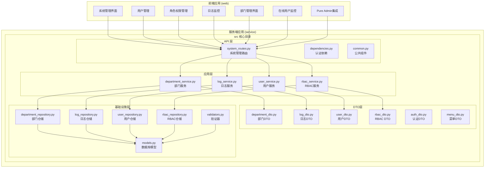

**图表来源**
- [system_routes.py:1-474](file://service/src/api/v1/system_routes.py#L1-L474)
- [department_service.py:1-156](file://service/src/application/services/department_service.py#L1-L156)
- [log_service.py:1-225](file://service/src/application/services/log_service.py#L1-L225)
- [department_dto.py:1-92](file://service/src/application/dto/department_dto.py#L1-L92)
- [log_dto.py:1-116](file://service/src/application/dto/log_dto.py#L1-L116)
- [models.py:1-304](file://service/src/infrastructure/database/models.py#L1-L304)

## 核心组件

### 应用程序工厂

应用程序工厂负责创建和配置 FastAPI 应用程序，实现了完整的生命周期管理：

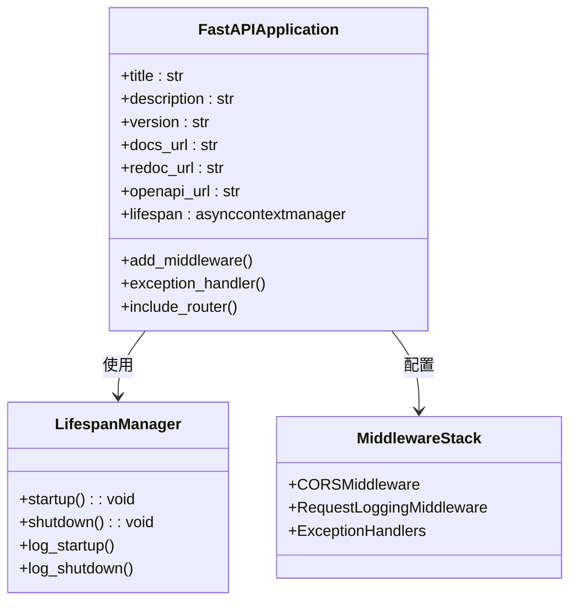

**图表来源**
- [system_routes.py:24-474](file://service/src/api/v1/system_routes.py#L24-L474)

### 系统管理路由聚合器

系统管理路由聚合器负责将各个子模块的路由整合到统一的系统管理接口下：

```mermaid
classDiagram
class SystemExtraRouter {
+system_extra_router : APIRouter
+get_dept_list()
+create_department()
+update_department()
+delete_department()
+get_online_logs()
+get_login_logs()
+get_operation_logs()
+get_system_logs()
+get_system_logs_detail()
+batch_delete_login_logs()
+clear_login_logs()
+batch_delete_operation_logs()
+clear_operation_logs()
+batch_delete_system_logs()
+clear_system_logs()
}
class DepartmentRoutes {
+POST /dept
+POST /dept/create
+PUT /dept/{dept_id}
+DELETE /dept/{dept_id}
}
class LogRoutes {
+POST /login-logs
+POST /login-logs/batch-delete
+POST /login-logs/clear
+POST /operation-logs
+POST /operation-logs/batch-delete
+POST /operation-logs/clear
+POST /system-logs
+POST /system-logs-detail
+POST /system-logs/batch-delete
+POST /system-logs/clear
}
SystemExtraRouter --> DepartmentRoutes : 包含
SystemExtraRouter --> LogRoutes : 包含
```

**图表来源**
- [system_routes.py:24-474](file://service/src/api/v1/system_routes.py#L24-L474)

**章节来源**
- [system_routes.py:1-474](file://service/src/api/v1/system_routes.py#L1-L474)

## 架构概览

系统管理模块采用分层架构设计，确保了良好的关注点分离和可维护性：

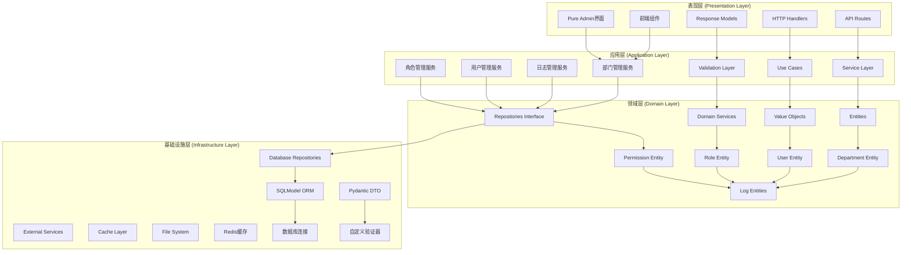

**图表来源**
- [system_routes.py:13-22](file://service/src/api/v1/system_routes.py#L13-L22)
- [department_service.py:18-24](file://service/src/application/services/department_service.py#L18-L24)
- [log_service.py:19-25](file://service/src/application/services/log_service.py#L19-L25)
- [models.py:198-289](file://service/src/infrastructure/database/models.py#L198-L289)

## 详细组件分析

### 认证与授权系统

认证与授权系统是系统管理模块的核心安全组件，实现了完整的 JWT 令牌管理和权限控制：

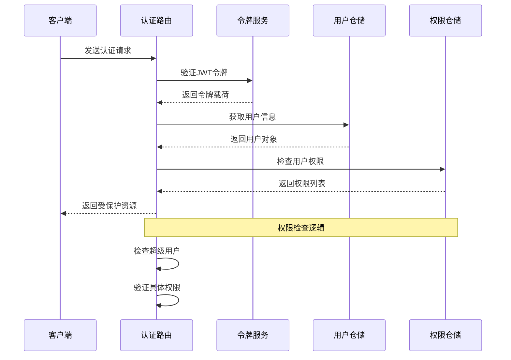

**图表来源**
- [system_routes.py:11-12](file://service/src/api/v1/system_routes.py#L11-L12)

### 数据访问层

数据访问层实现了完整的仓储模式，提供了类型安全的数据访问接口：

```mermaid
classDiagram
class DepartmentRepository {
+get_all(session) list[Department]
+get_by_id(dept_id, session) Department
+get_by_name(name, session) Department
+get_by_parent_id(parent_id, session) list[Department]
+create(department, session) Department
+update(department, session) Department
+delete(dept_id, session) bool
+count(name, status, session) int
}
class LogRepository {
+get_login_logs(params) tuple[list[LoginLog], int]
+get_operation_logs(params) tuple[list[OperationLog], int]
+get_system_logs(params) tuple[list[SystemLog], int]
+delete_login_logs(session, ids) int
+delete_operation_logs(session, ids) int
+delete_system_logs(session, ids) int
+clear_login_logs(session) int
+clear_operation_logs(session) int
+clear_system_logs(session) int
}
class UserRepositoryInterface {
<<interface>>
+get_by_id(user_id : str) User
+get_by_username(username : str) User
+get_by_email(email : str) User
+get_all(filters) list[User]
+count(filters) int
+create(user : User) User
+update(user : User) User
+delete(user_id : str) bool
+batch_delete(user_ids : list[str]) int
+update_status(user_id : str, status : int) bool
+reset_password(user_id : str, hashed_password : str) bool
}
class RoleRepositoryInterface {
<<interface>>
+get_by_id(role_id : str) Role
+get_by_name(name : str) Role
+get_by_code(code : str) Role
+get_all(filters) list[Role]
+count(filters) int
+create(role : Role) Role
+update(role : Role) Role
+delete(role_id : str) bool
+assign_permissions_to_role(role_id : str, permission_ids : list[str]) bool
+get_role_permissions(role_id : str) list[Permission]
+assign_role_to_user(user_id : str, role_id : str) bool
+remove_role_from_user(user_id : str, role_id : str) bool
+get_user_roles(user_id : str) list[Role]
}
class PermissionRepositoryInterface {
<<interface>>
+get_by_id(permission_id : str) Permission
+get_by_code(code : str) Permission
+get_all(filters) list[Permission]
+count(filters) int
+create(permission : Permission) Permission
+delete(permission_id : str) bool
+get_permissions_by_role(role_id : str) list[Permission]
+get_user_permissions(user_id : str) list[Permission]
}
DepartmentRepository ..|> DepartmentRepositoryInterface
LogRepository ..|> LogRepositoryInterface
```

**图表来源**
- [department_repository.py:10-73](file://service/src/infrastructure/repositories/department_repository.py#L10-L73)
- [log_repository.py:14-219](file://service/src/infrastructure/repositories/log_repository.py#L14-L219)
- [models.py:31-141](file://service/src/infrastructure/database/models.py#L31-L141)

### 配置管理系统

配置管理系统提供了灵活的多环境配置支持：

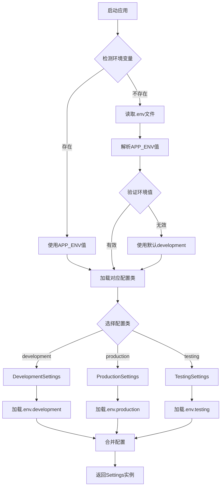

**图表来源**
- [system_routes.py:24-474](file://service/src/api/v1/system_routes.py#L24-L474)

**章节来源**
- [system_routes.py:1-474](file://service/src/api/v1/system_routes.py#L1-L474)

## 新增功能详解

### 部门管理系统

部门管理系统提供了完整的组织架构管理功能，支持树形结构的部门层级关系：

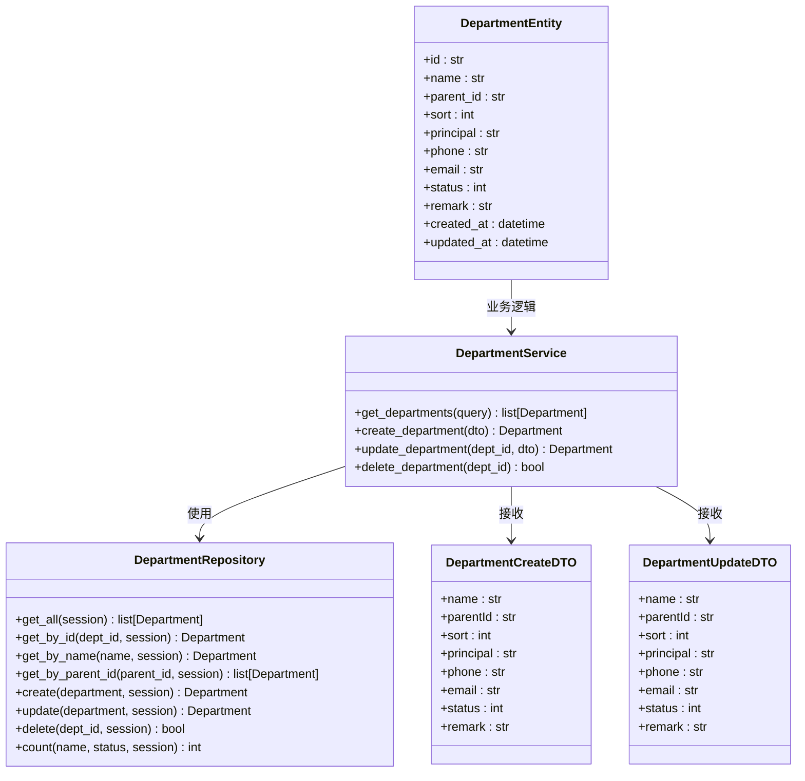

**图表来源**
- [department_service.py:18-156](file://service/src/application/services/department_service.py#L18-L156)
- [department_repository.py:10-73](file://service/src/infrastructure/repositories/department_repository.py#L10-L73)
- [department_dto.py:8-62](file://service/src/application/dto/department_dto.py#L8-L62)
- [models.py:198-221](file://service/src/infrastructure/database/models.py#L198-L221)

**章节来源**
- [department_service.py:1-156](file://service/src/application/services/department_service.py#L1-L156)
- [department_dto.py:1-92](file://service/src/application/dto/department_dto.py#L1-L92)
- [department_repository.py:1-73](file://service/src/infrastructure/repositories/department_repository.py#L1-L73)

### 用户管理增强功能

用户管理功能得到了显著增强，提供了更完善的用户生命周期管理：

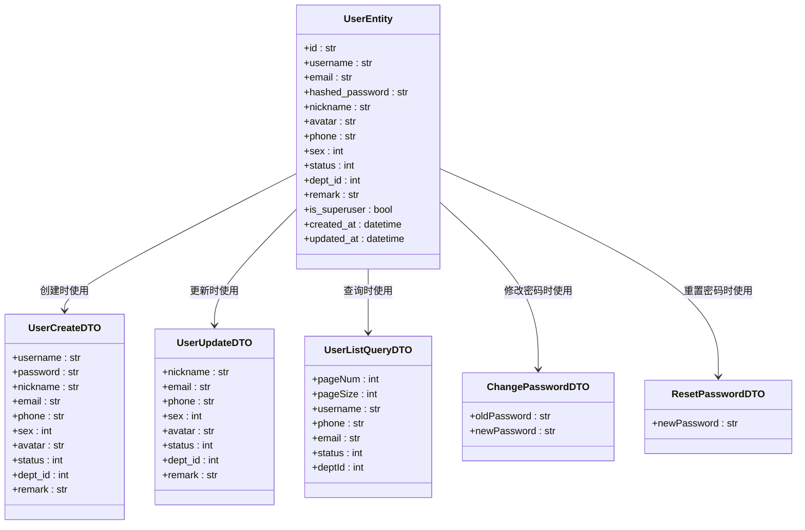

**图表来源**
- [user_dto.py:8-132](file://service/src/application/dto/user_dto.py#L8-L132)
- [models.py:31-65](file://service/src/infrastructure/database/models.py#L31-L65)

**章节来源**
- [user_dto.py:1-132](file://service/src/application/dto/user_dto.py#L1-L132)
- [models.py:1-304](file://service/src/infrastructure/database/models.py#L1-L304)

### 角色管理功能完善

角色管理功能提供了完整的RBAC权限管理体系：

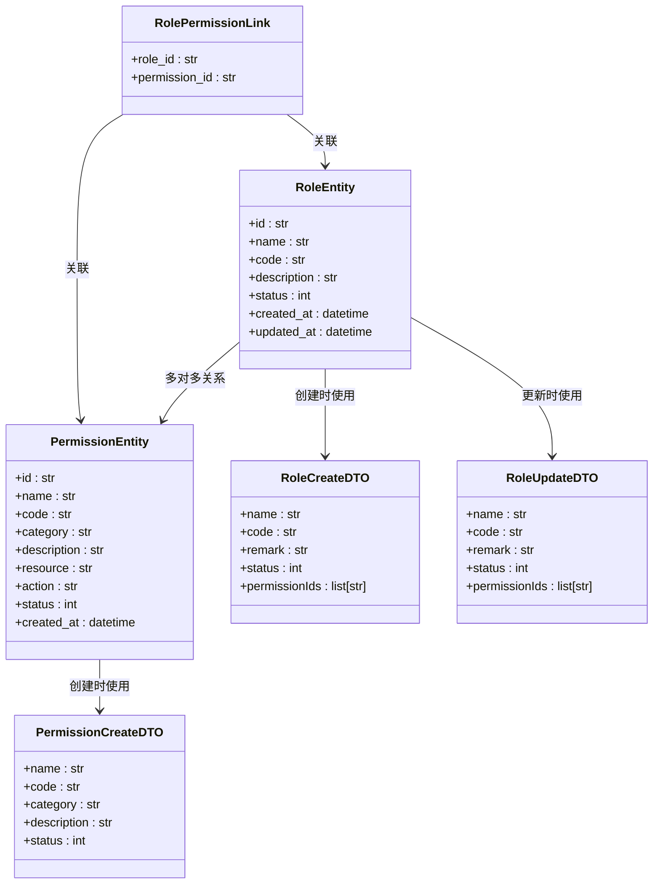

**图表来源**
- [rbac_dto.py:8-121](file://service/src/application/dto/rbac_dto.py#L8-L121)
- [models.py:70-141](file://service/src/infrastructure/database/models.py#L70-L141)

**章节来源**
- [rbac_dto.py:1-121](file://service/src/application/dto/rbac_dto.py#L1-L121)
- [models.py:17-141](file://service/src/infrastructure/database/models.py#L17-L141)

### 日志管理系统

日志管理系统提供多维度的日志追踪和分析能力：

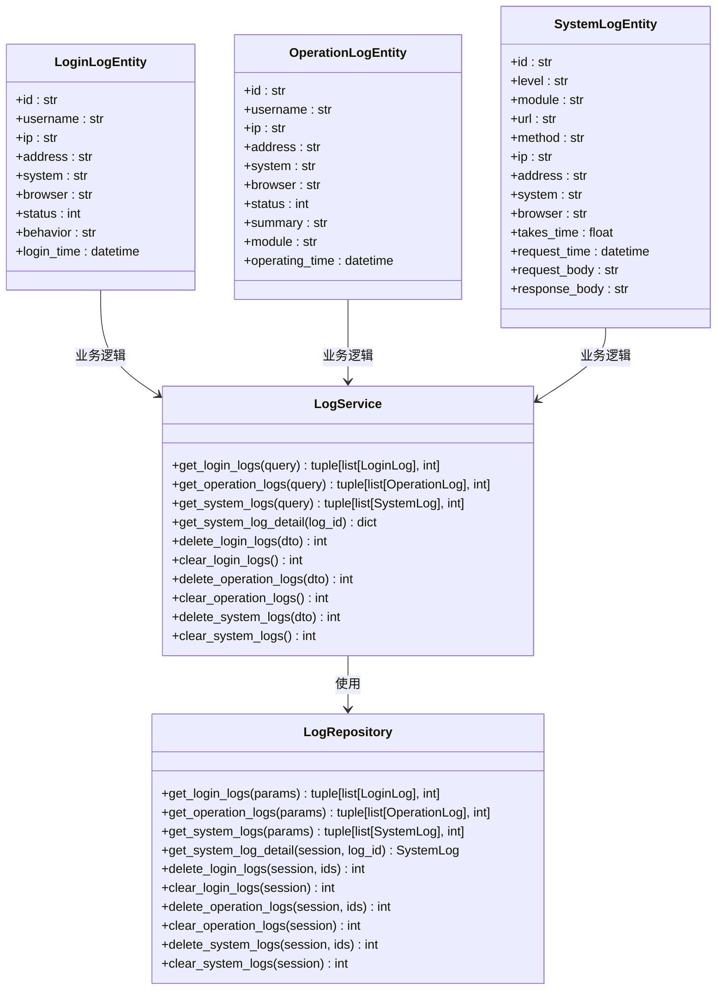

**图表来源**
- [log_service.py:19-225](file://service/src/application/services/log_service.py#L19-L225)
- [log_repository.py:14-219](file://service/src/infrastructure/repositories/log_repository.py#L14-L219)
- [log_dto.py:11-116](file://service/src/application/dto/log_dto.py#L11-L116)
- [models.py:226-292](file://service/src/infrastructure/database/models.py#L226-L292)

**章节来源**
- [log_service.py:1-225](file://service/src/application/services/log_service.py#L1-L225)
- [log_dto.py:1-116](file://service/src/application/dto/log_dto.py#L1-L116)
- [log_repository.py:1-219](file://service/src/infrastructure/repositories/log_repository.py#L1-L219)

## 前端集成方案

### Pure Admin框架集成

系统管理模块与Pure Admin前端框架实现了深度集成，提供了完整的用户界面：

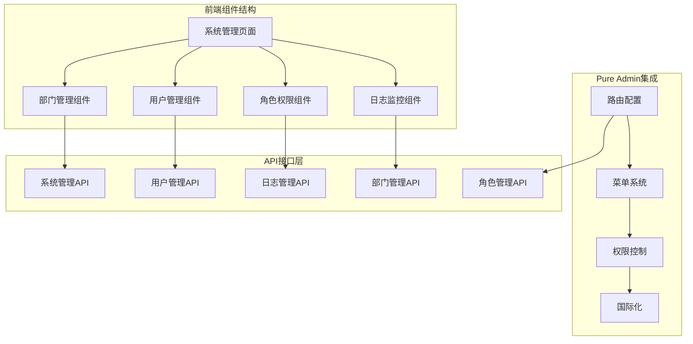

**图表来源**
- [system.ts:1-237](file://web/src/api/system.ts#L1-L237)
- [index.vue:1-173](file://web/src/views/system/dept/index.vue#L1-L173)
- [index.vue:1-200](file://web/src/views/system/user/index.vue#L1-L200)
- [index.vue:1-200](file://web/src/views/system/role/index.vue#L1-L200)

### 前端组件架构

前端系统管理界面采用组件化设计，支持响应式布局和交互式操作：

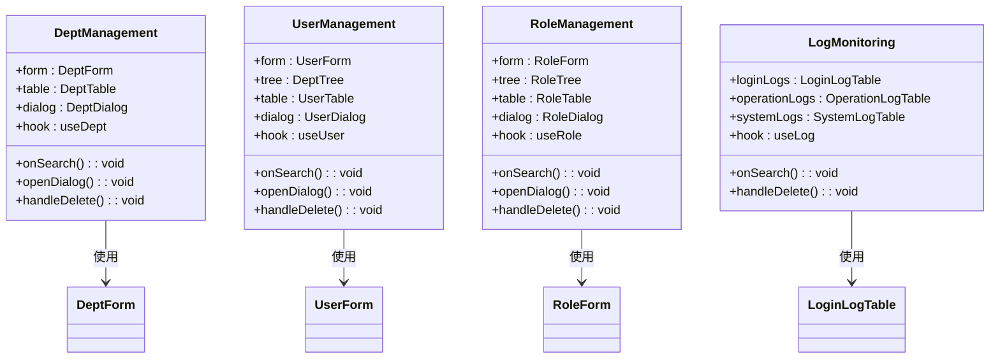

**图表来源**
- [index.vue:16-28](file://web/src/views/system/dept/index.vue#L16-L28)
- [index.vue:25-50](file://web/src/views/system/user/index.vue#L25-L50)
- [index.vue:47-76](file://web/src/views/system/role/index.vue#L47-L76)
- [system.ts:49-77](file://web/src/api/system.ts#L49-L77)

**章节来源**
- [system.ts:1-237](file://web/src/api/system.ts#L1-L237)
- [index.vue:1-173](file://web/src/views/system/dept/index.vue#L1-L173)
- [index.vue:1-200](file://web/src/views/system/user/index.vue#L1-L200)
- [index.vue:1-200](file://web/src/views/system/role/index.vue#L1-L200)

## 数据验证机制

系统管理模块实现了多层次的数据验证机制，确保数据的完整性和安全性：

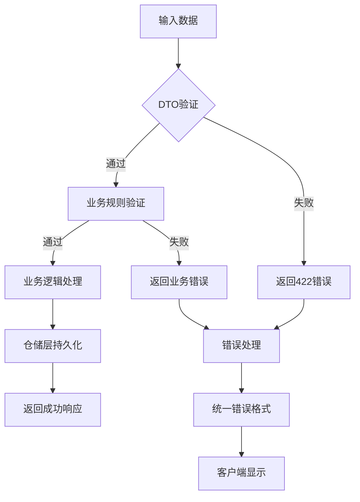

**图表来源**
- [department_dto.py:8-92](file://service/src/application/dto/department_dto.py#L8-L92)
- [user_dto.py:8-132](file://service/src/application/dto/user_dto.py#L8-L132)
- [rbac_dto.py:8-121](file://service/src/application/dto/rbac_dto.py#L8-L121)
- [validators.py:8-26](file://service/src/core/validators.py#L8-L26)

### 验证器类型

系统使用了多种类型的验证器来确保数据质量：

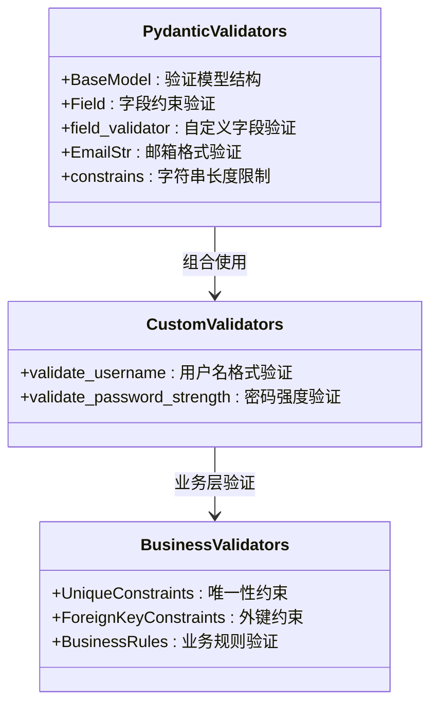

**图表来源**
- [validators.py:8-26](file://service/src/core/validators.py#L8-L26)
- [department_dto.py:19-34](file://service/src/application/dto/department_dto.py#L19-L34)
- [user_dto.py:23-38](file://service/src/application/dto/user_dto.py#L23-L38)

**章节来源**
- [department_dto.py:1-92](file://service/src/application/dto/department_dto.py#L1-L92)
- [user_dto.py:1-132](file://service/src/application/dto/user_dto.py#L1-L132)
- [rbac_dto.py:1-121](file://service/src/application/dto/rbac_dto.py#L1-L121)
- [validators.py:1-26](file://service/src/core/validators.py#L1-L26)

## 依赖关系分析

系统管理模块的依赖关系展现了清晰的分层架构：

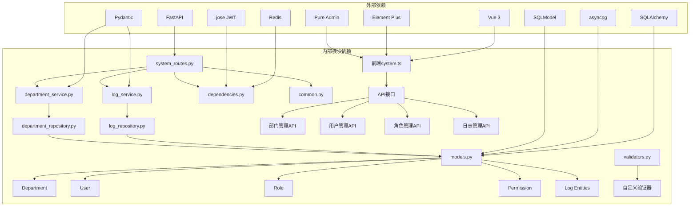

**图表来源**
- [system_routes.py:6-22](file://service/src/api/v1/system_routes.py#L6-L22)
- [department_service.py:6-15](file://service/src/application/services/department_service.py#L6-L15)
- [log_service.py:6-16](file://service/src/application/services/log_service.py#L6-L16)
- [models.py:11-12](file://service/src/infrastructure/database/models.py#L11-L12)

**章节来源**
- [system_routes.py:1-474](file://service/src/api/v1/system_routes.py#L1-L474)
- [department_service.py:1-156](file://service/src/application/services/department_service.py#L1-L156)
- [log_service.py:1-225](file://service/src/application/services/log_service.py#L1-L225)
- [models.py:1-304](file://service/src/infrastructure/database/models.py#L1-L304)

## 性能考虑

系统管理模块在设计时充分考虑了性能优化：

### 异步数据库操作
- 使用 SQLAlchemy AsyncSession 进行非阻塞数据库操作
- 批量操作优化，减少数据库往返次数
- 连接池管理，避免频繁创建连接

### 缓存策略
- Redis 缓存集成，支持用户会话和权限缓存
- 自动失效机制，确保数据一致性
- 多级缓存架构，提升响应速度

### 请求优化
- 中间件链优化，减少不必要的处理步骤
- 分页查询优化，避免大数据集传输
- 响应压缩，减少网络带宽占用

### 日志系统优化
- 异步日志写入，避免阻塞主业务流程
- 日志级别过滤，减少不必要的日志输出
- 批量日志处理，提升日志记录效率

### 数据验证优化
- Pydantic模型验证的性能优化
- 自定义验证器的缓存机制
- 业务规则验证的早期失败处理

## 故障排除指南

### 常见问题诊断

#### 认证失败
当用户无法通过认证时，检查以下要点：
1. JWT 令牌是否正确生成和传递
2. 令牌是否过期或格式错误
3. 用户账户状态是否正常
4. 权限配置是否正确

#### 数据库连接问题
如果遇到数据库连接异常：
1. 检查 DATABASE_URL 配置
2. 验证数据库服务状态
3. 查看连接池配置
4. 检查异步连接设置

#### 权限拒绝
当权限检查失败时：
1. 验证用户角色分配
2. 检查权限代码配置
3. 确认权限继承关系
4. 查看权限缓存状态

#### 数据验证错误
当数据验证失败时：
1. 检查DTO模型定义
2. 验证字段约束条件
3. 确认自定义验证器逻辑
4. 查看业务规则验证

#### 前端集成问题
如果前端界面无法正常显示：
1. 检查API接口是否正确配置
2. 验证路由映射关系
3. 确认菜单权限配置
4. 查看浏览器控制台错误信息

**章节来源**
- [system_routes.py:11-12](file://service/src/api/v1/system_routes.py#L11-L12)
- [department_service.py:57-60](file://service/src/application/services/department_service.py#L57-L60)
- [log_service.py:183-185](file://service/src/application/services/log_service.py#L183-L185)
- [system.ts:49-77](file://web/src/api/system.ts#L49-L77)

## 结论

系统管理模块展现了现代企业级应用的最佳实践，通过采用分层架构、依赖注入、异步编程和类型安全等技术，构建了一个高可用、可扩展且易于维护的系统管理平台。

**更新** 本次更新显著增强了系统管理模块的功能完整性，新增的部门管理CRUD操作、用户管理增强、角色管理功能完善，以及新增的日志系统和数据验证机制，使其成为了一个真正意义上的企业级管理系统。

### 主要优势

1. **架构清晰**：分层设计确保了良好的关注点分离
2. **安全性强**：完整的认证授权体系和数据保护机制
3. **性能优秀**：异步处理和缓存优化提升了系统响应速度
4. **可扩展性好**：模块化设计便于功能扩展和维护
5. **开发体验佳**：完善的类型注解和错误处理机制
6. **前端集成完善**：与Pure Admin框架的深度集成
7. **功能全面**：涵盖企业管理系统的核心需求
8. **数据验证完善**：多层次的数据验证确保数据质量
9. **日志系统健全**：多维度的日志追踪和分析能力
10. **业务规则明确**：清晰的业务逻辑和约束条件

### 技术亮点

- **领域驱动设计**：清晰的领域模型和仓储接口
- **异步编程**：充分利用 Python 异步特性
- **类型安全**：完整的 Pydantic 模型验证
- **中间件模式**：统一的请求处理和异常管理
- **多环境配置**：灵活的配置管理机制
- **前端组件化**：Pure Admin框架的完整集成
- **日志系统**：多维度的日志追踪和分析能力
- **数据验证**：多层次的数据验证和业务规则检查
- **缓存策略**：Redis缓存集成提升性能
- **错误处理**：统一的错误处理和响应格式

该模块为后续的功能扩展奠定了坚实的基础，可以轻松地添加新的系统管理功能，如配置管理、系统监控、备份恢复等高级特性。通过持续的优化和完善，这个系统管理模块将成为企业数字化转型的重要基础设施。