# 系统管理模块

<cite>
**本文档引用的文件**
- [main.py](file://service/src/main.py)
- [system_routes.py](file://service/src/api/v1/system_routes.py)
- [__init__.py](file://service/src/api/v1/__init__.py)
- [common.py](file://service/src/api/common.py)
- [dependencies.py](file://service/src/api/dependencies.py)
- [settings.py](file://service/src/config/settings.py)
- [constants.py](file://service/src/core/constants.py)
- [token_service.py](file://service/src/domain/auth/token_service.py)
- [user_repository.py](file://service/src/infrastructure/repositories/user_repository.py)
- [rbac_repository.py](file://service/src/infrastructure/repositories/rbac_repository.py)
- [repository.py](file://service/src/domain/menu/repository.py)
- [auth_routes.py](file://service/src/api/v1/auth_routes.py)
- [index.vue](file://web/src/views/system/dept/index.vue)
- [form.vue](file://web/src/views/system/dept/form.vue)
- [hook.tsx](file://web/src/views/system/dept/utils/hook.tsx)
- [system.ts](file://web/src/api/system.ts)
- [index.vue](file://web/src/views/monitor/online/index.vue)
</cite>

## 更新摘要
**所做更改**
- 新增部门管理功能的完整实现说明
- 添加在线用户监控系统的详细描述
- 完善登录日志、操作日志、系统日志的接口规范
- 更新与Pure Admin前端框架的完整集成方案
- 增强系统管理模块的架构图和组件关系图

## 目录
1. [简介](#简介)
2. [项目结构](#项目结构)
3. [核心组件](#核心组件)
4. [架构概览](#架构概览)
5. [详细组件分析](#详细组件分析)
6. [新增功能详解](#新增功能详解)
7. [前端集成方案](#前端集成方案)
8. [依赖关系分析](#依赖关系分析)
9. [性能考虑](#性能考虑)
10. [故障排除指南](#故障排除指南)
11. [结论](#结论)

## 简介

系统管理模块是基于 FastAPI 构建的企业级管理系统的核心功能模块，采用领域驱动设计（DDD）和基于角色的访问控制（RBAC）架构。该模块提供了完整的系统管理功能，包括部门管理、在线用户监控、日志管理等核心业务功能，并与Pure Admin前端框架实现了完整集成。

**更新** 本次更新重点增强了系统管理功能的完整性，新增了部门管理、在线用户监控、多维度日志追踪等核心功能模块。

本模块采用了现代化的软件架构模式，包括：
- **分层架构**：清晰的表示层、应用层、领域层和基础设施层分离
- **依赖注入**：通过 FastAPI 的依赖系统实现松耦合
- **异步编程**：全面使用 asyncio 和异步数据库连接
- **类型安全**：完整的 Pydantic 模型和类型注解
- **中间件模式**：统一的请求处理和异常管理
- **前端集成**：与Pure Admin框架的无缝对接

## 项目结构

系统管理模块在整体项目中的位置和组织结构如下：

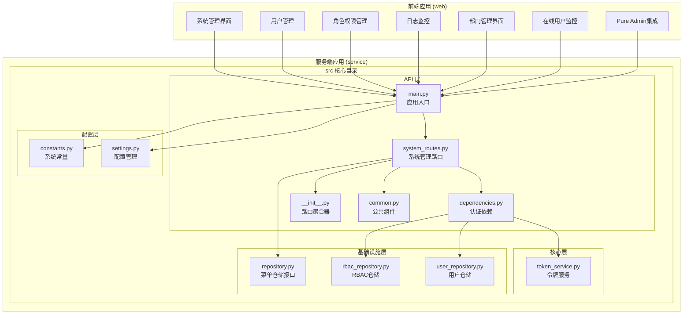

**图表来源**
- [main.py:1-96](file://service/src/main.py#L1-L96)
- [system_routes.py:1-128](file://service/src/api/v1/system_routes.py#L1-L128)
- [__init__.py:1-46](file://service/src/api/v1/__init__.py#L1-L46)
- [dependencies.py:1-72](file://service/src/api/dependencies.py#L1-L72)

**章节来源**
- [main.py:1-96](file://service/src/main.py#L1-L96)
- [settings.py:1-198](file://service/src/config/settings.py#L1-L198)
- [__init__.py:1-46](file://service/src/api/v1/__init__.py#L1-L46)

## 核心组件

### 应用程序工厂

应用程序工厂负责创建和配置 FastAPI 应用程序，实现了完整的生命周期管理：

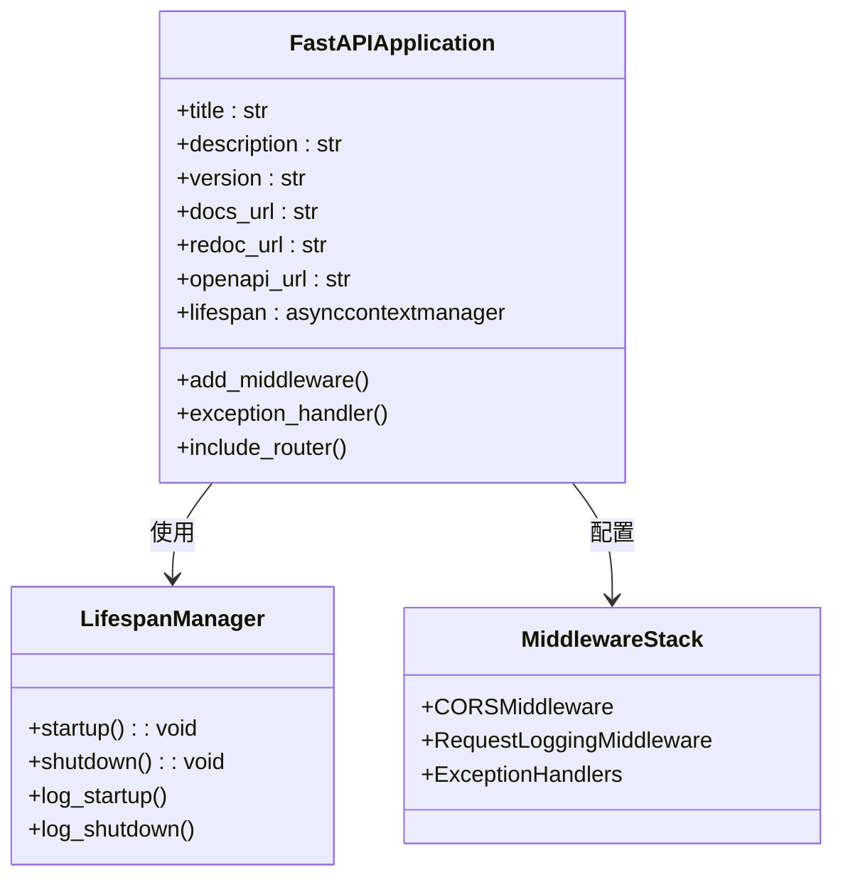

**图表来源**
- [main.py:19-32](file://service/src/main.py#L19-L32)
- [main.py:34-92](file://service/src/main.py#L34-L92)

### 系统管理路由聚合器

系统管理路由聚合器负责将各个子模块的路由整合到统一的系统管理接口下：

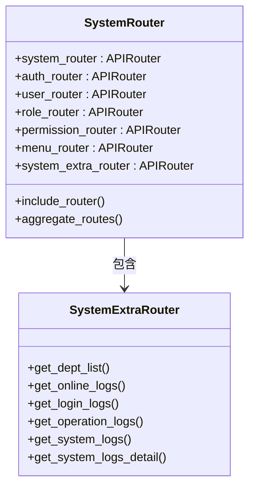

**图表来源**
- [__init__.py:14-43](file://service/src/api/v1/__init__.py#L14-L43)
- [system_routes.py:13-128](file://service/src/api/v1/system_routes.py#L13-L128)

**章节来源**
- [__init__.py:1-46](file://service/src/api/v1/__init__.py#L1-L46)
- [system_routes.py:1-128](file://service/src/api/v1/system_routes.py#L1-L128)
- [dependencies.py:1-72](file://service/src/api/dependencies.py#L1-L72)

## 架构概览

系统管理模块采用分层架构设计，确保了良好的关注点分离和可维护性：

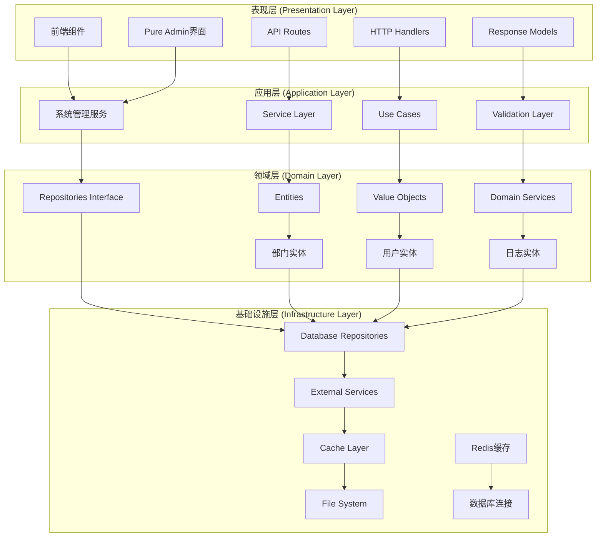

**图表来源**
- [main.py:34-92](file://service/src/main.py#L34-L92)
- [system_routes.py:16-128](file://service/src/api/v1/system_routes.py#L16-L128)
- [__init__.py:14-43](file://service/src/api/v1/__init__.py#L14-L43)

## 详细组件分析

### 认证与授权系统

认证与授权系统是系统管理模块的核心安全组件，实现了完整的 JWT 令牌管理和权限控制：

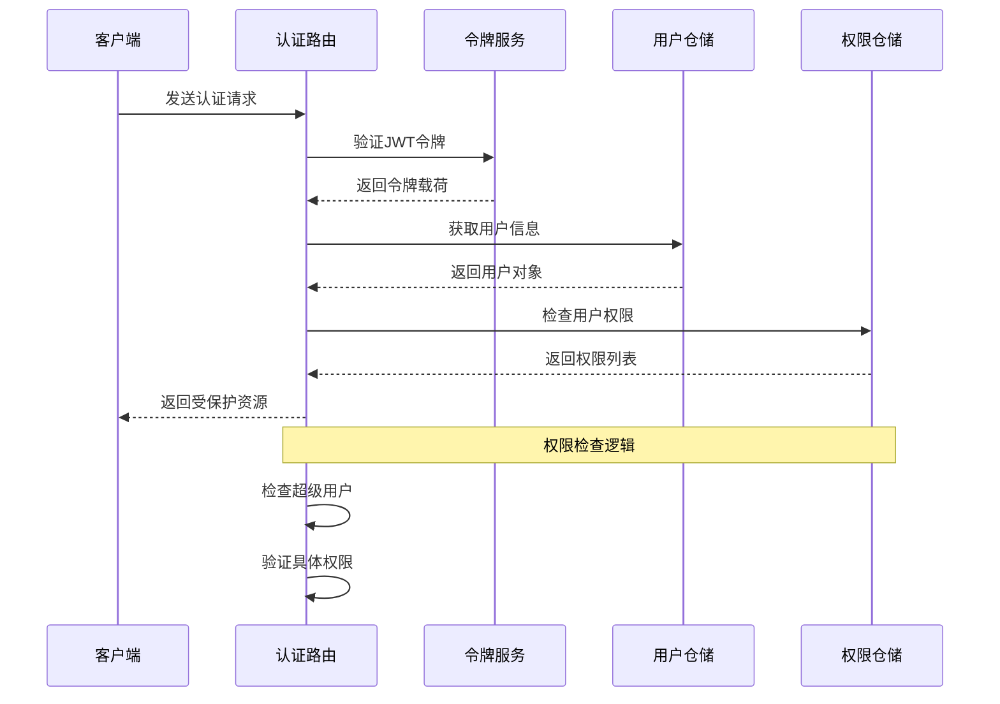

**图表来源**
- [dependencies.py:16-72](file://service/src/api/dependencies.py#L16-L72)
- [token_service.py:11-45](file://service/src/domain/auth/token_service.py#L11-L45)
- [user_repository.py:11-185](file://service/src/infrastructure/repositories/user_repository.py#L11-L185)
- [rbac_repository.py:136-213](file://service/src/infrastructure/repositories/rbac_repository.py#L136-L213)

### 数据访问层

数据访问层实现了完整的仓储模式，提供了类型安全的数据访问接口：

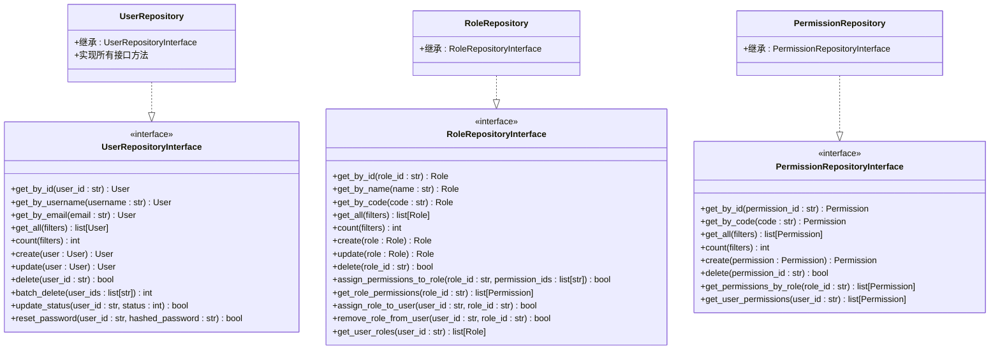

**图表来源**
- [user_repository.py:11-185](file://service/src/infrastructure/repositories/user_repository.py#L11-L185)
- [rbac_repository.py:11-213](file://service/src/infrastructure/repositories/rbac_repository.py#L11-L213)

### 配置管理系统

配置管理系统提供了灵活的多环境配置支持：

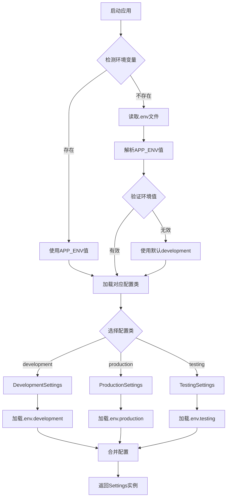

**图表来源**
- [settings.py:144-198](file://service/src/config/settings.py#L144-L198)

**章节来源**
- [settings.py:1-198](file://service/src/config/settings.py#L1-198)
- [constants.py:1-37](file://service/src/core/constants.py#L1-L37)

## 新增功能详解

### 部门管理系统

部门管理系统提供了完整的组织架构管理功能，支持树形结构的部门层级关系：

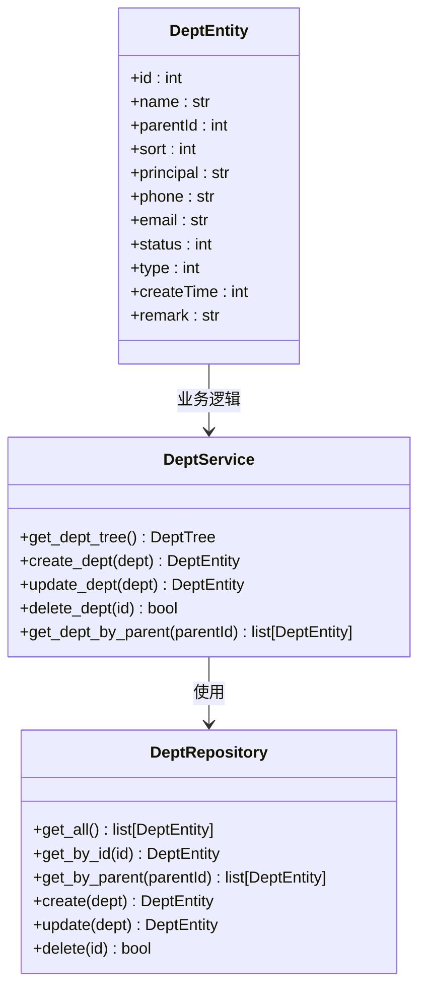

**图表来源**
- [system_routes.py:16-34](file://service/src/api/v1/system_routes.py#L16-L34)
- [hook.tsx:75-94](file://web/src/views/system/dept/utils/hook.tsx#L75-L94)

### 在线用户监控系统

在线用户监控系统实时追踪用户的在线状态和行为：

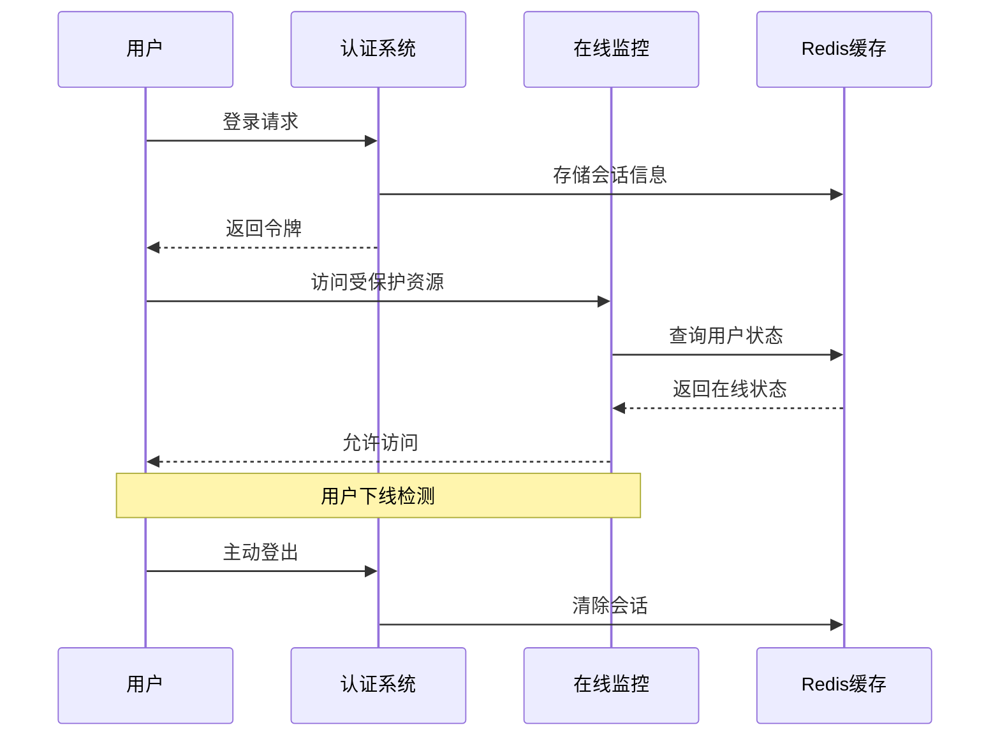

**图表来源**
- [system_routes.py:37-51](file://service/src/api/v1/system_routes.py#L37-L51)
- [index.vue:14-27](file://web/src/views/monitor/online/index.vue#L14-L27)

### 日志管理系统

日志管理系统提供多维度的日志追踪和分析能力：

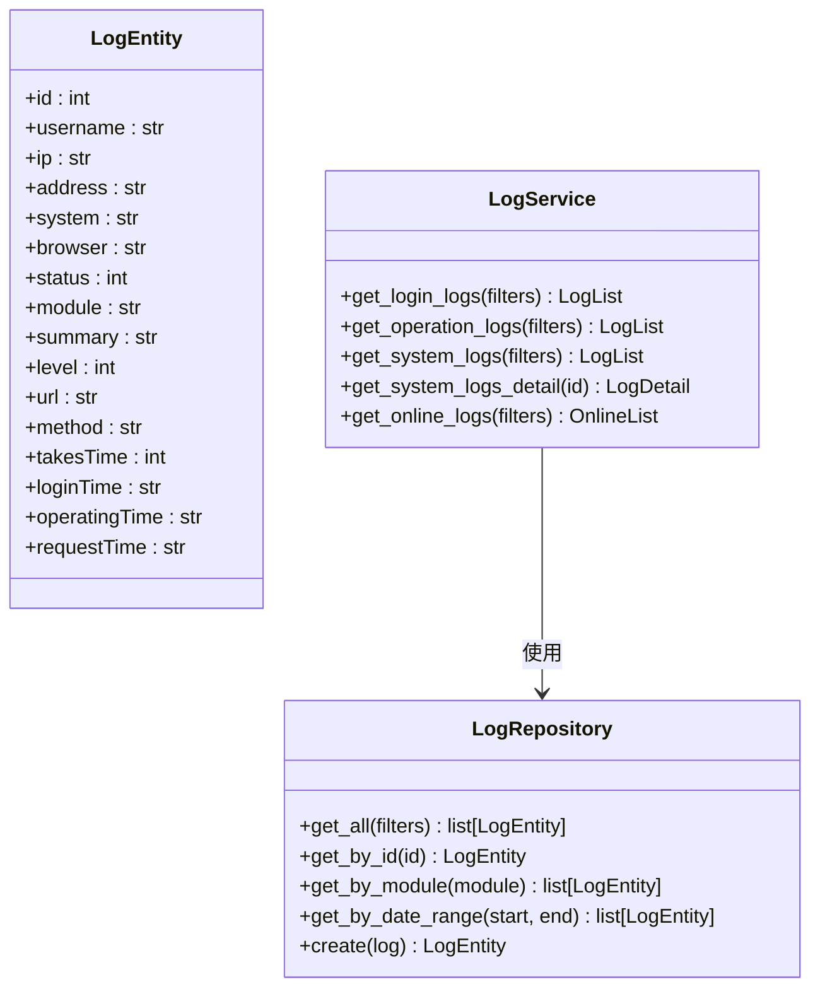

**图表来源**
- [system_routes.py:54-127](file://service/src/api/v1/system_routes.py#L54-L127)

**章节来源**
- [system_routes.py:1-128](file://service/src/api/v1/system_routes.py#L1-L128)
- [index.vue:1-173](file://web/src/views/system/dept/index.vue#L1-L173)
- [form.vue:1-140](file://web/src/views/system/dept/form.vue#L1-L140)
- [hook.tsx:1-182](file://web/src/views/system/dept/utils/hook.tsx#L1-L182)

## 前端集成方案

### Pure Admin框架集成

系统管理模块与Pure Admin前端框架实现了深度集成，提供了完整的用户界面：

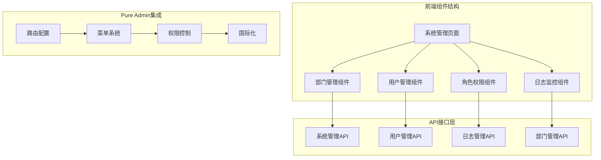

**图表来源**
- [auth_routes.py:180-207](file://service/src/api/v1/auth_routes.py#L180-L207)
- [system.ts:49-77](file://web/src/api/system.ts#L49-L77)

### 前端组件架构

前端系统管理界面采用组件化设计，支持响应式布局和交互式操作：

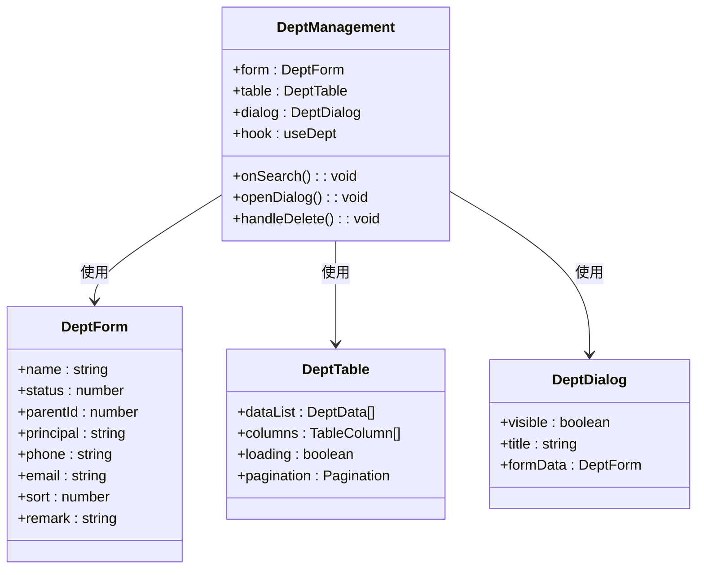

**图表来源**
- [index.vue:16-28](file://web/src/views/system/dept/index.vue#L16-L28)
- [form.vue:8-30](file://web/src/views/system/dept/form.vue#L8-L30)
- [hook.tsx:12-181](file://web/src/views/system/dept/utils/hook.tsx#L12-L181)

**章节来源**
- [auth_routes.py:180-207](file://service/src/api/v1/auth_routes.py#L180-L207)
- [system.ts:1-88](file://web/src/api/system.ts#L1-L88)
- [index.vue:1-173](file://web/src/views/system/dept/index.vue#L1-L173)
- [form.vue:1-140](file://web/src/views/system/dept/form.vue#L1-L140)
- [hook.tsx:1-182](file://web/src/views/system/dept/utils/hook.tsx#L1-L182)

## 依赖关系分析

系统管理模块的依赖关系展现了清晰的分层架构：

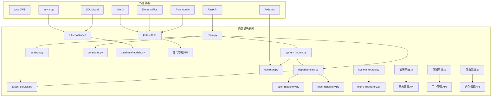

**图表来源**
- [main.py:11-16](file://service/src/main.py#L11-L16)
- [system_routes.py:7-11](file://service/src/api/v1/system_routes.py#L7-L11)
- [dependencies.py:8-11](file://service/src/api/dependencies.py#L8-L11)

**章节来源**
- [main.py:1-96](file://service/src/main.py#L1-L96)
- [system_routes.py:1-128](file://service/src/api/v1/system_routes.py#L1-L128)
- [system.ts:1-88](file://web/src/api/system.ts#L1-L88)

## 性能考虑

系统管理模块在设计时充分考虑了性能优化：

### 异步数据库操作
- 使用 SQLAlchemy AsyncSession 进行非阻塞数据库操作
- 批量操作优化，减少数据库往返次数
- 连接池管理，避免频繁创建连接

### 缓存策略
- Redis 缓存集成，支持用户会话和权限缓存
- 自动失效机制，确保数据一致性
- 多级缓存架构，提升响应速度

### 请求优化
- 中间件链优化，减少不必要的处理步骤
- 分页查询优化，避免大数据集传输
- 响应压缩，减少网络带宽占用

### 日志系统优化
- 异步日志写入，避免阻塞主业务流程
- 日志级别过滤，减少不必要的日志输出
- 批量日志处理，提升日志记录效率

## 故障排除指南

### 常见问题诊断

#### 认证失败
当用户无法通过认证时，检查以下要点：
1. JWT 令牌是否正确生成和传递
2. 令牌是否过期或格式错误
3. 用户账户状态是否正常
4. 权限配置是否正确

#### 数据库连接问题
如果遇到数据库连接异常：
1. 检查 DATABASE_URL 配置
2. 验证数据库服务状态
3. 查看连接池配置
4. 检查异步连接设置

#### 权限拒绝
当权限检查失败时：
1. 验证用户角色分配
2. 检查权限代码配置
3. 确认权限继承关系
4. 查看权限缓存状态

#### 前端集成问题
如果前端界面无法正常显示：
1. 检查API接口是否正确配置
2. 验证路由映射关系
3. 确认菜单权限配置
4. 查看浏览器控制台错误信息

**章节来源**
- [dependencies.py:16-72](file://service/src/api/dependencies.py#L16-L72)
- [settings.py:57-67](file://service/src/config/settings.py#L57-L67)
- [auth_routes.py:180-207](file://service/src/api/v1/auth_routes.py#L180-L207)

## 结论

系统管理模块展现了现代企业级应用的最佳实践，通过采用分层架构、依赖注入、异步编程和类型安全等技术，构建了一个高可用、可扩展且易于维护的系统管理平台。

**更新** 本次更新显著增强了系统管理模块的功能完整性，新增的部门管理、在线用户监控、多维度日志追踪等功能，使其成为了一个真正意义上的企业级管理系统。

### 主要优势

1. **架构清晰**：分层设计确保了良好的关注点分离
2. **安全性强**：完整的认证授权体系和数据保护机制
3. **性能优秀**：异步处理和缓存优化提升了系统响应速度
4. **可扩展性好**：模块化设计便于功能扩展和维护
5. **开发体验佳**：完善的类型注解和错误处理机制
6. **前端集成完善**：与Pure Admin框架的深度集成
7. **功能全面**：涵盖企业管理系统的核心需求

### 技术亮点

- **领域驱动设计**：清晰的领域模型和仓储接口
- **异步编程**：充分利用 Python 异步特性
- **类型安全**：完整的 Pydantic 模型验证
- **中间件模式**：统一的请求处理和异常管理
- **多环境配置**：灵活的配置管理机制
- **前端组件化**：Pure Admin框架的完整集成
- **日志系统**：多维度的日志追踪和分析能力

该模块为后续的功能扩展奠定了坚实的基础，可以轻松地添加新的系统管理功能，如配置管理、系统监控、备份恢复等高级特性。通过持续的优化和完善，这个系统管理模块将成为企业数字化转型的重要基础设施。