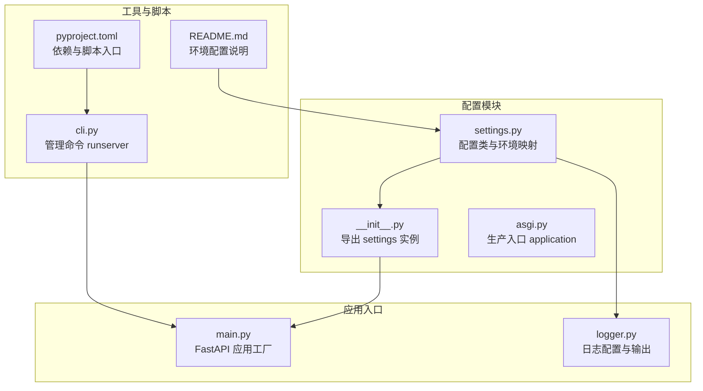
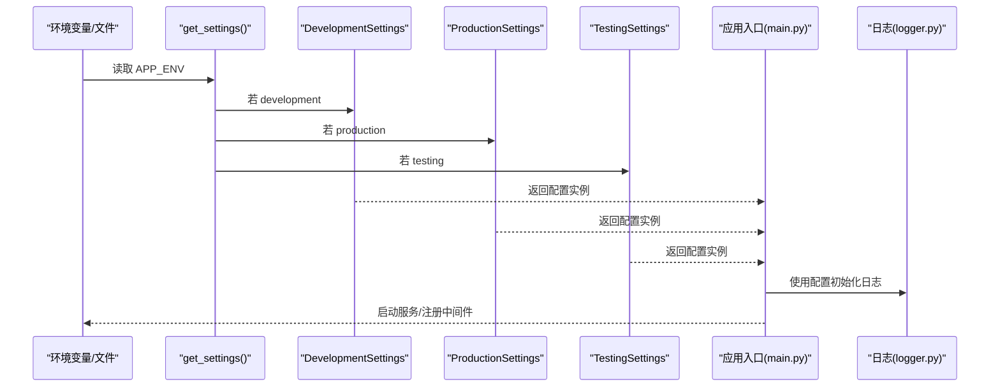
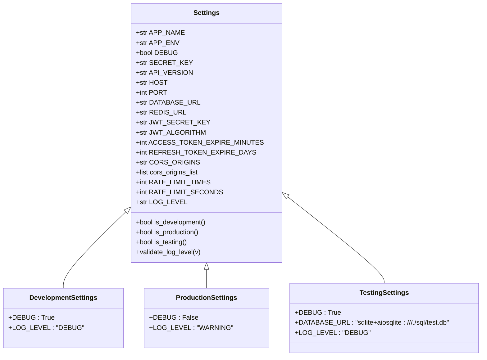
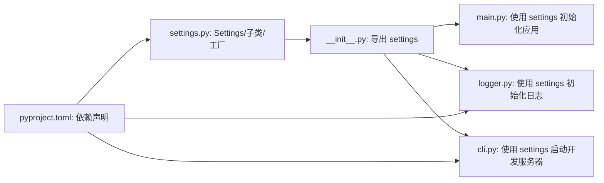

# 配置管理

<cite>
**本文引用的文件**
- [settings.py](file://service/src/config/settings.py)
- [__init__.py](file://service/src/config/__init__.py)
- [asgi.py](file://service/src/config/asgi.py)
- [main.py](file://service/src/main.py)
- [logger.py](file://service/src/core/logger.py)
- [cli.py](file://service/scripts/cli.py)
- [pyproject.toml](file://service/pyproject.toml)
- [README.md](file://service/README.md)
- [auth_routes.py](file://service/src/api/v1/auth_routes.py)
- [user_routes.py](file://service/src/api/v1/user_routes.py)
</cite>

## 目录
1. [简介](#简介)
2. [项目结构](#项目结构)
3. [核心组件](#核心组件)
4. [架构总览](#架构总览)
5. [详细组件分析](#详细组件分析)
6. [依赖分析](#依赖分析)
7. [性能考虑](#性能考虑)
8. [故障排查指南](#故障排查指南)
9. [结论](#结论)
10. [附录](#附录)

## 简介
本文件系统性阐述本项目的配置管理体系，重点覆盖：
- 多环境配置设计与差异（开发、测试、生产）
- 环境变量加载与验证机制（含敏感信息处理建议）
- 配置文件组织结构与优先级规则
- 配置项扩展方法与自定义配置添加流程
- 实际代码示例路径，展示如何读取配置与在运行时修改配置

## 项目结构
配置相关的核心位置集中在 service/src/config 目录，配合日志、应用入口与脚本工具共同构成完整的配置生态。

图表来源
- [settings.py:1-198](file://service/src/config/settings.py#L1-L198)
- [__init__.py:1-6](file://service/src/config/__init__.py#L1-L6)
- [asgi.py:1-6](file://service/src/config/asgi.py#L1-L6)
- [main.py:1-96](file://service/src/main.py#L1-L96)
- [logger.py:1-117](file://service/src/core/logger.py#L1-L117)
- [cli.py:1-135](file://service/scripts/cli.py#L1-L135)
- [pyproject.toml:1-76](file://service/pyproject.toml#L1-L76)
- [README.md:141-180](file://service/README.md#L141-L180)

章节来源
- [settings.py:1-198](file://service/src/config/settings.py#L1-L198)
- [README.md:141-180](file://service/README.md#L141-L180)

## 核心组件
- 配置类与环境映射：通过继承基类与环境子类，实现不同环境下的差异化配置；同时提供统一的配置实例导出。
- 环境变量加载与优先级：系统环境变量 > 环境特定 .env 文件 > 通用 .env 文件 > 默认值。
- 配置验证：对关键配置项进行类型与范围校验，如日志级别、端口范围、密钥长度等。
- 运行时读取与使用：应用入口与日志模块均直接依赖配置实例，保证全局一致性。

章节来源
- [settings.py:41-198](file://service/src/config/settings.py#L41-L198)
- [main.py:19-96](file://service/src/main.py#L19-L96)
- [logger.py:15-72](file://service/src/core/logger.py#L15-L72)

## 架构总览
配置体系围绕“配置类 + 环境映射 + 加载优先级 + 验证 + 使用”展开，形成稳定的运行时配置源。

图表来源
- [settings.py:144-198](file://service/src/config/settings.py#L144-L198)
- [main.py:19-96](file://service/src/main.py#L19-L96)
- [logger.py:15-72](file://service/src/core/logger.py#L15-L72)

## 详细组件分析

### 配置类与环境映射
- 基类 Settings：定义通用配置项（应用名、环境、调试、密钥、API 版本、主机端口、数据库、Redis、JWT、CORS、限流、日志级别等），并提供环境判断属性与日志级别验证。
- 环境子类：
  - DevelopmentSettings：启用调试与更详细的日志级别。
  - ProductionSettings：禁用调试与降低日志级别。
  - TestingSettings：启用调试并将数据库指向测试库。
- 工厂函数 get_settings()：根据 APP_ENV 选择对应子类实例，遵循“系统环境变量 > 环境特定 .env > 通用 .env > 默认值”的优先级。
- 单例缓存：get_cached_settings() 使用缓存避免重复实例化。

图表来源
- [settings.py:41-142](file://service/src/config/settings.py#L41-L142)

章节来源
- [settings.py:41-198](file://service/src/config/settings.py#L41-L198)

### 环境变量加载与验证机制
- 加载顺序与来源：
  - 系统环境变量（最高优先级）
  - 环境特定 .env 文件（如 .env.development/.env.production/.env.testing）
  - 通用 .env 文件（次之）
  - 默认值（最低优先级）
- 验证逻辑：
  - 日志级别严格限定集合，非法值将触发校验错误。
  - 端口范围与密钥最小长度等数值/字符串约束。
- 敏感信息处理建议：
  - 将密钥与数据库连接串置于环境变量或专用 .env 文件中，避免硬编码。
  - 在 CI/CD 中使用受控的密钥管理服务注入环境变量。
  - 对于需要动态变更的敏感配置，建议通过外部配置中心或只读挂载卷注入，避免写入容器镜像。

章节来源
- [settings.py:84-92](file://service/src/config/settings.py#L84-L92)
- [settings.py:144-198](file://service/src/config/settings.py#L144-L198)

### 配置文件组织结构与优先级规则
- 文件组织：
  - 通用配置：.env（位于项目根目录）
  - 环境特定配置：.env.development、.env.production、.env.testing
- 优先级规则：
  - 系统环境变量 > 环境特定 .env > 通用 .env > 默认值
- 说明与示例：
  - README 提供了环境切换与配置加载顺序的说明与示例命令。

章节来源
- [README.md:141-180](file://service/README.md#L141-L180)

### 配置项扩展方法与自定义配置添加流程
- 新增配置项步骤：
  1) 在 Settings 基类中添加字段与默认值，并按需添加校验器（如范围、枚举、格式）。
  2) 如需环境差异化，可在对应子类中覆盖该字段。
  3) 在需要使用配置的地方，通过 settings.<字段名> 读取。
- 示例路径参考：
  - 读取配置：[main.py:23-24](file://service/src/main.py#L23-L24)、[logger.py:23-24](file://service/src/core/logger.py#L23-L24)
  - 环境判断：[settings.py:95-107](file://service/src/config/settings.py#L95-L107)
  - CORS 源解析：[settings.py:72-75](file://service/src/config/settings.py#L72-L75)

章节来源
- [settings.py:41-107](file://service/src/config/settings.py#L41-L107)
- [main.py:23-24](file://service/src/main.py#L23-L24)
- [logger.py:23-24](file://service/src/core/logger.py#L23-L24)

### 运行时修改配置的实践与限制
- 读取配置：
  - 应用启动时通过 settings 实例读取配置，用于初始化 FastAPI、日志、数据库等。
  - 参考路径：[main.py:34-96](file://service/src/main.py#L34-L96)、[logger.py:15-72](file://service/src/core/logger.py#L15-L72)
- 运行时修改：
  - 本项目未提供动态热更新配置的能力。若需在运行时调整配置，建议通过外部配置中心或重启进程的方式生效。
  - 对于日志级别等可动态调整的场景，可在应用内增加专门的管理接口（本项目未实现）。

章节来源
- [main.py:34-96](file://service/src/main.py#L34-L96)
- [logger.py:15-72](file://service/src/core/logger.py#L15-L72)

## 依赖分析
- 配置模块依赖关系：
  - settings.py 定义配置类与工厂函数
  - __init__.py 导出 settings 实例
  - main.py 与 logger.py 依赖 settings 实例
  - cli.py 通过 settings 控制开发服务器启动参数
- 外部依赖：
  - pydantic-settings 用于配置加载与校验
  - loguru 用于日志输出
  - uvicorn 用于开发服务器启动

图表来源
- [settings.py:41-198](file://service/src/config/settings.py#L41-L198)
- [__init__.py:1-6](file://service/src/config/__init__.py#L1-L6)
- [main.py:1-96](file://service/src/main.py#L1-L96)
- [logger.py:1-117](file://service/src/core/logger.py#L1-L117)
- [cli.py:1-135](file://service/scripts/cli.py#L1-L135)
- [pyproject.toml:1-76](file://service/pyproject.toml#L1-L76)

章节来源
- [pyproject.toml:1-76](file://service/pyproject.toml#L1-L76)

## 性能考虑
- 配置加载性能：
  - 使用缓存的配置实例（单例）减少重复初始化开销。
- 运行时性能：
  - 生产环境关闭调试与降低日志级别，有助于减少 I/O 与 CPU 消耗。
- 配置变更影响：
  - 修改配置通常需要重启进程才能生效；对于高频变更项，建议通过外部配置中心或进程外存储实现。

## 故障排查指南
- 环境变量未生效：
  - 确认 APP_ENV 的设置来源（系统环境变量或 .env 文件中的 APP_ENV 行）。
  - 检查 .env.* 文件是否存在且可读。
- 日志级别无效：
  - 确保 LOG_LEVEL 为合法值集合之一，否则将触发校验错误。
- 端口或密钥不符合要求：
  - 端口需在 1-65535 范围内；密钥长度需满足最小长度要求。
- 开发服务器无法启动：
  - 检查 HOST/PORT 是否被占用；确认 DEBUG 与 reload 参数符合预期。

章节来源
- [settings.py:84-92](file://service/src/config/settings.py#L84-L92)
- [settings.py:144-198](file://service/src/config/settings.py#L144-L198)
- [cli.py:22-29](file://service/scripts/cli.py#L22-L29)

## 结论
本项目的配置管理以 pydantic-settings 为核心，结合多环境子类与严格的加载优先级，实现了清晰、可维护且安全的配置体系。通过统一的 settings 实例，应用在启动阶段即可获得一致的配置，从而保证行为的一致性与可预测性。对于需要动态变更的场景，建议引入外部配置中心或通过进程重启的方式进行变更管理。

## 附录
- 环境切换与配置加载顺序的说明与示例命令见 README。
- 管理命令 runserver 通过 settings 控制开发服务器的主机与端口。

章节来源
- [README.md:141-180](file://service/README.md#L141-L180)
- [cli.py:22-29](file://service/scripts/cli.py#L22-L29)