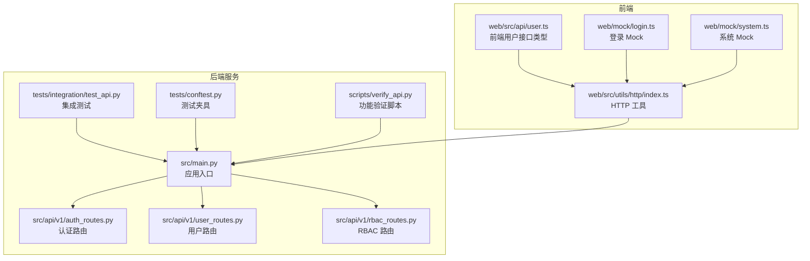
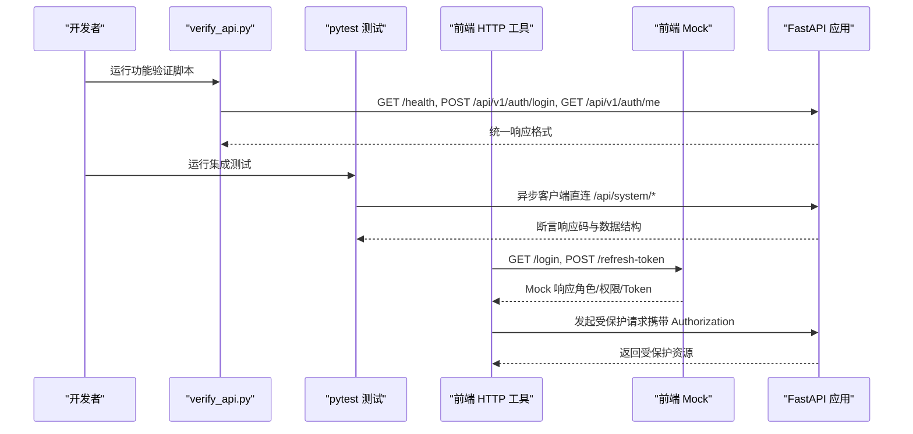
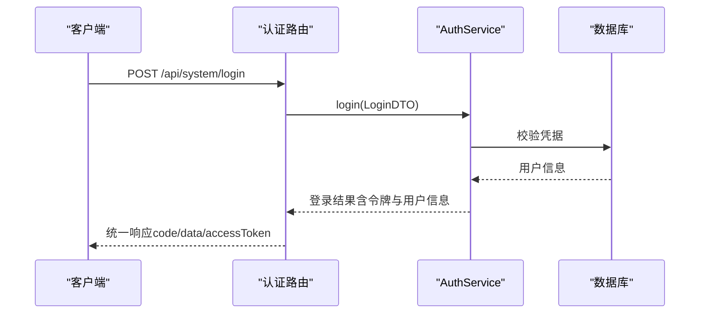
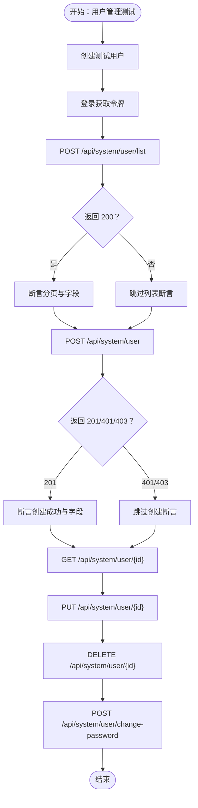
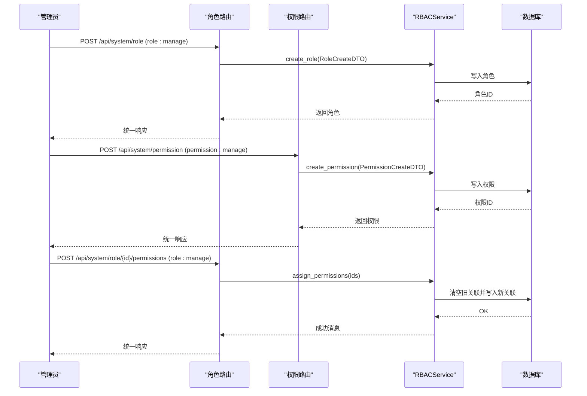
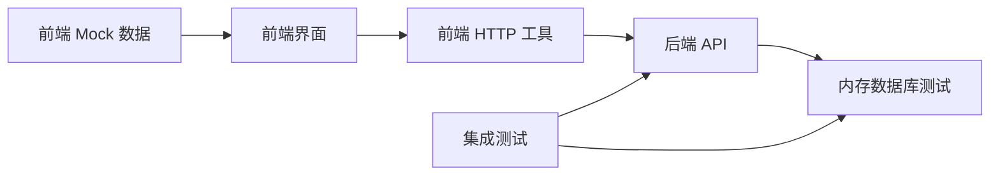
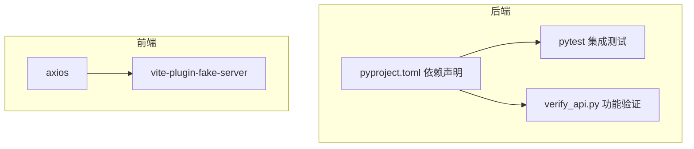

# API 接口测试

<cite>
**本文引用的文件**
- [verify_api.py](file://service/scripts/verify_api.py)
- [test_api.py](file://service/tests/integration/test_api.py)
- [conftest.py](file://service/tests/conftest.py)
- [auth_routes.py](file://service/src/api/v1/auth_routes.py)
- [user_routes.py](file://service/src/api/v1/user_routes.py)
- [rbac_routes.py](file://service/src/api/v1/rbac_routes.py)
- [login.ts](file://web/mock/login.ts)
- [user.ts](file://web/src/api/user.ts)
- [index.ts](file://web/src/utils/http/index.ts)
- [system.ts](file://web/mock/system.ts)
- [pyproject.toml](file://service/pyproject.toml)
- [README.md](file://service/README.md)
</cite>

## 目录
1. [简介](#简介)
2. [项目结构](#项目结构)
3. [核心组件](#核心组件)
4. [架构总览](#架构总览)
5. [详细组件分析](#详细组件分析)
6. [依赖分析](#依赖分析)
7. [性能考虑](#性能考虑)
8. [故障排查指南](#故障排查指南)
9. [结论](#结论)
10. [附录](#附录)

## 简介
本文件面向开发者与测试工程师，系统性地阐述 Hello-FastApi 项目的 API 接口测试方案。内容覆盖：
- 如何使用 verify_api.py 脚本进行端到端功能验证
- RESTful API 的测试方法与 HTTP 请求模拟策略
- 前端 Mock 数据与后端 API 的集成测试联动
- 认证、用户管理、权限管理等全部端点的测试要点
- 请求参数校验、响应格式一致性、错误处理测试
- Postman/curl 手动测试实践
- 性能与并发测试建议
- 完整的测试流程与最佳实践

## 项目结构
后端采用 FastAPI + DDD + RBAC 架构，API 层位于 src/api/v1 下，按功能划分为认证、用户、RBAC 三类路由；测试位于 service/tests；前端 Mock 数据位于 web/mock。

**图表来源**
- [auth_routes.py:1-86](file://service/src/api/v1/auth_routes.py#L1-L86)
- [user_routes.py:1-252](file://service/src/api/v1/user_routes.py#L1-L252)
- [rbac_routes.py:1-257](file://service/src/api/v1/rbac_routes.py#L1-L257)
- [test_api.py:1-393](file://service/tests/integration/test_api.py#L1-L393)
- [conftest.py:1-105](file://service/tests/conftest.py#L1-L105)
- [verify_api.py:1-176](file://service/scripts/verify_api.py#L1-L176)
- [index.ts:1-197](file://web/src/utils/http/index.ts#L1-L197)
- [user.ts:1-94](file://web/src/api/user.ts#L1-L94)
- [login.ts:1-45](file://web/mock/login.ts#L1-L45)
- [system.ts:1-800](file://web/mock/system.ts#L1-L800)

**章节来源**
- [README.md:27-93](file://service/README.md#L27-L93)

## 核心组件
- 功能验证脚本 verify_api.py：对健康检查、登录、受保护端点、用户资料更新、RBAC 查询、未认证访问等进行顺序验证，适合快速冒烟测试。
- 集成测试 test_api.py：使用 pytest + httpx AsyncClient，覆盖认证、用户管理、RBAC 等端点，断言统一响应格式与权限控制。
- 测试夹具 conftest.py：提供内存数据库、ASGI 客户端、依赖注入覆盖、认证头等，确保测试隔离与可重复性。
- 前端 HTTP 工具与 Mock：web/src/utils/http/index.ts 提供请求拦截、Token 刷新与统一响应处理；web/mock/* 提供前后端联调的 Mock 数据。

**章节来源**
- [verify_api.py:1-176](file://service/scripts/verify_api.py#L1-L176)
- [test_api.py:1-393](file://service/tests/integration/test_api.py#L1-L393)
- [conftest.py:1-105](file://service/tests/conftest.py#L1-L105)
- [index.ts:1-197](file://web/src/utils/http/index.ts#L1-L197)
- [login.ts:1-45](file://web/mock/login.ts#L1-L45)
- [system.ts:1-800](file://web/mock/system.ts#L1-L800)

## 架构总览
后端通过 API 路由暴露认证、用户、RBAC 等接口；前端通过 HTTP 工具发起请求，支持 Mock 模式与真实后端；测试通过 pytest 异步客户端直连应用，绕过网络层，提升稳定性与速度。

**图表来源**
- [verify_api.py:137-176](file://service/scripts/verify_api.py#L137-L176)
- [test_api.py:12-393](file://service/tests/integration/test_api.py#L12-L393)
- [index.ts:62-122](file://web/src/utils/http/index.ts#L62-L122)
- [login.ts:4-44](file://web/mock/login.ts#L4-L44)

## 详细组件分析

### 认证接口测试
- 路由与端点
  - 登录：POST /api/v1/auth/login（旧版），或 /api/system/login（集成测试使用的新路径）
  - 注册：POST /api/v1/auth/register（旧版），或 /api/system/register
  - 刷新：POST /api/v1/auth/refresh（旧版），或 /api/system/refresh
  - 登出：POST /api/v1/auth/logout（旧版），或 /api/system/logout
  - 当前用户：GET /api/v1/auth/me（旧版），或 /api/system/user/info
- 测试要点
  - 成功登录：断言返回统一响应格式，包含 accessToken、refreshToken、expires 等字段
  - 错误密码：断言 401 且返回统一错误结构
  - 未认证访问受保护端点：断言 401/403
  - 登出：断言成功消息
  - 刷新：断言返回新的 accessToken/refreshToken
- 前端联动
  - 前端 Mock 登录返回角色与权限数组，便于前端侧权限渲染与按钮级权限控制
  - 前端 HTTP 工具在请求拦截中自动注入 Authorization，过期时触发刷新逻辑

**图表来源**
- [auth_routes.py:19-34](file://service/src/api/v1/auth_routes.py#L19-L34)
- [test_api.py:28-58](file://service/tests/integration/test_api.py#L28-L58)
- [login.ts:8-25](file://web/mock/login.ts#L8-L25)

**章节来源**
- [auth_routes.py:1-86](file://service/src/api/v1/auth_routes.py#L1-L86)
- [test_api.py:25-195](file://service/tests/integration/test_api.py#L25-L195)
- [login.ts:1-45](file://web/mock/login.ts#L1-L45)
- [user.ts:1-94](file://web/src/api/user.ts#L1-L94)
- [index.ts:62-122](file://web/src/utils/http/index.ts#L62-L122)

### 用户管理接口测试
- 路由与端点
  - 用户列表：POST /api/system/user/list（需 user:view 权限）
  - 创建用户：POST /api/system/user（需 user:add 权限）
  - 获取详情：GET /api/system/user/{id}（需 user:view 权限）
  - 更新用户：PUT /api/system/user/{id}（需 user:edit 权限）
  - 删除用户：DELETE /api/system/user/{id}（需 user:delete 权限）
  - 批量删除：POST /api/system/user/batch-delete（需 user:delete 权限）
  - 重置密码：PUT /api/system/user/{id}/reset-password（需 user:edit 权限）
  - 更新状态：PUT /api/system/user/{id}/status（需 user:edit 权限）
  - 修改密码：POST /api/system/user/change-password（仅当前用户）
  - 当前用户信息：GET /api/system/user/info
- 测试要点
  - 权限控制：无权限或用户不存在时断言 200/401/403（视实现而定）
  - 统一响应：断言 code/data 结构
  - 参数校验：非法参数断言错误码与错误信息
  - 分页：列表接口断言分页字段存在与合理范围

**图表来源**
- [user_routes.py:27-252](file://service/src/api/v1/user_routes.py#L27-L252)
- [test_api.py:197-393](file://service/tests/integration/test_api.py#L197-L393)

**章节来源**
- [user_routes.py:1-252](file://service/src/api/v1/user_routes.py#L1-L252)
- [test_api.py:197-393](file://service/tests/integration/test_api.py#L197-L393)

### 权限管理接口测试
- 路由与端点
  - 角色列表：GET /api/system/role/list（需 role:view）
  - 创建角色：POST /api/system/role（需 role:manage）
  - 获取角色详情：GET /api/system/role/{id}（需 role:view）
  - 更新角色：PUT /api/system/role/{id}（需 role:manage）
  - 删除角色：DELETE /api/system/role/{id}（需 role:manage）
  - 分配权限：POST /api/system/role/{id}/permissions（需 role:manage）
  - 权限列表：GET /api/system/permission/list（需 permission:view）
  - 创建权限：POST /api/system/permission（需 permission:manage）
  - 删除权限：DELETE /api/system/permission/{id}（需 permission:manage）
- 测试要点
  - 权限注解：断言需要的 codename（如 role:manage、permission:view）生效
  - 分页查询：断言 pageNum/pageSize/total/rows
  - 权限分配：断言分配成功且角色详情包含最新权限集合

**图表来源**
- [rbac_routes.py:33-177](file://service/src/api/v1/rbac_routes.py#L33-L177)
- [rbac_routes.py:186-257](file://service/src/api/v1/rbac_routes.py#L186-L257)

**章节来源**
- [rbac_routes.py:1-257](file://service/src/api/v1/rbac_routes.py#L1-L257)
- [test_api.py:197-393](file://service/tests/integration/test_api.py#L197-L393)

### 前端 Mock 数据与后端集成测试
- 前端 Mock
  - 登录 Mock：根据用户名返回不同角色与权限，便于前端按钮级权限渲染
  - 系统 Mock：提供用户/角色/菜单/权限等列表，支持筛选与分页
- 后端集成测试
  - 使用 pytest + httpx AsyncClient 直连应用，绕过网络层
  - 通过 conftest.py 提供内存数据库、依赖注入覆盖、认证头等
  - 前后端联调时，可先用 Mock 验证前端交互，再切换到真实后端验证数据一致性

**图表来源**
- [login.ts:4-44](file://web/mock/login.ts#L4-L44)
- [system.ts:6-62](file://web/mock/system.ts#L6-L62)
- [index.ts:62-122](file://web/src/utils/http/index.ts#L62-L122)
- [conftest.py:30-62](file://service/tests/conftest.py#L30-L62)

**章节来源**
- [login.ts:1-45](file://web/mock/login.ts#L1-L45)
- [system.ts:1-800](file://web/mock/system.ts#L1-L800)
- [index.ts:1-197](file://web/src/utils/http/index.ts#L1-L197)
- [conftest.py:1-105](file://service/tests/conftest.py#L1-L105)

## 依赖分析
- 后端依赖
  - FastAPI、SQLModel、asyncpg/aiosqlite、httpx、pytest、pytest-asyncio、ruff、mypy 等
- 前端依赖
  - axios、vite-plugin-fake-server、@faker-js/faker 等
- 关键耦合点
  - 前端 HTTP 工具与后端统一响应格式强耦合（code/data/message）
  - 测试夹具通过依赖注入覆盖数据库连接，保证测试隔离

**图表来源**
- [pyproject.toml:1-76](file://service/pyproject.toml#L1-L76)
- [test_api.py:1-393](file://service/tests/integration/test_api.py#L1-L393)
- [verify_api.py:1-176](file://service/scripts/verify_api.py#L1-L176)
- [index.ts:1-197](file://web/src/utils/http/index.ts#L1-L197)
- [login.ts:1-45](file://web/mock/login.ts#L1-L45)

**章节来源**
- [pyproject.toml:1-76](file://service/pyproject.toml#L1-L76)
- [test_api.py:1-393](file://service/tests/integration/test_api.py#L1-L393)
- [verify_api.py:1-176](file://service/scripts/verify_api.py#L1-L176)

## 性能考虑
- 并发测试
  - 使用 pytest-asyncio 的异步客户端并发请求，结合内存数据库减少 IO 延迟
  - 对高并发场景建议使用独立压测工具（如 Locust、Artillery）模拟真实流量
- 响应格式与序列化
  - 统一响应格式（code/data/message）有利于前端缓存与错误处理，但需注意序列化开销
- 数据库与缓存
  - 测试阶段使用内存数据库；生产环境建议使用 PostgreSQL + Redis 缓存热点数据
- 超时与重试
  - 前端 HTTP 工具默认超时 10 秒，可根据接口复杂度调整；避免在测试中过度依赖重试

[本节为通用指导，不涉及具体文件分析]

## 故障排查指南
- 健康检查失败
  - 确认服务已启动且监听端口可用；verify_api.py 会在健康检查失败时提前退出
- 登录失败或 401
  - 检查用户名/密码是否正确；确认数据库中是否存在该用户
  - 集成测试中可通过创建用户并登录获取令牌的方式复现
- 权限不足导致 403/401
  - 确认当前用户具备所需权限（如 user:add、role:manage 等）
  - 在集成测试中使用 require_permission 装饰器验证权限注解
- 未认证访问受保护端点
  - verify_api.py 中包含专门测试，断言返回 401/403
- 前端 Mock 与真实后端差异
  - 使用前端 Mock 验证 UI 行为，再切换到真实后端验证数据一致性
  - 若出现字段不一致，检查后端 DTO 与前端类型定义

**章节来源**
- [verify_api.py:8-176](file://service/scripts/verify_api.py#L8-L176)
- [test_api.py:12-393](file://service/tests/integration/test_api.py#L12-L393)
- [index.ts:62-122](file://web/src/utils/http/index.ts#L62-L122)

## 结论
本测试体系通过功能验证脚本、集成测试与前端 Mock 的协同，实现了从端到端的功能验证、权限控制验证与前后端联调验证。建议在持续集成中运行 pytest 集成测试，在本地开发中使用 verify_api.py 快速验证，配合前端 Mock 快速迭代 UI 与交互。

[本节为总结，不涉及具体文件分析]

## 附录

### API 测试清单（按端点）
- 健康检查：GET /health
- 认证
  - 登录：POST /api/system/login
  - 注册：POST /api/system/register
  - 刷新：POST /api/system/refresh
  - 登出：POST /api/system/logout
  - 当前用户：GET /api/system/user/info
- 用户管理
  - 列表：POST /api/system/user/list
  - 创建：POST /api/system/user
  - 详情：GET /api/system/user/{id}
  - 更新：PUT /api/system/user/{id}
  - 删除：DELETE /api/system/user/{id}
  - 批量删除：POST /api/system/user/batch-delete
  - 重置密码：PUT /api/system/user/{id}/reset-password
  - 更新状态：PUT /api/system/user/{id}/status
  - 修改密码：POST /api/system/user/change-password
- RBAC
  - 角色列表：GET /api/system/role/list
  - 创建角色：POST /api/system/role
  - 角色详情：GET /api/system/role/{id}
  - 更新角色：PUT /api/system/role/{id}
  - 删除角色：DELETE /api/system/role/{id}
  - 分配权限：POST /api/system/role/{id}/permissions
  - 权限列表：GET /api/system/permission/list
  - 创建权限：POST /api/system/permission
  - 删除权限：DELETE /api/system/permission/{id}

**章节来源**
- [auth_routes.py:1-86](file://service/src/api/v1/auth_routes.py#L1-L86)
- [user_routes.py:1-252](file://service/src/api/v1/user_routes.py#L1-L252)
- [rbac_routes.py:1-257](file://service/src/api/v1/rbac_routes.py#L1-L257)
- [test_api.py:12-393](file://service/tests/integration/test_api.py#L12-L393)

### Postman/curl 手动测试示例
- 健康检查
  - curl -i http://localhost:8000/health
- 登录
  - curl -i -X POST http://localhost:8000/api/system/login -H "Content-Type: application/json" -d '{"username":"testuser","password":"TestPass123"}'
- 获取当前用户
  - curl -i -X GET http://localhost:8000/api/system/user/info -H "Authorization: Bearer YOUR_ACCESS_TOKEN"
- 用户列表（需要权限）
  - curl -i -X POST http://localhost:8000/api/system/user/list -H "Authorization: Bearer YOUR_ACCESS_TOKEN" -H "Content-Type: application/json" -d '{"pageNum":1,"pageSize":10}'
- 刷新令牌
  - curl -i -X POST http://localhost:8000/api/system/refresh -H "Content-Type: application/json" -d '{"refreshToken":"YOUR_REFRESH_TOKEN"}'

[本节为操作指引，不涉及具体文件分析]