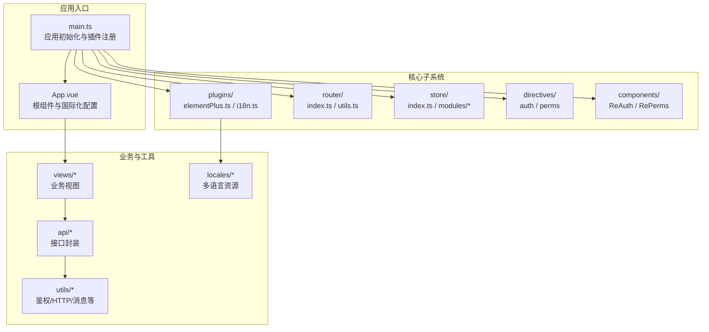
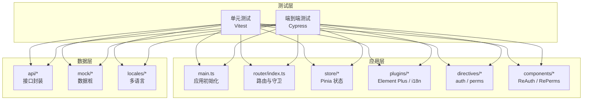
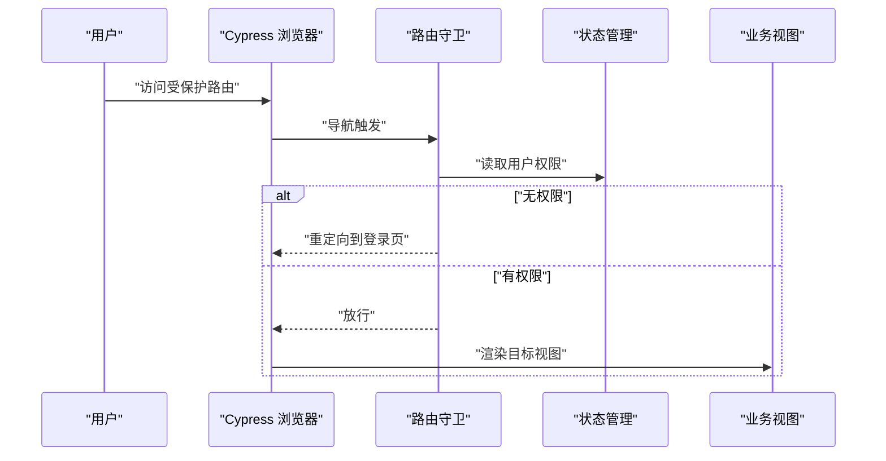
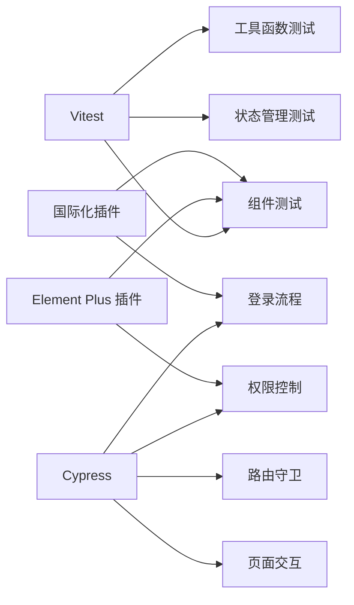

# 前端测试

<cite>
**本文引用的文件**
- [package.json](file://web/package.json)
- [vite.config.ts](file://web/vite.config.ts)
- [main.ts](file://web/src/main.ts)
- [App.vue](file://web/src/App.vue)
- [elementPlus.ts](file://web/src/plugins/elementPlus.ts)
- [i18n.ts](file://web/src/plugins/i18n.ts)
- [router/index.ts](file://web/src/router/index.ts)
- [router/utils.ts](file://web/src/router/utils.ts)
- [store/index.ts](file://web/src/store/index.ts)
- [store/modules/user.ts](file://web/src/store/modules/user.ts)
- [store/modules/permission.ts](file://web/src/store/modules/permission.ts)
- [directives/auth/index.ts](file://web/src/directives/auth/index.ts)
- [directives/perms/index.ts](file://web/src/directives/perms/index.ts)
- [components/ReAuth/src/auth.tsx](file://web/src/components/ReAuth/src/auth.tsx)
- [components/RePerms/src/perms.tsx](file://web/src/components/RePerms/src/perms.tsx)
- [views/system/user/index.vue](file://web/src/views/system/user/index.vue)
- [views/login/index.vue](file://web/src/views/login/index.vue)
- [mock/login.ts](file://web/mock/login.ts)
- [mock/routes.ts](file://web/mock/routes.ts)
- [mock/system.ts](file://web/mock/system.ts)
- [api/user.ts](file://web/src/api/user.ts)
- [api/routes.ts](file://web/src/api/routes.ts)
- [utils/auth.ts](file://web/src/utils/auth.ts)
- [utils/http/index.ts](file://web/src/utils/http/index.ts)
- [utils/message.ts](file://web/src/utils/message.ts)
- [locales/en.yaml](file://web/locales/en.yaml)
- [locales/zh-CN.yaml](file://web/locales/zh-CN.yaml)
</cite>

## 目录
1. [引言](#引言)
2. [项目结构](#项目结构)
3. [核心组件](#核心组件)
4. [架构总览](#架构总览)
5. [详细组件分析](#详细组件分析)
6. [依赖分析](#依赖分析)
7. [性能考虑](#性能考虑)
8. [故障排查指南](#故障排查指南)
9. [结论](#结论)
10. [附录](#附录)

## 引言
本文件面向前端开发者，系统化梳理 Hello-FastApi 项目的前端测试策略与实施路径，重点覆盖以下方面：
- 测试框架选择：基于现有工程生态，明确单元测试采用 Vitest、端到端测试采用 Cypress 的方案。
- 测试类型与范围：组件测试、单元测试、端到端测试的分层实践；涵盖 Element Plus 组件与自定义组件的测试方法。
- 关键功能测试：路由守卫、权限控制（按钮级/页面级）、状态管理（Pinia）等。
- 实施步骤与示例：提供可直接参考的测试文件组织方式、断言与模拟策略、覆盖率配置与报告生成。

## 项目结构
前端位于 web 目录，采用 Vue 3 + TypeScript + Vite 技术栈，结合 Element Plus、Pinia、Vue Router 等生态组件。测试相关的关键位置如下：
- 单元测试：建议放置于各模块同级目录的 __tests__ 或 .spec.ts 文件中，或集中于 tests/unit 目录（如存在）。
- 端到端测试：建议新建 cypress/e2e 目录，配合 cypress/fixtures、cypress/support 等标准结构。
- Mock 数据：mock 目录已存在，可作为 API 模拟与数据桩的基础。
- 插件与全局配置：plugins、directives、store、router 等为测试关注点。

图表来源
- [main.ts:1-72](file://web/src/main.ts#L1-L72)
- [App.vue:1-91](file://web/src/App.vue#L1-L91)

章节来源
- [main.ts:1-72](file://web/src/main.ts#L1-L72)
- [vite.config.ts:1-67](file://web/vite.config.ts#L1-L67)

## 核心组件
- 应用入口与插件
  - 应用通过 main.ts 完成插件注册（Element Plus、i18n、图表、表格等），并在 App.vue 中统一注入国际化配置与全局对话框/抽屉容器。
  - 插件与国际化配置对组件测试与端测均有影响，需在测试环境中进行等效初始化。
- 路由与权限
  - 路由在 router/index.ts 中集中管理，权限逻辑在 permission store 与指令/组件中体现。
- 状态管理
  - Pinia store 提供用户信息、权限、设置等状态，测试中应通过替换或注入的方式进行隔离。
- 指令与组件
  - auth/perms 指令与 ReAuth/RePerms 组件用于按钮级与页面级权限控制，是测试中的关键断言对象。

章节来源
- [main.ts:1-72](file://web/src/main.ts#L1-L72)
- [App.vue:1-91](file://web/src/App.vue#L1-L91)
- [store/index.ts](file://web/src/store/index.ts)
- [store/modules/permission.ts](file://web/src/store/modules/permission.ts)
- [store/modules/user.ts](file://web/src/store/modules/user.ts)
- [directives/auth/index.ts](file://web/src/directives/auth/index.ts)
- [directives/perms/index.ts](file://web/src/directives/perms/index.ts)
- [components/ReAuth/src/auth.tsx](file://web/src/components/ReAuth/src/auth.tsx)
- [components/RePerms/src/perms.tsx](file://web/src/components/RePerms/src/perms.tsx)

## 架构总览
下图展示从测试视角看的前端测试架构：单元测试聚焦模块与组件，端到端测试覆盖真实浏览器交互与路由/权限链路。

图表来源
- [main.ts:1-72](file://web/src/main.ts#L1-L72)
- [router/index.ts](file://web/src/router/index.ts)
- [store/index.ts](file://web/src/store/index.ts)
- [plugins/elementPlus.ts](file://web/src/plugins/elementPlus.ts)
- [plugins/i18n.ts](file://web/src/plugins/i18n.ts)
- [directives/auth/index.ts](file://web/src/directives/auth/index.ts)
- [directives/perms/index.ts](file://web/src/directives/perms/index.ts)
- [components/ReAuth/src/auth.tsx](file://web/src/components/ReAuth/src/auth.tsx)
- [components/RePerms/src/perms.tsx](file://web/src/components/RePerms/src/perms.tsx)
- [api/user.ts](file://web/src/api/user.ts)
- [mock/login.ts](file://web/mock/login.ts)
- [locales/en.yaml](file://web/locales/en.yaml)
- [locales/zh-CN.yaml](file://web/locales/zh-CN.yaml)

## 详细组件分析

### 测试框架与工具链
- 单元测试：推荐使用 Vitest，具备与 Jest 类似的 API 且与 Vite 高度兼容，适合快速运行与高反馈速度。
- 端到端测试：推荐使用 Cypress，支持真实浏览器交互、路由导航、权限拦截等复杂场景。
- 覆盖率与报告：可通过 Vitest 的 coverage 配置生成覆盖率报告；Cypress 可集成 HTML 报告器或 CI 平台报告。

章节来源
- [package.json:115-176](file://web/package.json#L115-L176)

### 组件测试（含 Element Plus 与自定义组件）
- Element Plus 组件测试要点
  - 在测试环境中完成 Element Plus 插件初始化，确保组件渲染与交互正常。
  - 对国际化、主题等全局配置进行等效注入，避免样式或文案差异导致断言失败。
- 自定义组件测试要点
  - ReAuth/RePerms：通过 props 注入权限标识，断言 DOM 是否渲染或隐藏。
  - ReDialog/ReDrawer：断言打开/关闭行为与内容渲染。
- 断言与渲染
  - 使用查询器（如 getByRole/getByText）定位元素，验证可见性、属性与事件触发后的状态变化。

章节来源
- [main.ts:1-72](file://web/src/main.ts#L1-L72)
- [App.vue:1-91](file://web/src/App.vue#L1-L91)
- [components/ReAuth/src/auth.tsx](file://web/src/components/ReAuth/src/auth.tsx)
- [components/RePerms/src/perms.tsx](file://web/src/components/RePerms/src/perms.tsx)

### 单元测试（模块与工具函数）
- 接口与工具函数
  - 对 utils/http、utils/auth、utils/message 等进行纯函数与副作用隔离的测试。
  - 使用 Mock Adapter 或拦截器模拟网络请求，断言请求参数、响应格式与错误处理。
- 状态管理
  - 对 store/modules/user、store/modules/permission 的 getter、action、mutation 进行独立测试，避免依赖真实路由与后端。
- 权限与指令
  - 对 auth/perms 指令与 ReAuth/RePerms 组件进行行为断言，覆盖有无权限两种分支。

章节来源
- [utils/http/index.ts](file://web/src/utils/http/index.ts)
- [utils/auth.ts](file://web/src/utils/auth.ts)
- [utils/message.ts](file://web/src/utils/message.ts)
- [store/modules/user.ts](file://web/src/store/modules/user.ts)
- [store/modules/permission.ts](file://web/src/store/modules/permission.ts)
- [directives/auth/index.ts](file://web/src/directives/auth/index.ts)
- [directives/perms/index.ts](file://web/src/directives/perms/index.ts)

### 端到端测试（路由、权限与登录）
- 登录流程
  - 访问登录页，输入账号密码，提交表单，断言跳转与用户状态更新。
  - 可结合 mock/login.ts 提供的登录数据桩，保证测试稳定性。
- 路由守卫与权限
  - 未登录访问受保护路由：断言重定向至登录页。
  - 登录后访问受限页面：根据权限判断是否允许进入或显示 403。
- 国际化与主题
  - 切换语言与主题，断言文案与样式变更。
- 页面与组件
  - 打开系统管理-用户列表，断言表格渲染、分页、搜索、新增/编辑/删除等交互。

图表来源
- [router/index.ts](file://web/src/router/index.ts)
- [store/modules/permission.ts](file://web/src/store/modules/permission.ts)
- [views/system/user/index.vue](file://web/src/views/system/user/index.vue)

章节来源
- [router/index.ts](file://web/src/router/index.ts)
- [router/utils.ts](file://web/src/router/utils.ts)
- [store/modules/permission.ts](file://web/src/store/modules/permission.ts)
- [views/system/user/index.vue](file://web/src/views/system/user/index.vue)
- [views/login/index.vue](file://web/src/views/login/index.vue)
- [mock/login.ts](file://web/mock/login.ts)

### Element Plus 组件测试方法
- 初始化
  - 在测试入口完成 Element Plus 插件注册与国际化配置，确保组件样式与文案一致。
- 常见场景
  - 表单校验：输入非法值，断言错误提示出现。
  - 日期/时间选择：选择日期，断言值绑定与格式化。
  - 分页/表格：点击页码，断言数据刷新与当前页高亮。
- 事件与回调
  - 触发下拉/弹窗等交互，断言回调执行与 DOM 更新。

章节来源
- [main.ts:1-72](file://web/src/main.ts#L1-L72)
- [plugins/elementPlus.ts](file://web/src/plugins/elementPlus.ts)
- [plugins/i18n.ts](file://web/src/plugins/i18n.ts)
- [locales/en.yaml](file://web/locales/en.yaml)
- [locales/zh-CN.yaml](file://web/locales/zh-CN.yaml)

### 自定义组件测试方法
- ReAuth/RePerms
  - 传入权限标识，断言元素是否渲染或禁用。
- ReDialog/ReDrawer
  - 触发打开/关闭事件，断言显示/隐藏与内容渲染。
- 指令
  - 在测试中手动调用指令钩子，断言 DOM 属性与行为。

章节来源
- [components/ReAuth/src/auth.tsx](file://web/src/components/ReAuth/src/auth.tsx)
- [components/RePerms/src/perms.tsx](file://web/src/components/RePerms/src/perms.tsx)
- [directives/auth/index.ts](file://web/src/directives/auth/index.ts)
- [directives/perms/index.ts](file://web/src/directives/perms/index.ts)

### API 调用测试
- 单元测试
  - 使用拦截器或 Mock Adapter 模拟 axios 请求，断言请求头、参数与响应处理。
- 端到端测试
  - 在真实浏览器中调用 api/* 封装的方法，断言网络请求与 UI 反馈。

章节来源
- [api/user.ts](file://web/src/api/user.ts)
- [api/routes.ts](file://web/src/api/routes.ts)
- [utils/http/index.ts](file://web/src/utils/http/index.ts)

### 路由守卫与权限控制测试
- 登录态与权限
  - 通过 store 注入用户信息与权限列表，断言路由守卫放行与页面渲染。
- 指令与组件
  - 验证 auth/perms 指令与 ReAuth/RePerms 组件在不同权限下的表现。

章节来源
- [router/index.ts](file://web/src/router/index.ts)
- [store/modules/user.ts](file://web/src/store/modules/user.ts)
- [store/modules/permission.ts](file://web/src/store/modules/permission.ts)
- [directives/auth/index.ts](file://web/src/directives/auth/index.ts)
- [directives/perms/index.ts](file://web/src/directives/perms/index.ts)

### 状态管理测试
- 用户信息与权限
  - 设置/清除用户信息，断言路由守卫与界面元素变化。
- 多标签与设置
  - 切换主题、语言等设置，断言全局配置生效。

章节来源
- [store/index.ts](file://web/src/store/index.ts)
- [store/modules/user.ts](file://web/src/store/modules/user.ts)
- [store/modules/permission.ts](file://web/src/store/modules/permission.ts)

## 依赖分析
- 测试相关依赖
  - Vitest：用于单元测试，具备快照、覆盖率与并发能力。
  - Cypress：用于端到端测试，支持真实浏览器与路由/权限场景。
  - Mock：mock/* 已存在，可直接复用为测试数据桩。
- 插件与国际化
  - Element Plus 与 i18n 在测试中需正确初始化，避免组件渲染异常或文案不一致。
- 路由与状态
  - 路由守卫与权限依赖 store 状态，测试中应隔离外部依赖，确保可重复性。

图表来源
- [package.json:115-176](file://web/package.json#L115-L176)
- [main.ts:1-72](file://web/src/main.ts#L1-L72)
- [plugins/elementPlus.ts](file://web/src/plugins/elementPlus.ts)
- [plugins/i18n.ts](file://web/src/plugins/i18n.ts)

章节来源
- [package.json:115-176](file://web/package.json#L115-L176)
- [main.ts:1-72](file://web/src/main.ts#L1-L72)

## 性能考虑
- 单元测试
  - 使用 Vitest 的并发与快照能力，减少测试时间；对昂贵操作进行缓存或懒加载。
- 端到端测试
  - 合理拆分用例，避免不必要的页面加载；使用固定宽高与稳定数据源。
- 覆盖率
  - 优先保证关键路径与边界条件的覆盖率，避免过度追求 100% 而牺牲可维护性。

## 故障排查指南
- 组件渲染异常
  - 确认 Element Plus 插件与国际化已在测试入口初始化。
- 权限判定错误
  - 检查 store 中用户权限是否正确注入，指令与组件的权限标识是否匹配。
- 登录失败或跳转异常
  - 核对 mock 数据与登录接口返回格式，确认路由守卫逻辑与 store 状态同步。
- 国际化文案不一致
  - 检查 locales 资源与 i18n 插件初始化，确保测试环境语言设置正确。

章节来源
- [main.ts:1-72](file://web/src/main.ts#L1-L72)
- [plugins/elementPlus.ts](file://web/src/plugins/elementPlus.ts)
- [plugins/i18n.ts](file://web/src/plugins/i18n.ts)
- [locales/en.yaml](file://web/locales/en.yaml)
- [locales/zh-CN.yaml](file://web/locales/zh-CN.yaml)
- [store/modules/user.ts](file://web/src/store/modules/user.ts)
- [store/modules/permission.ts](file://web/src/store/modules/permission.ts)
- [router/index.ts](file://web/src/router/index.ts)
- [mock/login.ts](file://web/mock/login.ts)

## 结论
通过 Vitest 与 Cypress 的组合，结合现有 mock、插件与状态管理机制，可以构建覆盖全面、可维护的前端测试体系。建议从组件与工具函数开始，逐步扩展到路由与权限的端到端测试，并持续优化覆盖率与报告质量。

## 附录
- 测试脚本与命令
  - 单元测试：使用 Vitest 运行，建议在 package.json 中添加测试脚本。
  - 端到端测试：使用 Cypress 运行，建议在 package.json 中添加测试脚本。
- 覆盖率与报告
  - Vitest：启用 coverage 配置，生成 HTML 报告。
  - Cypress：集成 HTML 报告器或 CI 平台报告器，输出测试结果。

章节来源
- [package.json:6-22](file://web/package.json#L6-L22)
- [vite.config.ts:1-67](file://web/vite.config.ts#L1-L67)