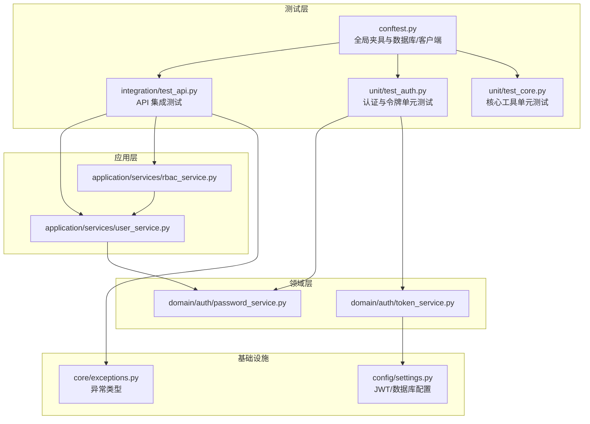
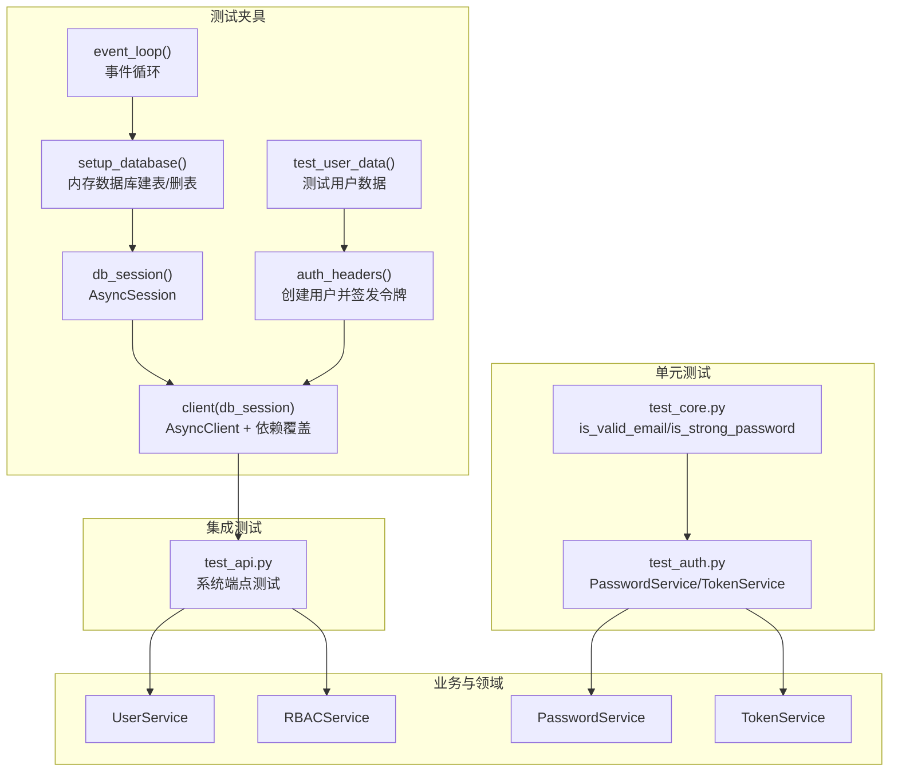
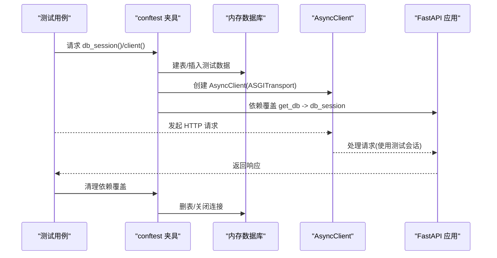
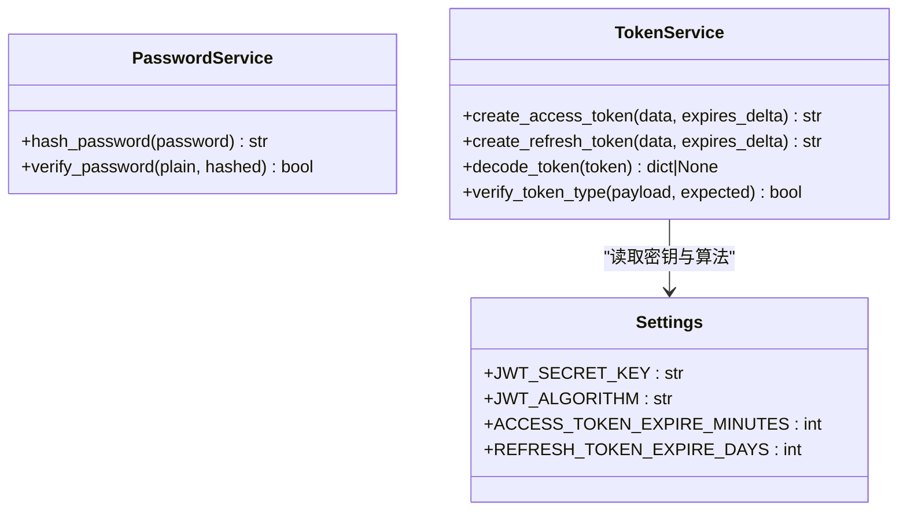
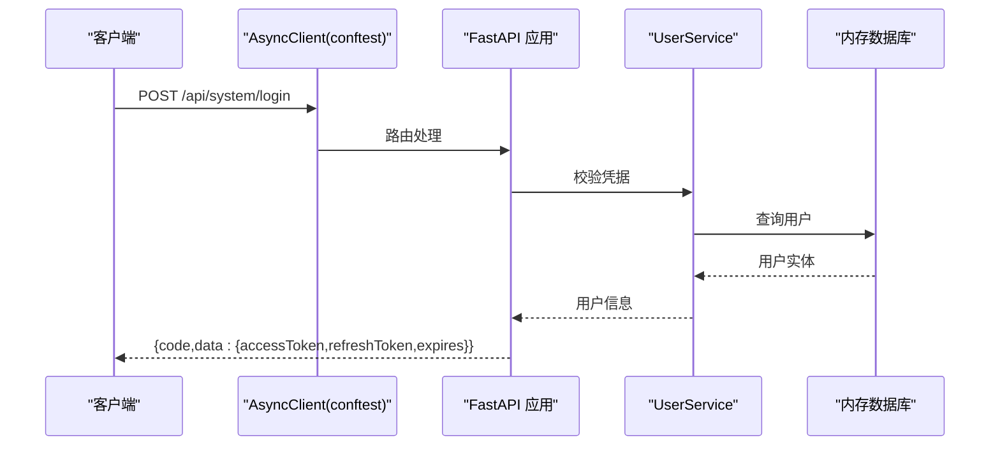
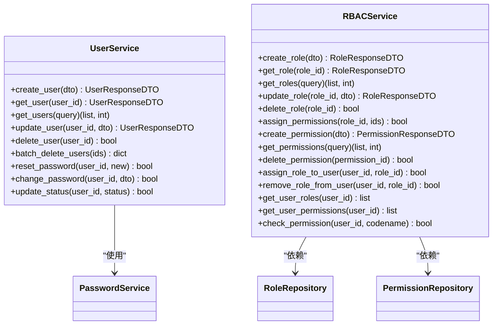
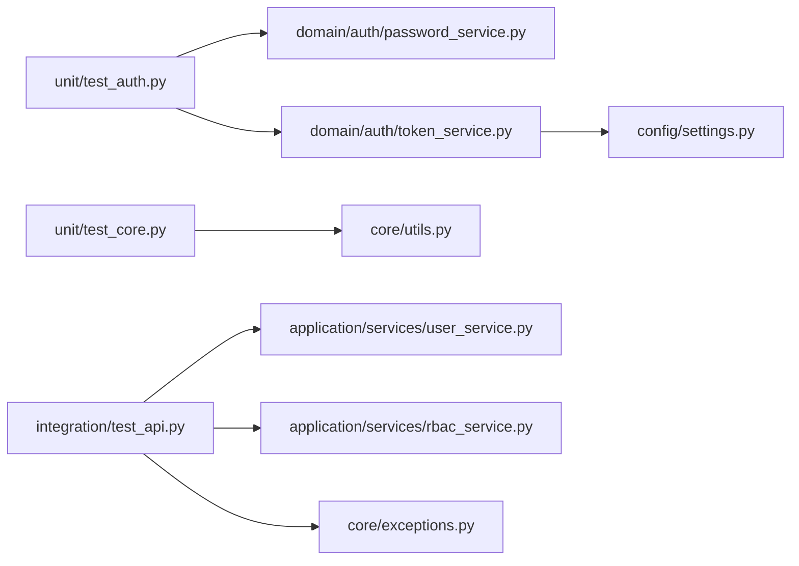

# 单元测试

<cite>
**本文引用的文件**
- [service/tests/conftest.py](file://service/tests/conftest.py)
- [service/pyproject.toml](file://service/pyproject.toml)
- [service/tests/unit/test_auth.py](file://service/tests/unit/test_auth.py)
- [service/tests/unit/test_core.py](file://service/tests/unit/test_core.py)
- [service/tests/integration/test_api.py](file://service/tests/integration/test_api.py)
- [service/src/domain/auth/password_service.py](file://service/src/domain/auth/password_service.py)
- [service/src/domain/auth/token_service.py](file://service/src/domain/auth/token_service.py)
- [service/src/core/utils.py](file://service/src/core/utils.py)
- [service/src/application/services/user_service.py](file://service/src/application/services/user_service.py)
- [service/src/application/services/rbac_service.py](file://service/src/application/services/rbac_service.py)
- [service/src/config/settings.py](file://service/src/config/settings.py)
- [service/src/core/exceptions.py](file://service/src/core/exceptions.py)
</cite>

## 目录
1. [简介](#简介)
2. [项目结构](#项目结构)
3. [核心组件](#核心组件)
4. [架构总览](#架构总览)
5. [详细组件分析](#详细组件分析)
6. [依赖分析](#依赖分析)
7. [性能考虑](#性能考虑)
8. [故障排查指南](#故障排查指南)
9. [结论](#结论)
10. [附录](#附录)

## 简介
本文件面向 Hello-FastApi 项目的单元测试与集成测试，系统化讲解 pytest 测试框架的配置与使用、测试夹具（fixture）的设计与复用、测试用例编写规范与最佳实践，并结合认证服务、用户服务、RBAC 服务等核心业务逻辑给出可直接参考的测试思路与断言策略。同时提供测试覆盖率计算与报告生成的配置说明，帮助开发者建立完善的测试体系。

## 项目结构
测试相关文件主要位于 service/tests 目录，采用按“功能域”划分的组织方式：
- tests/conftest.py：全局测试配置与夹具，负责事件循环、内存数据库初始化、HTTP 客户端注入、认证头生成等。
- tests/unit：单元测试，覆盖密码哈希、令牌生成与校验、核心工具函数等纯函数与领域服务。
- tests/integration：集成测试，覆盖 API 端点的统一响应格式、认证流程、用户管理与权限控制等。

**图表来源**
- [service/tests/conftest.py:1-105](file://service/tests/conftest.py#L1-L105)
- [service/tests/unit/test_auth.py:1-68](file://service/tests/unit/test_auth.py#L1-L68)
- [service/tests/unit/test_core.py:1-37](file://service/tests/unit/test_core.py#L1-L37)
- [service/tests/integration/test_api.py:1-393](file://service/tests/integration/test_api.py#L1-L393)
- [service/src/application/services/user_service.py:1-322](file://service/src/application/services/user_service.py#L1-L322)
- [service/src/application/services/rbac_service.py:1-231](file://service/src/application/services/rbac_service.py#L1-L231)
- [service/src/domain/auth/password_service.py:1-21](file://service/src/domain/auth/password_service.py#L1-L21)
- [service/src/domain/auth/token_service.py:1-45](file://service/src/domain/auth/token_service.py#L1-L45)
- [service/src/config/settings.py:1-198](file://service/src/config/settings.py#L1-L198)
- [service/src/core/exceptions.py:1-60](file://service/src/core/exceptions.py#L1-L60)

**章节来源**
- [service/tests/conftest.py:1-105](file://service/tests/conftest.py#L1-L105)
- [service/pyproject.toml:69-76](file://service/pyproject.toml#L69-L76)

## 核心组件
- pytest 配置与标记
  - 测试路径与异步模式：通过 pytest.ini_options 指定 testpaths 与 asyncio_mode。
  - 自定义标记：unit/integration，便于分层执行与过滤。
- conftest 夹具
  - 事件循环：为测试会话提供 asyncio 事件循环。
  - 内存数据库：使用 sqlite+aiosqlite 内存数据库，自动建表与删表。
  - 数据库会话：提供 AsyncSession 注入，支持事务性测试。
  - 异步 HTTP 客户端：基于 ASGITransport 提供 AsyncClient，注入依赖覆盖 get_db。
  - 测试用户数据：提供标准化的用户注册数据。
  - 认证头：自动创建用户并签发访问令牌，生成 Authorization 头。
- 单元测试
  - 密码服务：哈希与校验。
  - 令牌服务：访问/刷新令牌生成、解码、类型校验。
  - 核心工具：邮箱格式与密码强度校验。
- 集成测试
  - 健康检查、登录/注册/登出/刷新、当前用户信息、用户列表/增删改查、修改密码、用户状态变更等。
- 业务服务
  - 用户服务：创建/查询/更新/删除/批量删除/重置密码/修改密码/状态变更等。
  - RBAC 服务：角色与权限的创建、查询、分配、回收、用户角色与权限查询、权限校验等。

**章节来源**
- [service/pyproject.toml:69-76](file://service/pyproject.toml#L69-L76)
- [service/tests/conftest.py:16-105](file://service/tests/conftest.py#L16-L105)
- [service/tests/unit/test_auth.py:1-68](file://service/tests/unit/test_auth.py#L1-L68)
- [service/tests/unit/test_core.py:1-37](file://service/tests/unit/test_core.py#L1-L37)
- [service/tests/integration/test_api.py:1-393](file://service/tests/integration/test_api.py#L1-L393)
- [service/src/application/services/user_service.py:1-322](file://service/src/application/services/user_service.py#L1-L322)
- [service/src/application/services/rbac_service.py:1-231](file://service/src/application/services/rbac_service.py#L1-L231)

## 架构总览
下图展示测试夹具如何贯穿单元与集成测试，以及测试对业务服务与领域服务的调用关系。

**图表来源**
- [service/tests/conftest.py:22-105](file://service/tests/conftest.py#L22-L105)
- [service/tests/unit/test_auth.py:1-68](file://service/tests/unit/test_auth.py#L1-L68)
- [service/tests/unit/test_core.py:1-37](file://service/tests/unit/test_core.py#L1-L37)
- [service/tests/integration/test_api.py:1-393](file://service/tests/integration/test_api.py#L1-L393)
- [service/src/application/services/user_service.py:1-322](file://service/src/application/services/user_service.py#L1-L322)
- [service/src/application/services/rbac_service.py:1-231](file://service/src/application/services/rbac_service.py#L1-L231)
- [service/src/domain/auth/password_service.py:1-21](file://service/src/domain/auth/password_service.py#L1-L21)
- [service/src/domain/auth/token_service.py:1-45](file://service/src/domain/auth/token_service.py#L1-L45)

## 详细组件分析

### pytest 配置与标记
- 配置项
  - testpaths：指定测试目录为 tests。
  - asyncio_mode：启用异步测试模式。
  - markers：定义 unit 与 integration 标记，便于分层执行。
- 作用
  - 统一测试入口与异步行为，提升可维护性与可扩展性。

**章节来源**
- [service/pyproject.toml:69-76](file://service/pyproject.toml#L69-L76)

### conftest.py：测试夹具与环境准备
- 事件循环
  - 为整个测试会话创建并关闭事件循环，确保异步测试稳定运行。
- 内存数据库
  - 使用 sqlite+aiosqlite 内存数据库，测试前后自动建表与删表，保证隔离性与性能。
- 数据库会话
  - 提供 AsyncSession，支持事务性测试与快速回滚。
- 异步 HTTP 客户端
  - 基于 ASGITransport 创建 AsyncClient，注入依赖覆盖 get_db，使应用路由可直接使用测试会话。
- 测试用户数据
  - 提供标准化的用户注册数据，便于快速构造测试场景。
- 认证头
  - 自动创建用户、签发访问令牌，生成 Authorization 请求头，减少重复代码。

**图表来源**
- [service/tests/conftest.py:30-62](file://service/tests/conftest.py#L30-L62)

**章节来源**
- [service/tests/conftest.py:16-105](file://service/tests/conftest.py#L16-L105)

### 单元测试：认证与令牌服务
- 密码服务
  - 断言：哈希后字符串长度大于 0；明文与哈希匹配；错误密码不匹配。
- 令牌服务
  - 断言：访问/刷新令牌为非空字符串；解码有效载荷包含 sub/username/type；无效令牌解码为空；类型校验正确。

**图表来源**
- [service/src/domain/auth/password_service.py:6-21](file://service/src/domain/auth/password_service.py#L6-L21)
- [service/src/domain/auth/token_service.py:11-45](file://service/src/domain/auth/token_service.py#L11-L45)
- [service/src/config/settings.py:63-67](file://service/src/config/settings.py#L63-L67)

**章节来源**
- [service/tests/unit/test_auth.py:1-68](file://service/tests/unit/test_auth.py#L1-L68)
- [service/src/domain/auth/password_service.py:1-21](file://service/src/domain/auth/password_service.py#L1-L21)
- [service/src/domain/auth/token_service.py:1-45](file://service/src/domain/auth/token_service.py#L1-L45)
- [service/src/config/settings.py:1-198](file://service/src/config/settings.py#L1-L198)

### 单元测试：核心工具与验证器
- 邮箱验证
  - 断言：合法邮箱返回真；非法格式返回假。
- 密码强度
  - 断言：满足长度与大小写/数字要求为强密码；否则为弱密码。

**章节来源**
- [service/tests/unit/test_core.py:1-37](file://service/tests/unit/test_core.py#L1-L37)
- [service/src/core/utils.py:12-27](file://service/src/core/utils.py#L12-L27)

### 集成测试：API 端点与统一响应
- 健康检查
  - 断言：状态码 200，响应包含 healthy。
- 认证流程
  - 登录成功：返回 code=200，包含 accessToken/refreshToken/expires。
  - 登录失败：返回 401，包含错误信息。
  - 注册：返回 code=200，data 中包含用户名与昵称。
  - 登出：返回 code=200，包含 message。
  - 刷新令牌：返回新的 accessToken/refreshToken。
  - 当前用户信息：携带令牌访问，返回用户信息；未携带令牌返回 401/403。
- 用户管理
  - 列表：POST /api/system/user/list，返回 code/data（可能受权限影响）。
  - 创建/详情/更新/删除：携带管理员令牌，返回 201 或 200（可能受权限影响）。
  - 修改密码：携带用户令牌，提交旧/新密码，返回 200。
  - 更新状态：携带管理员令牌，返回 200（可能受权限影响）。

**图表来源**
- [service/tests/integration/test_api.py:24-161](file://service/tests/integration/test_api.py#L24-L161)
- [service/src/application/services/user_service.py:25-57](file://service/src/application/services/user_service.py#L25-L57)

**章节来源**
- [service/tests/integration/test_api.py:1-393](file://service/tests/integration/test_api.py#L1-L393)
- [service/src/application/services/user_service.py:1-322](file://service/src/application/services/user_service.py#L1-L322)

### 业务服务：用户服务与 RBAC 服务
- 用户服务
  - 关键方法：创建/查询/列表/更新/删除/批量删除/重置密码/修改密码/状态变更。
  - 断言要点：唯一性约束触发冲突错误；不存在时触发未找到错误；修改密码需旧密码校验通过。
- RBAC 服务
  - 关键方法：角色创建/查询/列表/更新/删除/分配权限；权限创建/列表/删除；用户角色分配/移除/查询；用户权限查询与权限校验。
  - 断言要点：重复名称/编码触发冲突；不存在资源触发未找到；权限校验基于用户角色继承。

**图表来源**
- [service/src/application/services/user_service.py:18-322](file://service/src/application/services/user_service.py#L18-L322)
- [service/src/application/services/rbac_service.py:19-231](file://service/src/application/services/rbac_service.py#L19-L231)
- [service/src/domain/auth/password_service.py:6-21](file://service/src/domain/auth/password_service.py#L6-L21)

**章节来源**
- [service/src/application/services/user_service.py:1-322](file://service/src/application/services/user_service.py#L1-L322)
- [service/src/application/services/rbac_service.py:1-231](file://service/src/application/services/rbac_service.py#L1-L231)
- [service/src/domain/auth/password_service.py:1-21](file://service/src/domain/auth/password_service.py#L1-L21)

## 依赖分析
- 测试对业务与领域的依赖
  - 单元测试直接依赖领域服务（PasswordService、TokenService）与核心工具（邮箱/密码强度）。
  - 集成测试依赖应用服务（UserService、RBACService），并通过 conftest 的夹具注入数据库与 HTTP 客户端。
- 配置与异常
  - 令牌服务依赖配置中的密钥与算法；业务服务抛出的异常类型在集成测试中可用于断言错误响应。

**图表来源**
- [service/tests/unit/test_auth.py:1-68](file://service/tests/unit/test_auth.py#L1-L68)
- [service/tests/unit/test_core.py:1-37](file://service/tests/unit/test_core.py#L1-L37)
- [service/tests/integration/test_api.py:1-393](file://service/tests/integration/test_api.py#L1-L393)
- [service/src/domain/auth/password_service.py:1-21](file://service/src/domain/auth/password_service.py#L1-L21)
- [service/src/domain/auth/token_service.py:1-45](file://service/src/domain/auth/token_service.py#L1-L45)
- [service/src/core/utils.py:1-27](file://service/src/core/utils.py#L1-L27)
- [service/src/application/services/user_service.py:1-322](file://service/src/application/services/user_service.py#L1-L322)
- [service/src/application/services/rbac_service.py:1-231](file://service/src/application/services/rbac_service.py#L1-L231)
- [service/src/config/settings.py:1-198](file://service/src/config/settings.py#L1-L198)
- [service/src/core/exceptions.py:1-60](file://service/src/core/exceptions.py#L1-L60)

**章节来源**
- [service/tests/unit/test_auth.py:1-68](file://service/tests/unit/test_auth.py#L1-L68)
- [service/tests/unit/test_core.py:1-37](file://service/tests/unit/test_core.py#L1-L37)
- [service/tests/integration/test_api.py:1-393](file://service/tests/integration/test_api.py#L1-L393)
- [service/src/domain/auth/password_service.py:1-21](file://service/src/domain/auth/password_service.py#L1-L21)
- [service/src/domain/auth/token_service.py:1-45](file://service/src/domain/auth/token_service.py#L1-L45)
- [service/src/core/utils.py:1-27](file://service/src/core/utils.py#L1-L27)
- [service/src/application/services/user_service.py:1-322](file://service/src/application/services/user_service.py#L1-L322)
- [service/src/application/services/rbac_service.py:1-231](file://service/src/application/services/rbac_service.py#L1-L231)
- [service/src/config/settings.py:1-198](file://service/src/config/settings.py#L1-L198)
- [service/src/core/exceptions.py:1-60](file://service/src/core/exceptions.py#L1-L60)

## 性能考虑
- 内存数据库：使用 sqlite+aiosqlite 内存数据库，避免磁盘 IO，提升测试速度。
- 事件循环：为测试会话提供专用事件循环，避免跨测试用例共享导致的竞态。
- 依赖覆盖：通过依赖覆盖 get_db，避免真实数据库连接带来的额外开销。
- 会话粒度：尽量在单个测试内复用同一会话，减少建表/删表次数。

[本节为通用建议，无需具体文件引用]

## 故障排查指南
- 未找到资源/冲突错误
  - 现象：集成测试返回 404/409。
  - 排查：确认前置步骤已创建资源；检查唯一性约束（用户名/邮箱/角色名/角色编码/权限编码）。
- 认证失败/权限不足
  - 现象：返回 401/403。
  - 排查：确认已创建用户并签发有效令牌；检查权限校验逻辑与用户角色/权限分配。
- 令牌解码失败
  - 现象：解码返回空。
  - 排查：确认密钥与算法配置一致；检查令牌是否过期或被篡改。
- 密码校验失败
  - 现象：修改密码时报错。
  - 排查：确认旧密码正确；检查哈希存储与比对逻辑。

**章节来源**
- [service/src/core/exceptions.py:13-39](file://service/src/core/exceptions.py#L13-L39)
- [service/src/domain/auth/token_service.py:32-44](file://service/src/domain/auth/token_service.py#L32-L44)
- [service/src/application/services/user_service.py:227-251](file://service/src/application/services/user_service.py#L227-L251)

## 结论
通过 pytest 的夹具与标记机制，结合内存数据库与依赖覆盖，本项目实现了高效、隔离且可维护的单元与集成测试体系。针对认证、用户与 RBAC 等核心业务，测试用例覆盖了关键流程与边界条件。建议在持续集成中开启覆盖率统计与静态检查，进一步提升质量保障水平。

[本节为总结性内容，无需具体文件引用]

## 附录

### 测试覆盖率与报告生成
- 覆盖率工具
  - pytest-cov：pytest 的官方覆盖率插件，支持多种输出格式（终端、XML、HTML 等）。
- 常用命令
  - 运行单元测试并生成覆盖率报告（终端）：pytest --cov=src --cov-report=term-missing
  - 生成 HTML 报告：pytest --cov=src --cov-report=html
  - 生成 XML 报告：pytest --cov=src --cov-report=xml
- 配置建议
  - 将覆盖率阈值纳入 CI，确保关键模块达到最低覆盖率。
  - 对集成测试单独统计，避免与单元测试混淆。

**章节来源**
- [service/pyproject.toml:22-32](file://service/pyproject.toml#L22-L32)

### 测试用例编写规范与最佳实践
- 命名与组织
  - 类名使用 TestXxx；方法使用 test_xxx；按功能域分目录（unit/integration）。
- 断言
  - 明确断言目标与期望值；对错误场景断言状态码与错误字段。
- 夹具复用
  - 将公共逻辑放入 conftest，如数据库初始化、HTTP 客户端、认证头等。
- 异常测试
  - 使用 pytest.raises 或断言错误响应字段，覆盖未找到/冲突/认证/权限等异常路径。
- 数据驱动
  - 使用参数化或工厂模式构造多样化输入，提升测试覆盖面。

[本节为通用指导，无需具体文件引用]