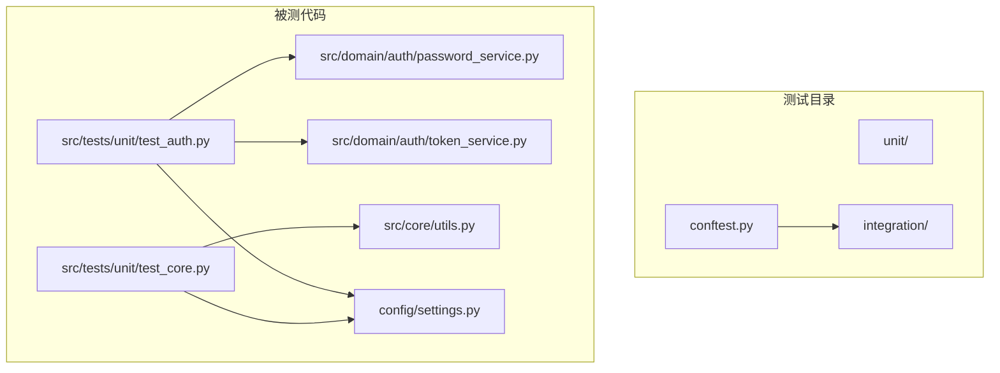
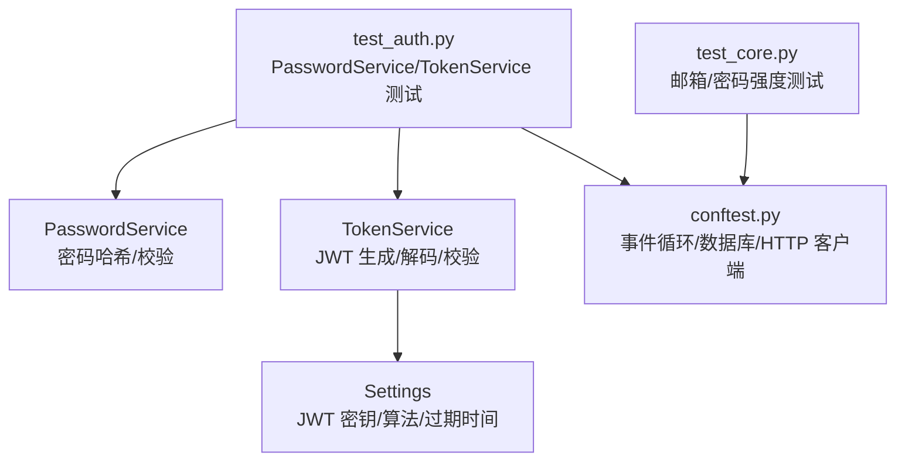
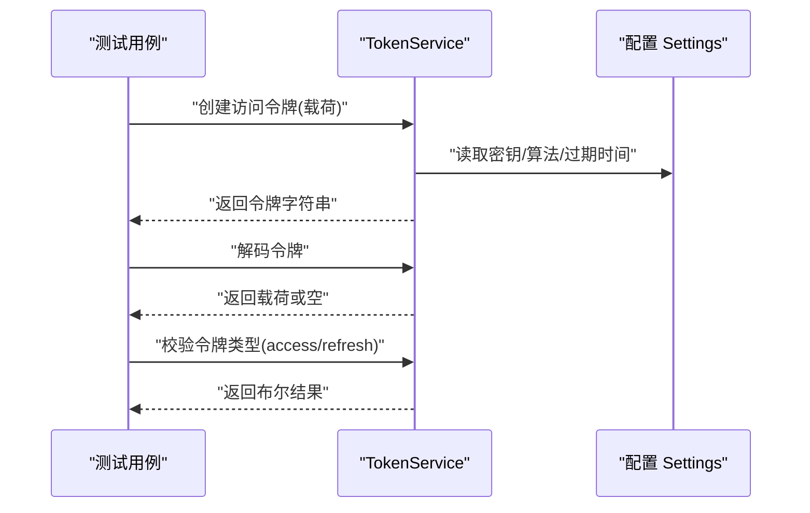
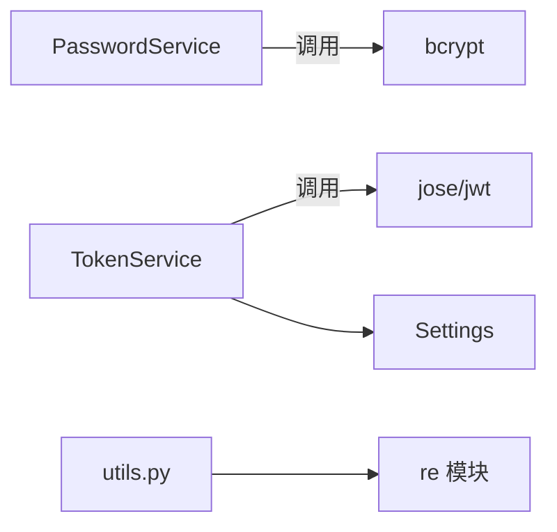

# 单元测试

<cite>
**本文引用的文件**
- [src/tests/conftest.py](file://src/tests/conftest.py)
- [src/domain/auth/password_service.py](file://src/domain/auth/password_service.py)
- [src/domain/auth/token_service.py](file://src/domain/auth/token_service.py)
- [src/tests/unit/test_auth.py](file://src/tests/unit/test_auth.py)
- [src/tests/unit/test_core.py](file://src/tests/unit/test_core.py)
- [src/core/utils.py](file://src/core/utils.py)
- [config/settings.py](file://config/settings.py)
- [pyproject.toml](file://pyproject.toml)
- [src/tests/integration/test_api.py](file://src/tests/integration/test_api.py)
</cite>

## 目录
1. [简介](#简介)
2. [项目结构](#项目结构)
3. [核心组件](#核心组件)
4. [架构总览](#架构总览)
5. [详细组件分析](#详细组件分析)
6. [依赖分析](#依赖分析)
7. [性能考虑](#性能考虑)
8. [故障排查指南](#故障排查指南)
9. [结论](#结论)
10. [附录](#附录)

## 简介
本文件聚焦于本项目的单元测试设计与实现，围绕以下目标展开：  
- 解释单元测试的设计原则与实现方法，包括测试用例编写规范、断言方式与测试数据准备。  
- 详细说明 PasswordService 与 TokenService 的测试实现，覆盖密码哈希、令牌生成与验证等关键路径。  
- 描述 Mock 对象的使用方法与测试隔离技术，帮助读者在不依赖外部系统的情况下稳定运行测试。  
- 解释测试夹具（conftest.py）的作用与配置，以及如何通过夹具实现数据库与 HTTP 客户端的自动化注入。  
- 提供单元测试最佳实践，包括命名约定、覆盖率建议与执行策略，并给出可直接参考的测试代码路径。

## 项目结构
本项目采用分层与按功能组织的目录结构，测试相关文件主要位于 src/tests 下，分为：
- unit：存放单元测试，按模块划分（如 test_auth.py、test_core.py）
- integration：存放集成测试（如 test_api.py）
- conftest.py：全局测试夹具，提供事件循环、数据库初始化、会话与异步 HTTP 客户端等

图表来源
- [src/tests/unit/test_auth.py:1-68](file://src/tests/unit/test_auth.py#L1-L68)
- [src/tests/unit/test_core.py:1-37](file://src/tests/unit/test_core.py#L1-L37)
- [src/tests/conftest.py:1-58](file://src/tests/conftest.py#L1-L58)
- [src/domain/auth/password_service.py:1-24](file://src/domain/auth/password_service.py#L1-L24)
- [src/domain/auth/token_service.py:1-41](file://src/domain/auth/token_service.py#L1-L41)
- [src/core/utils.py:1-27](file://src/core/utils.py#L1-L27)
- [config/settings.py:1-86](file://config/settings.py#L1-L86)

章节来源
- [src/tests/conftest.py:1-58](file://src/tests/conftest.py#L1-L58)
- [src/tests/unit/test_auth.py:1-68](file://src/tests/unit/test_auth.py#L1-L68)
- [src/tests/unit/test_core.py:1-37](file://src/tests/unit/test_core.py#L1-L37)

## 核心组件
- PasswordService：提供密码哈希与校验能力，基于 bcrypt 实现，适合在单元测试中独立验证。
- TokenService：提供 JWT 访问/刷新令牌的生成、解码与类型校验，依赖配置中的密钥与算法。
- 测试夹具（conftest.py）：提供内存数据库、会话与异步 HTTP 客户端，确保测试隔离与可重复性。
- 配置（settings.py）：集中管理 JWT 密钥、算法与过期时间等参数，便于在测试中控制行为。

章节来源
- [src/domain/auth/password_service.py:1-24](file://src/domain/auth/password_service.py#L1-L24)
- [src/domain/auth/token_service.py:1-41](file://src/domain/auth/token_service.py#L1-L41)
- [src/tests/conftest.py:14-58](file://src/tests/conftest.py#L14-L58)
- [config/settings.py:26-31](file://config/settings.py#L26-L31)

## 架构总览
下图展示了单元测试与被测组件之间的交互关系，以及测试夹具如何注入数据库与 HTTP 客户端：

图表来源
- [src/tests/unit/test_auth.py:1-68](file://src/tests/unit/test_auth.py#L1-L68)
- [src/tests/unit/test_core.py:1-37](file://src/tests/unit/test_core.py#L1-L37)
- [src/tests/conftest.py:1-58](file://src/tests/conftest.py#L1-L58)
- [src/domain/auth/password_service.py:1-24](file://src/domain/auth/password_service.py#L1-L24)
- [src/domain/auth/token_service.py:1-41](file://src/domain/auth/token_service.py#L1-L41)
- [config/settings.py:26-31](file://config/settings.py#L26-L31)

## 详细组件分析

### PasswordService 测试实现
- 测试目标
  - 哈希结果与原始密码不同且非空
  - 正确密码能通过校验，错误密码不能通过校验
- 断言要点
  - 使用断言确认哈希长度与非空
  - 使用断言确认正向与反向校验结果
- 数据准备
  - 使用固定字符串作为明文密码，避免随机性影响断言稳定性
- 参考路径
  - [src/tests/unit/test_auth.py:10-24](file://src/tests/unit/test_auth.py#L10-L24)
  - [src/domain/auth/password_service.py:10-23](file://src/domain/auth/password_service.py#L10-L23)

章节来源
- [src/tests/unit/test_auth.py:10-24](file://src/tests/unit/test_auth.py#L10-L24)
- [src/domain/auth/password_service.py:10-23](file://src/domain/auth/password_service.py#L10-L23)

### TokenService 测试实现
- 测试目标
  - 生成访问令牌与刷新令牌均为非空字符串
  - 解码有效令牌可得到预期载荷与类型
  - 解码无效令牌返回空
  - 校验令牌类型与期望一致
- 断言要点
  - 类型与长度断言
  - 载荷字段断言（sub、username、type）
  - 异常分支断言（无效令牌）
- 数据准备
  - 使用字典载荷，包含 sub 与 username 等关键字段
- 参考路径
  - [src/tests/unit/test_auth.py:30-67](file://src/tests/unit/test_auth.py#L30-L67)
  - [src/domain/auth/token_service.py:13-40](file://src/domain/auth/token_service.py#L13-L40)
  - [config/settings.py:26-31](file://config/settings.py#L26-L31)

章节来源
- [src/tests/unit/test_auth.py:30-67](file://src/tests/unit/test_auth.py#L30-L67)
- [src/domain/auth/token_service.py:13-40](file://src/domain/auth/token_service.py#L13-L40)
- [config/settings.py:26-31](file://config/settings.py#L26-L31)

### 测试夹具（conftest.py）详解
- 作用
  - 提供事件循环，支持异步测试运行
  - 初始化内存数据库并在每个测试前后自动建表/清表
  - 提供数据库会话，注入到需要持久化测试的用例
  - 提供异步 HTTP 客户端，用于端到端测试（在集成测试中使用）
- 关键特性
  - 使用内存 SQLite，速度快、隔离好
  - 通过依赖覆盖将应用的数据库依赖替换为测试会话
- 参考路径
  - [src/tests/conftest.py:21-58](file://src/tests/conftest.py#L21-L58)

章节来源
- [src/tests/conftest.py:21-58](file://src/tests/conftest.py#L21-L58)

### 核心工具类（邮箱与密码强度）测试
- 测试目标
  - 验证邮箱格式匹配与不匹配场景
  - 验证密码强度规则（长度、大小写、数字）
- 断言要点
  - 正例与反例分别断言布尔结果
- 参考路径
  - [src/tests/unit/test_core.py:9-36](file://src/tests/unit/test_core.py#L9-L36)
  - [src/core/utils.py:12-26](file://src/core/utils.py#L12-L26)

章节来源
- [src/tests/unit/test_core.py:9-36](file://src/tests/unit/test_core.py#L9-L36)
- [src/core/utils.py:12-26](file://src/core/utils.py#L12-L26)

### 测试序列流程（以 TokenService 为例）

图表来源
- [src/domain/auth/token_service.py:13-40](file://src/domain/auth/token_service.py#L13-L40)
- [config/settings.py:26-31](file://config/settings.py#L26-L31)

## 依赖分析
- PasswordService 与 TokenService 均为纯静态方法封装，便于在单元测试中直接调用，无需实例化。
- TokenService 依赖配置模块提供的密钥、算法与过期时间，测试时应确保配置可用。
- 单元测试通过 conftest.py 注入数据库会话，但本项目单元测试未直接使用数据库，因此可跳过会话注入；若后续扩展，可复用现有夹具。

图表来源
- [src/domain/auth/password_service.py:3-23](file://src/domain/auth/password_service.py#L3-L23)
- [src/domain/auth/token_service.py:3-40](file://src/domain/auth/token_service.py#L3-L40)
- [src/core/utils.py:3-26](file://src/core/utils.py#L3-L26)
- [config/settings.py:26-31](file://config/settings.py#L26-L31)

章节来源
- [src/domain/auth/password_service.py:3-23](file://src/domain/auth/password_service.py#L3-L23)
- [src/domain/auth/token_service.py:3-40](file://src/domain/auth/token_service.py#L3-L40)
- [src/core/utils.py:3-26](file://src/core/utils.py#L3-L26)
- [config/settings.py:26-31](file://config/settings.py#L26-L31)

## 性能考虑
- 使用内存数据库（SQLite 内存模式）进行测试，避免磁盘 IO，提升执行速度。
- 将配置项（如 JWT 过期时间）设置为较短值，便于快速验证过期逻辑。
- 在单元测试中避免外部网络请求与第三方服务，减少不确定性与耗时。

## 故障排查指南
- 令牌解码失败
  - 检查配置中的密钥与算法是否与生成时一致
  - 参考路径：[config/settings.py:26-31](file://config/settings.py#L26-L31)
- 密码校验失败
  - 确认哈希与明文编码一致（UTF-8）
  - 参考路径：[src/domain/auth/password_service.py:10-23](file://src/domain/auth/password_service.py#L10-L23)
- 数据库相关错误
  - 确认 conftest 中数据库初始化与清理逻辑正常执行
  - 参考路径：[src/tests/conftest.py:29-37](file://src/tests/conftest.py#L29-L37)
- 依赖注入问题
  - 若使用集成测试客户端，确认依赖覆盖已正确设置与清理
  - 参考路径：[src/tests/conftest.py:46-57](file://src/tests/conftest.py#L46-L57)

章节来源
- [config/settings.py:26-31](file://config/settings.py#L26-L31)
- [src/domain/auth/password_service.py:10-23](file://src/domain/auth/password_service.py#L10-L23)
- [src/tests/conftest.py:29-37](file://src/tests/conftest.py#L29-L37)
- [src/tests/conftest.py:46-57](file://src/tests/conftest.py#L46-L57)

## 结论
本项目的单元测试遵循“最小依赖、高内聚”的原则，通过静态方法封装与配置驱动，实现了对密码与令牌核心逻辑的稳定验证。配合 conftest 的数据库与 HTTP 客户端夹具，既保证了测试隔离，又为后续扩展集成测试提供了基础。建议在保持现有断言风格的基础上，逐步引入更丰富的边界条件与异常场景，持续提升测试质量与覆盖率。

## 附录

### 单元测试最佳实践
- 命名约定
  - 测试类使用 TestXxx 形式，测试方法使用 test_xxx，清晰表达意图
  - 参考路径：[src/tests/unit/test_auth.py:7-67](file://src/tests/unit/test_auth.py#L7-L67)
- 断言方法
  - 使用明确的断言语义（如 is True/False），避免隐式断言
  - 对字符串与字节进行显式编码处理，确保一致性
- 测试数据准备
  - 使用固定输入与预期输出，避免随机性导致的不稳定
  - 对于外部依赖（如 JWT），通过配置或夹具可控地提供
- 测试隔离
  - 使用内存数据库与依赖覆盖，确保每次测试互不影响
  - 参考路径：[src/tests/conftest.py:14-58](file://src/tests/conftest.py#L14-L58)
- 执行策略
  - 使用 pytest 标记区分单元与集成测试，便于选择性执行
  - 参考路径：[pyproject.toml:67-74](file://pyproject.toml#L67-L74)
- 覆盖率要求
  - 建议核心业务逻辑（如密码哈希、令牌生成/校验、邮箱/密码强度）达到较高覆盖率
  - 可结合 pytest-cov 工具进行统计（开发依赖已包含）

章节来源
- [src/tests/unit/test_auth.py:7-67](file://src/tests/unit/test_auth.py#L7-L67)
- [src/tests/conftest.py:14-58](file://src/tests/conftest.py#L14-L58)
- [pyproject.toml:67-74](file://pyproject.toml#L67-L74)

### 参考测试代码路径
- 密码服务测试
  - [src/tests/unit/test_auth.py:10-24](file://src/tests/unit/test_auth.py#L10-L24)
  - [src/domain/auth/password_service.py:10-23](file://src/domain/auth/password_service.py#L10-L23)
- 令牌服务测试
  - [src/tests/unit/test_auth.py:30-67](file://src/tests/unit/test_auth.py#L30-L67)
  - [src/domain/auth/token_service.py:13-40](file://src/domain/auth/token_service.py#L13-L40)
  - [config/settings.py:26-31](file://config/settings.py#L26-L31)
- 核心工具测试
  - [src/tests/unit/test_core.py:9-36](file://src/tests/unit/test_core.py#L9-L36)
  - [src/core/utils.py:12-26](file://src/core/utils.py#L12-L26)
- 集成测试（参考）
  - [src/tests/integration/test_api.py:16-91](file://src/tests/integration/test_api.py#L16-L91)