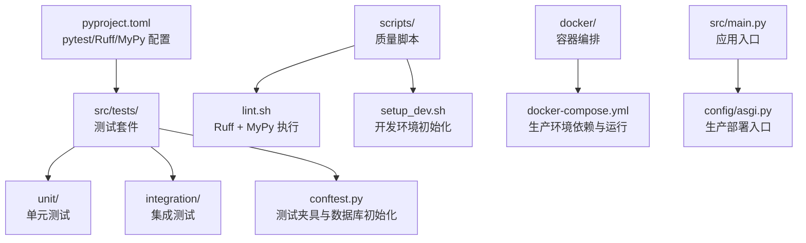
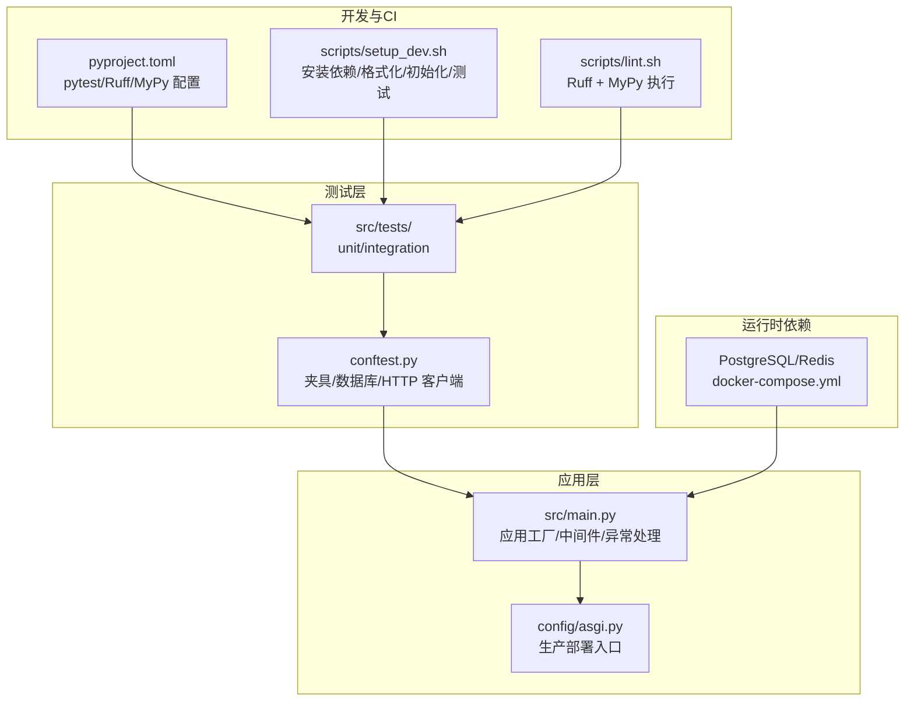
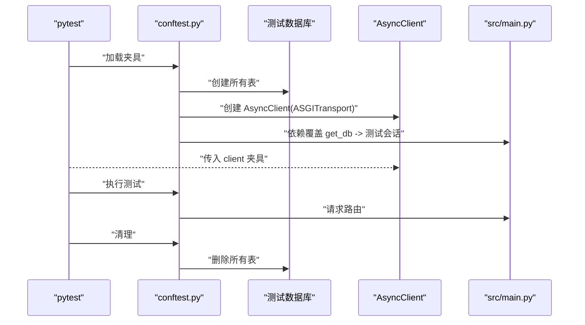
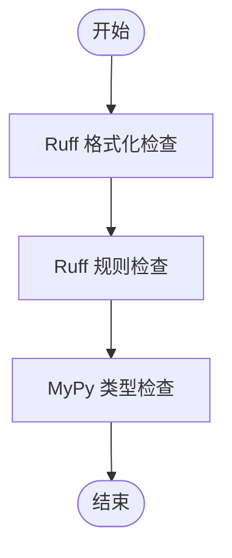
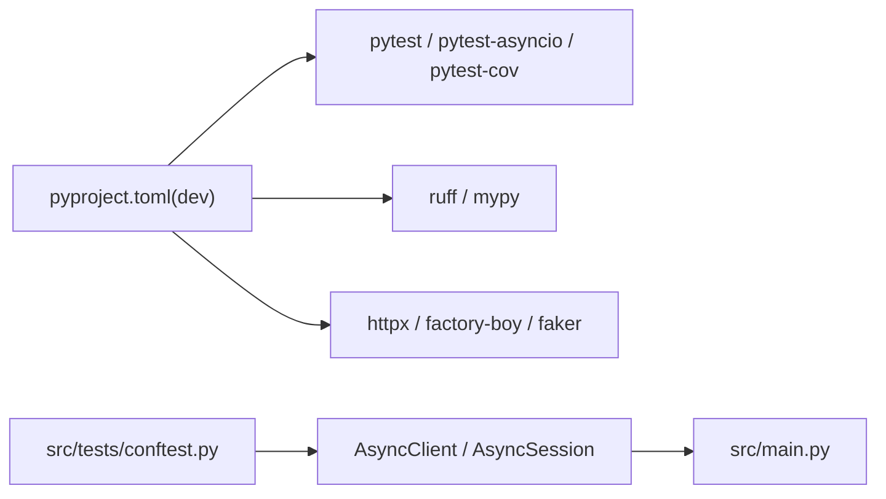

# 测试工具与质量保证

<cite>
**本文引用的文件**
- [pyproject.toml](file://pyproject.toml)
- [conftest.py](file://src/tests/conftest.py)
- [test_auth.py](file://src/tests/unit/test_auth.py)
- [test_api.py](file://src/tests/integration/test_api.py)
- [lint.sh](file://scripts/lint.sh)
- [setup_dev.sh](file://scripts/setup_dev.sh)
- [manage.py](file://manage.py)
- [docker-compose.yml](file://docker/docker-compose.yml)
- [main.py](file://src/main.py)
- [asgi.py](file://config/asgi.py)
</cite>

## 目录
1. [简介](#简介)
2. [项目结构](#项目结构)
3. [核心组件](#核心组件)
4. [架构总览](#架构总览)
5. [详细组件分析](#详细组件分析)
6. [依赖分析](#依赖分析)
7. [性能考虑](#性能考虑)
8. [故障排查指南](#故障排查指南)
9. [结论](#结论)
10. [附录](#附录)

## 简介
本文件面向测试与质量保证，系统化梳理本项目的测试体系与质量工具链，覆盖以下主题：
- pytest 测试框架的配置与使用：测试发现、测试执行、标记与报告生成
- 代码质量工具链：Ruff（格式化与检查）、MyPy 类型检查
- 静态代码分析与代码审查流程建议
- 持续集成与自动化测试流程建议
- 测试覆盖率计算与报告生成
- 测试环境配置管理：开发、测试、生产差异
- 工具安装、配置与使用指南

## 项目结构
本项目采用分层与领域驱动设计（DDD），测试位于 src/tests 下，按单元测试与集成测试分层组织；质量工具通过 pyproject.toml 统一声明与配置。

图表来源
- [pyproject.toml:67-74](file://pyproject.toml#L67-L74)
- [conftest.py:14-58](file://src/tests/conftest.py#L14-L58)
- [lint.sh:1-19](file://scripts/lint.sh#L1-L19)
- [setup_dev.sh:1-47](file://scripts/setup_dev.sh#L1-L47)
- [docker-compose.yml:1-59](file://docker/docker-compose.yml#L1-L59)
- [main.py:31-83](file://src/main.py#L31-L83)
- [asgi.py:1-6](file://config/asgi.py#L1-L6)

章节来源
- [pyproject.toml:1-74](file://pyproject.toml#L1-L74)
- [src/tests/conftest.py:1-58](file://src/tests/conftest.py#L1-L58)
- [scripts/lint.sh:1-19](file://scripts/lint.sh#L1-L19)
- [scripts/setup_dev.sh:1-47](file://scripts/setup_dev.sh#L1-L47)
- [docker/docker-compose.yml:1-59](file://docker/docker-compose.yml#L1-L59)
- [src/main.py:1-83](file://src/main.py#L1-L83)
- [config/asgi.py:1-6](file://config/asgi.py#L1-L6)

## 核心组件
- 测试框架与配置
  - 使用 pytest，测试路径为 src/tests，启用 asyncio 自动模式，定义 unit 与 integration 标记
- 数据库与夹具
  - 使用内存 SQLite 初始化/清理表，提供 db_session 与 AsyncClient 夹具
- 质量工具链
  - Ruff：格式化检查、规则选择、导入排序配置
  - MyPy：类型检查配置
- 开发脚本
  - lint.sh：统一执行格式化、检查与类型检查
  - setup_dev.sh：安装依赖、格式化、初始化数据库、种子 RBAC、运行测试

章节来源
- [pyproject.toml:67-74](file://pyproject.toml#L67-L74)
- [pyproject.toml:48-66](file://pyproject.toml#L48-L66)
- [src/tests/conftest.py:14-58](file://src/tests/conftest.py#L14-L58)
- [scripts/lint.sh:1-19](file://scripts/lint.sh#L1-L19)
- [scripts/setup_dev.sh:1-47](file://scripts/setup_dev.sh#L1-L47)

## 架构总览
下图展示测试与质量工具在项目中的位置与交互关系。

图表来源
- [pyproject.toml:67-74](file://pyproject.toml#L67-L74)
- [scripts/setup_dev.sh:23-42](file://scripts/setup_dev.sh#L23-L42)
- [scripts/lint.sh:8-15](file://scripts/lint.sh#L8-L15)
- [src/tests/conftest.py:14-58](file://src/tests/conftest.py#L14-L58)
- [src/main.py:31-83](file://src/main.py#L31-L83)
- [config/asgi.py:1-6](file://config/asgi.py#L1-L6)
- [docker/docker-compose.yml:12-22](file://docker/docker-compose.yml#L12-L22)

## 详细组件分析

### pytest 配置与使用
- 测试发现与路径
  - 通过 testpaths 指定 src/tests，pytest 将自动发现该目录下的测试文件
- 异步支持
  - asyncio_mode 设为 auto，确保异步测试与夹具正常运行
- 标记与分类
  - 定义 unit 与 integration 标记，便于按类别筛选执行
- 执行与报告
  - 可通过命令行参数控制输出详细度与报告格式（如 junitxml、json 等）
  - 建议在 CI 中开启覆盖率插件以生成覆盖率报告

章节来源
- [pyproject.toml:67-74](file://pyproject.toml#L67-L74)

### 测试夹具与数据库初始化（conftest.py）
- 事件循环
  - 提供 session 作用域的事件循环夹具，确保异步测试稳定运行
- 数据库生命周期
  - 在每个测试前创建所有表，结束后清理，避免状态污染
- 会话与客户端
  - 提供 db_session 与 AsyncClient 夹具，并通过依赖覆盖将 get_db 替换为测试会话
  - 通过 ASGI 传输启动测试客户端，模拟真实请求

图表来源
- [src/tests/conftest.py:21-58](file://src/tests/conftest.py#L21-L58)
- [src/main.py:71-79](file://src/main.py#L71-L79)

章节来源
- [src/tests/conftest.py:14-58](file://src/tests/conftest.py#L14-L58)

### 单元测试示例（test_auth.py）
- 测试范围
  - 覆盖密码哈希、校验与令牌创建、解码、类型验证等逻辑
- 断言策略
  - 关注行为正确性与边界条件（如错误口令、无效令牌）

章节来源
- [src/tests/unit/test_auth.py:1-68](file://src/tests/unit/test_auth.py#L1-L68)

### 集成测试示例（test_api.py）
- 测试范围
  - 健康检查、认证登录、获取当前用户、更新个人资料等端点
- 数据准备
  - 通过 UserService 创建用户并提交事务，确保测试数据可用
- 认证流程
  - 使用 TokenService 生成访问令牌，携带 Authorization 请求头进行受保护端点测试

章节来源
- [src/tests/integration/test_api.py:1-143](file://src/tests/integration/test_api.py#L1-L143)

### 质量工具链（Ruff + MyPy）
- Ruff 配置
  - 目标版本、行宽、源码路径、规则选择、导入排序分组
- MyPy 配置
  - Python 版本、返回值警告、忽略缺失导入、类型检查严格性
- 执行脚本
  - lint.sh 顺序执行格式化检查、规则检查与类型检查

图表来源
- [pyproject.toml:48-66](file://pyproject.toml#L48-L66)
- [scripts/lint.sh:8-15](file://scripts/lint.sh#L8-L15)

章节来源
- [pyproject.toml:48-66](file://pyproject.toml#L48-L66)
- [scripts/lint.sh:1-19](file://scripts/lint.sh#L1-L19)

### 开发环境初始化脚本（setup_dev.sh）
- 功能清单
  - 安装/确认 UV、创建虚拟环境、安装开发依赖、格式化、初始化数据库、种子 RBAC、运行测试
- 建议
  - 在 CI 中复用相同步骤，确保本地与流水线一致

章节来源
- [scripts/setup_dev.sh:1-47](file://scripts/setup_dev.sh#L1-L47)

### 生产环境与部署入口（docker-compose.yml 与 asgi.py）
- docker-compose.yml
  - 定义应用、数据库与缓存服务，设置环境变量与卷挂载
- asgi.py
  - 导出应用实例，用于生产部署（如 uvicorn 运行）

章节来源
- [docker/docker-compose.yml:1-59](file://docker/docker-compose.yml#L1-L59)
- [config/asgi.py:1-6](file://config/asgi.py#L1-L6)

## 依赖分析
- 工具依赖
  - pytest、pytest-asyncio、pytest-cov、ruff、mypy、httpx、factory-boy、faker
- 运行时依赖
  - FastAPI、SQLAlchemy Async、asyncpg、Redis、uvicorn 等
- 测试耦合
  - 测试通过夹具注入 AsyncClient 与 db_session，降低对真实外部服务的依赖

图表来源
- [pyproject.toml:29-39](file://pyproject.toml#L29-L39)
- [src/tests/conftest.py:46-58](file://src/tests/conftest.py#L46-L58)
- [src/main.py:31-83](file://src/main.py#L31-L83)

章节来源
- [pyproject.toml:29-39](file://pyproject.toml#L29-L39)
- [src/tests/conftest.py:46-58](file://src/tests/conftest.py#L46-L58)
- [src/main.py:31-83](file://src/main.py#L31-L83)

## 性能考虑
- 测试并发与隔离
  - 使用内存数据库与独立会话，减少 I/O 干扰
- 覆盖率收集
  - 在 CI 中启用覆盖率插件，仅统计 src 目录，避免第三方包影响
- 质量检查批量化
  - 通过 lint.sh 合并格式化与检查，减少重复开销

## 故障排查指南
- 测试无法启动或超时
  - 检查 conftest.py 的事件循环与数据库初始化是否成功
  - 确认依赖覆盖已生效（get_db 被替换为测试会话）
- 令牌或认证失败
  - 核对测试中创建用户与令牌生成逻辑，确保请求头携带正确的 Bearer 令牌
- 类型检查报错
  - 在本地执行 lint.sh，逐项修复 Ruff 与 MyPy 报告的问题
- 数据库迁移或模型变更
  - 在测试前确保 create_all 与 drop_all 正常执行，避免历史表影响

章节来源
- [src/tests/conftest.py:21-58](file://src/tests/conftest.py#L21-L58)
- [scripts/lint.sh:8-15](file://scripts/lint.sh#L8-L15)

## 结论
本项目已建立完善的测试与质量工具链：pytest 作为测试核心，配合 Ruff 与 MyPy 实现格式化、规则与类型检查；通过夹具实现数据库与 HTTP 客户端的可复用注入；开发脚本统一了本地初始化流程。建议在 CI 中引入覆盖率与静态分析报告，形成闭环的质量保障体系。

## 附录

### 安装与配置指南
- 安装开发依赖
  - 使用脚本一键安装：参考 [setup_dev.sh:23-26](file://scripts/setup_dev.sh#L23-L26)
- 运行质量检查
  - 执行统一脚本：参考 [lint.sh:8-15](file://scripts/lint.sh#L8-L15)
- 运行测试
  - 基于配置执行：参考 [pyproject.toml:67-74](file://pyproject.toml#L67-L74)

### 测试执行与报告
- 命令行示例
  - 详细输出：pytest -v
  - 指定标记：pytest -m unit 或 pytest -m integration
  - 生成覆盖率：pytest --cov=src --cov-report=html
- CI 建议
  - 在流水线中顺序执行：lint.sh → pytest（含覆盖率）→ 构建镜像

### 覆盖率计算与报告生成
- 插件
  - 使用 pytest-cov（已在 dev 依赖中声明）
- 输出
  - 建议生成 HTML 报告并在 CI 中上传 artifact

### 测试环境配置管理
- 开发环境
  - 使用内存数据库与本地依赖，便于快速迭代
- 测试/生产环境
  - 通过 docker-compose 启动 PostgreSQL 与 Redis，应用读取环境变量连接外部服务
- 部署入口
  - 生产使用 ASGI 入口导出应用实例

章节来源
- [scripts/setup_dev.sh:23-42](file://scripts/setup_dev.sh#L23-L42)
- [scripts/lint.sh:8-15](file://scripts/lint.sh#L8-L15)
- [pyproject.toml:29-39](file://pyproject.toml#L29-L39)
- [docker/docker-compose.yml:12-22](file://docker/docker-compose.yml#L12-L22)
- [config/asgi.py:1-6](file://config/asgi.py#L1-L6)