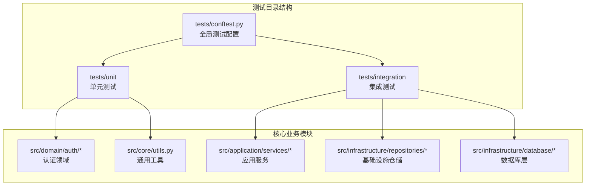
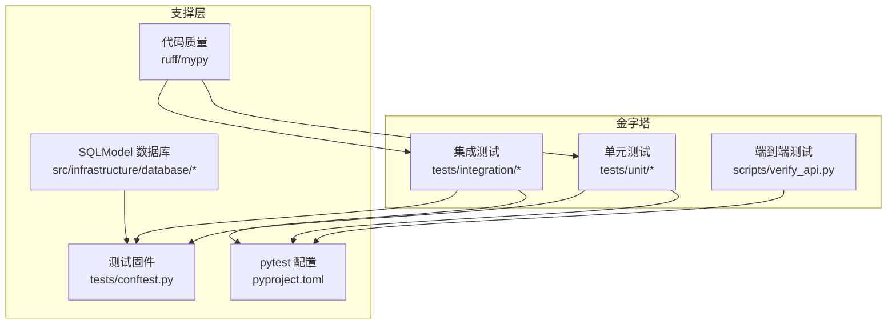
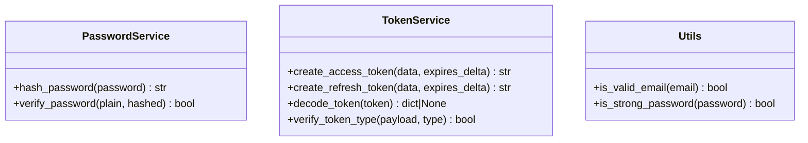
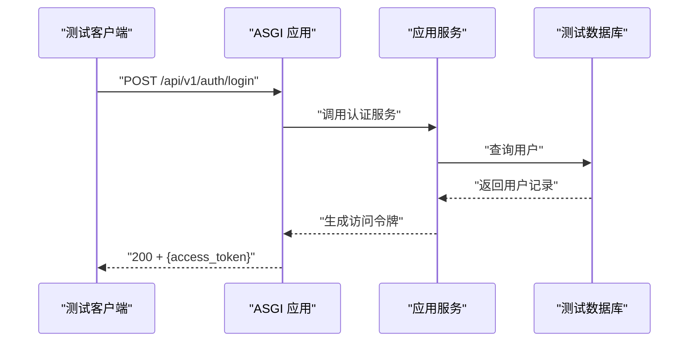
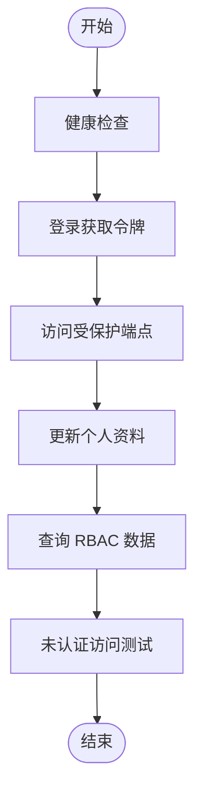
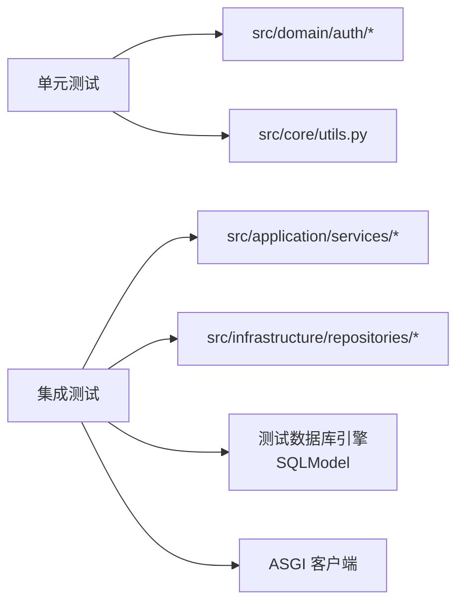

# 测试策略

<cite>
**本文档引用的文件**
- [pyproject.toml](file://pyproject.toml)
- [conftest.py](file://tests/conftest.py)
- [models.py](file://src/infrastructure/database/models.py)
- [connection.py](file://src/infrastructure/database/connection.py)
- [dependencies.py](file://src/api/dependencies.py)
- [test_auth.py](file://tests/unit/test_auth.py)
- [test_core.py](file://tests/unit/test_core.py)
- [test_api.py](file://tests/integration/test_api.py)
- [password_service.py](file://src/domain/auth/password_service.py)
- [token_service.py](file://src/domain/auth/token_service.py)
- [utils.py](file://src/core/utils.py)
- [verify_api.py](file://scripts/verify_api.py)
</cite>

## 更新摘要
**所做更改**
- 更新测试配置以反映SQLModel迁移：使用 `SQLModel.metadata.create_all()` 和 `drop_all()` 替代 SQLAlchemy 的 `Base.metadata`
- 更新测试会话管理：使用 SQLModel 的 `AsyncSession` 替代 SQLAlchemy 的 `AsyncSession`
- 更新数据库连接和初始化：统一使用 SQLModel 进行表创建和清理
- 更新测试固件以适配新的数据库架构

## 目录
1. [引言](#引言)
2. [项目结构](#项目结构)
3. [核心组件](#核心组件)
4. [架构总览](#架构总览)
5. [详细组件分析](#详细组件分析)
6. [依赖分析](#依赖分析)
7. [性能考虑](#性能考虑)
8. [故障排查指南](#故障排查指南)
9. [结论](#结论)
10. [附录](#附录)

## 引言
本测试策略文档面向本 FastAPI 项目，围绕测试金字塔（单元测试、集成测试、端到端测试）构建分层测试体系，明确各层级目标、实现方式与质量标准。文档覆盖以下要点：
- 单元测试：Mock 对象使用、测试用例设计、覆盖率要求
- 集成测试：API 测试、数据库测试、外部服务测试
- 测试环境配置与管理：测试数据库、测试数据准备
- 测试工具链：pytest 配置、测试标记、并行执行
- 代码质量测试：静态分析、类型检查、性能测试
- 持续集成与测试报告：CI 配置建议、测试结果分析

## 项目结构
项目采用按"层次+特性"混合组织方式，测试目录位于项目根目录的 tests 下，分为 unit、integration 子目录，配合 pytest 配置集中于 pyproject.toml。

**更新** 项目已完全迁移到 SQLModel，测试配置已相应更新以适配新的数据库架构

**图表来源**
- [pyproject.toml:63-70](file://pyproject.toml#L63-L70)
- [conftest.py:1-62](file://tests/conftest.py#L1-L62)

**章节来源**
- [pyproject.toml:63-70](file://pyproject.toml#L63-L70)
- [conftest.py:1-62](file://tests/conftest.py#L1-L62)

## 核心组件
- 测试框架与工具链
  - pytest：测试运行、标记、并发、覆盖率
  - pytest-asyncio：异步测试支持
  - pytest-cov：覆盖率统计
  - ruff/mypy：静态检查与类型检查
- 测试固件与环境
  - 内存 SQLite 测试数据库引擎（SQLModel）
  - ASGI 异步 HTTP 客户端
  - 数据库表级生命周期管理（创建/销毁）
- 测试标记
  - unit：单元测试
  - integration：集成测试

**章节来源**
- [pyproject.toml:22-32](file://pyproject.toml#L22-L32)
- [pyproject.toml:63-70](file://pyproject.toml#L63-L70)
- [conftest.py:16-62](file://tests/conftest.py#L16-L62)

## 架构总览
测试架构遵循金字塔模型，从下至上：
- 单元测试：验证独立函数/类的行为，使用 Mock 或最小化依赖
- 集成测试：验证模块间协作，含数据库与外部服务交互
- 端到端测试：通过真实客户端调用 API，覆盖完整业务路径

**更新** 测试配置已完全适配 SQLModel 架构

**图表来源**
- [pyproject.toml:63-70](file://pyproject.toml#L63-L70)
- [conftest.py:1-62](file://tests/conftest.py#L1-L62)
- [verify_api.py:1-176](file://scripts/verify_api.py#L1-L176)

## 详细组件分析

### 单元测试策略与实现
- 覆盖范围
  - 认证领域：密码哈希与校验、JWT 令牌创建与解析
  - 核心工具：邮箱格式校验、密码强度校验
- 设计原则
  - 使用最小依赖：直接调用被测函数或静态方法
  - 边界条件：空字符串、非法格式、长度阈值
  - 反向验证：错误输入返回 False/None
- Mock 使用
  - 当前单元测试未引入外部 Mock；如需可使用 pytest-mock 或 unittest.mock
- 覆盖率要求
  - 建议：核心逻辑行覆盖率 ≥ 80%，分支覆盖率 ≥ 60%
- 示例用例路径
  - [密码服务测试:10-24](file://tests/unit/test_auth.py#L10-L24)
  - [令牌服务测试:30-67](file://tests/unit/test_auth.py#L30-L67)
  - [邮箱/密码强度测试:9-36](file://tests/unit/test_core.py#L9-L36)

**更新** 所有测试文件路径已从 src/tests/ 更新为 tests/

**图表来源**
- [password_service.py:6-24](file://src/domain/auth/password_service.py#L6-L24)
- [token_service.py:9-41](file://src/domain/auth/token_service.py#L9-L41)
- [utils.py:12-27](file://src/core/utils.py#L12-L27)

**章节来源**
- [test_auth.py:1-68](file://tests/unit/test_auth.py#L1-L68)
- [test_core.py:1-37](file://tests/unit/test_core.py#L1-L37)
- [password_service.py:1-24](file://src/domain/auth/password_service.py#L1-L24)
- [token_service.py:1-41](file://src/domain/auth/token_service.py#L1-L41)
- [utils.py:1-27](file://src/core/utils.py#L1-L27)

### 集成测试策略与实现
- 目标
  - 验证 API 端点行为、数据库持久化、鉴权中间件与路由依赖注入
- 关键场景
  - 健康检查端点
  - 登录成功/失败、获取当前用户、未认证访问
  - 用户资料查询与更新
- 测试固件
  - 使用内存数据库与 ASGI 客户端，自动注入测试会话
  - 通过依赖覆盖替换生产数据库连接
- 外部服务
  - Redis 缓存：可通过容器化环境或内存模式测试缓存接口
  - PostgreSQL：容器化，健康检查保证可用性
- 示例用例路径
  - [健康检查:16-20](file://tests/integration/test_api.py#L16-L20)
  - [登录与鉴权:27-91](file://tests/integration/test_api.py#L27-L91)
  - [用户资料查询与更新:98-142](file://tests/integration/test_api.py#L98-L142)

**更新** 集成测试文件路径已更新为 tests/integration/

**图表来源**
- [test_api.py:27-48](file://tests/integration/test_api.py#L27-L48)
- [conftest.py:43-61](file://tests/conftest.py#L43-L61)

**章节来源**
- [test_api.py:1-143](file://tests/integration/test_api.py#L1-L143)
- [conftest.py:16-62](file://tests/conftest.py#L16-L62)

### 端到端测试策略与实现
- 工具与目标
  - 使用 httpx 直连本地服务，验证完整业务流
  - 包含健康检查、登录、受保护端点访问、RBAC 查询、未认证访问等
- 执行方式
  - 启动服务后运行脚本，或在 CI 中以容器化方式运行
- 示例流程路径
  - [功能验证脚本:137-172](file://scripts/verify_api.py#L137-L172)

**图表来源**
- [verify_api.py:8-172](file://scripts/verify_api.py#L8-L172)

**章节来源**
- [verify_api.py:1-176](file://scripts/verify_api.py#L1-L176)

### 测试环境配置与管理
- 测试数据库
  - 内存 SQLite（异步），使用 SQLModel metadata 进行自动建表/删表
  - 通过会话工厂提供测试事务边界
- 依赖注入覆盖
  - 在测试中替换 get_db 依赖，确保所有路由使用测试会话
- 外部服务
  - Redis：容器化或内存模式
  - PostgreSQL：容器化，健康检查保证可用性
- 开发环境初始化
  - 自动安装依赖、格式化、初始化数据库、种子 RBAC 数据、运行测试

**更新** 测试配置已完全适配 SQLModel 架构

**章节来源**
- [conftest.py:16-62](file://tests/conftest.py#L16-L62)

### 测试工具链与配置
- pytest 配置
  - 测试路径、异步模式、自定义标记
- 代码质量
  - Ruff：格式检查与规则检查
  - MyPy：类型检查
- 并行执行
  - 可使用 pytest-xdist 实现并行（建议在 CI 中启用）

**章节来源**
- [pyproject.toml:63-70](file://pyproject.toml#L63-L70)
- [pyproject.toml:48-66](file://pyproject.toml#L48-L66)

## 依赖分析
- 测试与业务模块耦合
  - 单元测试直接依赖 domain 层工具类，耦合度低
  - 集成测试依赖 application/service 与 infrastructure/repository，耦合度较高
- 外部依赖
  - 数据库：aiosqlite（测试）、asyncpg（生产）
  - 缓存：redis
  - JWT：python-jose
- 依赖覆盖
  - 通过依赖注入覆盖 get_db，避免真实数据库耦合

**更新** 所有测试文件引用路径已更新

**图表来源**
- [test_auth.py:1-68](file://tests/unit/test_auth.py#L1-L68)
- [test_core.py:1-37](file://tests/unit/test_core.py#L1-L37)
- [test_api.py:1-143](file://tests/integration/test_api.py#L1-L143)
- [conftest.py:16-62](file://tests/conftest.py#L16-L62)

**章节来源**
- [test_auth.py:1-68](file://tests/unit/test_auth.py#L1-L68)
- [test_core.py:1-37](file://tests/unit/test_core.py#L1-L37)
- [test_api.py:1-143](file://tests/integration/test_api.py#L1-L143)
- [conftest.py:16-62](file://tests/conftest.py#L16-L62)

## 性能考虑
- 单元测试
  - 保持无外部 IO，优先使用内存计算
- 集成测试
  - 使用内存数据库减少 IO 延迟
  - 控制测试用例数量，避免长串依赖
- 端到端测试
  - 仅在必要时运行，建议在 CI 中分阶段执行
- 并行执行
  - 使用 pytest-xdist 并行加速（注意共享资源竞争）

## 故障排查指南
- 常见问题
  - 依赖注入未覆盖：确认 conftest 中依赖覆盖逻辑生效
  - 数据库表未创建：检查测试会话生命周期与 SQLModel metadata 建表/删表钩子
  - 令牌解析失败：核对 JWT 密钥与算法配置
- 排查步骤
  - 运行单个测试定位失败用例
  - 查看日志与断言输出
  - 在本地容器化环境中复现（PostgreSQL/Redis）
- 相关文件路径
  - [依赖注入与客户端固件:43-61](file://tests/conftest.py#L43-L61)
  - [数据库生命周期固件:30-41](file://tests/conftest.py#L30-L41)
  - [JWT 配置与解析:12-35](file://src/domain/auth/token_service.py#L12-L35)

**章节来源**
- [conftest.py:16-62](file://tests/conftest.py#L16-L62)
- [token_service.py:12-35](file://src/domain/auth/token_service.py#L12-L35)

## 结论
本项目已具备清晰的测试金字塔基础：单元测试覆盖核心工具与领域服务，集成测试覆盖 API 与数据库交互，端到端测试通过脚本验证完整业务流。项目已完全迁移到 SQLModel 架构，测试配置已相应更新以适配新的数据库架构。建议在现有基础上补充：
- 单元测试中的 Mock 使用与覆盖率目标
- 集成测试中对外部服务（Redis/缓存）的覆盖
- CI 中的并行执行与报告生成
- 更完善的测试数据工厂与种子脚本

## 附录
- 快速运行
  - 单元测试：pytest -m unit
  - 集成测试：pytest -m integration
  - 全量测试：pytest
  - 代码质量：ruff check && mypy
- 开发环境初始化：bash scripts/setup_dev.sh
- 测试目录结构
  - tests/
    - unit/：单元测试文件
    - integration/：集成测试文件
    - conftest.py：全局测试配置