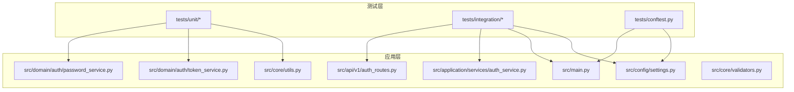
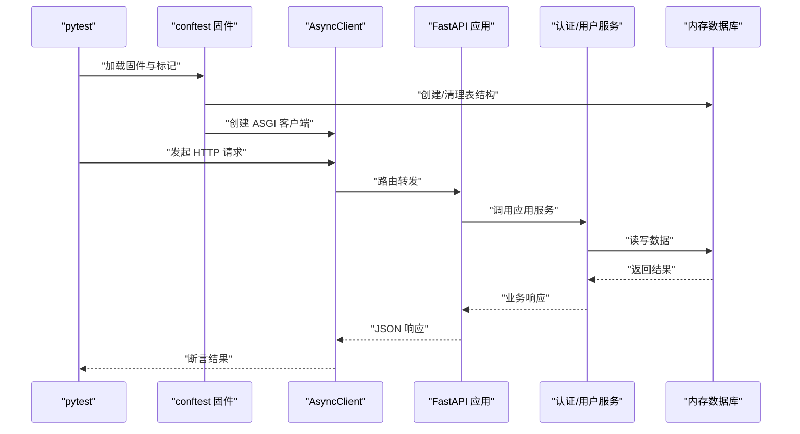
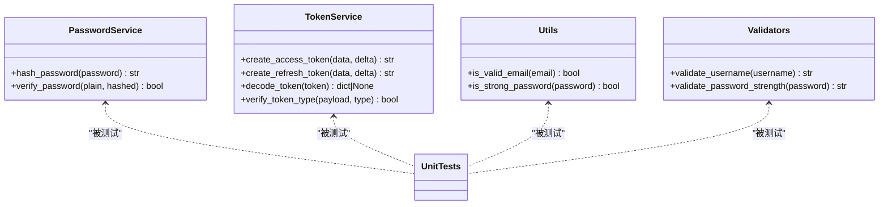
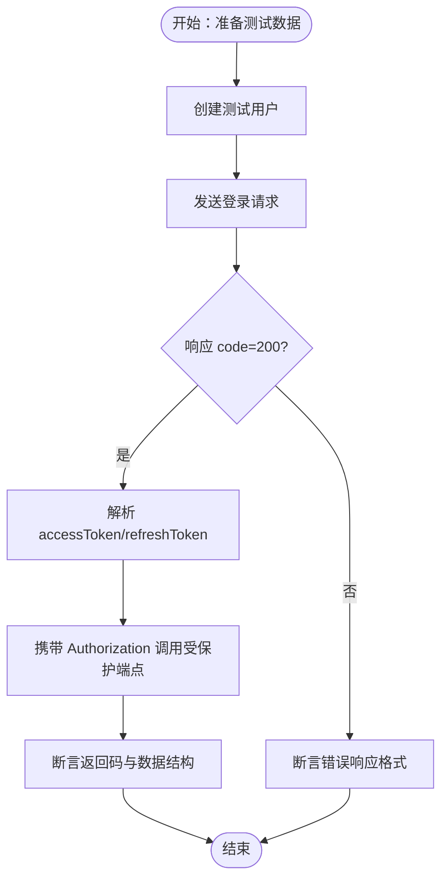
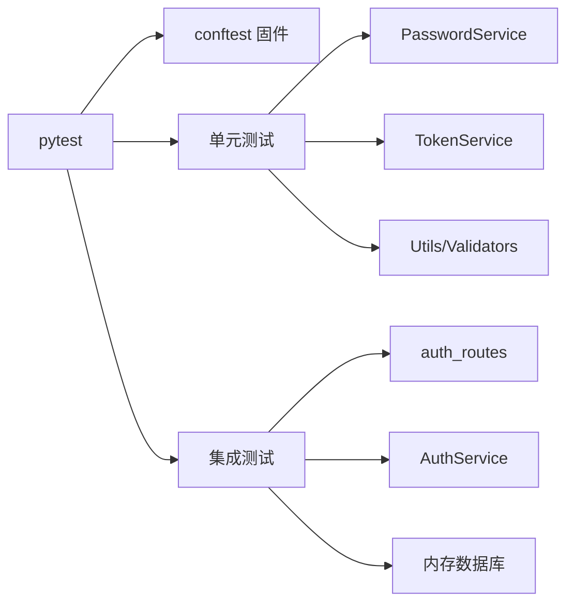

# 测试策略

<cite>
**本文引用的文件**
- [service/tests/conftest.py](file://service/tests/conftest.py)
- [service/tests/unit/test_auth.py](file://service/tests/unit/test_auth.py)
- [service/tests/unit/test_core.py](file://service/tests/unit/test_core.py)
- [service/tests/integration/test_api.py](file://service/tests/integration/test_api.py)
- [service/pyproject.toml](file://service/pyproject.toml)
- [service/src/main.py](file://service/src/main.py)
- [service/src/config/settings.py](file://service/src/config/settings.py)
- [service/src/api/v1/auth_routes.py](file://service/src/api/v1/auth_routes.py)
- [service/src/application/services/auth_service.py](file://service/src/application/services/auth_service.py)
- [service/src/domain/auth/password_service.py](file://service/src/domain/auth/password_service.py)
- [service/src/domain/auth/token_service.py](file://service/src/domain/auth/token_service.py)
- [service/src/core/utils.py](file://service/src/core/utils.py)
- [service/src/core/validators.py](file://service/src/core/validators.py)
- [service/README.md](file://service/README.md)
</cite>

## 目录
1. [引言](#引言)
2. [项目结构](#项目结构)
3. [核心组件](#核心组件)
4. [架构总览](#架构总览)
5. [详细组件分析](#详细组件分析)
6. [依赖分析](#依赖分析)
7. [性能考虑](#性能考虑)
8. [故障排查指南](#故障排查指南)
9. [结论](#结论)
10. [附录](#附录)

## 引言
本测试策略文档面向 Hello-FastApi 项目，系统阐述单元测试与集成测试的实施方法，覆盖 pytest 配置与使用、测试用例编写规范与最佳实践、Mock 数据与测试环境配置、API 接口测试与端到端测试方案、测试覆盖率要求以及持续集成配置建议，并补充前端组件与状态管理测试的实施思路，帮助开发者建立完善的质量保证体系。

## 项目结构
服务端测试位于 service/tests 目录，按功能分为 unit 与 integration 两层；同时通过 conftest.py 提供全局测试固件与数据库初始化；pytest 配置集中在 pyproject.toml 中；应用入口与路由定义位于 src 目录，配合配置模块实现多环境隔离。

图表来源
- [service/tests/conftest.py:1-105](file://service/tests/conftest.py#L1-L105)
- [service/tests/unit/test_auth.py:1-68](file://service/tests/unit/test_auth.py#L1-L68)
- [service/tests/unit/test_core.py:1-37](file://service/tests/unit/test_core.py#L1-L37)
- [service/tests/integration/test_api.py:1-393](file://service/tests/integration/test_api.py#L1-L393)
- [service/src/main.py:1-96](file://service/src/main.py#L1-L96)
- [service/src/config/settings.py:1-198](file://service/src/config/settings.py#L1-L198)
- [service/src/api/v1/auth_routes.py:1-86](file://service/src/api/v1/auth_routes.py#L1-L86)
- [service/src/application/services/auth_service.py:1-154](file://service/src/application/services/auth_service.py#L1-L154)
- [service/src/domain/auth/password_service.py:1-21](file://service/src/domain/auth/password_service.py#L1-L21)
- [service/src/domain/auth/token_service.py:1-45](file://service/src/domain/auth/token_service.py#L1-L45)
- [service/src/core/utils.py:1-27](file://service/src/core/utils.py#L1-L27)
- [service/src/core/validators.py:1-26](file://service/src/core/validators.py#L1-L26)

章节来源
- [service/README.md:27-93](file://service/README.md#L27-L93)
- [service/pyproject.toml:69-76](file://service/pyproject.toml#L69-L76)

## 核心组件
- 测试固件与环境
  - 通过 conftest.py 提供内存数据库、事件循环、HTTP 客户端与认证头等通用固件，确保测试隔离与可重复性。
- 单元测试
  - 覆盖密码哈希与校验、JWT 令牌生成与解码、邮箱与密码强度校验等核心工具与领域服务。
- 集成测试
  - 覆盖健康检查、认证（登录/注册/登出/刷新）、用户管理（列表/创建/详情/更新/删除/改密/状态变更）等 API 端点。
- 配置与标记
  - pytest.ini_options 中定义 testpaths、asyncio_mode 与自定义标记 unit/integration，便于分层执行与筛选。

章节来源
- [service/tests/conftest.py:16-105](file://service/tests/conftest.py#L16-L105)
- [service/tests/unit/test_auth.py:1-68](file://service/tests/unit/test_auth.py#L1-L68)
- [service/tests/unit/test_core.py:1-37](file://service/tests/unit/test_core.py#L1-L37)
- [service/tests/integration/test_api.py:12-393](file://service/tests/integration/test_api.py#L12-L393)
- [service/pyproject.toml:69-76](file://service/pyproject.toml#L69-L76)

## 架构总览
下图展示测试执行流程与关键组件交互：pytest 发现并执行用例，conftest 提供数据库与 HTTP 客户端，应用层路由与服务处理请求，最终断言响应结果。

图表来源
- [service/tests/conftest.py:30-62](file://service/tests/conftest.py#L30-L62)
- [service/src/main.py:84-92](file://service/src/main.py#L84-L92)
- [service/src/api/v1/auth_routes.py:19-86](file://service/src/api/v1/auth_routes.py#L19-L86)
- [service/src/application/services/auth_service.py:26-154](file://service/src/application/services/auth_service.py#L26-L154)

## 详细组件分析

### 单元测试策略
- 密码服务
  - 断言哈希后值与原文不同且非空；正确与错误密码校验一致性。
- JWT 令牌服务
  - 断言访问/刷新令牌生成非空；解码有效载荷包含预期字段；类型校验正确；无效令牌解码为空。
- 工具与验证器
  - 邮箱格式正反用例；密码强度边界条件（长度、大小写、数字）。

图表来源
- [service/src/domain/auth/password_service.py:6-21](file://service/src/domain/auth/password_service.py#L6-L21)
- [service/src/domain/auth/token_service.py:11-45](file://service/src/domain/auth/token_service.py#L11-L45)
- [service/src/core/utils.py:12-27](file://service/src/core/utils.py#L12-L27)
- [service/src/core/validators.py:8-26](file://service/src/core/validators.py#L8-L26)

章节来源
- [service/tests/unit/test_auth.py:1-68](file://service/tests/unit/test_auth.py#L1-L68)
- [service/tests/unit/test_core.py:1-37](file://service/tests/unit/test_core.py#L1-L37)

### 集成测试策略
- 健康检查
  - 断言 /health 返回 200 且包含健康状态与版本信息。
- 认证端点
  - 登录成功/失败、注册、登出、刷新令牌；断言统一响应格式（code/message/data）与新增字段（如 accessToken、refreshToken、expires）。
- 用户管理端点
  - 列表查询、创建、详情、更新、删除、修改密码、更新状态；断言鉴权头与权限场景下的返回码与数据一致性。
- 依赖注入与数据库
  - 通过依赖覆盖替换真实数据库会话为测试引擎，确保测试隔离与可重复。

图表来源
- [service/tests/integration/test_api.py:24-195](file://service/tests/integration/test_api.py#L24-L195)
- [service/tests/integration/test_api.py:197-393](file://service/tests/integration/test_api.py#L197-L393)

章节来源
- [service/tests/integration/test_api.py:12-393](file://service/tests/integration/test_api.py#L12-L393)
- [service/tests/conftest.py:50-62](file://service/tests/conftest.py#L50-L62)

### 测试固件与环境配置
- 事件循环与数据库
  - 会话级事件循环固件；测试前创建表，结束后清理；内存数据库（SQLite in-memory）提升性能。
- HTTP 客户端
  - 使用 ASGI 传输创建 AsyncClient，统一 base_url，便于端到端测试。
- 认证头
  - 自动创建用户并签发访问令牌，简化受保护端点测试。
- 配置与标记
  - pyproject.toml 中定义 testpaths、asyncio_mode、unit/integration 标记，便于分层执行与过滤。

章节来源
- [service/tests/conftest.py:22-105](file://service/tests/conftest.py#L22-L105)
- [service/pyproject.toml:69-76](file://service/pyproject.toml#L69-L76)

### API 接口测试与端到端测试
- 接口测试
  - 基于 AsyncClient 直连 /api/system 前缀路由，覆盖认证与用户管理全流程。
- 端到端测试
  - 结合认证头与数据库状态，模拟真实用户行为（登录-访问受保护资源-登出），断言响应一致性与鉴权逻辑。

章节来源
- [service/src/main.py:90-92](file://service/src/main.py#L90-L92)
- [service/src/api/v1/auth_routes.py:19-86](file://service/src/api/v1/auth_routes.py#L19-L86)
- [service/tests/integration/test_api.py:24-195](file://service/tests/integration/test_api.py#L24-L195)

### Mock 数据与测试环境
- Mock 数据
  - 使用 pytest fixtures 提供测试用户数据与认证头，避免硬编码与重复构造。
- 测试环境
  - settings.py 支持 testing 环境，自动加载 .env.testing 并使用独立数据库（test.db），确保与开发/生产隔离。
- 依赖注入
  - 通过 app.dependency_overrides 将数据库会话替换为测试会话，避免污染真实数据。

章节来源
- [service/tests/conftest.py:64-105](file://service/tests/conftest.py#L64-L105)
- [service/src/config/settings.py:132-142](file://service/src/config/settings.py#L132-L142)

### 前端组件测试与状态管理测试（实施建议）
- 单元测试
  - 对 Vue 组件的纯函数逻辑、计算属性、指令与工具函数进行单元测试；使用 Vitest 进行快速执行。
- 集成测试
  - 使用 Playwright/Cypress 进行端到端测试，模拟真实用户操作（登录、导航、表单提交）。
- 状态管理测试
  - 针对 Pinia Store 的 actions、mutations 与 getters 编写测试，结合测试桩模拟 API 调用。
- 覆盖率与 CI
  - 配置覆盖率阈值（如语句/分支/函数/行 ≥ 80%），在 CI 中报告并阻断低覆盖率合并。

（本节为概念性指导，不直接分析具体文件）

## 依赖分析
- 测试与应用层耦合
  - 单元测试仅依赖领域服务与工具函数，耦合度低，易于维护。
  - 集成测试依赖路由与应用服务，通过依赖注入与内存数据库降低外部依赖影响。
- 外部依赖
  - httpx 用于 HTTP 客户端；sqlmodel/aiosqlite 用于数据库；pytest-asyncio 用于异步测试；pytest-cov 用于覆盖率统计。

图表来源
- [service/tests/conftest.py:13-14](file://service/tests/conftest.py#L13-L14)
- [service/tests/unit/test_auth.py:3-4](file://service/tests/unit/test_auth.py#L3-L4)
- [service/tests/unit/test_core.py:3](file://service/tests/unit/test_core.py#L3)
- [service/tests/integration/test_api.py:7-9](file://service/tests/integration/test_api.py#L7-L9)
- [service/src/api/v1/auth_routes.py:10-14](file://service/src/api/v1/auth_routes.py#L10-L14)
- [service/src/application/services/auth_service.py:5-12](file://service/src/application/services/auth_service.py#L5-L12)

章节来源
- [service/pyproject.toml:22-32](file://service/pyproject.toml#L22-L32)

## 性能考虑
- 内存数据库
  - 使用 sqlite+aiosqlite 内存数据库，显著提升测试执行速度。
- 异步测试
  - 使用 pytest-asyncio 与 AsyncClient，避免同步阻塞，提高并发效率。
- 依赖注入
  - 通过依赖覆盖减少真实外部服务调用，降低测试时延。
- 并行执行
  - 在 CI 中启用并行测试（pytest-xdist），缩短整体测试时间。

（本节提供一般性指导）

## 故障排查指南
- 常见问题
  - 依赖注入未生效：确认 app.dependency_overrides 在客户端创建前设置并在退出后清理。
  - 数据库未重置：检查 setup_database fixture 是否在每个测试前后正确创建/清理表。
  - 令牌解码失败：核对 JWT_SECRET_KEY 与算法配置，确保 settings 加载 testing 环境。
- 排查步骤
  - 启用更详细日志（DEBUG=TRUE）与 pytest -v/-s 输出。
  - 分离执行单元/集成测试，定位问题范围。
  - 使用最小化用例复现，逐步缩小问题上下文。

章节来源
- [service/tests/conftest.py:54-61](file://service/tests/conftest.py#L54-L61)
- [service/src/config/settings.py:132-142](file://service/src/config/settings.py#L132-L142)

## 结论
本测试策略以 pytest 为核心，结合内存数据库与依赖注入，构建了高隔离、高可重复性的单元与集成测试体系。通过明确的标记与配置，开发者可高效执行分层测试；配合覆盖率与 CI 集成，可长期保障代码质量与交付稳定性。前端测试建议采用单元/集成/端到端分层策略，结合覆盖率阈值与 CI 报告，形成闭环的质量保障。

## 附录

### 测试用例编写规范与最佳实践
- 命名规范
  - 使用 test_* 前缀，描述性命名，按“功能_场景_期望”组织。
- 断言策略
  - 优先断言响应码与统一响应结构（code/message/data），再断言关键字段。
  - 对鉴权场景，分别测试带/不带令牌与无效令牌的返回码。
- Fixture 使用
  - 共享数据使用 pytest fixtures；避免在用例内重复构造。
- 异步测试
  - 使用 async def 与 await，确保事件循环与数据库事务正确管理。

章节来源
- [service/tests/unit/test_auth.py:10-68](file://service/tests/unit/test_auth.py#L10-L68)
- [service/tests/unit/test_core.py:9-37](file://service/tests/unit/test_core.py#L9-L37)
- [service/tests/integration/test_api.py:28-195](file://service/tests/integration/test_api.py#L28-L195)

### 测试覆盖率要求与持续集成配置
- 覆盖率目标
  - 语句/分支/函数/行覆盖率建议不低于 80%，关键路径不低于 90%。
- CI 集成
  - 在 CI 中添加 pytest 与 pytest-cov 步骤，生成覆盖率报告并设置阈值失败。
  - 分层执行：先运行 unit 测试，再运行 integration 测试，最后汇总覆盖率。

章节来源
- [service/pyproject.toml:26](file://service/pyproject.toml#L26)
- [service/README.md:208-210](file://service/README.md#L208-L210)