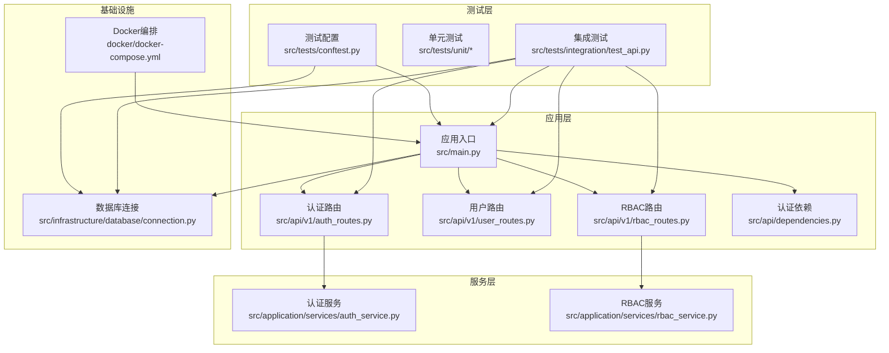
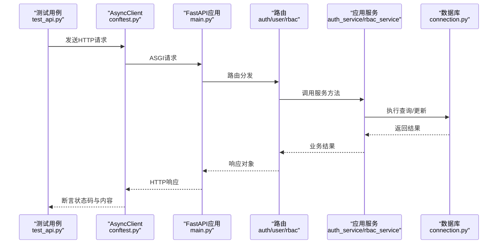
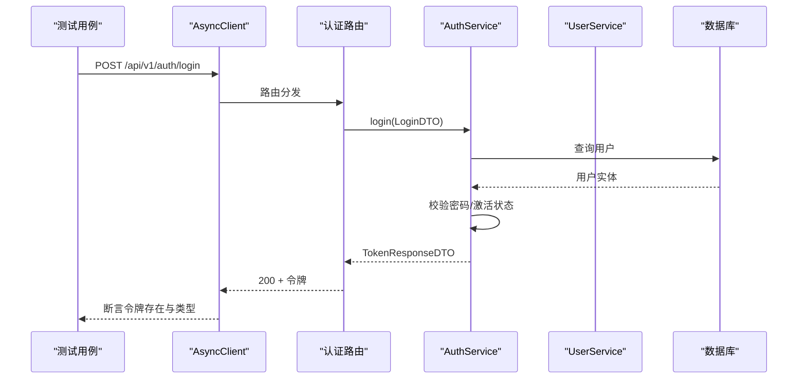
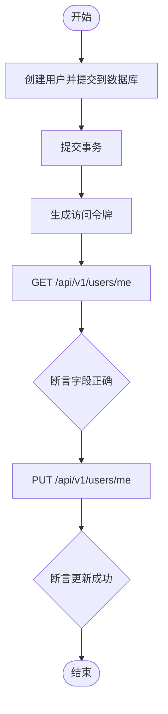
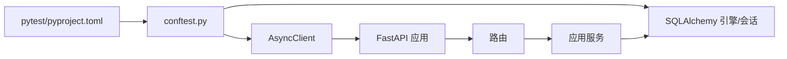

# 集成测试

<cite>
**本文引用的文件**
- [src/tests/integration/test_api.py](file://src/tests/integration/test_api.py)
- [src/tests/conftest.py](file://src/tests/conftest.py)
- [src/main.py](file://src/main.py)
- [src/api/v1/auth_routes.py](file://src/api/v1/auth_routes.py)
- [src/api/v1/user_routes.py](file://src/api/v1/user_routes.py)
- [src/api/v1/rbac_routes.py](file://src/api/v1/rbac_routes.py)
- [src/api/dependencies.py](file://src/api/dependencies.py)
- [src/application/services/auth_service.py](file://src/application/services/auth_service.py)
- [src/domain/auth/token_service.py](file://src/domain/auth/token_service.py)
- [src/infrastructure/database/connection.py](file://src/infrastructure/database/connection.py)
- [docker/docker-compose.yml](file://docker/docker-compose.yml)
- [pyproject.toml](file://pyproject.toml)
- [src/tests/unit/test_auth.py](file://src/tests/unit/test_auth.py)
- [src/tests/unit/test_core.py](file://src/tests/unit/test_core.py)
</cite>

## 目录
1. [简介](#简介)
2. [项目结构](#项目结构)
3. [核心组件](#核心组件)
4. [架构总览](#架构总览)
5. [详细组件分析](#详细组件分析)
6. [依赖分析](#依赖分析)
7. [性能考虑](#性能考虑)
8. [故障排查指南](#故障排查指南)
9. [结论](#结论)
10. [附录](#附录)

## 简介
本文件面向集成测试场景，系统性阐述本项目的API集成测试设计与实现，覆盖以下方面：
- HTTP请求测试、响应验证与错误处理测试
- 测试数据库配置与使用（内存SQLite、自动建表/删表）
- 测试环境搭建与管理（ASGI客户端、依赖注入覆盖）
- API端点测试方法（认证、RBAC权限、用户管理）
- 最佳实践（测试数据管理、并发测试、性能测试）
- 失败诊断与调试方法

## 项目结构
本项目采用分层架构与领域驱动设计（DDD），测试位于src/tests目录下，分为integration（集成测试）与unit（单元测试）。集成测试通过pytest-asyncio与httpx.AsyncClient对ASGI应用进行端到端调用；数据库使用SQLAlchemy异步引擎，测试阶段使用内存SQLite以提升速度与隔离性。

图表来源
- [src/tests/integration/test_api.py:1-143](file://src/tests/integration/test_api.py#L1-L143)
- [src/tests/conftest.py:1-58](file://src/tests/conftest.py#L1-L58)
- [src/main.py:1-83](file://src/main.py#L1-L83)
- [src/api/v1/auth_routes.py:1-34](file://src/api/v1/auth_routes.py#L1-L34)
- [src/api/v1/user_routes.py:1-115](file://src/api/v1/user_routes.py#L1-L115)
- [src/api/v1/rbac_routes.py:1-168](file://src/api/v1/rbac_routes.py#L1-L168)
- [src/api/dependencies.py:1-83](file://src/api/dependencies.py#L1-L83)
- [src/application/services/auth_service.py:1-67](file://src/application/services/auth_service.py#L1-L67)
- [src/application/services/rbac_service.py:1-158](file://src/application/services/rbac_service.py#L1-L158)
- [src/infrastructure/database/connection.py:1-51](file://src/infrastructure/database/connection.py#L1-L51)
- [docker/docker-compose.yml:1-59](file://docker/docker-compose.yml#L1-L59)

章节来源
- [src/tests/integration/test_api.py:1-143](file://src/tests/integration/test_api.py#L1-L143)
- [src/tests/conftest.py:1-58](file://src/tests/conftest.py#L1-L58)
- [src/main.py:1-83](file://src/main.py#L1-L83)
- [pyproject.toml:67-74](file://pyproject.toml#L67-L74)

## 核心组件
- 测试客户端与生命周期
  - 使用pytest-asyncio与httpx.AsyncClient，基于ASGITransport直接调用应用实例，避免真实网络开销。
  - 通过conftest中的fixture提供client与db_session，并在每次测试前后自动完成依赖注入覆盖与回滚。
- 测试数据库
  - 使用内存SQLite作为测试数据库，确保快速执行与完全隔离。
  - 在每个测试会话开始时自动建表，在结束时自动删表，保证测试间无污染。
- 应用入口与中间件
  - 应用在lifespan中初始化数据库并在关闭时释放连接。
  - 统一异常处理器将业务异常转换为JSON响应。
- 路由与依赖
  - 认证、用户、RBAC路由均通过依赖注入获取数据库会话与当前用户上下文。
  - 依赖项提供令牌解析、权限校验与超级用户校验等能力。

章节来源
- [src/tests/conftest.py:29-58](file://src/tests/conftest.py#L29-L58)
- [src/infrastructure/database/connection.py:26-51](file://src/infrastructure/database/connection.py#L26-L51)
- [src/main.py:19-83](file://src/main.py#L19-L83)
- [src/api/dependencies.py:16-83](file://src/api/dependencies.py#L16-L83)

## 架构总览
下图展示集成测试的典型调用链：测试发起HTTP请求，ASGI客户端将请求交由FastAPI应用，应用通过依赖注入获取数据库会话与当前用户上下文，路由调用应用服务层，服务层访问仓储层读写数据库，最终返回响应。

图表来源
- [src/tests/integration/test_api.py:16-143](file://src/tests/integration/test_api.py#L16-L143)
- [src/tests/conftest.py:46-58](file://src/tests/conftest.py#L46-L58)
- [src/main.py:71-79](file://src/main.py#L71-L79)
- [src/api/v1/auth_routes.py:14-33](file://src/api/v1/auth_routes.py#L14-L33)
- [src/api/v1/user_routes.py:24-114](file://src/api/v1/user_routes.py#L24-L114)
- [src/api/v1/rbac_routes.py:25-167](file://src/api/v1/rbac_routes.py#L25-L167)
- [src/application/services/auth_service.py:21-66](file://src/application/services/auth_service.py#L21-L66)
- [src/application/services/rbac_service.py:29-132](file://src/application/services/rbac_service.py#L29-L132)
- [src/infrastructure/database/connection.py:26-36](file://src/infrastructure/database/connection.py#L26-L36)

## 详细组件分析

### 健康检查端点测试
- 目标：验证应用健康检查接口返回状态正常。
- 方法：通过client.get访问/health，断言状态码与响应体字段。
- 关键路径
  - [src/tests/integration/test_api.py:16-20](file://src/tests/integration/test_api.py#L16-L20)
  - [src/main.py:71-74](file://src/main.py#L71-L74)

章节来源
- [src/tests/integration/test_api.py:16-20](file://src/tests/integration/test_api.py#L16-L20)
- [src/main.py:71-74](file://src/main.py#L71-L74)

### 认证端点测试
- 登录成功：先创建用户，再POST登录，断言返回包含访问令牌与刷新令牌且类型为bearer。
- 登录失败（错误密码）：创建用户后使用错误密码登录，断言返回未授权。
- 获取当前用户：创建用户并生成访问令牌，携带Authorization头请求/me，断言返回当前用户信息。
- 未携带令牌访问受保护端点：断言返回未授权或禁止访问。
- 关键路径
  - [src/tests/integration/test_api.py:27-91](file://src/tests/integration/test_api.py#L27-L91)
  - [src/api/v1/auth_routes.py:14-33](file://src/api/v1/auth_routes.py#L14-L33)
  - [src/application/services/auth_service.py:21-40](file://src/application/services/auth_service.py#L21-L40)
  - [src/domain/auth/token_service.py:12-26](file://src/domain/auth/token_service.py#L12-L26)
  - [src/api/dependencies.py:16-50](file://src/api/dependencies.py#L16-L50)

图表来源
- [src/tests/integration/test_api.py:27-48](file://src/tests/integration/test_api.py#L27-L48)
- [src/api/v1/auth_routes.py:14-18](file://src/api/v1/auth_routes.py#L14-L18)
- [src/application/services/auth_service.py:21-40](file://src/application/services/auth_service.py#L21-L40)

章节来源
- [src/tests/integration/test_api.py:27-91](file://src/tests/integration/test_api.py#L27-L91)
- [src/api/v1/auth_routes.py:14-33](file://src/api/v1/auth_routes.py#L14-L33)
- [src/application/services/auth_service.py:21-40](file://src/application/services/auth_service.py#L21-L40)
- [src/domain/auth/token_service.py:12-26](file://src/domain/auth/token_service.py#L12-L26)
- [src/api/dependencies.py:16-50](file://src/api/dependencies.py#L16-L50)

### 用户资料端点测试
- 获取我的资料：创建用户并生成访问令牌，GET /api/v1/users/me，断言返回用户名、邮箱、全名等字段。
- 更新我的资料：PUT /api/v1/users/me，断言返回值已更新。
- 关键路径
  - [src/tests/integration/test_api.py:98-142](file://src/tests/integration/test_api.py#L98-L142)
  - [src/api/v1/user_routes.py:49-79](file://src/api/v1/user_routes.py#L49-L79)

图表来源
- [src/tests/integration/test_api.py:98-142](file://src/tests/integration/test_api.py#L98-L142)
- [src/api/v1/user_routes.py:49-79](file://src/api/v1/user_routes.py#L49-L79)

章节来源
- [src/tests/integration/test_api.py:98-142](file://src/tests/integration/test_api.py#L98-L142)
- [src/api/v1/user_routes.py:49-79](file://src/api/v1/user_routes.py#L49-L79)

### RBAC权限端点测试
- 设计要点
  - 路由通过require_permission依赖强制权限校验，超级用户可绕过。
  - 服务层提供角色、权限的增删改查与用户角色/权限查询。
  - 集成测试建议覆盖：无权限访问被拒绝、有权限访问成功、超级用户访问成功。
- 关键路径
  - [src/api/v1/rbac_routes.py:25-167](file://src/api/v1/rbac_routes.py#L25-L167)
  - [src/api/dependencies.py:53-83](file://src/api/dependencies.py#L53-L83)
  - [src/application/services/rbac_service.py:29-132](file://src/application/services/rbac_service.py#L29-L132)

章节来源
- [src/api/v1/rbac_routes.py:25-167](file://src/api/v1/rbac_routes.py#L25-L167)
- [src/api/dependencies.py:53-83](file://src/api/dependencies.py#L53-L83)
- [src/application/services/rbac_service.py:29-132](file://src/application/services/rbac_service.py#L29-L132)

### 错误处理测试
- 未授权/禁止访问：缺少令牌或令牌无效、令牌类型不匹配、用户不存在或非激活状态。
- 业务异常：用户名或密码错误、资源冲突、资源不存在等。
- 统一异常处理：应用层将业务异常转换为JSON响应，集成测试断言状态码与错误消息。
- 关键路径
  - [src/application/services/auth_service.py:24-31](file://src/application/services/auth_service.py#L24-L31)
  - [src/api/dependencies.py:20-31](file://src/api/dependencies.py#L20-L31)
  - [src/main.py:56-69](file://src/main.py#L56-L69)

章节来源
- [src/application/services/auth_service.py:24-31](file://src/application/services/auth_service.py#L24-L31)
- [src/api/dependencies.py:20-31](file://src/api/dependencies.py#L20-L31)
- [src/main.py:56-69](file://src/main.py#L56-L69)

## 依赖分析
- 测试依赖
  - pytest、pytest-asyncio、httpx、SQLAlchemy异步引擎与会话工厂。
  - 通过conftest中的fixture注入数据库引擎、会话与ASGI客户端。
- 运行时依赖
  - FastAPI应用在lifespan中初始化数据库；路由依赖数据库会话与认证依赖项。
- 外部依赖
  - Docker Compose用于本地开发与CI环境的数据库与缓存服务。

图表来源
- [pyproject.toml:67-74](file://pyproject.toml#L67-L74)
- [src/tests/conftest.py:14-58](file://src/tests/conftest.py#L14-L58)
- [src/main.py:19-83](file://src/main.py#L19-L83)

章节来源
- [pyproject.toml:67-74](file://pyproject.toml#L67-L74)
- [src/tests/conftest.py:14-58](file://src/tests/conftest.py#L14-L58)
- [src/main.py:19-83](file://src/main.py#L19-L83)

## 性能考虑
- 数据库性能
  - 测试使用内存SQLite，避免磁盘IO瓶颈；如需更贴近生产，可在CI中使用PostgreSQL容器。
  - 使用事务与会话池减少连接开销；注意在测试结束后及时释放连接。
- 并发测试
  - 使用pytest-asyncio支持异步并发；建议将共享资源（如数据库）隔离到独立会话或测试类级fixture。
  - 对高并发场景，可在路由层增加速率限制与缓存策略（如Redis），并通过集成测试验证行为。
- 端到端性能
  - 通过ASGI直连避免网络延迟；如需模拟真实网络，可引入代理或自定义Transport。
- 参考实现
  - [docker/docker-compose.yml:1-59](file://docker/docker-compose.yml#L1-L59)

章节来源
- [docker/docker-compose.yml:1-59](file://docker/docker-compose.yml#L1-L59)

## 故障排查指南
- 常见问题与定位
  - 401/403未授权：检查令牌生成逻辑、令牌类型与过期时间、依赖项是否正确解析令牌。
    - [src/domain/auth/token_service.py:12-26](file://src/domain/auth/token_service.py#L12-L26)
    - [src/api/dependencies.py:16-31](file://src/api/dependencies.py#L16-L31)
  - 403权限不足：确认用户权限集合、require_permission依赖与超级用户判定。
    - [src/api/dependencies.py:53-83](file://src/api/dependencies.py#L53-L83)
  - 500内部错误：检查全局异常处理器与日志记录。
    - [src/main.py:56-69](file://src/main.py#L56-L69)
- 单元测试辅助
  - 通过单元测试验证密码哈希、令牌编码/解码、邮箱与密码强度等基础能力。
    - [src/tests/unit/test_auth.py:1-68](file://src/tests/unit/test_auth.py#L1-L68)
    - [src/tests/unit/test_core.py:1-37](file://src/tests/unit/test_core.py#L1-L37)
- 调试技巧
  - 在conftest中临时开启SQLAlchemy echo或应用日志级别，观察SQL与请求链路。
  - 使用pytest --log-cli-level=DEBUG查看运行时日志。
  - 对复杂流程绘制序列图，逐步缩小问题范围。

章节来源
- [src/domain/auth/token_service.py:12-26](file://src/domain/auth/token_service.py#L12-L26)
- [src/api/dependencies.py:16-31](file://src/api/dependencies.py#L16-L31)
- [src/api/dependencies.py:53-83](file://src/api/dependencies.py#L53-L83)
- [src/main.py:56-69](file://src/main.py#L56-L69)
- [src/tests/unit/test_auth.py:1-68](file://src/tests/unit/test_auth.py#L1-L68)
- [src/tests/unit/test_core.py:1-37](file://src/tests/unit/test_core.py#L1-L37)

## 结论
本项目的集成测试通过ASGI直连与内存数据库实现了高效、隔离的端到端验证。测试覆盖了认证、用户管理与RBAC权限三大核心域，配合统一异常处理与依赖注入机制，能够稳定地发现集成层面的问题。建议在CI中引入PostgreSQL容器与并发测试策略，持续提升测试覆盖率与稳定性。

## 附录
- 测试环境搭建
  - 安装开发依赖：pytest、pytest-asyncio、httpx、SQLAlchemy等。
  - 运行命令示例：pytest -m integration -v
  - CI参考：docker-compose提供数据库与缓存服务，便于在容器内运行测试。
- 测试数据管理
  - 使用测试数据库的内存特性快速准备与清理数据；必要时在测试类中复用用户与角色数据。
- 并发与性能
  - 优先使用异步并发；对热点接口增加缓存与限流策略，并在集成测试中验证行为。
- 诊断清单
  - 令牌生成与解析是否正确
  - 权限依赖是否生效
  - 业务异常是否按约定返回
  - 数据库连接是否正确初始化与释放

章节来源
- [pyproject.toml:67-74](file://pyproject.toml#L67-L74)
- [docker/docker-compose.yml:1-59](file://docker/docker-compose.yml#L1-L59)